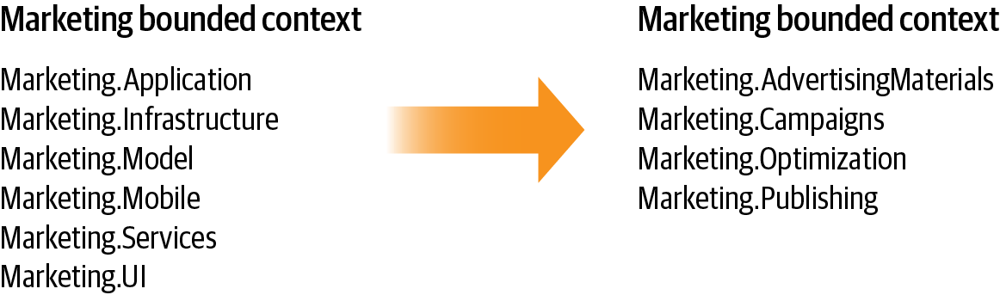
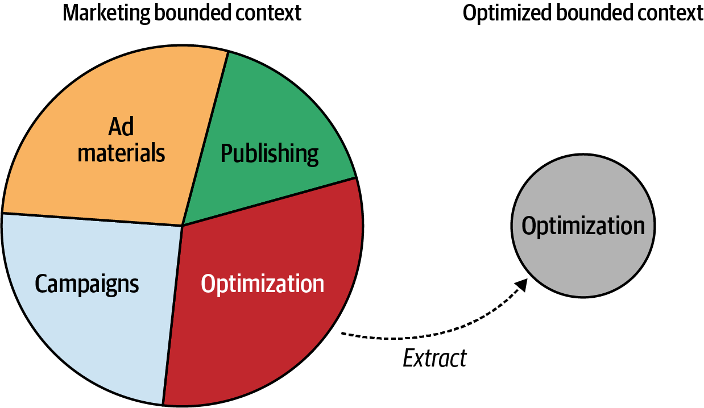
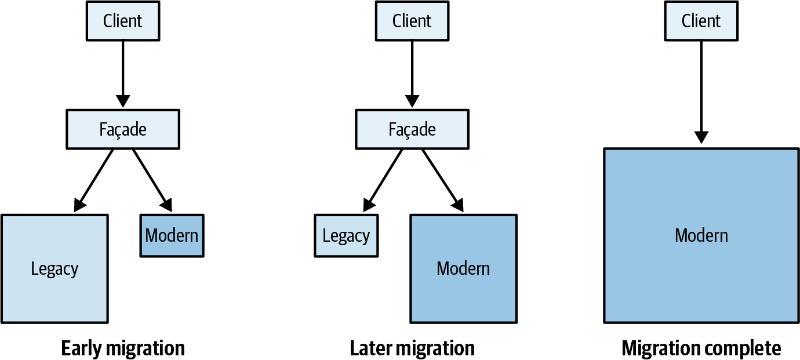
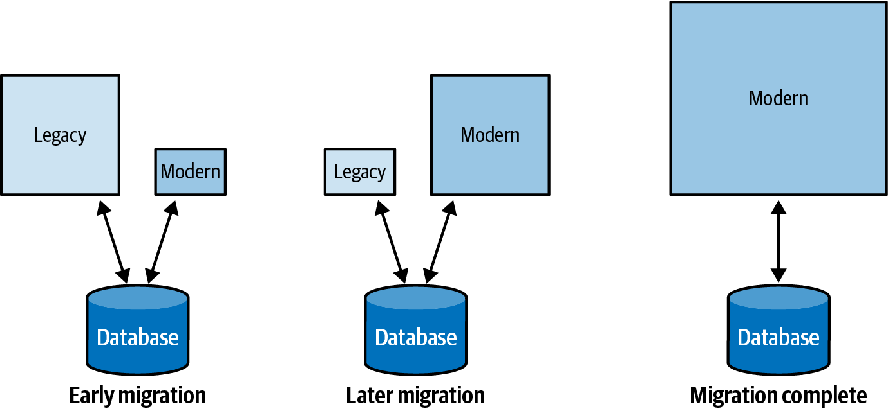

### Chapter 13: Domain-Driven Design in the Real World - Summary

This chapter provides practical strategies for applying Domain-Driven Design (DDD) principles and patterns in real-world scenarios, particularly in **brownfield projects** and legacy systems. It argues against the common misconceptions that DDD is only for greenfield projects or that it's an "all-or-nothing" methodology. The core message is that DDD's value is most profound in complex, existing systems, and its tools can be introduced incrementally and pragmatically to fight technical debt and align software with business needs.

---

### Strategic Analysis in Brownfield Projects

The first step in applying DDD to an existing system is to perform a thorough strategic analysis to understand the business domain and the current state of the architecture.

#### 1. Understand the Business Domain
Start by getting a high-level view:
*   What is the business domain?
*   Who are the customers and what value is provided?
*   Who are the competitors?

Next, identify the subdomains. Use the company's organizational chart as a starting heuristic. Look for specific types:
*   **Core Subdomains:** Find the "secret sauce." What differentiates the company? This could be IP, unique algorithms, or even non-technical advantages. A powerful heuristic is to look for the "big ball of mud" components that are business-critical and too risky to replace with an off-the-shelf solution.
*   **Generic Subdomains:** Look for off-the-shelf software, subscription services, or open source integrations.
*   **Supporting Subdomains:** Identify the remaining in-house components that are necessary but not a competitive advantage. They often change infrequently.

#### 2. Explore the Current Design
With an understanding of the problem domain, investigate the solution space:
*   **Evaluate Tactical Design:** For each high-level component, identify which subdomains it implements and which technical patterns (business logic, architecture) it uses. Assess if the solution's complexity matches the problem's complexity.
*   **Evaluate Strategic Design:** Create a **context map** of the existing system, treating its high-level components as bounded contexts. Look for architectural anti-patterns from a DDD perspective:
    *   Multiple teams working on the same component.
    *   Duplicated implementations of a core subdomain.
    *   A core subdomain implemented by an outsourced team.
    *   Friction from failing integrations.
    *   "Leaky" models from legacy or external systems.

#### 3. Recover Lost Knowledge
In legacy systems, domain knowledge is often lost. Use **Event Storming** sessions to recover this knowledge, build a ubiquitous language, and get a shared understanding of the business processes, especially for complex and critical core subdomains.

---

### Modernization Strategy

The goal is to improve the design incrementally ("think big, start small"), not through a "big rewrite." Focus modernization efforts where they provide the most business value.

#### Start with Logical Boundaries
The safest first step is to refactor the codebase to align **logical boundaries** (namespaces, modules, packages) with the identified subdomain boundaries. This is a low-risk change that organizes the code without altering business logic.

#### Strategic Modernization
Turn logical boundaries into physical boundaries (i.e., extract new bounded contexts) where it adds the most value:
*   When multiple teams are working on the same codebase, extract a bounded context for each to decouple their work.
*   When a single component contains conflicting models, separate them into their own bounded contexts.

Once boundaries are in place, review the **context map** and refactor integration patterns to solve communication problems (e.g., introduce an ACL to protect from a legacy system, define an OHS for a service with many consumers).

#### Tactical Modernization
Focus on the most "painful" mismatches between a subdomain's business value and its implementation. A prime target is a **core subdomain** implemented with a simplistic pattern like a Transaction Script or Active Record.

**Cultivate a Ubiquitous Language:** Use Event Storming to build a shared language and model before refactoring code.

**The Strangler Fig Pattern:**
This is a powerful pattern for gradual migration.
1.  Create a new, modern bounded context (the "strangler").
2.  Implement new features in the strangler and gradually migrate functionality from the legacy context.
3.  Use a **Façade** to route incoming requests to either the legacy or the new system.
4.  Eventually, the legacy system ("host tree") is fully replaced and can be decommissioned.

During a strangler migration, it is permissible to **temporarily share a database** between the legacy and new contexts to simplify the process, with the firm condition that the legacy context will eventually be retired.

**Refactoring In-Place:**
*   **Take small, incremental steps.** Don't refactor a Transaction Script directly to an Event-Sourced Domain Model. Go to a state-based Domain Model first to solidify aggregate boundaries, which are easier to change in a state-based model.
*   **Introduce domain model elements gradually.** Start by identifying and creating **Value Objects**. Then, move logic into entities and define aggregate boundaries based on transactional consistency requirements.

---

### Pragmatic and "Undercover" DDD

Applying DDD is not an all-or-nothing choice. The core principle is simply to **let the business domain drive software design decisions.**

#### Selling Domain-Driven Design
Instead of trying to "sell" the entire methodology to management, introduce its practices "undercover" as part of your professional toolkit.
*   **Ubiquitous Language:** Listen to domain experts, gently steer conversations away from technical jargon, clarify ambiguous terms, and use the business language in your code and communications.
*   **Bounded Contexts & Tactical Patterns:** Don't appeal to authority ("the DDD book says so"). Instead, appeal to **logic and first principles**.
    *   *Why not one big model?* "All-in-one solutions are rarely effective."
    *   *Why not modify an aggregate's state externally?* "To ensure business rules are co-located and not duplicated."
    *   *Why small aggregates?* "To reduce complexity and avoid performance issues from wide transaction scopes."
*   **Event Sourcing:** To get buy-in for this seemingly radical pattern, show the state-based and event-based models to **domain experts**. They will often become the biggest advocates once they see the business insights and historical perspective it provides.

Why are explicit transactional boundaries important? To protect the consistency of the data.

Why can’t a database transaction modify more than one instance of an aggregate? To ensure that the consistency boundaries are correct.

Why can’t an aggregate’s state be modified directly by an external component? To ensure that all the related business logic is co-located and not duplicated.

Why can’t we offload some of the aggregate’s functionality to a stored procedure? To make sure that no logic is duplicated. Duplicated logic, especially in logically and physically distant components of a system, tends to go out of sync and lead to data corruption.

Why should we strive for small aggregate boundaries? Because wide transactional scope will both increase the complexity of the aggregate and negatively impact the performance.

Why, instead of event sourcing, can’t we just write events to a logfile? Because there are no long-term data consistency guarantees.

---

### Actionable Tips from Chapter 13

> **1. Start with Analysis, Not Code.** Before refactoring, analyze the business domain to identify its subdomains (Core, Supporting, Generic) and create a context map of the current system to find pain points.

> **2. Think Big, Start Small; Avoid the "Big Rewrite".** Plan a holistic modernization strategy but implement it in small, incremental steps. Focus on the areas that deliver the most business value first.

> **3. Refactor Logical Boundaries First.** The safest initial step is to reorganize your codebase's modules and packages to reflect subdomain boundaries. This improves clarity with minimal risk.

> **4. Use the Strangler Fig Pattern for Gradual Replacement.** When replacing a legacy component, create a new bounded context and migrate functionality over time, using a façade to direct traffic. It's the safest way to modernize critical systems.

> **5. Refactor Incrementally and Safely.** When improving a model, take gradual steps. Refactor from Active Record to a state-based Domain Model *before* attempting a move to Event Sourcing. This makes it easier to find the correct aggregate boundaries.

> **6. Use Event Storming to Recover Lost Knowledge.** For poorly documented legacy systems, an Event Storming workshop is the best tool to recover domain knowledge, build a ubiquitous language, and align the team before modernization.

> **7. Apply DDD "Undercover".** You don't need official buy-in to use DDD. Introduce its concepts by appealing to logic and first principles, not by naming the methodology. Solve problems using the patterns and explain the *why* in simple, logical terms.

> **8. Make the Ubiquitous Language Your Trojan Horse.** The easiest and most impactful practice to start with is the ubiquitous language. Listen to experts, use their terms, and reflect that language in your code. It's common sense and builds a foundation for all other patterns.

> **9. Temporarily Bend the Rules for Migration.** During a Strangler Fig migration, it's pragmatic and acceptable to have the new and old contexts share a database to avoid complex integration, as long as the legacy context is on a clear path to retirement.

> **10. Remember the Core Principle.** DDD is not about a specific set of patterns. It's a mindset focused on letting the needs of the business domain drive your software design decisions. 