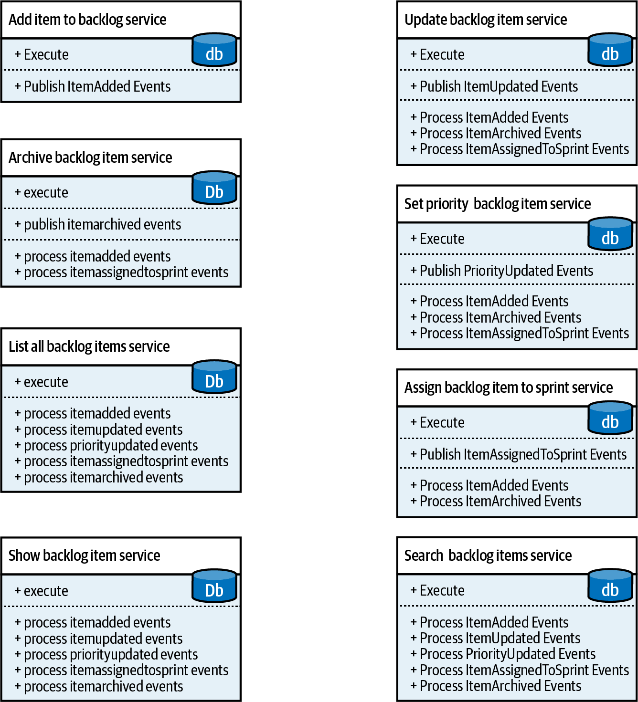

### Chapter 14: Microservices - Summary

This chapter dissects the historically intertwined yet often misunderstood relationship between Domain-Driven Design (DDD) and the microservices architectural style. It argues that the common practice of equating microservices with bounded contexts is an oversimplification. The chapter defines a microservice not by its size in lines of code, but by its **"micro public interface."** It introduces the critical trade-off between **local complexity** (of a single service) and **global complexity** (of the entire system), arguing that the goal of microservice design is to balance both, not to minimize one at the expense of the other. By leveraging DDD patterns, the chapter provides clear heuristics for identifying effective service boundaries—primarily aligning them with **subdomains**—to create "deep" services that avoid the dreaded "distributed big ball of mud."

---

### What is a Microservice?

A service is a mechanism that exposes capabilities through a prescribed public interface. A **microservice**, therefore, is simply a service with a **micro public interface**. This small "front door" is what makes the service's function easy to understand and limits its reasons for change, promoting autonomy.

*   **Database Encapsulation:** This definition explains why microservices must encapsulate their databases. Exposing a database via SQL would create a massive, almost infinite public interface, violating the core principle.
*   **The "Method as a Service" Fallacy:** A naive decomposition where every method becomes a service is a fallacy. While it minimizes the initial front door (local complexity), the services become unable to function without extensive, chatty integrations, creating enormous "staff only" entrances and leading to a **distributed big ball of mud** (high global complexity).

---

### Balancing System Complexity

Effective system design requires balancing two types of complexity:
*   **Local Complexity:** The complexity within a single microservice.
*   **Global Complexity:** The complexity of the overall system structure, defined by the interactions and dependencies *between* services.

Optimizing for only one type leads to failure. Minimizing global complexity to zero results in a monolith (which can become a "big ball of mud"). Minimizing only local complexity results in a distributed big ball of mud. The goal is to find the global optimum that balances both.

---

### Microservices as Deep Modules

Borrowing from John Ousterhout's *A Philosophy of Software Design*, an effective module (or service) should be **deep**.
*   **Deep Module:** A module with a simple public interface (its function) that encapsulates a large amount of complex logic (its implementation).
*   **Shallow Module:** A module where the interface is nearly as complex as its implementation (e.g., a service with a single, simple method). Shallow modules increase global complexity.

Microservices should be designed as **deep modules**. The pursuit of services that are small in "lines of code" or "easy to rewrite" misses the point and often leads to shallow services and a complex system. The cost of change is lowest at the optimal "microservice" granularity; decomposing further makes services shallower and increases the cost of change due to integration overhead.

---

### Domain-Driven Design and Microservices’ Boundaries

DDD provides the tools to find the boundaries of deep services.

#### Bounded Contexts
*   **The Relationship:** All microservices are bounded contexts, but **not all bounded contexts are microservices.**
*   **Boundary Type:** A bounded context defines the **widest possible valid service boundary**. Its purpose is to protect a model's consistency. Decomposing a system into services with boundaries wider than a bounded context will result in a "big ball of mud."

#### Aggregates
*   **Boundary Type:** An aggregate represents the **narrowest possible indivisible business boundary**. Decomposing an aggregate into multiple services is a serious design error.
*   **As a Service:** Using a single aggregate as a microservice is often a poor choice. It can lead to a **shallow service** if the aggregate is highly coupled with other components in its subdomain, thus increasing global complexity.

#### Subdomains
*   **The Sweet Spot:** Aligning microservice boundaries with **subdomain boundaries** is the safest and most balanced heuristic.
*   **Why it Works:** Subdomains represent coherent business capabilities (a set of related use cases using the same model). This makes them naturally **deep modules**, where the function (the capability) encapsulates the complex implementation logic.

---

### Compressing Microservices’ Public Interfaces

DDD patterns can be used to simplify interfaces, making services deeper.

*   **Open-Host Service (OHS):** An OHS uses a **Published Language**—an integration-oriented model separate from its internal domain model. This simplifies the service's public interface for consumers, hiding irrelevant internal complexity and making the service deeper.
*   **Anticorruption Layer (ACL):** An ACL protects a consuming service from a complex or poorly designed producer. By translating the producer's model into a cleaner one, the ACL compresses the interface the consuming service has to deal with, reducing its local complexity and the system's global complexity.

---

### Actionable Tips from Chapter 14

> **1. Define a Microservice by Its Interface, Not Its Size.** A microservice is a service with a "micro public interface." Forget metrics like lines of code; focus on minimizing the surface area of the service's contract.

> **2. Optimize for Total System Complexity.** Don't just try to make individual services simple (local complexity). The goal is to balance local simplicity with the complexity of inter-service interactions (global complexity) to avoid a distributed big ball of mud.

> **3. Design "Deep" Services.** Strive to create services that are deep modules: they should have simple, narrow public interfaces that hide significant implementation logic and complexity.

> **4. Use Subdomains as Your Default Service Boundary.** The safest and most effective heuristic for defining microservice boundaries is to align them with business subdomains. Subdomains represent coherent capabilities and naturally form deep modules.

> **5. Know Your Boundary Limits.** A **Bounded Context** is the *widest* valid boundary for a service. An **Aggregate** is the *narrowest* indivisible unit. The optimal microservice boundary lies somewhere in between, and decomposing past an aggregate is a critical error.

> **6. Don't Automatically Turn Every Aggregate into a Service.** While tempting, this often creates fine-grained, "shallow" services that increase global system complexity due to high coupling and integration chatter.

> **7. Use Published Languages (OHS) to Simplify Interfaces.** Decouple your service's public contract from its internal domain model. This allows the internal model to evolve freely while providing a stable, simpler interface for consumers, making your service deeper.

> **8. Use Anticorruption Layers (ACL) to Tame External Complexity.** When integrating with complex, messy, or legacy systems, use an ACL to translate their model into one that is clean and convenient for your service, thus compressing your service's effective interface.

> **9. Recognize the Asymmetric Relationship with Bounded Contexts.** Remember: all microservices are bounded contexts, but not all bounded contexts are microservices. A bounded context can be a well-structured monolith, which is a valid design choice.

> **10. Avoid Premature and Over-Decomposition.** The cost of change is high for monoliths but also for overly granular, shallow services. Aim for the "sweet spot" of deep microservices that balances local and global complexity. 