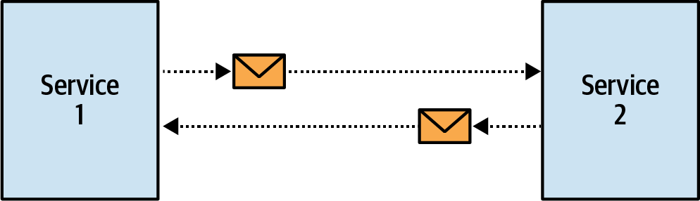

### Chapter 15: Event-Driven Architecture - Summary

This chapter explores the relationship between Domain-Driven Design (DDD) and Event-Driven Architecture (EDA), clarifying that they are not the same and that using them together requires careful design. It argues that carelessly exposing a service's internal domain events for integration leads to a "distributed big ball of mud." The chapter defines the core building blocks of EDA, outlines the three primary types of events (Notification, Event-Carried State Transfer, and Domain Event), and provides heuristics for choosing the right event type for the right job. The central message is that events used for inter-service communication must be treated as a crucial part of a bounded context's public interface, designed with the consumer's needs and consistency requirements in mind, rather than simply exposing internal implementation details.

---

### Event-Driven Architecture vs. Event Sourcing

It is critical to distinguish between EDA and Event Sourcing, as they operate at different scopes.

*   **Event-Driven Architecture (EDA):** An architectural style for **inter-service communication**. Components integrate asynchronously by publishing and subscribing to events.
*   **Event Sourcing:** A persistence pattern for **intra-service state management**. An aggregate's state is stored as a sequence of its own internal domain events.

The events designed for Event Sourcing are meant to capture the fine-grained state transitions of an aggregate and are not suited for direct use as integration events.



---

### The Three Types of Events

Events are messages describing something that has already happened (past tense). They differ from commands, which are instructions that can be rejected. Depending on their payload and intent, events fall into three categories.

#### 1. Event Notification
A lightweight message that notifies subscribers that a significant change occurred, but contains minimal data. To get more details, the consumer must proactively query the producer.

**Example:**
```json
{
  'type': 'paycheck-generated',
  'event-id': '537ec7c2-d1a1-2005-8654-96aee1116b72',
  'delivery-id': '05011927-a328-4860-a106-737b2929db4e',
  'timestamp': 1615726445,
  'payload': {
        'employee-id': '456123',
        'link': '/paychecks/456123/2021/01'
  }
}
```


**Use Cases:**
*   **Security:** Prevents sensitive data from being broadcast on messaging infrastructure. The consumer must be authorized to query for the details.
*   **Concurrency:** Ensures the consumer gets the most up-to-date state by querying at the moment of processing, avoiding issues with stale data in the event payload.

#### 2. Event-Carried State Transfer (ECST)
A message that carries the data representing a state change in the producer. It effectively acts as an asynchronous data replication mechanism, allowing consumers to maintain a local cache of the producer's data. The payload can be a full snapshot of the entity or just the fields that changed (a delta).

**Example (Delta):**
```json
{
  'type': 'customer-updated',
  'event-id': '6b7ce6c6-8587-4e4f-924a-cec028000ce6',
  'customer-id': '01b18d56-b79a-4873-ac99-3d9f767dbe61',
  'timestamp': 1615728520,
  'payload': {
        'status': 'follow-up-set',
        'follow-up-date': '2021/05/10',
        'version': 8
  }
}
```


**Use Cases:**
*   **Fault Tolerance:** Consumers can continue to function using their local cache even if the producer service is unavailable.
*   **Performance:** Reduces the need for frequent synchronous queries by keeping necessary data local to the consumer.

#### 3. Domain Event
A message that models a significant business event, as described in DDD. It contains all data relevant to the event itself. While it carries data, its primary intent is to model the business domain, not to facilitate state transfer for integration.

**Example:**
```json
{
  'type': 'married',
  'person-id': '01b9a761',
  'payload': {
        'person-id': '126a7b61',
        'assumed-partner-last-name': true
  }
}
```

**Key Differences:**
*   **vs. Event Notification:** Domain Events contain full information about the event; notifications are minimal.
*   **vs. ECST:** Domain Events describe a business occurrence; ECST messages describe a change in data state. The modeling intent is completely different. Exposing all internal domain events for integration is a major anti-pattern.

---

### How to Create a Distributed Big Ball of Mud

Careless use of events leads to tightly coupled systems. A common anti-pattern is to have consumer services subscribe directly to all the internal domain events of a producer, especially one using Event Sourcing.


This creates three types of coupling:
1.  **Implementation Coupling:** Consumers are coupled to the producer's internal implementation details. Any change to the producer's events (adding a new one, changing a schema) forces changes on all consumers.
2.  **Logical Coupling:** If multiple consumers need the same data representation, they end up duplicating the same projection logic, creating a maintenance nightmare.
3.  **Temporal Coupling:** Consumers become dependent on a specific order of processing. In the example, Reporting has to artificially wait for AdsOptimization to finish, a fragile and unreliable solution.

### Refactoring to a Decoupled Design

The solution is to treat integration events as a well-defined public contract (a Published Language), completely decoupled from the producer's internal model.


**The Fixes:**
*   **Tackle Implementation & Logical Coupling:** The producer (CRM) encapsulates the projection logic. Instead of publishing its internal domain events, it projects the data consumers need and publishes a dedicated **ECST** event as part of its public interface.
*   **Tackle Temporal Coupling:** The first component (AdsOptimization) publishes an **Event Notification** when its work is complete. This explicitly triggers the second component (Reporting) to query it for the necessary data, creating a clear and reliable workflow.

---

### Actionable Tips / Design Heuristics from Chapter 15

> **1. Treat Integration Events as a Public API.** Do not expose a service's internal domain events directly. Instead, design a dedicated set of "public events" as part of your bounded context's Published Language.

> **2. Assume the Worst (Be Paranoid).** Design for failure. Assume events will be slow, arrive out of order, or be duplicated. Use the Outbox Pattern for reliable publishing, include correlation/sequence IDs for ordering and deduplication, and use Sagas for complex cross-context processes.

> **3. Match the Event Type to the Consistency Need.**
>  *   If the consumer can work with eventually consistent data, use **Event-Carried State Transfer (ECST)**.
>  *   If the consumer must have the absolute latest data, use an **Event Notification** to trigger a direct, synchronous query to the producer.

> **4. Encapsulate Projection Logic in the Producer.** If multiple consumers need the same view of data, the producer should be responsible for creating that projection and publishing it via a stable ECST event. This avoids duplicating logic across consumers.

> **5. Distinguish Between Public and Private Events.** Internal domain events (especially in event-sourced systems) are private. Public events (ECST, Notifications) are for integration. This follows the Open-Host Service pattern and prevents implementation coupling.

> **6. Break Temporal Coupling with Explicit Signals.** If Service B depends on a calculation in Service A, don't use fragile `sleep()` delays. Have Service A publish an Event Notification like `CalculationCompleted` that explicitly signals Service B to begin its work.

> **7. Use Domain Events Sparingly for Integration.** While powerful internally, domain events should rarely cross bounded context boundaries. If they must, design a dedicated, stable set of *public* domain events separate from the internal ones. 