### Chapter 16: Data Mesh - Summary

This chapter introduces **Data Mesh**, an architectural approach for managing analytical (OLAP) data that applies the core principles of Domain-Driven Design. It contrasts this modern paradigm with traditional analytical data platforms like the Data Warehouse and Data Lake, highlighting their scalability and ownership challenges. The chapter argues that just as monolithic operational systems fail at scale, so do monolithic data platforms. The Data Mesh solution is to decentralize data ownership, aligning analytical data products with the business's **bounded contexts**. It is based on four principles: domain-oriented decomposition, data as a product, a self-serve data platform, and federated governance. The chapter concludes by showing how DDD patterns like CQRS and Open-Host Service are natural fits for implementing a Data Mesh architecture.

---

### Analytical (OLAP) vs. Transactional (OLTP) Data Models

Operational and analytical systems serve different purposes and thus require different data models.

*   **Transactional (OLTP) Model:** Designed for operational systems to support real-time business transactions. It's optimized for writes and structured around business entities.
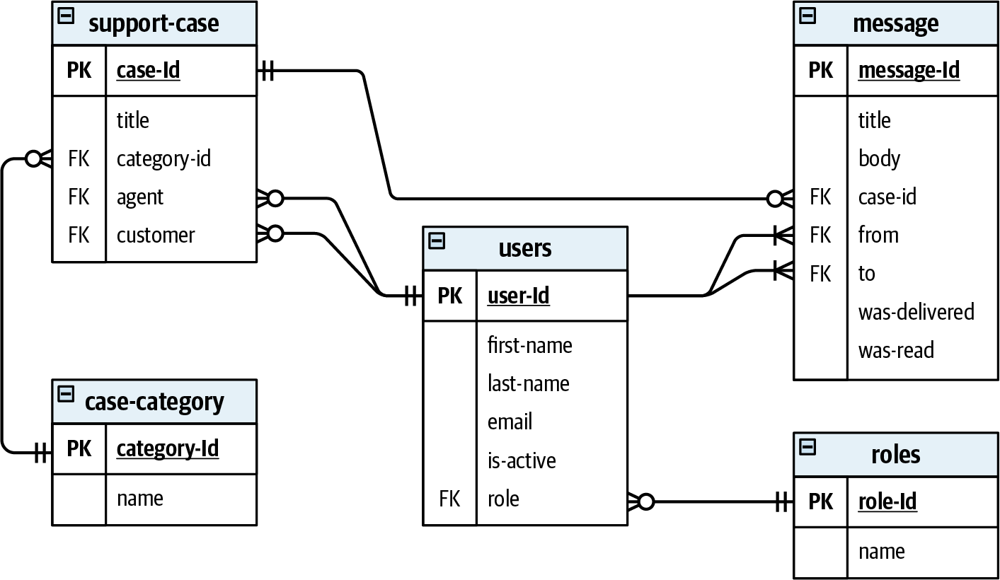
*   **Analytical (OLAP) Model:** Designed to provide business insights from historical data. It's optimized for complex, ad-hoc queries and is structured around business activities. Its core components are **Fact Tables** and **Dimension Tables**.

#### Fact and Dimension Tables

*   **Fact Table:** Represents business activities or events that have occurred (e.g., `Fact_Sales`, `Fact_CustomerOnboardings`). Facts are immutable and append-only.
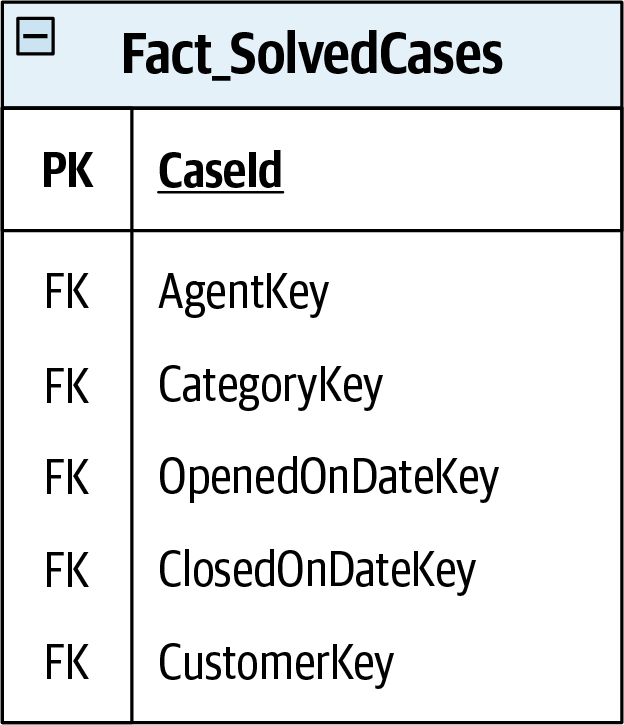
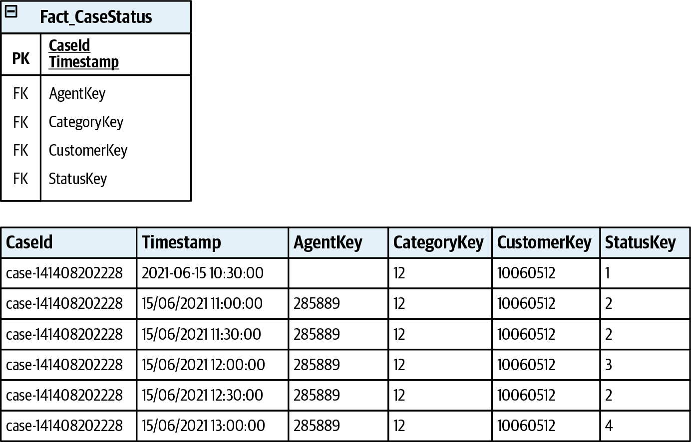
*   **Dimension Table:** Describes the attributes of a fact (the "adjectives"). Dimensions provide context (e.g., `Dim_Customer`, `Dim_Date`, `Dim_Product`) and are referenced by foreign keys from the fact table. They are highly normalized to support flexible querying.

#### Analytical Schemas
*   **Star Schema:** The most common OLAP schema, with a central fact table connected directly to multiple dimension tables.
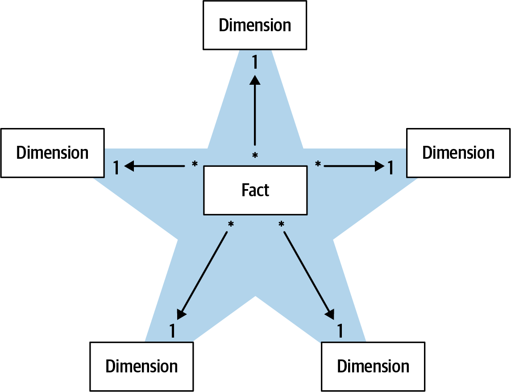
*   **Snowflake Schema:** An extension of the star schema where the dimension tables are further normalized into their own related tables, creating a more complex, snowflake-like pattern.
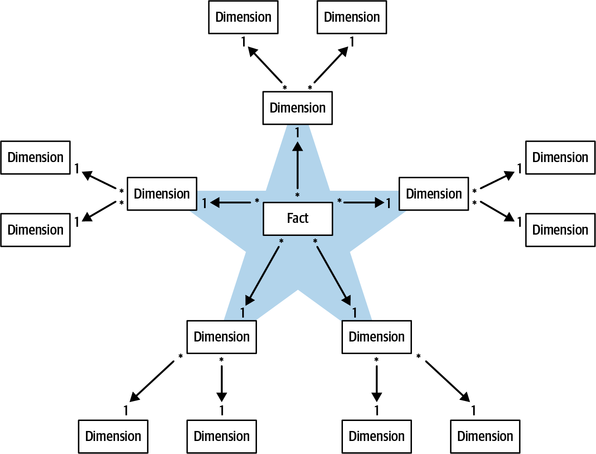

---

### Traditional Analytical Data Platforms & Their Challenges

#### Data Warehouse (DWH)
A centralized repository where data from various operational systems is extracted, transformed into a unified analytical model (ETL), and loaded for analysis.
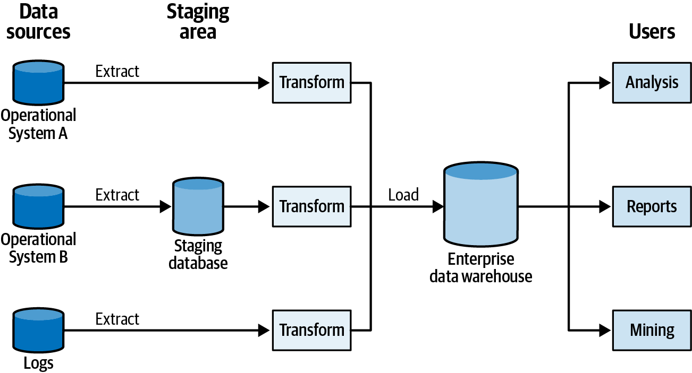
*   **Challenge 1: Monolithic Model:** A single enterprise-wide model is impractical and fails to scale. **Data marts** (smaller, department-focused warehouses) can help but hinder cross-department analysis.
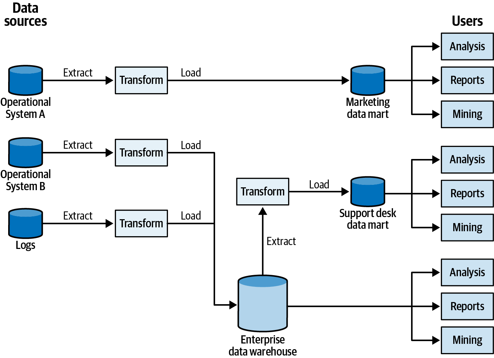
*   **Challenge 2: High Coupling:** ETL processes often bypass public APIs and couple directly to the internal database schemas of operational systems, making the operational systems fragile and difficult to change.
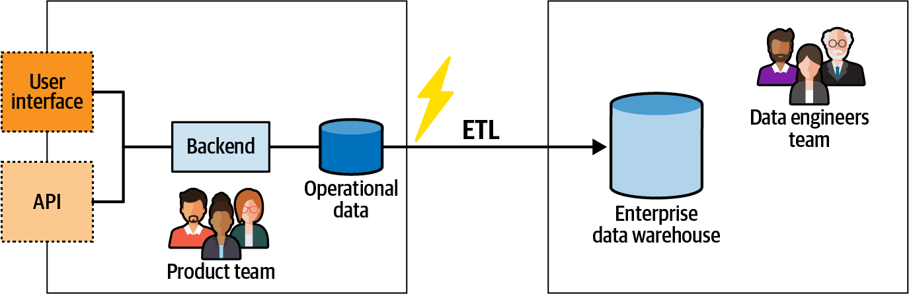

#### Data Lake
A centralized repository that stores vast amounts of raw data from operational systems in its original format. Transformation into analytical models happens later, on-demand.
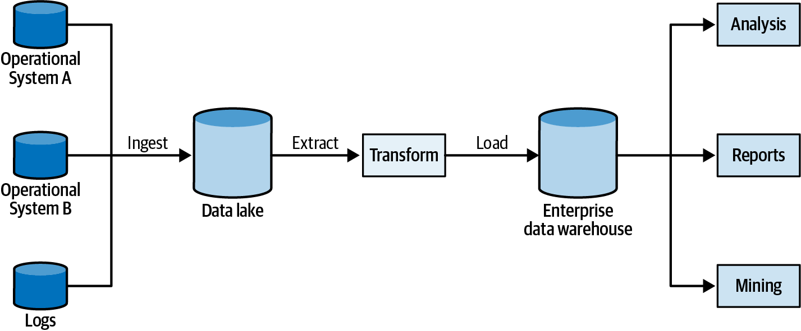
*   **Challenge: Data Swamp:** Because data is ingested without an enforced schema or quality control, a data lake can easily devolve into a chaotic, unusable "data swamp." This increases the complexity for data scientists who must make sense of the chaos.
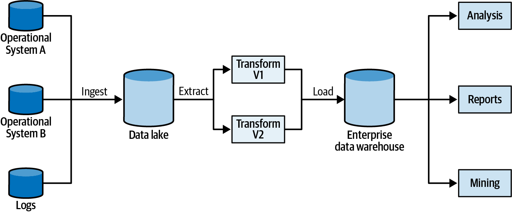

---

### Data Mesh: DDD for Analytical Data

Data Mesh is a decentralized sociotechnical approach to data architecture based on four core principles.

#### 1. Decompose Data Around Domains
Instead of a central data monolith, analytical data ownership is distributed to the teams that own the operational systems. The analytical model's boundaries are aligned with the source **bounded context's** boundaries.
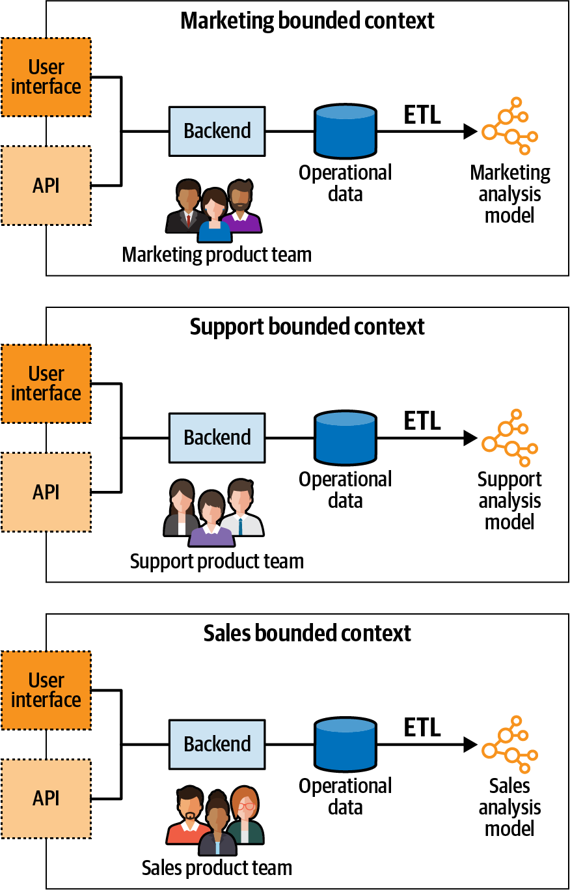

#### 2. Data as a Product
Each domain's analytical data is treated as a first-class product, served through well-defined, trustworthy public interfaces (output ports).
*   **Discoverable, Addressable, Trustworthy:** Data products must have clear schemas, SLAs, and versioning, just like any other API.
*   **Polyglot:** They should serve data in multiple formats (e.g., SQL queries, files in object storage) to meet diverse consumer needs.
*   **Accountability:** The domain team is accountable for the quality and utility of its data product.
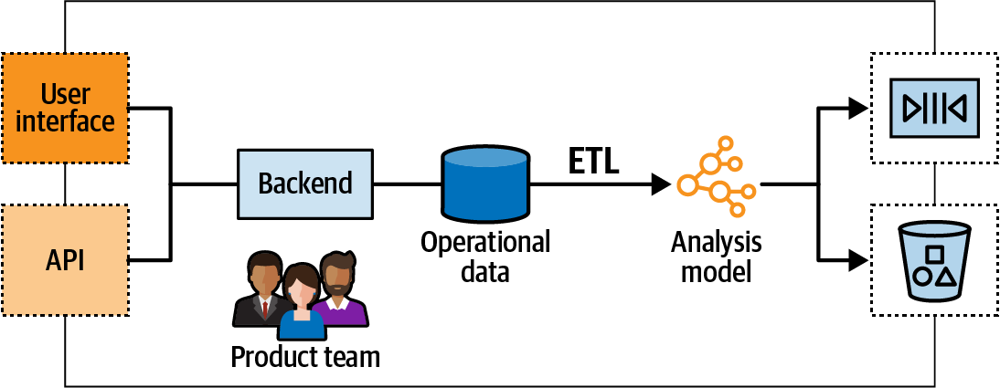

#### 3. Enable Autonomy (via a Self-Serve Platform)
A central **data infrastructure platform team** builds and maintains a platform that enables domain teams to easily build, deploy, and manage their data products autonomously. This platform abstracts away the underlying technical complexity.

#### 4. Build an Ecosystem (via Federated Governance)
A governance body composed of data owners from the domains and platform team representatives establishes and enforces enterprise-wide standards to ensure that the distributed data products are interoperable and form a healthy, cohesive ecosystem.
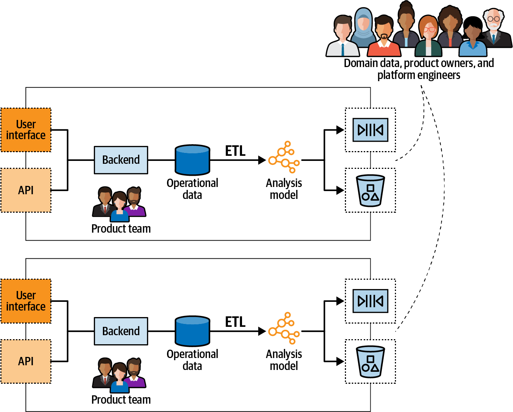

---

### Combining Data Mesh and Domain-Driven Design

Data Mesh is a natural extension of DDD principles into the analytical data space.
*   **Open-Host Service:** A data product is a form of OHS, where the analytical model serves as another **Published Language** for the bounded context.
*   **CQRS:** This pattern is a perfect fit for implementing data products. The operational system is the "write model," and the CQRS mechanism can be used to generate and maintain the analytical "read model." This also simplifies serving multiple versions of the analytical model simultaneously.
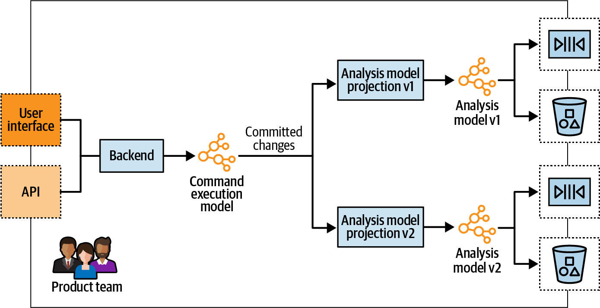
*   **Bounded Context Integration Patterns:** The same patterns (Partnership, Anticorruption Layer, etc.) used for integrating operational services apply equally to integrating data products in a data mesh.

---

### Actionable Tips from Chapter 16

> **1. Decentralize Data Ownership.** Avoid monolithic data warehouses and lakes. Align ownership of analytical data with the domain (bounded context) that produces it. The team that builds the operational service should also own its analytical data product.

> **2. Treat Analytical Data as a First-Class Product.** Expose analytical data through well-defined, versioned, and documented APIs (output ports). Ensure it is discoverable, trustworthy, and has clear SLAs.

> **3. Empower Domain Teams with a Self-Serve Platform.** Create a central data platform that provides the tools, infrastructure, and blueprints for domain teams to build, deploy, and monitor their own data products autonomously.

> **4. Establish Federated Governance for Interoperability.** Create a cross-team governance group to define the standards and policies that ensure all data products in the mesh can work together effectively.

> **5. Use CQRS to Implement Data Products.** Leverage the CQRS pattern to decouple your analytical model (read model) from your operational model (write model). This provides a clean mechanism for generating and serving analytical data.

> **6. Apply Bounded Context Integration Patterns to Data Products.** When combining data from multiple data products, use the same strategic DDD patterns (e.g., Anticorruption Layer) that you would use for integrating operational services. 