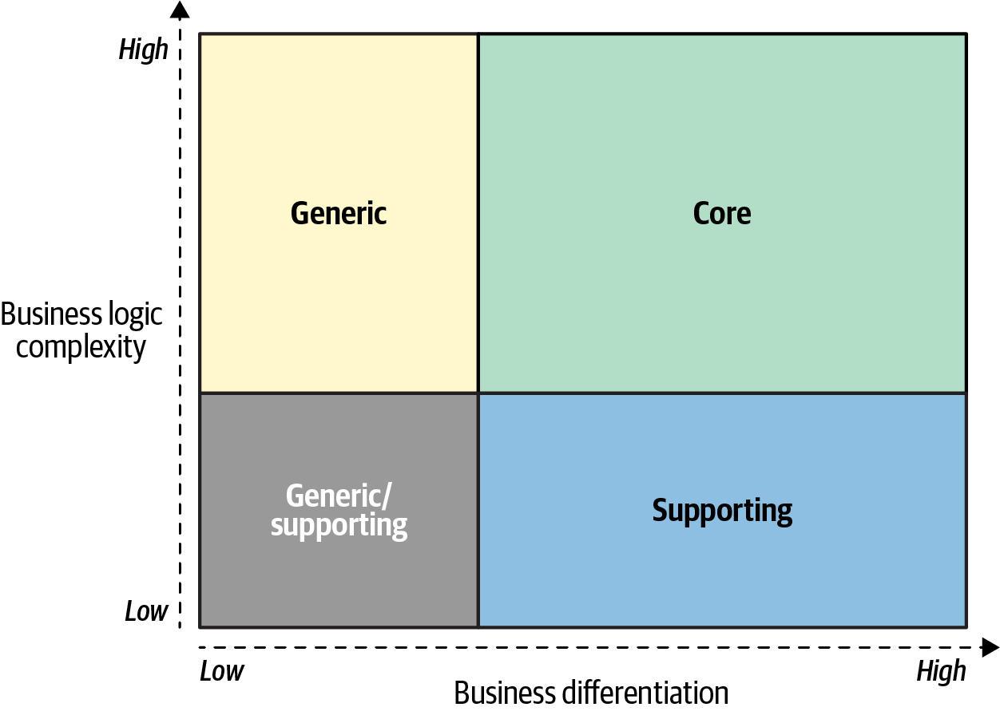
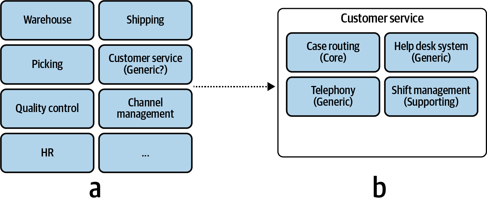
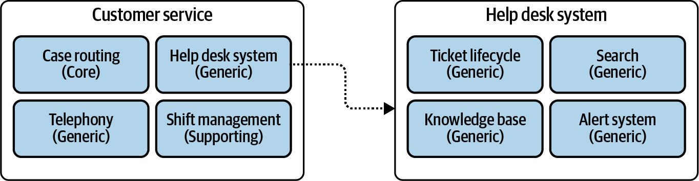
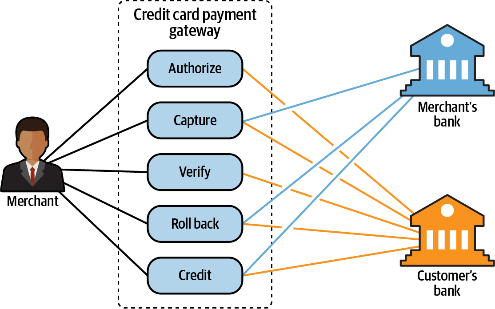

### Understanding Subdomains in Domain-Driven Design

In Domain-Driven Design, a business is broken down into different areas called **subdomains**. Identifying and understanding these subdomains is crucial for making strategic decisions about software design and resource allocation. There are three types of subdomains: Core, Generic, and Supporting.

---

### The Three Types of Subdomains

#### 1. Core Subdomains
- **What they are:** The unique, strategic parts of the business that provide a **competitive advantage**. This is what the company does better than its competitors.
- **Complexity:** High. They involve complex business logic, proprietary algorithms, or unique processes.
- **Volatility:** High. They change frequently as the business innovates and responds to the market.
- **Strategy:** Build **in-house** with the most skilled team members. These are critical investments that shouldn't be outsourced.
- **Example:** For Uber, the ride-matching and dynamic pricing algorithms are core subdomains.

#### 2. Generic Subdomains
- **What they are:** Complex problems that are common to many businesses and have already been solved. They offer **no competitive advantage**.
- **Complexity:** High. The problems themselves are difficult (e.g., authentication, payment processing).
- **Volatility:** Low. The solutions are stable and well-established.
- **Strategy:** **Buy or adopt** an off-the-shelf or open-source solution. It's more cost-effective than building one from scratch.
- **Example:** An authentication service (like OAuth) or a credit card payment gateway.

#### 3. Supporting Subdomains
- **What they are:** Activities necessary for the business to function but which do not provide a competitive advantage and are not complex enough to have generic solutions.
- **Complexity:** Low. The business logic is typically simple, often involving basic data entry and management (CRUD operations).
- **Volatility:** Low. They do not change often.
- **Strategy:** Can be built **in-house or outsourced**. Since they are not strategic, they don't require the best developers or advanced engineering techniques.
- **Example:** A simple content management system for an internal knowledge base or a tool for managing discount codes.

---

### Comparison Summary

| Aspect | Core | Generic | Supporting |
| :--- | :--- | :--- | :--- |
| **Competitive Advantage** | **Yes** | No | No |
| **Complexity** | High | High | Low |
| **Volatility (Rate of Change)** | High | Low | Low |
| **Solution Strategy** | Build In-house | Buy / Adopt | In-house / Outsource |

---

### How to Identify Subdomains

1.  **Start with Business Strategy:** Look at the company's organizational structure (departments) and business capabilities.
2.  **Analyze and Refine:** Break down coarse-grained areas into finer components. A customer service department might seem "supporting," but it could contain a "core" case routing algorithm.

    
    
    

3.  **Look for Coherent Use Cases:** A subdomain often represents a set of related use cases involving the same actors and data (e.g., everything related to processing a credit card payment).

    

4.  **Focus on Essentials:** Concentrate on the subdomains relevant to the software system you are building.

---

### Detailed Examples

To illustrate how to apply these concepts, let's look at the two fictitious companies from the text.

#### Gigmaster
A ticket sales and distribution company with a mobile app that recommends nearby shows.

*   **Business Domain:** Ticket Sales
*   **Core Subdomains:**
    *   **Recommendation Engine:** The algorithm that analyzes user data to suggest shows is their key competitive advantage.
    *   **Data Anonymization:** A crucial feature to protect user privacy.
    *   **Mobile App UX:** A great user experience is vital for a consumer-facing app.
*   **Generic Subdomains:**
    *   **Encryption, Accounting, Clearing, Authentication:** Standard functionalities that can be solved with off-the-shelf solutions.
*   **Supporting Subdomains:**
    *   **Integrations:** Connecting to music streaming services and social networks.
    *   **Attended-gigs Module:** A simple CRUD feature for users to log past gigs.

#### BusVNext
A public transportation company that provides optimized, on-demand bus rides.

*   **Business Domain:** Public Transportation
*   **Core Subdomains:**
    *   **Routing:** The complex algorithm to adjust bus routes on the fly is their main differentiator.
    *   **Analysis:** Continuously analyzing ride data to optimize the routing algorithm.
    *   **Fleet Management:** Managing the fleet of buses is critical to the operation.
    *   **Mobile App UX:** Ensuring the app is easy to use for customers and drivers.
*   **Generic Subdomains:**
    *   **Traffic Conditions:** Using third-party data for traffic.
    *   **Accounting, Billing, Authorization:** Standard financial and user management tasks.
*   **Supporting Subdomains:**
    *   **Promotions Management:** A simple module for managing discounts and promo codes.

---

### Who are Domain Experts?

**Domain Experts** are the people who have deep knowledge of the business domain or a specific subdomain. They are the source of truth for business requirements and rules. They are typically stakeholders, business analysts, or the end-users of the software. Collaborating closely with them is essential for a successful project. 