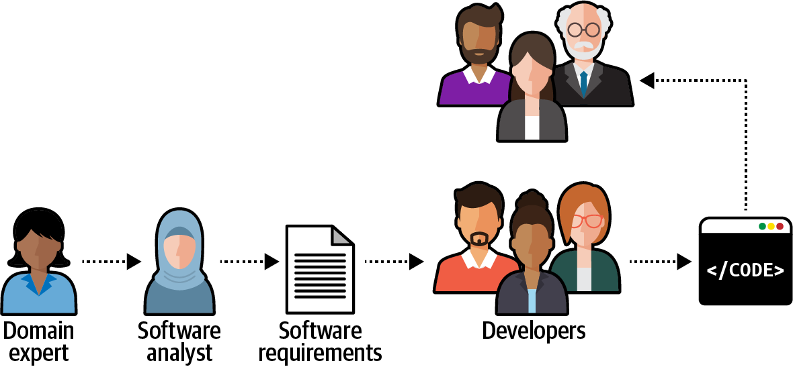
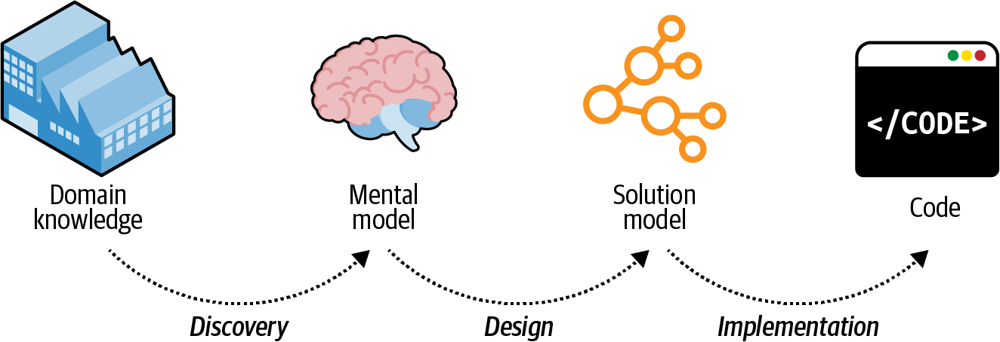
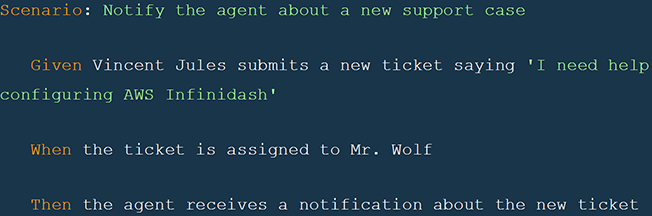

### Chapter 2: Discovering Domain Knowledge - Summary

This chapter focuses on how to effectively understand and communicate the business logic within a subdomain. The central theme is that project success depends on a deep, shared understanding between developers and domain experts, which is achieved through a **Ubiquitous Language**.

---

### The Problem: Knowledge Lost in Translation

In many projects, communication flows like a game of "Telephone," causing critical information to be lost or distorted:

1.  **Domain Expert's Knowledge** is translated by...
2.  **Business Analysts** into an analysis model/requirements, which is translated by...
3.  **Engineers** into a design document, which is finally translated into...
4.  **Source Code**.

This process leads to misunderstandings, building the wrong solution, and ultimately, project failure. The software ends up reflecting the developers' *misunderstanding* of the domain, not the experts' actual knowledge.

---

### The Solution: The Ubiquitous Language

The cornerstone of DDD for solving this communication problem is the **Ubiquitous Language**.

*   **Core Idea:** A single, shared language that is developed collaboratively by all project stakeholders—domain experts, engineers, product owners, designers, etc.
*   **Purpose:** To eliminate ambiguity and ensure that when someone says "campaign" or "account," everyone has the exact same concept in mind.
*   **Application:** This language should be used *everywhere*: in conversations, diagrams, documentation, requirements, tests, and most importantly, in the source code itself.

---

### Characteristics of a Good Ubiquous Language

A Ubiquitous Language is a **model of the business domain**. It is a simplified representation intended to solve a problem, much like a map is a model of the world that omits unnecessary details.

To be effective, it must be:

1.  **The Language of the Business, Not Technology:**
    *   It must consist of business terms that domain experts use and understand.
    *   **Avoid technical jargon.**
    *   **Good Example (Business Language):** "A campaign can be published only if at least one of its placements is active."
    *   **Bad Example (Technical Language):** "A campaign can be published only if it has at least one associated record in the active-placements table."

2.  **Precise and Consistent:**
    *   **Eliminate Ambiguity:** If a term like "Policy" can mean two different things (e.g., an insurance contract vs. a regulatory rule), the language must be refined to use two distinct terms: `Insurance Contract` and `Regulatory Rule`.
    *   **Eliminate Synonyms:** If the business uses "user," "visitor," and "customer" interchangeably, dig deeper. These often represent different concepts with different behaviors and should be named explicitly in the language (e.g., an `Unregistered Visitor` vs. a `Registered Customer`).

---

### Cultivating the Language

*   **It's a Continuous Process:** The language is not defined once and forgotten. It evolves as the team's understanding of the domain deepens. New insights must be reflected back into the language.
*   **Collaboration is Key:** The only way to discover the language is through constant interaction with domain experts. Much of their knowledge is tacit (unwritten) and can only be uncovered by asking questions.

#### Helpful Tools
While direct conversation is most important, tools can help maintain the language:
*   **Glossary / Wiki:** Useful for documenting the "nouns" of your domain (entities, roles, processes).
*   **Gherkin Tests (`Given/When/Then`):** An excellent tool for capturing the "verbs" (behavior, rules, and invariants) in a way that domain experts can read and validate.

