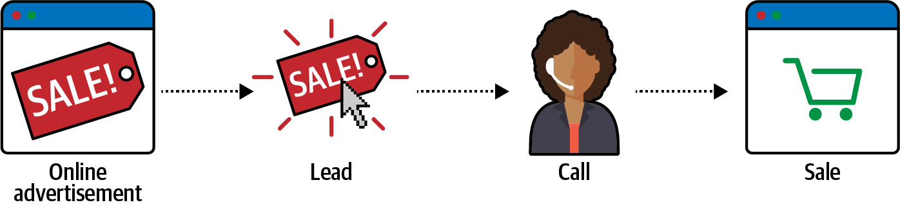
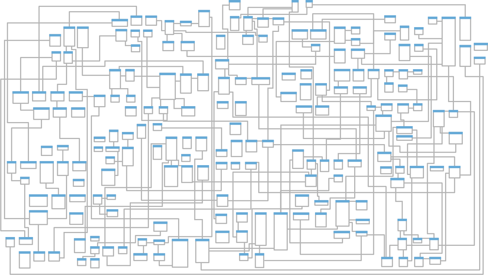
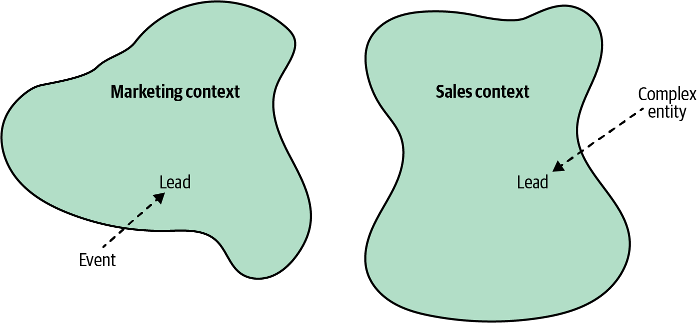
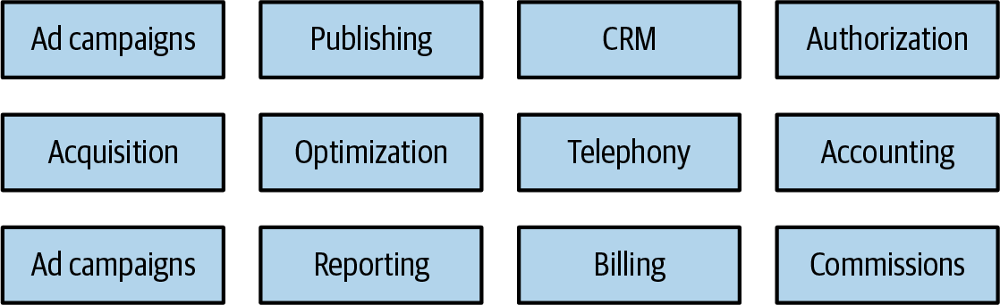
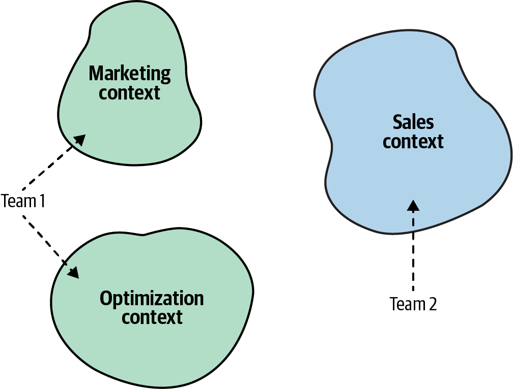

### Chapter 3: Managing Domain Complexity - Summary

This chapter introduces a core DDD pattern for managing complexity when a single, unified model of the business is not feasible. It explains how to handle inconsistencies in the domain experts' mental models by dividing the system into **Bounded Contexts**.

---

### The Problem: Inconsistent Models

In any large organization, different departments or experts often use the same term to mean different things. This creates ambiguity that is difficult to represent in a single, unified software model.

*   **Example:** The term **"Lead"** can have conflicting meanings.
    *   To the **Marketing** department, a lead is a simple notification of interest.
    *   To the **Sales** department, a lead is a complex entity representing the entire sales lifecycle.

Trying to force a single model for "Lead" for the entire company results in a solution that is either over-engineered for Marketing or under-engineered for Sales. The traditional approach of creating a massive, enterprise-wide model often fails, becoming a "jack of all trades, master of none."

---

### The Solution: Bounded Context

The DDD solution is to stop trying to create one model. Instead, we divide the system into multiple models and explicitly define the boundary where each model applies. This boundary is called a **Bounded Context**.

*   **Core Idea:** A Bounded Context is a boundary (a line drawn in the sand) within which a particular model and its Ubiquitous Language are consistent and have a precise meaning.
*   **Consistency:** The term "Lead" can exist in both the `Marketing Context` and the `Sales Context`. As long as it has one, unambiguous meaning *inside* each context, the model is sound.
*   **Refined Ubiquitous Language:** A Ubiquitous Language is not universal across the company; it is only ubiquitous *within its Bounded Context*.

---

### Bounded Contexts vs. Subdomains

This is one of the most crucial concepts in DDD. They are not the same thing.

| Aspect | Subdomains | Bounded Contexts |
| :--- | :--- | :--- |
| **Space** | **Problem Space** | **Solution Space** |
| **How to find** | You **discover** them | You **design** them |
| **Purpose** | To analyze the business and its strategy (Core, Supporting, Generic). | To define the boundaries of your software models and teams. |

The relationship is not always one-to-one. You might design a single Bounded Context that contains multiple subdomains, or you might design multiple Bounded Contexts to model different aspects of a single, complex subdomain.

---

### Bounded Contexts as Explicit Boundaries

Bounded Contexts define clear lines of separation in your system.

1.  **Model Boundary:** It defines the scope where a Ubiquitous Language is consistent.
2.  **Physical Boundary:** Each context should be an independent, deployable unit (e.g., a microservice, project, or library), allowing it to have its own architecture and technology stack.
3.  **Ownership Boundary:** A Bounded Context must be owned by **one team only**. This enforces clear responsibility. However, a single team can own multiple Bounded Contexts.

---

### Real-Life Examples of Bounded Contexts

The concept of using different models in different contexts is everywhere.

*   **The Tomato:** Is it a fruit or a vegetable?
    *   In the **Botany Context**, it's a fruit (contains seeds).
    *   In the **Culinary Context**, it's a vegetable (based on flavor profile).
    *   In the **US Taxation Context**, it's legally a vegetable.
*   **The Refrigerator Model:** To check if a fridge will fit in a kitchen:
    *   A simple **cardboard cutout** of the fridge's base is a perfect model for the context of "Will it fit through the door?"
    *   A **tape measure** is a perfect model for the context of "Is it too tall?"
    *   Each model is simple and perfectly suited for its specific, *bounded* problem.

---

### Actionable Tips from Chapter 3
Here are some key takeaways and guiding principles from this chapter that you can apply in your day-to-day work as a software architect and developer.

> **1. Avoid the "One-Model-to-Rule-Them-All" Trap.**
> Resist the urge to create a single, massive, enterprise-wide model that tries to satisfy every department. Such models inevitably become overly complex, hard to maintain, and a "master of none."

> **2. Don't Just Prefix Conflicting Terms; Define Their Context.**
> When you find terms like "Lead" or "Customer" meaning different things to different teams, don't just rename them in code (e.g., `SalesLead`, `MarketingLead`). This is a code smell indicating a hidden boundary. Instead, make that boundary explicit by designing a Bounded Context for each meaning.

> **3. A Bounded Context is a Design Choice You Make.**
> Remember this crucial distinction: You **discover** subdomains (the problem space), but you **design** Bounded Contexts (the solution space). You have the power to draw the lines of your system to best fit your technical and organizational needs. They don't have to be a 1-to-1 match with subdomains.

> **4. Use Bounded Contexts to Define Team Ownership.**
> Enforce a strict rule: **"One team per Bounded Context."** Never have multiple teams working on the same context. This creates clear ownership, reduces communication overhead, and allows teams to work more autonomously. A single team *can*, however, own multiple contexts.

> **5. A Bounded Context is a Physical, Deployable Unit.**
> Each Bounded Context should be its own project, service, or independent module. This allows it to be developed, deployed, and versioned independently, which is the foundation of a microservices architecture.

> **6. Use Bounded Contexts to Enable Technical Freedom.**
> Because contexts are physically separate, they don't have to share the same technology stack. One team can use Java, another can use Python, and a third can use a specialized database. Use this to pick the right tool for the job within each context.

> **7. Find the "Goldilocks" Size for Your Contexts.**
> There is no perfect size, but there are two extremes to avoid:
> *   **Too Big:** The language becomes inconsistent and the model is hard to maintain.
> *   **Too Small:** You create excessive integration overhead between dozens of tiny services.
> A good rule of thumb is to **keep coherent use cases together.** Don't split a feature that naturally belongs together across multiple Bounded Contexts.

> **8. A "Ubiquitous Language" is Only Ubiquitous Within Its Boundary.**
> Don't get hung up on the word "ubiquitous." The language is only shared and consistent *inside* its Bounded Context. You should expect—and design for—the language to be different across different contexts. 