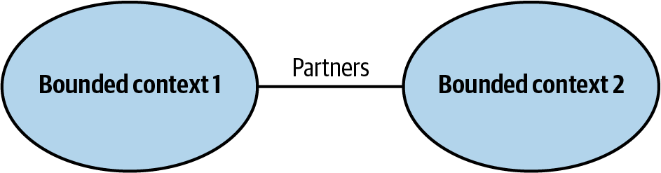
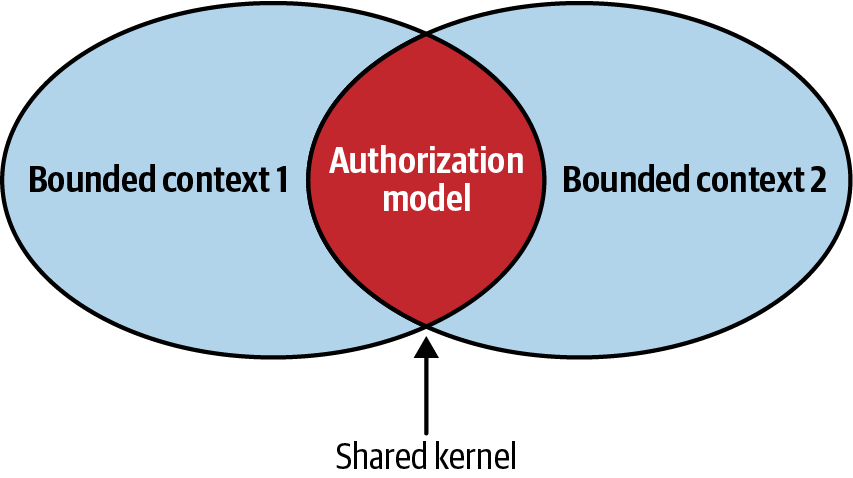
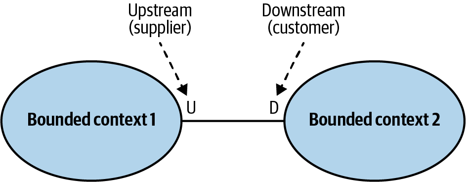
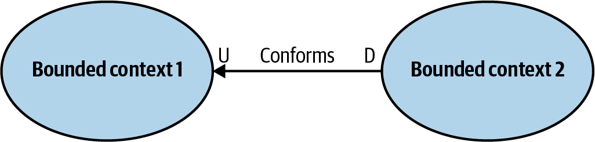
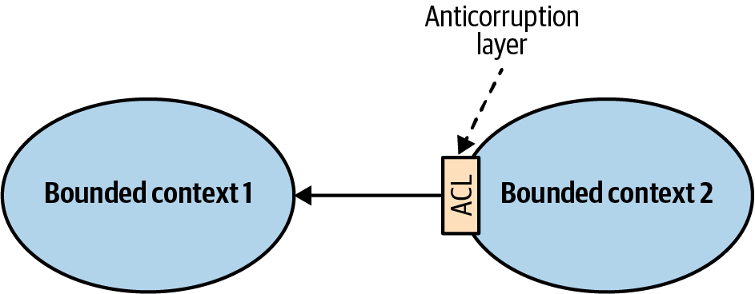
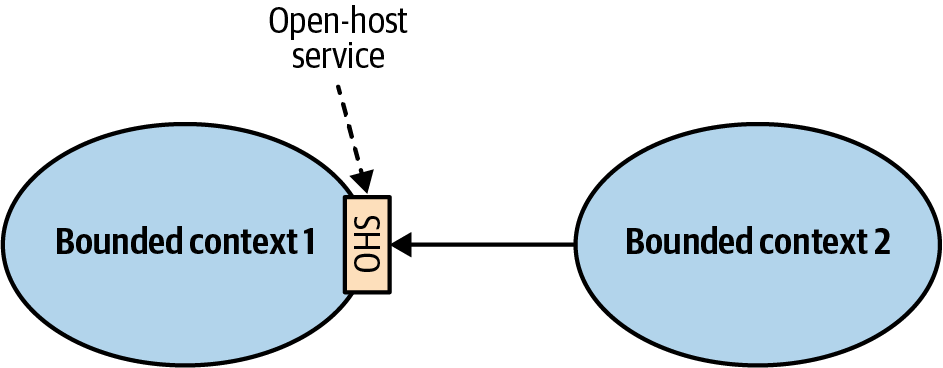
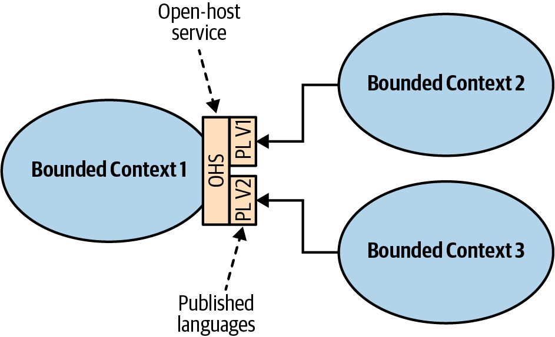
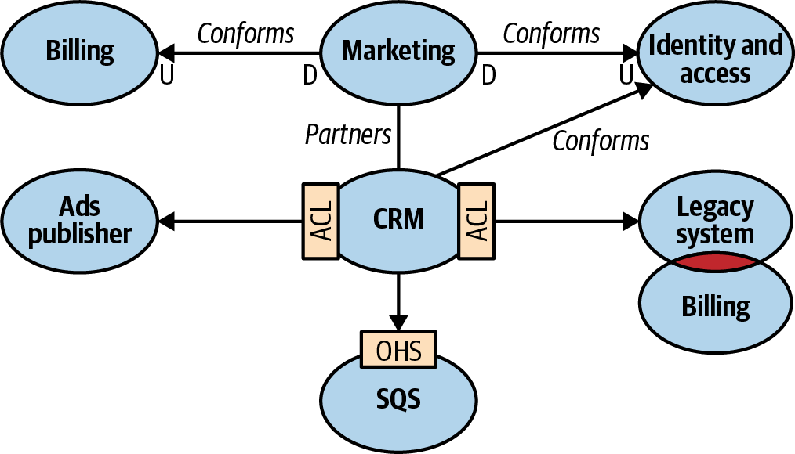
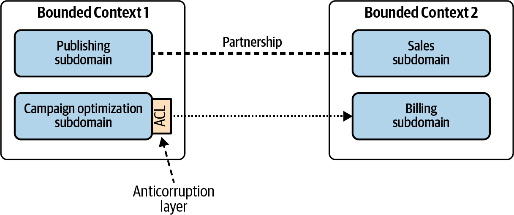

### Chapter 4: Integrating Bounded Contexts - Summary

This chapter explores the patterns for managing the necessary interactions between Bounded Contexts. While contexts are designed to be autonomous, they must integrate to form a coherent system. These integration patterns are primarily driven by the nature of the collaboration between the teams that own the contexts.

---

### Integration Pattern Groups

The patterns are divided into three categories based on team collaboration dynamics:

1.  **Cooperation:** For teams with well-established communication and shared goals.
2.  **Customer-Supplier:** For teams where one provides a service to the other, often with a power imbalance.
3.  **Separate Ways:** When collaboration is not feasible or desirable.

---

### 1. Cooperation Patterns

#### Partnership
Two teams forge a close, two-way integration. They jointly coordinate on creating and evolving the integration contract.

*   **Characteristics:** Ad-hoc coordination, frequent synchronization, shared goals. No single team dictates the terms.
*   **Requires:** High levels of commitment and excellent communication. Works best with co-located teams and continuous integration.
*   **Best For:** Two teams whose success is intrinsically linked.
* **Bad for:** Geographically distributed teams

#### Shared Kernel
Two or more contexts share a common, overlapping part of their model. This shared part is implemented as a common piece of code (e.g., a shared library).

*   **Characteristics:** Introduces strong coupling between the lifecycles of the contexts. A change to the kernel immediately affects all participating contexts.
*   **When to Use (with caution):**
    *   When the cost of duplicating the model is higher than the cost of coordinating changes.
    *   Often used for volatile **core subdomains** where consistency is critical.
    *   As a pragmatic, temporary solution during the modernization of a legacy system.
    * By the same team
    * Communication or collaboration issues prevent implementing the partnership pattern—for example, because of geographical constraints
*   **Warning:** This pattern is a pragmatic exception to the "one team per context" rule and should be justified carefully. The kernel itself should be kept as small as possible. Ideally, the shared kernel will consist only of integration contracts and data structures that are intended to be passed across the bounded contexts’ boundaries. Each change to the shared kernel must trigger integration tests for all the affected bounded contexts. Frequent CI is mandatory to limit discrepancy. 

---

### 2. Customer-Supplier Patterns

This is a common upstream-downstream relationship where one context (the supplier) provides services to another (the customer).

#### Conformist
The downstream (customer) team completely adheres to the model of the upstream (supplier) team. The downstream team has little to no say in the integration.

*   **Characteristics:** Simplest integration, but the downstream team gives up autonomy.
*   **When to Use:**
    *   When the upstream model is an industry standard or is simply "good enough" for the downstream's needs.
    *   When the power balance heavily favors the upstream team.
*   **Quote:** "If a bounded context conforms to a mess, it risks becoming a mess itself."

#### Anticorruption Layer (ACL)
The downstream team builds a translation layer that isolates its model from the upstream model. The ACL translates requests and responses between the two contexts.

*   **Characteristics:** Protects the downstream model from being "corrupted" by foreign concepts or frequent changes from upstream.
*   **When to Use:**
    *   When the downstream context contains a **core subdomain** that must not be compromised.
    *   When integrating with a legacy system or a model that is a "mess."
    *   When the upstream API changes frequently.

#### Open-Host Service (OHS)
The upstream team creates a stable, public API that is explicitly designed for its consumers. This public API (the "Published Language") is decoupled from the upstream's internal implementation model.

*   **Characteristics:** The supplier acts as a good host, protecting its customers from internal changes.
*   **When to Use:** When an upstream team wants to provide a reliable and convenient service to multiple consumers.
*   **Benefit:** Allows the internal model to evolve freely without breaking consumers. It can also support multiple API versions simultaneously to allow for gradual migration.

---

### 3. Separate Ways

The teams decide that integration is not worth the cost. There is no collaboration, and functionality is duplicated in each context.

*   **Characteristics:** Avoids costly communication, integration, and political issues.
*   **When to Use:**
    *   When the functionality is a **generic subdomain** that is easy to duplicate (e.g., a logging framework).
    *   When models are so different that an ACL would be more expensive than just building the feature twice.
    * Differences in the bounded contexts’ models can also be a reason to go with a separate ways collaboration. The models may be so different that a conformist relationship is impossible, and implementing an anticorruption layer would be more expensive than duplicating the functionality. In such a case, it is again more cost-effective for the teams to go their separate ways.
*   **Warning:** This pattern should **never** be used for a **core subdomain**. Duplicating your strategic competitive advantage is a critical error.

---

### The Context Map

A Context Map is a crucial visualization tool. It is a diagram that shows all the Bounded Contexts in a system and the integration patterns between them.

*   **Purpose:**
    *   Provides a **high-level overview** of the system's architecture.
    *   Reveals **communication patterns** and dependencies between teams.
    *   Can highlight **organizational issues** (e.g., if one team is a "mess" that everyone uses an ACL to connect to).
*   **Maintenance:** A context map should be a living document, maintained as a shared effort by all teams. It can even be managed as code using tools like Context Mapper.

It’s important to note that charting a context map can be a challenging task. When a system’s bounded contexts encompass multiple subdomains, there can be multiple integration patterns at play.

---

### Actionable Tips from Chapter 4

> **1. Choose Integration Patterns Based on Team Dynamics.** Your integration strategy should reflect the reality of your organization. A `Partnership` won't work between teams that don't talk. Be pragmatic.

> **2. Use a `Shared Kernel` with Extreme Caution.** It creates the tightest coupling. Only use it when the cost of coordination is clearly lower than the cost of duplicating logic. Keep it as small as possible.

> **3. Always Protect Your Core.** If your context is a core subdomain, never let it `Conform` to another model. Shield it with an `Anticorruption Layer` to preserve its integrity and modeling freedom.

> **4. Be a Good Upstream Partner.** If you own a service that others depend on, implement an `Open-Host Service`. Decouple your internal model from a well-defined public API (Published Language) to protect your consumers from your changes.

> **5. Never Use `Separate Ways` for Core Subdomains.** Duplicating your most strategic and complex logic is a recipe for inconsistency, wasted effort, and failure. This pattern is for non-critical, generic functionality only.

> **6. Create and Maintain a `Context Map`.** This is your architectural blueprint. Use it to facilitate conversations, make strategic decisions, and identify organizational bottlenecks. Make its maintenance a shared, ongoing responsibility for all teams. You can do it with this tool: https://contextmapper.org/