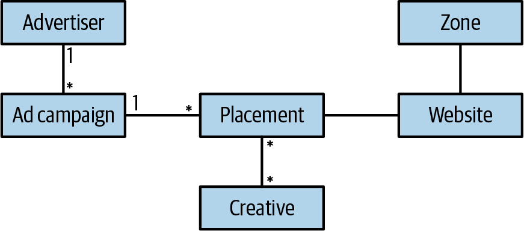

### Chapter 5: Implementing Simple Business Logic - Summary

This chapter transitions from high-level strategy to implementation tactics, focusing on two foundational patterns for implementing business logic in simple domains: **Transaction Script** and **Active Record**. These patterns are best suited for supporting subdomains where the business logic is not complex.

---

### Transaction Script

This is a fundamental pattern that organizes business logic into procedures, where each procedure handles a single, atomic request from a consumer.

*   **Definition:** "Organizes business logic by procedures where each procedure handles a single request from the presentation." - Martin Fowler
*   **Core Principle:** The system's public operations are treated as a collection of transactions. Each script implementing an operation **must be transactional**—it either succeeds completely or fails completely, leaving the system in a consistent state.


---

### Common Pitfalls of Transaction Scripts

The biggest challenge is ensuring true transactional behavior. Failures often lead to data corruption.

#### 1. Lack of an Explicit Database Transaction
Executing multiple database updates without wrapping them in a transaction is a common mistake.

*   **Problem:** If the second `DB.Execute` call fails, the `Users` table is updated, but the `VisitsLog` is not, leading to an inconsistent state.
```csharp
// BAD: Not transactional
public void Execute(Guid userId, DataTime visitedOn)
{
  DB.Execute(“UPDATE Users SET last_visit=@prm1...”, ...);
  DB.Execute(“INSERT INTO VisitsLog...”, ...);
}
```
*   **Solution:** Wrap the database calls in a `try/catch` block with an explicit transaction and rollback.
```csharp
// GOOD: Transactional
public void Execute(Guid userId, DataTime visitedOn)
{
  try
  {
    DB.StartTransaction();
    DB.Execute(“UPDATE Users...”);
    DB.Execute(“INSERT INTO VisitsLog...”);
    DB.Commit();
  } catch {
    DB.Rollback();
    throw;
  }
}
```

#### 2. Implicit Distributed Transactions
A transaction isn't just about the database; it includes every part of an operation, like publishing to a message bus or even communicating success back to the caller.

*   **Problem 1: DB + Message Bus:** If the message bus publish fails after the database commit, the system is inconsistent. Standard distributed transactions are often avoided due to complexity. (More advanced patterns like Outbox will be covered later).


*   **Problem 2: The "Successful" Call That The Caller Never Hears About:** If a call to increment a counter succeeds but the network fails before the "OK" response reaches the client, the client will likely retry the operation, incrementing the counter a second time and corrupting the data.

*   **Solution (Idempotency):** Design the operation so it can be repeated multiple times with the same result. For example, instead of `visits = visits + 1`, the operation could be `UPDATE Users SET visits = @newValue`. The caller provides the final value, so retries don't change the outcome.

---

### When to Use Transaction Script

*   **Best for:** Supporting subdomains where logic is simple and procedural.
*   **Good for:** ETL (Extract, Transform, Load) operations and as adapters for integrating external systems (like in an Anticorruption Layer).
*   **Advantage:** Simplicity. It has minimal overhead and is easy to understand.
*   **Disadvantage:** Prone to code duplication as logic gets more complex. **Should not be used for core subdomains.**


---

### Active Record

This pattern is an evolution of Transaction Script, designed for simple business logic that operates on more complex data structures or object hierarchies.

*   **Definition:** "An object that wraps a row in a database table or view, encapsulates the database access, and adds domain logic on that data." - Martin Fowler
*   **Core Principle:** The data structure itself becomes an "active" object responsible for its own persistence (Create, Read, Update, Delete operations). It is tightly coupled to a data access framework like an ORM.



*   **Implementation:** The main business logic is still a transaction script, but instead of writing direct SQL, it manipulates Active Record objects.

```csharp
public class CreateUser 
{
 public void Execute(UserDetails details)
 {
  try 
  {
    DB.StartTransaction();
    var user = new User(); // 'user' is an Active Record object
    user.Name = details.Name;
    user.Email = details.Email;
    user.Save(); // The object saves itself
    DB.Commit();
  } catch {
    DB.Rollback();
    throw;
  }
 }
}
```

---

### When to Use Active Record

*   **Best for:** Supporting subdomains where the main complexity is mapping complex data structures to a database, not complex business rules.
*   **Good for:** Simple CRUD-heavy applications.
*   **Warning (The "Anemic Domain Model" critique):** This pattern is often called an anti-pattern because the business logic lives outside the data objects. While this is true, it's a perfectly valid and useful tool for simple domains. Using a more complex pattern here would be over-engineering.

---

### Actionable Tips from Chapter 5

> **1. Make Every Operation Transactional.** This is the most crucial takeaway. An operation must be atomic—it either succeeds completely or fails completely, leaving the system's state consistent. This applies to database writes, message publishing, and API calls.

> **2. Design for Retries.** Assume any network call can fail and will be retried. The easiest way to handle this is to make your operations **idempotent**. An operation that can be safely executed multiple times is much more robust than one that can't.

> **3. Use the Right Tool for the Job.** Don't treat Transaction Script or Active Record as anti-patterns. They are the best tools for implementing the simple logic found in **supporting subdomains**. Over-engineering a simple CRUD screen with a complex domain model is just as bad as under-engineering a core domain.

> **4. Be Pragmatic About Consistency at Scale.** For massive-scale systems (e.g., IoT event ingestion), ask the business if 100% data integrity is a hard requirement. Sometimes, losing or duplicating 0.001% of records is an acceptable trade-off for higher performance and lower cost. The answer always depends on the domain. 