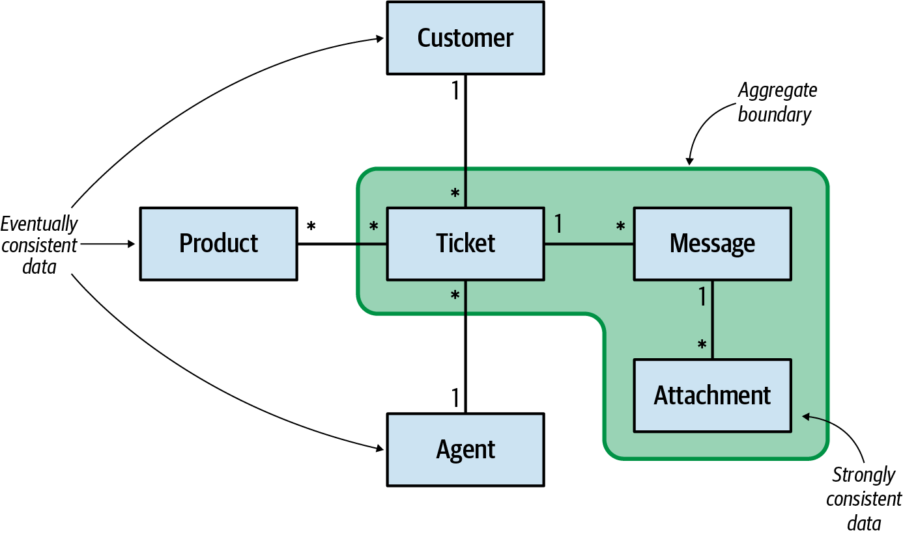

### Chapter 6: Tackling Complex Business Logic - Summary

This chapter introduces the **Domain Model pattern**, which is designed to handle complex business logic found in **core subdomains**. Unlike the simpler patterns from Chapter 5, the domain model pattern is built around rich object models that encapsulate both data and behavior, using DDD's tactical patterns as building blocks.

---

### The Domain Model Pattern

The domain model pattern is intended to cope with complex business logic involving complicated state transitions, business rules, and invariants that must be protected at all times.

*   **Purpose:** Handle complex business logic where simple CRUD operations are insufficient.
*   **Key Principle:** Create an object model that incorporates both behavior and data, putting business logic first.
*   **Requirements:** Objects must be "plain old objects" free from infrastructural concerns (no database calls, external dependencies).

#### Example: Help Desk System Requirements
A complex example demonstrating intricate business rules:
- Tickets have priorities and SLA time limits
- Escalation reduces response time by 33%
- Auto-reassignment if agent doesn't respond within 50% of time limit
- Auto-closure after 7 days of customer inactivity
- Escalated tickets can't be auto-closed
- Customers can reopen tickets within 7 days

---

### Building Block 1: Value Objects

Value objects are objects identified by the composition of their values, not by an explicit ID.

#### Core Characteristics
*   **Identity:** Defined by the combination of their field values
*   **Immutability:** Changes create new instances, never modify existing ones
*   **Equality:** Two value objects with the same values are equal
*   **No ID needed:** An ID field would be redundant and create potential for bugs


#### Fighting Primitive Obsession
Using primitive types (strings, ints) to represent domain concepts is a code smell called "primitive obsession."

**Bad Example (Primitive Obsession):**
```csharp
class Person
{
  private string firstName;
  private string lastName;
  private string landlinePhone;  // Just a string
  private string email;          // Just a string
  private string countryCode;    // Just a string
}
```

**Good Example (Value Objects):**
```csharp
class Person
{
  private PersonId id;
  private Name name;
  private PhoneNumber landline;   // Rich object with behavior
  private EmailAddress email;     // Rich object with behavior  
  private CountryCode country;    // Rich object with behavior
}
```

#### Rich Behavior Examples
Value objects shine when they encapsulate business logic:

```csharp
var heightMetric = Height.Metric(180);
var heightImperial = Height.Imperial(5, 3);
var firstIsHigher = heightMetric > heightImperial;  // true

var phone = PhoneNumber.Parse("+359877123503");
var country = phone.Country;                        // "BG"
var phoneType = phone.PhoneType;                    // "MOBILE"

var red = Color.FromRGB(255, 0, 0);
var green = Color.Green;
var yellow = red.MixWith(green);                    // New Color instance
```

#### Implementation Guidelines
*   **Immutability:** All operations return new instances
*   **Override Equality:** Implement proper value-based equality checks
*   **Rich API:** Encapsulate all logic that manipulates the values
*   **Thread Safety:** Immutability makes them inherently thread-safe

---

### Building Block 2: Aggregates

An aggregate is a cluster of domain objects (entities and value objects) that can be treated as a single unit for data changes.

#### Core Responsibilities

1.  **Consistency Enforcement:** Acts as a consistency boundary, ensuring all business rules and invariants are protected
2.  **Transaction Boundary:** All changes within an aggregate must be committed atomically
3.  **Public Interface:** External access only through the aggregate root's commands


#### Entities vs. Aggregates
*   **Entities:** Objects that require explicit IDs and can change over time
*   **Entities are NOT used independently** - only as part of aggregates
*   **Aggregates:** Collections of entities that share transactional consistency


#### Commands and State Modification
External processes can only modify an aggregate through its public command interface:

```csharp
public class Ticket  // Aggregate Root
{
    public void Execute(EscalateTicket cmd)
    {
        // Validate business rules
        if (!this.IsEscalated && this.RemainingTimePercentage <= 0)
        {
            this.IsEscalated = true;
            var escalatedEvent = new TicketEscalated(this.Id);
            this.domainEvents.Append(escalatedEvent);
        }
    }
}
```

#### Concurrency Management
Aggregates must implement optimistic concurrency control:

```csharp
class Ticket
{
    TicketId Id;
    int Version;  // Critical for concurrency management
    // ... other fields
}
```

SQL example for atomic updates:
```sql
UPDATE tickets
SET ticket_status = @new_status,
    agg_version = agg_version + 1
WHERE ticket_id = @id AND agg_version = @expected_version;
```

#### Aggregate Boundaries: Keep Them Small
*   **One aggregate per transaction:** You cannot modify multiple aggregates in a single database transaction
*   **Reference by ID:** Other aggregates should be referenced by their IDs, not as direct object references
*   **Strong consistency only:** Only include data that MUST be strongly consistent



Example of proper boundary design:
```csharp
public class Ticket
{
    // These belong to the aggregate (need strong consistency)
    private List<Message> messages;
    
    // These are external references (eventual consistency is OK)
    private UserId customer;
    private UserId assignedAgent;
    private List<ProductId> products;
}
```

#### The Aggregate Root
Only one entity in the aggregate hierarchy serves as the public interface - the aggregate root.


All external access goes through the root:
```csharp
public class Ticket  // Aggregate Root
{
    private List<Message> messages;
    
    public void Execute(AcknowledgeMessage cmd)
    {
        var message = messages.Where(x => x.Id == cmd.id).First();
        message.WasRead = true;  // Modifying internal entity through root
    }
}
```

#### Domain Events
Aggregates communicate with the outside world through domain events.

*   **Purpose:** Describe significant business events that have occurred
*   **Naming:** Past tense (TicketEscalated, MessageReceived)
*   **Content:** All data needed by interested subscribers


Example domain event:
```json
{
  "ticket-id": "c9d286ff-3bca-4f57-94d4-4d4e490867d1",
  "event-id": 146,
  "event-type": "ticket-escalated",
  "escalation-reason": "missed-sla",
  "escalation-time": 1628970815
}
```

---

### Building Block 3: Domain Services

Domain services host business logic that doesn't naturally belong to any aggregate or value object.

#### When to Use Domain Services
*   Logic that spans multiple aggregates
*   Calculations requiring data from multiple sources
*   Business processes that don't fit within a single aggregate

#### Example: Multi-Aggregate Coordination
```csharp
public class ResponseTimeFrameCalculationService
{
    public ResponseTimeframe CalculateAgentResponseDeadline(
        UserId agentId, Priority priority, bool escalated, DateTime startTime)
    {
        var policy = departmentRepository.GetDepartmentPolicy(agentId);
        var maxProcessingTimeSpan = policy.GetMaxResponseTimeFor(priority);
        
        if (escalated) 
        {
            maxProcessingTimeSpan = maxProcessingTimeSpan * policy.EscalationFactor;
        }
        
        var shifts = departmentRepository.GetUpcomingShifts(agentId, startTime, 
            startTime.Add(policy.MaxAgentResponseTime));
        return CalculateTargetTime(maxProcessingTimeSpan, shifts);
    }
}
```

**Important:** Domain services are stateless and have nothing to do with microservices or SOA.

---

### Managing Complexity Through Invariants

The domain model reduces complexity by encapsulating invariants, which reduce the system's degrees of freedom.

#### Degrees of Freedom Example
```csharp
// ClassA: 5 degrees of freedom (5 independent variables)
public class ClassA 
{
    public int A { get; set; }
    public int B { get; set; }
    public int C { get; set; }
    public int D { get; set; }
    public int E { get; set; }
}

// ClassB: Only 2 degrees of freedom (B, C, E are calculated)
public class ClassB 
{
    public int A { get; set; }  // Independent
    public int B { get; private set; }  // = A / 2
    public int C { get; private set; }  // = A / 3
    public int D { get; set; }  // Independent
    public int E { get; private set; }  // = D * 2
}
```

ClassB is actually **less complex** because invariants reduce the degrees of freedom needed to describe its state.

---

### Actionable Tips from Chapter 6

> **1. Use Value Objects Everywhere You Can.** They make code more expressive, safer (immutable), and thread-safe. Use them for any concept that can be identified by its values rather than an ID.

> **2. Fight Primitive Obsession Ruthlessly.** Replace strings and ints representing domain concepts with rich value objects. This centralizes validation and business logic while making the code more readable.

> **3. Keep Aggregates Small and Focused.** Only include data that MUST be strongly consistent. Reference other aggregates by ID. Remember: one aggregate per transaction is a hard rule.

> **4. Design Aggregate Boundaries Around Business Invariants.** If you need to modify multiple objects atomically to maintain business rules, they probably belong in the same aggregate.

> **5. Always Implement Optimistic Concurrency Control.** Use version fields and proper database constraints to prevent concurrent updates from corrupting data. This is non-negotiable for aggregates.

> **6. Use Domain Events for Cross-Aggregate Communication.** Don't try to work around the one-aggregate-per-transaction rule. Use events to coordinate between aggregates asynchronously.

> **7. Make Your Code Speak the Ubiquitous Language.** Aggregate names, method names, and domain event names should all use terms from your bounded context's ubiquitous language.

> **8. Only Use Domain Services When Logic Doesn't Fit Elsewhere.** Most business logic should live in aggregates or value objects. Domain services are for coordination logic that spans multiple aggregates. 