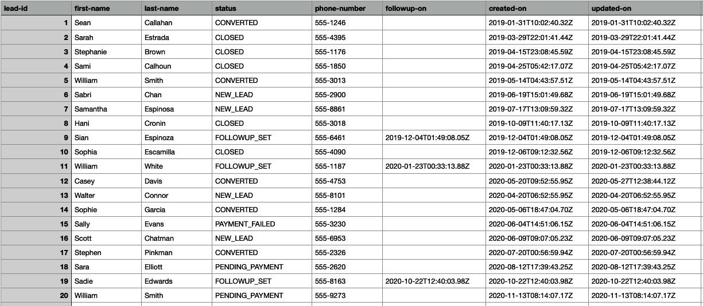
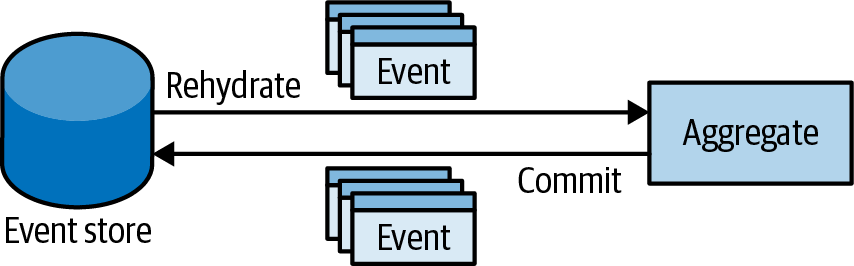
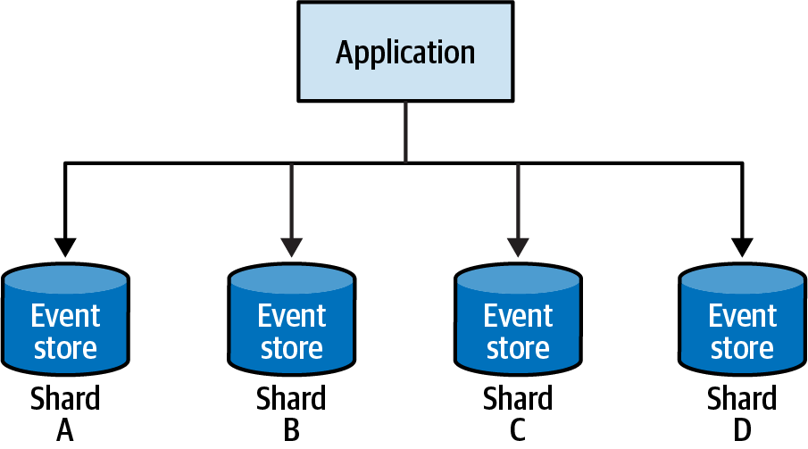

### Chapter 7: Modeling the Dimension of Time - Summary

This chapter introduces the **Event-Sourced Domain Model**, an advanced implementation of the Domain Model pattern from Chapter 6. The key difference is how an aggregate's state is persisted. Instead of saving the current state, this pattern persists a chronological sequence of **domain events** that describe every change made to the aggregate. This sequence of events becomes the ultimate source of truth.

---

### The Core Idea: Event Sourcing

The Event Sourcing pattern captures all changes to an application state as a sequence of events.

#### State-Based vs. Event-Sourced Models

*   **State-Based Model:** Stores only the *current state* of an entity. You know *what* the state is, but you lose the story of *how* it got there.



*   **Event-Sourced Model:** Stores a full history of every change as an immutable event. This tells the complete story of an entity's lifecycle.

**Example Event Stream for a Single Lead:**
```json
[
  { "event-type": "lead-initialized", "first-name": "Casey", ... },
  { "event-type": "contacted", ... },
  { "event-type": "followup-set", ... },
  { "event-type": "contact-details-updated", "last-name": "Davis", ... },
  { "event-type": "contacted", ... },
  { "event-type": "order-submitted", ... },
  { "event-type": "payment-confirmed", "status": "converted" }
]
```

---

### Projections: Creating State from Events

Since the current state isn't stored, it must be created on-demand by replaying the events. This process is called a **projection**. The power of Event Sourcing is that you can create *multiple* projections from the same event stream for different purposes.

*   **State Projection:** Replaying events to get the current state for business logic decisions.
*   **Search Projection:** Creating a model optimized for searching, including historical data.
*   **Analysis Projection:** Creating a model for business intelligence and reporting.

**Example code for historically searchable object**
```csharp
public class LeadSearchModelProjection
{
    public long LeadId { get; private set; }
    public HashSet<string> FirstNames { get; private set; }
    public HashSet<string> LastNames { get; private set; }
    public HashSet<PhoneNumber> PhoneNumbers { get; private set; }
    public int Version { get; private set; }

    public void Apply(LeadInitialized @event)
    {
        LeadId = @event.LeadId;
        FirstNames = new HashSet<string>();
        LastNames = new HashSet<string>();
        PhoneNumbers = new HashSet<PhoneNumber>();

        FirstNames.Add(@event.FirstName);
        LastNames.Add(@event.LastName);
        PhoneNumbers.Add(@event.PhoneNumber);

        Version = 0;
    }

    public void Apply(ContactDetailsChanged @event)
    {
        FirstNames.Add(@event.FirstName);
        LastNames.Add(@event.LastName);
        PhoneNumbers.Add(@event.PhoneNumber);

        Version += 1;
    }

    public void Apply(Contacted @event)
    {
    Version += 1;
    }

    public void Apply(FollowupSet @event)
    { 
    Version += 1;
    }    

    public void Apply(OrderSubmitted @event)
    {
    Version += 1;
    }

    public void Apply(PaymentConfirmed @event)
    {
    Version += 1;
    }
}

```

**For analysis**
```csharp
public class AnalysisModelProjection
{
    public long LeadId { get; private set; }
    public int Followups { get; private set; }
    public LeadStatus Status { get; private set; }
    public int Version { get; private set; }

    public void Apply(LeadInitialized @event)
    {
        LeadId = @event.LeadId;
        Followups = 0;
        Status = LeadStatus.NEW_LEAD;
        Version = 0;
    }

    public void Apply(Contacted @event)
    {
    Version += 1;
    }

    public void Apply(FollowupSet @event)
    {
        Status = LeadStatus.FOLLOWUP_SET;
        Followups += 1;
        Version += 1;
    }

    public void Apply(ContactDetailsChanged @event)
    {
    Version += 1;
    }

    public void Apply(OrderSubmitted @event)
    {
        Status = LeadStatus.PENDING_PAYMENT;
        Version += 1;
    }

    public void Apply(PaymentConfirmed @event)
    {
        Status = LeadStatus.CONVERTED;
        Version += 1;
    }
}
```

---

### The Event Store

The database that stores the events is called an **Event Store**. It is the single source of truth for the system.

*   **Core Characteristics:**
    *   **Append-Only:** Events are immutable; they are never updated or deleted.
    *   **Optimistic Concurrency:** Must support appending events based on an `expectedVersion` to prevent race conditions. If version is stale then throw exception
*   **Minimal Interface:**
    ```csharp
    interface IEventStore 
    {
      // Get all events for a specific aggregate
      IEnumerable<Event> Fetch(Guid instanceId);
      
      // Append new events, failing if the version is not the expected one
      void Append(Guid instanceId, Event[] newEvents, int expectedVersion);
    }
    ```



---

### The Event-Sourced Domain Model Pattern

This pattern applies event sourcing to the aggregates from Chapter 6.

#### The Four-Step Process for Every Command
1.  **Load:** Fetch the full stream of domain events for an aggregate from the Event Store.
2.  **Reconstitute:** Replay the events in memory to create the aggregate's current state.
3.  **Execute:** Run the command against the in-memory state. This validates business rules and produces one or more new domain events.
4.  **Commit:** Append the new events to the event stream in the Event Store.

**Example Implementation Flow:**
```csharp
// 1. Load events and 2. Reconstitute the aggregate
var events = ticketsRepository.LoadEvents(id);
var ticket = new Ticket(events); // Constructor replays events to build state

// 3. Execute command, which produces new events internally
var cmd = new RequestEscalation();
ticket.Execute(cmd);

// 4. Commit new events to the event store
ticketsRepository.CommitChanges(ticket);
```

---

### Advantages of Event Sourcing

*   **Time Traveling:** You can reconstruct the state of an aggregate at any point in time, which is invaluable for debugging and analysis.
*   **Deep Insight & Flexibility:** You can create new projections and read models at any time without changing the core business logic, providing rich data for analytics and BI.
*   **Built-in Audit Log:** The event stream is a perfect, immutable audit log of everything that happened in the system, which is a legal requirement in many domains (e.g., finance).
*   **Advanced Concurrency:** You can handle race conditions with more sophisticated logic by inspecting the exact events that were written concurrently.

---

### Disadvantages and Challenges

*   **Learning Curve:** It's a different way of thinking and requires the team to be comfortable with the pattern.
*   **Evolving the Model:** Changing event schemas ("versioning") is complex. You can't just alter a table; you need strategies to handle old event formats.
*   **Architectural Complexity:** The overall system has more moving parts (projections, event handlers, etc.), which will be covered in the next chapter on CQRS.

---

### Practical Considerations (FAQs)

*   **Performance:** Replaying events can be slow for long-lived aggregates.
    *   **Solution: Snapshots.** Periodically, save a snapshot of the aggregate's state at a certain version. To reconstitute, load the latest snapshot and only replay events that occurred after it. Use this only when performance becomes a measured problem.

    

*   **Scaling:** The event store can be easily scaled.
    *   **Solution: Sharding.** Since all operations are on a single aggregate at a time, you can partition (shard) the event store by aggregate ID.

    

*   **Deleting Data (GDPR):** How to delete data from an immutable log?
    *   **Solution: Forgettable Payload Pattern.** Encrypt sensitive PII within events. Store the encryption key in a separate key store. To "delete" the data, simply delete the encryption key, rendering the data unreadable.

---


Why can’t I keep working with a state-based model, but in the same database transaction, append logs to a logs table?

From an infrastructure perspective, this approach does provide consistent synchronization between the state and the log records. However, it is still error prone. What if the engineer who will be working on the codebase in the future forgets to append an appropriate log record?
Furthermore, when the state-based representation is used as the source of truth, the additional log table’s schema usually degrades into chaos quickly. There is no way to enforce that all required information is written and that it is written in the correct format.


Why can’t I just keep working with a state-based model but add a database trigger that will take a snapshot of the record and copy it into a dedicated “history” table?

This approach overcomes the previous one’s drawback: no explicit manual calls are needed to append records to the log table. That said, the resultant history only includes the dry facts: what fields were changed. It misses the business contexts: why the fields were changed. The lack of “why” drastically limits the ability to project additional models.

---


### Actionable Tips from Chapter 7

> **1. Use Event Sourcing to Capture Business Intent, Not Just State.** The biggest win of ES is that it records *why* a change happened (e.g., `CustomerUpgradedToPremiumPlan`), not just the result (`isPremium = true`).

> **2. Don't Persist State; Rebuild It On Demand.** The core principle is that the event stream is the source of truth. Your in-memory state objects are disposable and can always be recreated from the events.

> **3. Leverage Projections for Your Read Models.** Embrace the power of ES to create multiple, highly-optimized read models for different use cases (UI, search, reporting) without impacting your write model.

> **4. Reserve Event Sourcing for Your Core Subdomains.** The complexity is only justified for the most critical, complex, and valuable parts of your business where a rich history and auditability are paramount. Don't use it for simple CRUD.

> **5. Plan for Event Schema Evolution from Day One.** Events are immutable, so you can't just change them. Acknowledge that you will need a strategy for versioning events and handling multiple versions in your code.

> **6. Address Performance with Snapshots Only When Necessary.** Don't prematurely optimize. Most aggregates have a short lifespan. Only implement snapshotting when you have measured a real performance bottleneck.

> **7. Use the "Forgettable Payload" Pattern for Data Deletion Requirements.** When dealing with PII or GDPR, encrypt sensitive data within your events and manage the keys separately. This allows for "crypto-shredding" without violating the immutability of the event log. 