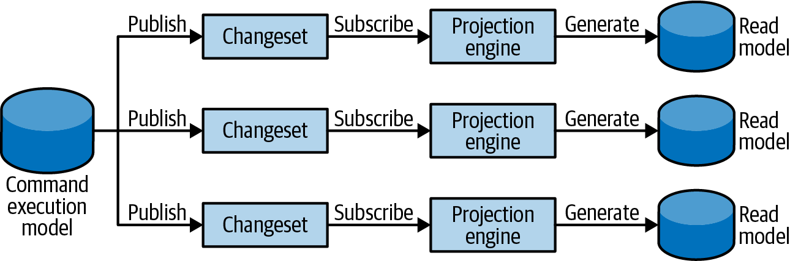

### Chapter 8: Architectural Patterns - Summary

This chapter moves from the implementation details of business logic to the broader context of application architecture. It explores three predominant patterns—**Layered Architecture**, **Ports & Adapters**, and **Command-Query Responsibility Segregation (CQRS)**—that organize the interactions between a system's business logic and its infrastructural components like UIs and databases.

---

### Layered Architecture

This is a traditional and common pattern that organizes a codebase into horizontal layers based on technical concerns.

#### Layers and Their Responsibilities

1.  **Presentation Layer:** The system's public interface. This includes not just GUIs but any entry point for consumers (APIs, CLIs, message subscriptions).
    
2.  **Business Logic Layer (BLL):** The heart of the software. This is where business rules are implemented using patterns like Transaction Script, Active Record, or Domain Model.
    
3.  **Data Access Layer (DAL):** Provides access to persistence and other external information providers (databases, object storage, external APIs).
    

#### Communication and Dependencies

*   Dependencies flow in one direction: **top-down**. The Presentation Layer depends on the BLL, and the BLL depends on the DAL. The BLL has no knowledge of the Presentation Layer.

#### Variation: The Service Layer
An additional **Service Layer** (or Application Layer) can be introduced between the Presentation and Business Logic layers.

*   **Purpose:** Acts as a façade for the BLL, orchestrating business logic and transactions. It decouples the Presentation Layer from the implementation details of the business logic.
*   **Benefits:** Promotes reuse across different UIs, improves modularity, and simplifies testing.

#### When to Use Layered Architecture
*   It's a good fit for simpler applications where the business logic is implemented with **Transaction Script** or **Active Record**, as these patterns are often tightly coupled to the database.
*   It is less ideal for a pure **Domain Model**, which should have no knowledge of the database.

---

### Ports & Adapters (Hexagonal Architecture)

This pattern addresses the shortcomings of the Layered Architecture by inverting the dependencies, placing the business logic at the true center of the system.

#### Core Principle: Dependency Inversion
High-level modules (business logic) should not depend on low-level modules (infrastructure). Instead, both should depend on abstractions. The dependency arrow is "flipped" to point inward toward the business logic.

#### Ports and Adapters Explained

*   **Business Logic (Core/Domain):** The center of the architecture. It contains the pure business logic (e.g., Aggregates) and has **zero dependencies** on any infrastructure.
*   **Ports:** Interfaces defined *by the business logic layer*. These define the contracts for what the application needs from the outside world (e.g., `IMessageBus`, `ITicketRepository`).
*   **Adapters:** Concrete implementations of the ports, located in the **Infrastructure Layer**. For example, `SqsBusAdapter` would be a concrete implementation of the `IMessaging` port.
*   **Application Layer:** Similar to the Service Layer, it orchestrates the use cases by calling the business logic.

#### When to Use Ports & Adapters
*   It is the **perfect fit for the Domain Model pattern**, as it cleanly decouples the business logic from all technological concerns.
*   This pattern is also known as **Hexagonal Architecture**, **Onion Architecture**, or **Clean Architecture**. They share the same core principles.

---

### Command-Query Responsibility Segregation (CQRS)

CQRS takes the separation of concerns a step further by creating completely separate models for **writing** data (commands) and **reading** data (queries).

#### Models in CQRS

1.  **Command Execution Model (The "Write Model"):**
    *   The single source of truth.
    *   Handles all state changes (commands).
    *   Optimized for transactional consistency and business rule validation.
2.  **Read Models (The "Projections"):**
    *   Can have many different read models, each tailored for a specific use case (e.g., a search index, a reporting view, a denormalized UI view).
    *   They are **read-only** and eventually consistent.
    *   Can be stored in different types of databases (Polyglot Persistence).

#### Projecting Read Models

The system must keep the read models synchronized with the write model.

*   **Synchronous Projection:** A projection engine periodically polls the write model's database for new changes (using a checkpoint/rowversion) and updates the read models.
    
    
*   **Asynchronous Projection:** The write model publishes events to a message bus. Subscribers (projectors) consume these events to update the read models.
    

#### When to Use CQRS
*   It is almost **mandatory for event-sourced systems**, as the event store itself is not easily queryable.
*   When you need to use different database technologies for reads and writes (Polyglot Persistence).
*   When you have complex querying needs that are difficult to serve from a normalized transactional model.

---

### Scope and Architectural Slices

These architectural patterns are not all-or-nothing, system-wide decisions. A single Bounded Context can (and often should) be composed of multiple vertical "slices," where each slice uses the architectural pattern best suited for its subdomain's complexity.

---

### Actionable Tips from Chapter 8

> **1. Match the Architecture to the Business Logic.** Use Layered Architecture for simple Transaction Script/Active Record logic. Use Ports & Adapters for complex Domain Model logic. Use CQRS when you need multiple read models or are using Event Sourcing.

> **2. Put the Business Logic at the Center.** For any non-trivial system, strive to isolate your business logic from infrastructure. The Ports & Adapters pattern is the best way to achieve this. Your core domain should not know whether it's talking to a SQL database or a message queue.

> **3. Commands Can and Should Return Data or failures.** A common CQRS misconception is that commands must return `void`. It is perfectly acceptable (and often better for user experience) for a command to return the resulting state from the *write model* to avoid a round trip. If command fail then it should inform about this user, precisely what happened

> **4. Prefer Synchronous Projections for Simplicity.** While asynchronous projections offer scaling benefits, they introduce the complexities of distributed systems (out-of-order messages, duplicates). Start with a simpler synchronous catch-up subscription model unless you have a clear need for asynchronous projections.

> **5. Don't Apply One Architecture to the Entire Bounded Context.** Think in vertical slices. A single bounded context might contain a core subdomain using CQRS and a supporting subdomain using a simple Layered Architecture. This prevents over-engineering simple parts of your system.

> **6. The Service/Application Layer is Your Friend.** Use it as a façade to orchestrate your business logic. This keeps your presentation layer (controllers, etc.) thin and focused on UI concerns, while also providing a reusable entry point for different types of clients (web, API, etc.). 