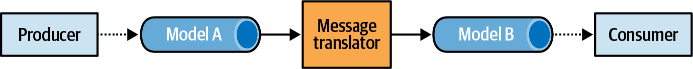

### Chapter 9: Communication Patterns - Summary

This chapter explores patterns for organizing communication *between* a system's components, moving beyond the internal architecture of a single bounded context. It covers how to handle model translation between different ubiquitous languages, how to reliably publish domain events from aggregates, and how to orchestrate complex business processes that span multiple components using Sagas and Process Managers.

---

### Model Translation

When bounded contexts in a customer-supplier relationship need to communicate, the models (ubiquitous languages) must often be translated. This can be handled by an **Anticorruption Layer (ACL)** on the downstream side or an **Open-Host Service (OHS)** on the upstream side. The translation logic can be stateless or stateful.

#### Stateless Model Translation

This involves on-the-fly translation of requests or messages, typically using a proxy pattern.


*   **Synchronous Communication:**
    *   **In-code:** The translation logic is embedded directly in the bounded context's codebase.
    *   **API Gateway:** The logic is offloaded to an external component like Kong or AWS API Gateway. This is useful for managing multiple API versions or creating a shared ACL, sometimes called an **interchange context**.


*   **Asynchronous Communication:**
    *   **Message Proxy:** An intermediary component subscribes to messages, transforms them, filters them, and forwards them to the target.
    *   **Published Language for Events:** It's crucial to translate internal domain events into a stable, public format (**published language**) before they are consumed by other contexts. This hides implementation details and differentiates between private and public events.




#### Stateful Model Translation

Required for more complex transformations that need to track state, often involving a database.

*   **Use Cases:**
    1.  **Aggregating Incoming Data:** Combining multiple fine-grained messages into a single, unified one, or batching requests for performance.
    2.  **Unifying Multiple Sources:** Combining data from multiple bounded contexts, such as in a Backend-for-Frontend (BFF) pattern or a complex ACL.


---

### Integrating Aggregates: The Outbox Pattern

A critical challenge is publishing domain events reliably. Simply publishing an event to a message bus before or after committing the aggregate's state to the database can lead to inconsistencies if one of the two operations fails. The **Outbox pattern** solves this.


#### How It Works

1.  **Atomic Write:** In a single atomic database transaction, the system commits both the aggregate's state changes *and* the new domain events (to an "outbox" collection or table).
2.  **Relay Fetch:** A separate process, the message relay, fetches unpublished events from the outbox.
3.  **Publish:** The relay publishes the events to the message bus.
4.  **Mark as Published:** Upon confirmation from the message bus, the relay marks the events as published (or deletes them) in the outbox.

This pattern guarantees **at-least-once delivery** of messages.

#### Implementation

*   **Relational DB:** Use a dedicated `outbox` table, written to in the same transaction as the aggregate's table.
*   **NoSQL DB:** Embed the outbox collection directly within the aggregate's document.


```json
{
  "campaign-id": "...",
  "state": { ... },
  "outbox": [
    {
      "type": "campaign-deactivated",
      "published": false,
      ...
    }
  ]     
}
```

*   **Fetching Events:**
    *   **Pull (Polling):** The relay continuously queries the database for unpublished events.
    *   **Push (Transaction Log Tailing):** The relay subscribes to the database's change stream (e.g., AWS DynamoDB Streams) to be notified of new events.

---

### Long-Running Business Processes

#### The Saga Pattern

A saga is used to implement a business process that spans multiple transactions, often involving multiple aggregates or bounded contexts. It is a long-running process that listens for domain events and issues commands to other components.

*   **Core Function:** A saga orchestrates a sequence of transactions. If a step fails, it's responsible for issuing **compensating actions** to maintain system consistency.
*   **Consistency:** Sagas manage processes that are **eventually consistent**. They do not provide atomic, cross-component transactions.
*   **Implementation:** Can be stateless (for simple event-to-command mapping) or stateful (often as an event-sourced aggregate to track history).


#### The Process Manager Pattern

A Process Manager is a more advanced pattern for orchestrating complex business processes that involve branching logic and explicit state management.


*   **Saga vs. Process Manager:**
    *   A **Saga** handles simple, linear flows (event A triggers command B). It's implicitly started by an event.
    *   A **Process Manager** handles complex workflows with conditional logic (`if-else`). It represents a coherent business process and must be **explicitly instantiated** and managed as a stateful entity, often an aggregate itself.


---

### Actionable Tips from Chapter 9

> **1. Use Model Translation to Protect Bounded Contexts.** Use an Anticorruption Layer (ACL) or Open-Host Service (OHS) to translate models between contexts. Use stateless translation for simple mappings and stateful translation when you need to aggregate or unify data from multiple sources.

> **2. Use the Outbox Pattern for Reliable Event Publishing.** This is the standard solution to ensure that domain events are published reliably after an aggregate's state is committed. It guarantees at-least-once delivery and prevents data inconsistencies between your database and message-based subscribers.

> **3. Differentiate Between Private and Public Events.** Don't expose your internal domain events directly. Use asynchronous model translation (a message proxy) to convert them into a stable, integration-focused **Published Language** that hides implementation details.

> **4. Use Sagas for Simple, Cross-Component Processes.** If you need to orchestrate a linear sequence of transactions across multiple aggregates (e.g., "if this event happens, then execute that command"), a saga is the right tool.

> **5. Use Process Managers for Complex Business Workflows.** When your process involves branching logic, multiple steps, and requires its own managed state (e.g., a trip booking with approvals and cancellations), use a Process Manager. It's explicitly created and managed like an aggregate.

> **6. Respect the Consistency Boundary.** Sagas and Process Managers provide eventual consistency. Do not use them as a workaround for poorly designed aggregate boundaries. If a business operation requires multiple pieces of data to be strongly consistent, that data belongs inside a single aggregate. 