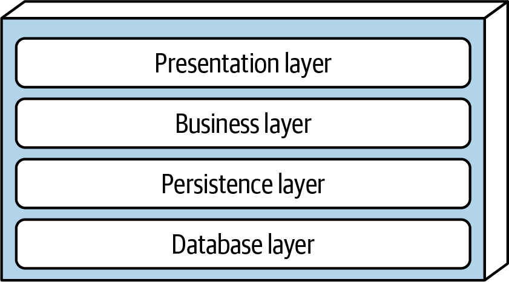
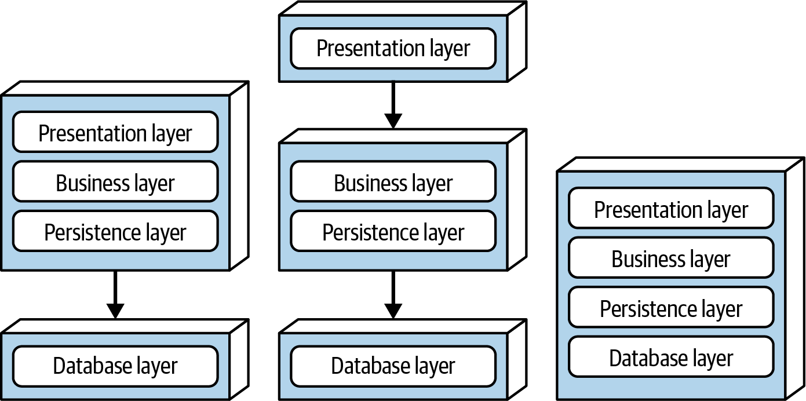
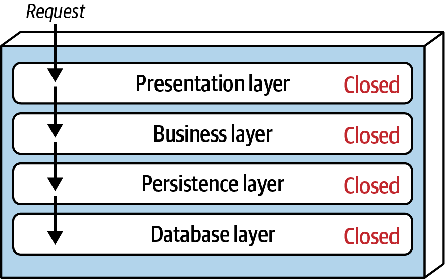
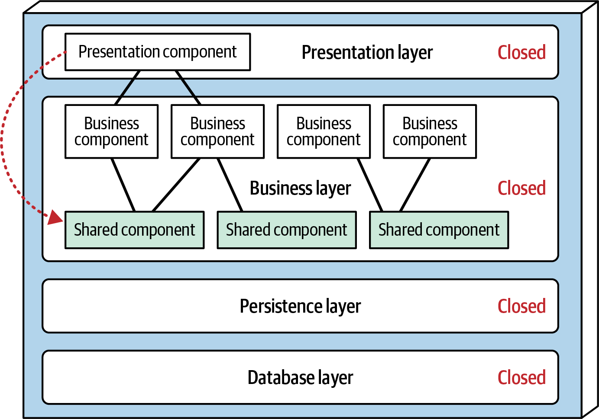
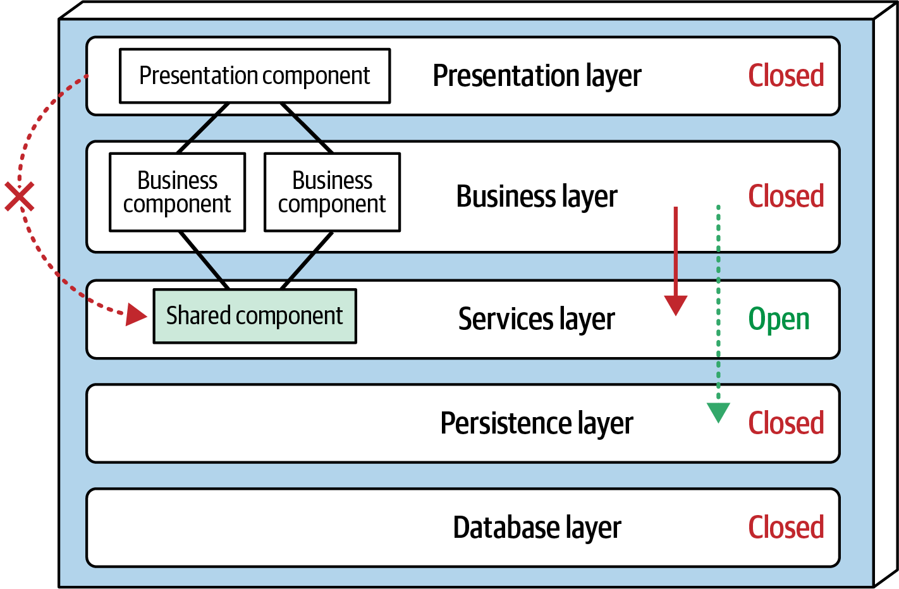
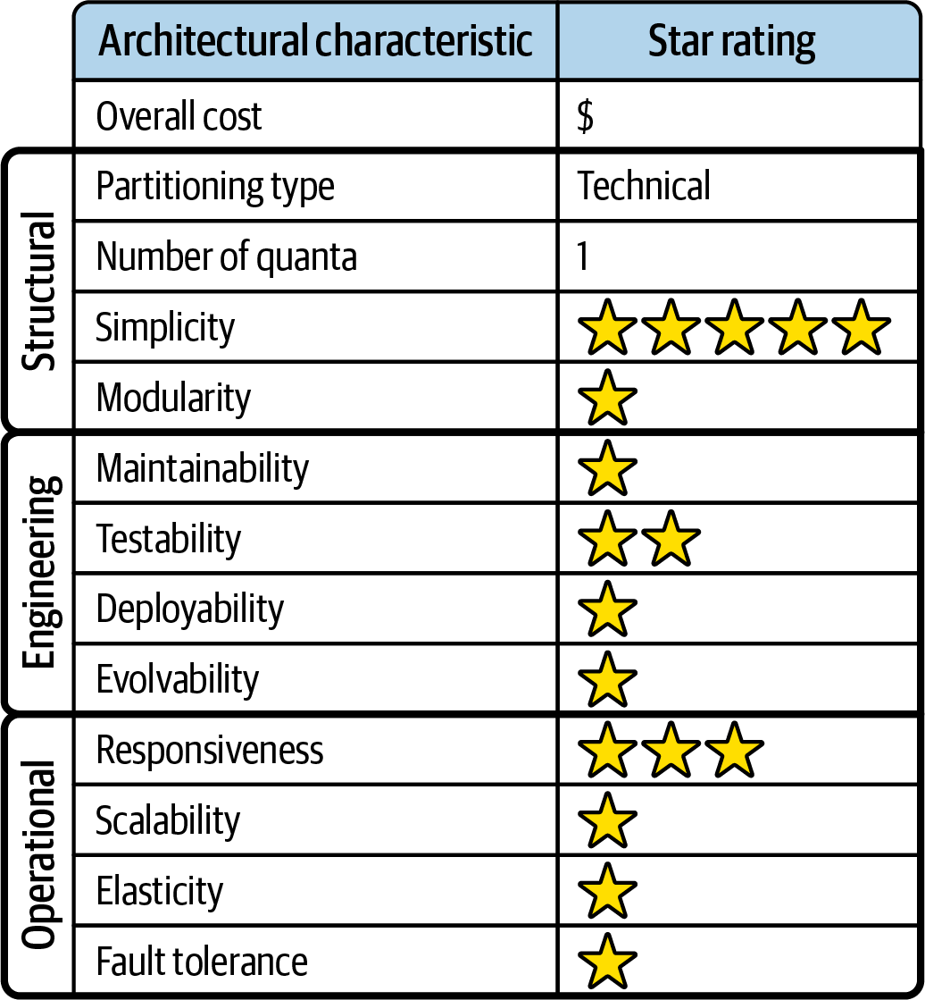

# Chapter 10: Layered Architecture Style

The **Layered Architecture Style**, also known as the *n-tiered* architecture, is one of the most common architecture styles in existence. It is the de facto standard for the vast majority of legacy applications because of its simplicity, familiarity, and low cost.

The layered architecture style often falls victim to two major antipatterns: **Architecture by Implication** and **Accidental Architecture**. When developers or architects "just start coding" without a clear idea of which architecture style they intend to use, chances are extremely high that they will inadvertently implement a layered architecture by default.

---

## Topology
Components within the layered architecture style are organized into logical horizontal layers. Each layer performs a highly specific technical role within the application (e.g., handling presentation logic or executing business rules).

While there are no specific restrictions on the exact number or types of layers, most standard layered architectures consist of four core layers: **Presentation**, **Business**, **Persistence**, and **Database**. 



*(Note: Some architectures combine the Business and Persistence layers into a single layer, particularly when raw persistence logic like SQL is embedded directly within the Business layer components. Smaller applications might only have three layers, while complex enterprise systems may contain five or more).*

### Physical Deployment Variants
While the *logical* layers remain consistent, the *physical* deployment topology can vary wildly based on the era and the scale of the application. 



As illustrated above, there are three common physical deployment variants:
1.  **Standard:** Combines Presentation, Business, and Persistence into a single monolithic deployment unit, connected to an external Database.
2.  **Split Presentation:** Physically separates the Presentation layer into its own standalone deployment unit, with Business and Persistence combined into a backend unit, connected to an external Database.
3.  **Fully Embedded:** Combines all four layers—including an embedded, in-memory Database—into a single massive deployment unit. Many on-premises (on-prem) desktop products and mobile applications are built using this specific variant.

---

## Separation of Concerns
The defining characteristic of the layered architecture style is the **Separation of Concerns**. Each layer forms a rigid abstraction around the specific work required to satisfy a business request.

For example, the **Presentation** layer is strictly responsible for handling UI and browser communication logic. It doesn't need to know (and shouldn't care) *how* to get customer data—it only needs to display it. 

Similarly, the **Business** layer is strictly responsible for executing business rules. It shouldn't care about HTML formatting, nor should it care about exactly *where* the data comes from. It simply asks the Persistence layer for data, executes business logic against it, and passes it back up to Presentation.

### Technical Partitioning Trade-Offs
This separation of concerns makes it incredibly easy to build effective role and responsibility models. Frontend developers can work exclusively in the Presentation layer without needing to understand SQL, and DBAs can work exclusively in the Persistence layer without needing to understand CSS. 

However, this comes with a massive trade-off: **A lack of overall holistic agility.**

As discussed in Chapter 9, the layered architecture is a *technically partitioned* architecture. Components are separated by their technical role, not by their business domain. 

As a result, a specific business domain (like `Customer`) is violently smeared across the entire architecture. The `Customer` domain exists in the Presentation layer, the Business layer, the Persistence layer, and the Database layer. Making a simple change to the `Customer` domain forces developers to open multiple layers and make sweeping, highly coordinated changes. Because of this, Domain-Driven Design (DDD) is a notoriously poor fit for the layered architecture style.

---

## Layers of Isolation (Open and Closed Layers)
While layers encapsulate specific technical responsibilities, they also exhibit a critical characteristic: they can be either **Open** or **Closed**. 

In an architecture where all layers are **Closed**, a request moving from the top down cannot skip any layers. A request originating in the Presentation layer *must* pass through the Business layer before it is allowed to reach the Persistence layer. 



At first glance, this seems wildly inefficient. Wouldn't it be much faster for the Presentation layer to bypass the Business layer and talk directly to the Database for simple read requests? To do that, the layers would have to be marked as **Open**.

So, which is better? The answer lies in the concept of **Layers of Isolation**.

### The Value of Layers of Isolation
The concept of *Layers of Isolation* dictates that changes made deep within one layer should not impact components in other layers. 

If layers are closed, each layer is effectively independent with zero knowledge of the inner workings of the layers below it. If the DB team completely rewrites the Persistence layer, the Presentation layer is completely unaffected because the Business layer isolated it from the blast radius.

However, if the Persistence layer was *Open*, and the Presentation layer bypassed the Business layer to read from it directly, a change to the Persistence layer would instantly break both the Business layer *and* the Presentation layer. This destroys the layers of isolation, creating a highly coupled, brittle architecture that is incredibly dangerous to change.

(Because of this isolation, you can safely replace your entire legacy UI framework with a modern one without having to touch a single line of backend Business logic).

---

## Adding Layers (Mixing Open and Closed)
While keeping layers closed facilitates isolation, there are times when it makes sense to deliberately open a specific layer. 

Consider a scenario where the Business layer contains several shared utility objects (logging, date formatting, auditing). The architect wants to explicitly restrict the Presentation layer from accessing these shared objects. 



If the shared objects remain inside the Business layer, it is incredibly difficult to govern this rule. Architecturally, the Presentation layer is *supposed* to have access to the Business layer, meaning developers will inevitably access the shared objects. 

To solve this, the architect can introduce a new **Services Layer** explicitly for these shared objects. Because the Business layer above it is closed, the Presentation layer is architecturally restricted from reaching the new Services layer. 

However, there is a catch: if the new Services layer is closed, the Business layer would be forced to route all database requests through the Services layer just to reach the Persistence layer!



The solution is to mark the new Services layer as **Open**. This allows the Business layer to access the Services layer when it needs utility objects (solid line), but allows it to completely *bypass* the Services layer and talk directly to the Persistence layer when it needs database access (dotted line). 

> [!WARNING]
> Leveraging open and closed layers is a powerful tool, but failing to document and communicate *which* layers are open and closed (and why) will inevitably result in a spaghetti architecture.

---

## The Architecture Sinkhole Antipattern
Every single layered architecture will eventually experience the **Architecture Sinkhole Antipattern**. 

This antipattern occurs when requests simply fall through the layers with absolutely no business logic performed. For example:
1.  **Presentation** asks for a customer's address.
2.  **Business** does absolutely nothing but pass the request down to Persistence.
3.  **Persistence** executes a simple SQL read and passes the data up.
4.  **Business** does absolutely nothing but pass the data up to Presentation.

This "sinkhole" forces the system to perform unnecessary object instantiation and processing, draining memory and performance for zero benefit.

Every layered architecture will have some sinkholes, but the key is analyzing the percentage. The **80-20 Rule** is a good benchmark: if 20% of your requests are sinkholes, that is an acceptable trade-off for the isolation the architecture provides. However, if 80% of your requests are sinkholes, you are simply doing CRUD (Create, Read, Update, Delete) operations, and the Layered Architecture is the wrong architectural style for your problem domain.

---

## Deployment and Ecosystem Considerations

### Data Topologies
Traditionally, layered architectures form a massive monolithic system alongside a single, monolithic relational database. The common Persistence layer exists primarily to act as a bridge, mapping complex object-oriented hierarchies into the set-based realm of relational tables.

### Cloud Considerations
Because layered architectures are heavily technically partitioned, it is technically possible to deploy individual layers to a cloud provider. However, this is dangerous. Because a business workflow typically must travel through *every single layer*, the communication latency between an on-premises layer and a cloud-deployed layer will absolutely destroy performance.

### Common Risks
Layered architectures suffer from poor fault tolerance. Due to their monolithic deployment footprint, a single tiny out-of-memory (OOM) error in the Presentation layer will crash the *entire application*. 

Overall availability is also impacted due to the notoriously high Mean Time to Recover (MTTR) of monoliths. Startup times for large layered applications can easily range from 2 to 15 minutes, meaning every crash results in substantial downtime.

---

## Governance
The news for governance in this architectural style is fantastic. Because it has been the industry standard for decades, the architects who built the original structural testing tools built them with layered architectures specifically in mind. 

Using tools like ArchUnit, architects can easily define fitness functions to strictly enforce layer interactions and automatically govern which layers are open and closed.

```java
// ArchUnit fitness function to strictly govern Layered Architecture
layeredArchitecture()
    .layer("Controller").definedBy("..controller..")
    .layer("Service").definedBy("..service..")
    .layer("Persistence").definedBy("..persistence..")

    .whereLayer("Controller").mayNotBeAccessedByAnyLayer()
    .whereLayer("Service").mayOnlyBeAccessedByLayers("Controller")
    .whereLayer("Persistence").mayOnlyBeAccessedByLayers("Service")
```

---

## Team Topology Considerations
Unlike more opinionated architectural styles, the layered architecture is extremely flexible and generally works well with any team topology configuration:

*   **Stream-Aligned Teams:** Because a layered architecture represents a single flow through the system, a stream-aligned team can comfortably own the workflow top-to-bottom (UI to Database).
*   **Enabling Teams:** Because layers are strictly separated by technical concern, an enabling team can safely interface with a single layer (e.g., experimenting with a new UI library in the Presentation layer) without affecting any other layers.
*   **Complicated-Subsystem Teams:** Because each layer performs a very specific task, specialists can easily isolate their work. For example, a heavy data analytics team can hook directly into the Persistence layer to do their complex work without breaking the rest of the flow.
*   **Platform Teams:** Platform teams can leverage the massive amount of mature tooling available for layered architectures. However, they face a massive operational challenge: as the monolith inevitably grows, it will begin straining hard constraints (database connection pools, memory, concurrent users), forcing the platform team into increasingly difficult firefighting just to keep the system operational.

---

## Style Characteristics
Every architectural style is evaluated against a standard set of architectural characteristics. A 1-star rating means the characteristic is poorly supported, while a 5-star rating means it is one of the strongest features of the style.



### The Strengths
The primary strengths of the layered architecture style are **Cost** and **Simplicity**. Being a monolith, it is incredibly easy to understand and relatively cheap to build and maintain. 

However, architects must use extreme caution: these ratings are not static. The simplicity and cost-effectiveness diminish rapidly as the codebase grows larger and more complex.

### The Weaknesses
Almost every other operational and structural characteristic rates poorly:
*   **Deployability (1 Star):** Deployments are high-risk, infrequent, and involve massive ceremony. A simple 3-line code change requires the entire massive deployment unit to be redeployed, which risks introducing database or configuration conflicts. 
*   **Testability (2 Stars):** Because of the deployment size, that same 3-line code change technically requires the team to execute an hours-long regression suite to ensure nothing else broke. (It receives 2 stars instead of 1 only because the strict layers of isolation make it easy to mock/stub out entire layers during testing).
*   **Scalability & Elasticity (1 Star):** Because of the monolithic deployments and the single monolithic database, the Architecture Quantum is exactly 1. The application can only scale to a certain point before the database connection pools or memory constraints fail. 

---

## When to Use This Style
The layered architecture style is an excellent choice for:
1.  **Small, simple applications or websites.**
2.  **Tight budget and time constraints.** If an organization (like a startup) is fueled by investors and needs to deliver a working product as fast as humanly possible, the sheer simplicity of this style guarantees rapid initial development. 
3.  **The "Unknown" phase.** When an architect isn't sure what the final architecture should be, but the developers *must* begin coding immediately, the layered architecture is a safe, standard starting point. 

> [!TIP]
> If you are using a layered architecture simply as a starting point, keep code reuse to an absolute minimum and keep object inheritance hierarchies extremely shallow. This prevents deep coupling and makes it much easier to migrate to a modular distributed architecture later.

## When NOT to Use This Style
Avoid this style for **large applications**. As the codebase and team size grow, the agility, testability, maintainability, and deployability of a layered monolith will degrade aggressively until the system grinds to a halt.

---

## Real-World Examples
Because of its unparalleled ability to enforce separation of concerns, the layered architecture is foundational to computer science itself. 

**Operating Systems (Linux/Windows)** use layered architectures:
1.  **Hardware Layer:** Physical CPU, Memory, I/O.
2.  **Kernel Layer:** Hardware abstraction, memory management.
3.  **System Call Interface:** Interacts with the kernel.
4.  **User Layer:** Applications the user interacts with.

**Networking (TCP/IP / OSI Model)** uses layered architectures:
1.  **Physical Layer:** Transmits raw data.
2.  **Data Link Layer:** Error detection.
3.  **Network Layer:** Routing (IP).
4.  **Transport Layer:** Reliable transmission (TCP).
5.  **Application Layer:** Services (HTTP, SMTP).
