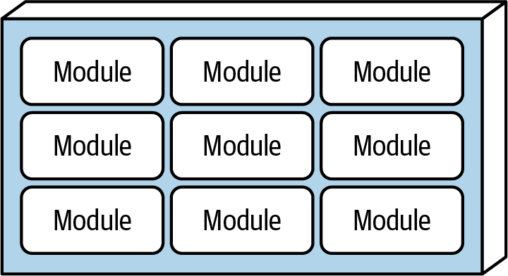
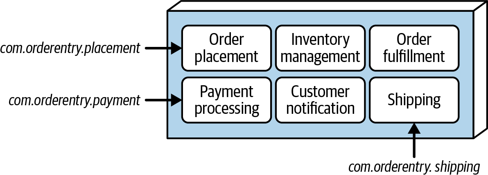
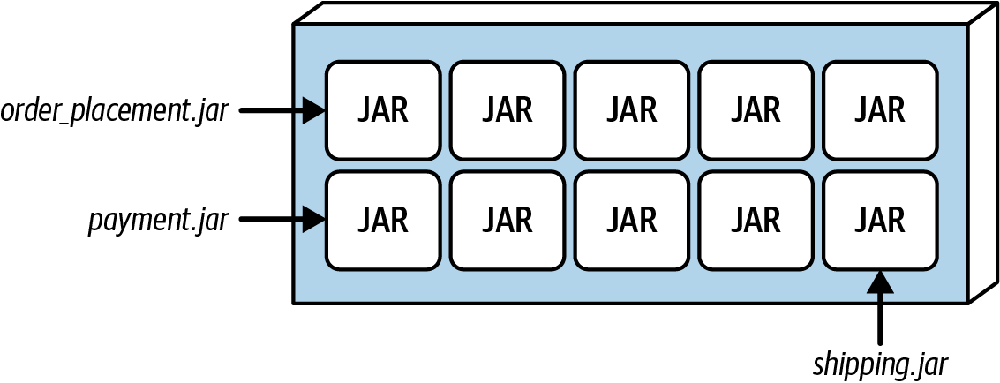
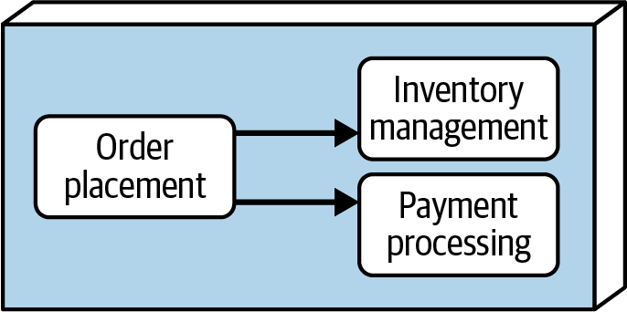
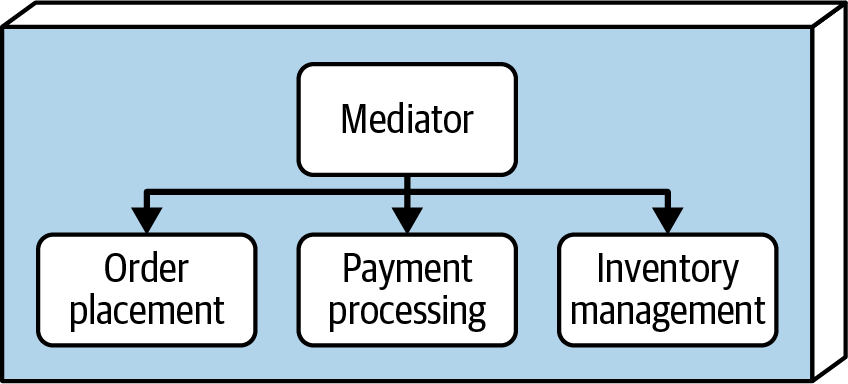
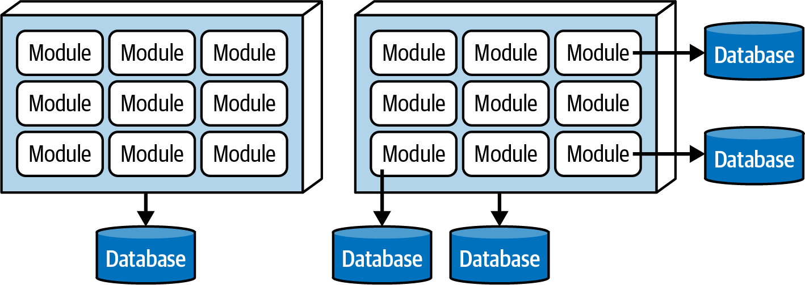
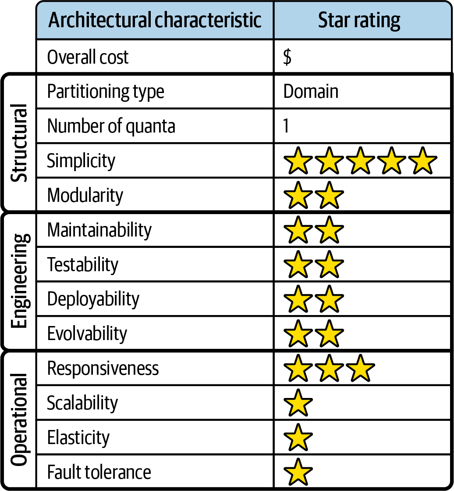
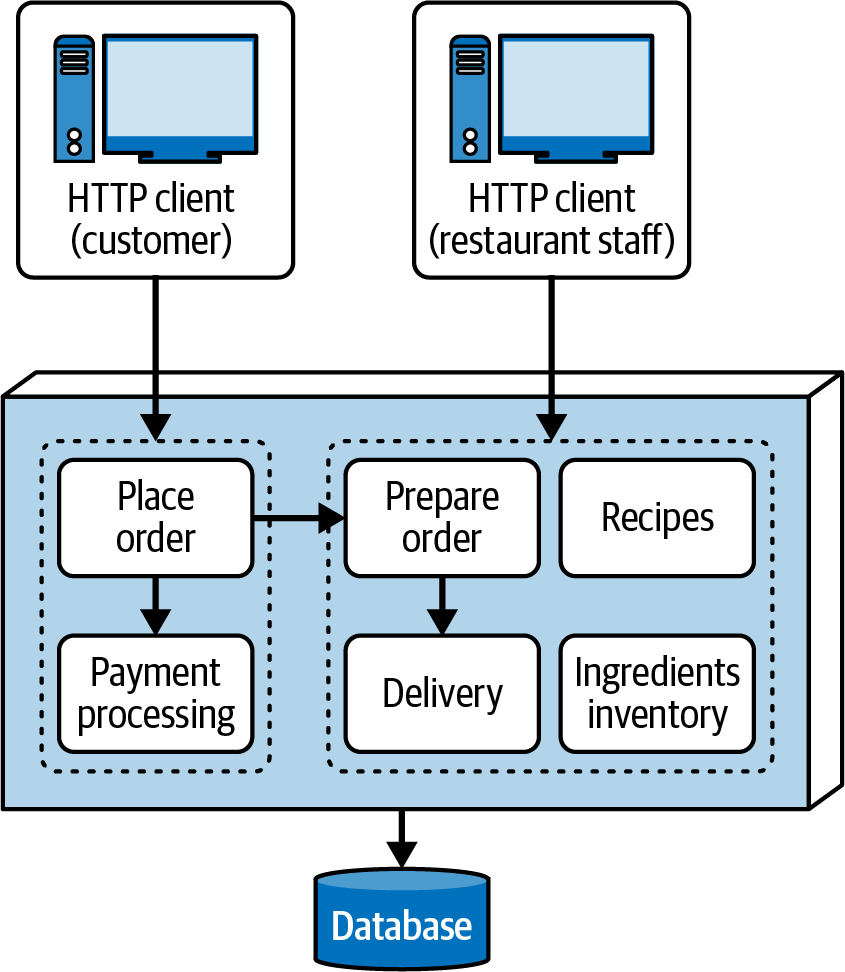

# Chapter 11: The Modular Monolith Architecture Style

Thanks to the widespread industry adoption of Domain-Driven Design (DDD) and the increasing focus on domain partitioning, the **Modular Monolith** architectural style has gained immense popularity since the first edition of this book was published in 2020. It has become so prominent that we decided to dedicate an entire new chapter to it.

---

## Topology
As the name suggests, the modular monolith is fundamentally a *monolithic architecture*. It is deployed as a single, massive unit of software (e.g., a WAR file, an EAR file, or a single .NET assembly). 

However, unlike the standard layered architecture, a modular monolith is a **domain-partitioned architecture**. Its internal functionality is grouped explicitly by business domains rather than technical capabilities. 



### The Namespace Distinction
To truly understand the difference between a technical monolith (Layered) and a domain monolith (Modular), consider the component namespaces:

In a **Layered Architecture** (technical partitioning), the presentation logic for maintaining a customer profile might be grouped like this:
`com.app.presentation.customer.profile`
*(Notice how the technical concern—`presentation`—dictates the top-level grouping).*

In a **Modular Monolith** (domain partitioning), that exact same component would be grouped like this:
`com.app.customer.profile.presentation`
*(Notice how the business domain—`customer`—dictates the top-level grouping).*

---

## Style Specifics
In this architectural style, the discrete domains (or subdomains) are referred to as **Modules**. 

There are two primary ways to physically organize these modules inside the architecture: the *Monolithic Structure* and the *Modular Structure*. As with everything in software architecture, the choice between these two structural options depends heavily on trade-offs.

### 1. The Monolithic Structure Option
In the monolithic structure option, all of the modules representing the system are contained within a single, shared source-code repository. 



Each module is simply represented by a high-level directory (or namespace) containing the components and subdomains that make up that module. For example, the namespaces for an e-commerce system might look like this:
*   `com.orderentry.orderplacement`
*   `com.orderentry.inventorymanagement`
*   `com.orderentry.paymentprocessing`
*   `com.orderentry.notification`
*   `com.orderentry.fulfillment`
*   `com.orderentry.shipping`

All the code associated with every single module is built and deployed as a single deployment unit. 

**Trade-Offs:**
This is the simplest way to build a modular monolith. All the source code is located in one place, making it incredibly easy to test, maintain, and deploy. 

However, it requires **extremely strict governance**. Because all the code lives in the exact same repository and compiles together, developers have a strong tendency to "cheat" by reusing too much code across modules or bypassing interfaces to allow too much direct communication between modules. Without strict automated governance, this structural option will rapidly degrade from a well-architected modular monolith into a catastrophic Big Ball of Mud.

### 2. The Modular Structure Option
In the modular structure option, each module is represented as an entirely independent, self-contained artifact (such as a JAR file in Java or a DLL file in .NET). These separate artifacts are then bundled together into a single deployment unit at build time.



**Trade-Offs:**
The massive advantage of this structure is strict physical isolation. Because the modules are physically separate artifacts, teams can work on them in entirely separate source code repositories. This provides significantly cleaner boundaries. Developers are physically blocked from "cheating" and accidentally tightly coupling the codebase. 

However, this option loses its effectiveness rapidly if the modules are highly dependent on one another and require constant communication. If that is the case, the monolithic structure is far superior. 

---

## Module Communication
As a general rule in architecture, communication between independent domains (modules) is never a good thing—but it is usually necessary. For example, the `OrderPlacement` module fundamentally must communicate with the `InventoryManagement` module to adjust stock, and the `PaymentProcessing` module to charge the customer. 

Architects generally use one of two primary approaches to facilitate this cross-module communication:

### 1. The Peer-to-Peer Approach
The most straightforward solution is peer-to-peer communication. A class in one module instantiates a class in another module and directly invokes its methods.



While simple, this approach is extremely dangerous depending on the structural option chosen:
*   **In a Monolithic Structure:** Because all code lives in one repo, it is too easy for developers to instantiate internal, private classes from other modules instead of using official interfaces. This creates massive coupling and quickly triggers the Big Ball of Mud antipattern. 
*   **In a Modular Structure:** Because the modules are separate JAR/DLL files, a developer must explicitly declare a compile-time dependency to invoke the class. To avoid circular dependencies, teams usually have to create shared interface JARs. If overused, this inevitably results in the "JAR Hell" (or "DLL Hell") antipattern.

### 2. The Mediator Approach
To solve the coupling issues of peer-to-peer communication, architects can introduce a **Mediator component** to form an abstraction layer between the modules. The mediator acts as an orchestrator—it accepts generic requests and routes them to the appropriate modules. 



This approach successfully decouples the individual modules from each other. 

*(Note: While the modules are decoupled from each other, the astute reader will notice that they are now all coupled to the Mediator! However, this is generally an acceptable trade-off because it keeps the business modules completely independent, placing all the routing knowledge strictly inside the orchestration component).*

---

## Deployment and Ecosystem Considerations

### Data Topologies
Because the modular monolith is a monolithic deployment unit, it naturally pairs with a single monolithic database. A shared database helps drastically reduce inter-module communication because data can simply be joined at the database level. 

However, if the modules are highly independent, the architect can strictly isolate data by creating separate, dedicated databases for each module—even though the application itself remains monolithic. 



### Cloud Considerations
While a modular monolith can be deployed to the cloud, its monolithic nature prevents it from taking full advantage of the cloud's primary benefit: on-demand elasticity. You cannot dynamically scale just the `OrderPlacement` module under heavy load; you must scale the entire massive application. That said, it can still leverage managed cloud databases, storage, and messaging queues.

### Common Risks
As with any monolithic system, the primary risk of a modular monolith is that it simply becomes **too big**. A monolith isn't inherently bad, but its characteristics degrade as size increases. Warning signs that the monolith has grown too large include:
*   Changes take far too long to make.
*   Spooky action at a distance (changing code in one area unexpectedly breaks code in another).
*   Developers constantly trigger merge conflicts and step on each other's toes.
*   Application startup times stretch into several minutes.

Another massive risk is **going overboard with code reuse**. While sharing code seems efficient, excessive reuse violently blurs the domain boundaries. If every module depends on a massive "shared utilities" module, the system will rapidly devolve into an unstructured Big Ball of Mud. 

Finally, **excessive intermodule communication** is a massive red flag. If modules are constantly talking to each other, it strongly indicates that the domain boundaries were drawn incorrectly in the first place, and the architect needs to redefine them.

---

## Automated Governance
Because the primary artifact in this style is the "Module" (which is represented by a physical directory or namespace), governing this architecture is straightforward but absolutely mandatory. If an architect does not enforce the module boundaries via automated fitness functions, developers *will* eventually violate them.

Architects use tools like ArchUnit (Java), NetArchTest (.NET), or TSArch (TypeScript) to write these governance tests.

### 1. Governing Namespace Compliance
The first step is ensuring no code exists outside the defined domain modules. The following pseudocode ensures that a developer cannot casually create a generic `com.orderentry.utils` namespace that bypasses the modular structure:

```text
# Example 11-1: Pseudocode for governing namespaces
LIST module_list = { com.orderentry.orderplacement, com.orderentry.inventorymanagement, ... }
LIST namespace_list = get_all_namespaces(root_directory)

FOREACH namespace IN namespace_list {
   IF NOT namespace.starts_with(module_list) {
      send_alert(namespace) # Fails the build if code is outside defined modules
   }
}
```

### 2. Governing the Amount of Communication
To prevent the architecture from becoming a highly-coupled knot, architects can set hard limits on how many dependencies a single module is allowed to have.

```text
# Example 11-3: Pseudocode for limiting dependency count
FOREACH module IN module_source_file_map {
    incoming_count = used_by_other_module(module)
    outgoing_count = uses_other_module(module)
    total_count = incoming_count + outgoing_count
    
    IF total_count > 5 {
        send_alert(module, total_count) # Fails the build if module is too coupled
    }
}
```

### 3. Governing Specific Dependencies
Finally, architects can strictly restrict specific modules from talking to each other. For example, `OrderPlacement` should never talk directly to `Shipping`. 

```java
// Example 11-4: ArchUnit Java code governing specific dependencies
public void order_placement_cannot_access_shipping() {
   noClasses().that()
       .resideInAPackage("..com.orderentry.orderplacement..")
   .should().accessClassesThat()
       .resideInAPackage("..com.orderentry.shipping..")
   .check(myClasses);
}
```

---

## Team Topology Considerations
Because the modular monolith is explicitly a domain-partitioned architecture, it works best when the teams building it are also aligned by domain (Conway's Law). 

If a company uses technical teams (a dedicated UI team, a backend team, and a DBA team), they will struggle immensely with this architecture because building a single domain feature will require massive, difficult coordination across all three technical teams.

However, if the company uses cross-functional, domain-aligned teams, this architecture shines:
*   **Stream-Aligned Teams:** A perfect fit. A cross-functional, stream-aligned team can completely own the `OrderPlacement` module from the UI all the way down to the database.
*   **Enabling Teams:** Works very well. Specialists can safely experiment by introducing entirely new modules to the system with minimal impact on existing modules.
*   **Complicated-Subsystem Teams:** Works very well. Because modules perform specific roles, a complicated-subsystem team can take complete ownership of an incredibly complex module (e.g., `PaymentProcessing`) independent of the other teams.
*   **Platform Teams:** Works well. The strict modularity allows developers to easily leverage common tools, APIs, and services provided by the platform team.

---

## Style Characteristics
Every architectural style is evaluated against a standard set of architectural characteristics. A 1-star rating means the characteristic is poorly supported, while a 5-star rating means it is one of the strongest features of the style.

Because it is monolithic, the Architecture Quantum is typically 1.



### The Strengths
The primary strengths of the modular monolith are **Cost**, **Simplicity**, and **Modularity**. 
Because it is monolithic, it entirely avoids the terrifying complexities of distributed architectures (network latency, data consistency, security). It is incredibly simple, easy to understand, and cheap to build. Crucially, unlike the Layered architecture, it achieves true architectural modularity through domain separation.

### The Weaknesses
While the modularity improves some aspects compared to a standard Layered architecture, it is still a monolith, meaning it suffers from monolithic weaknesses:
*   **Deployability & Testability (2 Stars):** These rate slightly higher than the Layered architecture because the strict module boundaries make mocking and testing easier. However, deployments still require massive ceremony, and shipping a 1-line change still requires deploying the entire massive monolith and running huge regression suites.
*   **Scalability & Elasticity (1 Star):** Because it is a single deployment unit, you cannot scale individual modules. If the `OrderPlacement` module is under heavy load, you must scale the entire application.
*   **Fault Tolerance (1 Star):** If a tiny memory leak occurs in the `Notification` module, the resulting OutOfMemoryError will crash the entire application, taking down `OrderPlacement` and `Shipping` with it.
*   **Availability:** Due to the high Mean Time To Recover (MTTR) typical of monoliths, a crash usually results in several minutes of downtime while the massive application restarts.

---

## When to Use This Style
Because of its simplicity and low cost, the modular monolith is an excellent choice for:
1.  **Tight budget and time constraints.**
2.  **The "Unknown" phase.** If a startup isn't sure what its final architectural direction should be, it is vastly safer and cheaper to start with a modular monolith than to jump blindly into the immense complexity of microservices. 
3.  **Domain-Driven Design (DDD).** Because it is explicitly domain-partitioned, it perfectly matches DDD philosophies. 
4.  **Domain-heavy changes.** If 90% of the changes to the system are domain-based (e.g., adding expiration dates to user wishlists), this style shines because the change is entirely isolated to a single domain module.

## When NOT to Use This Style
Avoid the modular monolith architecture style if:
1.  **High Operational Requirements:** If the system demands extreme scalability, elasticity, fault tolerance, or 99.999% availability, you must use a distributed architecture. Monoliths cannot provide these characteristics. 
2.  **Technically-Heavy Changes:** If the majority of changes to the system are technical rather than domain-based (e.g., constantly swapping out UI frameworks or database technologies), avoid this style. Because it is domain-partitioned, a technical change requires opening every single domain module and rewriting code, creating an agonizing coordination nightmare. (The Layered Architecture is vastly superior for technically-driven changes).

---

## Real-World Case Study: EasyMeals
**EasyMeals** is a new, small neighborhood restaurant focused entirely on fast delivery for busy professionals. 

As a small, local restaurant, their budget is extremely limited and they do not have massive scalability requirements. They simply need a system that works, is cheap to build, and is easy to maintain. The modular monolith is the perfect choice. 



Instead of technical layers, the system is partitioned cleanly into business domains (Modules):
*   `com.easymeals.placeorder`
*   `com.easymeals.payment`
*   `com.easymeals.prepareorder`
*   `com.easymeals.delivery`
*   `com.easymeals.recipes`
*   `com.easymeals.inventory`

### Exploring the Modules
To understand how components fit inside modules, consider the `PlaceOrder` module. It contains all the necessary components required to fulfill that specific business capability:
*   `com.easymeals.placeorder.menu`
*   `com.easymeals.placeorder.shoppingcart`
*   `com.easymeals.placeorder.customerdata`
*   `com.easymeals.placeorder.checkout`

Similarly, the `Payment` module handles all payment capabilities:
*   `com.easymeals.payment.creditcard`
*   `com.easymeals.payment.debitcard`
*   `com.easymeals.payment.paypal`
*(Because of the strict modularity, if EasyMeals later decides to add "Loyalty Points", developers can safely add that component right here without breaking the `PlaceOrder` module).*

### The Workflow
When a customer orders, the `PlaceOrder` module captures the user input and passes the payment data directly to `Payment`. 

Once paid, the `PlaceOrder` module communicates with the `PrepareOrder` module, which displays the ticket to the kitchen staff (`com.easymeals.prepareorder.displayorder`). 

Once the kitchen staff clicks "Ready", the workflow passes to the `Delivery` module, which assigns a driver (`com.easymeals.delivery.assign`), records any issues like a loose dog (`com.easymeals.delivery.issues`), and finally closes out the order (`com.easymeals.delivery.complete`). 

By partitioning the system by domain rather than by technical layer, developers can easily locate exact features and safely maintain the codebase. This perfectly illustrates the sheer power and simplicity of the Modular Monolith style.
