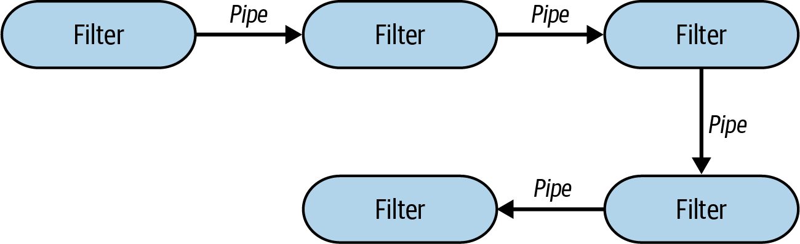
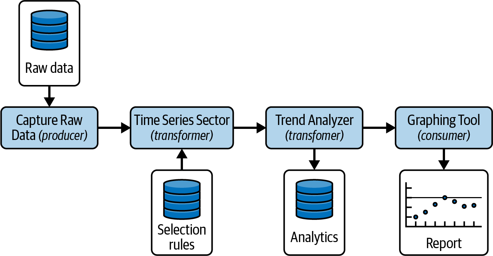
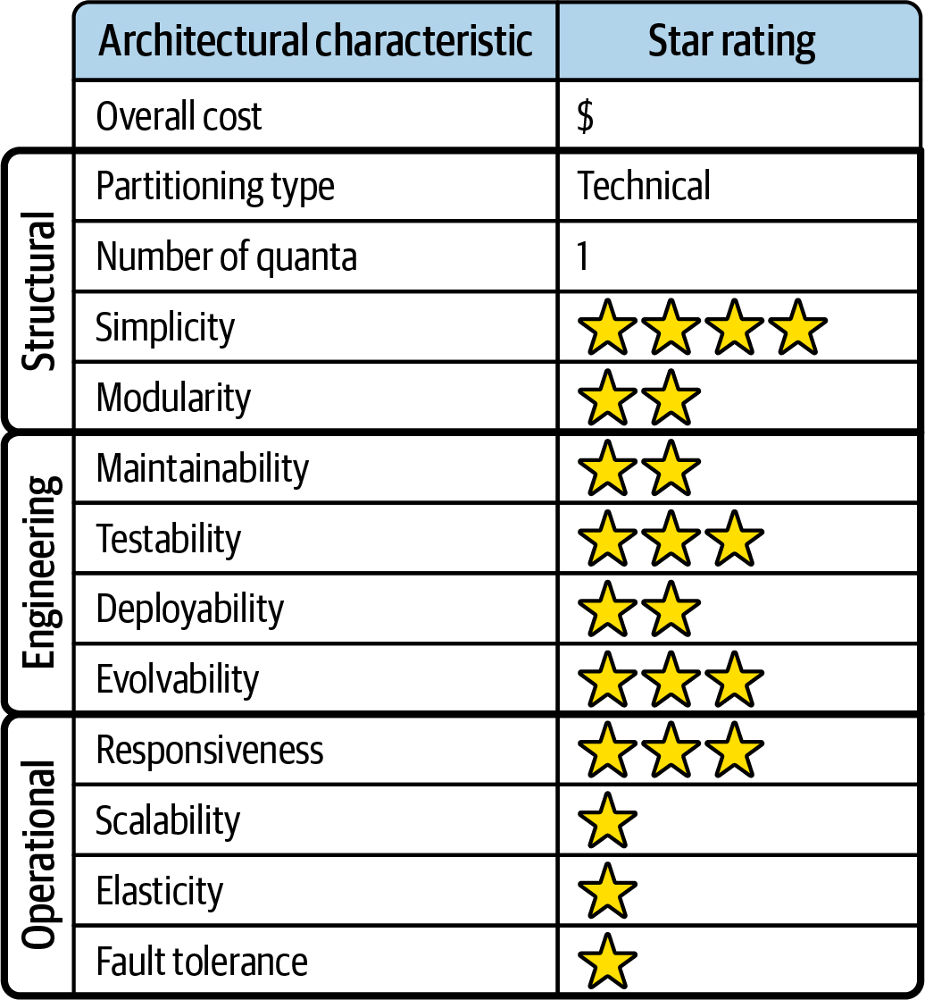
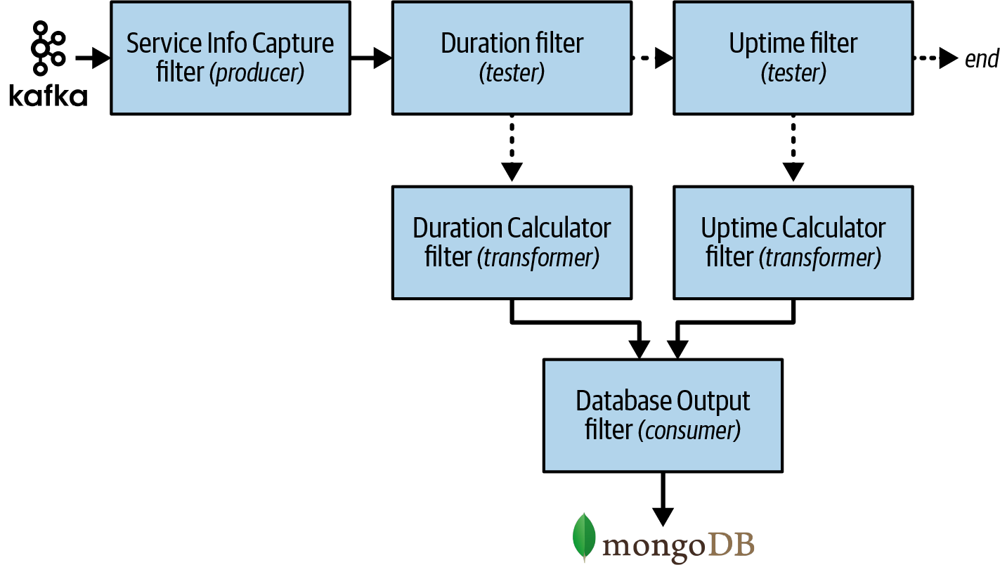

# Chapter 12: Pipeline Architecture Style

One of the most fundamental styles in software architecture is the **Pipeline Architecture Style** (also famously known as the *Pipes and Filters* architecture). 

The moment early developers decided to split massive blocks of functionality into discrete, manageable parts, this architectural style was born. Today, most developers know this architecture intimately because it forms the underlying principle behind Unix terminal shell languages like Bash and Zsh. 

Additionally, developers working in functional programming languages will instantly recognize the parallels between language constructs (`map`, `reduce`) and this architecture. Even massive distributed systems leveraging the MapReduce programming model fundamentally follow this basic topology.

---

## Topology
The topology of the pipeline architecture is brutally simple. It consists of exactly two main component types:
1.  **Filters:** Components that contain the system functionality and perform specific business logic.
2.  **Pipes:** Communication channels that transfer data from one filter to the next in the chain.

These components coordinate in a highly specific fashion: pipes form one-way, point-to-point communication channels between the filters.



The isomorphic "shape" of the standard pipeline architecture is a **single deployment unit**, with functionality contained entirely within independent filters connected by unidirectional pipes.

---

## Style Specifics
While the vast majority of pipeline implementations are deployed as a single monolithic unit, it is technically possible to deploy each filter (or sets of filters) as standalone services—creating a distributed pipeline architecture using synchronous or asynchronous remote calls. 

Regardless of whether it is deployed monolithically or distributed, the architecture always consists of just two parts.

### 1. Filters
Filters are completely self-contained, independent pieces of functionality. They are generally stateless and strictly adhere to the single responsibility principle: a filter should perform *one task only*. Complex workflows are not handled by complex filters; they are handled by a *sequence* of simple filters. 

*(Note: Because a filter can be implemented using multiple class files, it is technically an architectural "component," as defined in Chapter 8).*

There are four primary types of filters:

*   **Producer (Source):** The starting point of the pipeline. A Producer filter is outbound-only. It generates or receives the initial data. Examples include a User Interface triggering a workflow, or an API endpoint receiving an external payload.
*   **Transformer (`map`):** A filter that accepts input, performs a transformation on some or all of the data, and forwards the mutated data to the outbound pipe. Functional programmers recognize this as the `map` operation. Examples include enhancing a payload with database lookups, or converting XML to JSON.
*   **Tester (`reduce` / `filter`):** A filter that accepts input and tests it against specific criteria. Based on the test, it optionally produces output. Functional programmers recognize this as a `reduce` or `filter` operation. Examples include a validation filter that rejects malformed data, or a business rules switch (e.g., "drop the payload if the total order amount is less than $5.00").
*   **Consumer (Sink):** The termination point of the pipeline. A Consumer filter is inbound-only. It accepts the final processed payload and persists it to a database or displays the final result on a UI screen.

#### The Power of Composition
The sheer simplicity of unidirectional pipes connecting isolated filters encourages incredible compositional reuse. 

A famous story from the blog *"More Shell, Less Egg"* perfectly illustrates this power: 
Computer science legend Donald Knuth was asked to write a program to read a text file, find the *n* most frequently used words, and print them sorted by frequency. Knuth wrote an intricate program consisting of over 10 pages of Pascal, designing a brilliant new algorithm along the way. 

Then, Doug McIlroy demonstrated a simple Unix shell script that solved the exact same problem gracefully in just a few lines of code:

```bash
tr -cs A-Za-z '\n' |
tr A-Z a-z |
sort |
uniq -c |
sort -rn |
sed ${1}q
```

Even the original designers of Unix shells are routinely stunned by the wildly inventive ways developers combine these simple but powerful composite abstractions.

### 2. Pipes
Pipes form the strict communication channels between filters. 

*   **Behavior:** Each pipe is typically unidirectional and point-to-point, accepting input from exactly one source and directing output to exactly one destination. 
*   **Payloads:** The payload can be absolutely any data format, but architects strongly favor extremely small amounts of data to guarantee high performance.
*   **Communication Mechanics:** 
    *   In *monolithic* deployments, pipes are implemented using threads or embedded messaging for asynchronous communication, or simple method calls for synchronous communication.
    *   In *distributed* deployments, pipes use REST, gRPC, messaging queues (Kafka/RabbitMQ), or streaming protocols to issue unidirectional remote calls.

---

## Deployment and Ecosystem Considerations

### Data Topologies
Because most pipeline architectures are deployed as a single monolith, they generally associate with a single monolithic database. However, this is not a strict rule. Database topology can vary wildly in this style, ranging from a single shared database to *one database per filter*.

Consider the following pipeline designed to execute continuous fitness functions (architectural tests). Notice how almost every single filter interacts with a completely separate, dedicated database:



1.  **Capture Raw Data (Producer):** Reads from a raw data DB.
2.  **Time Series Selector (Transformer):** Reads configuration from a Config DB.
3.  **Trend Analyzer (Transformer):** Stores analytics into an Analytics DB.
4.  **Graphing Tool (Consumer):** Reads from the Analytics DB to generate a UI report.

### Cloud Considerations
Due to the strict independence and modularity of the filters, the pipeline architecture is exceptionally well-suited for cloud deployments. 

While it can easily be deployed as a single monolithic unit to the cloud, its true power shines when deployed as **distributed Serverless functions**. For example, in Amazon Web Services (AWS), a pipeline architecture maps flawlessly to **AWS Step Functions**. Each filter is deployed as an entirely separate Lambda function, and the Step Function acts as the orchestrator (the pipes) mapping the unidirectional flow.

```json
{
  "Comment": "AWS Step Function: Measure and analyze scalability trends.",
  "StartAt": "Capture Raw Data",
  "States": {
    "Capture Raw Data": {
      "Type": "Task",
      "Resource": "arn:aws:lambda:region:account_id:function:raw_data_capture",
      "Next": "Time Series Selector"
    },
    "Time Series Selector": {
      "Type": "Task",
      "Resource": "arn:aws:lambda:region:account_id:function:time_series_selector",
      "Next": "Trend Analyzer"
    },
    "Trend Analyzer": {
      "Type": "Task",
      "Resource": "arn:aws:lambda:region:account_id:function:trend_analyzer",
      "Next": "Graphing Tool"
    },
    "Graphing Tool": {
      "Type": "Task",
      "Resource": "arn:aws:lambda:region:account_id:function:graphing_tool",
      "End": true
    }
  }
}
```

### Common Risks
While simple on the surface, the pipeline architecture comes with several critical risks:
1.  **Overloaded Filters:** Violating the single-responsibility principle. If a filter does too much, the composability of the architecture is destroyed.
2.  **Bidirectional Communication:** Pipes are strictly *unidirectional*. If filters are sending data back and forth to collaborate, the boundaries have failed. If bidirectional communication is truly necessary, the pipeline architecture is the wrong style.
3.  **Error Handling & Recovery:** If a pipeline fails in the middle of a 10-filter sequence, it is notoriously difficult to cleanly exit and figure out how to resume or recover the payload. Architects must design fatal error states upfront.
4.  **Contract Management:** The payload definition sent through the pipe is a strict contract. Changing the contract in a producer filter will instantly break every downstream filter that receives it. 

---

## Governance
Governing operational characteristics in a pipeline is highly specific to the use case. However, from a structural standpoint, the architect's primary job is to govern the **roles and responsibilities** of the filters.

Unfortunately, it is almost impossible to write automated fitness functions (e.g., using ArchUnit) to verify that a "Transformer" filter is actually transforming data and not testing data, because that is a semantic, behavioral distinction, not a structural one.

To mitigate this and guide developers, architects rely on **Metadata Tags** (Annotations in Java, Attributes in C#). 

Because a complex filter might be made of several class files, the architect creates an `@FilterEntrypoint` tag to explicitly mark the starting class of the component, and a `@Filter` tag to explicitly define its role:

**Java Implementation:**
```java
// Define the Tag
@Retention(RetentionPolicy.RUNTIME)
@Target(ElementType.TYPE)
public @interface Filter {
   public FilterType value();
   public enum FilterType { PRODUCER, TESTER, TRANSFORMER, CONSUMER }
}

@Retention(RetentionPolicy.RUNTIME)
@Target(ElementType.TYPE)
public @interface FilterEntrypoint {}

```java
// Apply the Tag to the Filter Component
@FilterEntrypoint
@Filter(FilterType.TRANSFORMER)
public class TrendAnalyzerFilter {
   // Implementation...
}
```

While tagging does not physically compile-block a developer from writing `TESTER` logic inside a `TRANSFORMER` filter, it provides powerful, programmatic context that continually reminds the developer of the specific rules and responsibilities they are expected to adhere to.

---

## Team Topology Considerations
Unlike more rigid architectural styles, the pipeline architecture is generally agnostic to team topologies and works flawlessly with almost any configuration:

*   **Stream-Aligned Teams:** A perfect fit. Because a pipeline represents a single deterministic flow through the system, a stream-aligned team can easily own the entire workflow from beginning to end.
*   **Enabling Teams:** Works very well. Because the architecture is highly modular, an enabling team can easily inject an experimental filter into the middle of the pipeline to test a new theory without disrupting the normal flow.
*   **Complicated-Subsystem Teams:** Works very well. The unidirectional handoffs mean a complicated-subsystem team can take complete ownership of an incredibly complex filter without needing to understand the rest of the pipeline.
*   **Platform Teams:** Platform teams can leverage the strict modularity to easily provide common tools and API frameworks for building filters.

---

## Style Characteristics
Every architectural style is evaluated against a standard set of architectural characteristics. A 1-star rating means the characteristic is poorly supported, while a 5-star rating means it is one of the strongest features of the style.

Because the pipeline architecture is usually implemented as a monolithic deployment, its **Architecture Quantum is always 1**. It is also considered a **technically partitioned architecture**, as the logic is separated into technical filter types rather than domains.



### The Strengths
The primary strengths of the pipeline architecture are **Cost**, **Simplicity**, and **Modularity**. 
Because it is typically monolithic, it completely avoids the massive complexities of distributed systems. It is simple to build and maintain. Additionally, it achieves a very high level of architectural modularity: you can seamlessly yank out a filter and drop in a replacement without affecting any other filters.

### The Weaknesses
While modularity improves its rating compared to the standard Layered architecture, the pipeline is still a monolith and suffers from monolithic weaknesses:
*   **Deployability & Testability (Average):** These rate higher than in a Layered architecture because the strict isolation of filters makes unit testing and mocking very easy. However, it still requires the massive ceremony and risk of deploying an entire monolithic unit.
*   **Scalability & Elasticity (1 Star):** Because it is a monolith, you cannot dynamically scale an individual filter. 
*   **Fault Tolerance & Availability (1 Star):** If a single filter triggers an OutOfMemoryError, the entire monolithic application crashes. Furthermore, startup times are notoriously slow (high MTTR).

*(Note: Architects can solve the 1-star ratings by implementing the pipeline as a distributed architecture using async communication. However, this perfectly illustrates the primary law of software architecture trade-offs: fixing Scalability completely destroys the Cost and Simplicity ratings).*

---

## When to Use This Style
The pipeline architecture is an excellent choice for:
1.  **Ordered, deterministic processing.** If the workflow has distinct, one-way, predictable steps, this style is unbeatable. 
2.  **Tight budgets and timeframes.** The extreme simplicity makes it very cheap to build.
3.  **Data processing.** This is the exact underlying architecture used for almost all Extract, Transform, and Load (ETL) tools, Electronic Data Interchange (EDI) systems, and orchestrators like Apache Camel. 

## When NOT to Use This Style
Avoid the pipeline architecture style if:
1.  **You need massive scale and fault tolerance.** (Unless you are willing to accept the cost of building a distributed pipeline). 
2.  **You require back-and-forth communication.** Pipes are strictly one-way. If filters need to constantly query each other, this architecture will fail. 
3.  **You have highly non-deterministic workflows.** While you *can* hack the pipeline to handle chaotic branching logic by chaining dozens of Tester filters, you shouldn't. An Event-Driven Architecture (Chapter 15) is vastly superior for non-deterministic flows.

---

## Real-World Example
To illustrate the power and separation of concerns in the pipeline architecture, consider the following telemetry processing system:



In this example, service telemetry data is streamed via Apache Kafka into a monolithic pipeline. Notice the strict separation of concerns:
1.  **Service Info Capture (Producer):** Its *only* job is connecting to Kafka and receiving streaming payloads. It knows absolutely nothing about metrics.
2.  **Duration (Tester):** Checks if the payload contains duration metrics. If yes, it routes it to the `Duration Calculator`. If no, it routes it down to the next tester.
3.  **Duration Calculator (Transformer):** Does the heavy math.
4.  **Uptime (Tester):** Checks if the payload contains uptime metrics. If yes, it routes it to the `Uptime Calculator`. If no, it drops the payload entirely (pipeline ends).
5.  **Uptime Calculator (Transformer):** Does the heavy math.
6.  **Database Output (Consumer):** Its *only* job is persisting the final calculated metrics into MongoDB.

This workflow is incredibly extensible. If the business later decides they want to track "Database Connection Wait Time", the developer simply drops a new Tester filter into the pipeline. The Kafka producer and the MongoDB consumer never have to be touched.
