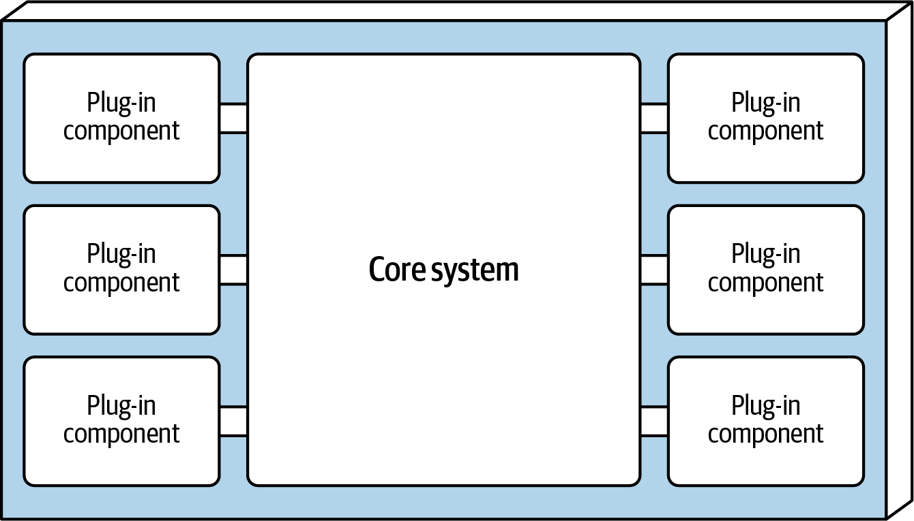
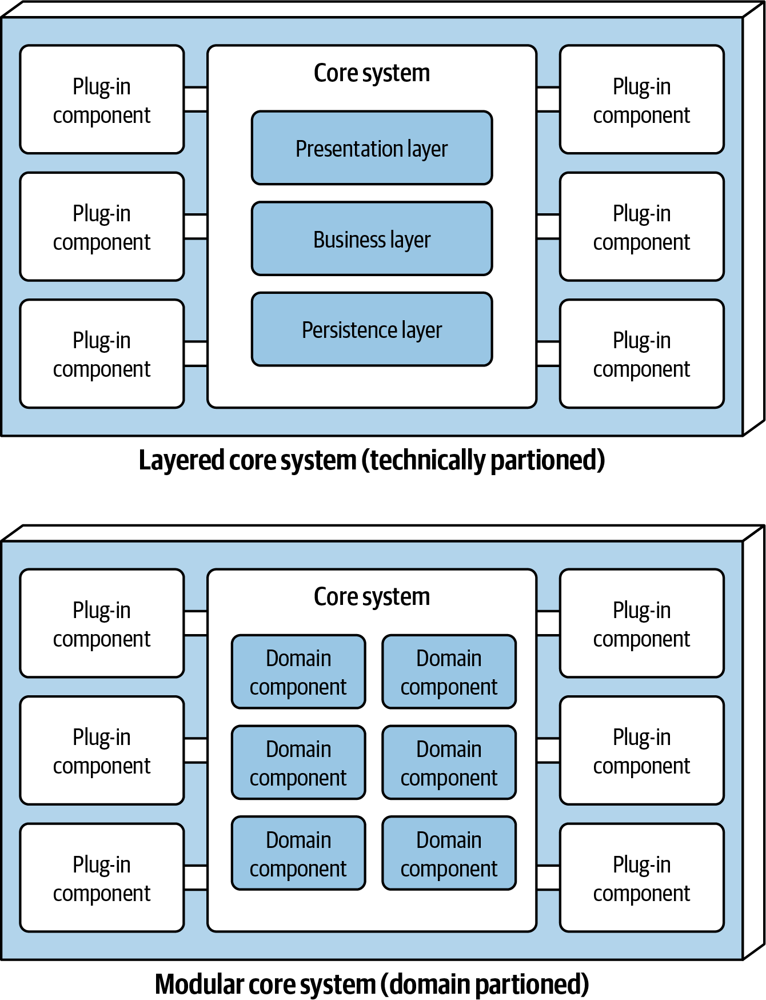
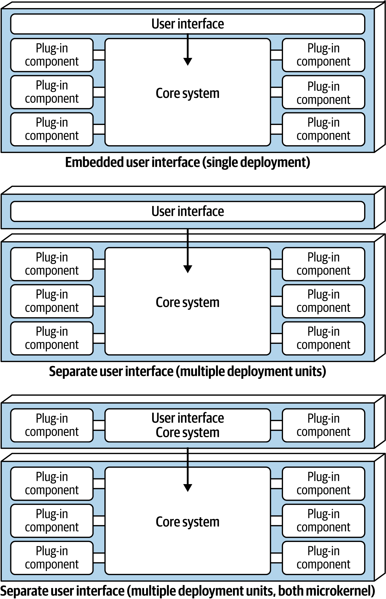
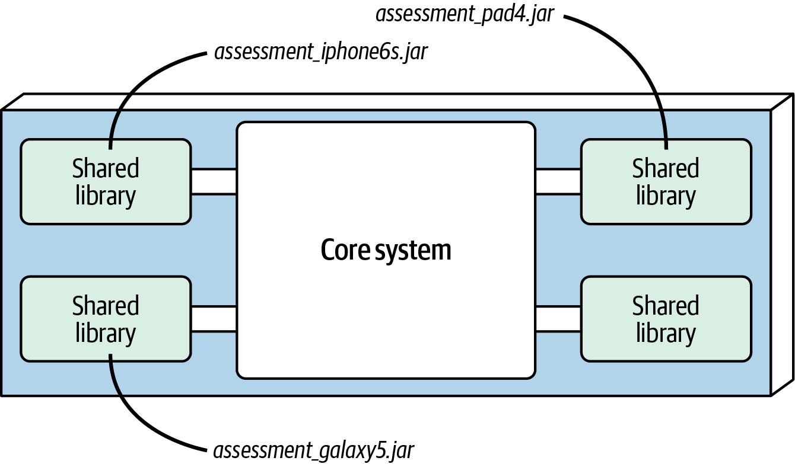
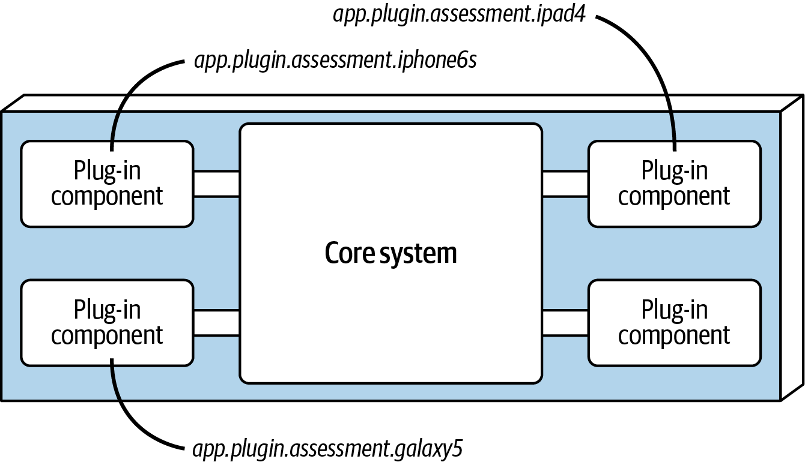
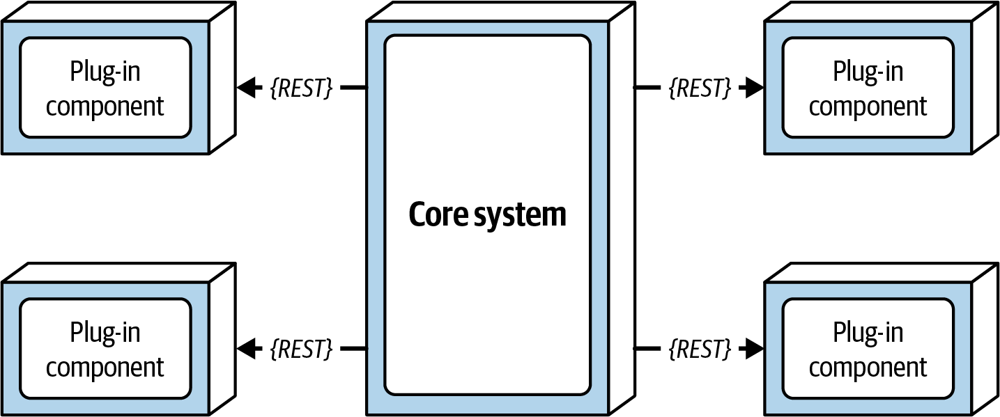
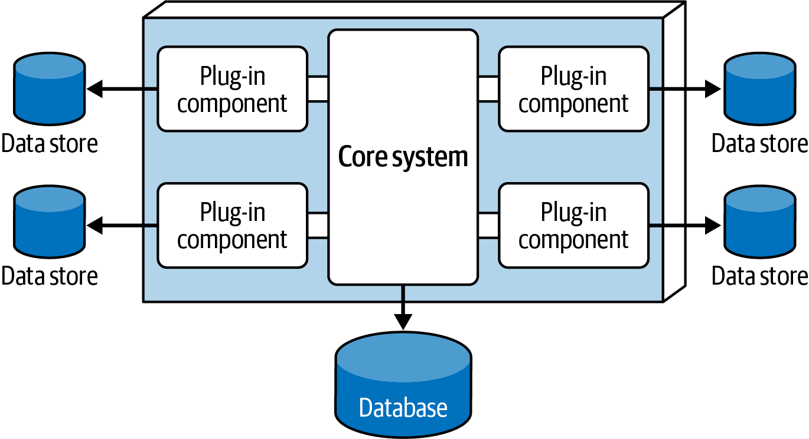
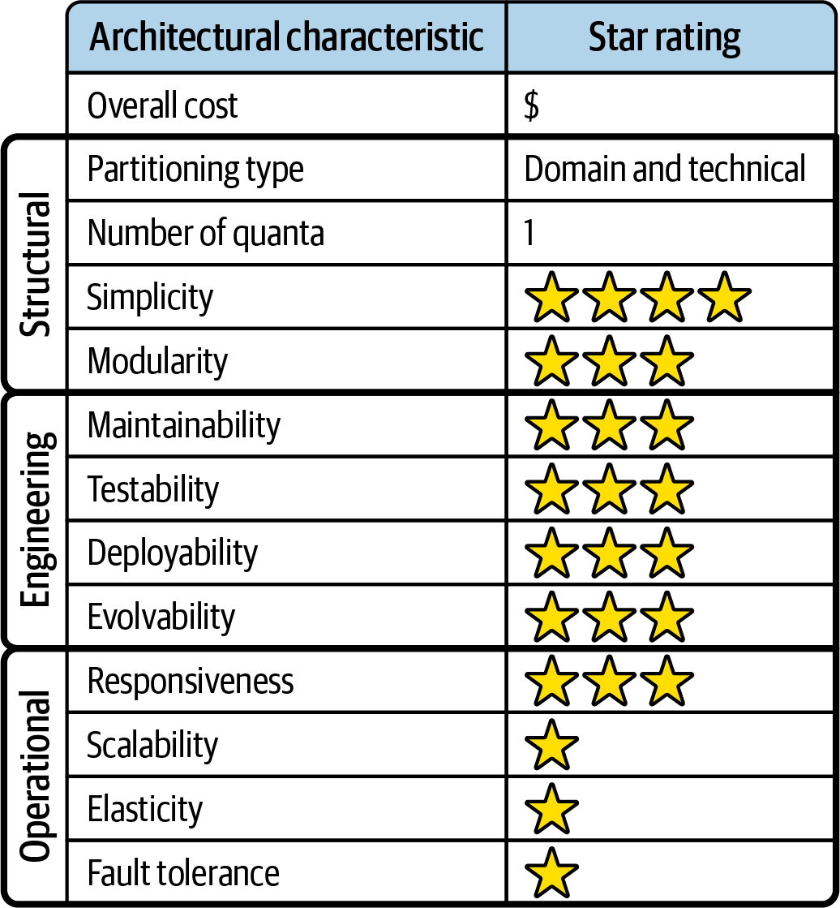

# Chapter 13: Microkernel Architecture Style

The **Microkernel Architecture Style** (also widely referred to as the *plug-in architecture*) was invented several decades ago, yet remains heavily utilized today. 

It is the absolute natural fit for **product-based applications**—software packaged and distributed as a single monolithic deployment intended to be installed directly on a customer’s site as a third-party product. However, it is also highly effective for non-product custom business applications that exist in problem domains requiring extreme customization. 

For example, an insurance company that must enforce wildly different legislative rules for 50 different states, or an international shipping company adhering to hundreds of different logistical permutations, would both benefit immensely from this style.

---

## Topology
The microkernel style is a relatively simple monolithic architecture consisting of exactly two components: a **Core System** and **Plug-ins**.

Application logic is physically divided between the basic core system and the independent plug-in components. This isolation encapsulates complex application features and provides unparalleled extensibility, adaptability, and custom processing logic. 



---

## Style Specifics

### 1. The Core System
The core system is formally defined as *the minimal functionality required to run the system*. 

The Eclipse IDE is a perfect example of this definition. Out of the box, Eclipse's core system is nothing but a basic text editor (open file, edit text, save file). It is completely useless for complex development until the user begins downloading and attaching language-specific plug-ins.

Alternatively, in custom business applications, the core system is often defined as **the happy path**—a general processing flow through the application that involves little to no custom processing. 

The primary architectural goal of a microkernel is to **strip the cyclomatic complexity entirely out of the core system** and isolate it within the separate plug-in components. 

#### Case Study: Stripping Cyclomatic Complexity
Consider the *Going Green* electronics recycling application (from Chapter 7). The system must assess electronic devices it receives, and every single device type requires incredibly specific, custom assessment rules. 

A standard application might handle this with massive, complex conditional blocks:

```java
// Standard Approach: Massive Cyclomatic Complexity
public void assessDevice(String deviceID) {
   if (deviceID.equals("iPhone6s")) {
      assessiPhone6s();
   } else if (deviceID.equals("iPad1")) {
      assessiPad1();
   } else if (deviceID.equals("Galaxy5")) {
      assessGalaxy5();
   } else ...
      ...
   }
}
```

This code is a nightmare to maintain. Instead of placing this client-specific customization into the core system, the architect creates a separate plug-in component for *each* electronic device. 

When a device arrives, the core system simply asks a registry for the correct plug-in, loads it, and executes it:

```java
// Microkernel Approach: Cyclomatic Complexity removed from Core
public void assessDevice(String deviceID) {
	String plugin = pluginRegistry.get(deviceID);
	Class<?> theClass = Class.forName(plugin);
	Constructor<?> constructor = theClass.getConstructor();
	
    // Dynamically instantiate the specific plug-in
    DevicePlugin devicePlugin = (DevicePlugin)constructor.newInstance();
	devicePlugin.assess();
}
```
Now, all of the complex rules for assessing an iPhone 6s are completely self-contained in a standalone plug-in. Adding support for a brand new device requires exactly zero changes to the core system—the developers simply write a new plug-in and add it to the registry. 

#### Implementing the Core System
Depending on the size of the application, the Core System itself is often implemented using a **Layered Architecture** or a **Modular Monolith**. 

In some advanced scenarios, the core system can even be split into separately deployed domain services, with each domain service hosting its own specific plug-in components. 



For example, if the core system is a Modular Monolith, the `PaymentProcessing` module would act as a mini-core system, maintaining separate plug-in components for `CreditCard`, `PayPal`, and `StoreCredit`.

#### User Interface Variants
The User Interface for a microkernel architecture is highly flexible. The UI can be embedded directly within the core system, or implemented as a completely separate frontend application communicating with the core system via backend services. Interestingly, the standalone UI itself can *also* be designed using a microkernel architecture (e.g., a dashboard UI where widgets are loaded as visual plug-ins).



---

### 2. Plug-In Components
Plug-in components are standalone, independent elements that contain specialized processing, custom features, and highly volatile code meant to enhance the core system. 

> [!IMPORTANT]
> The golden rule of plug-ins is that they must be entirely independent. **Plug-in components should have absolutely no dependencies on other plug-in components.**

Communication between the core system and the plug-ins usually falls into one of two implementation strategies: **Point-to-Point** or **Remote Access**. 

#### Point-to-Point Implementation
In a traditional monolithic microkernel, communication is point-to-point (a direct method invocation from the core to the plug-in class). 

This can be implemented physically in two ways:
1.  **Shared Libraries:** Plug-ins are compiled into independent artifacts (e.g., a `.jar`, `.dll`, or Ruby Gem) and loaded at runtime (sometimes using frameworks like Java's OSGi or Jigsaw).
    
2.  **Namespace/Package Isolation:** A much simpler approach is to compile the plug-ins directly into the same codebase, but strictly isolate them by namespace. Architects should enforce strict naming semantics, such as `app.plugin.<domain>.<context>`. For example: `app.plugin.assessment.iphone6s`.
    

#### Remote Access Implementation
Plug-ins do not have to be deployed inside the monolith. They can be deployed as standalone distributed services (or microservices) accessed via REST or Messaging.



*   **The Benefits:** This provides massive component decoupling, significantly better scalability, and allows for asynchronous workflows. (e.g., The core system sends an async message to assess an iPhone, and the UI immediately frees up while the plug-in does the heavy lifting).
*   **The Trade-Offs:** Remote access fundamentally turns the application into a *Distributed Architecture*. This completely destroys the primary benefit of the microkernel (simplicity and single-unit deployment for on-premise installation) and introduces brutal network reliability and timeout risks.

---

## The Spectrum of "Microkern-ality"
Not all systems that support plug-ins are true microkernels. A system’s degree of "microkern-ality" depends entirely on how much standalone functionality exists in the Core System.


On the far left, a **"Pure" Microkernel** (like Eclipse or a Code Linter) is completely useless without plug-ins. The core system simply parses text; the plug-ins do all the actual work.

On the far right, a **Plug-in Supported System** (like Google Chrome) is a fully functional product out-of-the-box. The plug-ins (Chrome Extensions) merely enhance an already complete core system. 

---

## Registry
For the architecture to function, the Core System must have a way to know which plug-ins exist and how to communicate with them. This is achieved via a **Plug-in Registry**.

The registry contains metadata about each plug-in: its name, its data contract, and its access protocol. 

The registry can be a massive external discovery tool (like Apache ZooKeeper or Consul) or as simple as an internal `HashMap` hardcoded in the core system:

```java
Map<String, String> registry = new HashMap<String, String>();
static {
  // Point-to-Point Access Example
  registry.put("iPhone6s", "Iphone6sPlugin");

  // Asynchronous Messaging Example
  registry.put("iPhone6s", "iphone6s.queue");

  // Distributed RESTful Example
  registry.put("iPhone6s", "https://atlas:443/assess/iphone6s");
}
```

---

## Contracts
Plug-in components and the core system must communicate via a strict **Contract** that dictates behavior, input data, and output data. 

If third-party vendors write the plug-ins and define their own custom contracts, the architect must build an Adapter component so the core system doesn't have to write specialized integration code for every single vendor.

Consider the contract for the *Going Green* electronics assessment plug-ins. It is defined by a strict Java interface:

```java
// The standard behavior contract
public interface AssessmentPlugin {
	public AssessmentOutput assess();
	public String register();
	public String deregister();
}

// The standard data payload contract
public class AssessmentOutput {
	public String assessmentReport;
	public Boolean resell;
	public Double value;
	public Double resellPrice;
}
```

This perfectly illustrates the separation of concerns. The Core System doesn't know how to format an `assessmentReport` string for a Galaxy 5, nor does it care. It simply asks the plug-in to do the complex logic and blindly returns the formatted output to the UI.

---

## Deployment and Ecosystem Considerations

### Data Topologies
Microkernel architectures are generally monolithic, meaning they typically rely on a single monolithic database. 

Crucially, **plug-in components should rarely connect directly to the shared central database.** Instead, the core system should read the required data from the database and pass it directly into the plug-in. This enforces strict decoupling: if the central database schema changes, developers only have to update the core system, not hundreds of third-party plug-ins. 

However, highly complex plug-ins *can* own their own completely isolated, embedded data stores (e.g., an embedded SQLite database containing specialized rules). 



### Cloud Considerations
Because it is typically monolithic, cloud deployments offer coarse-grained options:
1.  Deploy the entire monolithic application to a cloud container. 
2.  Deploy the database to the cloud, but keep the monolithic application installed on-premises. 
3.  Deploy the Core System on-premises, and host the plug-ins as distributed services in the cloud. *(Warning: Because the core system calls plug-ins constantly during workflows, this approach often introduces crippling network latency).*

### Common Risks
The risks associated with this architecture almost always stem from misapplying its core philosophies. 

1.  **A Volatile Core:** The core system is supposed to be incredibly stable. If developers are constantly cracking open the core system to make code changes, the architecture has failed. It means the architect incorrectly judged what was volatile, and they must refactor that volatility out into a plug-in.
2.  **Plug-In Dependencies:** Microkernels hum beautifully when plug-ins are fully independent. However, if an architect allows plug-ins to depend on *other* plug-ins, they immediately enter the terrifying realm of transitive dependency management hell (e.g., Plug-in A requires v1 of Plug-in C, but Plug-in B requires v2 of Plug-in C). Avoid plug-in dependencies at all costs.

---

## Governance
Because this style relies so heavily on architectural philosophy, governance focuses on ensuring developers honor that philosophy:
*   **Volatility Checks:** Architects wire fitness functions to the version control system (Git) to check the *churn rate* of the core system codebase. If the core system is being modified frequently, the build fails and alerts the architect.
*   **Contract Tests:** Ensure that plug-ins strictly adhere to the defined input/output contracts.

---

## Team Topology Considerations
The physical separation of the architecture perfectly mirrors the separation of team responsibilities:

*   **Stream-Aligned Teams:** Generally own the core system and the "happy path" workflow. 
*   **Enabling Teams:** Perfectly suited for this style. They can perform A/B testing and inject experimental features simply by dropping a new plug-in into the registry. 
*   **Complicated-Subsystem Teams:** Perfectly suited. Highly complex domain logic (e.g., predictive analytics) can be isolated into a plug-in and entirely owned by a specialized team of mathematicians, freeing the stream-aligned team to focus on the core workflow.
*   **Platform Teams:** Mostly concern themselves with the operational details for this architecture, as with other monolithic architectures.
---

## Style Characteristics
Every architectural style is evaluated against a standard set of architectural characteristics. A 1-star rating means the characteristic is poorly supported, while a 5-star rating means it is one of the strongest features of the style.

Like the Layered and Pipeline architectures, the **Architecture Quantum is always 1** (monolith). However, the Microkernel is completely unique in that it is the *only* architectural style that can be **both Domain-Partitioned and Technically-Partitioned**. 



### The Strengths
Unsurprisingly for a monolith, its main strengths are **Cost** and **Simplicity**. However, it dramatically outperforms the Layered architecture in several key areas due to its plug-in isolation:
*   **Testability, Deployability, & Reliability (3 Stars):** Because volatile changes are completely isolated to an independent plug-in, the risk of a deployment bringing down the core system is vastly reduced.
*   **Modularity & Evolvability (3 Stars):** You can easily add, remove, and change features at will simply by updating the plug-in registry. 
*   **Responsiveness (3 Stars):** Because you can simply "unplug" features you don't need, the monolith can be streamlined to run incredibly fast. (e.g., If you don't need clustering, just remove the clustering plug-in from the server).

### The Weaknesses
Its weaknesses are the standard monolithic weaknesses: **Scalability, Elasticity, and Fault Tolerance** all rate extremely poorly (1 Star) because the entire core system must be scaled or deployed as a single massive unit, and a single fatal error in the core crashes the entire application.

---

## Real-World Examples and Use Cases
While development tools (Eclipse, Jira, Jenkins, PMD) and web browsers (Chrome, Firefox) are the most famous examples of microkernels, this style is exceptionally powerful for massive custom business applications.

### 1. Tax Preparation Software
The US IRS tax code is incredibly complex and changes every single year. 
If built as a microkernel, the standard two-page `1040 Summary Form` acts as the stable **Core System**. Every single supporting form, worksheet, and complex calculation is implemented as a **Plug-in**. When the tax law inevitably changes next year, developers simply update the specific worksheet plug-in. The core 1040 workflow remains completely untouched and stable.

### 2. Insurance Claims Processing
Processing insurance claims is a notoriously volatile domain because every jurisdiction (state, country) has vastly different legal rules. For example, some states require insurers to provide free windshield replacements; others do not.
Traditionally, companies try to solve this using massive Rules Engines, which eventually devolve into unmaintainable Big Balls of Mud. 
Using a microkernel, the standard, unchanging process for filing a claim is the **Core System**. The infinite legal permutations for each jurisdiction are encapsulated into completely isolated **Plug-ins**. 

The microkernel architecture is a brilliant, highly effective solution for any problem domain that demands massive customization.
