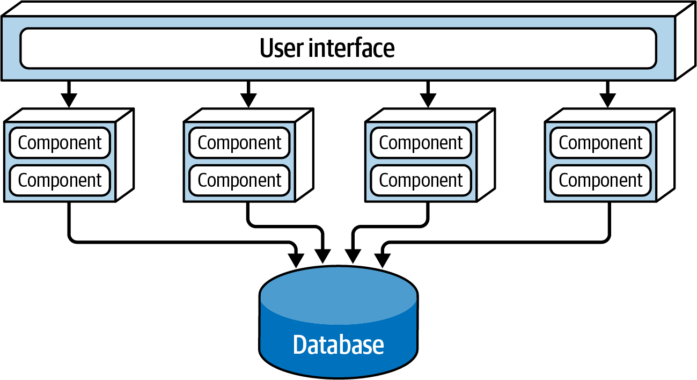
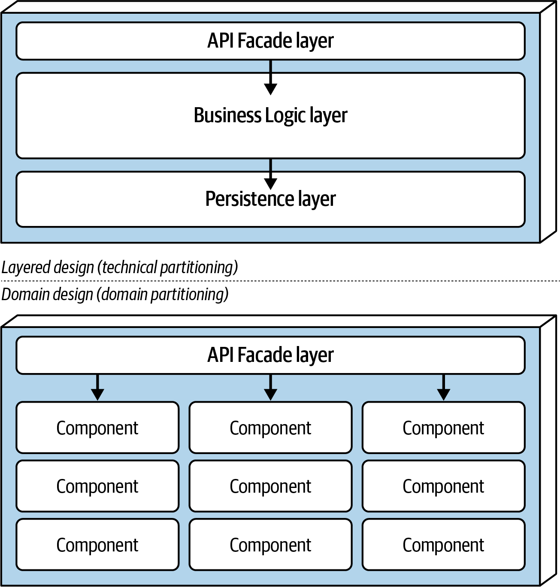
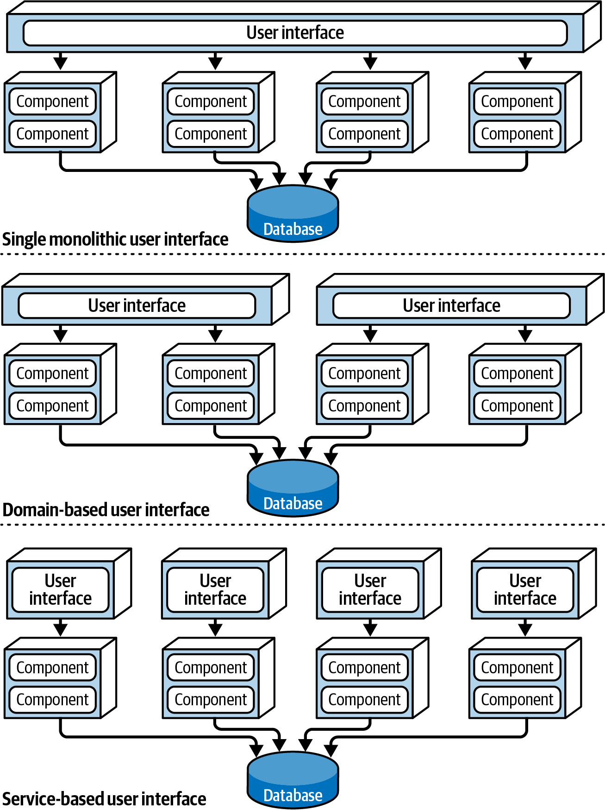
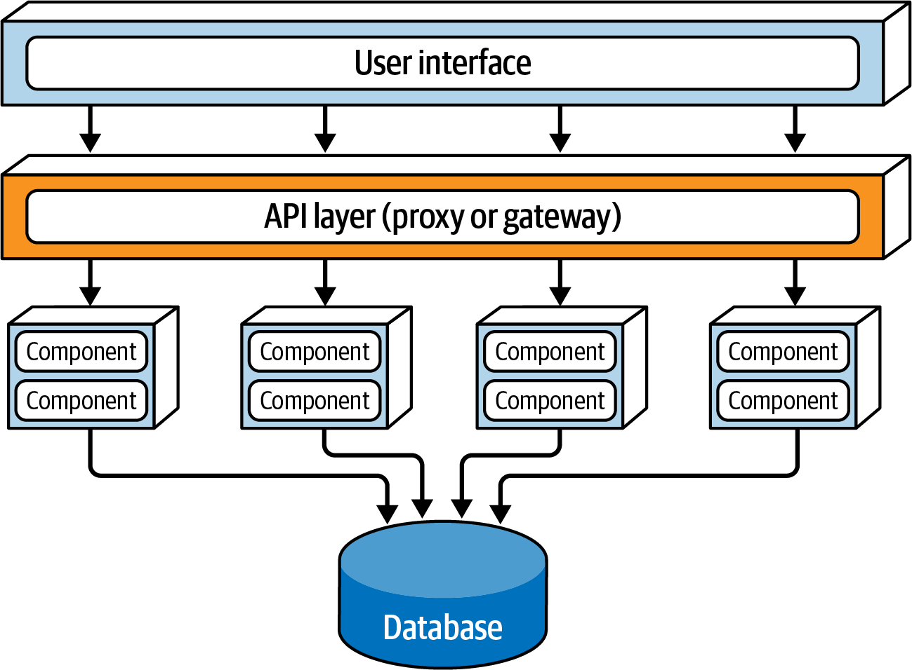
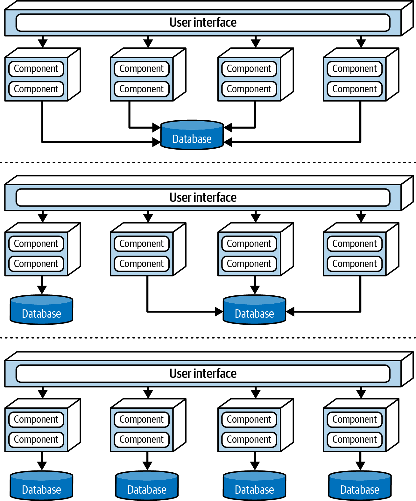
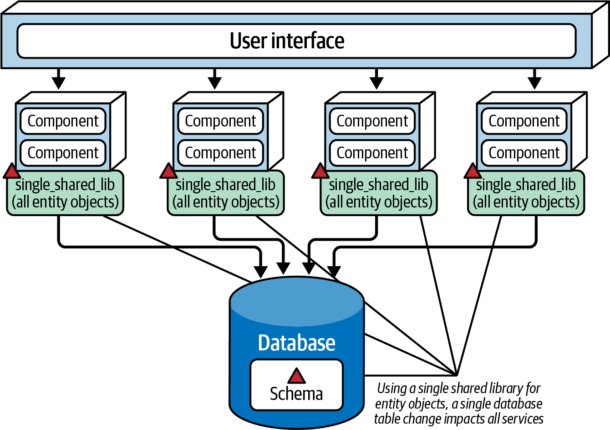
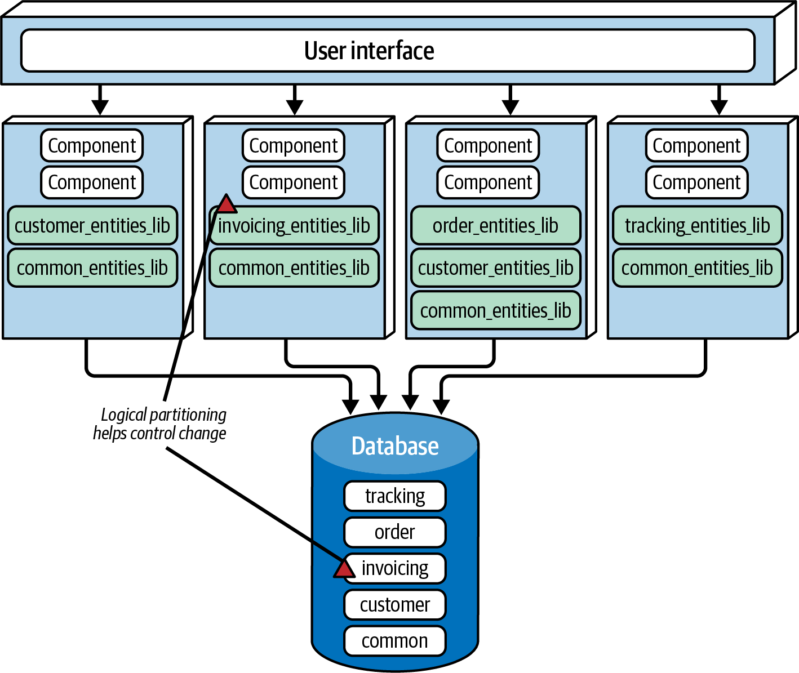
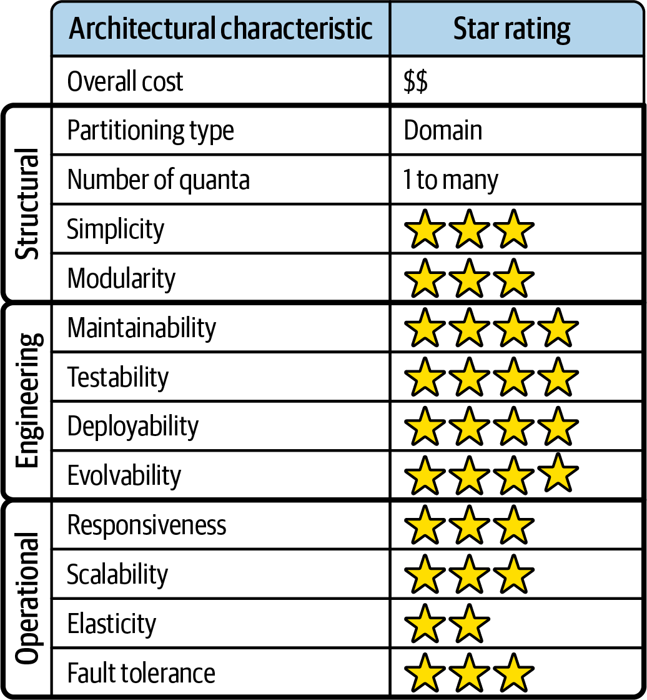
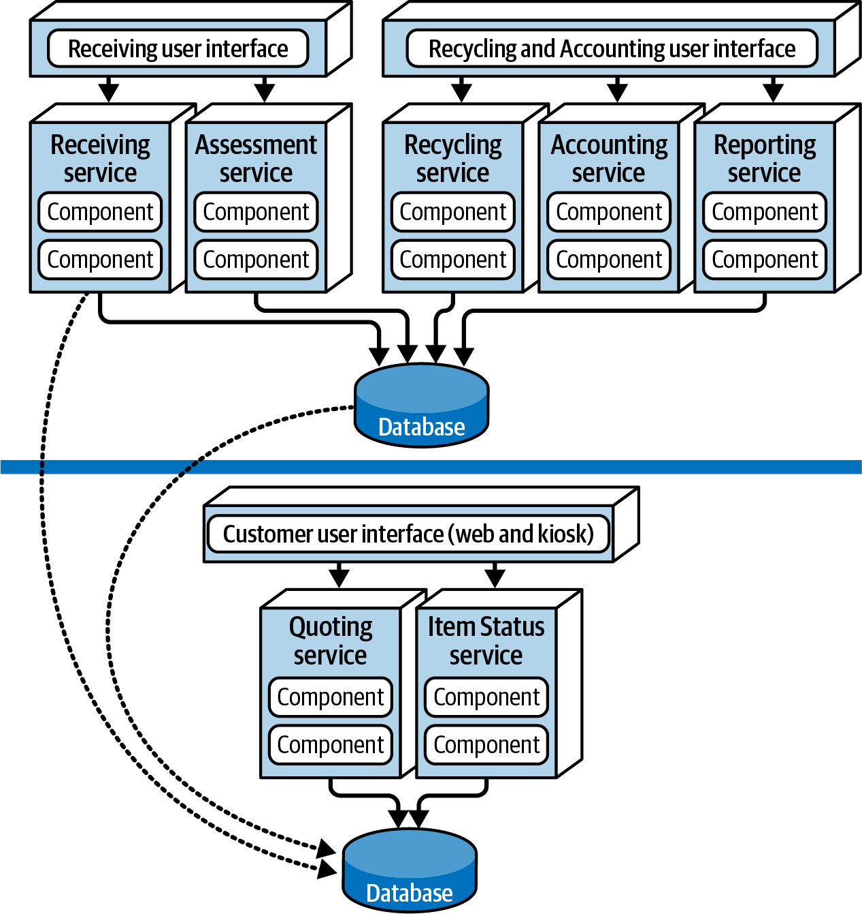

# Chapter 14: Service-Based Architecture Style

The **Service-Based Architecture Style** is a highly pragmatic, hybrid variant of the microservices architectural style. It is considered one of the most flexible and widely used distributed architectures available.

While it is a fully distributed architecture, it brilliantly avoids the crippling complexity and astronomical costs associated with highly fine-grained distributed systems (like Microservices or Event-Driven Architectures). This pragmatic balance makes it one of the absolute best choices for most standard business applications.

---

## Topology
The basic topology of a service-based architecture follows a **distributed macro-layered structure**. It consists of three primary elements:
1.  A separately deployed **User Interface**.
2.  Separately deployed, remote, **coarse-grained domain services**.
3.  A shared **monolithic database** (optional, but highly typical).

### Domain Services
The core units of this architecture are called **Domain Services**. Unlike tiny microservices that handle a single action, domain services are *coarse-grained* and encapsulate a massive, overarching portion of the system's functionality (e.g., `OrderFulfillment`, `Shipping`, `PaymentProcessing`). 

*   **Deployment:** Services are completely independent of each other and are separately deployed. They do not strictly require complex orchestration platforms like Kubernetes; they can be deployed much like a standard monolith (though Docker/Kubernetes is commonly used).
*   **Scale:** Typically, each domain service is deployed as a single instance. If a specific service needs to handle higher throughput, the architect can simply spin up multiple instances of that specific service behind a load balancer. 
*   **Quantity:** If using a single shared database, architects strongly recommend limiting the system to **no more than 12 domain services**. Exceeding this limit rapidly introduces severe database bottleneck and change-control issues.

### Communication
Services are accessed remotely from the UI via a remote access protocol (typically REST, though RPC, messaging, or SOAP are all valid). The UI uses a **Service Locator** pattern to dynamically find the address of the specific domain service it needs. This Service Locator logic can be embedded directly in the UI, or pushed into a centralized API Gateway or proxy.

Because the system typically utilizes a centrally shared monolithic database, the independent domain services can still execute complex, highly efficient SQL queries and table joins exactly like a traditional monolith. 

---

## Style Specifics
Because domain services are incredibly coarse-grained, their internal codebases are often quite large. Therefore, each individual domain service is typically internally designed using an established architectural style, such as a **Layered Architecture** (API Facade, Business, Persistence) or a **Modular Monolith** (partitioned by subdomain).

Regardless of internal design, the domain service *must* expose an **API Access Facade**. This facade acts as the entry point and takes on the massive responsibility of orchestrating the business request.

### Internal Orchestration vs. External Orchestration
Let's examine how a service-based ecommerce site handles a customer placing an order:
1.  The UI sends a single REST request to the `OrderService`.
2.  The API Facade inside the `OrderService` receives the request.
3.  The API Facade *internally* orchestrates the entire workflow: it calls its own internal classes to generate an Order ID, apply the payment, update the inventory, and save the order.

This is fundamentally different from a **Microservices Architecture**. In microservices, the UI would call an `OrderPlacement` service, which would then make external network calls to a remote `PaymentService`, which then calls a remote `InventoryService`. 

**Service-based orchestration happens internally via fast, in-memory class calls.** Microservices orchestration happens externally via slow, highly-fragile network calls.

### ACID Transactions vs. BASE Transactions
Because domain services are coarse-grained and internally orchestrate their own workflows, they can rely on standard **ACID (Atomicity, Consistency, Isolation, Durability) database transactions**. 

If a customer tries to checkout but their credit card is expired, the `OrderService` handles everything inside a single database transaction. When the payment fails, the service simply issues an atomic `ROLLBACK` command, instantly wiping the pending order from the database and guaranteeing absolute data integrity.

In stark contrast, highly distributed microservices cannot use ACID transactions because their data is spread across completely separate databases. They are forced to rely on **BASE transactions (Basic Availability, Soft state, Eventual consistency)**. 

In a BASE microservice environment, the `OrderPlacement` service inserts the order and commits the transaction. It then makes a network call to the `PaymentService`. If the payment fails, the system is now in an inconsistent, corrupted state: the database contains an approved order that hasn't actually been paid for. The system must now fire off a highly complex "Compensating Update" event back to the `OrderPlacement` service to force it to delete the bad order and manually restore data integrity. 

By keeping workflows isolated inside coarse-grained domain services, the Service-Based Architecture effortlessly avoids the nightmare of distributed eventual consistency.

### The Granularity Trade-Off
While coarse-grained services provide massive benefits for data integrity and transactions, they present a distinct trade-off in agility and testing.

If a developer needs to change the order-placement logic inside the service-based `OrderService`, the QA team must re-test the entire service (including the payment processing logic, which was untouched) and ops must redeploy the entire massive domain service. 

In microservices, the same change would only affect the tiny, fine-grained `OrderPlacement` service, allowing it to be tested and deployed completely independently without any risk of accidentally breaking payment processing.

---

## Architecture Variants

### User Interface Options
Because it is so flexible, a service-based architecture does not mandate a monolithic UI. An architect can easily break apart the single UI into entirely separate user interfaces, scaling them independently. 

For example, a typical system could provide a customer-facing `Web UI`, an internal `Warehouse UI` for packers, and a `Support UI` for customer service reps, with all UIs accessing the same backend domain services.

### API Gateway Options
Architects frequently inject an **API Gateway** or reverse proxy layer between the User Interface and the domain services. 

This API Gateway is incredibly useful for:
1.  Exposing domain service functionality securely to external third-party systems.
2.  Consolidating cross-cutting concerns (metrics, security, auditing, rate-limiting) out of the domain services.
3.  Acting as a load balancer to route traffic to multiple instances of a domain service.

---

## Deployment and Ecosystem Considerations

### Data Topologies
Service-based architectures offer a wildly flexible range of database topologies. **It is entirely unique as the only distributed architecture that can seamlessly support a single monolithic database.**

However, architects can easily break the monolithic database apart, up to the point of creating a dedicated domain-scoped database for every single domain service (similar to microservices). 

*(Note: If choosing separate databases, the architect must ensure the domains are strictly isolated. If Service A constantly needs data from Service B's database, you will incur massive inter-service communication overhead. In this architectural style, it is almost always preferable to share a database rather than invoke another domain service over the network).*

### Managing Database Changes
If an architect chooses to use a monolithic database, they must carefully manage database schema changes. If done poorly, changing a single table can accidentally force a redeployment of every single service in the system.

In most systems, the code that maps to the database tables (Entity Objects) is abstracted into a shared library (a JAR or DLL file) that all domain services import. 

#### The Antipattern: A Single Shared Library
Creating a single `all_entities.jar` containing every entity object is considered a massive antipattern in service-based architecture. 

If a DBA adds a new column to the `Customer` table, the `all_entities.jar` must be updated and rebuilt. Even though the `InvoicingService` has absolutely nothing to do with the `Customer` table, it imports the JAR, meaning it now has an updated dependency. The `InvoicingService` must now be re-tested and redeployed, creating massive, unnecessary churn.

#### The Solution: Logically Partitioned Shared Libraries
To mitigate the impact of database changes, architects must logically partition the database and create a separate shared library for each logical domain. 

By splitting the entities into `customer_lib.jar`, `invoicing_lib.jar`, and `order_lib.jar`, the blast radius of a database change is completely contained. If the `Invoicing` table is modified, only `invoicing_lib.jar` is updated, and only the domain services that specifically import that JAR are affected. 

> [!TIP]
> To better control database changes within a service-based architecture, make the logical partitioning of your shared libraries as fine-grained as possible.

### Cloud Considerations
Being a fully distributed architecture, the service-based style functions exceptionally well in cloud environments. However, because the domain services are massively coarse-grained, they are almost always implemented as **Containerized Services** (Docker/Kubernetes) rather than Serverless functions (AWS Lambdas).

---

## Common Risks
While the service-based style mitigates the complexities of Microservices, it introduces its own specific risks if applied incorrectly:

1.  **Interservice Communication:** In Microservices, having services constantly talking to each other over the network is completely normal. In a Service-Based architecture, it is a massive red flag. Domains should be incredibly independent, coupling only at the database level. If domain services are constantly communicating with each other, it proves the architect partitioned the domains incorrectly.
2.  **Too Many Services:** If an architect creates more than 12-15 domain services against a single monolithic database, they will rapidly exhaust the database connection pool and recreate the agonizing testing and deployment issues of a pure microservices architecture. 

---

## Governance
In addition to governing standard operational characteristics, architects must enforce strict structural governance over this style:

*   **Boundary Validation:** Architects must monitor if business changes frequently span across multiple domain services. If fulfilling a single business requirement constantly requires modifying three different domain services, the domain boundaries are incorrect.
*   **Communication Limits:** Architects should enforce strict limits on interservice communication. Whenever possible, workflow orchestration should happen at the UI or API Gateway level, not by services directly calling each other.

---

## Team Topology Considerations
Because the service-based architecture is fundamentally **domain-partitioned**, it demands that the teams building it are also domain-aligned. 

Attempting to build this architecture using technically partitioned teams (a UI team, a backend team, a DB team) creates unbearable collaboration friction.

*   **Stream-Aligned Teams:** Work incredibly well, *provided* the stream aligns with the domain boundaries. If a stream-aligned team constantly needs to cross boundaries to modify multiple domain services, the architect must either realign the services to match the streams, or choose a different architecture style.
*   **Enabling Teams:** Not as effective here as in highly fine-grained microservices. Because the domain service is coarse-grained, it is harder for an enabling team to inject a small, isolated experiment. They can only do so if the internal component structure of the domain service is pristine. 
*   **Complicated-Subsystem Teams:** Work very well. A complicated-subsystem team can take ownership of an incredibly complex subdomain processing component contained within the larger domain service.
*   **Platform Teams:** Work well by providing the massive shared infrastructure (API Gateways, CI/CD pipelines, Container Orchestration) required to deploy the distributed domain services.

---

## Style Characteristics
Every architectural style is evaluated against a standard set of architectural characteristics. A 1-star rating means the characteristic is poorly supported, while a 5-star rating means it is one of the strongest features of the style.

As a distributed, domain-partitioned architecture, the **Architecture Quantum can be 1 or many**. If the system uses a single monolithic database and a single UI, the quantum is 1. If the UI and database are federated (split), the system achieves multiple quanta.

### The Pragmatic Balance
Notice that the Service-Based Architecture possesses **no 5-star ratings**. However, it excels by possessing a massive amount of highly-desirable 4-star and 3-star ratings, making it the ultimate "pragmatic" choice. 

*   **Agility, Testability, Deployability (4 Stars):** By breaking the monolith apart into separate services, teams can test and deploy domain features rapidly without risking the entire system.
*   **Fault Tolerance & Availability (4 Stars):** If the `Receiving` service crashes due to an OutOfMemoryError, the `OrderPlacement` service remains completely online. Furthermore, because there is no interservice communication, it avoids the terrifying cascading failures seen in Microservices.
*   **Simplicity & Cost (3 Stars):** While more complex than a monolith, it is drastically simpler and cheaper than pure Microservices or Event-Driven Architectures. 

### The Weaknesses
Its primary weaknesses relate to extreme scale.
*   **Scalability (3 Stars) & Elasticity (2 Stars):** Because the services are coarse-grained, scaling them requires spinning up massive, heavy containers. It is entirely possible to scale them, but it is vastly less cost-effective and resource-efficient than scaling tiny microservices.

Ultimately, this style is chosen because it avoids "over-architecting." Many companies build pure microservices for the ultimate 5-star scalability and elasticity, only to realize they didn't actually need it. As Mark Richards notes: *"It's like buying a Ferrari but only using it to commute to work in rush-hour traffic—sure, it looks cool, but what a waste of power, speed, and agility!"*

---

## Real-World Examples and Use Cases
To illustrate the immense power and flexibility of the Service-Based architecture, we return to the **Going Green** electronics recycling application. 

The domain workflow is as follows: Provide a Quote -> Receive the Device -> Assess the Device -> Pay the Customer -> Recycle/Resell the Device -> Run Reports.

Notice the incredibly strategic architectural decisions made here:
1.  **Federated UI & DBs (Multiple Quanta):** The system is physically split into a Customer-Facing zone and an Internal Operations zone. The Customer UI hits a Customer Database, while the Internal UIs hit an Internal Database. This provides phenomenal security (customers physically cannot access internal operations data) and creates separate architecture quanta.
2.  **Targeted Scalability:** Most internal services (like `Receiving` or `Accounting`) only ever require a single instance to run. However, because thousands of customers might ask for a quote simultaneously, the `Quoting` service is scaled out to 3 instances behind a load balancer. 
3.  **Isolation of Volatility:** The rules for assessing a device change constantly. By isolating `Assessment` into its own domain service, developers can aggressively deploy new assessment rules without ever risking the financial `Accounting` service.

### The "Stepping Stone" Strategy
One of the greatest benefits of the Service-Based Architecture is that it acts as the ultimate "stepping stone" migration target. 

> [!IMPORTANT]
> "Not every portion of an application needs to be microservices." — Mark Richards

When breaking apart a monolith, architects should always migrate to a Service-Based architecture first. Once there, they can analyze the individual domain services. 
For example, the `Accounting` service is highly stable and doesn't need extreme scalability—it should remain a coarse-grained service forever. However, the `Assessment` service changes constantly and requires massive agility. The architect can then make the targeted, strategic decision to break *only* the `Assessment` service down into highly fine-grained Microservices. 

If the architect had skipped the service-based step and jumped straight to microservices, every single piece of functionality would have been broken down, creating an unmaintainable, overly complex distributed nightmare.
