# Chapter 15: Event-Driven Architecture Style

The **Event-Driven Architecture (EDA)** style is a highly popular distributed, asynchronous architecture used to produce phenomenally scalable and high-performance applications. 

Many developers and software architects consider EDA to be a mere "architectural pattern." We firmly disagree. Entire massively complex systems rely solely on EDA to function, which is why we classify it as a primary architectural style. While it can be embedded within other styles (e.g., event-driven microservices), it remains, at its core, a fundamental way of designing complex systems.

---

## Request-Based vs. Event-Based Models

### The Request-Based Model
Most traditional applications follow a synchronous, deterministic *Request-Based Model*. 
For example, when a customer requests their order history, the User Interface acts as a Request Orchestrator. It makes a direct, synchronous request to a backend service, which queries the database and returns the data. This is a deterministic data retrieval action within a specific context.

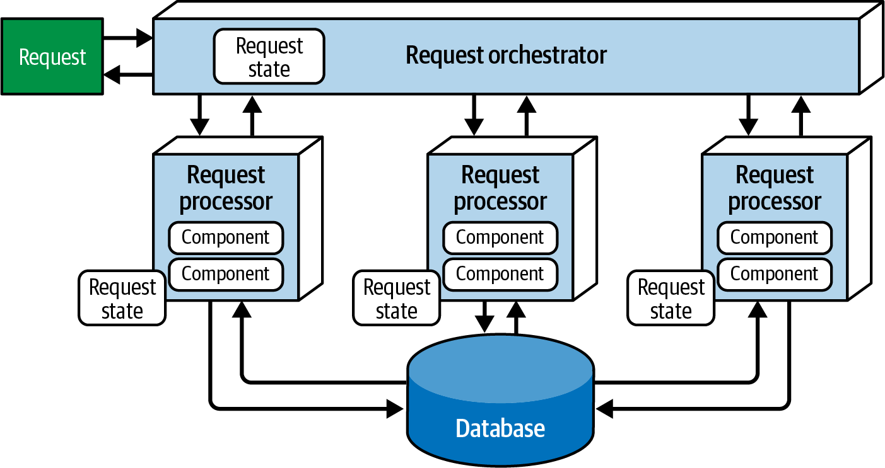

### The Event-Based Model
Conversely, an *Event-Based Model* reacts to an action that has already occurred. 
When a user submits a bid on an online auction, they are *not* making a request to the system. They are initiating an *event* that just happened. The system must now asynchronously react to that event by evaluating the bid against others and determining the new high bidder.

---

## Topology
Event-driven architecture relies exclusively on **asynchronous fire-and-forget communication**. Services trigger events and other services react to them.

The topology consists of four primary components:
1.  **Initiating Event:** The spark that starts the entire workflow (e.g., "Place Bid").
2.  **Event Broker:** A federated component containing event channels (queues/topics). It handles the routing using publish-and-subscribe messaging.
3.  **Event Processor:** The actual service component. It accepts an event, performs a specific task, and then advertises what it just did.
4.  **Derived Event:** The new event fired by the Event Processor to advertise its completed action to the rest of the system.

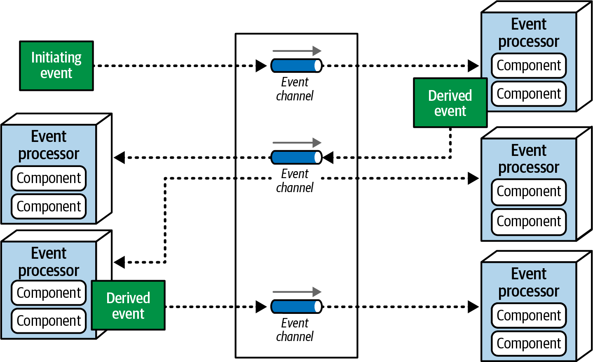

### The Workflow in Action
To understand the extreme decoupling of this style, consider a retail-order entry system:

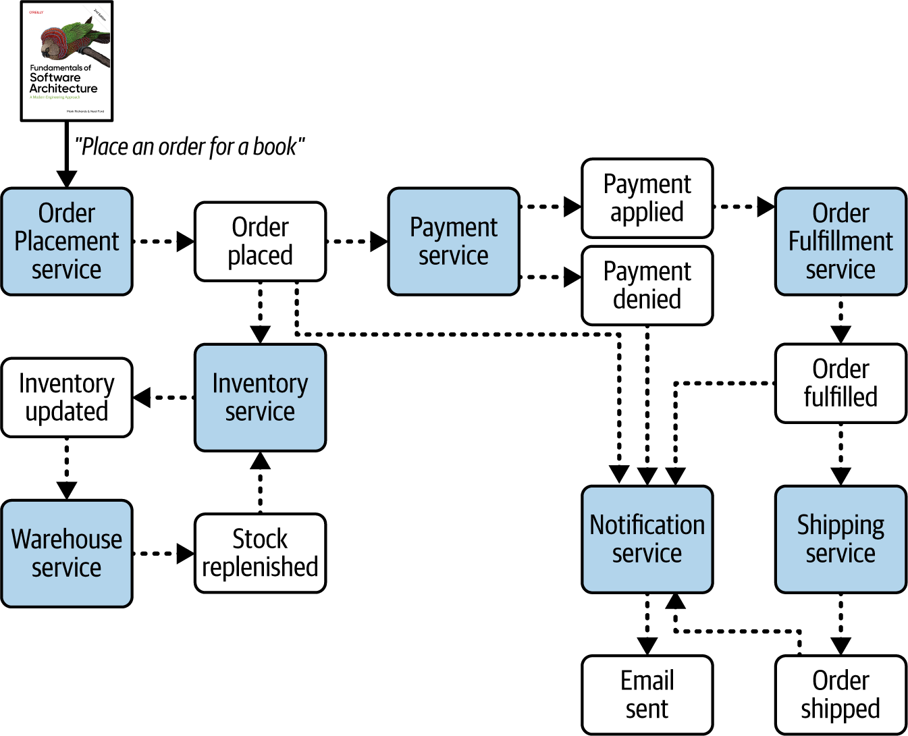

1.  **The Spark:** A user triggers the `place order` *Initiating Event*.
2.  **Order Placement:** The `Order Placement` event processor receives the event, inserts the order into the database, and asynchronously fires an `order placed` *Derived Event* onto a topic.
3.  **Parallel Execution:** Three completely separate event processors are listening to that topic. They all react instantly and in parallel:
    *   **Notification Processor:** Emails the customer and fires `email sent`. (Notice no one is listening to `email sent`. This is perfectly normal and allows for future extensibility).
    *   **Payment Processor:** Charges the credit card and fires either `payment applied` or `payment denied`. (If `payment denied` is fired, the Notification processor reacts to it and emails the customer).
    *   **Inventory Processor:** Adjusts stock levels and fires `inventory updated`.
4.  **Fulfillment Chain:** 
    *   The `Warehouse Processor` hears `inventory updated`, reorders stock if necessary, and fires `stock replenished`.
    *   The `Order Fulfillment Processor` hears `payment applied`, packs the box, and fires `order fulfilled`.
    *   The `Shipping Processor` hears `order fulfilled`, ships the box, and fires `order shipped`.

> [!WARNING]
> **Beware the Poison Event!** 
> Notice that when the `Inventory Processor` reacts to `stock replenished`, it simply adjusts the stock. It must *never* fire an `inventory adjusted` derived event. If it did, it would trigger the `Warehouse Processor` again, creating an infinite, endless loop known as a **Poison Event**.

### The Relay Race Analogy
The best way to understand this asynchronous processing workflow is to think of a **relay race**. 

A runner holds the baton (the event), runs their specific distance (performs their task), and hands the baton off to the next runner (fires the derived event). Once the runner hands off the baton, *they are done*. They do not wait to see if the next runner finishes the race. They instantly move on to the next race. 

This extreme decoupling allows every single event processor to scale entirely independently to handle massive spikes in load.

---

## Style Specifics

### Events Versus Messages
While they are often used interchangeably by developers, an event is fundamentally different from a message. Understanding this difference is critical to mastering this architecture. 

*   **An Event** broadcasts that something has *already happened* (e.g., "An order was placed"). It does not command anything to happen. It does not expect a response. It is broadcasted to multiple processors simultaneously using publish-and-subscribe topics. 
*   **A Message** is a direct command or query telling the system to *do something* (e.g., "Apply the payment for this order"). It usually expects a response. It is directed to one specific processor using point-to-point queues. 

**Quick Test: Event or Message?**
1.  *"Flight 6557, turn left to 230 degrees."* -> **Message**. It is a command directed at a single target. 
2.  *"A cold front has moved into the area."* -> **Event**. It has already happened, it is broadcast to everyone, and expects no reply.
3.  *"Class, turn to page 145."* -> **Message**. Even though it is broadcast to multiple people, it is still a command telling them to do something.
4.  *"I'm late for the meeting."* -> **Event**. It has already happened and expects no reply. 

### Derived Events
Derived events are the lifeblood of EDA. They are generated by an event processor *after* it receives an event. 

Crucially, an event processor can trigger **more than one derived event** based on its internal logic. 

Consider a `Payment` processor that charges a credit card and fires a `creditcard charged` event. 
Two separate processors react to this event simultaneously: `Fraud Detection` and `Credit Limit`. 

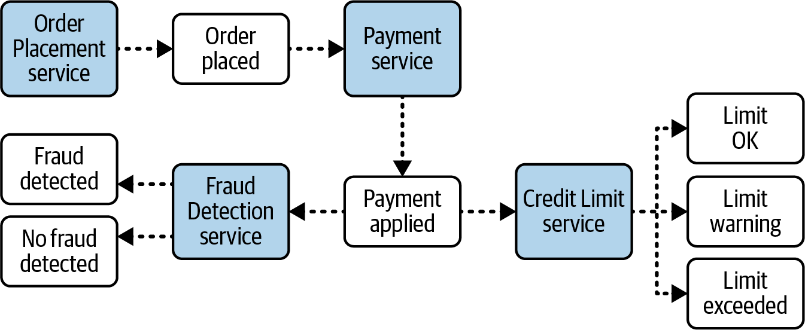

Based on their processing, they generate multiple distinct derived events for the rest of the system to react to:
*   The `Fraud Detection` processor analyzes the charge. It triggers either `fraud detected` or `no fraud detected`. 
*   The `Credit Limit` processor checks the balance. It triggers one of three events:
    1.  `limit okay` (Contains a payload detailing the remaining credit).
    2.  `limit warning` (Notifies the customer they are close to maxing out the card).
    3.  `limit exceeded` (Notifies the `Decline Purchase` processor, and perhaps a `Marketing` processor that automatically offers to extend their credit limit).

> [!WARNING]
> While generating multiple derived events is powerful, architects must avoid the **Swarm of Gnats Antipattern**, where an event processor spams the system with far too many microscopic, fine-grained events that overwhelm the network.

---

### Triggering Extensible Events
In a well-designed Event-Driven Architecture, it is best practice for each event processor to advertise what it has done, regardless of whether any other component is currently listening. 

When an event is triggered but has no immediate consumers, we call it an **Extensible Derived Event**. These events act as built-in "hooks" that provide extreme architectural extensibility. 

Consider a `Notification` event processor that sends an email to a customer. Even if the current system has no requirement to track sent emails, the processor should still fire an `email sent` derived event. 

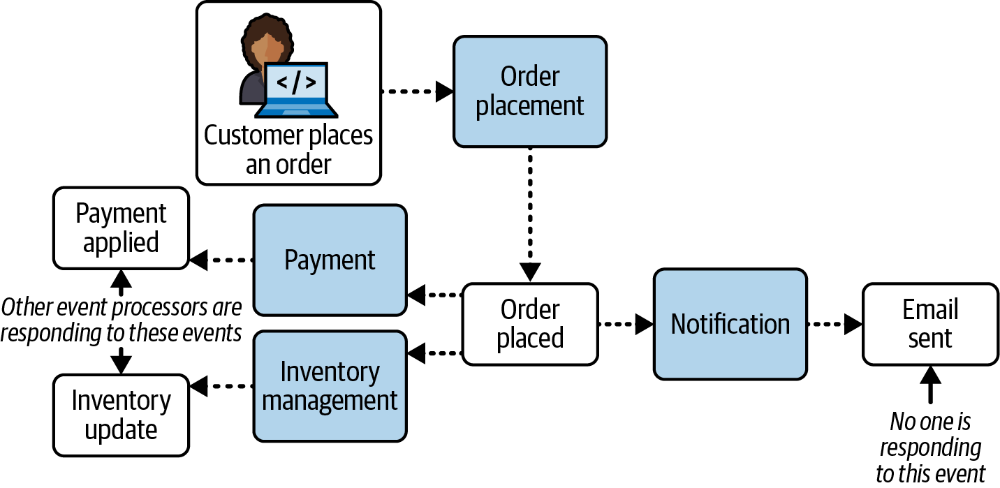

Initially, this event might simply be ignored by the broker or disappear from the stream. However, if the business later decides they want to analyze customer communication patterns, they can simply plug in a new `Email Analyzer` event processor. This new functionality is added with **zero changes** to the existing `Notification` processor or the rest of the system, because the necessary data "hook" was already being advertised. This is the essence of architectural agility in EDA.

---

### Asynchronous Capabilities
The EDA style relies primarily on asynchronous communication. This allows systems to achieve staggering levels of **responsiveness**, provided the architect understands the difference between responsiveness and performance.

#### Responsiveness vs. Performance
Consider a website where a user posts a product review. The backend service takes a massive 3,000ms to parse the text, validate the grammar, and check for profanity.

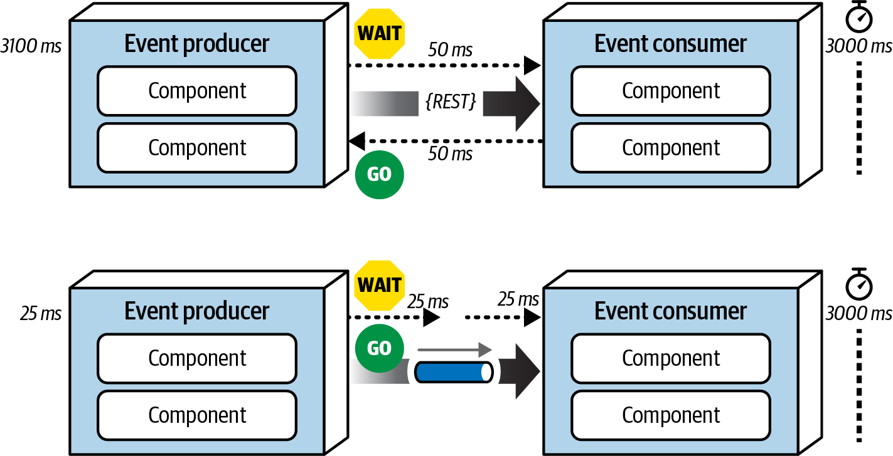

*   **Synchronous Path:** The UI makes a REST call and waits. It takes 50ms of network latency + 3,000ms of processing + 50ms to return. The user stares at a loading spinner for **3,100ms**. 
*   **Asynchronous Path:** The UI drops the comment into a message queue and instantly returns an "Accepted!" message to the user. The user's wait time is **25ms**. 

The difference is staggering. However, notice that the asynchronous path did *nothing* to make the backend parsing engine faster—it still takes 3,000ms to parse the comment. 
*   **Responsiveness** is how fast the system gives control back to the user. 
*   **Performance** is how fast the actual backend task executes. 
Asynchronous communication solves responsiveness, not performance. 

*The Trade-Off:* The asynchronous path loses the guarantee of success. If the comment is rejected for profanity 3 seconds later, the UI has already told the user it was accepted. Handling these asynchronous error scenarios is one of the most complex challenges in EDA.

#### Dynamic Quantum Entanglement
Asynchronous communication provides a brilliant level of dynamic decoupling. It allows architects to avoid a terrifying antipattern known as **Dynamic Quantum Entanglement**. 

This antipattern occurs when two perfectly isolated architectural quanta are forced to communicate *synchronously*. 

Consider a `Portfolio Management` system that needs to execute a stock trade via the `Trade Order` system. 
If the Portfolio system makes a synchronous REST call to the Trade system, the Portfolio system is forced to block and wait for a response. 

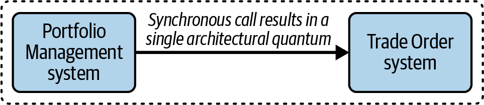

The two systems are now violently entangled. They have effectively merged into a **Single Architectural Quantum**.
If the Trade system goes down, the Portfolio system goes down with it. If the Trade system is slow, the Portfolio system is slow. If the Portfolio system needs to scale to 100 instances, the Trade system must also scale to 100 instances to handle the synchronous load. 

**Detangling the Quanta**
An architect can easily detangle these systems by replacing the synchronous REST call with an asynchronous message queue. 

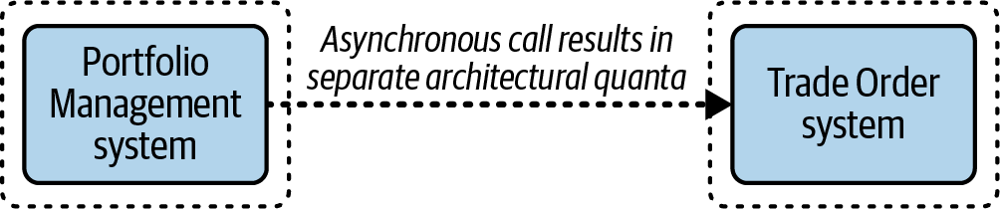

The `Portfolio` system drops the trade request into a queue and immediately returns to the user. Later, the `Trade` system processes it and drops a confirmation number into a reply queue. 
By removing the synchronous dependency, the two systems return to being **Multiple Architectural Quanta**. If the Trade system goes down for 5 minutes, the Portfolio system remains 100% online—it just keeps accepting orders and dropping them safely into the queue for later processing.

---

### Broadcast Capabilities
One of EDA’s most powerful unique characteristics is its ability to **broadcast events** to the entire system without the publisher needing any knowledge of who is receiving them or what they will do.

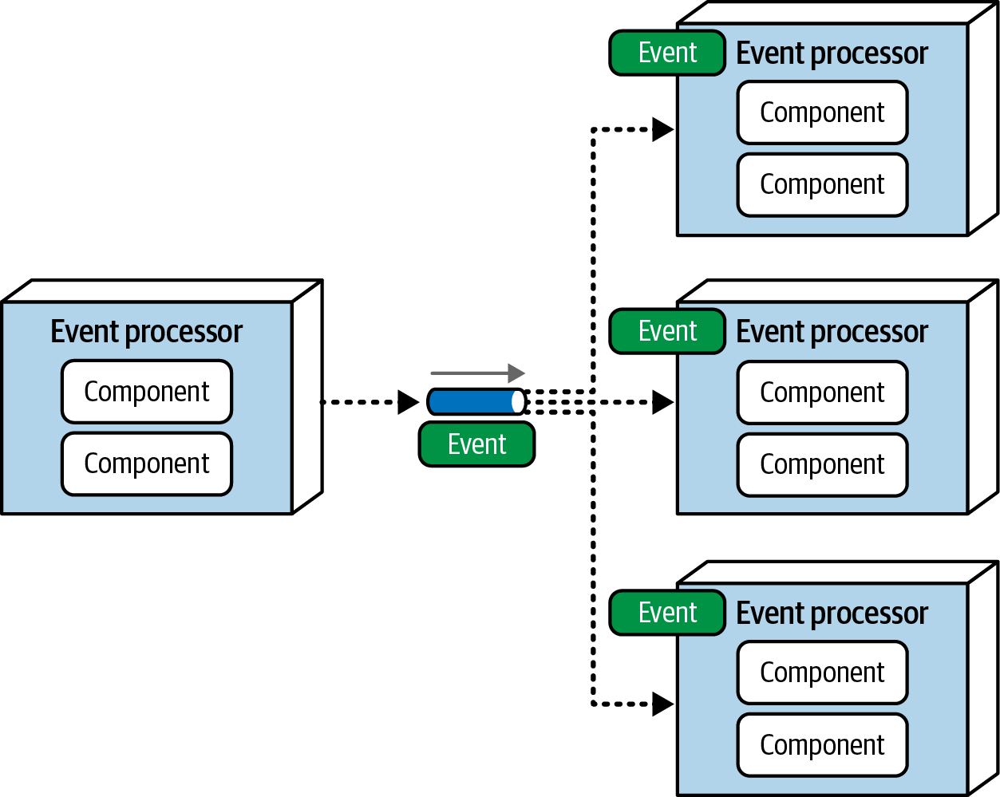

This creates a high degree of **Semantic Decoupling**. One event processor has zero dependency on the internal logic or existence of other processors. 

A classic example is a stock market ticker service. Every time a stock price changes, the service simply broadcasts the new ticker price to a topic. It does not know—nor does it care—if that information is being used by a high-frequency trading bot, a real-time analytics dashboard, or an archival logging service. The publisher simply fires the event and moves on, allowing the system to scale and evolve indefinitely.

---

## Event Payload Strategies
The information contained within an event is called its **payload**. Payloads vary wildly, from a single key-value pair to massive multi-megabyte JSON documents containing all data necessary for downstream processing. 

Architects must carefully evaluate two primary strategies: **Data-Based Payloads** and **Key-Based Payloads**.

### Data-Based Event Payloads
A data-based payload sends *all* the necessary information required for processing directly inside the event itself. 

Consider an `order_placed` event. The `Order Placement` processor inserts the order into its database, and then fires a massive event containing all 45 attributes of the order (totaling roughly 500 KB). 

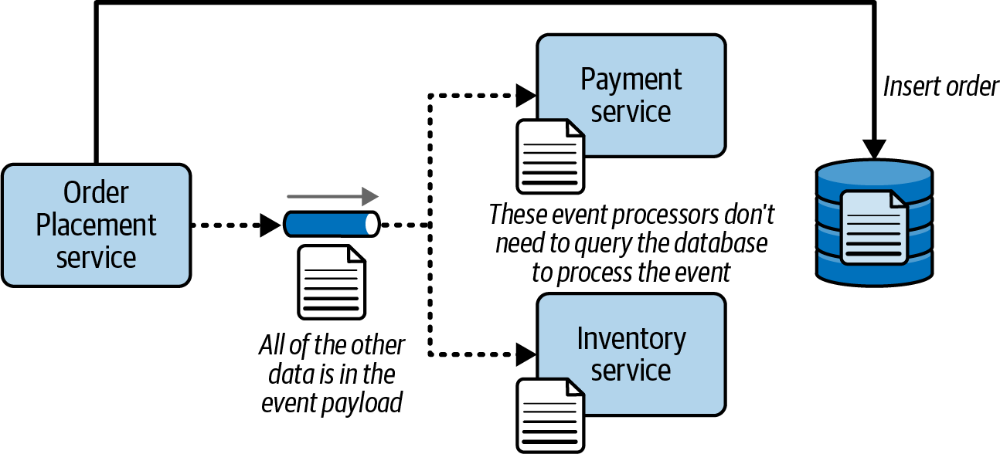

When the `Payment` processor reacts, it simply reads the total cost and customer info from the payload. Simultaneously, the `Inventory` processor reads the item ID and quantity from the payload. 

**The Advantages**
1.  **Extreme Performance & Scalability:** The responding processors *never have to query the database* because the data was handed to them directly. 
2.  **Strict Isolation:** In architectures with strict bounded contexts (like database-per-service), the responding processors might not even have physical access to the Order database. Passing the data in the event is the only way they can function.

**The Disadvantages**
1.  **Data Consistency Nightmares:** Suppose a user places an order, realizes their shipping address is wrong, and instantly updates it. The database (the system of record) is updated. However, the events containing the *old* address are already flying through the message broker. Because event timing is unpredictable, those old events will be processed using stale data, potentially overriding the correct data.
2.  **Brittle Contract Management:** A 45-attribute payload requires a strict contract (JSON schema, GraphQL spec). If the schema changes, you must manage complex backward-compatible versioning across every single event processor. 
3.  **Stamp Coupling:** This is a terrible form of static coupling where a service is forced to depend on a massive data structure when it only uses a tiny piece of it. 

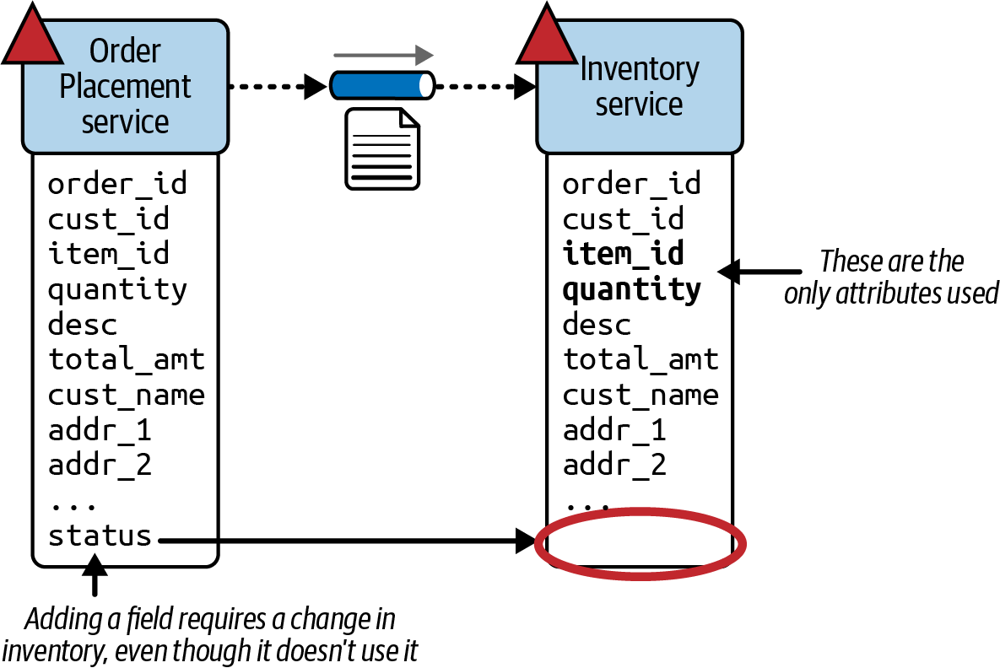

As shown in Figure 15-11, the `Inventory` processor receives a massive 500 KB payload, but it only needs 30 bytes of data (the `item_id` and `quantity`). If a developer changes the `billing_address` field in the payload, the `Inventory` processor might break, requiring a full re-test and redeployment—even though it doesn't care about billing addresses!

4.  **Bandwidth Destruction:** The third fallacy of distributed computing is that "bandwidth is infinite." If you process 500 orders per second, sending a 500 KB payload to the Inventory processor consumes **250,000 KB per second** of bandwidth. If you only sent the 30 bytes it actually needed, it would consume **15 KB per second**. In modern cloud environments, this difference will cost a fortune.

Because of these severe disadvantages, many architects avoid Data-Based Payloads and turn instead to **Key-Based Payloads**.

---

### Key-Based Event Payloads
A key-based event payload contains only a unique identifier (a key) for the event's context, such as an `order_id` or `customer_id`. 

```json
{
 "order_id": "123"
}
```

When an event processor receives this key, it must query the database to retrieve the actual information it needs to perform its task.

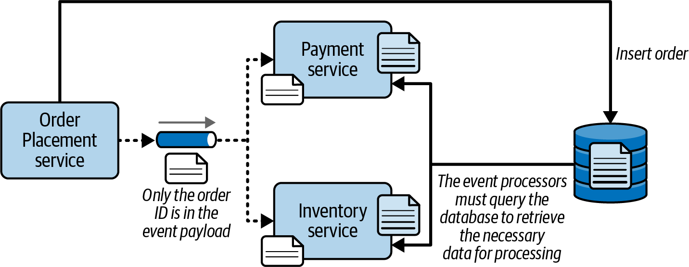

**The Disadvantages**
1.  **Database Bottlenecks:** Because *every* responding processor (Payment, Inventory, Notification, etc.) must simultaneously query the database for information, the database can easily become overwhelmed. This significantly detracts from the system's overall performance, responsiveness, and scalability.
2.  **Access Issues:** If the data is locked within the bounded context of another service (a "database-per-service" model), the responding processors may not even have a path to retrieve the data they need.

**The Advantages**
1.  **Guaranteed Data Consistency:** This is the primary strength of the key-based approach. Because there is a single system of record (the database), every processor is guaranteed to read the most current, up-to-date values. If a user updates their address right after placing an order, every processor will see that new address when they query the database.
2.  **Simple, Stable Contracts:** Because the payload is so tiny and only contains a key, the contract almost never changes. This allows for simple, schema-less JSON that doesn't require complex versioning or deprecation strategies.
3.  **Zero Stamp Coupling & Minimal Bandwidth:** Since no extra data is sent, processors only fetch what they need. Network performance is maximized, and bandwidth costs are kept at an absolute minimum. 

While key-based payloads are much safer for data integrity, the architect must ensure the database can handle the parallel query load. 

### Trade-Off Summary
Choosing between data-based and key-based payloads is not an all-or-nothing proposition; each event type in the system can leverage a different payload strategy. 

| Criteria | Data-Based Payloads | Key-Based Payloads |
| :--- | :--- | :--- |
| **Performance and Scalability** | Good | Bad |
| **Contract Management** | Bad | Good |
| **Stamp Coupling** | Bad | Good |
| **Bandwidth Utilization** | Bad | Good |
| **Restricted DB Access** | Good | Bad |
| **Overall System Fragility** | Bad | Good |

The core trade-off boils down to **Scalability/Performance** vs. **Contract Management/Bandwidth**. 
*   If processing requires extreme scale and milliseconds matter, use **Data-Based Payloads**.
*   If the data structure changes frequently and data integrity is paramount, use **Key-Based Payloads**.

Architects must navigate this spectrum carefully to avoid triggering **Anemic Events** (events that contain so little information they become useless or require excessive "chatter" to process).

---

### Anemic Events
An anemic event is a derived event with a payload that lacks sufficient information for processors to make decisions or take action. 

Consider a `profile_updated` event that uses a strict key-based payload containing only the `customer_id`. 

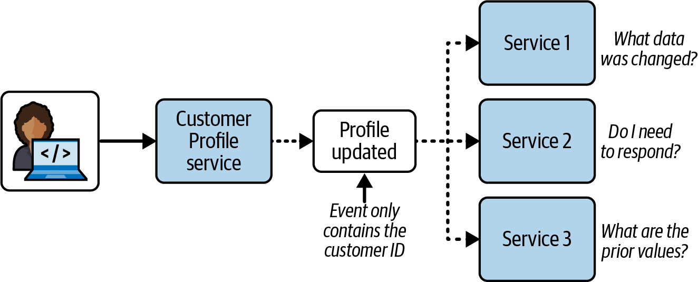

When three separate services receive this event, they face several critical problems:
1.  **Missing "What" Changed:** `Service 1` knows the profile changed, but doesn't know if it was the name, the address, or a critical security setting. Querying the database cannot reveal what the value *used* to be, only what it is now.
2.  **Uncertainty of Action:** `Service 2` doesn't know if the specific update requires it to perform any work at all. 
3.  **Loss of History:** `Service 3` needs to compare the new values against the old values, but the prior data has already been overwritten in the system of record.

These are **Anemic Events**. To avoid this, architects should include both the updated information *and* the prior values in the event payload. 

**The Granularity Spectrum**
Granularity exists on a spectrum:
*   **Far Left (Key-Based):** High integrity, but can easily become anemic. Works well for simple "Create" or "Delete" events.
*   **Far Right (Data-Based):** High performance, but suffers from "Stamp Coupling" and bandwidth issues.
*   **The Sweet Spot:** Usually lies in the middle—providing just enough information (including "delta" changes and prior values) to satisfy downstream consumers without bloating the event with useless data.

---

### The Swarm of Gnats Antipattern
While anemic events are concerned with the granularity of the *payload*, the **Swarm of Gnats** antipattern is concerned with the granularity of the *triggered events themselves*. 

This antipattern occurs when an event processor triggers far too many microscopic derived events for a single business action, overwhelming the system and making event flows impossible to trace.

#### The Risk of Overly Coarse-Grained Events
First, consider an event that is too coarse, like `fraud_checked`. 

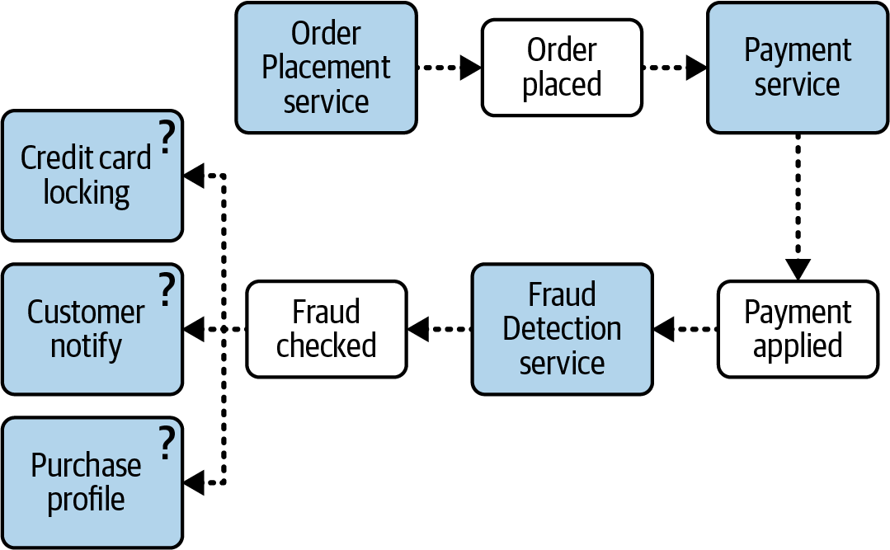

When the `Fraud Detection` service fires `fraud_checked`, three separate services must listen to it: `Credit Card Locking`, `Customer Notify`, and `Purchase Profile`. Every single one of them must parse the payload to see the outcome. If no fraud was detected, two of those services have wasted bandwidth and processing power just to find out they have nothing to do.

A better approach is splitting the outcome into two distinct events: `fraud_detected` and `no_fraud_detected`.

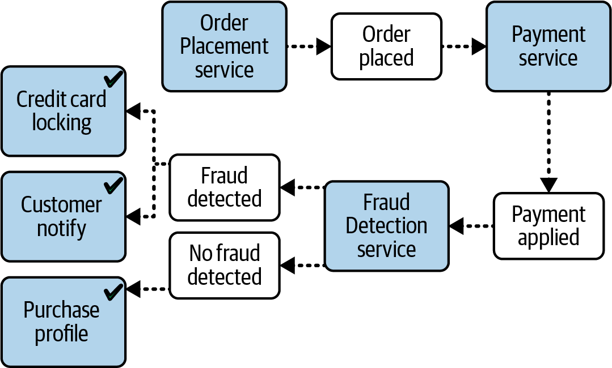

This allows services to subscribe *only* to the outcome they care about, reducing system churn.

#### The Swarm: Overly Fine-Grained Events
However, architects often overcorrect and trigger an individual event for every tiny field change. 

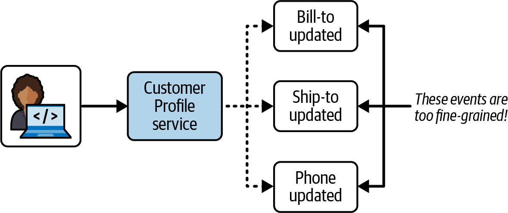

As shown in Figure 15-16, if a user updates their billing address, shipping address, and phone number, the processor fires three separate events. This "swarm" of microscopic events saturates the message broker and makes the system's logic extremely difficult to follow.

**The Solution: Domain-Scoped Events**
To avoid the swarm, bundle related state changes into a single **Domain Event**, such as `profile_updated`. 

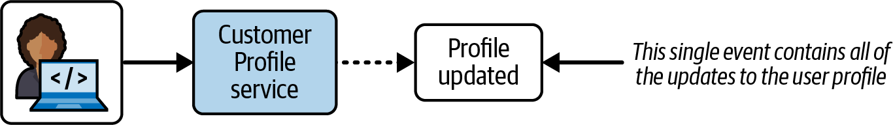

This single event should contain the "before" and "after" data for all updated fields. This approach is significantly more efficient, easier to monitor, and helps maintain a clear understanding of the system's overall event flow. Focus on the **outcome** of the state change rather than the individual attribute modifications.

---

## Error Handling
Because asynchronous communication lacks a synchronous user to notify when something goes wrong, error handling is one of the most complex challenges in Event-Driven Architecture.

The **Workflow Event Pattern** is a reactive architecture pattern designed to address this challenge while maintaining high responsiveness. It relies on three principles: delegation, containment, and repair.

### The Workflow Event Pattern
If an event processor encounters an error while processing a message, it must *never* pause to try and figure out what went wrong. If it stops to analyze the error, the entire message queue backs up, destroying the system's responsiveness. 

Instead, it immediately **delegates** the error to a dedicated Workflow Processor and instantly moves on to the next message in the queue. 

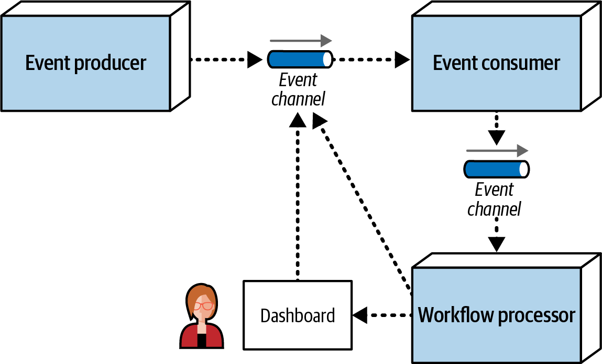

As shown in Figure 15-18:
1.  **Delegation:** The consumer hits an error and drops the bad message into an error queue.
2.  **Repair:** The Workflow Processor picks up the bad message. It attempts to repair the data programmatically (using deterministic rules, AI, or machine learning). 
3.  **Resubmission:** Once repaired, it drops the message back into the original queue to be processed again.
4.  **Manual Intervention:** If the Workflow Processor cannot figure out how to fix it, it routes the message to a human dashboard for manual repair. 

### A Real-World Trading Example
Suppose a `Trade Placement` service processes incoming batches of stock purchases in the format: `ACCOUNT, SIDE, SYMBOL, SHARES`. 

Suddenly, a badly formatted order arrives. Instead of just passing a number, the external system appended the word "SHARES" to the end:
`2WE35HF6DHF, BUY, AAPL, 8756 SHARES`

When the system attempts to parse "8756 SHARES" into a Long, it throws a fatal `java.lang.NumberFormatException`. Because this is fully asynchronous, there is no UI to show the error to the user.

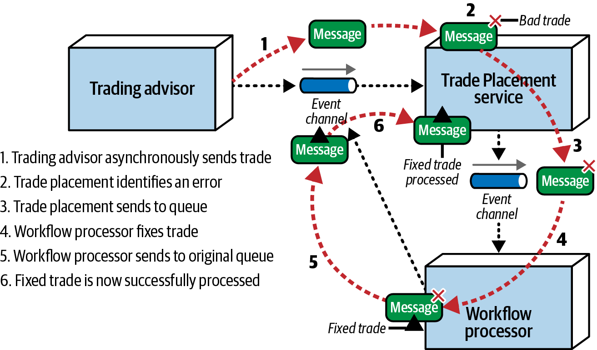

Applying the Workflow Event Pattern (Figure 15-19) prevents a catastrophe:
1.  The `Trade Placement` service immediately delegates the bad message to the `Trade Placement Error` service and seamlessly continues processing the rest of the trades in the batch.
2.  The Error Service inspects the payload, realizes the problem, and strips the string " SHARES" from the end of the line.
3.  It resubmits the repaired payload (`2WE35HF6DHF, BUY, AAPL, 8756`) back to the originating queue.
4.  The `Trade Placement` service picks it up again and processes it successfully.

**The Out-of-Sequence Consequence**
Because the erroneous message was pulled out, repaired, and put back at the *end* of the queue, the messages were processed **out of sequence**. 

In some domains (like stock trading), message order is critical. A `SELL` order must be processed before a `BUY` order for the same account. To mitigate this out-of-sequence risk, the `Trade Placement` service can pause processing for that specific Account ID. It can route all subsequent messages for that specific account into a temporary holding queue until the repaired message returns. Once the repaired message is processed, it flushes the holding queue, preserving perfect FIFO (First-In, First-Out) ordering.

---

## Preventing Data Loss
In asynchronous communication, "data loss"—when an event or message is dropped before it reaches its destination—is a primary concern. Fortunately, several standard architectural patterns exist to prevent this.

### Where Data Loss Occurs
There are three primary points in an asynchronous workflow where an event can be lost:

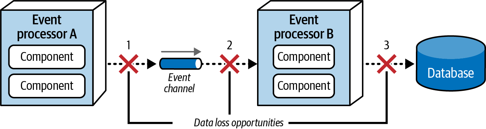

1.  **Producer to Broker:** The producer crashes before receiving an acknowledgment, or the broker crashes before it can fully accept the event.
2.  **Broker to Consumer:** The consumer de-queues an event but crashes before it can actually process it.
3.  **Consumer to Database:** The consumer processes the event but fails to persist the results to the database due to a data error or system failure.

### Mitigation: The Event Forwarding Pattern
These risks are mitigated through a combination of broker configurations and processing modes.

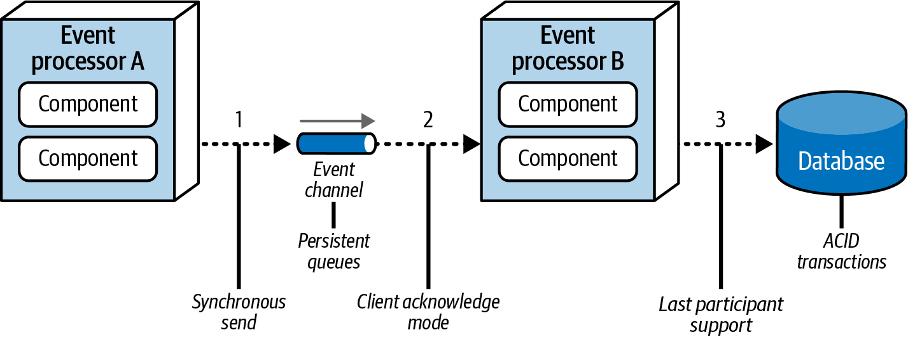

#### 1. Guarantees between Producer and Broker
To ensure the message actually makes it to the broker, architects use **Persistent Message Queues** combined with a **Synchronous Send**. 
*   **Persistent Queues:** The broker writes every incoming event to a physical data store (disk) as well as memory. If the broker crashes, the event remains on disk and is available when the broker restarts.
*   **Synchronous Send:** The producer service performs a blocking wait until the broker explicitly acknowledges that the event has been safely persisted to the database/disk.

#### 2. Guarantees between Broker and Consumer
By default, most brokers use *Auto-Acknowledge Mode*, where an event is deleted from the queue the moment it is read. If the consumer crashes 10ms later, the data is gone forever. 
To prevent this, use **Client Acknowledge Mode**. The event stays in the queue (locked to that specific consumer) until the consumer sends a manual "Acknowledge" signal back to the broker. If the consumer crashes, the broker realizes the connection is lost and makes the event available for another consumer.

#### 3. Guarantees between Consumer and Database
To ensure the end-to-end flow is complete, the consumer should use **ACID Transactions** with a database commit. 
Through **Last Participant Support (LPS)**, the event is only removed from the persisted queue *after* the database transaction has successfully committed. This creates a "Guaranteed Delivery" flow from the original producer all the way to the final system of record.

> [!NOTE]
> While these techniques prevent data loss, they introduce performance overhead. Synchronous sends and disk persistence are significantly slower than memory-only, asynchronous fire-and-forget messaging. As always, architecture is about trade-offs.

---

## Request-Reply Processing
While the majority of EDA is built on fire-and-forget messaging, there are situations where an event processor needs an immediate response or confirmation before it can proceed. In asynchronous systems, this is known as **Request-Reply Messaging** (or pseudosynchronous communication).

The basic topology consists of two separate event channels: a **Request Queue** and a **Reply Queue**. 

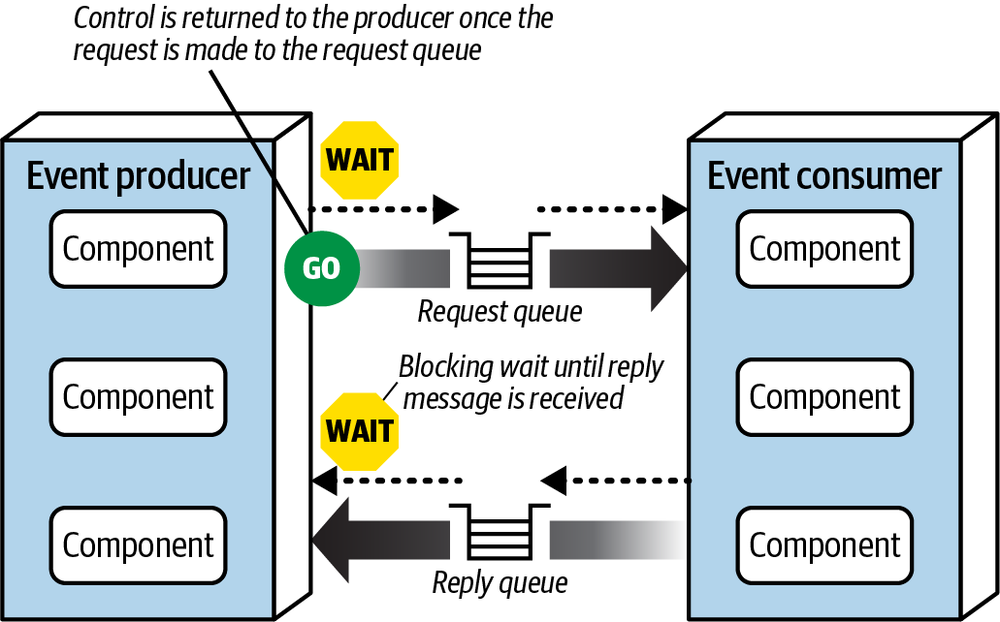

There are two primary ways to implement this pattern:

### 1. The Correlation ID Technique (Recommended)
This is the most common and performant approach. It uses a **Correlation ID (CID)** in the message header to match replies to their original requests.

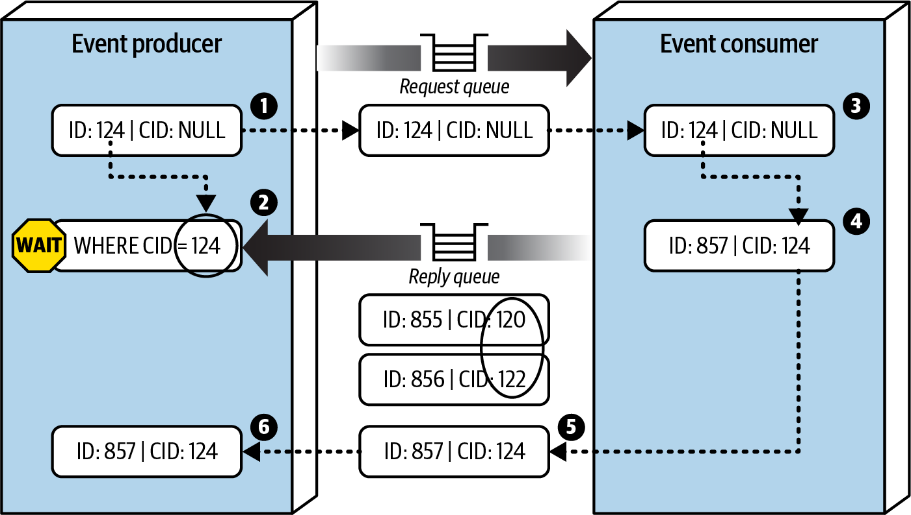

1.  **Request:** The Producer sends a message with a unique ID (e.g., ID: 124) to the Request Queue.
2.  **Wait:** The Producer performs a **blocking wait** on the Reply Queue, but it uses a *Message Selector* to only pick up messages where the Correlation ID is 124.
3.  **Processing:** The Consumer processes the request and generates a reply. It sets the reply's Correlation ID header to 124.
4.  **Completion:** The Producer sees the message with CID: 124 and continues its processing.

This approach is highly scalable because a single Reply Queue can handle thousands of concurrent requests for different producers.

### 2. The Temporary Queue Technique
Alternatively, a producer can create a one-time **Temporary Queue** for each specific request.

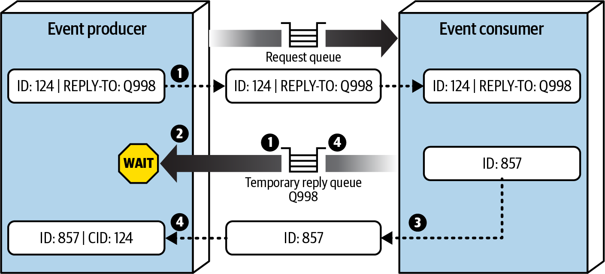

1.  **Request:** The Producer creates a unique temporary queue and sends the request, including the temp queue's name in the `reply-to` header.
2.  **Wait:** The Producer waits on that specific temp queue. No Correlation ID or message selector is needed because no other service even knows the queue exists.
3.  **Reply:** The Consumer sends the response directly to the named temporary queue.
4.  **Cleanup:** The Producer receives the response and immediately deletes the temporary queue.

**The Trade-Off**
While the temporary queue technique is simpler to implement (no message selectors), it is **drastically slower**. Creating and destroying a physical queue for every single request puts an enormous strain on the message broker. For high-volume systems, the Correlation ID technique is always the superior choice.

---

## Mediated Event-Driven Architecture
Thus far, we have discussed **Choreographed EDA**, where processors broadcast events and no single component is "in charge" of the workflow. 

However, when an architect requires strict control over the processing flow, they turn to the orchestrated **Mediator Topology**.

This topology introduces an **Event Mediator** that manages and controls the entire workflow. Crucially, the mediator topology relies heavily on **Messages** (direct commands like `ship_order`) rather than **Events** (broadcasts like `order_shipped`). The event processors no longer advertise what they have done; they simply perform the command and acknowledge success back to the mediator.

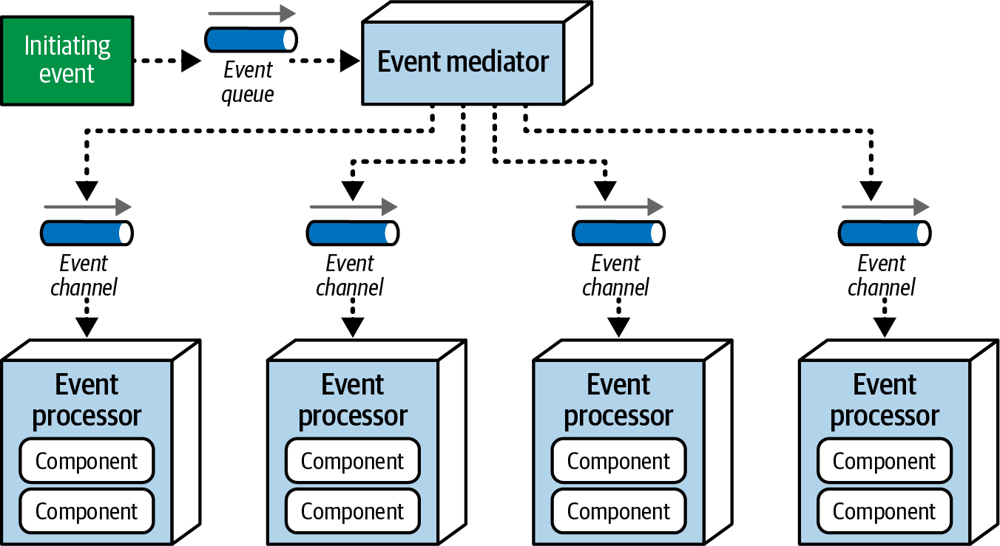

To avoid a single point of failure, architects usually deploy multiple mediators scoped by domain (e.g., a `Customer Mediator` and an `Order Mediator`).

### Implementing the Mediator
The technology used for the mediator depends entirely on the complexity of the workflow:
1.  **Simple Routing & Error Handling:** Apache Camel, Mule ESB, or Spring Integration. (Usually custom-written code in Java/C#).
2.  **Complex, Dynamic Conditional Paths:** Apache ODE or Oracle BPEL Process Manager. (Uses Business Process Execution Language (BPEL), an XML-like structure configured via GUIs).
3.  **Long-Running Human Interactions:** Business Process Management (BPM) engines like jBPM. (Used when a workflow must pause for hours/days waiting for a human manager to approve a large trade).

**The Mediator Delegation Pattern**
Because it is rare for all events to fit one complexity profile, architects use the delegation pattern.

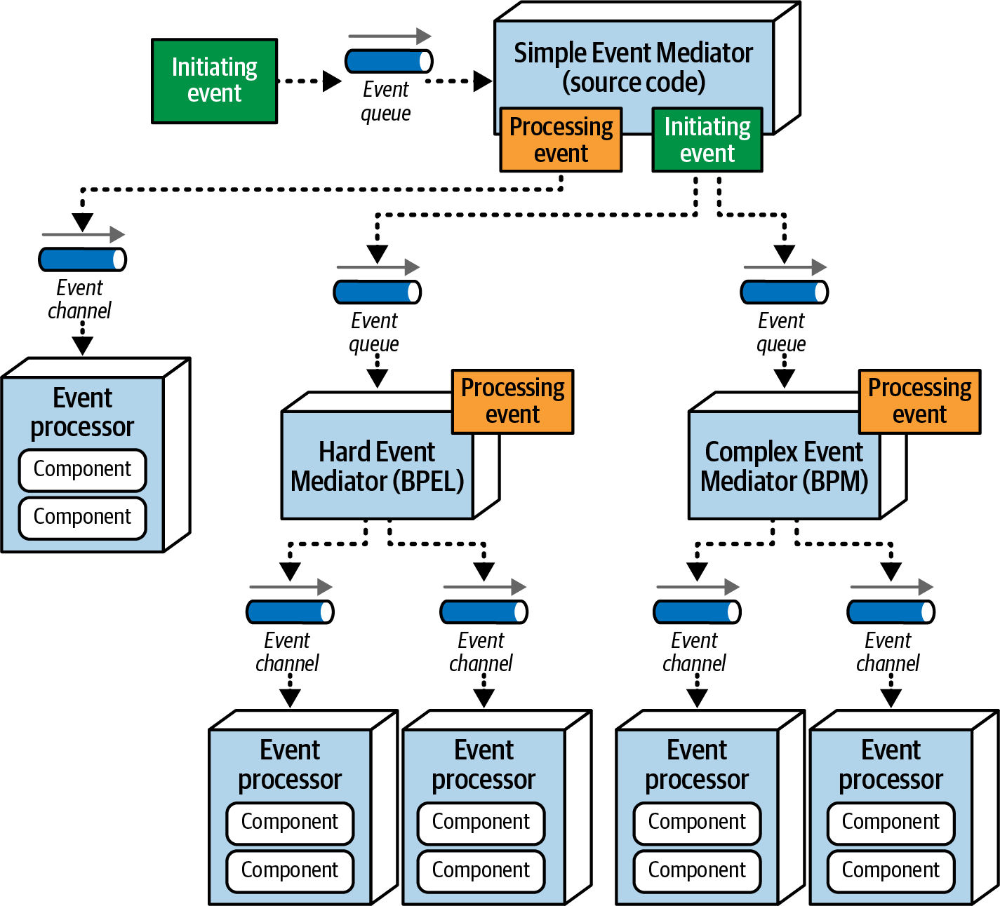

Every event is sent to a Simple Mediator (like Apache Camel). If Camel can handle it, it processes the flow. If the workflow requires long-running human approval, Camel simply delegates the workflow to the heavy BPM engine.

### The Mediated Workflow in Action
Let's revisit the retail order entry system, this time utilizing a Mediator.

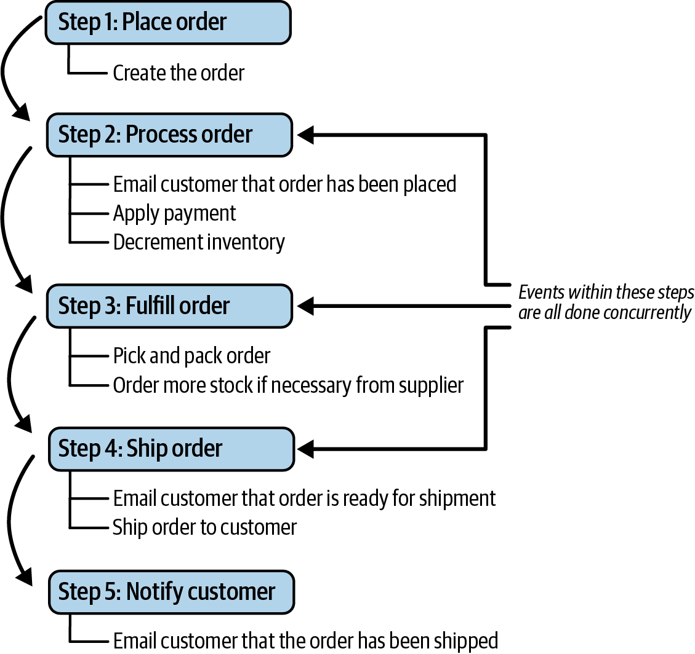

1.  **Step 1 (Create):** The Mediator receives `place_order`. It sends a `create order` message to the `Order Placement` queue and waits for an acknowledgment. 
    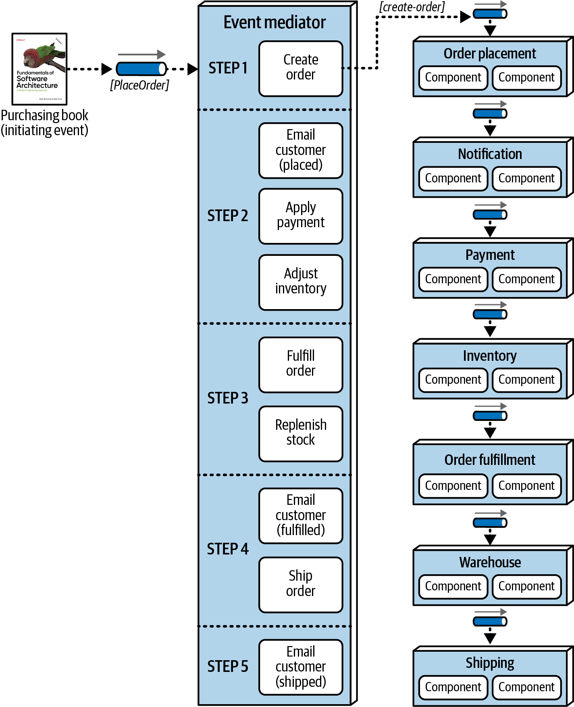

2.  **Step 2 (Parallel):** Once acknowledged, the Mediator concurrently sends `email customer`, `apply payment`, and `adjust inventory`. **Crucially, the mediator pauses and waits until all three acknowledge success before proceeding.** 
    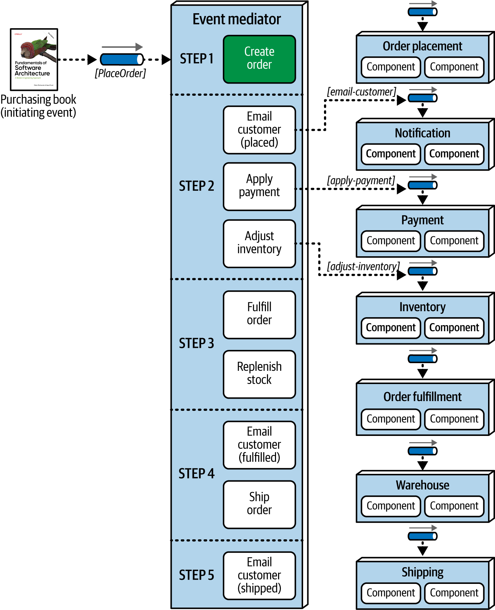

3.  **Step 3 (Parallel):** The Mediator concurrently sends `fulfill order` and `order stock`. It waits for acknowledgments. 
    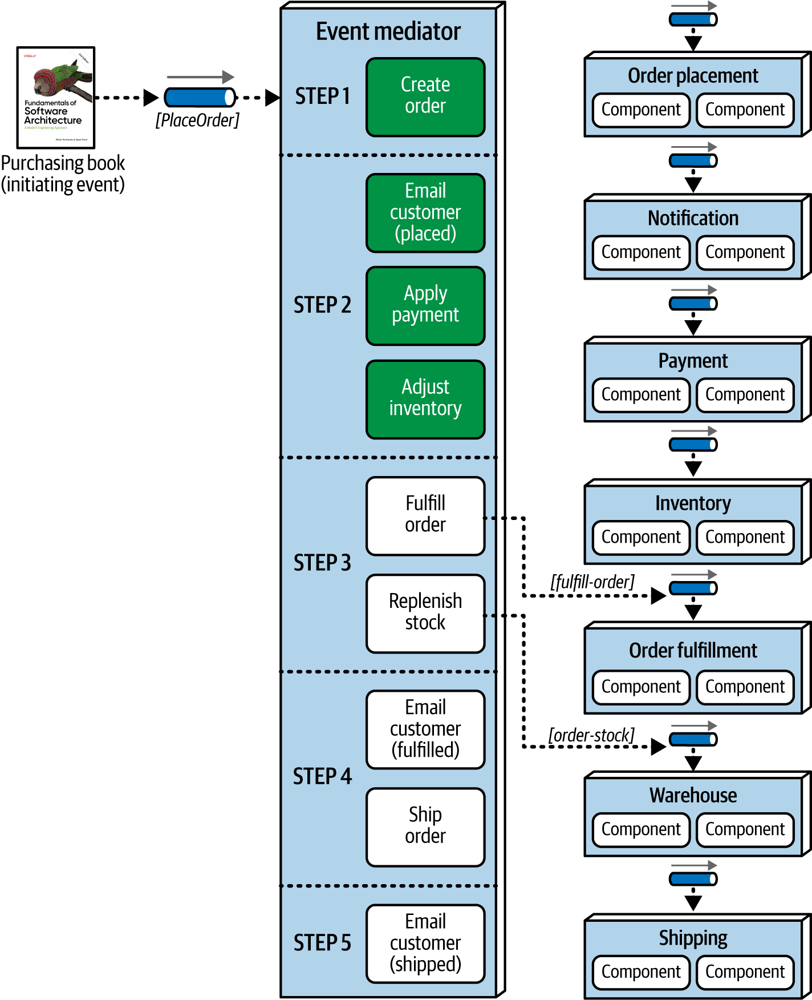

4.  **Step 4 (Parallel):** The Mediator concurrently sends `ship order` and `email customer` (notifying them it's ready to ship). Waits for acks. 
    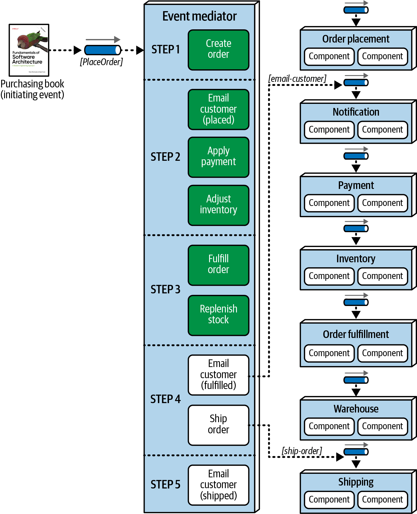

5.  **Step 5 (Finalize):** The Mediator sends `email customer` (shipped), marks the entire flow as complete, and destroys the state. 
    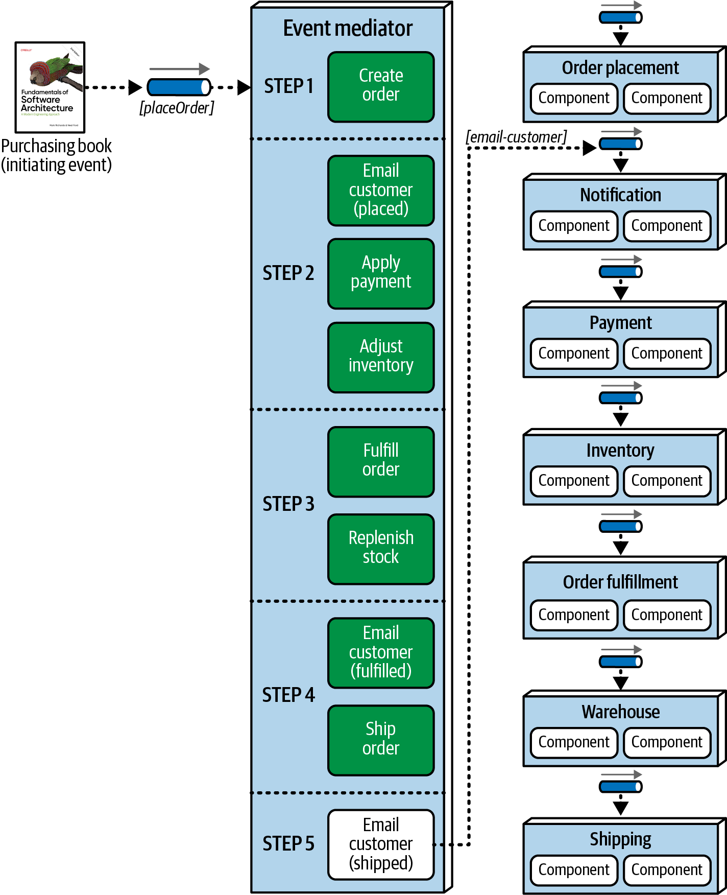

### The Trade-Offs
The Mediator Topology provides incredible **Workflow Control and Error Recovery**. If a credit card is expired during Step 2, the Mediator knows exactly where the flow stopped. It persists the state to a database. When the customer updates their card 3 days later, the Mediator pulls the state from the database and resumes the flow exactly where it left off (at Step 3).

However, this comes at a severe cost:
*   **Bottlenecks:** The mediator itself must scale linearly with the event processors, which can create a massive choke point.
*   **Decreased Performance:** Because every single step requires an acknowledgment back to the central brain before the next step can trigger, it is significantly slower than Choreographed EDA.
*   **Tighter Coupling:** Event processors are no longer perfectly decoupled; they are tightly bound to the mediator's command structures.

Ultimately, the choice between Choreography and Mediation is a choice between **High Performance/Scalability** (Choreography) and **Strict Workflow Control/Error Handling** (Mediation).

---

## Data Topologies
While the flow of events is the primary focus of EDA, the **Data Topology**—how data is stored and accessed—is a unique and challenging aspect of this style.

To describe the different database topologies within EDA, we’ll use a simplified version of our order-entry system.

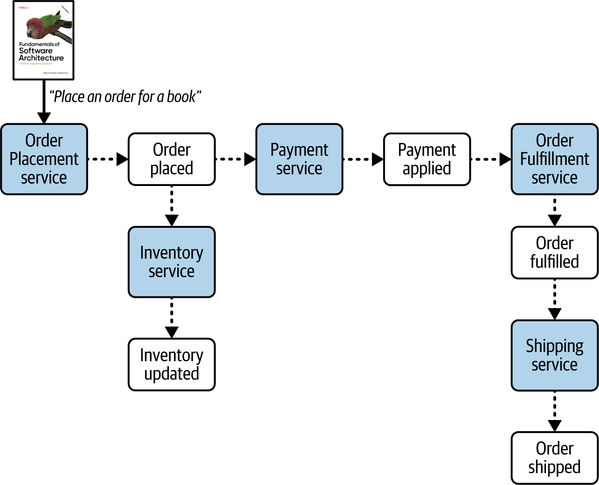

A critical complication in EDA is that one processor often needs information owned by another domain. For example, the `Order Placement` processor needs to know:
1.  **Inventory Levels:** How many items are currently in stock? (Owned by the Inventory domain).
2.  **Shipping Options:** What shipping methods are available for the customer's location? (Owned by the Shipping domain).

In a highly decoupled architecture, how `Order Placement` retrieves this data is a complex architectural decision with significant trade-offs. 

---

### Monolithic Database Topology
The most common (and simplest) approach is the **Monolithic Database Topology**, where all event processors share a single, central database.

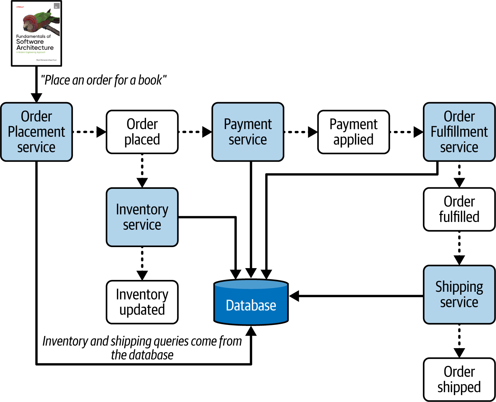

**The Advantages**
The primary benefit is **Direct Access**. As shown in Figure 15-34, the `Order Placement` processor can simply query the central database to find inventory levels and shipping options. It doesn't need to ask other services for permission or data; it just reads what it needs. This preserves the decoupling between event processors.

**The Disadvantages**
1.  **Low Fault Tolerance:** The central database is a catastrophic single point of failure. If it goes down, every single event processor in the system is effectively offline.
2.  **Scalability Choke Point:** While EDA allows event processors to scale independently (using the event channel as a buffer/backpressure point), the database cannot scale as easily. High concurrency loads from dozens of scaling processors can quickly overwhelm a monolithic database.
3.  **Brittle Change Control:** Any change to the database schema (like dropping a column) requires coordinated testing and deployment across multiple independent event processors.
4.  **Single Architectural Quantum:** Because all services are coupled at the database level, the entire system forms a **Single Architectural Quantum**, severely limiting agility and deployment independence.

---

### Domain Database Topology
The **Domain Database Topology** breaks the monolith by grouping event processors into distinct domains, each owning its own dedicated database.

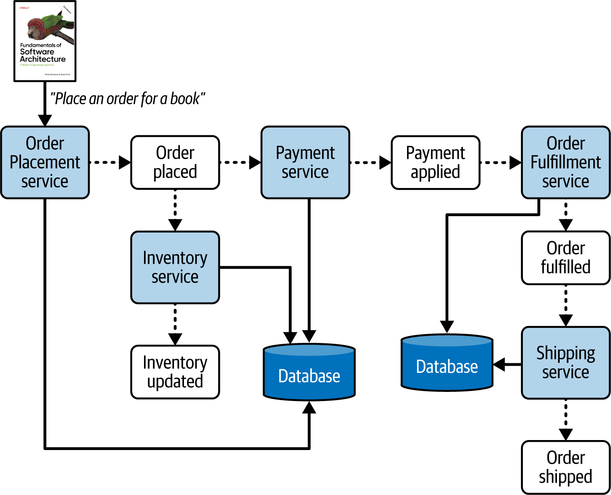

**The Advantages**
By partitioning data by domain, this topology significantly improves the "Big Three" architectural characteristics:
*   **Fault Tolerance:** If the Order Processing database crashes, the Order Placement domain remains fully operational. The event channels act as buffers (backpressure), holding events until the downstream database returns.
*   **Scalability:** Each database only needs to scale based on the load of its specific domain-scoped processors.
*   **Change Control:** Schema changes are isolated to a single domain, requiring zero coordination with other parts of the system.

**The Disadvantages**
The biggest risk in this topology is the **Synchronous Coupling Trap**. 

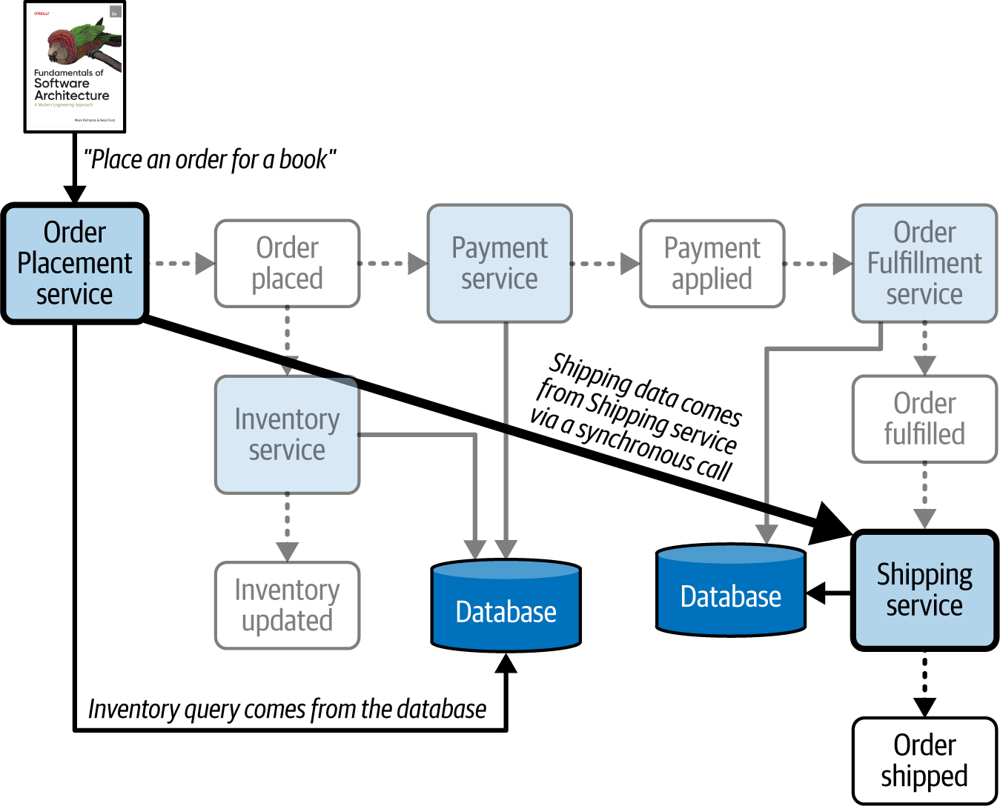

As shown in Figure 15-36, what happens when `Order Placement` needs shipping options owned by the `Shipping` domain? In this topology, it is often forced to make a **synchronous interservice call** to the Shipping processor. 

This is dangerous. Synchronous calls in a distributed EDA system create **Dynamic Quantum Entanglement**, dragging down fault tolerance and scalability. If you find yourself making constant synchronous calls between domains, it is a clear sign that your domain boundaries are wrong—you should either merge the domains or revert to a monolithic database.

---

### Dedicated Data Topology
The **Dedicated Data Topology** (often called the **Database-per-Service** pattern) takes isolation to its logical extreme: every single event processor owns its own dedicated database.

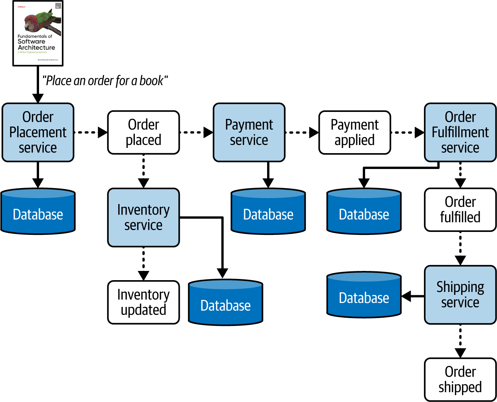

**The Advantages**
This topology offers the absolute highest levels of operational independence:
*   **Maximum Fault Tolerance:** A database failure is strictly contained within a single bounded context. Every other processor in the system remains unaffected.
*   **Extreme Scalability:** Each database instance is fine-tuned and scaled exclusively for the needs of its one and only owner.
*   **Independent Change Control:** Developers can modify their schemas at will, as no other processor in the system has physical access to their data.

**The Disadvantages**
1.  **High Operational Cost:** Managing dozens or hundreds of independent database instances can be prohibitively expensive, both in license fees and infrastructure overhead.
2.  **Synchronous Coupling Explosion:** The biggest drawback is the potential for massive synchronous coupling. 

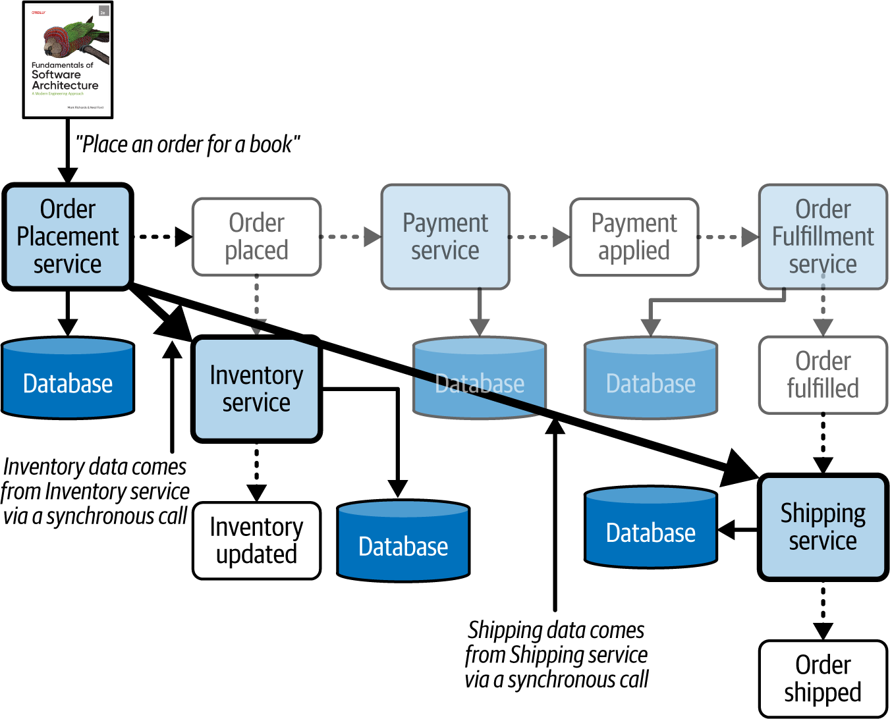

As shown in Figure 15-38, if the `Order Placement` processor needs both inventory counts and shipping rates, it is now forced into **two separate synchronous coupling points**. If either of those downstream processors is slow or down, `Order Placement` becomes slow or down. 

This topology is a powerful choice for self-contained processors that rarely need data from the outside world. However, if your event processors are constantly chatting with each other via synchronous APIs to retrieve data, the architecture will suffer. In those cases, it is often better to trade off some isolation and move toward a **Domain** or **Monolithic** topology to restore performance and system reliability.

---

## Cloud Considerations
Event-Driven Architecture is a natural fit for the cloud. Its highly decoupled nature allows it to easily leverage native cloud services (SNS/SQS, EventBridge, Lambda, Managed Kafka), and its asynchronous shape perfectly matches the elastic scaling capabilities of modern cloud infrastructure. 

## Common Risks
1.  **Nondeterministic Side Effects:** Because event processing is asynchronous and parallel, it can be extremely difficult to predict exactly how a complex chain of events will behave. A small change in one processor can trigger an unexpected cascade of derived events.
2.  **Contract Brittleness:** While services are dynamically decoupled, they are still **statically coupled** via event contracts. Changing a payload schema can break downstream processors that the architect may not even know exist.
3.  **Synchronous Overuse:** EDA loses its "superpowers" when services fall back on synchronous communication. If your services constantly need to talk to each other in real-time to complete a task, you are fighting the architecture.
4.  **Invisible State:** In a purely asynchronous system, it is notoriously difficult to know if a specific initiating event has been fully processed, or even what its current status is at any given moment.

## Governance
Governance in EDA is primarily **nonstructural** and relies heavily on a robust **observability mesh**. Because the system is nondeterministic, you cannot govern it purely through static analysis; you must watch it in motion.

### Static Coupling Governance
Architects should set up governance metrics to track:
*   **Contract Change Rate:** High rates of change in event schemas indicate instability and risk.
*   **Stamp Coupling Metrics:** Use logs to identify which fields in a contract are never used by any subscriber. Trimming these unused fields reduces bandwidth and prevents unnecessary "brittleness" when those fields need to change.

### Dynamic Coupling Governance
The most critical part of EDA governance is tracking **Synchronous Communication**. 
*   **Fitness Functions:** Architects should write automated fitness functions that scan logs or use custom-identifier libraries to detect synchronous inter-processor calls. 
*   **Reviewing Entanglement:** Every instance of synchronous communication should be flagged as "architectural decay" and discussed to see if it can be replaced with an asynchronous pattern or if the domain boundaries need to be redrawn.

---

## Team Topology Considerations
While Event-Driven Architecture is often considered technically partitioned (due to the distinct layers of brokers, channels, and processors), it can be successfully aligned with domain-focused teams. However, the decoupled, asynchronous nature of EDA presents unique challenges for standard team topologies.

### Stream-Aligned Teams
Stream-aligned teams may struggle with EDA as the system grows. Because a single domain business action is often spread across multiple event processors and complex chains of derived events, understanding the "big picture" becomes difficult. Adding even a simple step to a workflow can require coordinated changes across multiple processors, making these teams less effective as complexity increases.

### Enabling Teams
Enabling teams generally **do not work well** in EDA. The high degree of integration required for derived events and contract management means that experimentation within a single stream can easily disrupt the entire system's event flow. The overhead of coordination between enabling teams and stream-aligned teams is usually too high to be productive.

### Complicated-Subsystem Teams
This is where EDA shines. **Complicated-subsystem teams work very well** with this style. Because event processors are highly decoupled and asynchronous, a team can easily isolate a complex math engine or fraud analysis tool into its own processor. The stream-aligned teams only need to worry about the static event contract; the internal complexity of the subsystem is perfectly contained.

### Platform Teams
EDA relies heavily on specialized infrastructure—message brokers, event hubs, and streaming platforms (like Kafka). **Platform teams are essential** in this architecture. They provide the standardized tools, APIs, and managed services that allow other teams to focus on business logic rather than the complexities of message delivery guarantees and partition management.

---

## Style Characteristics
Event-Driven Architecture is a powerful but complex style. The following ratings (Figure 15-39) reflect its unique trade-offs.

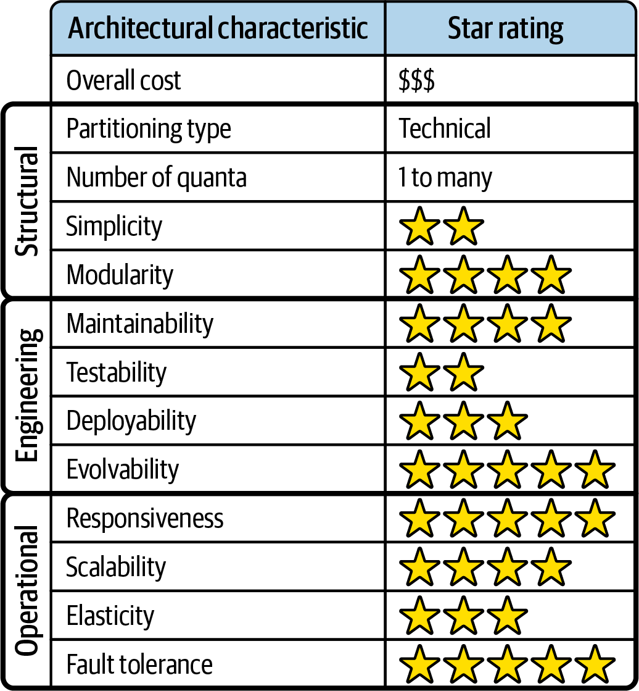

### The Architecture Quanta
The number of quanta in EDA varies from one to many. While asynchronous communication generally promotes separate quanta, certain anti-patterns can collapse them.
*   **Shared Databases:** If multiple event processors share a single database instance, they form a single architectural quantum.
*   **Request-Reply:** Synchronous blocking waits (pseudosynchronous communication) tie processors together, forcing them into a single quantum even if the underlying transport is asynchronous.

### The Strengths (4-5 Stars)
*   **Evolutionary (5 stars):** EDA is the most evolutionary of all architectural styles. Adding a new feature is as simple as subscribing a new processor to an existing event "hook." No changes to the existing infrastructure are required.
*   **Performance (5 stars):** High performance is achieved by combining asynchronous communication with massive parallel processing. 
*   **Scalability (4 stars):** Competing consumers and consumer groups allow for programmatic load balancing. As load increases, you simply spin up more event processors. (It loses one star only compared to Space-Based architecture's data-grid model).
*   **Fault Tolerance (4 stars):** Decoupled processors and eventual consistency allow the system to remain partially operational even if downstream services fail.

### The Weaknesses (1-2 Stars)
*   **Simplicity & Testability (Low):** EDA is inherently nondeterministic. Because event flows are dynamic and unpredictable, "event tree diagrams" can grow to thousands of scenarios, making end-to-end testing a massive challenge.
*   **Workflow Control:** It is difficult to determine when a complex business transaction is truly "complete" or what its current state is.
*   **Error Handling & Recoverability:** If a `Payment` processor crashes, the `Inventory` processor might still adjust stock, unaware of the failure. Restarting a business transaction (recoverability) is often impossible because resubmitting the initial event would trigger dozens of asynchronous side effects that have already occurred.

---

## Choosing Between Request-Based and Event-Based Models
Both the request-based and event-based models are viable, and most modern systems utilize a hybrid of both. However, choosing the dominant model for a specific workflow requires careful analysis.

*   **Request-Based Model:** Recommended for well-structured, **data-driven** requests (e.g., "Get me the customer's profile") where certainty, synchronous control, and sequential workflow are the top priorities.
*   **Event-Based Model:** Recommended for flexible, **action-based** events (e.g., "A customer just placed a massive order") that require extreme responsiveness, massive scale, and real-time decision-making.

### Summary of Trade-Offs
The following table (Table 15-2) summarizes the fundamental trade-offs when moving from a request-based model to an event-driven model.

| Advantages over Request-Based | Trade-Offs |
| :--- | :--- |
| Better response to dynamic user content | Only supports eventual consistency |
| Better scalability and elasticity | Less control over processing flow |
| Better agility and change management | Less certainty over event flow outcome |
| Better adaptability and extensibility | Difficult to test and debug |
| Better responsiveness and performance | |
| Better real-time decision making | |
| Better reaction to situational awareness | |

---

## Examples and Use Cases
Any business problem focused on responding to events—internal or external—is a prime candidate for Event-Driven Architecture. While we have used the retail order-entry system as a primary example, another powerful use case is the **"Going, Going, Gone"** online auction system.

### Case Study: Online Auction Bidding
In an online auction, the number of bidders is unknown and can spike drastically as a timed auction comes to a close, requiring extreme **scalability** and **elasticity**. Furthermore, the system must be incredibly **responsive** to provide a real-time feel to the bidders.

The key to this system's success is that a "Bid" is not treated as a request to the system, but as an **event that has already happened**.

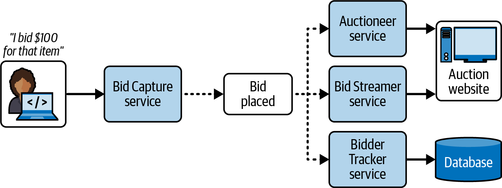

As illustrated in Figure 15-40:
1.  **Bid Capture:** This processor receives the initiating bid event. If it qualifies as the new highest bid, it triggers a `bid_placed` derived event.
2.  **Auctioneer:** Responds to `bid_placed` and immediately updates the central item price on the website.
3.  **Bid Streamer:** Simultaneously responds to the event, streaming the bid update out to every bidder's UI and the global bid history.
4.  **Bidder Tracker:** Simultaneously responds to the event to persist the bid data for long-term auditing and tracking.

This architecture allows the system to handle thousands of concurrent bidders with zero lag, ensuring that the "Auctioneer" and "Bid Streamer" can update the world instantly while the "Bidder Tracker" handles the slower work of database persistence in the background.

## Conclusion
Event-Driven Architecture is arguably the most powerful—and most complex—architectural style available. It grants architects "superpowers" in terms of performance, scale, and evolutionary change. 

However, these powers come at the cost of high complexity, difficult testing, and challenging error handling. If your business domain is primarily request-based and data-driven, the overhead of EDA may not be worthwhile; in those cases, the **Microservices** style (discussed in Chapter 18) may be a more appropriate choice.

---
