# Chapter 16. Space-Based Architecture Style

Most web-based business applications follow a standard request flow: a request from a browser hits a web server, which then hits an application server, and finally a database server. While this works for moderate loads, severe bottlenecks emerge as concurrent user load increases. 

Typically, architects respond by scaling out the web servers. This is easy, but it often just pushes the bottleneck down to the application server. Scaling application servers is more complex, and doing so usually just pushes the bottleneck down to the **database server**, which is the hardest and most expensive layer to scale. 

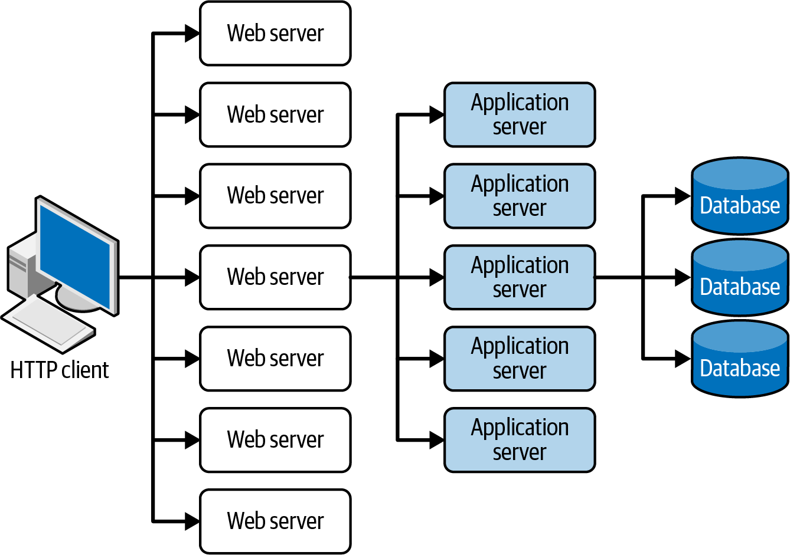

This creates a "triangle-shaped" topology (Figure 16-1), where the easiest-to-scale layer (web) is the widest, and the hardest-to-scale layer (database) is the narrowest. In any high-volume application, the database eventually becomes the final limiting factor in concurrency. 

The **Space-Based Architecture Style** is designed specifically to solve these extreme scalability, elasticity, and concurrency problems. Rather than trying to retrofit caching or scale a relational database to its breaking point, Space-Based architecture solves the problem at the structural level. It is particularly effective for applications with unpredictable and highly variable user volumes.

---

## Topology
Space-based architecture derives its name from **tuple space**, a parallel processing technique where multiple processors communicate through shared memory. 

The core breakthrough of this style is replacing the central database—the ultimate synchronous bottleneck—with **replicated in-memory data grids**. 

### The Core Mechanism
Application data is kept entirely in-memory and replicated among all active processing units. When a unit updates data, it does so in memory and then asynchronously sends that update to the database via a **Data Pump**. Because the central database is removed from the critical path of standard transactional processing, the "triangle-shaped" bottleneck is eliminated, allowing for near-infinite scalability.

### Primary Artifacts
Space-based architecture is complex, consisting of several specialized artifacts working in harmony (Figure 16-2).

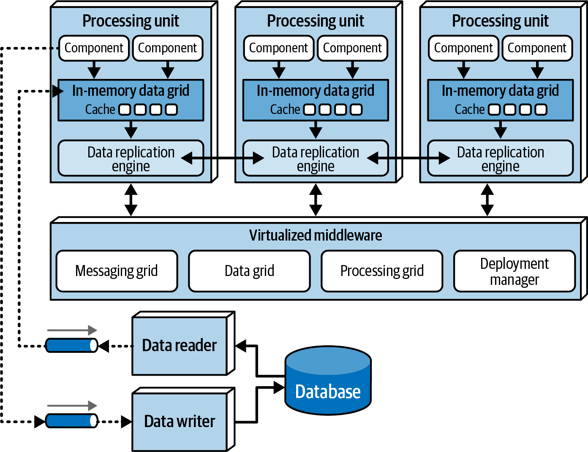

#### 1. Processing Units
These contain the actual application functionality and business logic.

#### 2. Virtualized Middleware
A collection of infrastructure components that coordinate the processing units. This middleware includes:
*   **Messaging Grid:** Manages incoming requests and session state.
*   **Data Grid:** The most critical component; it manages the synchronization and replication of data between processing units.
*   **Processing Grid:** Orchestrates requests between multiple processing units when a transaction requires coordination.
*   **Deployment Manager:** Dynamically scales processing unit instances up or down based on real-time load.

#### 3. Data Infrastructure
*   **Data Pumps:** Asynchronously send updated data from the processing units to the database (usually via persistent messaging queues).
*   **Data Writers:** Components that receive data from the pumps and perform the actual database updates.
*   **Data Readers:** Components that read data from the database and deliver it to processing units during startup (to "warm" the in-memory space).

---

## Style Specifics
The following sections describe the primary artifacts of space-based architecture and how they function in detail.

### Processing Unit
The **Processing Unit** (Figure 16-3) is the heart of the system, containing the application logic. This can include web-based components, backend business logic, or even small, single-purpose services similar to microservices. 

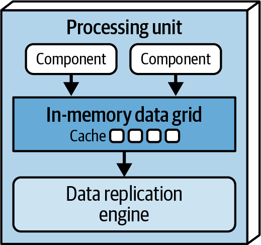

Crucially, each processing unit also contains a local **in-memory data grid** and a **replication engine** (typically implemented with products like Hazelcast, Apache Ignite, or Oracle Coherence). This allows every instance of the application to have local, high-speed access to the data it needs without hitting a database.

### Virtualized Middleware
The **Virtualized Middleware** (Figure 16-4) is the infrastructure layer that manages and coordinates the processing units. Because no single product performs all these functions, this layer is usually a composite of third-party tools like load balancers, caching engines, and service orchestrators.

At a minimum, it includes:
*   **Messaging Grid:** For request routing and session management.
*   **Data Grid:** For cross-unit data synchronization.
*   **Deployment Manager:** For elastic scaling.

It can also include optional components like a **Processing Grid** (for transaction orchestration) or custom modules for security and observability.

### Messaging Grid
The **Messaging Grid** is the entry point for user requests. When a request arrives, this component determines which processing units are active and available, then forwards the request accordingly.

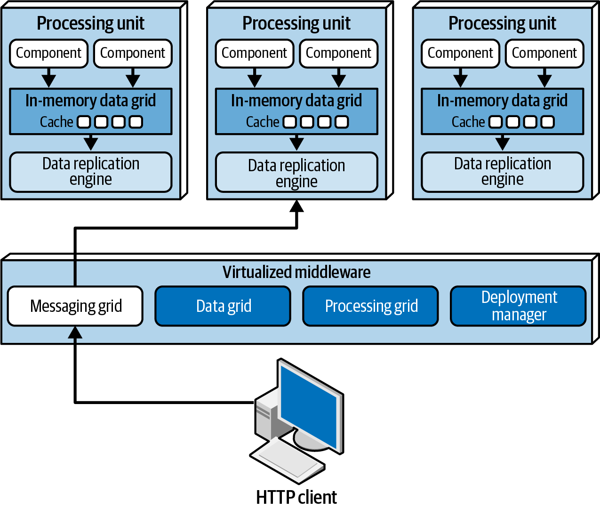

Algorithms range from simple **Round-Robin** to complex **Next-Available** logic that tracks real-time processing unit load. This grid is typically implemented using powerful web servers or load balancers like Nginx or HAProxy.

### Data Grid
The **Data Grid** is the most critical component of the virtualized middleware. In modern implementations, it often resides solely within the processing units as an in-memory replicated cache. 

Because the messaging grid can route a request to *any* available processing unit, it is vital that every unit's local cache contains the exact same data.

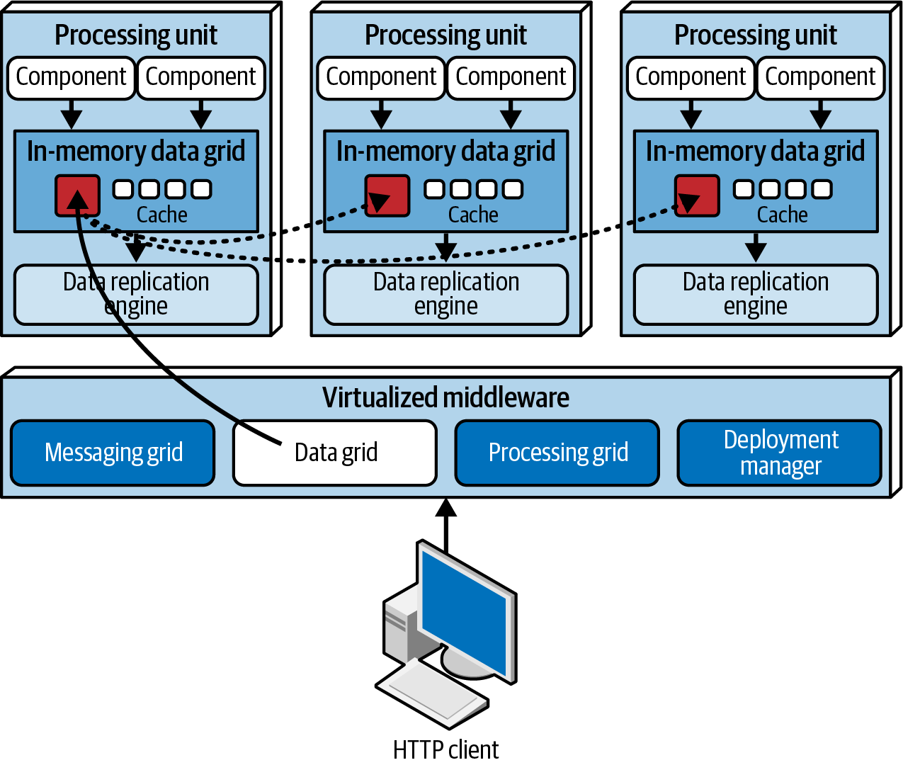

#### Replication Logic
As shown in Figure 16-5, data replication occurs asynchronously between processing units, typically completing in under 100ms. Synchronization happens between units that share a named cache. For example, using Hazelcast in Java:

```java
HazelcastInstance hz = Hazelcast.newHazelcastInstance();
Map<String, CustomerProfile> profileCache = 
    hz.getReplicatedMap("CustomerProfile");
```

When any instance updates this `CustomerProfile` cache, the data grid engine automatically pushes that update to every other instance holding the same named cache.

#### Joining the Space
When a new processing unit instance starts, it doesn't need to read from the database (provided at least one other instance is already running). Instead:
1.  It broadcasts a request to join the named cache.
2.  Existing members acknowledge and connect to the new unit.
3.  One of the existing members sends the current cache data to the new instance, bringing it into sync.

#### Member Management
Each instance maintains a **Member List** of the IP addresses and ports of its peers. 

````carousel
```text
Instance 1:
Members {size:1, ver:1} [
    Member [172.19.248.89]:5701 - 04a6f863... this
]
```
<!-- slide -->
```text
Instance 1:
Members {size:2, ver:2} [
    Member [172.19.248.89]:5701 - 04a6f863... this
    Member [172.19.248.90]:5702 - ea9e4dd5...
]

Instance 2:
Members {size:2, ver:2} [
    Member [172.19.248.89]:5701 - 04a6f863...
    Member [172.19.248.90]:5702 - ea9e4dd5... this
]
```
<!-- slide -->
```text
Instance 1 (after Instance 2 goes down):
Members {size:1, ver:3} [
    Member [172.19.248.89]:5701 - 04a6f863... this
]
```
````

When an update occurs (e.g., `cache.put()`), the data grid ensures all members in the current list are updated asynchronously. If an instance crashes, the caching product immediately detects the failure and updates the member lists of all remaining units to reflect the change.

---

## Replicated vs. Distributed Caching
Space-Based Architecture relies on caching to bypass the database bottleneck. While **replicated caching** is the standard, **distributed caching** is an important alternative for specific use cases.

### 1. Replicated Caching
In this model, each processing unit contains its own synchronized in-memory data grid.

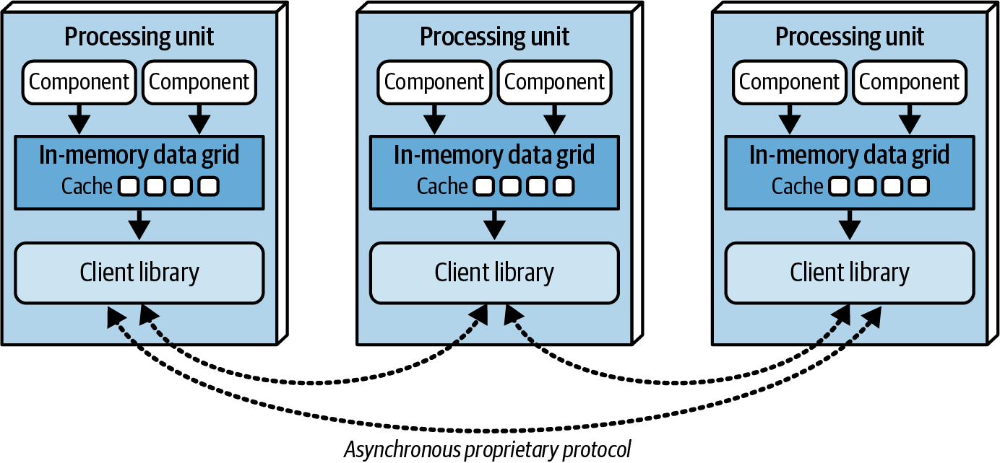

*   **Pros:** Extreme performance (local access) and high fault tolerance (no single point of failure).
*   **Cons:** Limited by memory capacity (usually <100 MB per unit) and high update frequencies that can overwhelm the replication engine.

### 2. Distributed Caching
This model uses an external server or service to hold a centralized cache. Processing units access it via a proprietary protocol.

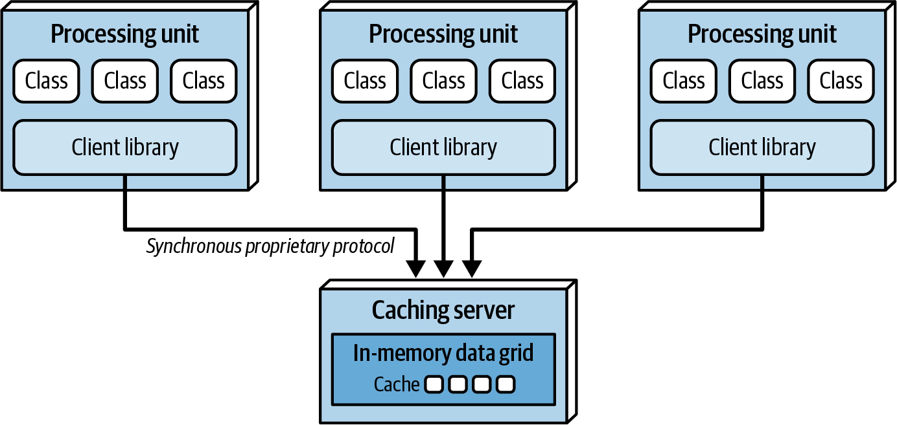

*   **Pros:** High data consistency (one source of truth) and supports massive data volumes (>500 MB).
*   **Cons:** Lower performance (remote network latency) and lower fault tolerance (the central cache server is a potential single point of failure).

### The Decision Matrix
The choice between these models boils down to prioritizing **Performance** versus **Consistency**.

**Table 16-1: Distributed vs. Replicated Caching**

| Decision Criteria | Replicated Cache | Distributed Cache |
| :--- | :--- | :--- |
| **Optimization** | Performance | Consistency |
| **Cache Size** | Small (< 100 MB) | Large (> 500 MB) |
| **Type of Data** | Relatively Static | Highly Dynamic |
| **Update Frequency** | Relatively Low | High Update Rate |
| **Fault Tolerance** | High | Low |

#### A Hybrid Approach
Most space-based systems are not all-or-nothing. Different processing units can use different models. For example, use a **Distributed Cache** for inventory counts (where consistency is vital) but use a **Replicated Cache** for customer profiles or product descriptions (where performance and availability are more important).

---

## Near-Cache Considerations
A **Near-Cache** is a hybrid model that attempts to bridge the gap between in-memory data grids and a distributed cache.

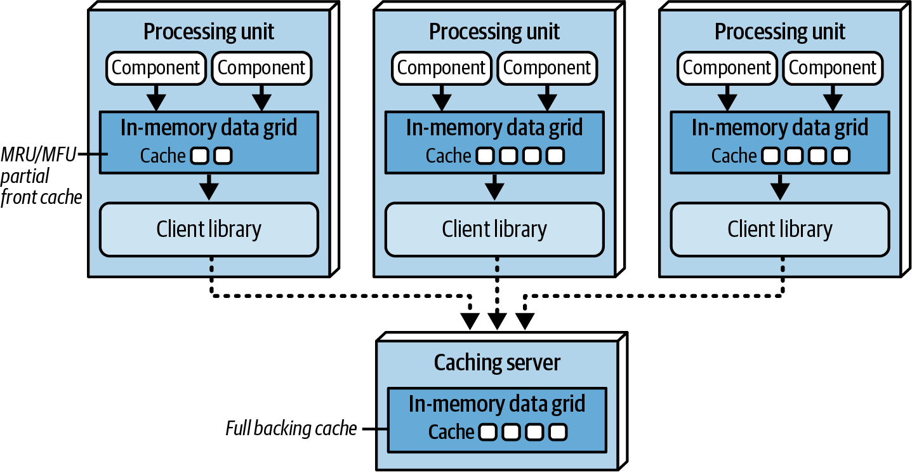

In this model (Figure 16-8):
*   **Full Backing Cache:** A centralized distributed cache holding all data.
*   **Front Cache:** A smaller subset of data kept in the processing unit's local memory.

As the front cache fills up, it uses an **Eviction Policy** to make room for new items. Common policies include:
1.  **MRU (Most Recently Used):** Keeps the latest items accessed.
2.  **MFU (Most Frequently Used):** Keeps the items accessed most often.
3.  **Random Replacement:** Removes items randomly when space is needed (useful when no clear access pattern exists).

### The Verdict
While the front caches stay in sync with the central backing cache, they are **not synchronized with each other**. This means two processing units handling the same domain may have completely different data subsets in their local memory. 

This inconsistency leads to unpredictable performance and responsiveness across the system. Consequently, **near-caching is generally not recommended** for space-based architectures.

---

## Processing Grid
The **Processing Grid** is an optional component of the virtualized middleware used to manage **orchestration** when a single business request involves multiple processing units.

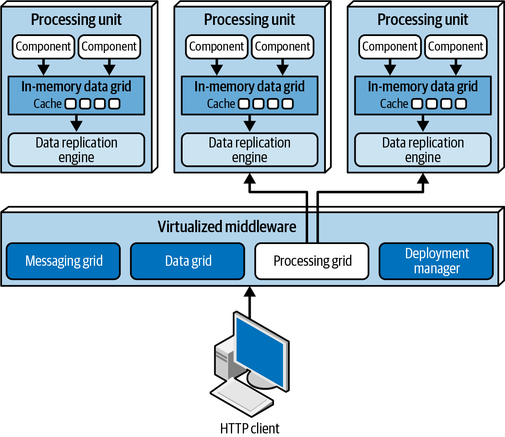

As shown in Figure 16-9, if a business transaction requires coordination between an `Order Placement` unit and a `Payment` unit, the processing grid mediates that flow. 

### Modern Orchestration
Rather than using a single, heavy orchestration engine, most modern space-based systems implement this functionality through **Fine-Grained Orchestration Processing Units**. 

In this model, you might have:
*   **Order Placement Orchestrator:** Manages the flow between Placement, Payment, and Inventory Adjustment units.
*   **Returns Orchestrator:** Manages the specific workflow for processing customer returns.
*   **Restock Orchestrator:** Coordinates the replenishment of inventory.

By using specialized orchestrator units, the architecture remains agile and follows the same scaling principles as the rest of the processing units.

---

## Deployment Manager
The **Deployment Manager** is the component responsible for the system's **elasticity**. It continuously monitors real-time metrics—like response times and concurrent user counts—and dynamically starts or shuts down processing unit instances to match the current load. 

While this was historically a custom infrastructure piece, it is now almost universally handled by cloud providers or container orchestration platforms like **Kubernetes**.

---

## Data Pumps
Because processing units operate entirely in memory and do not write directly to a database, they require a mechanism to eventually persist their changes. This is the role of the **Data Pump**.

Data pumps are **always asynchronous**, ensuring that the high-speed application logic is never blocked by slow database I/O. This results in **eventual consistency** between the in-memory space and the persistent store.

### Implementation through Messaging
Data pumps are typically implemented using a messaging system (Figure 16-10).

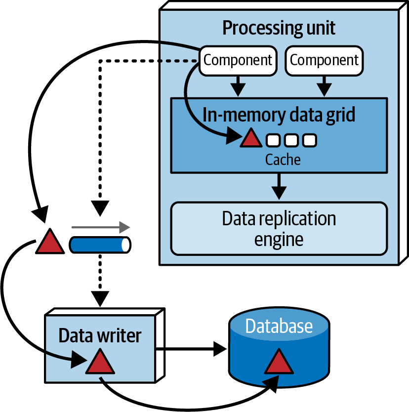

Using a messaging broker (like RabbitMQ or Kafka) provides several critical benefits:
*   **Guaranteed Delivery:** If the database or data writer is down, messages stay queued.
*   **FIFO Ordering:** Ensures that updates are applied to the database in the exact order they occurred in memory.
*   **Decoupling:** The processing unit finishes its work and hands the update to the pump, which completes the database write independently.

### Data Contracts
Data pumps utilize contracts to describe the requested change. These messages usually contain:
1.  **An Action:** Add, Delete, or Update.
2.  **The Payload:** For updates, architects often send only the "delta"—the specific field that changed (plus an ID)—to minimize bandwidth and processing overhead.

Most large-scale systems employ multiple data pumps, each dedicated to a specific domain (e.g., a Customer Data Pump, an Inventory Data Pump) to ensure that the persistence layer can scale alongside the application layer.

---

## Data Writers
The **Data Writer** is the component that executes the actual database updates. It listens to the data pumps, parses the message payloads, and performs the necessary SQL operations (or NoSQL writes) to the persistent store.

There are two primary models for data writer granularity:

### 1. Domain-Based Data Writer
A single Data Writer handles all updates for a particular domain, even if there are multiple specialized data pumps feeding into it.

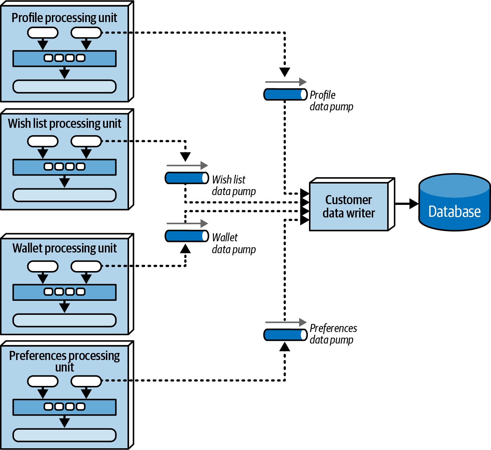

As shown in Figure 16-11, you might have four separate processing units and pumps (for Profile, Wishlist, Wallet, and Preferences), but only one **Customer Data Writer**. This writer contains all the logic necessary to update any customer-related table in the database.

### 2. Dedicated Data Writer
In this model, every single Data Pump has its own corresponding Data Writer.

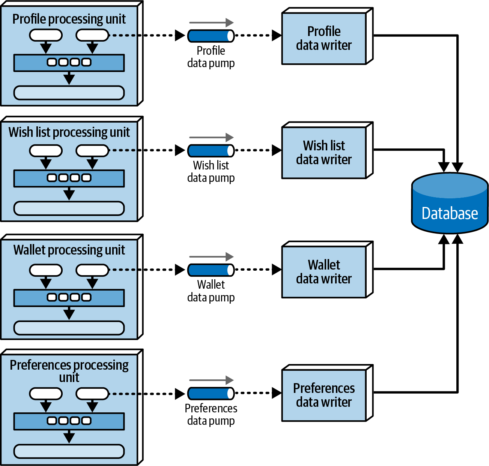

While this approach results in a larger number of components (Figure 16-12), it provides the highest levels of **scalability and agility**. By perfectly aligning the processing unit, data pump, and data writer, teams can iterate on and scale specific sub-functions (like the "Wallet" service) without impacting any other part of the system.

---

## Data Readers
While Data Writers handle the flow from memory to disk, **Data Readers** handle the reverse: reading data from the database and delivering it to processing units via a **Reverse Data Pump**.

In a healthy space-based system, Data Readers are rarely used. They are invoked only during:
1.  **System-Wide Recovery:** When all instances of a specific named cache have crashed.
2.  **Redeployments:** When every instance of a cache is taken down for an update.
3.  **Archive Retrieval:** When a request needs historical data not currently stored in the high-speed replicated cache.

### The Bootstrapping Process
If a cache needs to be reloaded from the database, the system follows a strict locking protocol to prevent duplicate reads.

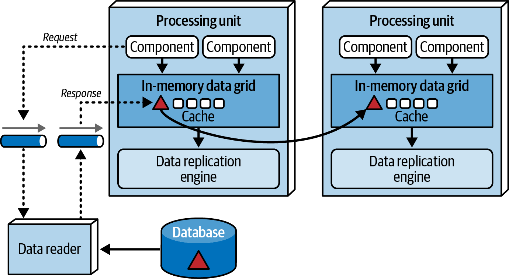

1.  **Locking:** The first processing unit instance to start attempts to grab a lock on the cache. If successful, it becomes the **Temporary Cache Owner**.
2.  **Request:** The owner sends a read request to a dedicated queue.
3.  **Query:** The Data Reader accepts the request, queries the database, and sends the result back through the **Reverse Data Pump**.
4.  **Sync:** Once the temporary owner loads its local cache, it releases the lock. All other starting instances then synchronize their data from the owner, and normal processing begins. (Figure 16-13).

### Data Abstraction vs. Data Access
The collection of Data Readers and Writers forms a **Data Abstraction Layer**. 

In most space-based architectures, the schema inside the processing unit's memory is intentionally different from the schema in the relational database. The Data Readers and Writers contain the **Transformation Logic** necessary to map between these two worlds. 

This decoupling is a major advantage: it allows architects to change the database structure (dropping columns, changing types) without immediately breaking the processing units. The readers and writers act as a buffer, translating data until the application logic can be updated.

---

## Data Topologies
Because the transactional logic is isolated from the physical database, space-based architecture is remarkably flexible regarding its **Data Topology**. 

The choice of database structure is usually driven by how the *backing* data will be used rather than how the *application* uses it:
*   **Monolithic Database Topology:** Ideal for traditional reporting, heavy data analytics, or integration with downstream legacy systems. However, a single database can become a synchronization bottleneck.
*   **Domain-Based Database Topology:** Better for overall synchronization throughput and data consistency, provided the data can be cleanly partitioned by domain. This is often paired with a **Data Mesh** for analytics.

## Cloud Considerations
The elastic nature of space-based architecture makes it a perfect candidate for cloud environments. However, it offers a unique capability not found in other styles: the **Hybrid Cloud Topology**.

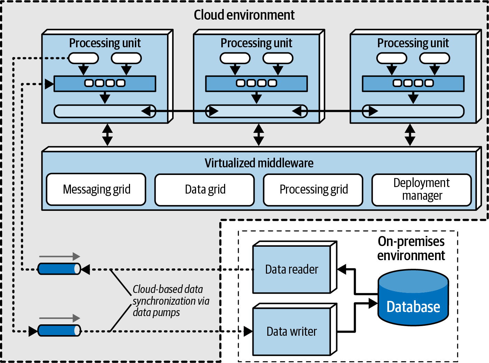

In this model (Figure 16-14):
1.  **Cloud:** The Processing Units and Virtualized Middleware live in a highly elastic cloud environment to handle dynamic user loads.
2.  **On-Prem:** The physical database and Data Writers/Readers live in a secure, on-premises data center.

This is made possible by the **asynchronous data pumps**. Because the application logic doesn't wait for the database to respond, it can operate at full speed in the cloud while data is lazily synced back to the secure on-prem facility. This is an ideal solution for organizations that want cloud scalability but have strict regulatory or security requirements for their physical data.

---

## Common Risks
Most risks in space-based architecture center on **Data Integrity**, resulting from the heavy use of caching and asynchronous synchronization.

### 1. Frequent Reads from the Database
The "superpowers" of this style come from keeping all transactional data in memory. If a system is forced to perform frequent database reads—either because the cache size is too small (forcing constant archive retrieval) or because processing units are cold-starting too often—the performance and scalability benefits will vanish.

### 2. Data Synchronization and Consistency
Because synchronization is asynchronous, the database is only **eventually consistent**. 
*   **Bottlenecks:** In high-concurrency situations, the **Data Pump** can become a massive bottleneck, causing significant delays between an in-memory update and its persistence in the database. 
*   **Downstream Impact:** This is a major risk if other external systems rely on the database for real-time information.

### 3. Data Loss in the Data Pump
As with any asynchronous messaging system, there is a risk of losing data if a broker or writer fails. 
*   **Mitigation:** This is managed through **Persistent Queues** (saving messages to disk) and **Client-Acknowledgment Mode** (where the writer doesn't "check off" a message until it is safely in the database).
*   **The Trade-Off:** While these mitigations prevent data loss, they introduce latency and can slow down the overall responsiveness of the system.

### 4. High Data Volumes
Since every processing unit instance replicates the entire transactional cache, high data volumes are dangerous. If the cache grows too large, processing units will run out of memory and crash. Architects must carefully prune and archive data to keep the in-memory "space" lean and fast.

---

## Data Collisions
A **Data Collision** occurs when two processing units (A and B) update the same piece of data at the same time. Because replication is asynchronous, Instance B may update a record before it receives the update from Instance A.

### The Inventory Collision Example
Consider an inventory count of 500 widgets.
1.  **Instance A** sells 10 widgets and updates its local cache to **490**.
2.  **Instance B** (unaware of A's update) sells 5 widgets and updates its local cache to **495**.
3.  **Replication Triggers:** Instance B receives A's update and overrides its value to **490**. Instance A receives B's update and overrides its value to **495**.
4.  **Result:** Both caches are inconsistent and incorrect. The true count should be **485**.

### Calculating Collision Probability
Architects can determine the feasibility of replicated caching by calculating the probability of collisions using this formula:

$$Collision Rate = \frac{N \times (UR)^2}{S }\times RL$$

*   **N:** Number of service instances.
*   **UR:** Update rate (updates per millisecond).
*   **S:** Cache size (number of rows).
*   **RL:** Replication latency (in milliseconds).

### Impact Factors
The following tables illustrate how different variables impact the hourly collision rate (assuming a baseline of 72,000 updates/hour).

| Factor | Change | Collision Rate | % Probability |
| :--- | :--- | :--- | :--- |
| **Baseline** | N=5, RL=100ms, S=50k | 14.4 / hr | 0.02% |
| **Lower Latency** | **RL=1ms** | 0.1 / hr | 0.0002% |
| **Fewer Instances** | **N=2** | 5.8 / hr | 0.008% |
| **Smaller Cache** | **S=10k** | 72.0 / hr | 0.1% |

**Key Takeaways:**
*   **Latency (RL)** is the most sensitive variable; moving instances closer together physically or using faster networks yields the biggest gains.
*   **Cache Size (S)** is inversely proportional; a smaller, more focused cache actually *increases* the risk of collisions because you are more likely to hit the same row twice in a short window.
*   **Peak Load:** Always calculate these rates for peak bursts, not just daily averages.

---

## Governance
Space-based architecture is a complex beast. Without strict governance, the system can quickly fall apart due to memory exhaustion or extreme data desynchronization. We recommend implementing **Continuous Fitness Functions** to monitor the system's health.

### 1. Memory Consumption
Because every instance replicates the entire cache, memory is the system's most precious resource. 

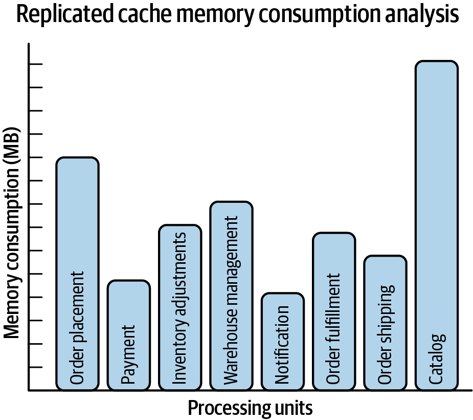

Architects should implement a fitness function that makes memory usage observable for every instance. By tracking the number of instances and the memory usage per instance (Figure 16-15), you can calculate the total memory footprint of a specific processing unit and detect "memory leaks" or cache bloat before they cause a crash.

### 2. Synchronization Time
How long does it take for an update in memory to reach the persistent database? 

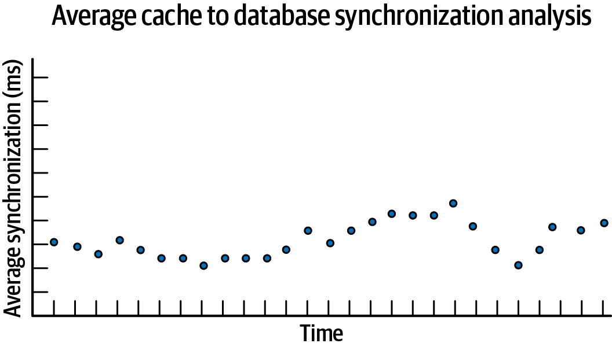

A high-fidelity fitness function (Figure 16-16) should:
1.  Stream a **Request ID** and timestamp from the processing unit during the cache update.
2.  Stream the same Request ID and timestamp from the data writer after the database commit.
3.  Calculate the delta to track the system's overall synchronization lag.

### 3. Data-Pump Bottlenecks
Data pumps are the narrowest part of the space-based pipeline. If they become clogged, synchronization time spikes, and the risk of data loss increases.

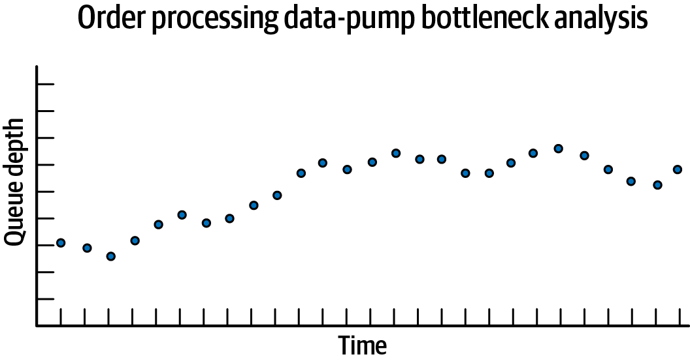

We recommend monitoring **Queue Depth** (Figure 16-17). A growing queue is a leading indicator that the database or data writers cannot keep up with the processing units, signaling a need for architectural adjustment.

### 4. Other Vital Signs
Finally, governance should also track:
*   **Database Read Frequency:** High read rates indicate that the cache is too small or the system is cold-starting too often.
*   **Core Characteristics:** Continually measure and report on **Scalability**, **Elasticity**, and **Responsiveness**—the very reasons the architecture was chosen.

---

## Team Topology Considerations
Space-Based Architecture is heavily **technically partitioned**. While it can work with domain-based teams, it is often most effective when aligned with its technical artifacts.

### 1. Stream-Aligned Teams
These teams may struggle with space-based systems because a single business requirement often impacts a wide range of technically diverse artifacts (Processing Units, Data Pumps, Writers, Cache Contracts, and the DB). For large, complex systems, this "cognitive load" can become overwhelming for a single stream-aligned team.

### 2. Enabling Teams
Since many artifacts (like Virtualized Middleware and Data Pumps) are shared across the entire architecture, this style is a perfect fit for **Enabling Teams**. These specialists can focus on optimizing the technical efficiency of the "space" without needing to understand the specific business logic inside every processing unit.

### 3. Complicated-Subsystem Teams
Components like the **Data Grid** or the collision-detection logic in **Data Writers** are extremely complex. These are ideal candidates for a **Complicated-Subsystem Team**. This allows domain teams to focus on functionality while the specialists handle the intricacies of asynchronous data synchronization and consistency.

### 4. Platform Teams
The infrastructure-heavy nature of space-based architecture (Load Balancers, Messaging Grids, Service Orchestrators) lends itself perfectly to a **Platform Team** model. This team provides the reliable foundation upon which the processing units are deployed and scaled.

---

## Style Characteristics
Space-Based Architecture is the "Formula 1" of architectural styles—built for extreme performance and speed, but highly complex and expensive to maintain.

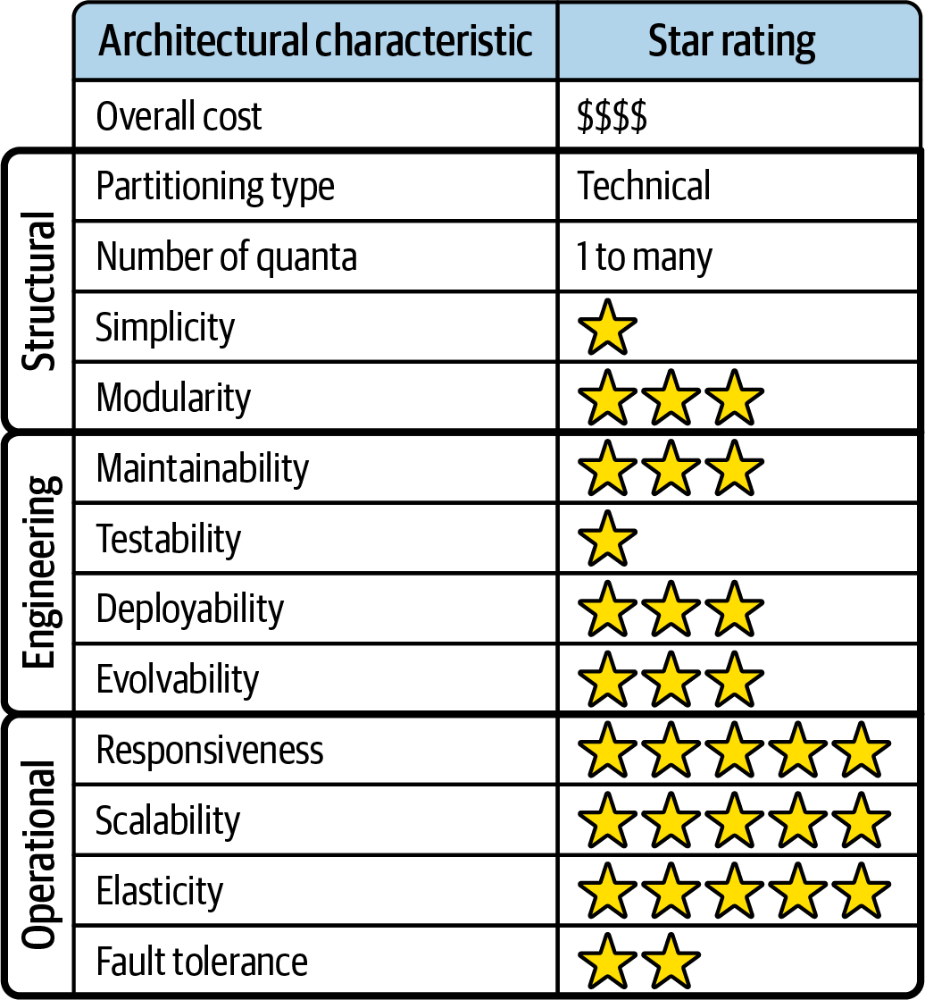

### The Five-Star Strengths
*   **Scalability & Elasticity:** By removing the database from the synchronous path, this style can scale to support millions of concurrent users.
*   **Performance:** In-memory access provides the lowest possible latency for transactional processing.

### The Trade-offs
*   **Simplicity:** This is a very complicated style with many moving parts (pumps, grids, readers, writers).
*   **Testability:** It is extremely difficult to simulate 100,000+ concurrent users in a test environment. Consequently, much of the high-volume testing is forced into production, which is a high-risk activity.
*   **Cost:** Licensing for data grid products and the heavy resource requirements (RAM) in the cloud make this one of the most expensive styles to operate.

### Architectural Quanta
Unlike most other styles, the **database is not part of the architectural quantum** in a space-based system. Because units do not communicate synchronously with the database, the quantum is instead delineated by the associations between the UIs and the processing units. 

---

## Examples and Use Cases
Space-based architecture is ideally suited for applications with throughput exceeding 10,000 concurrent users or those with massive, unpredictable spikes.

### 1. Concert Ticketing Systems
Popular concerts generate massive spikes in a matter of seconds. A central database cannot handle the lock contention and high-frequency updates required to process thousands of simultaneous "Buy Ticket" requests. Space-based architecture allows the system to spin up hundreds of units minutes before the sale, handling the burst in-memory and syncing the seat counts lazily.

### 2. Online Auction Systems
In an auction, bidding is an event that must be processed instantly. Space-based architecture allows for a dedicated processing unit per active auction, ensuring zero-latency bidding while background pumps handle the bid history and audit logs.

## Conclusion
Space-Based Architecture is a **specialized style**. It is the only architecture that maximizes the "Holy Trinity" of **Scalability, Elasticity, and Responsiveness**. While its complexity is daunting, it is the only viable choice for systems that must survive extreme, real-time concurrency.

---
