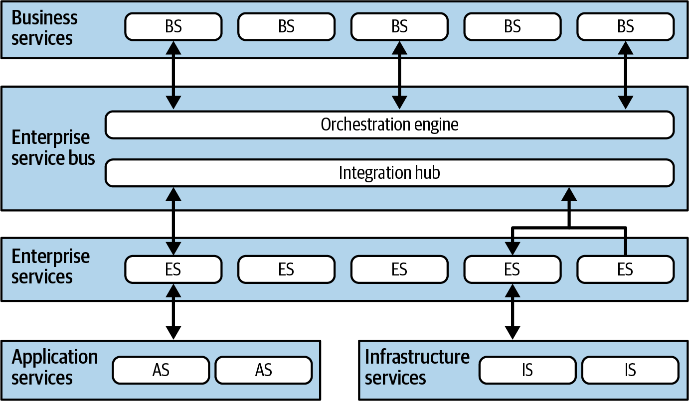
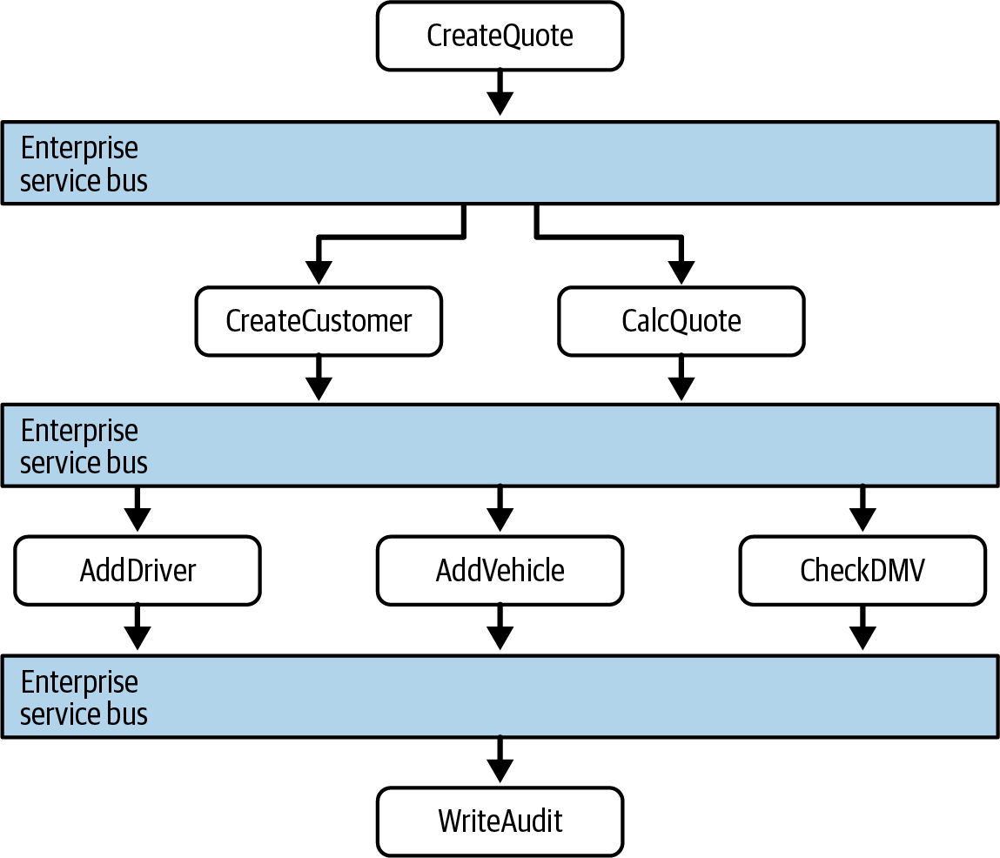
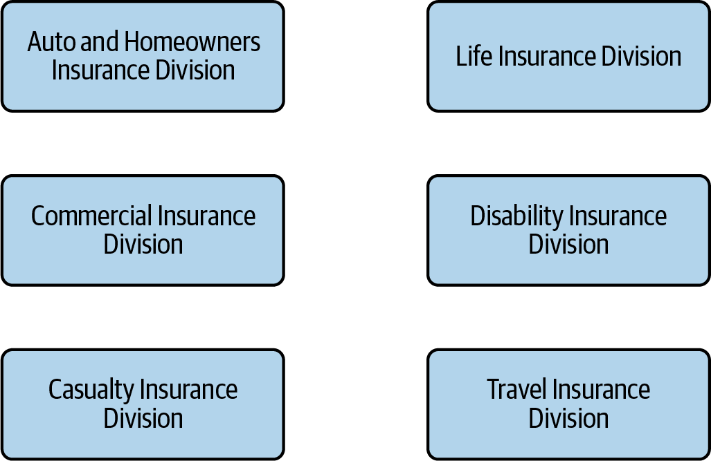
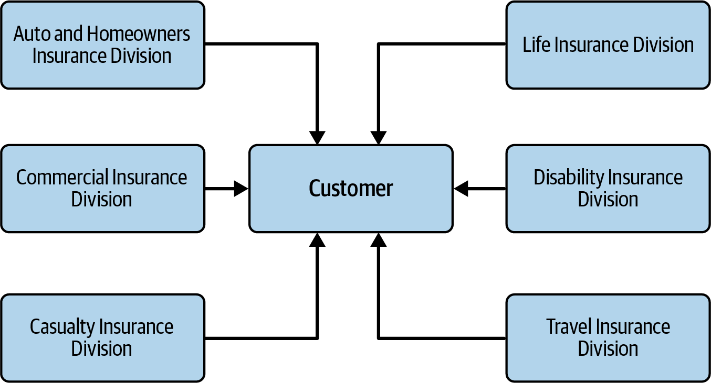
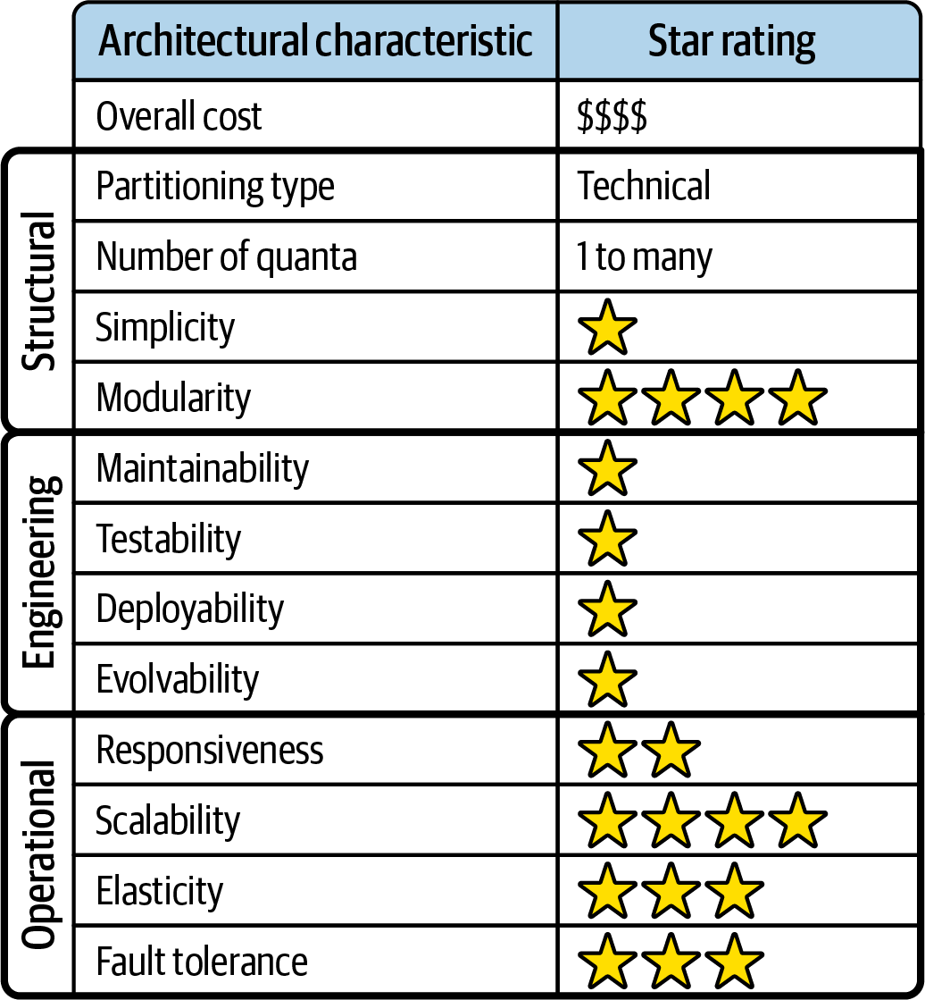
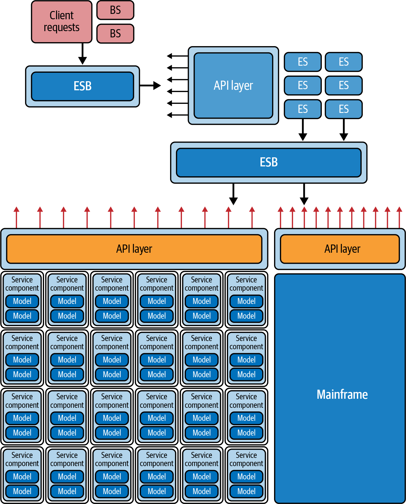

# Chapter 17. Orchestration-Driven Service-Oriented Architecture

Architecture styles often lose relevance as the eras that birthed them pass. **Orchestration-driven Service-Oriented Architecture (SOA)** is a prime example. While it was once the dominant enterprise philosophy, it eventually succumbed to its own complexity and the disastrous consequences of over-prioritizing reuse. However, it remains a critical case study in the dangers of ignoring the **First Law of Software Architecture**: everything is a trade-off.

---

## Topology
The hallmark of orchestration-driven SOA is a strict **taxonomy of services**, each with a well-defined technical responsibility. 



As a distributed architecture, SOA partitions functionality into distinct layers (Figure 17-1). The exact boundaries often vary by organization, but the core idea remains: a hierarchical structure where high-level business processes orchestrate lower-level technical services.

---

## Style Specifics
While largely of historical interest today, the lessons of SOA continue to influence modern integration patterns.

### Historical Context: The Era of Reuse
SOA emerged in the late 1990s during a period of massive corporate growth and frequent mergers. At the time:
*   **Resources were scarce:** Commercial operating systems and databases were prohibitively expensive and licensed per machine.
*   **System sprawl:** Rapid growth led to massive inconsistencies in core business entities and redundant workflows across departments.

Architects responded with a philosophy of **Extreme Reuse**. By creating shared services for common entities (like "Customer" or "Product"), they aimed to eliminate duplication and maximize the value of their expensive computing resources.

### The Extremes of Technical Partitioning
This style represents the absolute limit of technical partitioning. By isolating every layer of the taxonomy, architects hoped to achieve perfect modularity. However, as we explore in later sections, this obsession with reuse and partitioning led to crippling levels of coupling.

> [!NOTE]
> **Why So Many Service Names?**
> The term "Service" has suffered from **semantic diffusion**. An *Entity Service* in SOA is fundamentally different from a *Service* in Microservices or *Service-Based Architecture*. Architects must always parse the context; in SOA, a service is a component within a specific technical taxonomy, not necessarily a standalone deployment unit.

---

## Service Taxonomy
SOA's driving philosophy is a hierarchical **taxonomy of services**, designed to maximize abstraction and reuse at the enterprise level. Each layer has a specific responsibility:

### 1. Business Services
These sit at the top and represent the entry points for business processes (e.g., `PlaceOrder`, `ExecuteTrade`).
*   **Litmus Test:** Can you answer "Yes" to "Are we in the business of X?"
*   **Abstraction:** These contain no code—only input/output definitions and schemas. They are defined by business analysts rather than developers.

### 2. Enterprise Services
These are the fine-grained, shared building blocks (e.g., `CreateCustomer`, `CalculateQuote`). 
*   **Goal:** Create perfectly encapsulated, atomic pieces of functionality that can be reused across any number of business services.
*   **The Reality:** While the theory of "reusable assets" sounds good, software lacks the stability of physical materials. Market shifts and changing engineering practices often defy these attempts at long-term stability.

### 3. Application Services
Not everything needs to be reusable. Application services are one-off implementations (e.g., a specific geolocation service for a single app) that solve a local problem without the overhead of enterprise-level governance.

### 4. Infrastructure Services
These handle technical, cross-cutting concerns like logging, monitoring, and authentication.

---

## The Orchestration Engine (ESB)
The **Orchestration Engine** (typically an Enterprise Service Bus or ESB) is the heart of the architecture. It stitches business and enterprise services together, managing:
*   **Transactional Coordination:** Defining where boundaries start and end across distributed calls.
*   **Message Transformation:** Mapping data formats between disparate systems.
*   **Integration:** Acting as a hub for legacy software and custom code.

### The Human Factor
Because the message bus is so central, the **Integration Architects** who manage it often become a major political force and, eventually, a bureaucratic bottleneck (a clear example of **Conway’s Law**).

---

## Message Flow
In orchestration-driven SOA, all requests—even internal calls between services—must pass through the orchestration engine.



As shown in Figure 17-2, a request to a `CreateQuote` business service triggers a workflow within the ESB. The bus then calls the necessary enterprise and application services to fulfill the request. The bus acts as the permanent intermediary, serving as both an integration hub and a transactional coordinator.

---

## Reuse… and Coupling
The central ambition of SOA was to achieve high levels of service-level reuse. Architects were encouraged to find and extract shared business behavior as aggressively as possible.

### The Pursuit of the "Canonical" Service
Consider an insurance company with six different divisions, each with its own definition of a "Customer" (Figure 17-3). 



The "correct" SOA strategy was to extract these commonalities into a single, **Canonical Customer Service** (Figure 17-4) that all other services would reference.



### The Hidden Costs of Reuse
While the goal of reuse is laudable, it comes with a crippling trade-off: **Coupling**. 
1.  **The Ripple Effect:** Because every division points to the same Customer service, any change to that service impacts the entire organization. This necessitates coordinated deployments and holistic testing, drastically slowing down engineering velocity.
2.  **Entity Bloat:** To support all divisions, the shared service must include fields for *every* use case. The Disability Insurance team must deal with the complexity of "Driver's License" data (needed by Auto Insurance) even though they have no use for it. This complexity is why Domain-Driven Design (DDD) often recommends *avoiding* holistic reuse.

### The Technical Partitioning Nightmare
SOA represents the extreme of technical partitioning, which often leads to a practical nightmare for developers. Because business concepts are spread so thinly across multiple tiers, a simple task like "adding an address line to checkout" might require changes to:
*   Multiple Business Services.
*   Numerous Enterprise Services.
*   The Orchestration Engine (ESB).
*   The underlying Database Schema.

Furthermore, if the existing enterprise services don't match the required **Transactional Granularity**, developers are often forced to create duplicate "copycat" services to avoid breaking existing workflows—the ultimate failure of the reuse philosophy.

---

## Data Topologies
The data topologies for orchestration-driven SOA are relatively straightforward. Given its historical origins, most implementations relied on a single (or a small handful) of monolithic **Relational Databases**.

In this era, architects treated data primarily as "plumbing" or an integration point. Interestingly, transactionality was often moved *out* of the database and into the architecture. The message bus (ESB) frequently used declarative configurations to determine the transactional behavior of entities, allowing architects to define scopes independently of the underlying data store.

> [!NOTE]
> **Really? Declarative Transactions?**
> Yes. One of the major "features" of early SOA application servers was the ability to define transactional scope in XML. By using **EntityBeans**, configuration managers could change an entity's participation in a workflow's transaction at runtime. 
>
> This approach largely failed for two reasons:
> 1.  **Indeterminacy:** If a developer doesn't know an entity's transactional behavior until runtime, it creates massive complexity and often forces the creation of nearly identical "copycat" entities to support different scopes.
> 2.  **Leaky Abstractions:** No matter how sophisticated the ESB, distributed systems have myriad failure modes that abstractions cannot cleanly hide. When transactions failed partially, it often created "tangled messes" of inconsistent data that required human intervention to fix.

---

## Cloud Considerations
Orchestration-driven SOA predates the cloud by decades. In its original incarnation, there was no consideration for cloud-native deployment. 

However, in modern systems, this style remains a relevant **Integration Architecture**. It is often used to bridge the gap between legacy on-premises systems and modern cloud-based services, allowing them to participate in unified workflows.

---

## Common Risks
Historically, the risks of SOA were related to astronomical costs and multi-year implementation timelines. Today, the primary risk is the **Accidental SOA Antipattern**.

> [!WARNING]
> **The Accidental SOA Antipattern**
> This occurs when an architect strategically introduces an ESB for a simple integration task but allows it to gradually encapsulate more and more of the system's logic. Without clear encapsulation boundaries, you can unintentionally build a full-blown orchestration-driven SOA, inheriting all its complexity and coupling issues without the original intent.

---

## Governance
In the heyday of SOA, "governance" was a manual, heavyweight process involving committees, formal code reviews, and bulky frameworks. Automating architectural governance was non-existent.

### Modern Governance through Fitness Functions
Today, architects use **Fitness Functions** to prevent data or bounded contexts from "leaking" across integration points. This is especially useful when an ESB sits between legacy systems (like an ERP) and modern microservices.

**Example Fitness Function (Pseudocode):**
```text
READ logs for ERP into ERP-logs for past 24 hours
READ logs for Sales into Sales-logs for past 24 hours

FOREACH entry IN ERP-logs
    IF 'operation' is 'update' and 'target' != 'accounting' THEN
       raise fitness function violation "Invalid update between integration points"
    END IF

FOREACH entry IN Sales-logs
    IF 'operation' is 'update' and 'target' != 'accounting' THEN
       raise fitness function violation "Invalid update between integration points"
    END IF    
```
By monitoring logs, this function ensures that legacy systems (ERP/Sales) only perform updates against the authorized target (Accounting), preventing unauthorized "cross-talk" that would violate the system's integrity.

---

## Team Topology Considerations
The strict taxonomy of SOA actually served as a **communication antipattern** that eventually led to the development of modern team topology principles. 

In this style, the extreme separation of technical responsibilities (Business vs. Enterprise vs. Infrastructure) resulted in an equally extreme separation of teams. Collaboration was actively discouraged; developers were expected to communicate solely through technical artifacts like contracts, interfaces, and enterprise ticketing tools. This lack of human interaction is a primary reason why building features in an SOA environment is notoriously time-consuming.

---

## Style Characteristics
SOA represents perhaps the most extreme example of technical partitioning ever attempted in software architecture. The backlash against its rigidity is what eventually paved the way for Microservices.



### The Single Quantum Trap
Despite being a distributed architecture, SOA usually possesses only a **single architectural quantum**. This is due to two major coupling points:
1.  **Shared Databases:** Most implementations rely on one or a few central relational databases.
2.  **The ESB:** The orchestration engine acts as a "giant coupling point." No part of the system can have different characteristics than the mediator that orchestrates it.

### Scorecard Analysis
*   **Deployability & Testability (1 Star):** These were never priorities during SOA's development. Deploying a change requires coordinating across many siloed teams and technical layers.
*   **Elasticity & Scalability (Moderate):** While difficult to implement, vendors poured billions into making these systems scale via complex session replication and load balancing.
*   **Performance (Low):** Splitting every business request across so many distributed hops inevitably degrades performance.
*   **Cost & Simplicity (Disastrous):** The sheer complexity of the moving parts makes SOA one of the most expensive and difficult styles to maintain.

## Conclusion
Orchestration-driven SOA was a critical milestone in architectural history. It taught the industry the practical limits of technical partitioning and the immense difficulty of managing distributed transactions in the real world. While mostly a legacy concern today, its lessons remain foundational for any architect working with distributed systems.

---

## Examples and Use Cases
SOA was the dominant strategy for large enterprises in the late 1990s and early 2000s. While it has largely been displaced by more agile, domain-based architectures like **Microservices**, its footprint remains in massive legacy ecosystems.

### The "Change" Nightmare
In a full-blown SOA, architects and developers dread the word "change." Because the architecture is so highly coupled and technically partitioned, a simple domain update (like changing an entity field) often requires coordinated changes across four or five different layers. The scope of work is highly variable and requires deep, cross-team analysis, making it a poor fit for modern market-driven development.

### Modern Integration Flexibility
Despite its flaws as a general-purpose style, the **layers of abstraction** in SOA provide incredible flexibility for integration scenarios (Figure 17-6).



As shown in Figure 17-6, the message bus acts as the grand orchestrator. It allows architects to implement enterprise services in a variety of ways:
*   **Bespoke Code:** Custom implementations for unique business logic.
*   **Package Software:** Integrating with massive ERP or CRM packages.
*   **Legacy Systems:** Wrapping old mainframes or databases as modern services.

This flexibility allowed organizations to handle massive integration challenges at scale within the constraints of their 1990s ecosystems.

## Final Summary
Orchestration-driven SOA represents a fascinating era where architects attempted to solve the problems of corporate sprawl and high resource costs through extreme technical partitioning and reuse. While the "strict taxonomy" experiment largely failed, the building blocks—like the **ESB**—remain essential tools for modern integration architects.

---
