# Chapter 18. Microservices Architecture

**Microservices** is an extremely popular architecture style that has redefined how architects think about decoupling and scalability. Unlike many other styles that were named long after their patterns emerged, microservices was named and codified early—most notably by Martin Fowler and James Lewis in their influential 2014 blog post.

---

## Core Philosophy: Share Nothing
Microservices is heavily inspired by **Domain-Driven Design (DDD)**, specifically the concept of the **Bounded Context**. 

In traditional architectures, the focus is on maximizing reuse. However, as the **First Law of Software Architecture** reminds us, everything is a trade-off. Achieving reuse requires increasing the system's coupling. 

In microservices, the primary goal is **Decoupling**. To achieve this, the architecture favors **Duplication over Reuse**. By physically modeling the bounded context—where a service and its data are completely isolated—architects ensure that no service is coupled to anything outside its own boundaries. This is why microservices is often called a "share nothing" architecture.

---

## Topology
The basic topology of microservices (Figure 18-1) is characterized by small, single-purpose services that run in their own processes (typically within containers or VMs).

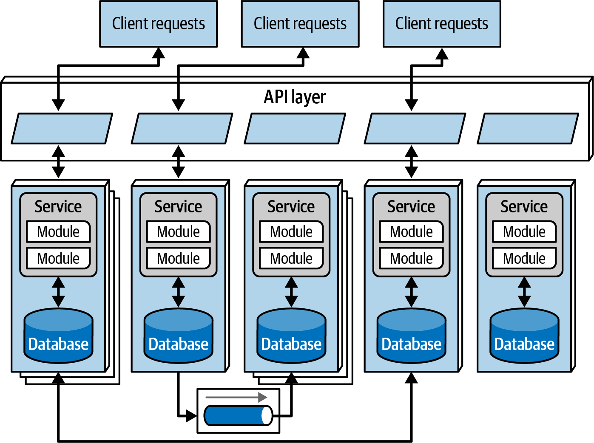

### Key Characteristics:
*   **Extreme Isolation:** Each service includes all the components necessary for it to operate independently, including its own private database.
*   **Operational Independence:** Services are separated at the process level, eliminating the "noisy neighbor" problems found in multitenant application servers where resources like memory or network bandwidth are shared.
*   **Distributed Nature:** This style was made practical by the evolution of cloud computing and automated container orchestration, which made it feasible for each domain to have its own dedicated infrastructure.

### The Trade-offs
The extreme decoupling of microservices comes with significant costs:
1.  **Performance:** Network calls are significantly slower than in-memory method calls. Furthermore, every endpoint requires security verification, adding processing overhead.
2.  **Complexity of Granularity:** Determining the correct size of a service is the single most critical factor for success.
3.  **Distributed Transactions:** Experienced architects strongly advise against using transactions across service boundaries, requiring the use of patterns like Sagas or eventual consistency.

---

## Style Specifics

### 1. Bounded Context Deep Dive
Microservices is the ultimate **domain-partitioned architecture**. It physically embodies the logical concepts of DDD.

In a monolithic system, developers often share common classes (like `Address`) to avoid duplication. In microservices, this sharing is viewed as a dangerous coupling point. Instead, architects use **duplication** to keep all code and data schemas strictly within the service's bounded context. If three services need an `Address` concept, they each implement it independently, tailored to their specific needs.

### 2. The Granularity Challenge
The term "microservice" is often misunderstood as a requirement to make services as small as possible. As Martin Fowler famously noted, "micro" is a label, not a description. 

Services that are too fine-grained create a "Big Ball of Distributed Mud," where the system spends more time communicating between services than doing actual work. The goal is to find boundaries that capture a cohesive **domain or workflow**.

#### Guidelines for Service Boundaries:
*   **Purpose:** Each service should provide one significant, functionally cohesive behavior.
*   **Transactions:** Since distributed transactions are difficult, entities that must cooperate within a single atomic transaction should usually reside in the same service.
*   **Choreography:** If two services are extremely "chatty" (requiring constant communication to fulfill a single request), they might be better off bundled into a single, larger service to reduce network overhead.

> [!TIP]
> **Iteration is Key.** Architects rarely get granularity right on the first try. Expect to iterate, split, and merge services as you learn more about the business domain and the system's operational characteristics.

---

### 3. Data Isolation
Driven by the bounded-context concept, microservices mandates strict **data isolation**. Sharing a database or even a schema as an integration point is forbidden, as it creates tight coupling that hinders independent deployment.

#### The Source of Truth Problem
Distributing data across the architecture means you no longer have a single, unified source of truth. Architects must decide between:
1.  **Direct Coordination:** Identifying one service as the owner of a fact and querying it as needed.
2.  **Distributed State:** Replicating or caching data across databases for performance.

#### The Opportunity: Polyglot Persistence
While isolation creates complexity, it also unlocks **Polyglot Persistence**. Because services are decoupled, each team is free to choose the database technology that best suits their specific needs—whether it's a relational database, a document store, a graph database, or a simple key-value cache.

---

### 4. The API Layer (API Gateway)
Most microservices architectures feature an **API Gateway** between external consumers and the internal mesh of services.

#### Role and Responsibility:
The gateway should handle **cross-cutting concerns** and **routing** only:
*   **Security:** Authentication and authorization.
*   **Monitoring & Logging:** Centralized observability for incoming traffic.
*   **Naming Services:** Service discovery and request routing.

> [!IMPORTANT]
> **Avoid Orchestration.** To stay true to the domain-partitioned nature of microservices, the API layer must remain "dumb." All business logic and orchestration should reside inside the bounded contexts of the services. Putting business logic in the gateway turns it into a mediator, creating a centralized bottleneck similar to the ESB in SOA.

---

## Operational Reuse
While microservices favors duplication for domain logic, it recognizes that **Operational Concerns** (logging, monitoring, circuit breakers) benefit from a level of consistent coupling. 

### 1. The Sidecar Pattern
The **Sidecar Pattern** (Figure 18-2) allows operational features to be separated from the business logic. 

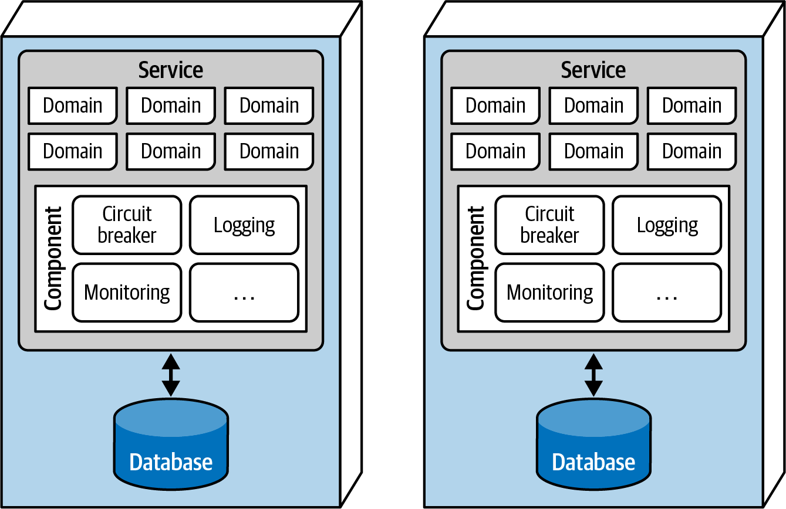

A sidecar is a separate component that runs alongside each service. This allows a specialized **Infrastructure Team** to manage and upgrade operational tools (like a logging agent or monitoring probe) across the entire system without requiring every domain team to update their service code.

### 2. Service Mesh and Service Plane
When sidecars are used across the architecture, they can be connected to form a **Service Mesh**.

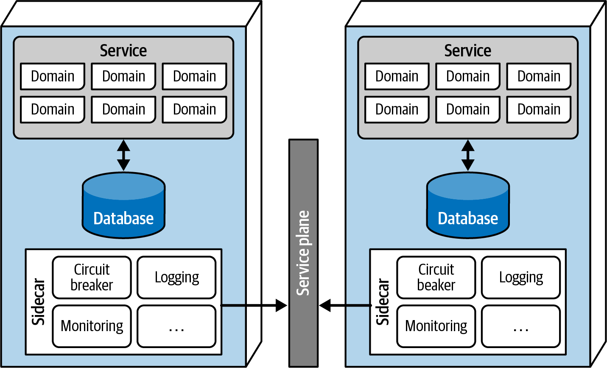

The **Service Plane** (Figure 18-3), managed by tools like Istio or Linkerd, provides a consistent operational interface. This mesh (Figure 18-4) acts as a centralized console for architects and operations teams to globally control logging levels, security policies, and traffic routing across every node in the system.

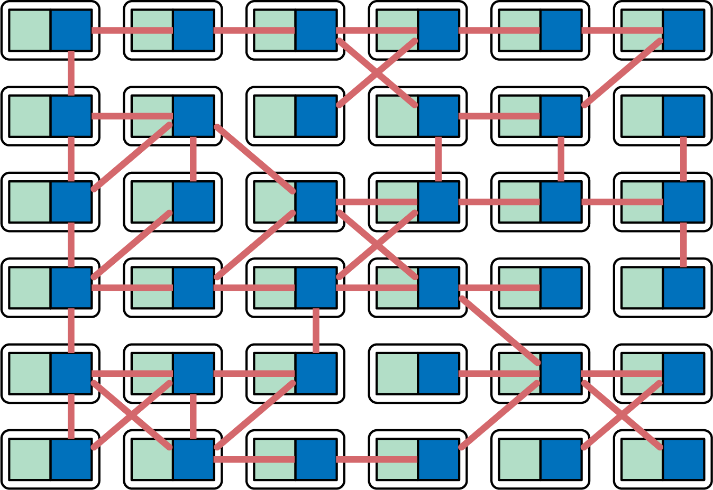

---

## Service Discovery
Elasticity in microservices is achieved through **Service Discovery**. This is the mechanism by which services automatically detect and locate each other on the network.

When a request enters the system, it doesn't call a hardcoded IP. Instead, it goes through a service discovery tool that knows exactly which instances of a service are healthy and available. This tool can monitor request frequency and trigger the infrastructure to spin up or shut down instances dynamically to handle load, ensuring the system remains responsive and cost-effective.

---

## Frontends
In an ideal microservices world, decoupling would encompass the user interface as well as the backend. While the original vision included the UI as part of the bounded context, the practicalities of modern web development often lead to two distinct styles.

### 1. Monolithic Frontend
This is the most common style (Figure 18-5), where a single, unified UI (such as a React or Angular single-page application) calls through the API layer to satisfy user requests. While the backend is decoupled, the frontend remains a single deployment unit.

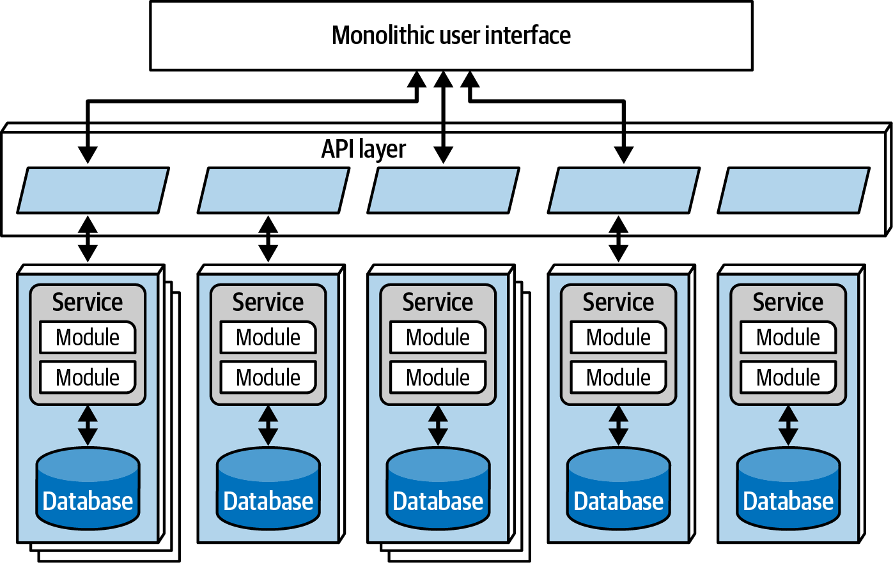

### 2. Micro-Frontends
The **Micro-frontend pattern** (Figure 18-6) takes decoupling to the UI level. In this model, the interface is broken down into independent components, each of which is owned by the same team that manages the corresponding backend service. This ensures a consistent level of granularity and isolation across the entire stack.

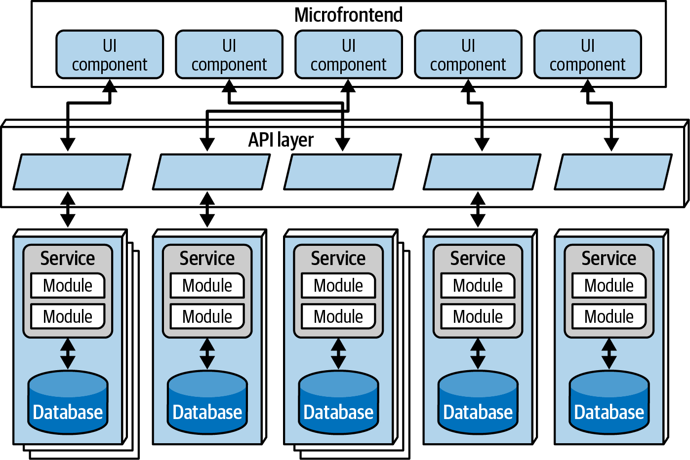

---

## Communication
Finding the right communication style is essential for keeping services decoupled while ensuring they can coordinate effectively. Architects must choose between synchronous (waiting for a response) and asynchronous (event-based) models.

### Protocol-Aware Heterogeneous Interoperability
This term describes the fundamental nature of communication between microservices:
1.  **Protocol-Aware:** Because there is no central ESB to handle translations, each service must know (or discover) the specific protocol (REST, gRPC, etc.) needed to call its peers.
2.  **Heterogeneous:** Each service can be written in a different language or framework. The architecture fully supports polyglot environments.
3.  **Interoperability:** Despite the isolation, services must collaborate via network calls to fulfill complex business requests.

> [!NOTE]
> **Enforced Heterogeneity**
> Some organizations take decoupling so seriously that they *mandate* different technology stacks for different teams. If Team A uses Java and Team B uses .NET, it becomes physically impossible for them to accidentally share classes or library dependencies, ensuring that the bounded contexts remain pure. 

### Asynchronous Communication
For many workflows, architects prefer the **Event-Driven** model (see Chapter 15). By using message queues and events, services can remain even more decoupled, as the sender doesn't need to know if the receiver is currently online or even who the receiver is.

---

## Choreography and Orchestration
How do decoupled services coordinate to fulfill a complex business process? Architects must choose between two primary patterns: **Choreography** and **Orchestration**.

### 1. Choreography (Decentralized)
Choreography (Figure 18-7) mirrors the communication style of Event-Driven Architecture. There is no central coordinator; each service knows how to call the others it needs to fulfill its portion of a workflow.

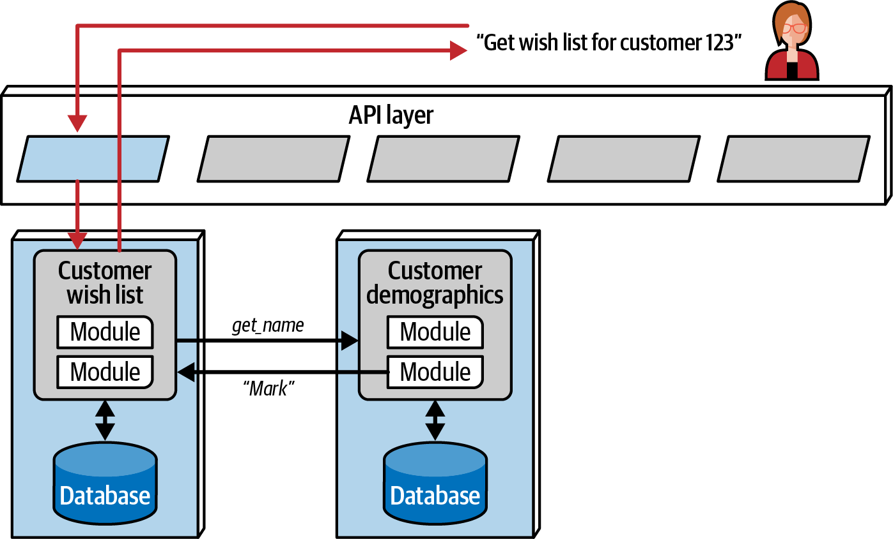

*   **Pros:** Maximizes decoupling and respects the "share nothing" philosophy.
*   **Cons:** Error handling and state management across many services are notoriously difficult.
*   **The Front Controller Pattern:** In complex workflows (Figure 18-9), one service often ends up acting as a "pseudo-mediator." This adds significant complexity to that service's domain responsibilities.

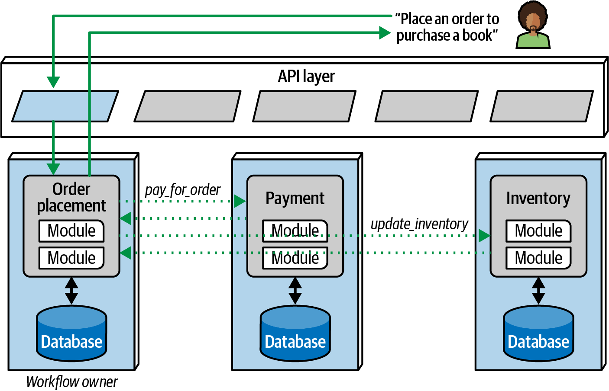

### 2. Orchestration (Centralized)
If a workflow is too complex for choreography, architects can create a dedicated **Orchestration Service** (Figure 18-8) to act as a localized mediator.

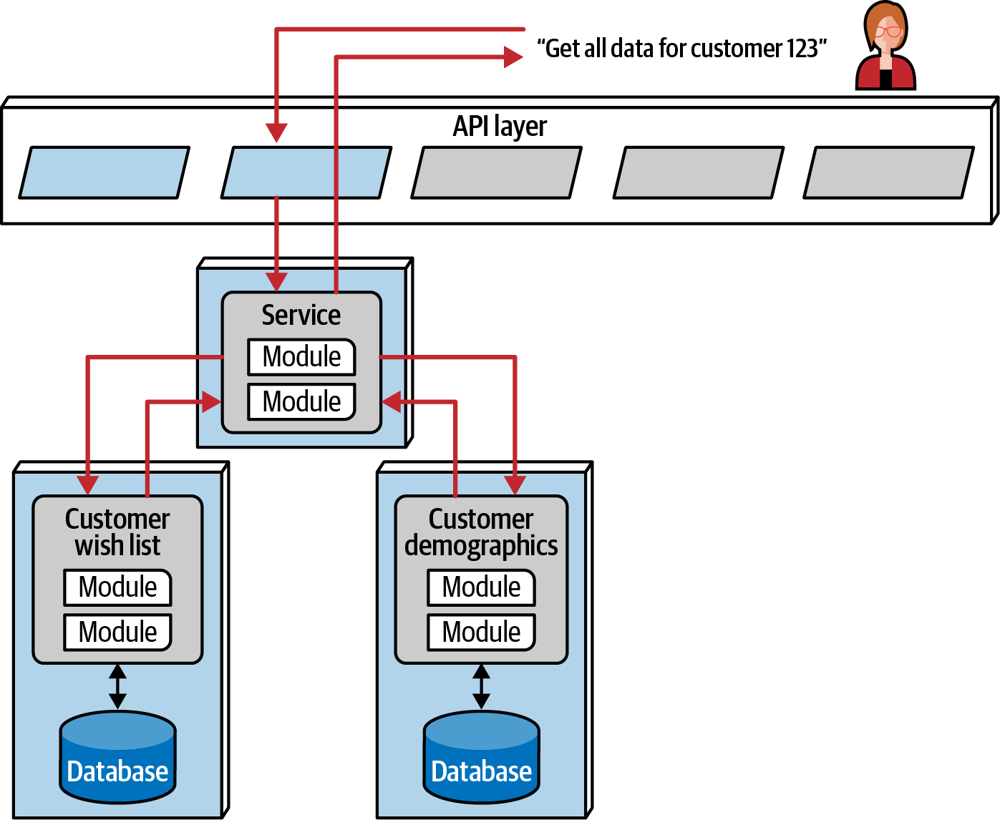

*   **Pros:** Centralizes complex coordination and error-handling logic into a single place, leaving domain services simpler.
*   **Cons:** Re-introduces coupling between the mediator and the services it orchestrates.

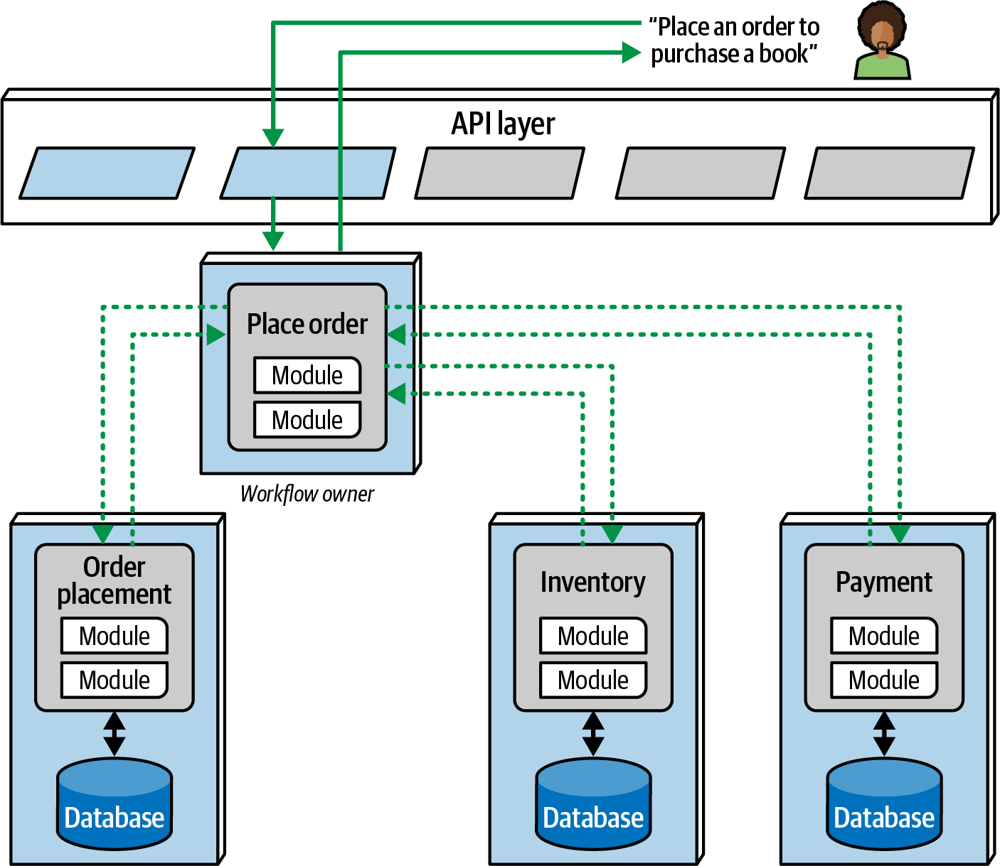

> [!IMPORTANT]
> **Choosing a Pattern.** Neither solution is perfect. Choreography preserves the pure decoupling of microservices but at the cost of operational complexity. Orchestration simplifies coordination but creates a coupling point. The choice depends on the inherent complexity of the business workflow itself.

---

## Transactions and Sagas
One of the most difficult challenges in microservices is managing transactions across service boundaries. Because each service owns its own data, the ACID atomicity we take for granted in monoliths disappears.

### The "Don't Do It" Rule
The best advice for distributed transactions is simple: **Don't do them.** If you find yourself needing to wire services together with transactions, it is a clear sign that your service **granularity** is too fine. You should consider merging the services back together rather than trying to coordinate a distributed transaction.

> [!TIP]
> Try to avoid transactions that span multiple microservices—fix the service granularity instead!

### The Saga Pattern
When a cross-service transaction is unavoidable, architects often turn to the **Saga Pattern**. A Saga is a sequence of local transactions coordinated by a mediator.

#### 1. The Happy Path
In a successful saga (Figure 18-11), the mediator calls each service in sequence, and all participants successfully update their respective databases.

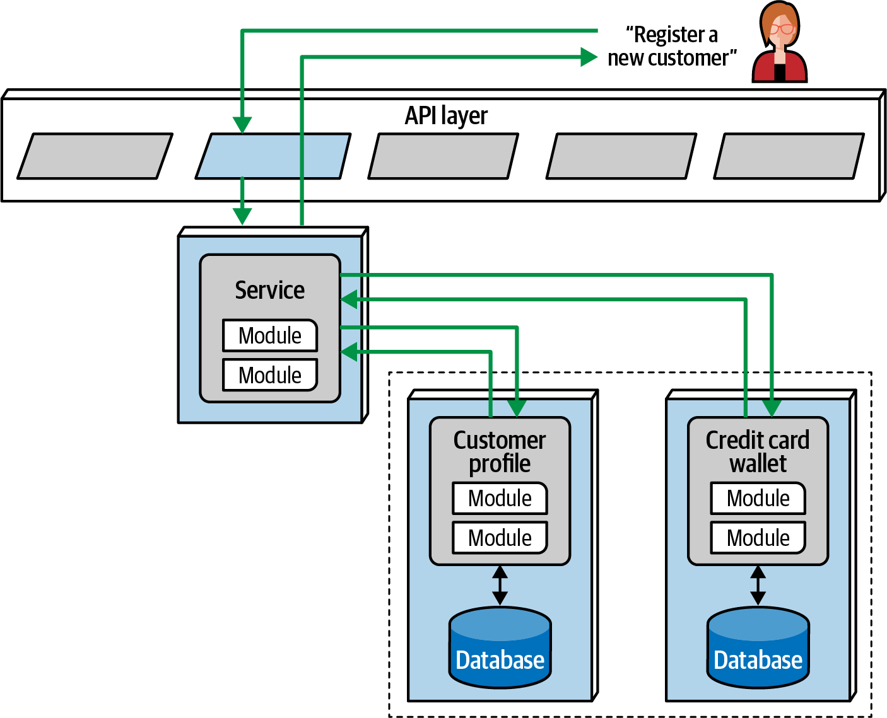

#### 2. Compensating Transactions (The Failure Path)
If any step in the sequence fails (Figure 18-12), the mediator must trigger **Compensating Transactions**. It sends requests to all previously successful services, instructing them to "undo" or reverse their changes.

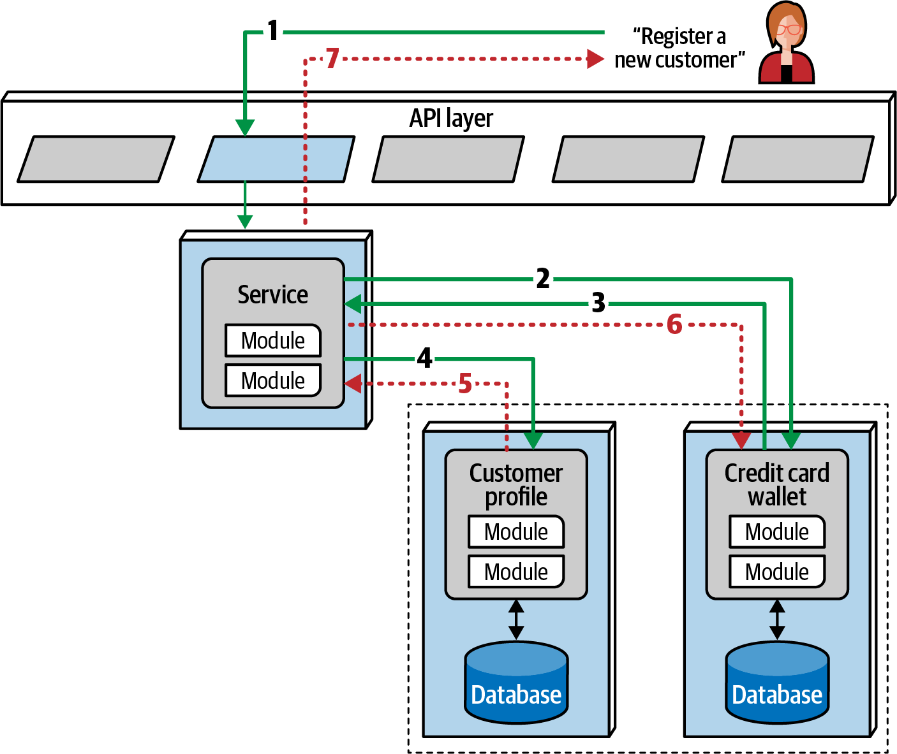

This framework is notoriously complex to implement. Services must be able to handle "pending" states, and architects must account for the massive amount of network traffic and coordination required to keep all services in sync during a failure.

> [!CAUTION]
> While sagas are a powerful tool, if cross-service transactions are the dominant feature of your architecture, microservices is likely the wrong choice for your problem domain.

---

## Data Topologies
Microservices is the only architecture style that *mandates* the breaking apart of data. While monolithic databases are technically possible in other styles, they are a disaster in microservices.

### The Problem with Monolithic Data
Sharing a single database across dozens of microservices (Figure 18-13) creates several critical issues:
1.  **Change Control:** A single schema change (like renaming a column) requires coordinating the maintenance, testing, and release of every service that uses that table.
2.  **Scalability Bottlenecks:** While services scale elastically, databases often don't. A spike in traffic can lead to connection pool exhaustion and request timeouts.
3.  **Physical Bounded Context:** Sharing data structures breaks the fundamental principle of isolation. If every service sees the same data, the bounded context effectively disappears.

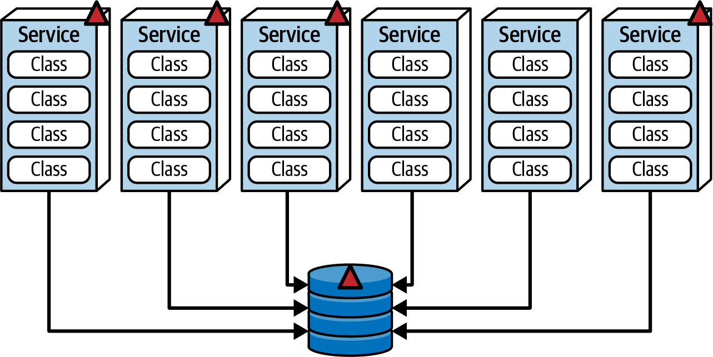

### The Standard: Database-per-Service
The default topology for microservices is the **Database-per-Service** pattern (Figure 18-14). 

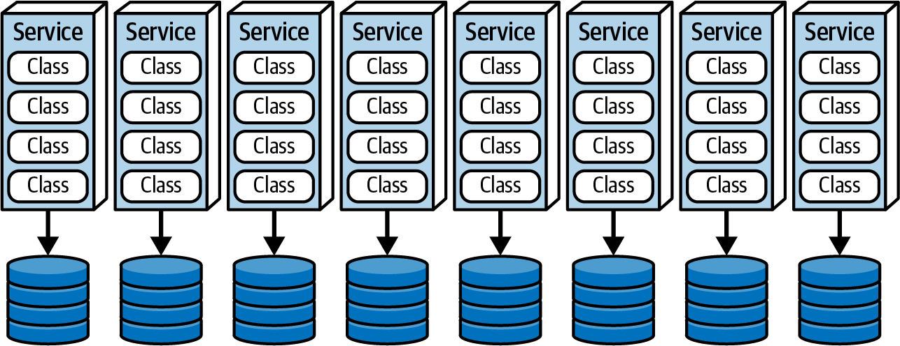

In this model, each service owns its data completely. Other services cannot query the database directly; they must use the service's API. This preserves the bounded context and allows for **Polyglot Persistence**, where each team chooses the database (Relational, Document, Graph) that best fits their needs.

### The Exception: Shared Data
In some scenarios, a small cluster of services (usually no more than 5-6) may need to share a database for performance or consistency reasons (Figure 18-15). 

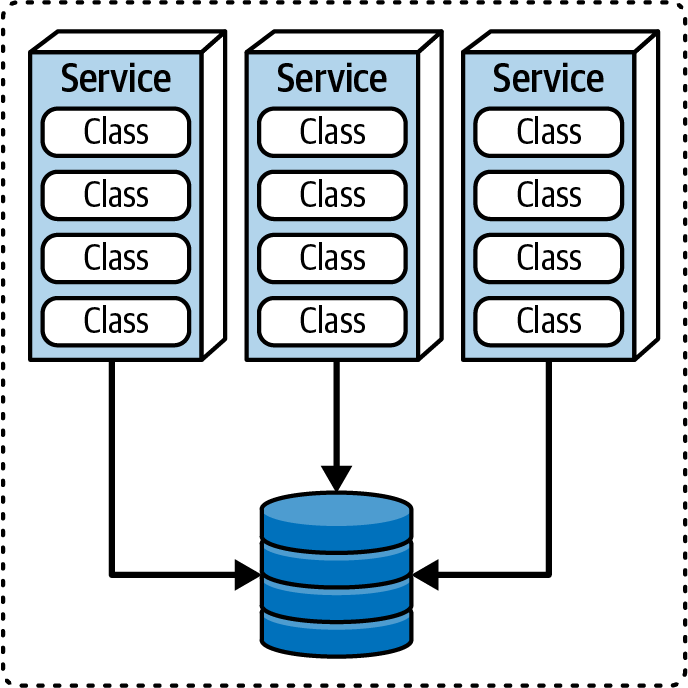

This creates a **broader bounded context**. While it solves specific coordination problems (e.g., different payment types updating a single ledger), it re-introduces the risk of coordinated deployments and reduces overall agility. Architects should use this exception sparingly.

---

## Cloud Considerations
Microservices is often referred to as a **"Cloud-Native"** architecture. Its reliance on small, separately deployed units fits perfectly with the on-demand provisioning of virtual machines, containers, and databases found in modern cloud environments like AWS, Azure, and GCP.

### Serverless: A Deployment Model, Not a Style
A common question in architecture is whether "Serverless" (AWS Lambda, Google Cloud Functions) is its own architectural style. We believe it is not; rather, **Serverless is a deployment model** for the microservices style. A serverless function is simply an extremely fine-grained microservice that is triggered on-demand.

---

## Common Risks

### 1. The "Grains of Sand" Antipattern
The most frequent mistake in microservices is making services too small. When services become "grains of sand," the system becomes an operational nightmare. Remember: the **"micro"** in microservices refers to the **single-purpose nature** of the service, not its physical lines of code or memory footprint.

### 2. Excessive Interservice Communication
Fine-grained services with tight bounded contexts inevitably need to communicate. However, if your services are constantly "chatting" via choreography or orchestration to fulfill simple requests, your granularity is likely wrong. This creates dynamic coupling that negates the benefits of the architecture.

### 3. The Shared Code Trap
While code reuse is a fundamental tenet of software engineering, it is often a trap in microservices.
*   **The Problem:** Sharing common functionality via custom libraries (JARs, DLLs) breaks the "share nothing" principle. 
*   **The Risk:** A change to a shared library can ripple across multiple bounded contexts, forcing coordinated deployments and potentially breaking unrelated services. 
*   **The Advice:** Prefer **duplication** or **service calls** over shared binary libraries to preserve the integrity of your bounded contexts.

---

## Governance
Governance in microservices is primarily about preventing **structural decay**. The goal is to monitor and control both static and dynamic coupling between services.

### 1. Static Coupling
This occurs through shared libraries (custom or third-party) and service contracts.
*   **Monitoring:** Architects should use **Software Bill of Materials (SBOM)** and dependency-management tools to track what is being shared across the ecosystem.
*   **Strategy:** Minimize the use of shared custom libraries. Every shared JAR or DLL is a potential anchor that prevents a service from evolving independently.

### 2. Dynamic Coupling
Governing the "chattiness" of services at runtime is more difficult but equally critical.
*   **Log Analysis:** Use fitness functions to analyze service logs. By tracking which services call each other and how often, you can identify "chatty" neighbors that might need to be merged.
*   **Registry Monitoring:** Services can register their inter-service calls (via JSON) to a configuration server like **ZooKeeper**. This provides a real-time map of the system's communication topology.

---

## Team Topology Considerations
Microservices is a domain-partitioned style, meaning it works best with **Domain-Aligned Teams**.

*   **Stream-Aligned Teams:** These teams thrive in microservices when their streams match domain boundaries. If a stream crosses too many bounded contexts, it's a signal to either realign the services or reconsider the architectural style.
*   **Platform Teams:** These are essential for managing the **Service Mesh** and **Sidecars**. They provide the operational "pavement" that allows stream-aligned teams to focus purely on business logic.
*   **Enabling Teams:** Perfect for introducing specialized or cross-cutting functionality without disrupting the flow of stream-aligned teams.
*   **Complicated-Subsystem Teams:** Ideal for handling complex, isolated domain logic (like a specialized calculation engine) as a standalone microservice.

---

## Style Characteristics
Microservices is an architecture of extremes. It offers unparalleled agility and scale, but at the cost of performance and simplicity.

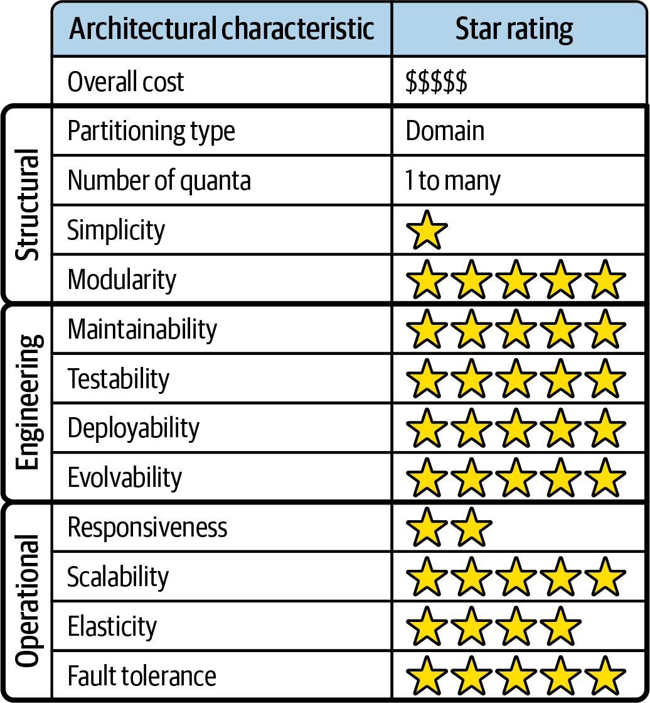

### The Five-Star Strengths
*   **Deployability & Testability:** Microservices is built on the foundation of the **DevOps revolution**. Continuous integration and automated deployment are not optional—they are baked into the architecture's DNA.
*   **Scalability & Elasticity:** By breaking the system into tiny, independent units, microservices can scale to handle massive loads that would crush a monolithic system.
*   **Evolvability:** The extreme decoupling allows for "Evolutionary Architecture," where individual parts of the system can be upgraded, replaced, or rewritten without impacting the whole.
*   **Fault Tolerance:** Because services run in isolated processes with their own data, the failure of one service (e.g., "WishList") rarely brings down the entire system (e.g., "Checkout").

### The Performance Trade-off
Performance is the primary weakness of this style. The overhead of network calls, security handshakes at every endpoint, and distributed data lookups creates significant latency. Architects mitigate this through:
*   **Intelligent Caching:** Keeping frequently used data close to the service.
*   **Replication:** Distributing state to avoid cross-service lookups.
*   **Choreography:** Using event-driven communication to reduce synchronous bottlenecks.

### Architectural Quanta
Microservices is the ultimate expression of the **Architectural Quantum**. Because of its "share nothing" philosophy and strict bounded contexts, it features the most distinct and independent quanta of any modern architecture style.

## Conclusion
Microservices is a powerful tool, but it is not a "silver bullet." Its success depends entirely on getting the **service granularity** right. When done well, it provides a level of agility and scale that allows modern businesses to outpace their competition. When done poorly, it results in a "Distributed Big Ball of Mud."

---

## Examples and Use Cases
Systems with high functional and data modularity are ideal candidates for microservices. A perfect example is a **Medical Monitoring System**.

### Case Study: Patient Medical Monitoring
In a high-stakes environment like a hospital, monitoring a patient's vital signs (heart rate, blood pressure, oxygen levels, etc.) requires extreme isolation and fault tolerance.

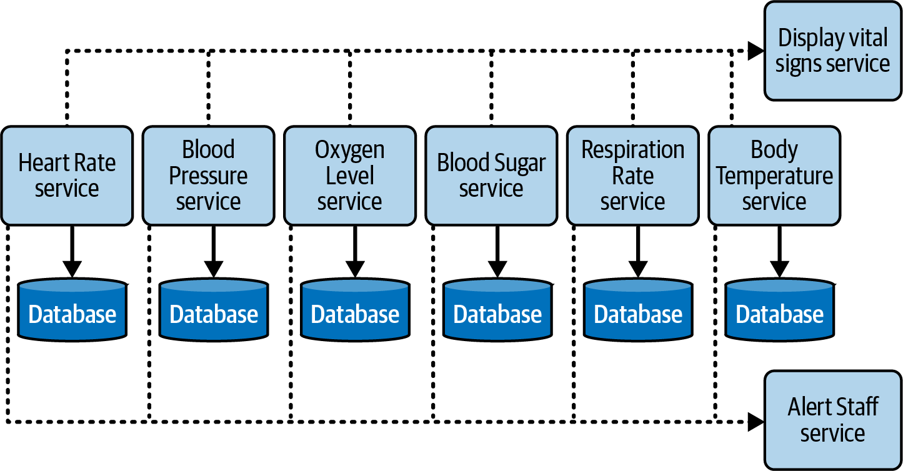

As shown in Figure 18-17, each vital sign is managed by a separate, independent microservice with its own private database. 
*   **Isolation:** If the heart rate service crashes, the blood pressure monitor remains fully functional.
*   **Shared Services:** Common functionality like "Alert Staff" and "Display Vital Signs" are implemented as shared services that all monitors communicate with asynchronously.

### Microservices "Superpowers" in Practice:
1.  **Fault Tolerance:** A failure in one domain (e.g., Oxygen levels) cannot cascade to others, which is life-critical in this domain.
2.  **Testability:** Maintenance on the blood-pressure service requires a very small testing scope, as there is zero coupling to the heart-rate or pulse-ox logic.
3.  **Evolvability:** Adding a new monitoring type (e.g., Sleep Monitor) is trivial—you simply deploy a new service without needing to modify or redeploy the existing ones.

---

## Recommended Resources
For those looking to dive deeper into the world of microservices, we recommend the following definitive works:
*   **Building Microservices, 2nd Edition** by Sam Newman (O’Reilly, 2021)
*   **Building Micro-Frontends, 2nd Edition** by Luca Mezzalira (O’Reilly, 2025)
*   **Microservices vs. Service-Oriented Architecture** by Mark Richards (O’Reilly, 2016)
*   **Microservices AntiPatterns and Pitfalls** by Mark Richards (O’Reilly, 2016)

---
