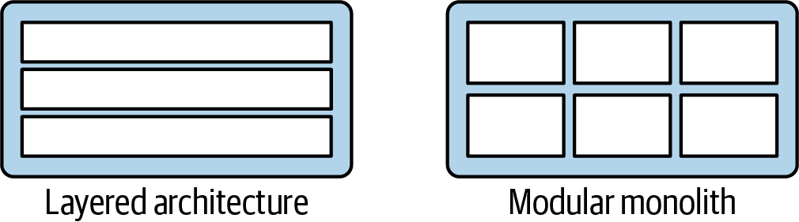
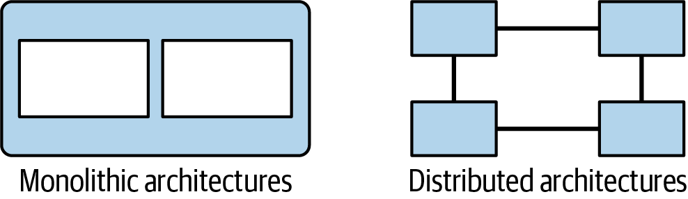
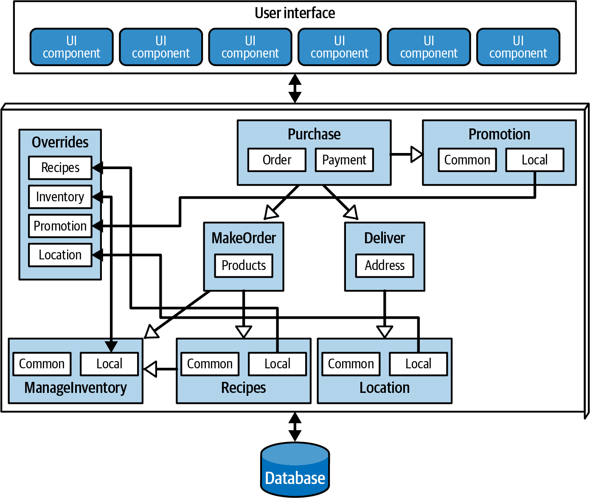
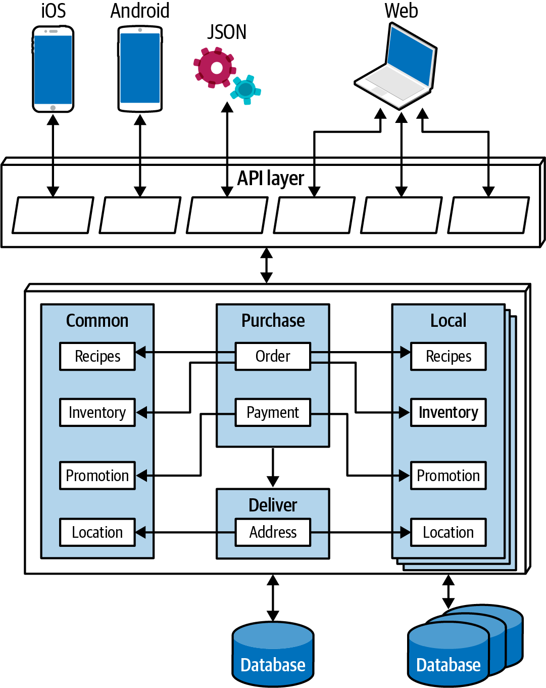
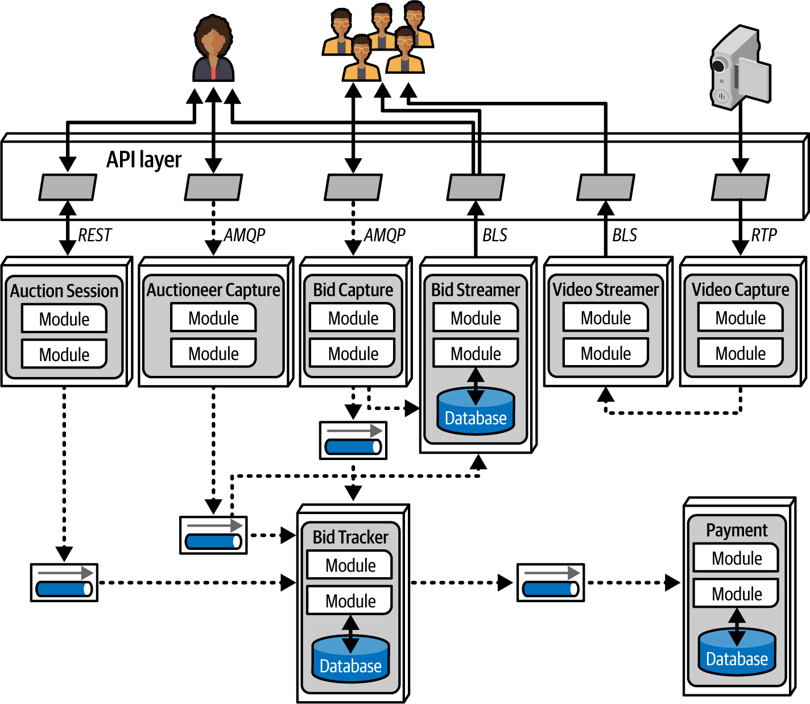
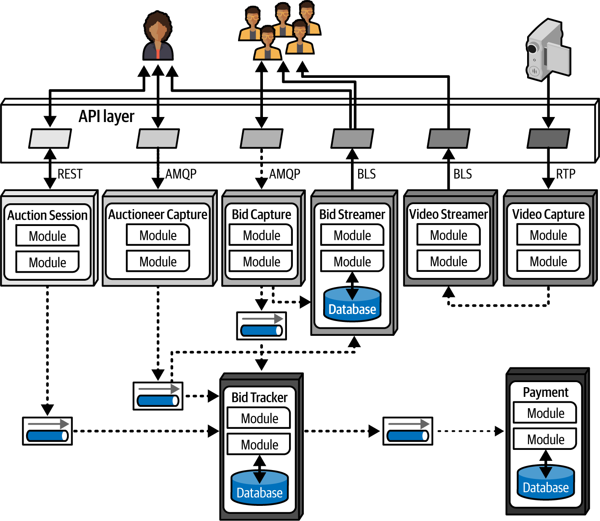

# Chapter 19. Choosing the Appropriate Architecture Style

"It depends!" 

With the vast array of architectural styles available and new paradigms arriving almost daily, there is no single "right" choice. Selecting an architecture style is the culmination of a rigorous process of analysis, weighing trade-offs across architecture characteristics, domain requirements, strategic goals, and organizational constraints.

---

## Shifting "Fashion" in Architecture
The software industry’s preferences in architecture styles are not static; they shift over time, driven by several key factors:

### 1. Observations from the Past
New architecture styles often arise as direct responses to the pain points of previous ones. For example, the shift toward microservices was a reaction to the extreme coupling and coordination "gridlock" found in orchestration-driven SOA. Architects learn from past deficiencies and redesign future systems to fix them.

### 2. Changes in the Ecosystem
The software development ecosystem is in a state of constant, unpredictable flux. Tools that are ubiquitous today (like Kubernetes) were unknown just a few years ago. Architects must accept that their current toolset will eventually be replaced by something faster, more efficient, or entirely different.

### 3. New Capabilities and Paradigms
Sometimes, the shift isn't just about a new tool, but a new paradigm. The advent of **Containers (Docker)** and **Generative AI** represent tectonic shifts that fundamentally change how we design, build, and deploy software. Even minor features in a new tool can become "game changers" if they align perfectly with an architect's specific goals.

### 4. Acceleration
Change in the ecosystem isn't just constant—it's getting faster. New engineering practices lead to new designs, which in turn create new capabilities. This cycle keeps architects in a state of continuous evolution.

### 5. Domain and Technology Changes
As businesses evolve, merge, or pivot, their software domains shift. Organizations must keep pace with technological changes that offer clear bottom-line benefits, such as cloud-native transitions or automated testing frameworks.

### 6. External Factors
Factors unrelated to technical merit—such as prohibitive licensing costs for a particular tool or regulatory changes—can force an organization to migrate to a new architecture style or technology stack.

---

> [!IMPORTANT]
> **Stay Informed.** An architect must understand current industry trends to make intelligent decisions. Knowing "why" a trend is popular allows you to decide when it makes sense to follow it and, more importantly, when your specific context requires you to make an exception.

---

## Decision Criteria
Choosing an architectural style is not a random act. It requires a deep understanding of several critical factors before a final decision can be reached.

### 1. Prerequisites for Selection
*   **Domain Knowledge:** You don't need to be a subject matter expert, but you must understand the major business aspects that impact operational characteristics.
*   **Architecture Characteristics Analysis:** This is the core activity. Identify which characteristics (scalability, fault tolerance, etc.) are non-negotiable for the domain's success.
*   **Data Architecture:** Collaboration with data specialists is vital. You must understand how data design—especially legacy data—will impact your architectural choices.
*   **Cloud Readiness:** On-premises trade-offs differ vastly from cloud ones. Consider costs, data movement, and the commodities offered by your cloud provider.
*   **Organizational Maturity:** If your team lacks maturity in Agile or DevOps, highly decoupled styles like microservices will likely lead to failure.

---

## Domain/Architecture Isomorphism
**Isomorphism** refers to the generic "shape" or topology of an architecture. Matching the shape of the problem to the shape of the architecture is a key skill.

### Visualizing the Shape
Architects use isomorphic representations to compare the macro-level structures of different styles.

*   **Modular vs. Layered:** Figure 19-1 shows the difference between separation by domain and separation by technical layer.
*   **Monolithic vs. Distributed:** Figure 19-2 highlights the distribution of core components.

### Finding the Match
*   **Perfect Match:** The **Microkernel** style is ideal for systems requiring customizability (via plug-ins). **Space-based** architecture is a great fit for genome analysis requiring massive parallel processing.
*   **Poor Match:** A highly scalable auction site will struggle as a monolith. Conversely, a highly coupled insurance application with complex multipage dependencies is a poor fit for microservices; a **Service-based** style would be more appropriate.

---

## Core Determinations

### Monolith versus Distributed?
This is the most fundamental question. 
*   **Monolith:** Suitable if a single set of architectural characteristics suffices for the entire system.
*   **Distributed:** Necessary if different parts of the system require vastly different characteristics (e.g., one part needs extreme scalability, another needs extreme security). Use the **Architectural Quantum** as your guide.

### Where Should Data Live?
*   **Monoliths** typically favor a single relational database. 
*   **Distributed** systems require a decision on which services persist which data and how that data flows to build workflows.

### Synchronous or Asynchronous?
How should services communicate?
*   **Synchronous:** Default to this. It's easier to design, implement, and debug.
*   **Asynchronous:** Use only when necessary for performance, scale, or reliability. It provides unique benefits but introduces significant complexity (race conditions, debugging nightmares).

> [!TIP]
> **Default to Synchronous.** Use asynchronous communication only when the trade-offs in scalability or performance demand it.

---

## Monolith Case Study: Silicon Sandwiches
Recall the Silicon Sandwiches kata from Chapter 5. After analysis, we determined that a **single architectural quantum** was sufficient. Given the modest budget and need for simplicity, a monolithic style is a strong candidate.

### 1. Modular Monolith Approach
The **Modular Monolith** (Figure 19-3) emphasizes domain-centric components within a single deployment unit.

*   **Design:** Features a single relational database and a unified web-based UI.
*   **Customization:** Since the style doesn't handle this natively, we design an **Override Component**. Every domain component must reference this override to check for customizations.
*   **Future-Proofing:** By keeping database assets aligned with domain components, we make it much easier to migrate to a distributed architecture if the system outgrows the monolith.

### 2. Microkernel Approach
If **customizability** is the driving characteristic, the **Microkernel** style (Figure 19-4) provides a more structured solution.

*   **Core System:** Contains the primary domain components and the main database.
*   **Plug-ins:** Each customization (whether common or local) is implemented as a decoupled plug-in. Plug-ins can maintain their own data without coupling to others.
*   **The BFF Pattern:** This design utilizes **Backends for Frontends (BFF)**. The API layer acts as a thin microkernel adapter, translating generic data into optimized formats for specific devices (iOS, Android, Web).

### Communication Choice
For both designs, **Synchronous Communication** is the correct choice. The system lacks extreme elasticity requirements, and no business operations are long-running enough to justify the complexity of asynchronous messaging.

---

## Distributed Case Study: Going, Going, Gone
The Going, Going, Gone (GGG) kata presents a more complex challenge: different parts of the system require vastly different operational characteristics (scalability, availability, etc.).

### Why Microservices?
While Event-Driven Architecture (EDA) is a strong candidate, **Microservices** is better at supporting **variation in operational characteristics**. In GGG, the needs of an "Auctioneer" (high availability) are very different from the needs of a "Bidder" (extreme scalability). Microservices allows us to tune each service independently to meet these specific goals.

### Architecture Overview
The microservices design for GGG (Figure 19-5) maps domain components to independent services.

#### Key Services & Data Flows:
*   **Bid Capture & Tracker:** Bid Capture acts as an asynchronous conduit, feeding bids into the Bid Tracker. The Tracker unifies streams from both online bidders and the live auctioneer, using message queues to buffer different flow rates.
*   **Auctioneer vs. Bidder Capture:** These are separated into distinct services because their operational requirements differ significantly.
*   **Payment Integration:** This service uses asynchronous messaging to integrate with a 3rd-party provider. Since the provider can only process one payment every 500ms, the message queue acts as a critical buffer to prevent system-wide timeouts.
*   **Video Streaming:** High-performance, read-only streams for both video and bid updates ensure bidders see the auction in as close to real-time as possible.

### Quantum Analysis
Using **Quantum Analysis** early in the design process made it easier to identify the natural boundaries for services, data, and communication.

As shown in Figure 19-6, the GGG architecture resolves into **five distinct quanta**:
1.  **Payment**
2.  **Auctioneer**
3.  **Bidder**
4.  **Bidder Streams**
5.  **Bid Tracker**

### Final Verdict
This design isn't the "correct" one—there is no such thing. However, by using microservices and intelligently applying asynchronous messaging where operational characteristics vary, it represents the **least worst set of trade-offs**. It provides the scalability and elasticity required for a global auction site while maintaining a foundation for future evolution.

---
