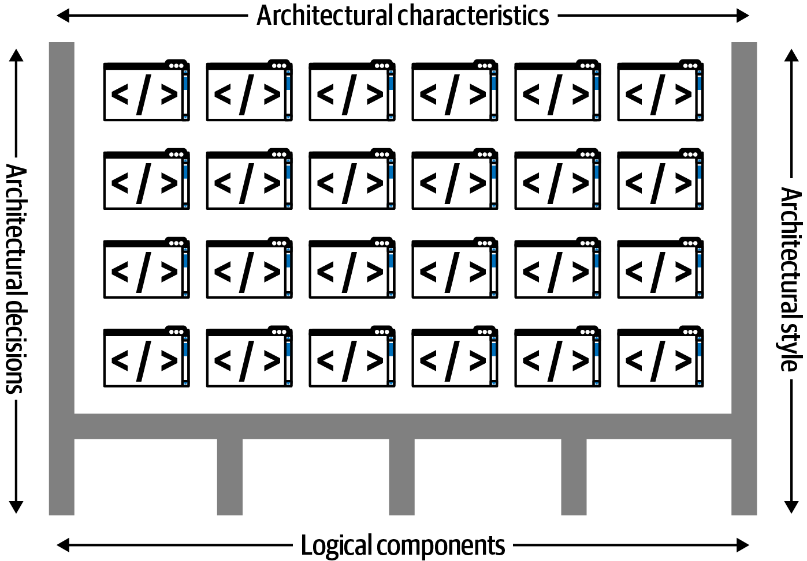
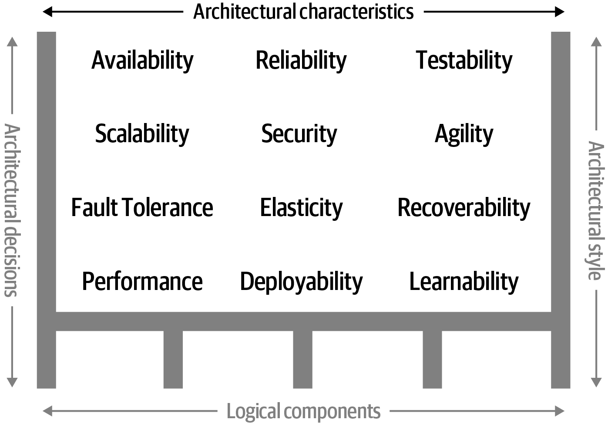
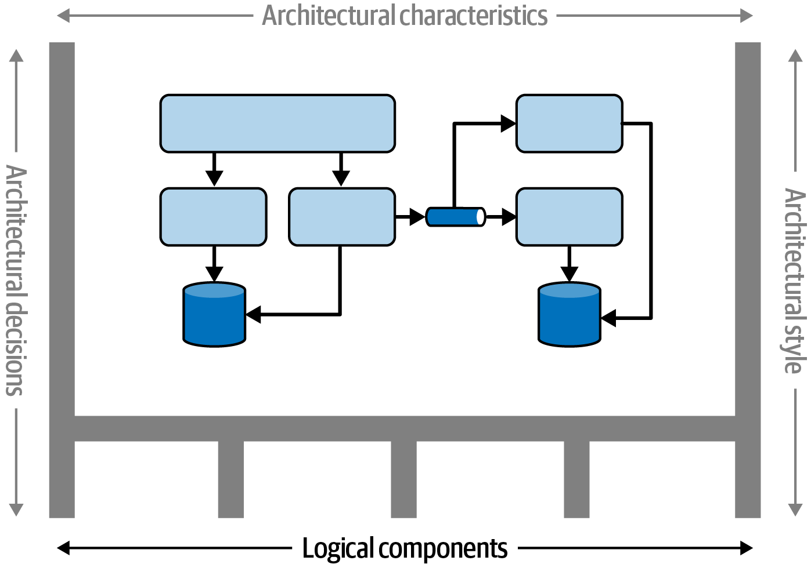
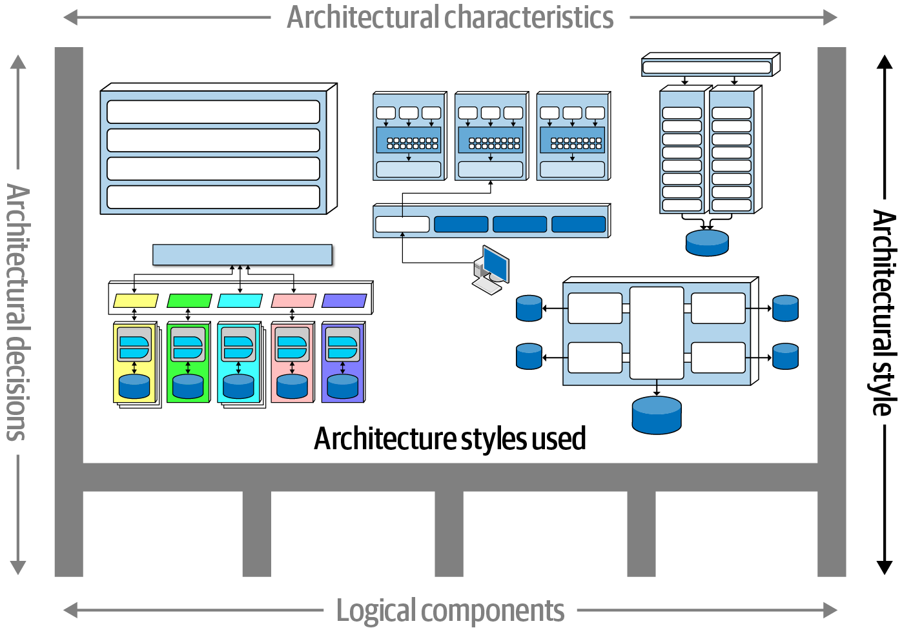
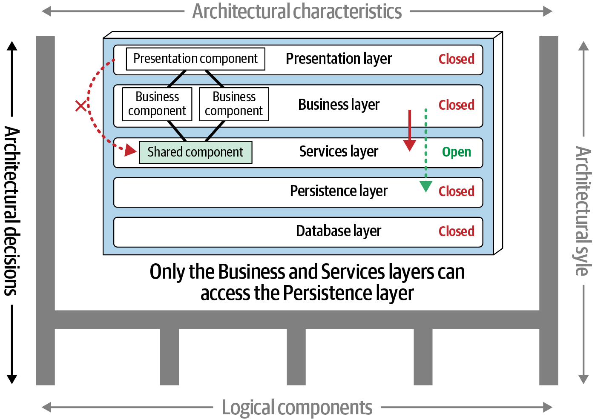

# Chapter 1: Introduction to Software Architecture

Whether you are a developer looking for the next career step, a project manager aiming to understand system design, or an "accidental architect" already making structural decisions, software architecture is about understanding how large parts of systems fit together and evaluating their trade-offs.

Because the role requires deeply analyzing complex, ever-changing contexts and making difficult trade-off decisions with incomplete information, software architecture is highly resistant to being replaced by generative AI. 

## The Importance of Context
Architecture can only be understood within its specific context. The "best" architecture changes based on the era, business requirements, and available technology.

For example, in the late 20th century, architectures were designed to maximize shared infrastructure because commercial licenses for operating systems, application servers, and databases were astronomically expensive. If you had proposed a **Microservices** architecture in 2002—requiring dedicated servers and databases for dozens of individual services—it would have been financially impossible. Today, Microservices are feasible strictly because of open-source software and modern DevOps practices. 

**Rule:** *All architectures are products of their context.*

---

## Defining Software Architecture (The 4 Dimensions)
Software architecture is not just drawing boxes; it is defined by the intersection of four critical dimensions:

### 1. Architecture Characteristics (The "-ilities")

These define the capabilities and success criteria of the system. Examples include *scalability*, *reliability*, *maintainability*, and *security*. They determine what the system must support structurally, independent of its business functionality.

### 2. Logical Components

While characteristics define capabilities, logical components define the system's *behavior*. Designing these is a key structural activity, involving the creation of domains, entities, and workflows that represent the application's business logic.

### 3. Architecture Style

Once the architect understands the required characteristics and logical components, they choose an Architecture Style (e.g., Layered, Microservices, Event-Driven). This style serves as the starting point and provides the easiest implementation path for the given set of requirements.

### 4. Architecture Decisions

These are the hard rules and constraints that dictate how the system must be constructed by the development teams. 
*Example:* An architecture decision might state that the *Presentation layer* is strictly prohibited from making direct calls to the database; it must route through the *Business layer*. These rules form the structural boundaries of the system.

---

## The Laws of Software Architecture
While writing this book, the authors uncovered three universally true "laws" that form the foundational philosophy of software architecture.

### First Law of Software Architecture
> **Everything in software architecture is a trade-off.**

There are no clean, perfect spectrums in system design. Every decision requires balancing variables. 
*   **Corollary 1:** If you think you’ve discovered something that isn’t a trade-off, more likely you just haven’t identified the trade-off…yet.
*   **Corollary 2:** You can’t just do trade-off analysis once and be done with it. (Because contexts constantly change, you must continually re-evaluate your decisions instead of trying to find "One Big Default").

### Second Law of Software Architecture
> **Why is more important than how.**

It is easy to look at an existing system and figure out *how* it works structurally. What is difficult to decipher is *why* the previous architect made those specific choices. The "why" contains the specific context and trade-offs that justified the design.

### Third Law of Software Architecture
> **Most architecture decisions aren’t binary but rather exist on a spectrum between extremes.**

Because decisions are based on trade-offs rather than pure rights and wrongs, they almost always exist on a sliding scale.

---

## Expectations of an Architect
An architect's job involves much more than drawing diagrams. Regardless of title or seniority, an architect is universally expected to do the following:

### 1. Make Architecture Decisions
Architects must *guide* technology decisions rather than specify them. For example, instead of mandating "Use React," an architect should decide, "We will use a reactive-based framework for frontend development," allowing the development team to choose between React, Vue, or Angular. Only mandate specific tools when a specific architectural characteristic (like extreme performance) strictly requires it.

### 2. Continually Analyze the Architecture
Architectures degrade over time. "Structural decay" happens when developers make coding changes that accidentally violate architectural characteristics (like scalability). An architect must continually verify the system's *vitality* against the changing business environment.

### 3. Keep Current with Latest Trends
Because architecture decisions are long-lasting and incredibly difficult to reverse, architects must stay ahead of industry trends (e.g., Cloud migrations, Generational AI). This ensures the architecture will remain viable into the future.

### 4. Ensure Compliance with Decisions
Making decisions is useless if development teams ignore them. (For instance, a UI developer might bypass the Business Layer and query the database directly for "performance reasons," violating the layered architecture). Architects must verify compliance, often using automated fitness functions.

### 5. Understand Diverse Technologies
An architect must prioritize **technical breadth** over technical depth. It is vastly more valuable for an architect to understand the general pros and cons of 10 different caching platforms than to be the absolute world's foremost expert in just one.

### 6. Know the Business Domain
A brilliant technical architecture is worthless if it doesn't solve the business's actual problems. Architects must understand domain vocabulary (e.g., financial or medical terms) to communicate effectively with C-level executives and stakeholders.

### 7. Lead a Team and Possess Interpersonal Skills
An architect is expected to possess exceptional interpersonal skills, including teamwork, facilitation, and leadership.

As technologists, developers and architects tend to prefer solving technical problems, not people problems. However, as Gerald Weinberg famously said, "No matter what they tell you, it's always a people problem." The guidance architects provide isn't just technical; it includes leading development teams through the implementation phase. Those who are excellent technologists but struggle to mentor developers or communicate principles often have difficulty maintaining their positions. Leadership skills are at least half of what it takes to be an effective software architect.

### 8. Understand and Navigate Organizational Politics
An architect is expected to understand the political climate of the enterprise and be able to navigate its politics.

While developers can often make technical decisions (like choosing a design pattern or refactoring code) without approval, architectural decisions usually impact multiple systems and teams. Almost every major decision an architect makes will be challenged by someone. 

For example, if an architect decides to silo a CRM database to improve security (forcing other apps to use APIs instead of direct database access), other teams will complain about the increased effort and costs. To succeed, an architect must apply negotiation skills and navigate organizational politics to get these broad, important decisions approved. Getting used to justifying and fighting for decisions is a necessary transition from being a developer.
