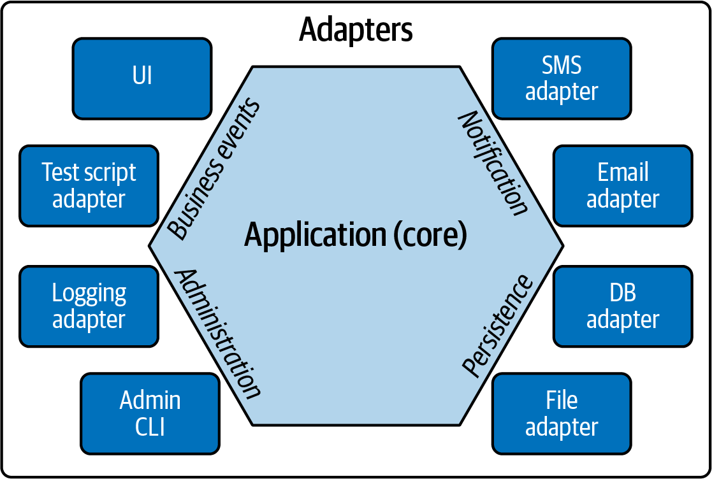
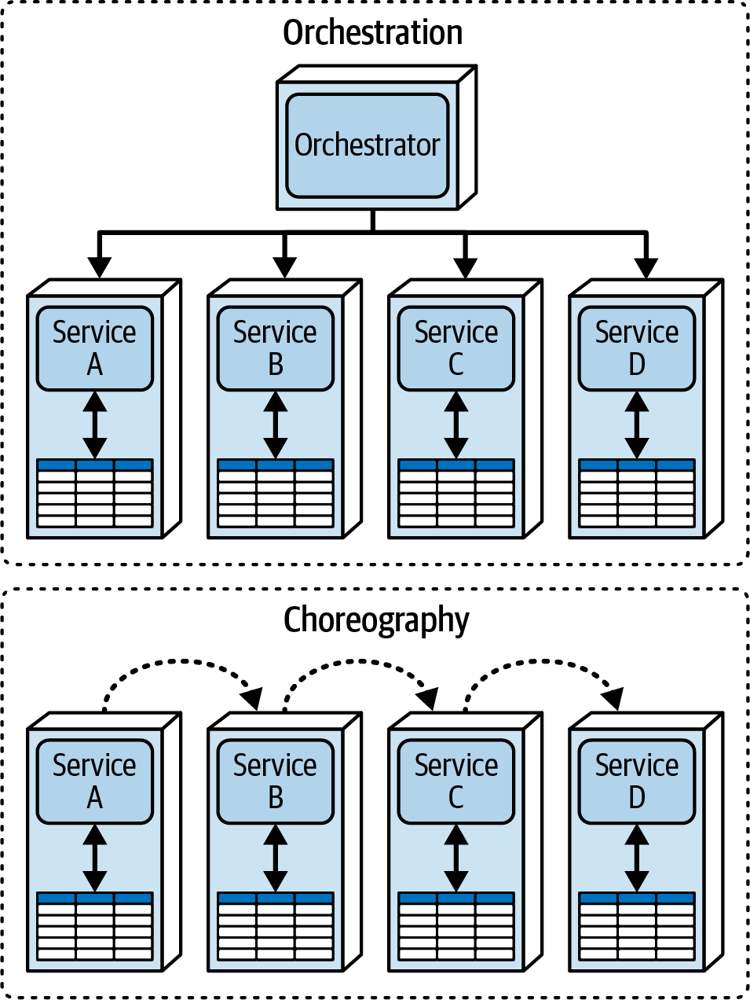
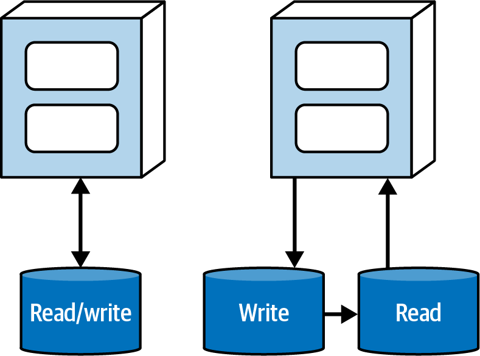
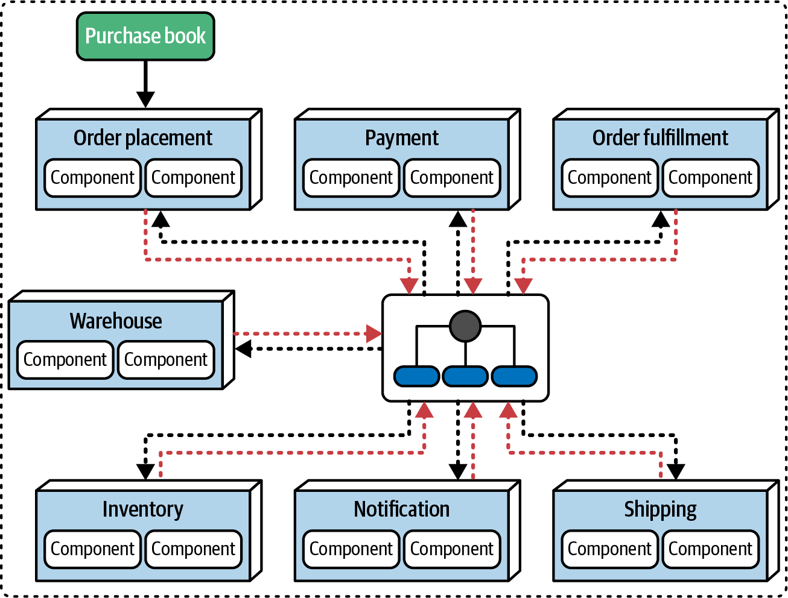
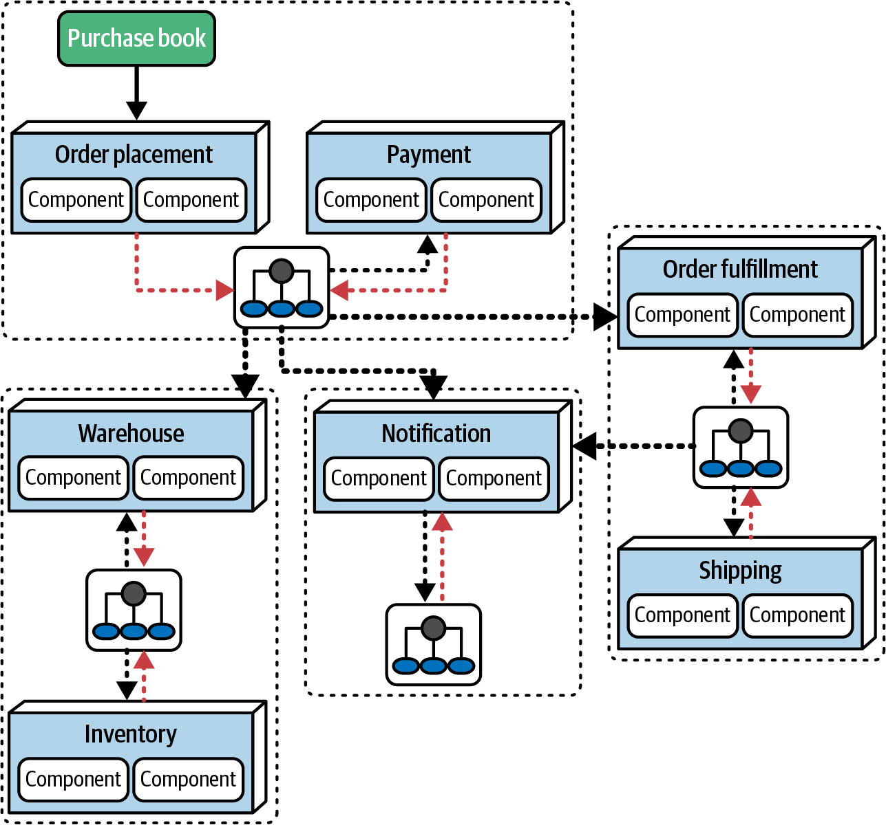

# Chapter 20. Architectural Patterns

In the architectural world, it is crucial to distinguish between **Styles** and **Patterns**. 
*   **Styles:** As discussed in Part II, these are named topologies defined by their physical architecture, deployment models, and data strategies (e.g., Microservices, Space-Based).
*   **Patterns:** These are contextualized solutions to specific problems. They are not "best practices"—a term that implies a one-size-fits-all solution—but rather tools that architects must apply with critical thinking and careful analysis.

---

## Reuse: Domain vs. Operational Coupling
A common concern in distributed architectures like microservices is determining what should be decoupled and what should be shared.

### 1. Domain Coupling: The Case for Duplication
In a microservices environment, domain-driven bounded contexts insist that implementation details remain private. 
*   **The Problem:** If two services need to share a `CustomerProfile` entity, the traditional instinct is to create a shared library.
*   **The Pattern:** To preserve decoupling, architects favor **Duplication over Coupling**. Each service maintains its own internal representation of the entity. Communication happens via loosely coupled formats (like JSON name-value pairs). 
*   **The Trade-off:** While duplication can lead to synchronization issues or semantic drift, it prevents a change in one service's technology stack or data schema from breaking the entire ecosystem.

### 2. Operational Coupling: The Case for Sharing
While domain logic benefits from duplication, **Operational Capabilities** (monitoring, logging, authentication, circuit breakers) benefit from high coupling and consistency.

*   **The Coordination Problem:** If every team is responsible for implementing its own monitoring, how can the organization ensure it is actually done? More importantly, how do you handle a unified upgrade of the monitoring tool across fifty different services?
*   **The Solution:** Architects need patterns that allow for centralized operational control without violating the autonomy of the domain teams.

---

## Hexagonal Architecture (Ports and Adapters)
The **Hexagonal Architecture** pattern (Figure 20-1) places domain logic at the center of the system, insulated from the outside world by a layer of **Ports and Adapters**.

### The Logic of the Hexagon
The goal is to ensure that the core business logic is never coupled to the technical details of the infrastructure. For example, the domain logic shouldn't care if it's receiving a request from a REST API or a message queue; it simply receives data through a "Port" and responds accordingly.

### Regrettable Branding
Alistair Cockburn, the pattern's creator, originally named it "Hexagonal" because he liked the visual representation. He quickly preferred the more descriptive name **Ports and Adapters**, but the "Hexagonal" name had already captured the industry's imagination and stuck.

### The Data Fidelity Flaw
While popular, Hexagonal Architecture has a significant flaw when applied to modern microservices: **it treats the database as just another plug-in adapter.**
*   **The Misconception:** Early proponents saw the database as a separate piece of machinery. 
*   **The Reality:** As Eric Evans noted in *Domain-Driven Design*, database schemas *are* business logic. 
*   **The Conflict:** If you treat the data schema as an isolated external detail, you risk violating a core microservices principle where a service and its data are one inseparable unit.

> [!NOTE]
> Today, while "Hexagonal" is still used as shorthand for separating domain and operational concerns, we have much better implementation mechanisms—most notably the **Service Mesh**—to achieve this separation in distributed systems.

---

## Service Mesh and Orthogonal Coupling
The **Sidecar Pattern** is more than just a trick for decoupling—it is an **Orthogonal Reuse Pattern**. It addresses a specific type of coupling that cuts across the primary organization of the architecture.

### What is Orthogonal Coupling?
In mathematics, two lines are orthogonal if they intersect at right angles, implying independence. In architecture, **Orthogonal Coupling** occurs when two distinct purposes (e.g., Monitoring and Catalog Checkout) must intersect to form a complete solution without becoming entangled. 

Recognizing these "right-angle" intersections allows architects to isolate cross-cutting concerns (operational coupling) in a consistent layer that doesn't interfere with the domain-centric hierarchy.

### Sidecar and Service Mesh Trade-offs
While these patterns offer a powerful abstraction for managing operational concerns, they come with a specific set of trade-offs:

| Advantages | Disadvantages |
| :--- | :--- |
| **Isolated Coupling:** Provides a consistent way to handle cross-cutting concerns. | **Platform Overhead:** You must implement a sidecar for every platform in your polyglot environment. |
| **Infrastructure Coordination:** Allows for unified upgrades and management. | **Complexity:** Sidecar components can grow large and complex over time. |
| **Flexible Ownership:** Can be owned by domain teams, infrastructure teams, or a hybrid. | **Implementation Drift:** Independent teams may implement sidecars with slight variations. |

### Summary of Separation Patterns
Both Hexagonal and Service Mesh are ways to implement the **Separation of Concerns** pattern. While Hexagonal is a general-purpose concept, the Service Mesh is specifically optimized for microservices and distributed systems. The architect's key task is to identify the need for *separation* first, then choose the implementation that best fits the operational environment.

---

## Communication Patterns: Orchestration vs. Choreography
Communication patterns are solutions to the problem of coordinating work across distributed components. While these patterns are foundational to Event-Driven and Microservices styles, they are generic solutions that apply to any distributed system.

### 1. Orchestration (Centralized)
In an orchestrated workflow (Figure 20-2), a central coordinator (the **Orchestrator**) manages the state, behavior, and boundary conditions of the interaction.

#### Advantages:
*   **Centralized Workflow:** Provides a unified view of complex domain processes.
*   **Error Handling & Recoverability:** A state owner can easily monitor for failures and implement retry logic or remediation.
*   **State Management:** The state of the workflow is centralized and queryable.

#### Disadvantages:
*   **Responsiveness:** The orchestrator can become a bottleneck, slowing down overall throughput.
*   **Fault Tolerance:** It introduces a potential single point of failure for the specific workflow.
*   **Service Coupling:** Creates tighter coupling between the orchestrator and the participating domain services.

### 2. Choreography (Decentralized)
In a choreographed workflow, services collaborate through events or messages without a central mediator.

#### Advantages:
*   **Responsiveness & Scalability:** The lack of a central chokepoint allows for massive parallelism and independent scaling of components.
*   **Fault Tolerance:** Since there is no single point of failure, the system is more resilient to individual service outages.
*   **Decoupling:** Services remain highly autonomous.

#### Disadvantages:
*   **Distributed Workflow:** Managing complex state and boundary conditions across many services is difficult.
*   **Error Handling:** Recoverability is much harder because no single component has a holistic view of the "story" or the power to coordinate retries.

> [!IMPORTANT]
> **Patterns are Ubiquitous.** Any distributed architecture can use these patterns. The key is to recognize them within your implementation and understand that their trade-offs—scalability vs. manageability—remain constant regardless of the underlying style.

---

## CQRS (Command Query Responsibility Segregation)
**CQRS** is a common pattern that appears in distributed architectures where there is a significant mismatch between read and write volumes, or where security requirements mandate strict isolation.

### The Segregation Pattern
Instead of a monolithic interaction with a single database (Figure 20-3, left), CQRS splits the responsibility into two distinct paths:

1.  **Commands (Writes):** All state-changing operations go to a dedicated write-store (e.g., a relational database or a durable message queue).
2.  **Queries (Reads):** Read requests are served by a separate read-store, which is optimized for querying.

### Synchronization and Benefits
The write-store typically synchronizes with the read-store asynchronously. This separation provides several key advantages:
*   **Performance Optimization:** You can use different data models for each path. For example, the write-store could be a normalized relational DB, while the read-store is a de-normalized document store or a cache optimized for fast retrieval.
*   **Independent Scaling:** You can scale the read infrastructure (which usually handles much higher volume) independently from the write infrastructure.
*   **Security Isolation:** Strict segregation allows for different security policies and access controls for commands versus queries.

> [!NOTE]
> CQRS is an excellent example of how a data communication pattern can facilitate different architectural characteristics for different types of operations, allowing architects to handle performance and security at a more granular level.

---

## Infrastructure Patterns
Architectural patterns don't just apply to code; they also apply to how we organize the underlying infrastructure. A prime example is the management of message brokers in event-driven systems.

### 1. The Single-Broker Pattern
In many systems, all services share a single message broker for all communication (Figure 20-6).

| Advantages | Disadvantages |
| :--- | :--- |
| **Centralized Discovery:** Easy to find and monitor all queues and topics. | **Fault Tolerance:** The broker is a single point of failure for the entire system. |
| **Minimal Infrastructure:** Lower cost and fewer components to maintain. | **Throughput Limits:** High volumes can swamp the broker, creating a bottleneck. |

### 2. The Domain-Broker Pattern
As systems grow, architects may shift to the **Domain-Broker Pattern** (Figure 20-7), where infrastructure is partitioned to match the architecture's domain boundaries.

| Advantages | Disadvantages |
| :--- | :--- |
| **Better Isolation:** A failure in one broker only impacts its specific domain. | **Difficult Discovery:** Finding topics across multiple brokers is more complex. |
| **Scalability & Elasticity:** Brokers can be tuned and scaled independently based on domain load. | **Cost & Maintenance:** More infrastructure means more expensive licensing and more "moving parts." |

> [!TIP]
> **Balance Discovery vs. Isolation.** The Single-Broker pattern is often a good starting point for simplicity, but as your system scales and domain autonomy becomes paramount, migrating to a Domain-Broker pattern is a strategic necessity.

---
