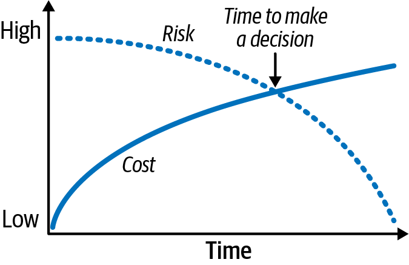
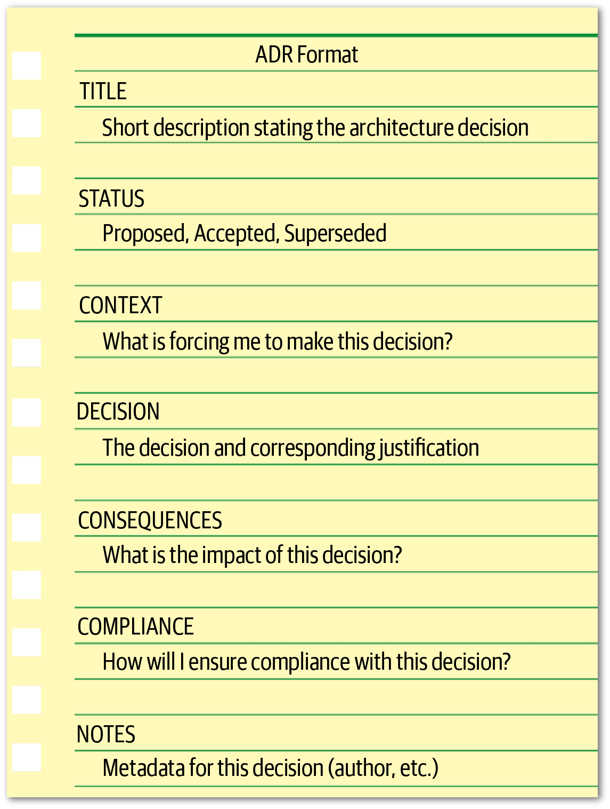
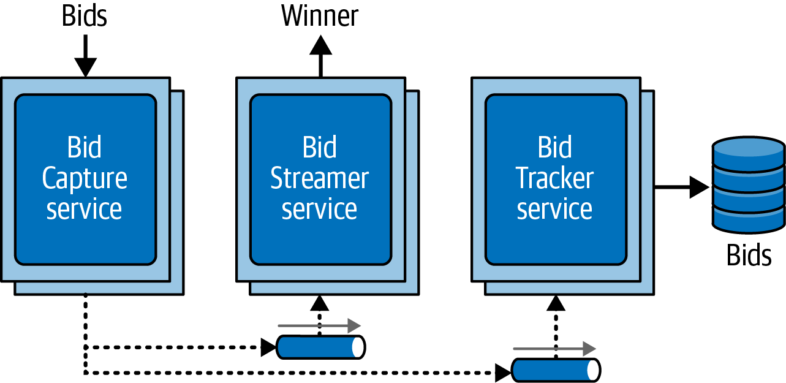
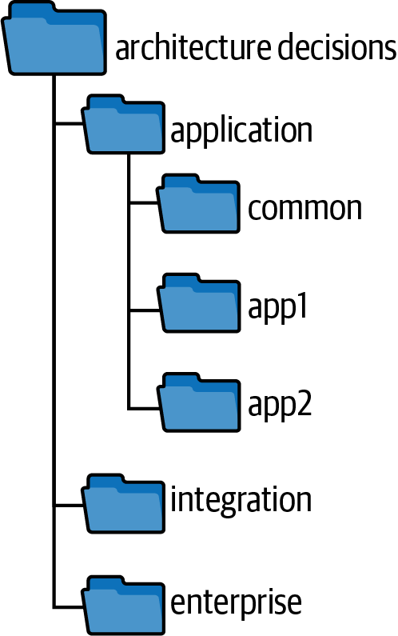

# Chapter 21. Architectural Decisions

A core responsibility of any architect is making architectural decisions—those critical choices regarding system structure and technology that impact the overall success of a project. A high-quality architectural decision doesn't just mandate a direction; it provides a roadmap that guides development teams toward the right technical choices.

The process of making these decisions involves:
1.  Gathering relevant information.
2.  Justifying the choice based on trade-offs.
3.  Documenting the decision for future reference.
4.  Communicating it effectively to stakeholders.

---

## Architectural Decision Antipatterns
An **Antipattern** is a repeatable process that initially seems like a good idea but ultimately leads to negative results. In architectural decision-making, three common antipatterns often emerge in a progressive flow:

1.  **Covering Your Assets:** Avoiding decisions out of fear.
2.  **Groundhog Day:** Re-litigating the same decision over and over.
3.  **Email-Driven Architecture:** Decisions lost in the noise of communication channels.

To be an effective architect, you must learn to recognize and overcome all three.

---

## The Covering Your Assets Antipattern
This antipattern occurs when an architect avoids or defers a critical decision because they are afraid of making the wrong choice. This often leads to **Analysis Paralysis**, where the search for more information prevents any progress.

### Overcoming the Fear
There are two primary ways to combat this antipattern:

#### 1. The Last Responsible Moment
As illustrated in Figure 21-1, there is a "sweet spot" for making a decision. 
*   **Early:** Risk is high because you have little information.
*   **Late:** Cost is high because you are holding up development.
*   **The Intersection:** The **Last Responsible Moment** is when the cost of further deferral begins to exceed the risk of making the decision with current information.



#### 2. Collaborative Decision-Making
An architect cannot know every technical detail. By collaborating closely with development teams, you can validate your assumptions early.

**Example: The Replicated Cache**
*   **Decision:** Cache product reference data (weight, dimensions) in every service instance using a read-only replicated cache to reduce inter-service coupling.
*   **The Reality Check:** Upon implementation, the development team discovers that some services have strict memory constraints that make this approach impossible.
*   **The Outcome:** Because of the collaborative feedback loop, the architect can quickly adjust the decision before significant effort is wasted, reducing the overall risk of the project.

---

## The Groundhog Day Antipattern
Named after the 1993 movie, the **Groundhog Day Antipattern** occurs when a decision is relitigated over and over again because the stakeholders don't understand the reasoning behind it. 

### The Missing "Why"
This antipattern is almost always caused by a failure to provide a complete justification. To stop the cycle of endless debate, an architect must provide two types of justification:
1.  **Technical Justification:** Explain how the decision impacts architectural characteristics (e.g., "Decoupling services reduces resource consumption per unit").
2.  **Business Justification:** Explain why the business should invest in this change (e.g., "Decoupling improves time-to-market by allowing independent deployments").

### The Business Value Litmus Test
If you cannot find a business justification for an architectural decision, it's a strong signal that the decision shouldn't be made at all. Every technical choice should ultimately serve a business goal.

#### Common Business Justifications:
*   **Time to Market:** Faster releases.
*   **Cost:** Reduced operational or development expenses.
*   **User Satisfaction:** Better performance or reliability.
*   **Strategic Positioning:** Long-term competitive advantage.

> [!TIP]
> **Know Your Audience.** If your stakeholders care most about time-to-market, justifying a decision based solely on cost savings won't stop the "Groundhog Day" cycle. Align your justification with what the business values most.

---

## The Email-Driven Architecture Antipattern
Even when a decision is perfectly justified, it can fail if it isn't communicated effectively. The **Email-Driven Architecture Antipattern** occurs when decisions are lost in the noise of inbox communication, leading to developers unknowingly violating the architecture because they "never saw the email."

### The Problem with Email
Email is a communication tool, not a document repository. Using it to store architectural decisions creates several risks:
*   **Multiple Systems of Record:** Every copy of an email is a "snapshot" that can quickly become outdated.
*   **Information Silos:** New team members don't have access to historic email threads.
*   **Fragmentation:** Emails often omit critical details or justifications, triggering the **Groundhog Day Antipattern** all over again.

### The Solution: A Single System of Record
To overcome this antipattern, an architect must maintain a single, authoritative location for all decisions (such as a wiki, a version-controlled repository, or a dedicated document).

#### How to Communicate Decisions
When notifying stakeholders of a new decision, follow these rules:
1.  **Don't put the decision in the email body.** Mention only the context.
2.  **Provide a link.** Direct the reader to the single system of record.
3.  **Filter the audience.** Only notify people who are directly impacted by the decision.

**Example of an Effective Email:**
> *"Hi Sandra, I’ve made an important decision regarding **interservice communication** that impacts your team. Please review the details and justification here: [Link to Decision Record]"*

> [!IMPORTANT]
> **Context, not Content.** By linking to a single source of truth, you ensure that everyone sees the most current version of the decision and its full justification. This also makes it trivial to update the decision in the future without sending another "revised" email that might also be lost.

---

## Architecturally Significant Decisions
A common misconception is that if a decision involves a specific technology, it isn't "architectural." However, as Michael Nygard (author of *Release It!*) notes, a decision becomes **Architecturally Significant** if it impacts the system's core integrity or its ability to meet its requirements.

According to Nygard, a decision is architecturally significant if it affects any of the following five areas:

### 1. Structure
Decisions that impact the overall architecture patterns or styles. 
*   *Example:* Choosing to share a common library across microservices affects the "bounded context" and therefore the system's structure.

### 2. Non-functional Characteristics
If a technology choice directly impacts a required architectural characteristic (e.g., performance, scalability, security), it is an architectural decision.
*   *Example:* Selecting a specific NoSQL database because it offers the extreme scalability required by the domain.

### 3. Dependencies
Decisions regarding the coupling points between components or services.
*   *Example:* Defining how services interact—whether through synchronous REST or asynchronous messaging—impacts agility and reliability.

### 4. Interfaces
How services and components are accessed and orchestrated (e.g., gateways, service buses, API proxies). 
*   *Example:* Establishing a contract versioning and deprecation strategy is architecturally significant because it impacts every consumer of the system.

### 5. Construction Techniques
Decisions about platforms, frameworks, tools, or even development processes that impact the architecture's implementation.
*   *Example:* Mandating a specific testing framework to ensure a high level of testability across a distributed system.

---

## Architectural Decision Records (ADRs)
The most effective way to document and communicate architectural decisions is through **Architectural Decision Records (ADRs)**. First popularized by Michael Nygard in 2011, ADRs have become a standard practice for capturing the "why" behind an architecture.

An ADR is a concise text file (usually in Markdown or AsciiDoc) that describes a specific decision. By keeping these records in the codebase alongside the code they describe, you ensure that the documentation evolves with the system.

### Basic Structure
A standard ADR consists of five core sections, plus two recommended additions for better governance:

1.  **Title:** A sequentially numbered, descriptive phrase.
2.  **Status:** The current state of the decision (e.g., Proposed, Accepted, Superseded).
3.  **Context:** The problem being solved and the relevant constraints.
4.  **Decision:** The actual solution being mandated.
5.  **Consequences:** The expected impact, including both benefits and drawbacks.
6.  **Compliance (Recommended):** How the decision will be enforced (e.g., manual code review or automated fitness functions).
7.  **Notes (Recommended):** Metadata such as author, approval date, and stakeholders involved.



### The Title
The title is the first point of contact for anyone searching for a decision. It should be sequentially numbered and clearly state the context.

*   *Good Example:* **"42. Use of Asynchronous Messaging Between Order and Payment Services."**
*   *Bad Example:* **"Messaging Decision."** (Too vague; lacks context and sequence.)

### Status
The status section tracks the lifecycle of the decision. Every ADR typically carries one of three primary statuses:

1.  **Proposed:** The decision is awaiting approval from a lead architect or governance body (e.g., an Architecture Review Board).
2.  **Accepted:** The decision has been approved and is now the "law of the land" for implementation.
3.  **Superseded:** The decision has been replaced by a newer one. This creates a powerful **historical trail**, allowing future architects to see exactly *why* a previous approach (e.g., messaging) was replaced by a newer one (e.g., REST).

#### ADR Versioning Example:
*   **ADR 42 (Old):** Status: *Superseded by 68*
*   **ADR 68 (New):** Status: *Accepted, supersedes 42*

### Request for Comments (RFC)
To foster collaboration, architects often use an **RFC** status. This involves sharing a draft ADR with the development team and setting a firm deadline for feedback. Once the deadline passes, the architect reviews the input and moves the ADR to *Proposed* or *Accepted*.

> **STATUS:** *Request For Comments, Deadline 09 JAN 2026*

### Governance and Approval Criteria
The status section also forces a conversation about **authority**. Not every decision needs to go to a review board. Organizations should establish clear thresholds for when an architect can approve their own decision:

*   **Cost:** Does the implementation (licensing, hardware, FTE hours) exceed a certain dollar amount (e.g., $5,000)?
*   **Cross-Team Impact:** Does this decision impact other services or teams?
*   **Security:** Does the choice have implications for the system's security posture?

> [!TIP]
> **Define the Boundaries.** Document these thresholds clearly so that architects know exactly when they have the autonomy to act and when they must seek higher-level approval.

### Context
The **Context** section specifies the "forces at play." It answers the question: *"What situation is forcing me to make this decision?"* 

*   **Scope:** Describe the specific circumstances and constraints. 
*   **Alternatives:** Briefly mention the alternatives considered (e.g., "This could be done using REST or asynchronous messaging"). If you need to document a deep dive into each alternative, use a separate **Alternatives** section to keep the context concise.

### Decision
The **Decision** section contains the mandated solution along with its **full justification**.

#### Use an Affirmative Voice
State decisions in a clear, commanding voice. 
*   **Correct:** *"We will use asynchronous messaging between services."*
*   **Incorrect:** *"I think asynchronous messaging might be a good idea."* 

An affirmative voice removes ambiguity and makes it clear that a decision has actually been made.

#### The "Why" is More Important Than the "How"
The most powerful part of an ADR is the **justification**. Stakeholders are far more likely to agree with a decision if they understand the rationale behind it.

**Example: gRPC vs. REST**
*   **The Decision:** An architect chooses gRPC for inter-service communication to minimize network latency.
*   **The Risk:** Years later, a new architect might switch to REST for "consistency," unaware that gRPC was chosen for a specific performance requirement.
*   **The ADR Solution:** A well-documented ADR would explicitly state: *"We are using gRPC to reduce latency (at the cost of tighter coupling)."* This knowledge prevents the new architect from introducing performance bottlenecks by switching to a "more consistent" but slower protocol.

### Consequences
Every architectural decision has an impact, and the **Consequences** section is where you document the expected outcomes—both positive and negative. 

#### Documenting Trade-offs
This is the ideal place to record your **Trade-off Analysis**. For example, if you choose asynchronous messaging to improve responsiveness from 3.1 seconds down to 25 milliseconds, you must acknowledge the consequence: **Increased Error Handling Complexity**. 

Documenting this prevents later disagreements (e.g., *"Why didn't we use synchronous calls for better error feedback?"*) by showing that the team consciously chose performance over simple error management.

### Compliance (Highly Recommended)
While not in the original standard, we recommend adding a **Compliance** section to specify how the decision will be measured and enforced.

*   **Manual Governance:** Code reviews or periodic audits.
*   **Automated Governance (Fitness Functions):** Using tools like **ArchUnit** (Java) or **NetArchTest** (C#) to ensure the architecture doesn't drift.

**Example Fitness Function (ArchUnit):**
If you decide that all shared objects must reside in a specific "Shared Services" layer (Figure 21-3), you can enforce it with code:

```java
@Test
public void shared_services_should_reside_in_services_layer() {
    classes().that().areAnnotatedWith(SharedService.class)
        .should().resideInAPackage("..services..")
        .check(myClasses);
}
```

### Notes (Highly Recommended)
The **Notes** section provides vital metadata about the decision that might be hard to track in a version-control system alone:
*   **Original Author**
*   **Approval Date & Stakeholder**
*   **Last Modified Date & Reason**
*   **Superseded Date**

---

## ADR Example: Going, Going, Gone (GGG)
To see how these principles come together, let's look at a real-world decision from the **Going, Going, Gone** auction system.

### The Decision: Separate Queues vs. Pub/Sub
In the GGG system, the Bid Capture service must forward bids to both the Bid Streamer (for the live feed) and the Bid Tracker (for the database). 



Without a formal ADR, developers might default to a single Pub/Sub topic. However, a closer look at the trade-offs led to the following decision:

---

### **ADR 76: Separate Queues for Bid Streamer and Bid Tracker Services**

**STATUS:** Accepted

**CONTEXT:** 
The Bid Capture service must forward bids to the Bid Streamer and Bidder Tracker. This could be done via a single topic (pub/sub), separate point-to-point queues, or REST via the API layer.

**DECISION:** 
We will use **separate point-to-point queues** for the Bid Streamer and Bidder Tracker services.

**Justification:**
1.  **Strict Ordering:** The Bid Streamer requires FIFO (First-In, First-Out) ordering to ensure the stream reflects the actual sequence of bids.
2.  **Diverse Data Needs:** The Bid Streamer only needs the *first* bid for a given amount (e.g., the first "I'll pay $100"), whereas the Tracker needs *every* bid for audit purposes. Using a single topic would force the Streamer to manage complex shared state to filter duplicates.
3.  **Backpressure Management:** The Bid Streamer is fast (in-memory cache), while the Tracker is slower (database persistence). Separate queues allow us to apply backpressure to the Tracker without slowing down the live Streamer feed.

**CONSEQUENCES:**
*   Requires high-availability clustering for the message broker.
*   Bid Capture must handle the logic of sending to multiple destinations.
*   **Security:** Internal events will bypass API-layer security. (Reviewed and accepted by ARB on 14 JAN 2025).

**COMPLIANCE:**
Periodic manual code reviews will verify that point-to-point messaging is being maintained between these specific services.

**NOTES:**
*   **Approved:** Architecture Review Board (ARB), 14 JAN 2025

---

## Storing ADRs
Once created, ADRs must be stored in a way that ensures they are visible, searchable, and persistent.

### Where to Store ADRs
*   **In-Repo (Git):** Keeping ADRs in the same repository as the source code is great for small teams. It ensures that the documentation is versioned alongside the code.
*   **Dedicated ADR Repository or Wiki:** For larger organizations, we recommend a centralized approach. This ensures that stakeholders who may not have access to specific code repositories (like product managers or security teams) can still review architectural decisions. It also provides a home for decisions that span multiple systems.

### Recommended Directory Structure
A consistent structure (Figure 21-5) helps everyone find what they need, regardless of the system context.



*   **`common/`:** Decisions that apply to all applications (e.g., *"All framework classes must be annotated with @Framework"*).
*   **`application/`:** Subdirectories for specific products or systems (e.g., `app1/`, `app2/`).
*   **`integration/`:** Decisions governing communication between different applications or services.
*   **`enterprise/`:** Global architectural decisions that impact the entire organization (e.g., *"All access to a system database must be via the owning service; no shared databases"*).

> [!TIP]
> **Consistency is Key.** Whether you use a Git repository, a wiki, or a shared drive, ensure the naming and navigation structure are consistent across the entire organization. This prevents the "Where was that decision recorded?" problem from becoming a recurring issue.

---

## The Broader Value of ADRs

### ADRs as Living Documentation
While standards for diagramming architecture exist (such as the **C4 Model** or **ArchiMate**), documenting the *rationale* behind a system remains a challenge. ADRs solve this by providing:
*   **Context:** A description of the problem space and alternatives.
*   **Decision:** The "meat" of the documentation—the rationale for why a choice was made.
*   **Consequences:** The trade-off analysis that explains why certain traits (e.g., performance) were prioritized over others (e.g., scalability).

### Redefining Standards
Standards are often perceived by developers as arbitrary "control." ADRs transform standards into **justified guidelines**. 
*   **Validation:** If an architect cannot justify a standard in the *Decision* section of an ADR, the standard probably shouldn't exist.
*   **Engagement:** When developers understand *why* a standard exists (e.g., to reduce support costs or ensure security compliance), they are much more likely to adopt it rather than fight it.

### ADRs in Existing (Legacy) Systems
Many architects wonder if ADRs are worth the effort for systems already in production. The answer is a resounding **yes**.
*   **Investigation:** Start by writing ADRs for the most critical parts of the system. If the "why" isn't known (perhaps the original author left years ago), the current architect must analyze the existing implementation to validate or invalidate it.
*   **Building a Brain Trust:** This investigative work builds a knowledge base that prevents "archaeological" refactoring and helps identify long-standing architectural inefficiencies. 

> [!IMPORTANT]
> **Capture the Tribal Knowledge.** For existing systems, ADRs act as a net to catch the "tribal knowledge" that often lives only in the heads of senior developers. Documenting it now saves countless hours for the architects and developers of the future.

---

## Leveraging Generative AI in Architectural Decisions
With the rise of large language models (LLMs), many architects are exploring whether AI can help make or validate architectural decisions. While GenAI can be a useful tool, it has significant limitations in the realm of high-level architecture.

### The "It Depends" Problem
Most LLMs are trained to identify the most *probable* answer or a generic "best practice." However, as we know from the **First Law of Software Architecture**, there are no best practices—only trade-offs. 

An architectural decision depends entirely on the specific business and technical context. For example:
*   **The Scenario:** Should payment processing be a single service or one service per payment type?
*   **The Context:** If the business prioritizes **Time to Market**, maintainability (multiple services) is more important than performance (single service).
*   **The AI Flaw:** An LLM might recommend a single service because it is a "proven pattern" for performance, completely missing the specific business goal of rapid feature delivery.

### Knowledge vs. Wisdom
Architectural decisions require translating abstract business concerns (e.g., "sustained growth") into concrete architectural characteristics (e.g., "scalability" and "evolvability"). This translation requires years of experience and a deep understanding of the organization's unique environment.

*   **What AI is good at:** Outlining a broad list of possible trade-offs or identifying options you might have missed.
*   **What AI is bad at:** Making the final, nuanced decision that aligns with strategic business goals.

> [!CAUTION]
> **Don't Outsource Your Wisdom.** Generative AI tools have an abundance of knowledge but lack the wisdom required to navigate the complex social, technical, and business webs that define a successful architecture. Use AI to assist your thinking, but never to replace the critical trade-off analysis that is the hallmark of a professional architect.

---
