# Chapter 22. Analyzing Architecture Risk

Every architecture inherently carries risk. Some risks are **operational** (availability, scalability, data integrity), while others are **structural** (static coupling, architectural decay). Analyzing these risks is one of an architect's most critical activities, as it enables the team to identify deficiencies and take corrective action before they become catastrophic.

In this chapter, we explore techniques for quantifying and assessing risk, including the objective use of a risk matrix and a collaborative activity known as "risk storming."

---

## The Risk Matrix
Assessing risk can often feel subjective—one architect's "high risk" might be another's "medium risk." To make this process more measurable and objective, architects use a **Risk Assessment Matrix**.

### How it Works
The matrix (Figure 22-1) qualifies risk across two dimensions:
1.  **Impact:** What is the overall effect on the system if the risk is realized?
2.  **Likelihood:** How probable is it that this risk will actually occur?

The architect rates each dimension on a scale of 1 to 3:
*   **1:** Low
*   **2:** Medium
*   **3:** High

By multiplying these two numbers, we arrive at a numerical risk rating:
*   **1–2:** **Low Risk** (Green)
*   **3–4:** **Medium Risk** (Yellow)
*   **6–9:** **High Risk** (Red)

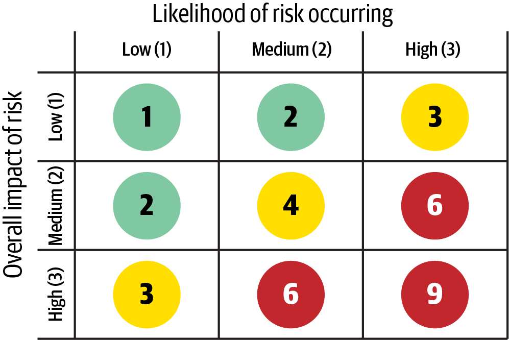

> [!TIP]
> **Order of Operations.** When using the matrix, always consider **Impact** first and **Likelihood** second. If you are uncertain about the likelihood, default to a high rating (3) until you can confirm otherwise.

### Example: Database Availability
Suppose you are concerned about the availability of the primary central database.
1.  **Impact:** If the database goes down, the entire application stops. This is a **High Impact (3)**.
2.  **Likelihood:** The database is hosted on highly available, clustered servers with redundant power and networking. The probability of failure is **Low (1)**.
3.  **Result:** $3 \times 1 = 3$. The overall risk is rated as **Medium**.

---

## Risk Assessments
A **Risk Assessment** is a summarized report of an architecture's overall health. It uses meaningful criteria (architectural characteristics) and applies them to a specific context (domains or subdomains).

### The Report Format
The standard risk assessment (Figure 22-2) uses a spreadsheet-like format:
*   **Vertical Axis:** Risk Criteria (e.g., Availability, Scalability, Data Integrity).
*   **Horizontal Axis:** Context (e.g., Customer Registration, Catalog Checkout, Order Fulfillment).

> [!TIP]
> **Use Domain Context, Not Service Context.** Analyzing risk at the service level is usually too fine-grained. Using domains or subdomains allows you to capture risks involving the communication and coordination between multiple services.

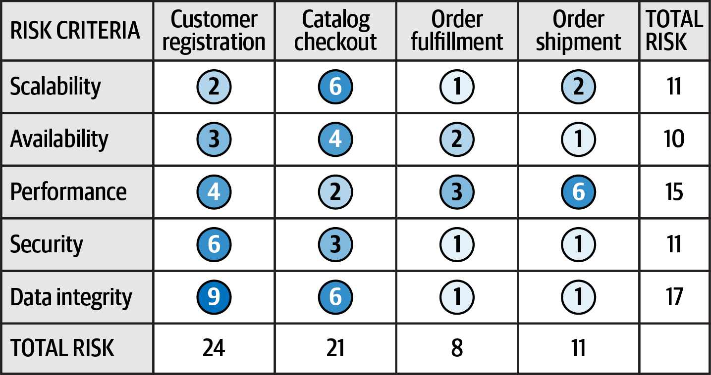

### Signal-to-Noise Ratio (Filtering)
When presenting to stakeholders, the full matrix can be overwhelming. To improve the **signal-to-noise ratio**, you can filter the assessment to show *only* the high-risk areas (Figure 22-3). This highlights the critical "signal" while removing the distraction of low-risk "noise."

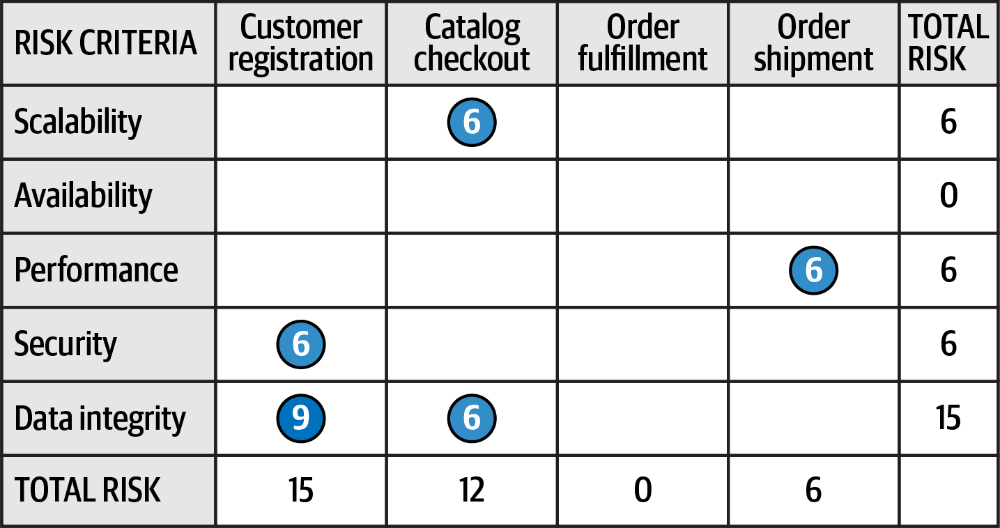

### The Direction of Risk
A static assessment is only a snapshot in time. To understand if the architecture is improving or decaying, you must track the **direction of risk** using continuous measurements from fitness functions.

As shown in Figure 22-4, you can add symbols to indicate trends:
*   **$\triangle$ (Upward Triangle):** The risk is getting worse (numerical rating is increasing).
*   **$\nabla$ (Downward Triangle):** The risk is lessening (numerical rating is decreasing).
*   **$\bigcirc$ (Circle):** The risk is stable.

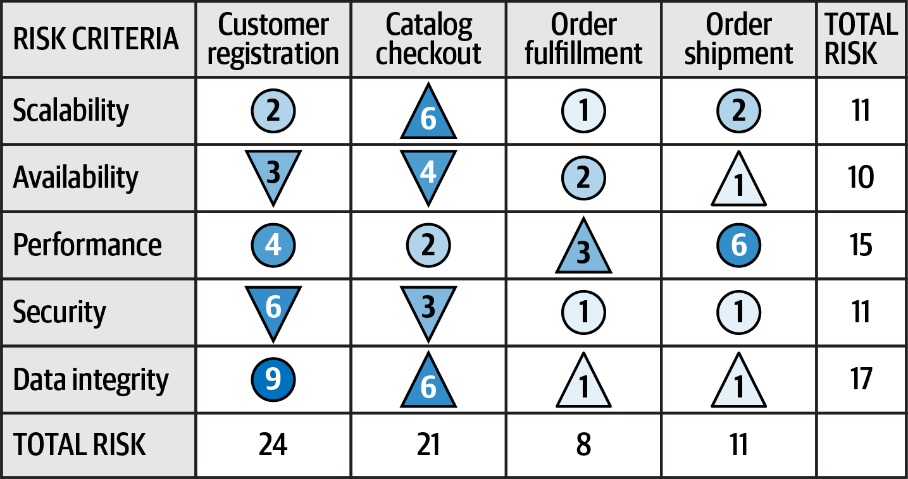

#### Example Storytelling
By adding direction, the assessment tells a deeper story. If **Data Integrity** shows an upward triangle across multiple domains (Checkout, Fulfillment, Shipping), it could indicate a systemic database issue or shared schema problem that needs immediate attention. Conversely, a downward triangle in **Security** shows that recent hardening efforts are working.

---

## Risk Storming
No architect can singlehandedly identify every risk in a system. **Risk Storming** is a collaborative exercise designed to uncover architectural deficiencies by bringing together multiple perspectives.

### Why Risk Storming?
Collaborative risk assessment is superior to individual analysis for two reasons:
1.  **Knowledge Gaps:** Very few architects have deep knowledge of every component in a complex system.
2.  **Blind Spots:** An individual is prone to overlooking risks they've grown accustomed to or deem "unlikely."

We strongly recommend including **senior developers and tech leads** in these sessions. They provide a critical implementation perspective and gain a deeper understanding of the architecture in the process.

### The Three Phases
Risk storming follows a structured three-phase process:

1.  **Phase 1: Identification (Individual):** Participants work alone using the risk matrix to rate various parts of the architecture. Working individually is essential to prevent "groupthink" or louder voices from biasing the results.
2.  **Phase 2: Consensus (Collaborative):** The group reviews the individual findings to identify areas of agreement and disagreement, ultimately arriving at a unified risk view.
3.  **Phase 3: Mitigation (Collaborative):** The team brain-storms technical and structural solutions to reduce or eliminate the identified high-risk areas.

### The Foundation: Architecture Diagrams
All phases rely on a clear, up-to-date architecture diagram (Figure 22-5). The facilitator must ensure that all participants are working from the same visual representation of the system.

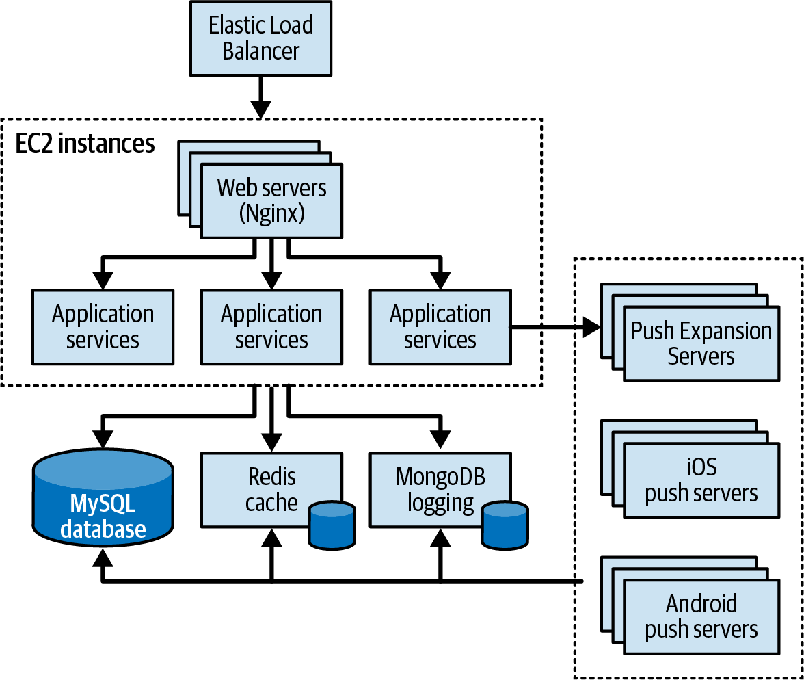

> [!NOTE]
> The diagram above shows a typical cloud-based stack with a load balancer, application servers, and multiple databases (MySQL, Redis, MongoDB). This will serve as our baseline for the phase-by-phase walkthrough.

---

## Phase 1: Identification
The **Identification Phase** is an individual activity where each participant identifies risk areas without outside influence. Unbiased input is critical to ensuring a comprehensive view of the system's vulnerabilities.

### The Three Steps of Identification
1.  **Preparation:** The facilitator sends an invitation containing the architecture diagram, the specific risk criteria/context to be analyzed, and logistical details for the collaborative sessions.
2.  **Individual Analysis:** Participants use the risk matrix to analyze the architecture independently.
3.  **Classification:** Participants record their findings on color-coded sticky notes:
    *   **Low (1–2):** Green sticky note.
    *   **Medium (3–4):** Yellow sticky note.
    *   **High (6–9):** Red sticky note.

### Scoping the Effort
Risk-storming sessions are most effective when they are tightly focused on a single criterion (e.g., *"Where are our security risks?"*) or a single context (e.g., *"What are the risks in Customer Registration?"*). 

If you must analyze multiple criteria at once, participants should write the specific characteristic (e.g., "Performance" or "Availability") next to the risk score on their sticky note. This ensures that when two people identify a high risk (6) on the same component, the team knows whether they are worried about the same thing.

> [!TIP]
> **Stay Focused.** Whenever possible, restrict your risk-storming effort to a single dimension. This prevents confusion and allows participants to apply a higher level of concentration to the specific problem at hand.

---

## Phase 2: Consensus
The **Consensus Phase** is a highly collaborative session where the group aligns their individual findings into a unified view of the system's risk.

### The Setup
The facilitator displays a large version of the architecture diagram. Participants place their color-coded sticky notes on the specific components they identified as risks (Figure 22-6).

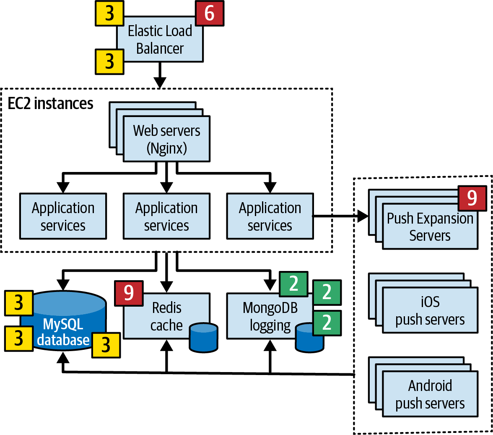

### Analyzing the Findings
Once the board is "populated," the team works through each area to reach a consensus.

#### 1. Areas of Agreement
If everyone agrees on a risk level (e.g., all participants mark the MySQL database as Medium), no further discussion is needed. These are confirmed risks.

#### 2. Resolving Discrepancies
When opinions differ, the team must discuss the **Impact** and **Likelihood**. 
*   **Example (ELB):** One participant rates the Load Balancer as High (6) due to the impact of it going down. Others argue that since it's a clustered service, the likelihood is Low (1), bringing the consensus score down to Medium (3).

#### 3. Uncovering Hidden Risks
Sometimes, a single participant flags an area that no one else noticed.
*   **Example (Push Servers):** A senior developer flags the Push Expansion Servers as High (9) because they've seen them crash under similar loads in previous projects. Without this collaborative phase, this critical risk would have remained hidden until production.

#### 4. The Rule of the Unknown
A unique case occurs when a participant flags a technology as "unknown." 
*   **Example (Redis):** A developer marks Redis as High (9) because they don't know how to use it. This is a vital signal—unknown or unproven technologies represent a high risk to the project's success.

> [!TIP]
> **The Highest Risk is the Unknown.** Always assign unproven or unknown technologies the highest risk rating (**9**). The risk matrix relies on data; if you don't know the technology, you cannot accurately assess its likelihood of failure.

### Outcome
This phase ends once the team has discussed every discrepancy and agreed on a consolidated risk level for every flagged area (Figure 22-7).

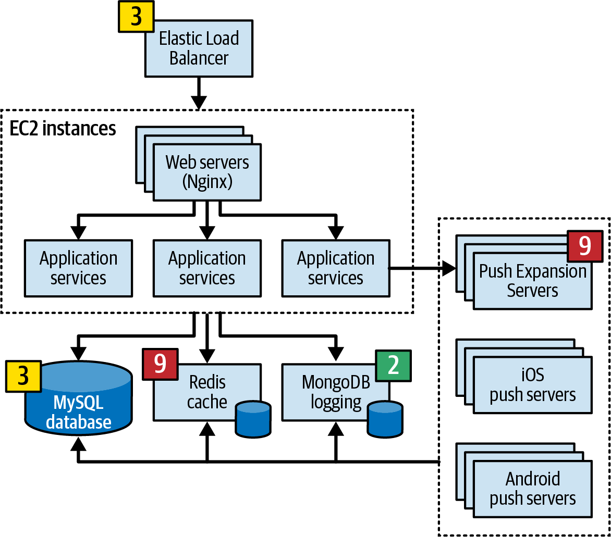

---

## Phase 3: Risk Mitigation
The final phase of risk storming is **Mitigation**. Once the group has reached consensus on the high-risk areas, the team must brain-storm ways to reduce or eliminate those risks.

### Strategies for Mitigation
Mitigation often requires changing an architecture that otherwise might have been considered "perfect." Solutions can range from:
*   **Minor Refactoring:** Adding a queue for backpressure to resolve a throughput bottleneck.
*   **Major Structural Shifts:** Changing the entire communication style or data topology to address availability or data integrity issues.

### Negotiating with Stakeholders
Because mitigation almost always incurs additional costs, this phase requires the involvement of **key business stakeholders**. The architect's role is to present the risk and the proposed solution, while the stakeholders must decide if the cost of mitigation is justified by the reduction in risk.

#### Example: The Database Compromise
Suppose the team identifies a **Medium Risk (4)** for central database availability.
1.  **Proposed Solution A:** Full database clustering. Cost: **$50,000**.
2.  **The Stakeholder Response:** The business owner decides the $50k price tag is too high for a medium risk.
3.  **Proposed Solution B (The Compromise):** Splitting the database into two separate domain-based databases. Cost: **$16,000**.
4.  **The Outcome:** The stakeholders agree to this lower-cost compromise, which still significantly reduces the risk profile.

### Summary of Risk Storming
Risk storming is a powerful vehicle for identifying hidden risks, improving architectural integrity, and structuring the essential negotiations between technical teams and business stakeholders. By quantifying risk and making it visible, architects can drive more informed decisions that balance technical excellence with business reality.

---

## User-Story Risk Analysis
Beyond high-level architecture, risk storming can be adapted for day-to-day agile processes, such as **Story Grooming**. 

Teams can use the same risk matrix to evaluate user stories within an iteration:
1.  **Impact:** What is the effect on the iteration goals if this story is *not* completed?
2.  **Likelihood:** How probable is it that the story will *not* be completed (due to complexity, dependencies, or unknowns)?

By quantifying these factors, teams can identify high-risk stories early, track them more aggressively, and prioritize them to ensure iteration success.

---

## Risk-Storming Use Case: The Nursing Hotline
To illustrate the power of risk storming in a complex scenario, let's examine a support system for a medical call center where nurses advise patients on health conditions.

### System Requirements
*   **Diagnostics Engine:** A third-party engine (handling ~500 req/sec) guides nurses and patients through medical questions.
*   **Dual Access:** Patients use a self-service website; nurses use a dedicated call-center portal.
*   **Scalability:** Must support 250 concurrent nurses and *hundreds of thousands* of concurrent self-service patients.
*   **HIPAA Compliance:** Nurses can access medical records via an exchange; patients cannot. Security is paramount.
*   **Elasticity:** Must handle extreme volume spikes during outbreaks (e.g., flu, COVID).
*   **Skill-Based Routing:** Calls are routed based on languages and specializations.

### The Initial Architecture
Logan, the architect, designed the high-level system shown in Figure 22-8.

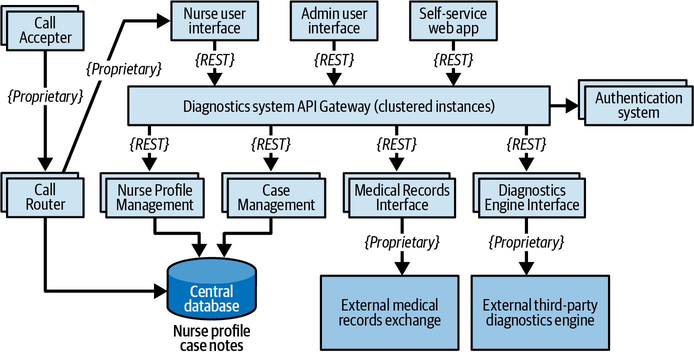

#### Key Components:
*   **Three User Interfaces:** Self-service (Patients), Nurse Portal, and Admin Portal (Profile Management).
*   **Call Center Services:** Call Accepter and Call Router (for skill-based assignments).
*   **Diagnostics API Gateway:** Handles security checks and directs traffic to backend services.
*   **Core Services:** Case Management, Nurse Profile Management, Medical Records Interface, and Diagnostics Engine Interface.
*   **Protocols:** Primarily REST, with proprietary protocols for external system integration.

Logan believes the architecture is ready for implementation, but to be sure, he initiates a **Risk Storming** exercise focused on **Availability, Elasticity, and Security**.

---

### Step 1: Availability Risk Analysis
The team begins by focusing on **Availability**, identifying several critical vulnerabilities (Figure 22-9).

#### Identified Risks:
1.  **Central Database:** **High Risk (6)**. High impact (system shutdown) and medium likelihood.
2.  **Diagnostics Engine:** **High Risk (9)**. High impact and unknown likelihood (third-party).
3.  **Medical Records Interface:** **Low Risk (2)**. While useful, it is not required for the core diagnostic outcome.

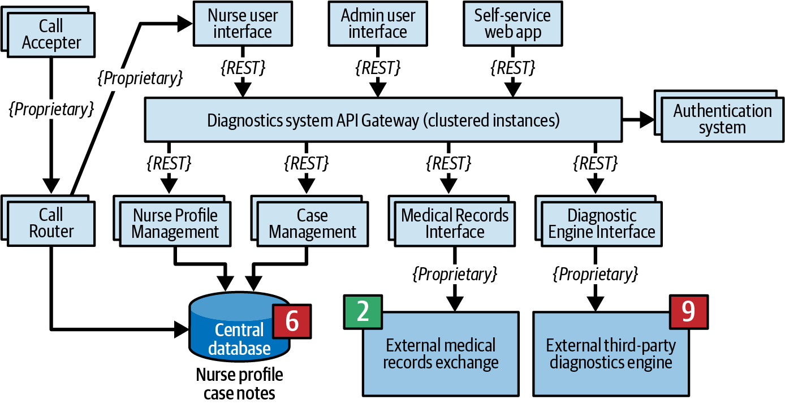

#### Mitigation Strategies:
*   **The Database Split:** To protect the critical call-routing function, the team decides to split the monolithic database into two physical units. 
    *   **Nurse Profile DB:** Clustered for high availability (essential for routing).
    *   **Case Notes DB:** Single-instance (nurses can take manual notes if this fails).
*   **External System Validation:** For the third-party systems, the team researches **SLAs (Service Level Agreements)**.
    *   **Diagnostics Engine:** 99.99% availability (52.6 min/year).
    *   **Medical Records:** 99.90% availability (8.77 hours/year).
    *   The confirmation of these strong SLAs provides enough confidence to remove the "unknown" risk.

The resulting mitigated architecture (Figure 22-10) now features isolated data stores and documented third-party performance guarantees.

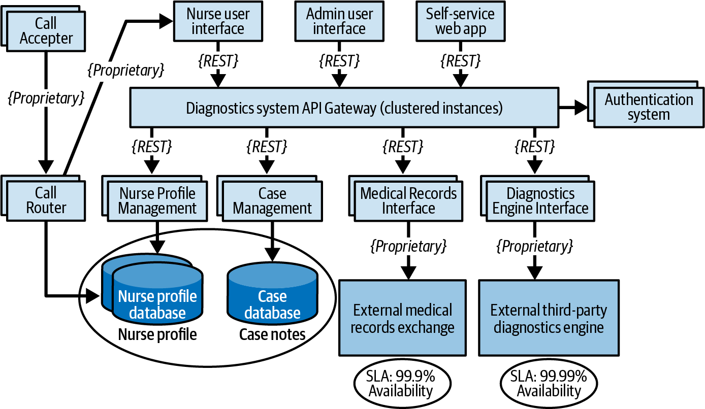

---

### Step 2: Elasticity Risk Analysis
The second risk-storming exercise focuses on **Elasticity**—the system's ability to handle massive, variable spikes in load during flu or COVID outbreaks.

#### Identified Risks:
*   **Diagnostics Engine Throughput:** **High Risk (9)**. While 250 nurses are a stable load, hundreds of thousands of concurrent self-service patients create a bottleneck. The third-party engine is limited to 500 requests per second, which is insufficient for peak outbreak volumes.

#### Mitigation Strategies:
To address this bottleneck, the team moves beyond simple REST calls and implements several sophisticated patterns (Figure 22-11):

1.  **Asynchronous Queuing (Backpressure):** The team replaces the direct REST interface between the API Gateway and the Diagnostics Engine with asynchronous messaging. This provides a buffer to handle bursts without crashing the interface.
2.  **The Ambulance Pattern:** Recognizing that nurses' medical advice is more critical than self-service lookups, the team implements two separate messaging channels. This allows the system to prioritize "Ambulance" (Nurse) requests over standard patient traffic.
3.  **Outbreak Caching:** To drastically reduce the volume of requests hitting the engine, the team introduces the **Diagnostics Outbreak Cache Server**. This service caches common outbreak-related questions (e.g., flu symptoms), serving them directly to patients and bypassing the engine entirely for high-traffic scenarios.

This modified architecture ensures that even during a massive outbreak, nurses can still assist patients, while the "high-noise" self-service traffic is safely managed and prioritized.

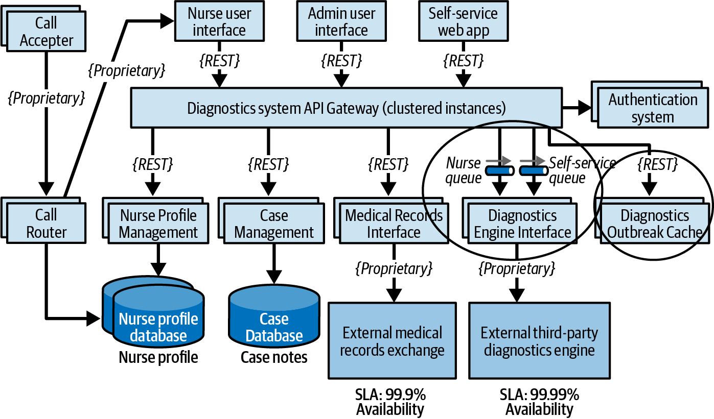

---

### Step 3: Security Risk Analysis
The final risk-storming session addresses **Security**, with a specific focus on HIPAA compliance regarding patient medical records.

#### Identified Risks:
*   **Monolithic API Gateway:** **High Risk (6)**. High impact (HIPAA violation) and medium likelihood. While the architect initially felt that authentication checks were sufficient, the participants correctly identified that funneling all traffic (Admin, Self-service, and Nurse) through a single gateway created an unnecessary risk of accidental exposure or exploitation.

#### Mitigation Strategies:
The group decides that the only way to ensure strict isolation is to partition the entry points into the system (Figure 22-12):

*   **Segregated API Gateways:** The team replaces the single gateway with three distinct instances tailored to each user group:
    1.  **Nurse API Gateway:** The only gateway with a connection to the Medical Records Interface.
    2.  **Self-Service API Gateway:** Dedicated to patient diagnostic traffic.
    3.  **Admin API Gateway:** Dedicated to profile management and configuration.

By physically segregating these gateways, the architecture guarantees that non-nurse traffic (Patients and Admins) is network-isolated from the sensitive medical records exchange.

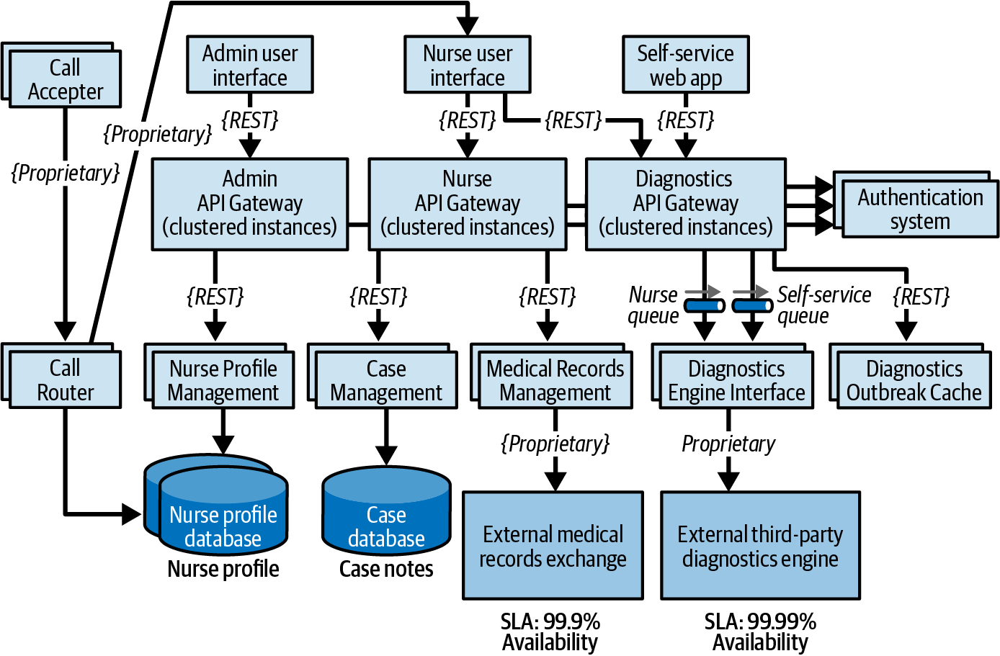

### Summary: The Transformed Architecture
The original architecture (Figure 22-8) was deemed "ready" before risk storming began. However, through collaborative analysis, it was transformed into a significantly more robust system (Figure 22-12).

By quantifying and assessing **Availability, Elasticity, and Security**, the team moved from a generalized design to a context-specific, defensible architecture capable of handling extreme loads while maintaining strict regulatory compliance.

---
