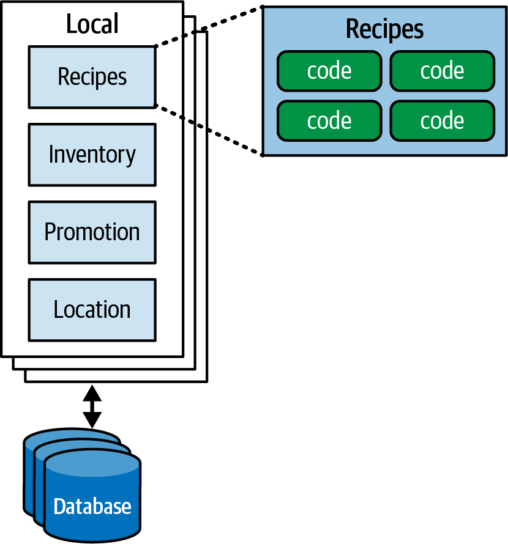
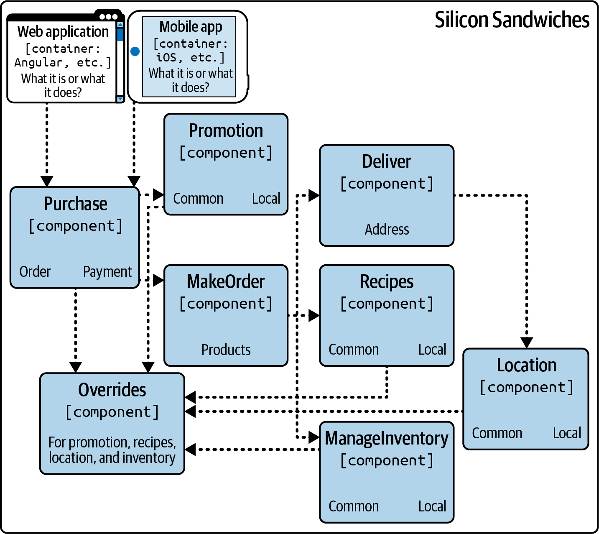
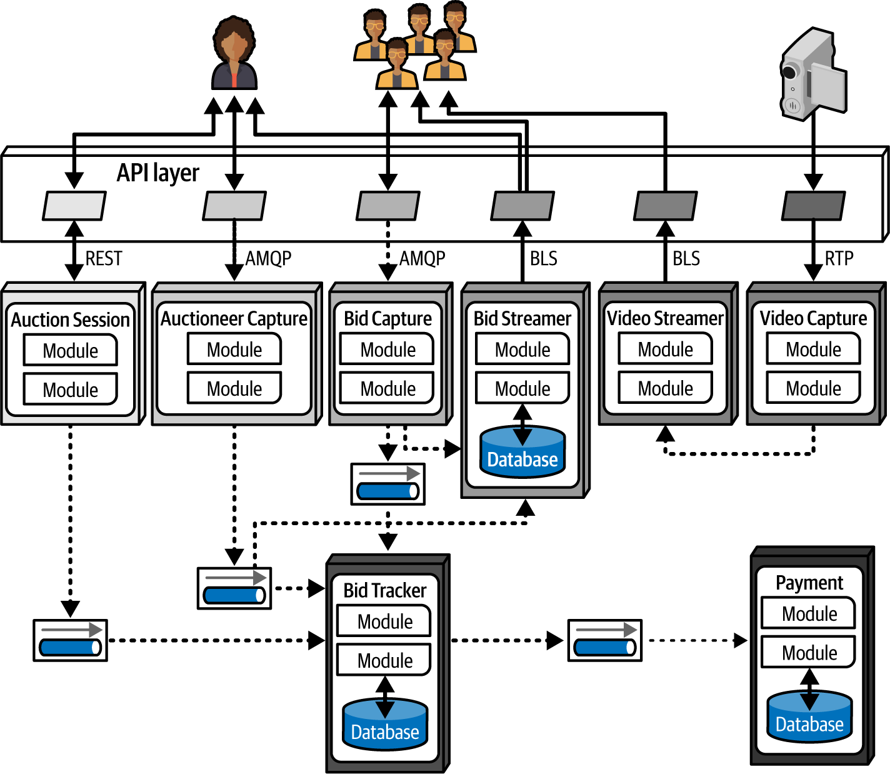

# Chapter 23. Diagramming Architecture

Newly minted software architects are often surprised by how much of their role is centered on communication rather than just technical implementation. No matter how brilliant a technical idea is, if an architect cannot convince stakeholders to fund it or developers to build it, that brilliance will never manifest. **Diagramming** is one of the most critical communication skills an architect can master.

To effectively describe an architecture, an architect must present multiple views—starting from a high-level topology and drilling down into specific design details. However, showing a detailed view without its context in the larger system often leads to confusion.

---

## Representational Consistency
**Representational consistency** is the practice of always showing the relationship between components before changing views or zooming into details. This principle is vital in both diagrams and presentations to ensure the audience maintains a sense of scope and context.

### The Drill-Down Pattern
When moving from a high-level view to a detailed one, follow a logical progression:
1.  **System Topology:** Show the entire system and where the component fits.
2.  **The Relationship:** Highlight the interaction between the system and the specific area of interest.
3.  **The Deep Dive:** Provide the internal details of that specific area.

#### Example: Silicon Sandwiches
If you wanted to describe the plug-in architecture for the Silicon Sandwiches solution, you wouldn't start with the internal logic of a single plug-in. Instead, you would:
*   Show the overall microservices topology.
*   Identify the specific service that hosts the plug-ins.
*   Show the relationship between that service and the plug-in registry.
*   Finally, zoom into the internal design of the plug-in interface itself.

> [!IMPORTANT]
> **Eliminate Confusion.** By maintaining representational consistency, you ensure that your viewers always understand the *scope* of what they are looking at, preventing the common source of confusion where stakeholders mistake a component-level detail for a system-level requirement.

---

## Tools and Artifacts
While professional diagramming tools are essential, an architect must also embrace **low-fidelity artifacts**, especially during the early stages of design. 

### The "Irrational Artifact Attachment" Antipattern
This antipattern describes the proportional relationship between a person's irrational attachment to an artifact and the amount of time they spent creating it. 
*   **The Trap:** If you spend four hours crafting a beautiful, high-fidelity diagram in Visio or Lucidchart, you will be much more resistant to feedback that requires you to change it.
*   **The Solution:** Use **ephemeral artifacts** (whiteboards, digital tablets, or sticky notes) early in the process. These "just-in-time" artifacts allow the design to emerge through collaboration and discussion without the "ceremony" of a polished drawing.

> [!TIP]
> **Go Digital with Low-Fidelity.** Many modern architects have moved from physical whiteboards to tablets with unlimited canvases. Digital sketches are easier to iterate on (copy/paste), don't suffer from camera glare, and are instantly shareable with remote team members.

### Core Features of Professional Tools
Once the design has stabilized, move to a high-fidelity tool. Ensure your tool of choice supports these three baseline features:
1.  **Layers:** For logical grouping and incremental "builds" during presentations.
2.  **Stencils/Templates:** For amassing a library of reusable icons (e.g., standard microservice or database symbols), ensuring consistency across the organization.
3.  **Magnets:** For automatic line snapping and alignment, keeping the diagram clean as you move components around.

---

## Semantic Layering
When using professional tools, use layers **semantically** (to contribute meaning) rather than decoratively. A well-layered diagram should be built like an onion:

*   **The Base Layer (Architecture):** Focus on the topology. Use abstract terms like "Synchronous Communication" and "Datastore" rather than specific product names. This layer represents the *intent* of the architecture.
*   **The Implementation Layer:** Overlay the specifics—PostgreSQL, Kafka, REST, etc.
*   **Contextual Layers:** Add layers for metadata such as **Domain-Driven Design (DDD) boundaries**, security zones, or transactional scope.

By structuring diagrams this way, you can toggle implementation details on or off depending on whether you are speaking to a business stakeholder (who cares about topology) or a developer (who needs the specifics).

---

## Diagramming Standards
The software industry uses several formal standards for technical diagrams. Choosing the right one depends on your organization's needs and the level of detail required.

### UML (Unified Modeling Language)
Created in the 1980s by the "Three Amigos" (Booch, Jacobson, and Rumbaugh), UML was intended to unify competing design philosophies. While it remains a standard in some large organizations, it is often criticized for being overly complex.
*   **What is still useful:** Class diagrams (structure) and Sequence diagrams (workflow).
*   **The Reality:** Most other UML diagram types have fallen into disuse as teams favor more lightweight approaches.

### The C4 Model
Developed by Simon Brown, the C4 model is a modern, hierarchical approach to diagramming that addresses many of UML's deficiencies. It uses four levels of abstraction:

1.  **Context:** The highest level, showing the system's relationship to users and external dependencies.
2.  **Container:** Shows the physical and logical boundaries (e.g., microservices, databases, mobile apps). This is the bridge between architects and operations teams.
3.  **Component:** Zooms into an individual container to show its internal components.
4.  **Class:** Uses standard UML-style class diagrams for low-level implementation details.

> [!NOTE]
> **C4's Strength:** It has a massive following and has evolved alongside the cloud-native ecosystem. Most modern diagramming tools include C4 templates, and it provides a clear set of standards for components, containers, and lines.

### ArchiMate
ArchiMate is an open-source enterprise-architecture modeling language from **The Open Group**. 
*   **Focus:** Describing, analyzing, and visualizing architectures across multiple business domains.
*   **Philosophy:** It is designed to be "as small as possible," offering a lightweight alternative for enterprise ecosystems without trying to cover every possible edge case.

---

## Diagram Guidelines
Whether you use a formal modeling language or your own custom style, these general guidelines will help you create clear, effective technical diagrams.

### Titles and Labels
*   **Title Every Element:** Unless an icon is universally known, give it a title. Use rotation or other alignment effects to make titles "stick" to their respective components.
*   **Label for Clarity:** Every item should be labeled. Ambiguity is the enemy of effective communication.

### Lines and Communication
One of the few nearly universal standards in architecture diagrams is the use of lines to indicate communication:
*   **Solid Lines:** Indicate **Synchronous** communication (e.g., REST, GraphQL).
*   **Dotted Lines:** Indicate **Asynchronous** communication (e.g., Messaging, Events).
*   **Directionality:** Always use arrows to show the flow of information. Be consistent with arrowhead styles.

### Shapes
While there is no global standard for shapes, consistency within an organization is vital. A common convention used in this book is:
*   **Three-Dimensional Boxes:** Deployable artifacts.
*   **Rectangles:** Containers or logical groupings.
*   **Cylinders:** Databases or persistent stores.

### Color and Accessibility
Color is a powerful tool for distinguishing artifacts or indicating groupings, but it must be used carefully.
*   **Grouping:** Use shades of gray or different colors to indicate shared domains or architectural quanta (see Figure 23-3).
*   **Accessibility:** Never rely on color *alone* to convey critical information. Use unique iconography or text labels alongside color so that people with visual disabilities can still interpret the diagram.

### The Importance of Keys
If your shapes, line styles, or colors are in any way ambiguous, **include a key**. An easily misinterpreted diagram is worse than having no diagram at all.

---
