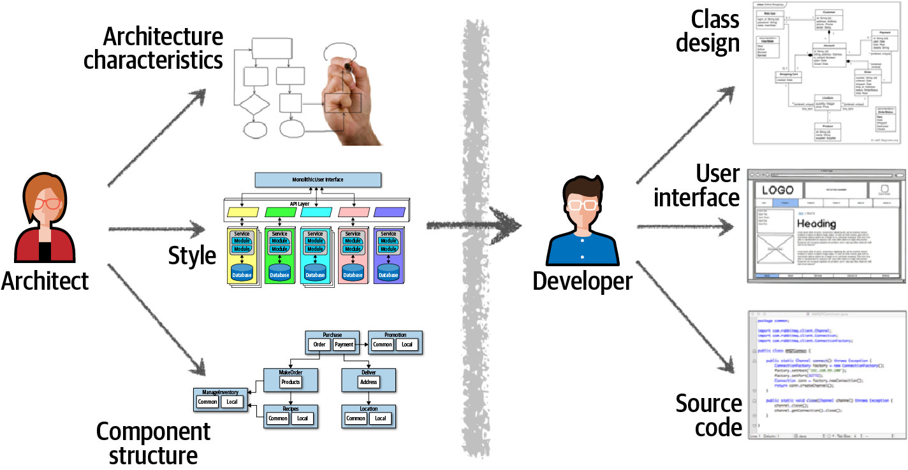
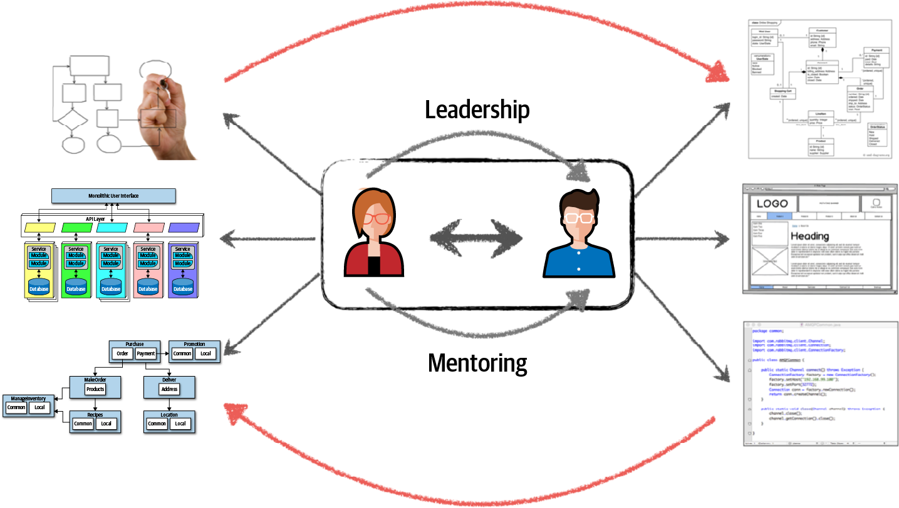
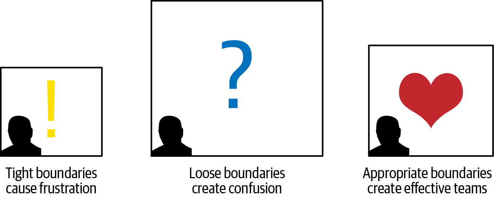
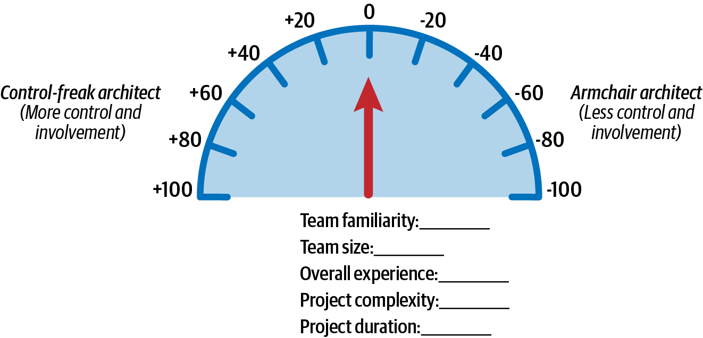
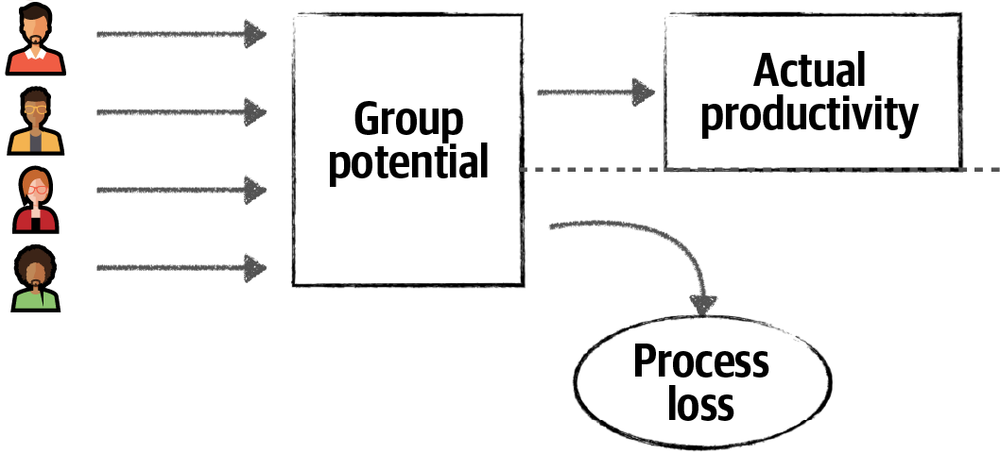
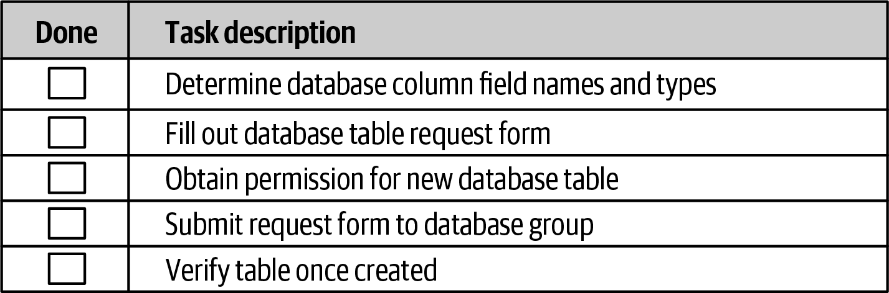
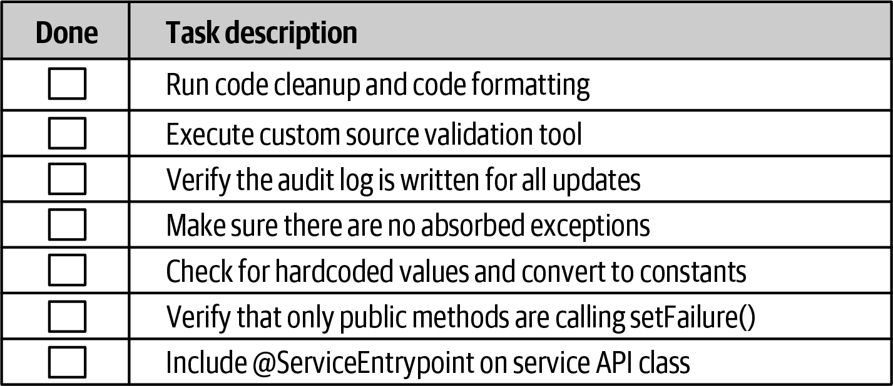
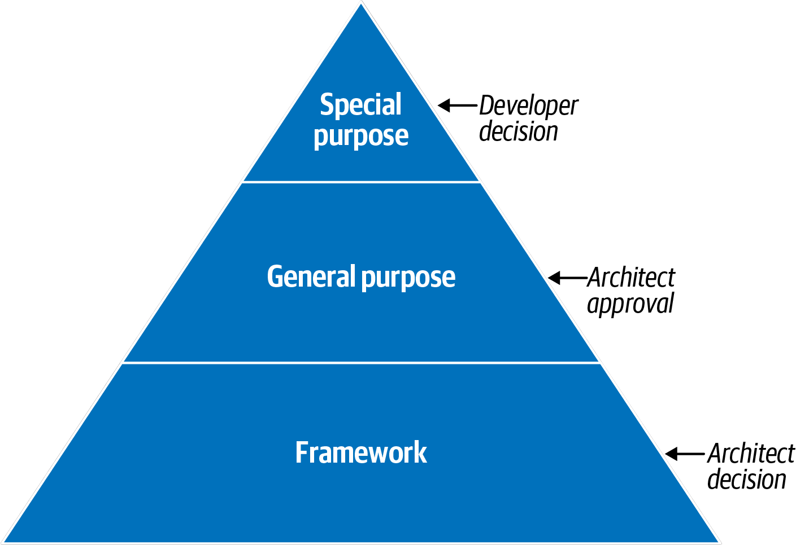

# Chapter 24. Making Teams Effective

An architect's responsibility extends beyond technical design and decision-making; they must also lead and guide the development team through the implementation of that architecture. Successful architects differentiate themselves by creating high-functioning teams that collaborate closely to solve problems. 

Too often, architects work in a silo, handing off a finished design to a development team that has had no input. This disconnect is a primary cause of project failure, as developers struggle to implement an architecture they don't fully understand or that fails to account for implementation realities.

---

## Collaboration
In many organizations, architecture and development are treated as entirely separate activities. This "over-the-wall" mentality creates significant barriers to success.

### The Traditional (Siloed) View
In the traditional model (Figure 24-1), the roles are strictly partitioned:
*   **Architect:** Analyzes requirements, defines architectural characteristics, selects patterns, and creates logical components.
*   **Developer:** Receives the architect's artifacts to create class diagrams, build UIs, and write code.

The problem with this model is the **unidirectional arrow**. Decisions often fail to reach the developers, and the realities of development—which often require architectural adjustments—rarely make it back to the architect. This disconnect ensures that the architecture will struggle to meet its goals.

### The Collaborative (Modern) View
To make architecture work, we must break down the barriers between roles. The architect and the development team should exist on the same "virtual team," fostering a **bidirectional relationship** (Figure 24-2).

#### Benefits of Collaboration:
*   **Bidirectional Communication:** Knowledge flows both ways, allowing the architecture to adapt to implementation feedback.
*   **Mentoring and Coaching:** The architect can guide developers, helping them grow and ensuring the vision is realized.
*   **Evolutionary Design:** Modern architecture is not static; it evolves with every iteration. Tightly coupled collaboration is the only way to manage this evolution.

> [!IMPORTANT]
> **Architecture is a Team Sport.** A successful architect is not a "grand designer" working in isolation, but a leader who empowers their team to build, refine, and evolve the system together.

---

## Constraints and Boundaries
An architect's primary tool for guiding a team is the creation and communication of **constraints**. Think of these constraints as defining the "room" in which the development team works to implement the architecture.

The size of this room—the strictness of the boundaries—directly affects the team's ability to succeed (Figure 24-3).

### The Goldilocks Principle of Boundaries

#### 1. Too Tight (The Small Room)
When an architect imposes too many constraints, the room becomes too small. 
*   **The Result:** Developers are restricted from using the best libraries, tools, or practices for the job. 
*   **The Consequence:** This leads to deep frustration, a sense of powerlessness, and ultimately, high staff turnover as talented developers leave for more autonomous environments.

#### 2. Too Loose (The Giant Room)
Conversely, having no constraints or boundaries that are too loose makes the room too big.
*   **The Result:** Developers are overwhelmed by choices and are essentially forced to take on the architect's role.
*   **The Consequence:** The team becomes unproductive, spending too much time on proofs-of-concept (POCs) and struggling over major design decisions instead of building features. Confusion and fragmentation follow.

#### 3. Just Right (The Balanced Room)
An effective architect strives for the "Goldilocks" level of guidance.
*   **The Goal:** Provide enough structure to ensure consistency and architectural integrity, while leaving enough space for developers to exercise their technical expertise and creativity.

> [!TIP]
> **Focus on the 'Why', not just the 'What'.** When setting boundaries, explain the rationale behind them. If developers understand the *intent* of a constraint, they are more likely to work effectively within it and less likely to feel restricted.

---

## Architect Personalities
To better understand how boundaries are created, we can generalize architectural leadership into three basic personalities:

*   **The Control-Freak:** Produces boundaries that are too tight.
*   **The Armchair Architect:** Produces boundaries that are too loose.
*   **The Effective Architect:** Produces appropriate, well-justified boundaries.

---

## The Control-Freak Architect
The **Control-Freak Architect** tries to manage every fine-grained detail of the development process. This personality often emerges during the transition from developer to architect, when the temptation to continue doing the developer's job is at its peak.

### Symptoms of Control-Freakery
*   **Micromanagement:** Setting arbitrary restrictions on naming conventions, method lengths, or class designs.
*   **Resource Blocking:** Preventing teams from downloading necessary open-source libraries or tools.
*   **Over-Designing:** Writing pseudocode or dictating the exact internal implementation of a component.

### The Impact on the Team
When an architect dictates *how* a component should be built (the "art of programming"), they steal the creative problem-solving aspect of development away from the team. This results in:
*   **Loss of Respect:** Developers feel undervalued and untrusted.
*   **Frustration:** High-quality developers will often leave the project for more autonomous environments.

### Role Confusion: The Reference Manager Example
Consider a `ReferenceManager` component designed to handle static system data (product codes, etc.).
*   **The Architect's Role:** Define the core operations (e.g., `GetData`, `NotifyOnUpdate`) and its interactions with other components.
*   **The Developer's Role:** Determine the internal design (e.g., whether to use a parallel loader pattern or a specific internal cache structure).

A control-freak architect would cross the line by dictating the internal cache implementation, essentially doing the developer's job and getting in the way of implementation reality.

> [!CAUTION]
> **Avoid the Trap.** While a "control-freak" approach may be temporarily necessary for extremely junior teams or high-risk crises, it is generally a recipe for leadership failure. An effective leader provides the *what* and the *why*, leaving the *how* to the implementation experts.

---

## The Armchair Architect
The **Armchair Architect** is the polar opposite of the control freak. They are typically disconnected from the development team and create architectures that fail to account for implementation realities. 

### Why it Happens
Armchair architects often haven't written code in years (if ever). Because architecture can sometimes be "faked" through high-level diagrams, they may drift into a role where they simply draw boxes and move on to the next project before the implementation even begins.

### Symptoms of the Armchair Architect
*   **Excessive Abstraction:** Creating diagrams that are too high-level to be useful. For example, representing a complex stock-trading system as just two boxes: "Trading" and "Compliance."
*   **Lack of Availability:** They are rarely around to answer questions or provide guidance when implementation challenges arise.
*   **Technical/Domain Disconnect:** A fundamental lack of understanding of the business problem or the technologies being used.
*   **Ignoring Implications:** Failing to consider the maintenance, testing, and operational complexity of their "elegant" theoretical designs.

### The Impact on the Team
Because the armchair architect creates boundaries that are **too loose**, the development team is forced to do the architect's job.
*   **Decision Paralysis:** The team wastes time on endless proofs-of-concept and design debates that should have been settled by the architect.
*   **Decreased Velocity:** Productivity suffers as the team struggles to interpret a vague or unrealistic architectural vision.
*   **Confusion:** Without clear guidance, the final implementation often drifts away from the intended goals, leading to structural integrity issues.

> [!WARNING]
> **The Erosion of Respect.** Just as developers lose respect for control freaks who micromanage, they lose respect for armchair architects who are out of touch with the "real world" of coding. To avoid this, stay hands-on with the technology and remain deeply involved in the project’s day-to-day challenges.

---

## The Effective Architect
The **Effective Architect** is a leader who balances technical excellence with team empowerment. They create appropriate boundaries, provide meaningful guidance, and ensure the team is equipped for success.

### Key Characteristics:
*   **Appropriate Boundaries:** They provide enough structure to maintain architectural integrity without stifling the team's creative technical expertise.
*   **Active Collaboration:** They don't just "hand off" a design; they work closely with the team, gaining respect through shared problem-solving.
*   **Roadblock Removal:** They ensure the team has the necessary tools and technologies and proactively resolve non-technical hurdles.
*   **Adaptive Involvement:** They know when to step in with more detail (for junior teams or high-complexity tasks) and when to step back (for high-seniority teams).

Becoming an effective leader is an art form. It requires more than just technical brilliance; it requires empathy, availability, and a commitment to the team's professional growth.

> [!TIP]
> **Respect is Earned, Not Granted.** Respect from a development team doesn't come with the "Architect" title—it is earned through the quality of your decisions and your willingness to support the team through implementation challenges.

---

## How Much Involvement?
Determining the right amount of involvement with a development team is one of the most challenging aspects of the architect's role. This concept, known as **Elastic Leadership**, requires an architect to scale their involvement based on the specific needs of the team and the project.

### Five Factors for Involvement
To gauge how much you should be involved, consider these five factors:

1.  **Team Familiarity:** Have the team members worked together before? Familiar teams can self-organize, requiring less oversight. New teams need the architect to facilitate collaboration.
2.  **Team Size:** Larger teams (12+) generally require more coordination and architectural guidance than small teams (5 or fewer).
3.  **Overall Experience:** A team of senior developers needs a **facilitator**; a team of junior developers needs a **mentor**.
4.  **Project Complexity:** Complex, high-risk projects require the architect to be more available to resolve technical hurdles.
5.  **Project Duration:** Counterintuitively, longer projects often require *more* involvement to maintain urgency and schedule, while short "sprints" (2 months) require the architect to stay out of the way of a team already moving at maximum velocity.

---

## The Involvement Scale
Using a scale of -20 (Armchair) to +20 (Control Freak) for each factor, we can quantify the appropriate level of involvement.

### Scenario 1: The High-Velocity Senior Team
| Factor | Value | Rating | Personality Tendency |
| :--- | :--- | :--- | :--- |
| Team Familiarity | New team members | +20 | Control Freak |
| Team Size | Small (4 members) | -20 | Armchair |
| Experience | All experienced | -20 | Armchair |
| Complexity | Relatively simple | -20 | Armchair |
| Duration | 2 months | -20 | Armchair |
| **Total Score** | | **-60** | **Armchair (Hands-off)** |

**Outcome:** The architect should act as a high-level facilitator, staying out of the team's way and only intervening to answer critical questions.

### Scenario 2: The Complex Junior Team
| Factor | Value | Rating | Personality Tendency |
| :--- | :--- | :--- | :--- |
| Team Familiarity | Know each other well | -20 | Armchair |
| Team Size | Large (12 members) | +20 | Control Freak |
| Experience | Mostly junior | +20 | Control Freak |
| Complexity | High complexity | +20 | Control Freak |
| Duration | 6 months | -20 | Armchair |
| **Total Score** | | **+20** | **Effective Mentor** |

**Outcome:** The architect must take on a mentoring and coaching role, being involved in day-to-day activities to ensure the complex vision is correctly implemented by the junior staff.

> [!IMPORTANT]
> **Continuously Re-evaluate.** Your level of involvement should change as the project progresses. A team that needs heavy mentoring in month one may become a self-organizing powerhouse by month six. Analyze these factors continually throughout the lifecycle.

---

## Team Warning Signs
We’ve established that larger teams require more architectural involvement, but how does an architect know when a team has become *too* large? An effective architect must look for warning signs that indicate the team's size is hindering its effectiveness.

### Process Loss (Brooks’s Law)
The concept of **Process Loss**, famously articulated as **Brooks’s Law** in *The Mythical Man-Month*, states that adding human resources to a late software project makes it later. 

As shown in Figure 24-7, a team’s **Actual Productivity** is always less than its **Potential Productivity**. The gap between the two is the Process Loss.

#### Spotting Process Loss
Architects should look for these key indicators that a team is suffering from process loss:
*   **Frequent Merge Conflicts:** If developers are constantly bumping into each other in the code repository, it’s a sign that the work isn’t partitioned well enough for the team size.
*   **Communication Overhead:** Excessive meetings or the need for constant clarification between team members.

#### Mitigating Process Loss
To minimize process loss, the architect should:
1.  **Maximize Parallelism:** Partition the architecture so that team members can work on separate services or distinct layers of the application.
2.  **Audit Work Streams:** Before adding new members, ensure there is a clear, parallel work stream for them.
3.  **Provide Pushback:** If there is no opportunity for parallel work, the architect must notify the project manager that adding more people will likely have a negative impact on overall productivity.

---

### Pluralistic Ignorance
**Pluralistic Ignorance** occurs when every member of a group privately rejects a norm but publicly supports it because they believe they are missing something obvious that everyone else sees.

This phenomenon is famously illustrated by Hans Christian Andersen's story, *The Emperor’s New Clothes*, where everyone praises the king's "invisible" clothes to avoid being labeled unworthy, until a child finally speaks the truth.

#### Architecture Example:
A team might unanimously agree to use a complex messaging protocol between services, even if one developer privately knows a secure firewall makes it impossible. That developer stays silent, assuming they must be wrong since no one else is objecting.

#### The Architect's Role:
*   **Observe Body Language:** Look for facial expressions or posture that suggests skepticism during meetings.
*   **Facilitate Safety:** Actively invite quiet team members to share their thoughts.
*   **Normalize Dissent:** Supporting a skeptic—even if their technical point is eventually proven wrong—creates a safe environment where the "naked emperor" can be called out before bad decisions are implemented.

---

### Diffusion of Responsibility
As teams grow, individual accountability often decreases. **Diffusion of Responsibility** happens when team members assume that someone else will take care of a task or problem because "the team" is so large.

#### The Stranded Motorist Analogy (Figure 24-8):
*   **Small Team (Country Road):** On a quiet road, every passing driver is likely to stop and help a stranded motorist. The responsibility is clear and personal.
*   **Large Team (Busy Highway):** On a city highway, thousands of cars drive by. Each driver assumes someone else has already called for help.

#### Spotting the Signs:
If tasks are frequently dropped, or if team members are confused about who owns which component, the team has likely grown too large for effective communication.

> [!IMPORTANT]
> **Maintaining Team Health.** An effective architect doesn't just manage boxes and lines; they manage the health and happiness of the human beings building the system. By watching for **Process Loss**, **Pluralistic Ignorance**, and **Diffusion of Responsibility**, you ensure your team remains a focused, collaborative unit.

---

## Leveraging Checklists
Checklists are a powerful tool for ensuring consistency and safety, famously proven in aviation and surgery (as detailed in Atul Gawande's *The Checklist Manifesto*). In software architecture, they serve as a safeguard against human error in complex, non-linear processes.

### When to Use (and Avoid) Checklists
Not every process needs a checklist. The key is to apply them where they provide the most value without creating unnecessary friction.

*   **Bad Candidates (Figure 24-9):** Procedural flows with strict dependencies (e.g., "submit form before verifying table") or very simple, frequent tasks that people perform reliably without help.
*   **Good Candidates:** Processes where steps are frequently skipped, errors are common, or there is no fixed procedural order.

#### Best Practices for Architects:
1.  **Keep them Small:** Developers will ignore overly long checklists.
2.  **Don't State the Obvious? No, DO State the Obvious:** The most obvious steps are the ones that are most frequently skipped.
3.  **Automate First:** If a task can be automated (e.g., linting, automated tests), remove it from the manual checklist.
4.  **Avoid Over-Saturation:** Too many checklists invoke the **Law of Diminishing Returns**, leading the team to ignore all of them.

---

## The Hawthorne Effect: Ensuring Adoption
The hardest part of introducing checklists is getting the team to actually use them honestly, rather than just "checking the boxes" at the last minute.

### Strategies for Adoption:
*   **Ownership:** Have the team collaboratively decide what belongs on a checklist. People are more likely to follow a process they helped create.
*   **The "Why":** Ensure every team member understands the reasoning behind each step.
*   **The Hawthorne Effect:** This is the tendency for people to change their behavior—usually for the better—when they know they are being observed. 

> [!TIP]
> **Trust but Verify.** You don't need to monitor every checklist. By performing occasional spot-checks, you maintain the perception of oversight, which is often enough to keep the Hawthorne effect active and ensure the team remains diligent.

---

## Developer Code-Completion Checklist
A developer code-completion checklist is a vital tool for establishing a clear **Definition of Done**. It ensures that when a developer says they are "finished" with a task, the code actually meets the team's quality and architectural standards.

### What to Include:
*   **Non-Automated Standards:** Formatting or coding style requirements that can't be enforced by an IDE or linter.
*   **Overlooked Technical Debt:** Specific items like "Ensure no absorbed exceptions" or "Verify no TODOs remain."
*   **Project-Specific Requirements:** Mandates like "Include @ServiceEntrypoint annotation" or "Ensure audit log is written."
*   **Team Instructions:** Unique procedures specific to the current iteration or project phase.

### The Importance of the Obvious
As noted in *The Checklist Manifesto*, the most obvious tasks (like "Run code cleanup") are often the ones most frequently missed by developers in a hurry. Including them explicitly reduces the friction of manual code reviews.

### Optimization and Automation
An architect should periodically review the checklist to see if any manual items can be converted into automated checks.
*   **Manual:** "Include @ServiceEntrypoint on service API class" (requires architectural judgment).
*   **Automated:** "Verify that only public methods call `setFailure()`" (can be enforced by a custom code-validation tool or static analysis).

> [!IMPORTANT]
> **Signal over Noise.** Every item you automate and remove from the manual checklist increases the perceived value of the remaining items. Keep the manual checklist lean and focused on things that truly require human eyes.

---

## Unit and Functional Testing Checklist
This checklist is designed to capture the edge cases and unusual scenarios that developers frequently forget to test. It serves as a bridge between development and QA, ensuring that code is virtually production-ready before it leaves the developer's machine.

### Key Inclusions:
*   **Edge Case Data:** Special characters in text fields, numeric boundary values, and null/missing field scenarios.
*   **Extreme Ranges:** Testing minimum and maximum values for all relevant data types.
*   **QA Feedback Loop:** Anytime a bug is found in QA that was missed by development, the specific test case should be added to this checklist to prevent a recurrence.

> [!TIP]
> **Automation is the Goal.** As with code completion, any test scenario that can be codified into an automated unit or functional test should be removed from the manual checklist. This frees up the QA team to focus on complex business scenarios that can't be easily automated.

---

## Software-Release Checklist
Releasing software into production is one of the most volatile and error-prone stages of the lifecycle. A dedicated checklist at this stage is essential for reducing the risk of failed builds and deployments.

### What to Track:
*   **Environmental Changes:** Configuration updates in servers or external configuration providers.
*   **Dependencies:** New third-party libraries (JARs, DLLs) added during the iteration.
*   **Data Integrity:** Database updates, schema changes, and corresponding migration scripts.

### The Architect’s Role in Post-Mortems
The software-release checklist should be a living document. Whenever a build or deployment fails, the architect must:
1.  Perform a root-cause analysis of the failure.
2.  Add a specific validation entry to the checklist to ensure that exact failure point is verified before the next release.

By treating the release checklist as a dynamic barrier against repeat errors, the architect significantly improves the long-term stability and predictability of the deployment process.

---

## Providing Guidance
Another way architects make teams effective is by providing clear guidance through design principles. This helps define the boundaries of the "room" where developers operate, particularly regarding the **layered stack** (the collection of third-party libraries used in the application).

### Evaluating Third-Party Libraries
When developers want to introduce a new library, they should be guided to answer two critical questions:
1.  **Overlap Analysis:** Is there any overlap between this library and existing functionality? (Reduces bloat and maintenance overhead).
2.  **Dual Justification:** What is the technical *and* business justification for this addition?

---

## The Impact of Business Justifications
Requiring a business justification isn't just about bureaucracy; it's about shifting a developer's perspective toward the project's overall goals.

### Case Study: The Scala Enthusiast
A lead architect faced a disruptive team member who was obsessed with using the Scala language on a Java project. The friction was so high that key developers were threatening to quit.
*   **The Architect’s Approach:** Instead of a flat "no," the architect agreed to support Scala *if* the enthusiast could provide a business justification for the training costs and timeline delays.
*   **The Result:** The developer spent a day analyzing the impact and realized that while technically interesting, the change provided zero business value and was actively harming the team. He transformed into a helpful, business-aware contributor, and the team's attrition risk was neutralized.

> [!IMPORTANT]
> **Developing Business Awareness.** By asking for business justifications, you teach developers to think about cost, budget, and timeline—making them better software engineers and the team more resilient.

---

## Guidance for the Layered Stack
An architect can use a graphical guide to communicate which decisions are autonomous and which require oversight (Figure 24-11).

### Decision Categories:
1.  **Special Purpose (e.g., PDF Rendering):** Low-impact, niche libraries. **Decision:** Developers can choose autonomously.
2.  **General Purpose (e.g., Guava, Apache Commons):** Language-level wrappers. **Decision:** Developers analyze and recommend; Architect approves.
3.  **Framework (e.g., Spring, Hibernate):** Highly invasive libraries that define layers. **Decision:** Architect's responsibility alone.

This clear division of labor ensures that developers have autonomy where it makes sense, while the architect maintains control over the structural integrity of the system.

---
