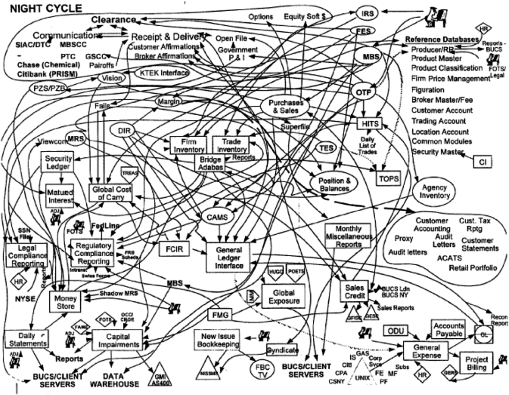
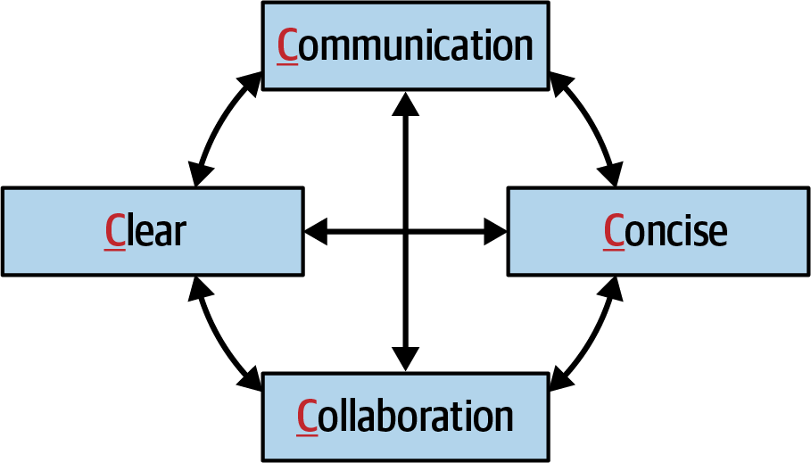
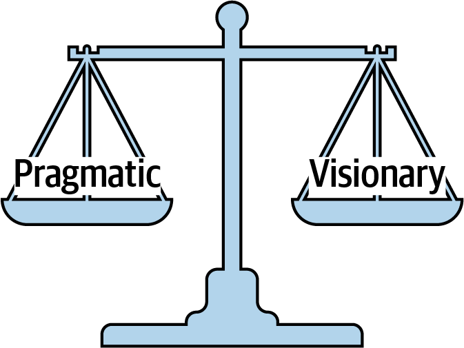
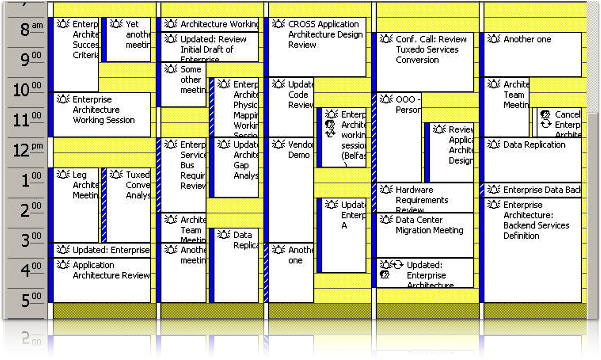

# Chapter 25. Negotiation and Leadership Skills

Negotiation and leadership are critical "hard skills" for a software architect, though they are often the most difficult to master. Every significant architectural decision will likely be challenged—by developers who have different technical opinions, by other architects with competing visions, and by business stakeholders concerned about cost or timeline. 

Success as an architect depends on your ability to navigate office politics and negotiate solutions that achieve consensus without compromising structural integrity.

---

## Negotiating with Business Stakeholders
Architects must often translate technical realities into business terms to manage expectations and steer projects toward success.

### Scenario: The "Five Nines" Demand
**Stakeholder (Parker):** A senior VP who insists on "five nines" (99.999%) of availability for a global trading system.
**Architect's Reality:** Trading only occurs 22 hours a day; 99.9% (three nines) is more than sufficient.
**The Challenge:** Parker is non-technical but sensitive to being corrected and wants to feel in control.

#### Technique 1: Decipher the Jargon
Buzzwords and exaggerated statements are clues to a stakeholder's true concerns.
*   "I needed it yesterday" $\rightarrow$ **Time to Market** is the priority.
*   "It must be lightning fast" $\rightarrow$ **Performance** is the concern.
*   "Zero downtime" $\rightarrow$ **Availability** is the priority.

#### Technique 2: Quantify the Metrics
Avoid using the "nines" vernacular, which can be abstract. Instead, translate percentages into downtime per year/day (Table 25-1).

| Availability | Downtime per Year | Downtime per Day |
| :--- | :--- | :--- |
| 99.0% (Two nines) | 87 hours 46 min | 14 min |
| 99.9% (Three nines) | 8 hours 46 min | 86 seconds |
| 99.99% (Four nines) | 52 min 33 seconds | 7 seconds |
| 99.999% (Five nines) | 5 min 35 seconds | 1 second |

By showing Parker that "five nines" allows for only **1 second** of unplanned downtime per day, you move the conversation from a buzzword to a quantified (and likely unnecessary) requirement.

#### Technique 3: Divide and Conquer
If a stakeholder insists on a high-cost requirement, try to narrow the scope. 
*   **The Question:** "Does the *entire* system need 99.999% availability, or just the trade execution engine?"
*   **The Goal:** Isolate the expensive requirement to the smallest possible area, reducing overall system complexity and cost.

#### Technique 4: Cost and Time as a Last Resort
Never lead with "It's too expensive" or "We don't have time." These statements are defensive and shut down negotiation. Instead:
1.  Validate the concern ("I agree that availability is critical").
2.  Provide alternatives and rationalizations.
3.  Use cost and effort only once an agreement on the *value* of the requirement is reached.

---

## Negotiating with Other Architects
Disagreements between architects are common, but if handled poorly, they can fracture the leadership of a project and confuse the development team.

### Scenario: The Messaging vs. REST Debate
**Architect A (You):** Advocate for asynchronous messaging to maximize performance and scalability.
**Architect B (Addison):** Insists on REST, citing a Google search and a generative AI prompt that claim REST is "faster and just as scalable."
**The Challenge:** Addison is resistant and potentially adversarial. Pulling "seniority" to shut them down will only damage the working relationship.

#### Technique: Demonstration Defeats Discussion
The most effective way to resolve a technical disagreement is to move from theory to data. Google results and AI prompts don't account for your specific environment, data volume, or network latency.
*   **The Approach:** Instead of arguing, propose a **proof of concept (POC)**. 
*   **The Goal:** Run a side-by-side comparison of both protocols in a production-like environment. The data will usually reveal the correct path, allowing for a decision based on facts rather than opinions.

#### Technique: Maintain Emotional Neutrality
Negotiations fail when they become personal. If an argument becomes heated:
1.  **Stop the Negotiation:** Recognizing when emotions have clouded judgment is a sign of leadership. 
2.  **Re-engage Later:** Once both parties have calmed down, re-open the discussion with clear, concise reasoning.
3.  **Project Calm Leadership:** A calm, rational demeanor is far more persuasive than an aggressive or defensive one.

> [!TIP]
> **Data over Ego.** As an architect, your primary loyalty should be to the system's success, not your own initial idea. If a demonstration proves your colleague's approach is better, be the first to acknowledge it. This builds immense trust and respect.

---

## Negotiating with Developers
The quickest way for an architect to lose the respect of their team is to adopt the **Ivory Tower** antipattern—dictating orders from on high without regard for the team's professional expertise or constraints.

### Technique: Lead with Justification
When requesting a specific task or enforcing a constraint, always provide the "why" before the "what."

*   **The "Dictator" Approach:** "You must go through the Business layer to make that database call." (Invites defensiveness and resentment).
*   **The Collaborative Approach:** "Since change control is our highest priority, we are using a closed-layered architecture. This means all calls to the database must originate from the Business layer."

#### Why this works:
1.  **Objective over Subjective:** Replacing "you must" with "this means" turns a command into a statement of architectural fact.
2.  **Capturing Attention:** People often stop listening as soon as they hear something they disagree with. By providing the justification first, you ensure the logic is heard before the "demand" is revealed.
3.  **Problem-Solving Dialogue:** A well-justified constraint shifts the conversation from "I don't want to do that" to "How do we achieve this while still meeting our performance goals?"

---

### Technique: The Path of Self-Discovery
If a developer strongly disagrees with a choice (e.g., preferring Framework Y over Framework X), instead of arguing, challenge them to prove their case.

*   **The Challenge:** "If you can demonstrate how Framework Y addresses our specific security requirements, we will use it."

#### The Two "Win" Outcomes:
1.  **Option A (The Realization):** The developer tries to prove the case but discovers the same flaws you did. By arriving at the conclusion themselves, they gain "buy-in" for the original decision without feeling overruled.
2.  **Option B (The Discovery):** The developer finds a way to make it work that you missed. In this case, the team gets a better solution, and the developer feels empowered and respected.

> [!IMPORTANT]
> **Respect is the Currency of Negotiation.** Developers are highly skilled professionals. When you treat them as collaborators rather than subordinates, you build the respect necessary to navigate much tougher negotiations in the future.

---

## The Software Architect as a Leader
We estimate that approximately 50% of being an effective software architect is centered on people skills—specifically facilitation, negotiation, and leadership. In this section, we examine how to provide that leadership without falling into the traps of over-engineering.

### Essential vs. Accidental Complexity
Architects must distinguish between two types of complexity:
*   **Essential Complexity:** The inherent difficulty of a problem (e.g., "We need 99.9999% availability"). This is a "hard problem."
*   **Accidental Complexity:** Complexity introduced by the architect or developers that isn't required by the business problem (Figure 25-1). This is "making a problem hard."

> [!CAUTION]
> **The Moths to a Flame.** As Neal Ford says: "Developers are drawn to complexity like moths to a flame—frequently with the same result." 

Architects often introduce accidental complexity to prove their worth, ensure job security, or out of pure technical ego. This is a primary cause of leadership failure, as it alienates developers and obscures the true business goals.

---

## The 4 Cs of Architecture Leadership
To avoid accidental complexity and become a more effective leader, focus on the **4 Cs** (Figure 25-2):

1.  **Communication:** Be the bridge between business and technology.
2.  **Collaboration:** Work *with* your team, not *above* them.
3.  **Clear:** Ensure your diagrams, decisions, and documentation are easily understood.
4.  **Concise:** Avoid the "fancy tool" trap and long-winded justifications. Get to the point.

By mastering these four areas, an architect earns the respect of the team and becomes the "go-to" person for advice, mentoring, and high-level strategy.

---

## Be Pragmatic, Yet Visionary
Effective leadership in architecture requires a delicate balance between strategic imagination and practical reality. An architect must be both a **visionary** and a **pragmatist** (Figure 25-3).

### The Visionary Side
Being a visionary means applying strategic thinking to ensure an architecture remains vital and useful for years to come. It involves planning for future scalability, flexibility, and business evolution.
*   **The Risk:** Visionaries can become overly theoretical, designing solutions that are elegant on paper but nearly impossible to build or maintain.

### The Pragmatic Side
Being pragmatic means dealing with things sensibly based on practical considerations rather than pure theory. A pragmatic architect accounts for:
*   **Budget & Time:** Realistic constraints on project funding and deadlines.
*   **Team Skill Level:** Whether the developers have the expertise to implement the proposed technology.
*   **Trade-offs:** The implications and maintenance costs of every decision.
*   **Technical Limitations:** The actual capabilities of the current infrastructure and tools.

### Case Study: Scaling for High Load
Imagine a system facing a sudden, massive increase in concurrent users.
*   **The Visionary Approach:** Proposing a move to a complex **Data Mesh**—distributed, domain-partitioned databases separating analytical and transactional concerns. While strategically sound in theory, it is incredibly complex to implement.
*   **The Pragmatic Approach:** First, identify the exact bottleneck. Is it the database? If so, can we implement a caching layer to reduce load? This solves the immediate problem realistically within existing constraints.

> [!TIP]
> **Practicality Breeds Respect.** Developers appreciate practical solutions they can actually implement, while stakeholders appreciate visionary thinking that doesn't ignore the budget. Balancing these two traits is the hallmark of a mature architect.

---

## Leading Teams by Example
Rank and title mean very little when it comes to true leadership. As computer scientist Gerald Weinberg famously said, "No matter what the problem is, it’s a people problem." Effective architects gain respect by leading through example rather than pulling rank.

### Collaborative Language
The way you phrase your suggestions can be the difference between a productive dialogue and a defensive standoff.

*   **The Command (Poor):** "What you need to do is use a cache. That would fix the problem."
*   **The Question (Better):** "Have you considered using a cache? That might fix the problem."

By turning a command into a question, you place the control back into the developer's hands, inviting them to collaborate rather than just obey.

### The "Request as a Favor" Technique
Human beings generally dislike being told what to do but have a natural urge to help others. When you need to ask for a difficult or out-of-scope task:
1.  **Use Their Name:** It makes the request personal and familiar.
2.  **Express Vulnerability:** "I'm in a real bind," or "I really need your help with this."
3.  **Show Appreciation:** "I'd really appreciate it if you could squeeze this in. I owe you one."

### Professional Presence and Boundaries
Leadership also involves how you present yourself and respect the boundaries of others.
*   **The Handshake:** A firm, 2-3 second handshake with eye contact is a professional way to build a bond. Always be mindful of cultural differences (e.g., bowing in Japan).
*   **Physical Boundaries:** Maintain a professional distance. Stick to handshakes and skip the hugs to ensure everyone feels comfortable and respected.

---

## Become the "Go-To" Person
An effective architect seizes the initiative to lead the team, regardless of their formal title.

### Strategies for Visibility:
*   **Active Support:** Step in and offer help when a developer is struggling with a technical issue.
*   **Empathy and Mentoring:** Notice non-verbal cues. If a team member seems stressed or depressed, invite them for a coffee and provide an opening for a personal discussion.
*   **Lunch and Learn Sessions:** Host periodic brown-bag sessions on design patterns or new technologies. This identifies you as a mentor and provides a platform to share your expertise.

> [!IMPORTANT]
> **Observation is Key.** Pay attention to both verbal and non-verbal signs. Knowing when to offer help and when to back off is part of the complex art of people skills.

---

## Integrating with the Development Team
An architect's calendar is notoriously cluttered (Figure 25-4), making it difficult to find time for mentoring and guidance. The key to effective integration is mastering the art of meeting management.

### Meeting Management
Meetings are a "necessary evil," but they must be controlled to protect both your time and the team's.

1.  **Manage Imposed Meetings:** When invited, ask the organizer for the agenda and why your presence is specifically required. If you're only there to be "in the loop," ask for meeting notes instead.
2.  **Meeting Shielding:** Offer to attend meetings in place of the tech lead or developers. While this fills your calendar, it protects the team's productivity and earns their respect.
3.  **Minimize Imposed Meetings:** Only call a meeting if an email won't suffice. When you must meet, schedule them at the edges of the day (first thing in the morning or right after lunch) to avoid disrupting productive windows.

---

## Protecting Developer Flow State
**Flow State** is a period of deep concentration where a developer's brain is 100% engaged in a complex problem. Disrupting this state is a major blow to productivity.

*   **The Architect's Role:** Shield the team from unnecessary interruptions and non-critical meetings. 
*   **Scheduling:** Respect the team's central work hours. If you need to discuss something, wait for natural breaks.

> [!TIP]
> **Visibility is Leadership.** If working on-site, sit *with* the development team. Avoid the isolated cubicle, which sends a message of superiority. Walking around, being seen, and being available for quick questions is the best way to maintain an open line of communication.

### Remote Integration
In remote environments, visibility requires more effort. Collaboration becomes a deliberate task rather than a spontaneous one. For deep dives into managing remote teams, we recommend Jacqui Read's *Communication Patterns*.

---
