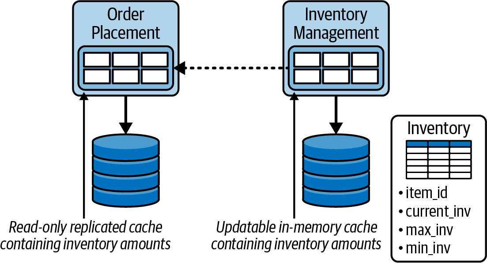
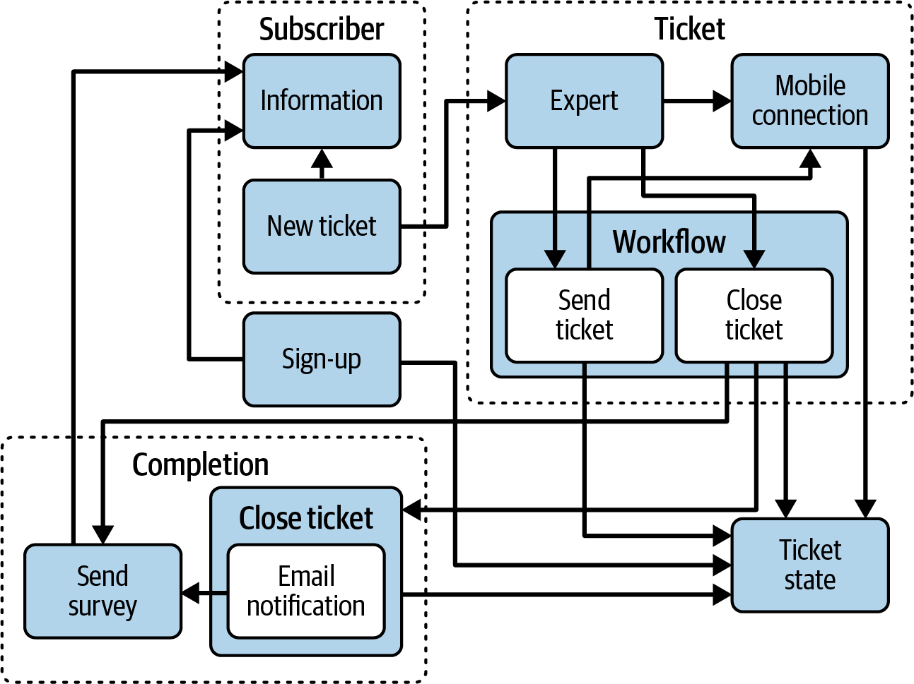
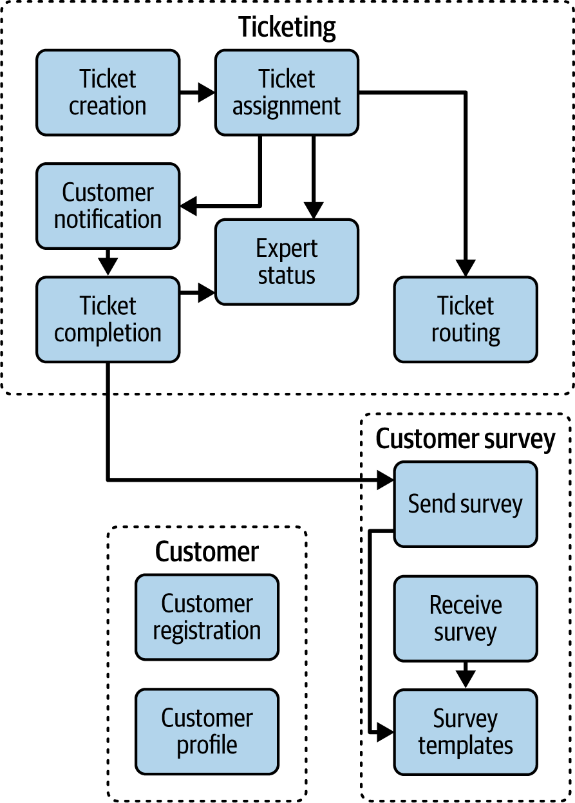
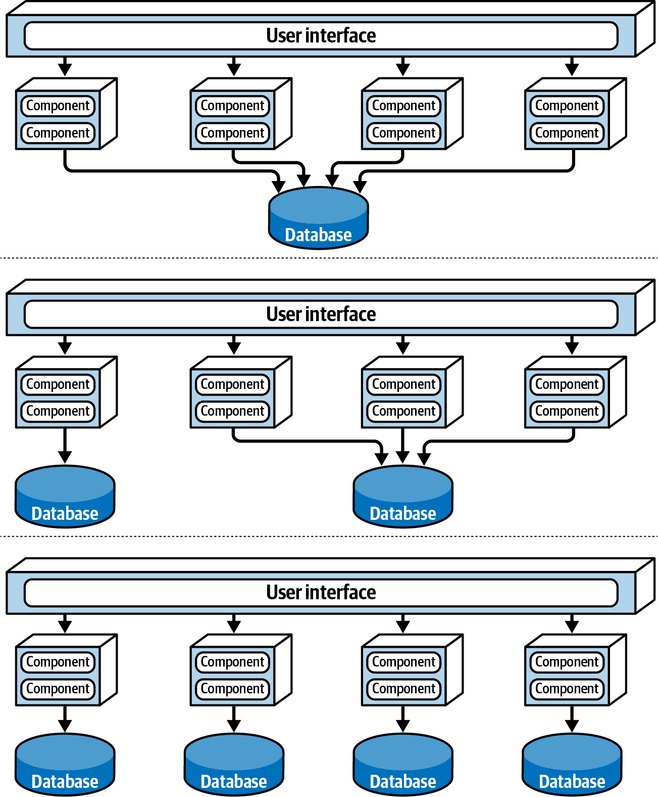

# Chapter 26. Architectural Intersections

An architecture does not exist in a vacuum. For a system to be successful, the architecture must be properly aligned with the broader technical and business landscape. These alignments are known as **Architectural Intersections**. 

In this chapter, we explore the critical points where architecture meets other domains, ensuring that the structural design remains cohesive with implementation, infrastructure, data, and the business itself.

---

## Overview of Architectural Intersections

The following intersections are critical for validating and sustaining a software architecture:

### 1. Implementation
Ensuring the actual code aligns with the architecture's operational characteristics (e.g., performance, scalability) and its defined internal structural constraints.

### 2. Infrastructure
Aligning the deployment environment (cloud, on-prem, serverless) with architectural concerns like fault tolerance, elasticity, and availability.

### 3. Data Topologies
One of the most frequently ignored alignments. The choice between monolithic databases, domain-partitioned databases, or database-per-service must perfectly match the architectural style.

### 4. Engineering Practices
Ensuring that testing strategies, CI/CD pipelines, and maintenance workflows are compatible with the architecture. A microservices architecture, for example, requires far more robust automated deployment practices than a monolith.

### 5. Team Topologies
The organization of teams (Conway's Law) significantly impacts the architecture. If the team structure doesn't mirror the architectural boundaries, the resulting communication overhead can cripple development.

### 6. Systems Integration
Architecting for external dependencies. Failure to align with external systems can devastate reliability and scalability.

### 7. The Enterprise
Aligning with broad organizational standards, security frameworks, and guiding principles shared across the entire company.

### 8. The Business Environment
The most critical intersection. Architecture must solve the actual business problem and fit within the domain's unique constraints.

### 9. Generative AI
A rapidly evolving intersection focusing on how Large Language Models (LLMs) and AI-driven features impact system design, data flow, and cost models.

---

## Architecture and Implementation
Architects often dismiss certain decisions as "implementation details." However, if the implementation—the source code—is not aligned with the architectural vision, the system will eventually fail to meet its goals. This intersection covers three primary areas: **operational concerns**, **internal structure**, and **constraints**.

### Operational Concerns
Misalignment at this intersection occurs when implementation-level decisions (aimed at solving local problems) inadvertently compromise global architectural goals.

#### Case Study: The Replicated Cache Trap
Consider an order-entry system designed for high scalability and elasticity using a microservices style.
*   **The Problem:** The development team found that synchronous calls between the `Order` and `Inventory` services were too slow and created tight coupling.
*   **The Implementation "Fix":** The team implemented an in-memory replicated cache (e.g., Hazelcast or Apache Ignite). Each instance of the `Order` service held a local, synchronized copy of the inventory data.
*   **The Initial Success:** This solved the responsiveness problem and decoupled the services perfectly.
*   **The Architectural Failure:** When the system scaled to 80,000 concurrent users, the memory overhead of maintaining thousands of synchronized caches caused all virtual machines to crash with **Out of Memory (OOM)** errors.

#### The Lesson:
In this scenario, the architecture was designed for **scalability and elasticity**, but the implementation was optimized for **responsiveness and decoupling**. Both teams made sensible decisions for their specific goals, but because they were misaligned, the implementation actively broke the architecture's primary mission.

---

### Structural Integrity
Logical components are the fundamental building blocks of any system. For an architecture to remain healthy, the **source code structure** (directories, packages, namespaces) must strictly mirror the **logical architecture**.

#### The Cost of Misalignment
Without clear guidance and governance, developers may create ad-hoc namespaces or directory structures. This leads to:
*   **Maintenance Debt:** Harder to find where specific functionality lives.
*   **Testing Friction:** Difficult to isolate components for unit or integration testing.
*   **Deployment Fragility:** Implicit dependencies make it harder to deploy parts of the system independently.

#### Enforcing Integrity through Automated Governance
To prevent structural drift, architects should use automated governance tools that enforce architectural rules as part of the CI/CD pipeline:
*   **Java:** ArchUnit
*   **.NET:** ArchUnitNet, NetArchTest
*   **Python:** PyTestArch
*   **TypeScript/JS:** TSArch

These tools allow you to write tests like: *"Components in the 'Controller' layer should not directly access the 'Repository' layer."* 

As shown in the comparison between Figures 26-2 and 26-3, a properly aligned structure is significantly more maintainable, reliable, and extensible. Structural integrity isn't just about "neatness"; it's a prerequisite for long-term architectural agility.

---

### Architectural Constraints
A constraint is a governing rule that restricts certain implementations to ensure architectural goals are met. If the source code ignores these constraints, the architecture fails—no matter how brilliant the initial design.

#### Case Study: The Cost of Bypassing Layers
Imagine a company building a system with a limited budget and a tight deadline, where frequent database schema changes are expected.
*   **The Architecture:** A traditional **Layered Architecture** was chosen specifically because it allows changes to be isolated to the Persistence layer.
*   **The Essential Constraints:**
    1.  All database logic must reside exclusively in the Persistence layer.
    2.  No layer (including Presentation) can bypass intermediate layers to access the database directly.

#### The Misalignment:
*   **UI Team:** Decided it was "faster" to call the database directly from the front end.
*   **Backend Team:** Decided to merge business and database logic into a single layer to make unit testing "simpler."

#### The Result:
Because these constraints were ignored, a simple change to a database column now requires updates to the Persistence, Business, and Presentation layers. The agility and cost-effectiveness that drove the choice of a layered architecture were completely neutralized by the implementation.

> [!IMPORTANT]
> **Governance is Not Optional.** Just as with structural integrity, architectural constraints must be enforced through automated tools. Without active governance, the "easiest" path for a developer will almost always be the one that violates architectural constraints.

---

## Architecture and Infrastructure
The scope of software architecture has expanded to bridge the gap between design and operations. In the past, this relationship was bureaucratic and contractual (SLAs). Today, modern architectural styles like microservices rely on a deep intersection with infrastructure to deliver on their promises of scale and availability.

### Case Study: Pets.com and the Need for Elastic Scale
In 1998, Pets.com spent millions on a superstar sock-puppet mascot but neglected its infrastructure. 
*   **The Problem:** When orders poured in, the site was too slow, transactions were lost, and deliveries were delayed. 
*   **The Result:** The company collapsed shortly after a disastrous Christmas rush.
*   **The Lesson:** "Too much success" can kill a business if the architecture lacks **elastic scale**—the ability to dynamically spin up resources to meet demand.

### The Rise of DevOps
Historically, architects designed systems "defensively," assuming that operations would be outsourced and out of their control. This led to complex, orchestration-heavy designs that tried to handle scalability and fault tolerance entirely within the application code.

The microservices movement realized that these concerns are often better handled at the infrastructure level. By collaborating with operations, architects could:
1.  **Simplify Designs:** Offload scaling and routing logic to the infrastructure.
2.  **Ensure Alignment:** Move from a formal SLA-based relationship to a collaborative **DevOps** model where both teams share responsibility for operational characteristics.

---

### Cloud and Deployment Realities
Even in modern cloud environments, misalignment can occur. The physical reality of infrastructure can override architectural theory:

| Infrastructure Decision | Positive Impact | Negative Impact |
| :--- | :--- | :--- |
| **Cross-Region Deployment** | High Availability, Disaster Recovery | High Latency, Caching Inefficiency |
| **Co-locating Pods (Same VM)** | High Performance (Low Latency) | Poor Fault Tolerance, Limited Scalability |
| **Multi-AZ Replication** | Fault Tolerance | Increased Cost, Complex Data Consistency |

#### The Architect's Mandate
Aligning architecture with infrastructure requires more than just picking a style; it requires constant communication with the teams responsible for the underlying platform. Without this collaboration, the "five-star" ratings of an architectural style remain purely theoretical.

---

## Architecture and Data Topologies
The intersection of architecture and data is a critical—yet frequently neglected—alignment. Selecting the wrong database topology or type can neutralize an architecture's core strengths, such as scalability or data integrity.

### Physical Database Topology
As discussed in Chapter 15, the way databases are physically configured must align with the architectural style (Figure 26-4).

1.  **Monolithic Database:** Best for data consistency and transactional support, but can become a bottleneck for scalability and fault tolerance.
2.  **Domain-Based Databases:** A middle ground suitable for service-based architectures.
3.  **Database-per-Service:** Essential for microservices to maintain strict bounded contexts and enable independent change control and scalability.

### Aligning Architectural "Superpowers"
Every architectural style and database type has its own strengths (superpowers) and weaknesses. For a system to succeed, these must be harmonized:

| Architectural Style | Priority Characteristics | Ideal Database Match |
| :--- | :--- | :--- |
| **Microservices / Event-Driven** | Scalability, Elasticity | Key-Value, Columnar |
| **Space-Based** | Extreme Scalability | In-Memory Data Grids |
| **Monolithic / Layered** | Data Integrity, Consistency | Relational (RDBMS) |

### Data Structure and Read/Write Priorities
Beyond the topology, the nature of the data and its access patterns determine the alignment:

*   **Relational Data:** Best suited for RDBMS. Storing complex hierarchies in key-value stores leads to inefficient "join-in-application" logic.
*   **Key-Value / Document Data:** Best for high-performance retrieval of JSON blobs or simple lookups.
*   **Write Priority:** If the system is write-heavy (e.g., logging, sensor data), **Columnar** databases are a superior fit.
*   **Read Priority:** If the system is read-heavy (e.g., product catalogs), **Document** or **Key-Value** stores provide better responsiveness.
*   **Balanced:** **Relational** or **NewSQL** databases provide the best middle ground.

> [!TIP]
> **Embrace Polyglot Persistence.** Modern systems rarely deal with just one type of data. An effective architecture often uses multiple database types (e.g., Postgres for transactions, Redis for caching, Neo4j for social graphs) to ensure each data structure is handled by the tool best suited for it.

---

## Architecture and Engineering Practices
Architecture is increasingly inseparable from the way software is built and released. While **Process** (meetings, workflows, Scrum) describes how people organize, **Engineering Practices** (CI/CD, TDD, automation) provide the technical foundation that makes modern architecture possible.

### The Misalignment Risk
Trying to build a microservices architecture using antiquated engineering practices (e.g., manual testing, manual server provisioning, infrequent deployments) is a recipe for failure. Microservices *require* automated pipelines and robust testing to manage their inherent complexity.

### Iterative Architecture and Migration
Modern architectures are rarely built from scratch; they evolve. Iterative engineering practices (like those in Agile) align perfectly with architectural evolution. They enable techniques like:
*   **The Strangler Pattern:** Gradually replacing legacy functionality with new services.
*   **Feature Toggles:** Decoupling deployment from release to test new architectural components safely.

---

## Building Evolutionary Architectures
As established in Neal Ford's *Building Evolutionary Architectures*, a successful architecture must be able to change gracefully over time. To ensure this survival, we use **Architectural Fitness Functions**.

### Architectural Fitness Functions
A fitness function provides an objective, automated assessment of an architectural characteristic. It ensures that as the code evolves, it doesn't drift away from its core requirements.

#### Methods of Assessment:
*   **Metrics:** Tracking cyclomatic complexity or coupling.
*   **Unit/Integration Tests:** Verifying structural constraints.
*   **Monitors & Chaos Engineering:** Testing availability and fault tolerance in real-time.

#### Case Study: The Agility Gap
A business prioritizes **Time to Market**, requiring high **Agility** (a composite of Maintainability, Testability, and Deployability).
*   **The Architecture:** Microservices (rated 5 stars for agility).
*   **The Engineering Practice:** Manual QA and manual deployment scripts.
*   **The Result:** Despite the "agile" architecture, the system's time to market is poor. 
*   **The Fix:** Using fitness functions to track deployment frequency and test coverage helps identify that the *engineering practices*—not the architecture—are the bottleneck.

> [!IMPORTANT]
> **Architecture is Only as Good as its Pipeline.** An architecture that supports a characteristic in theory but lacks the engineering practices to support it in practice is a failed architecture.

---

## Architecture and Team Topologies
As discussed throughout the book, the way teams are organized (team topologies) has a direct impact on the success of an architecture. This alignment is often summarized by **Conway's Law**, which states that organizations design systems that mirror their communication structures.

### Types of Partitioning
1.  **Domain-Partitioned Teams:** Organized around business areas (e.g., Checkout, Shipping). These teams are cross-functional and own the end-to-end functionality from UI to DB. This topology aligns perfectly with **Microservices** and **Service-Based** architectures.
2.  **Technically Partitioned Teams:** Organized by technical layer (e.g., UI Team, Backend Team, DBA Team). This structure aligns well with **Layered Architecture**.

> [!WARNING]
> **The Misalignment Trap.** If you attempt to build a domain-partitioned microservices architecture with technically partitioned teams, the communication overhead between the "UI team" and the "DB team" for every service change will cripple the project.

---

## Architecture and Systems Integration
Systems rarely exist in isolation. The intersection of architecture and systems integration focuses on how a system interacts with external dependencies.

### Integration Challenges:
*   **Characteristic Mismatch:** Does the system you are calling support the same scalability and availability as yours? A highly available system is only as strong as its least available dependency.
*   **Coupling:** Excessive synchronous integration can lead to "distributed monoliths" where failures in one system cascade to others.
*   **Architectural Quantum:** Does the integration preserve the independence of each system's architectural quantum?

Architects must carefully choose communication protocols and contracts to ensure that integration doesn't neutralize the architecture's core operational characteristics.

---

## Architecture and the Enterprise
Every enterprise has overarching standards and guiding principles—security practices, platform choices, diagramming standards, and more. 

### Why Enterprise Alignment Matters:
An architecture that is technically brilliant but ignores enterprise standards is often deemed a "one-off" failure and scrapped. To ensure long-term viability:
1.  **Adhere to Security Standards:** Ensure your solution fits within the company's compliance framework.
2.  **Standardize Platforms:** Use approved technologies to ensure the system can be supported by existing operations and infrastructure teams.
3.  **Align with Principles:** Respect the enterprise-wide goals (e.g., "Cloud First" or "Open Source only").

> [!TIP]
> **Integrate, Don't Isolate.** An architect's success is measured not just by the quality of their individual system, but by how well that system functions as part of the broader enterprise ecosystem.

---

## Architecture and the Business Environment
An effective architect understands the direction of the company and ensures that the architecture matches the business's current state—a concept known as **domain-to-architecture isomorphism**.

### Strategic Alignment:
*   **Cost-Cutting State:** Microservices or space-based architectures (which are expensive to build and maintain) are likely a poor fit.
*   **Aggressive Expansion State:** Monolithic architectures, which are harder to evolve and integrate during mergers, will likely fail.

### The Problem of "Unknown Unknowns"
The greatest threat to any architecture is the **unknown unknown**—the thing no one could have predicted. This is why "Big Design Up Front" consistently fails.
*   **Iterative Architecture:** Because we cannot predict the future, all architectures eventually become iterative.
*   **Residuality Theory:** A new way of thinking (by Barry O’Reilly) that treats business changes as stressors and architectural responses as "residues" that eventually build resilience against even unpredictable changes.

---

## Architecture and Generative AI
As of early 2025, Generative AI (Gen AI) and Large Language Models (LLMs) have become a critical intersection for software architecture, both as a component of the system and as a tool for the architect.

### Incorporating Gen AI into Architecture
When building AI-enabled systems, architects should prioritize **modularity and abstraction**:
1.  **Pluggable LLMs:** Design the system so one LLM can be replaced by another without major rework.
2.  **Guardrails and Evals:** Implement "rails" to keep AI responses safe and "evals" (evaluation frameworks) to measure accuracy.
3.  **Observability:** Use specialized tools (e.g., Langfuse) to track samples and metrics from LLM engines.

### Gen AI as an Architect Assistant
While Gen AI is excellent for generating deterministic code, its role as a high-level architectural advisor is still limited.
*   **Knowledge vs. Wisdom:** LLMs are powerful at processing knowledge but still lack the **wisdom** and deep environmental context required to make complex architectural trade-offs.
*   **Prompting Success:** Asking an LLM "Should I use Microservices?" rarely yields a useful answer without providing an immense amount of company-specific context.
*   **Emerging Tools:** Tools like **Thoughtworks Haiven** (which can interpret architecture diagrams) and LLMs that generate **ArchUnit** code from PlantUML show promise for automating architectural governance.

> [!CAUTION]
> **Context is King.** The wisdom to navigate trade-offs involves so much organizational and technical context that it is often faster for a human architect to solve the problem than to teach an LLM enough to provide a high-quality answer.

---

# The End of the Journey
You have now navigated the foundational principles, the diverse architectural styles, the hard trade-offs of structural design, and the complex leadership skills required of a modern software architect. 

**Software Architecture is a never-ending journey of learning and adaptation.** Stay curious, stay pragmatic, and always remember: **Everything is a trade-off.**

---
