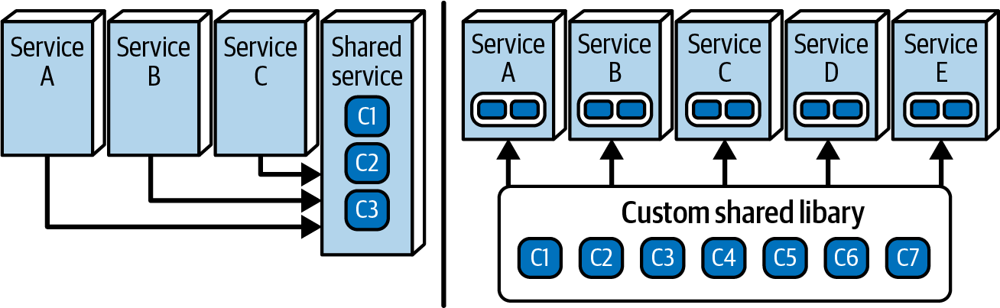
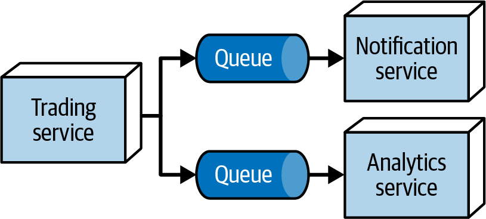
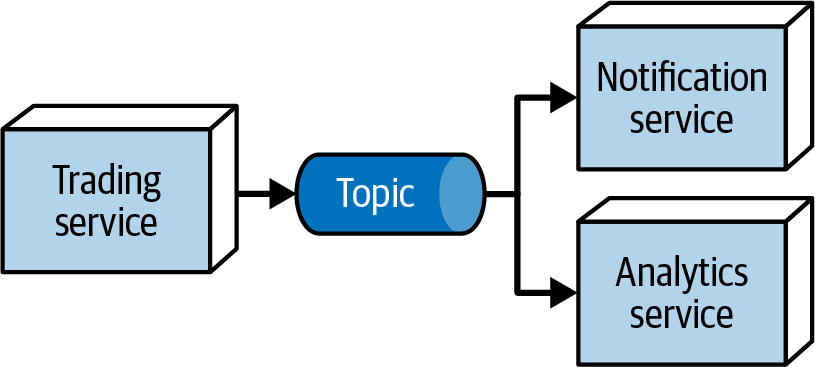

# Chapter 27. The Laws of Software Architecture, Revisited

In Chapter 1, we introduced the three fundamental laws that govern the discipline of software architecture. Throughout this book, every pattern, style, and case study has served as a practical demonstration of these laws in action.

### The Three Laws:
1.  **Everything in software architecture is a trade-off.**
2.  **Why is more important than how.**
3.  **Most architecture decisions aren’t binary but exist on a spectrum.**

In this concluding chapter, we revisit these laws to provide a deeper perspective on how they should shape your daily practice as a software architect.

---

## First Law: Everything in Software Architecture Is a Trade-Off
This law is the defining characteristic of our profession. Many new architects believe their job is to find "the best" solution or a silver bullet that solves all problems. In reality, there is no such thing as a "best" architecture—only a series of trade-offs.

### The Danger of Technical Evangelism
Honing your reputation as an objective arbiter of trade-offs is far more valuable than being an advocate for any single technology or pattern. Evangelism is dangerous for two main reasons:

1.  **Evolutionary Churn:** Yesterday’s "best practice" frequently becomes tomorrow’s "antipattern." If you invest your social capital in evangelizing for a specific solution, your credibility may suffer when that solution inevitably needs to be replaced.
2.  **The Need for Objectivity:** Organizational decision-makers aren't looking for enthusiastic advocacy; they are looking for sober, balanced analysis. An architect who provides unbiased trade-off assessments becomes a trusted advisor.

### The Architect’s Role
Your primary responsibility is to analyze the trade-offs of every decision. If you can't identify the drawbacks of a proposed solution, you haven't looked hard enough. Being the "go-to" person for an objective analysis makes you an indispensable asset to your organization.

---

## Case Study: Shared Library vs. Shared Service
A classic architectural conundrum in distributed systems (like microservices or EDA) is how to share common behavior: should you use a **shared library** (compile-time) or a **shared service** (runtime)?

To answer the inevitable "It depends," we must analyze the contextual factors:

### Trade-off Factors
*   **Heterogeneous Code:** If your system uses multiple languages, a **service** is easier (+) because it's platform-agnostic. A library (-) requires a version for each tech stack.
*   **Code Volatility (Churn):** A **service** wins (+) because updates are available instantly upon deployment. A library (-) requires every consuming service to be recompiled and redeployed.
*   **Versioning:** A **library** is superior (+) because version differences are resolved at compile time. A **service** (-) requires complex runtime versioning logic.
*   **Change Risk:** A **library** offers high confidence (+) through compile-time verification. A **service** (-) introduces the risk of runtime faults during invocation.
*   **Performance & Scalability:** A **library** wins (+) with efficient in-process calls. A **service** (-) suffers from network latency and diminished scalability.
*   **Fault Tolerance:** A **library** is more stable (+) once deployed. A **service** (-) is vulnerable to network outages and service failures.

### Comparison Matrix (Table 27-1)

| Factor | Shared Library | Shared Service |
| :--- | :---: | :---: |
| Heterogeneous code | - | + |
| High code volatility | - | + |
| Ability to version changes | + | - |
| Overall change risk | + | - |
| Performance | + | - |
| Fault tolerance | + | - |
| Scalability | + | - |

In this specific context, the **Shared Library** appears to be the stronger choice across most operational and developmental criteria. However, if the environment is highly polyglot or the shared code changes daily, the **Shared Service** might become the necessary path.

---

## Case Study: Queues vs. Topics
Another common trade-off involves choosing the communication protocol for notifying multiple services (e.g., Notification and Analytics) about events like trade executions.

### Option 1: Queues (Point-to-Point)
The publisher sends a message to a specific queue for each consumer (Figure 27-2).
*   **Advantage:** Allows for **heterogeneous messages**—each consumer can receive a different subset of data tailored to its needs.
*   **Security:** High. The publisher knows exactly who is receiving the message, making it harder for unauthorized services to listen in.
*   **Monitoring:** Independent monitoring and scaling of each consumer's queue.

#### Table 27-2: Trade-offs for Queues
| Advantage | Disadvantage |
| :--- | :--- |
| Supports heterogeneous messages | Higher degree of coupling |
| Independent monitoring of queue depth | Publisher must connect to multiple queues |
| Higher security | Requires more infrastructure |
| | Less extensible (adding consumers requires rework) |

---

### Option 2: Topics (Publish-Subscribe)
The publisher sends one message to a topic, and all subscribers receive it (Figure 27-3).
*   **Advantage:** **Extensibility**. New consumers can subscribe at any time without modifying the publisher or existing consumers.
*   **Coupling:** Extremely low. The publisher is unaware of the consumers.
*   **Efficiency:** The publisher only has to generate and send a single message.

#### Table 27-3: Trade-offs for Topics
| Advantage | Disadvantage |
| :--- | :--- |
| Low coupling | Homogeneous messages (everyone gets the same data) |
| Publisher only generates one message | Security risks (all subscribers see the full message) |
| High extensibility/evolvability | Harder to monitor or scale individual consumers |
| | Potential "Stamp Coupling" issues |

### The Decision
If your priority is **Security** and **Data Precision** (tailoring messages), **Queues** are the better choice. If your organization is growing rapidly and needs high **Extensibility**, **Topics** provide the necessary agility.

---

## First Corollary: Missing Trade-Offs
Our first law has two corollaries. The first is a warning to every architect:

> [!CAUTION]
> **Corollary 1:** If you think you’ve discovered something that isn’t a trade-off, more likely you just haven’t identified the trade-off…yet.

### The Illusion of Pure Benefit: Code Reuse
Code reuse is often presented as an unalloyed good. The reasoning is simple: the more code we reuse, the less we have to write, saving time and money. However, reuse comes with a hidden cost: **Coupling**.

#### Factors for Effective Reuse:
1.  **Abstraction:** The code must be generic enough to solve multiple problems.
2.  **Low Volatility:** This is the factor architects most often miss. If you reuse a module that is constantly changing (high churn), every update forces a ripple of coordination, testing, and potential breaking changes across the entire system.

This was the "quicksand" of orchestration-driven SOA. By trying to reuse everything, teams became paralyzed by the unpredictable side effects of even minor changes. 

### The Decoupling vs. Reuse Paradox
A frequent request from stakeholders is: *"We want the agility and decoupling of microservices, but we also want high institutional reuse to avoid duplication."*

As an architect, you must be the bearer of bad news: **You cannot have both.** 
*   **Decoupling** provides agility and independent deployment.
*   **Reuse** is achieved through coupling.

These two goals are fundamentally incompatible. Successful reuse targets are "plumbing"—frameworks, libraries, and platforms. Domain concepts, which change the fastest, are the worst candidates for reuse. This is why Domain-Driven Design (DDD) insists that bounded contexts should not reuse implementation details from one another.

---

## Second Corollary: You Can’t Do It Just Once
Software architecture decisions are not "set and forget." Because the variables involved (budget, team experience, technology churn) are constantly shifting, you must perform trade-off analysis repeatedly. 

> [!TIP]
> **Ongoing Evaluation.** A decision that was correct for Project A may be a disaster for Project B due to subtle differences in context. This ongoing analysis is the core value an architect provides to an organization.

---

## Second Law: Why Is More Important Than How
While it’s easy to see *how* a system works by looking at the code or diagrams, it’s often impossible to know *why* specific choices were made if the context wasn't documented.

### ADRs and the "Why"
This is why **Architecture Decision Records (ADRs)** are vital. They capture the context, the options considered, and the trade-offs accepted. Without them, future architects (including your future self) will be forced to redo the analysis just to understand the reasoning.

### The "Out of Context" Antipattern
This occurs when an architect understands the trade-offs but fails to **weight** them based on the current situation. 
*   **Example:** In our Shared Library vs. Service analysis, the library won on points. However, if your team is highly polyglot, the "Heterogeneous Code" factor should be weighted so heavily that the **Service** becomes the obvious choice, despite its other drawbacks.

---

## Third Law: The Spectrum Between Extremes
Binary decisions are a luxury architects rarely enjoy. 

> [!IMPORTANT]
> **Law 3:** Most architecture decisions aren’t binary but rather exist on a spectrum between extremes.

Whether it’s the line between **Architecture and Design** or the choice between **Orchestration and Choreography**, the criteria exist on a messy spectrum. A true architectural decision is one where **every option has significant trade-offs.**

If an answer is simple and clear-cut, it’s probably a design decision. If every answer begins with "It depends," you are dealing with architecture.

---

## Parting Words: Practice and Trade-offs
To quote Fred Brooks: *"How do we get great designers? Great designers design, of course."*

The only way to become a great architect is through **practice**. 
1.  **Hone your skills:** Use tools like **Architecture Katas** to solve problems outside your daily routine.
2.  **Focus on the Why:** Always look for the trade-offs. If someone presents a solution as perfect, they haven't identified the drawbacks yet.
3.  **Widen your breadth:** Stay curious about different technologies and styles.

There are no right or wrong answers in architecture—only trade-offs. **Always learn, always practice, and go do some architecture!**

---
