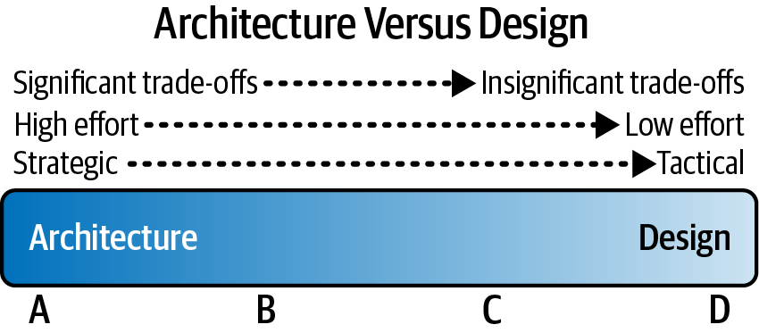
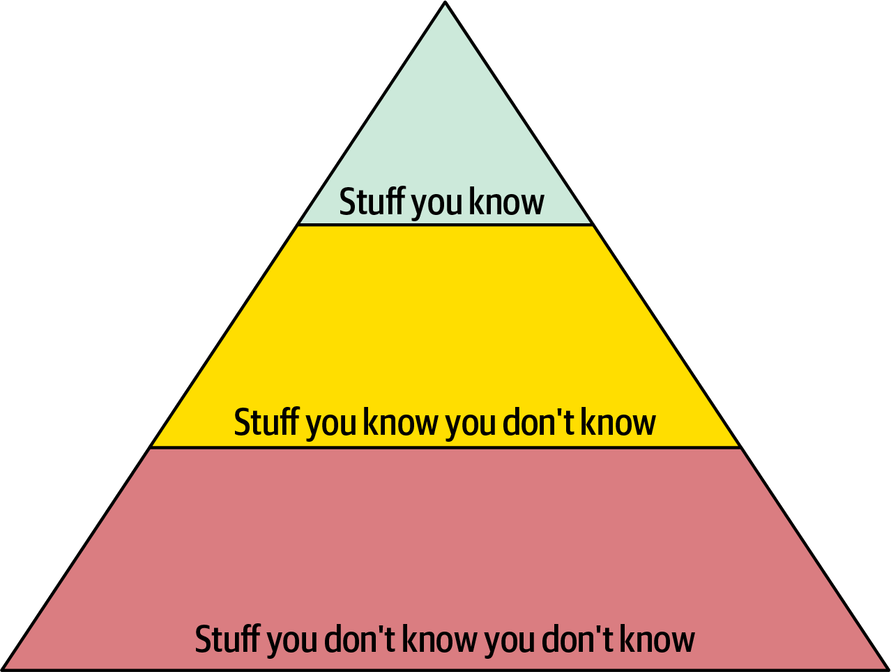
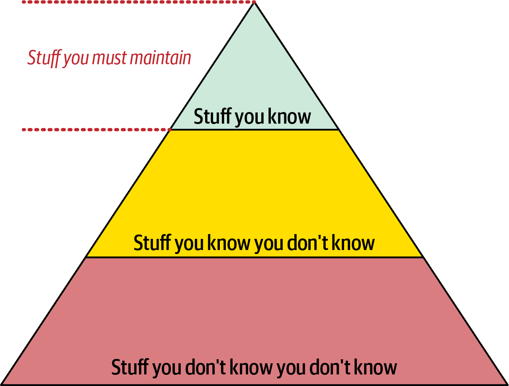
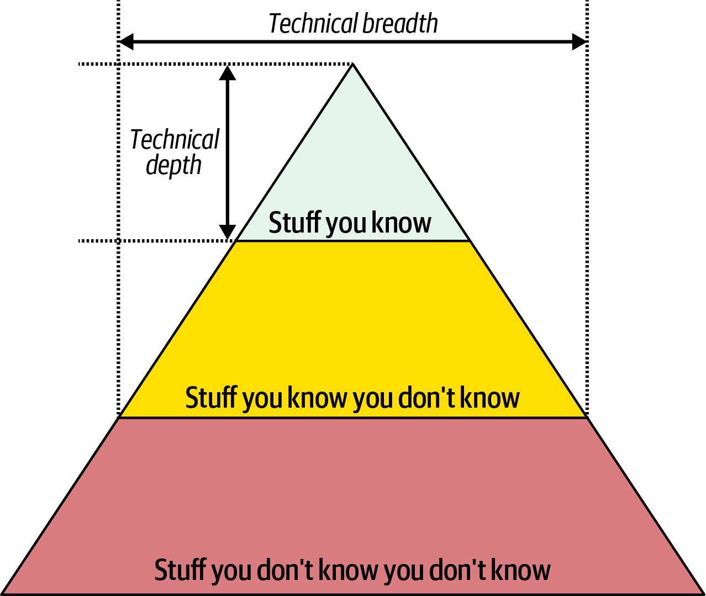
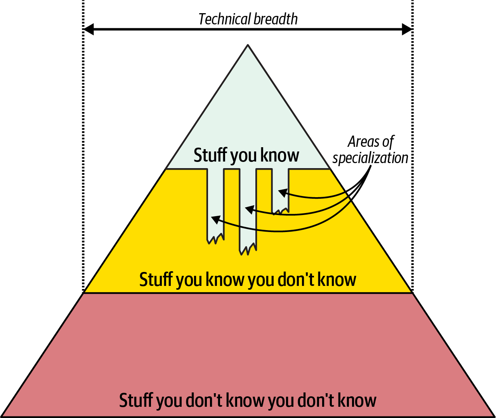
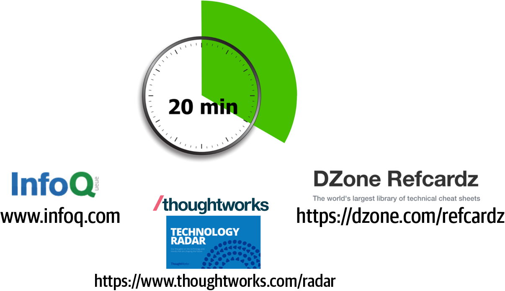
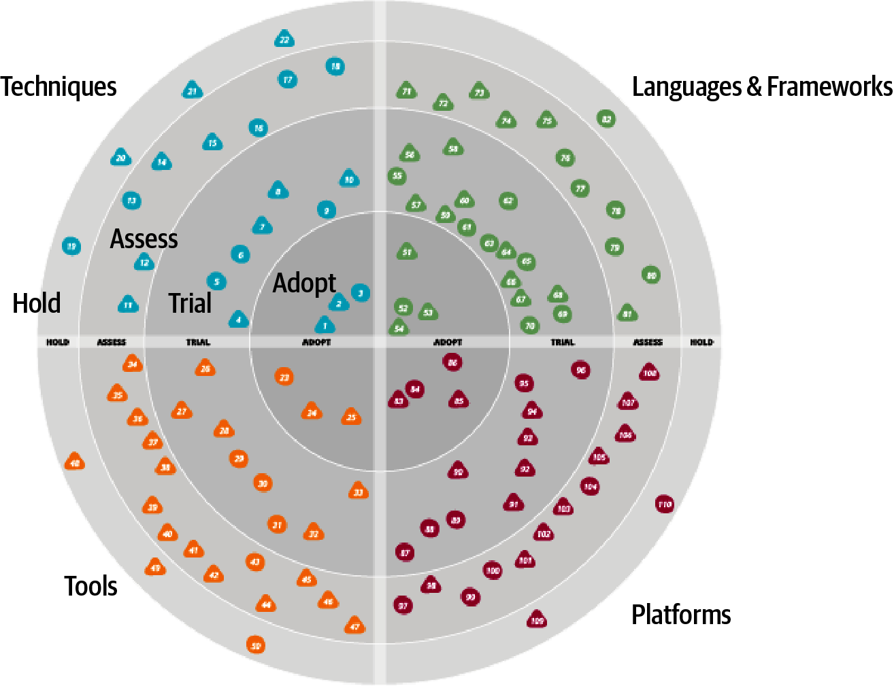
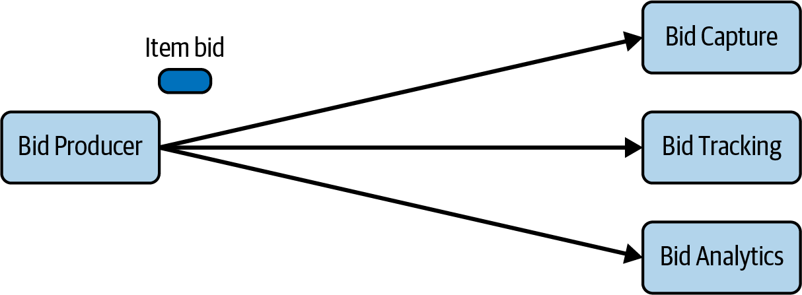
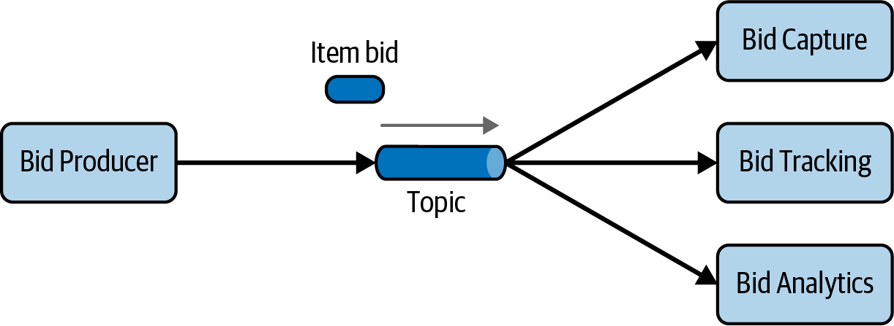
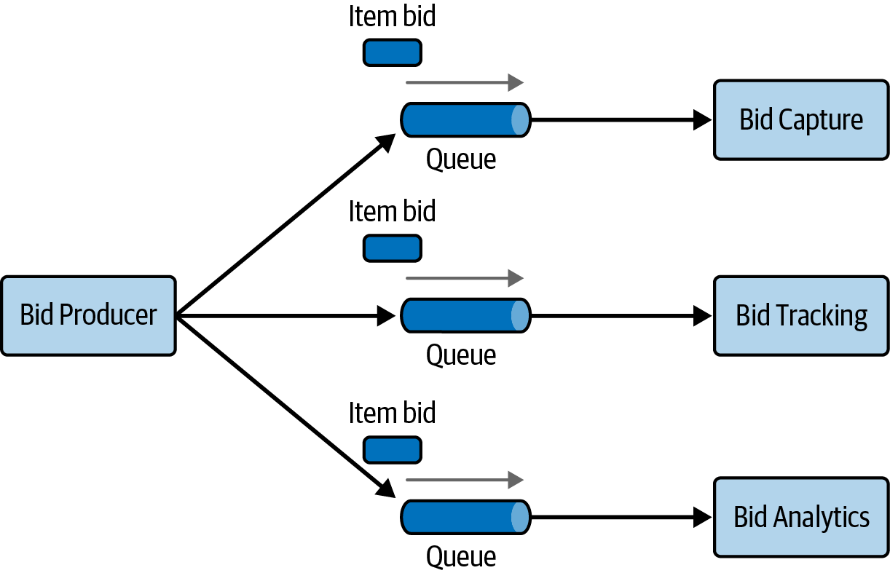

# Chapter 2: Architectural Thinking

"Architectural thinking" is the ability to see a system from a high-level, structural point of view. It involves understanding how a single change might impact overall scalability, paying attention to how different components interact, and identifying the correct tools or frameworks to solve specific business problems.

Thinking like an architect requires:
1. Understanding the difference between architecture and design.
2. Possessing a wide breadth of technical knowledge to see solutions others cannot.
3. Translating business drivers into architectural concerns.
4. Analyzing and reconciling trade-offs between various solutions.

---

## Architecture Versus Design
To understand the difference between architecture and design, imagine building a custom house. 
*   **Architecture** defines the structure: Is it a single-story ranch or a multi-story contemporary home? Does it have a flat roof or a peaked roof? How many bedrooms does it have?
*   **Design** defines the appearance and interior details: Does it have hardwood floors or carpet? What color are the walls? What style are the light fixtures?

In software, **Architecture defines the structure and shape of the system** (e.g., choosing a Microservices architecture), whereas **Design defines the appearance and internal behavior** (e.g., the layout of the UI or the logic inside a single class).

### The Spectrum Between Architecture and Design
In reality, decisions are rarely purely "architecture" or purely "design." Most decisions fall somewhere on a sliding scale. To determine where a decision lands on this spectrum (and therefore, who should make the decision), architects evaluate three criteria:
1. Is the decision more strategic in nature, or more tactical?
2. How much effort will it take to implement or change?
3. How significant are the trade-offs?

---

## Strategic Versus Tactical Decisions
The most reliable way to tell if a decision is Architectural is to determine if it is **Strategic** or **Tactical**.

*   **Strategic decisions** are long-term, structural, and architectural.
*   **Tactical decisions** are short-term, independent, and design-oriented.

You can determine if a decision is strategic or tactical by asking the following three questions:

### 1. How much thought and planning is involved?
*   **Tactical (Design):** A decision that takes a developer a few minutes to make (e.g., which loop structure to use).
*   **Strategic (Architecture):** A decision that requires weeks of planning and prototyping (e.g., choosing a database technology).

### 2. How many people are involved in the decision?
*   **Tactical (Design):** A decision made alone or by briefly consulting a colleague.
*   **Strategic (Architecture):** A decision that requires multiple meetings, presentations, and sign-offs from various stakeholders across different departments.

### 3. Is the decision a long-term vision or a short-term action?
*   **Tactical (Design):** A decision or implementation that is likely to change or be refactored soon.
*   **Strategic (Architecture):** A decision that establishes a foundation that the company will live with for a very long time.

---

## Level of Effort
As Martin Fowler famously put it in "Who Needs an Architect?", architecture is "**the stuff that's hard to change.**"

The level of effort required to implement or change a decision is a strong indicator of where it falls on the spectrum:
*   **High Effort (Architecture):** Moving from a monolithic layered architecture to microservices requires massive effort across multiple teams and systems.
*   **Low Effort (Design):** Rearranging fields on a UI screen or refactoring a single method requires minimal effort.

If a decision is difficult and costly to reverse once implemented, it is almost certainly an architectural concern.

---

## The Significance of Trade-Offs
Analyzing the trade-offs involved in a decision is another key way to distinguish between architecture and design. The more significant the trade-offs, the more "architectural" the decision.

*   **Significant Trade-Offs (Architecture):** Choosing a Microservices architecture offers better scalability and fault tolerance but introduces extreme complexity, higher costs, and poor data consistency. These high-stakes trade-offs make this an architectural decision.
*   **Minor Trade-Offs (Design):** Breaking a large class into smaller ones improves readability but slightly increases the number of files to manage. These trade-offs are relatively minor, placing the decision on the design side of the spectrum.

If you are wrestling with competing priorities that have a major impact on the system's success, you are likely making an architectural decision.

---

## Technical Breadth
While developers require a massive amount of **technical depth** (expertise in specific languages or frameworks) to do their jobs effectively, software architects must prioritize **technical breadth** (knowing a little bit about a lot of things).

To understand this transition, it helps to visualize the **Knowledge Pyramid**, which categorizes all technical knowledge in the world into three levels:

1.  **Stuff you know (Top):** Technologies you use daily and are an expert in. This section is the smallest because expertise takes massive amounts of time to acquire and maintain.
2.  **Stuff you know you don't know (Middle):** Technologies you have heard of and understand conceptually, but have no practical expertise in (e.g., knowing Clojure is a functional Lisp dialect, but not knowing how to write it).
3.  **Stuff you don't know you don't know (Bottom):** The vast universe of tools and frameworks that might be the perfect solution to your problem, if only you knew they existed.

### The Developer's Pyramid
Early in a career, a developer's primary goal is expanding the top of the pyramid to gain valuable expertise. However, because technology is constantly evolving, expertise is not static. If you stop using a framework for a year, your expertise decays. Maintaining the top of the pyramid requires a massive, ongoing time investment.

### The Architect's Pyramid
As a developer transitions to an architect, the nature of their knowledge must change. Because architects must match system capabilities to technical constraints, it is infinitely more valuable for an architect to know that five potential solutions exist (breadth) than to be the absolute master of only one (depth).

To succeed, an architect must intentionally sacrifice some of their hard-won technical depth (letting their expertise atrophy) and invest that time into aggressively expanding the middle of the pyramid, turning the "stuff they don't know they don't know" into "stuff they know they don't know."

### Common Dysfunctions
The shift from depth to breadth is psychologically difficult for many developers, leading to two common dysfunctions:
1.  **The Burnout:** The architect tries to maintain deep, hands-on expertise in dozens of technologies simultaneously, working themselves to exhaustion but succeeding in none.
2.  **Stale Expertise:** The architect lets their skills atrophy but falsely believes their outdated knowledge is still cutting-edge, leading them to mandate ancient technology decisions.

---

## The Frozen Caveman Antipattern
An *antipattern* is something that seems like a good idea when you begin, but ultimately leads to trouble. A common behavioral antipattern observed in software architects is the **Frozen Caveman Antipattern**.

This occurs when an architect has been "burned" by a poor decision or a freak accident in the past, and as a result, they revert to an irrational pet concern for every single architecture they design.

**Example:**
An architect once experienced a freak communication outage that disconnected headquarters from its stores in Italy. For years afterward, whenever a new architecture was proposed, the architect would obsessively ask, *"But what if we lose Italy?"* even though the chances of the event recurring were virtually zero. 

While risk assessment is a critical part of an architect's job, the Frozen Caveman becomes irrationally obsessed with *perceived* technical risk rather than *genuine* technical risk. 

Thinking like an architect requires overcoming these past traumas. By intentionally expanding **Technical Breadth**, an architect gains a larger "quiver of arrows." Having a broader understanding of modern solutions allows an architect to abandon outdated fears, ask more relevant questions, and uncover the "stuff they don't know that they don't know."

---

## The 20-Minute Rule
Expanding technical breadth while working a full-time job is difficult. To stay current without burning out, architects can utilize the **20-minute rule**.

The concept is simple: devote at least **20 minutes every day** to learning something new. 

### Where to spend your 20 minutes:
*   **Aggregators and Portals:** Sites like *InfoQ* or *DZone* provide summaries of new architectural trends and patterns.
*   **Technology Radars:** The *Thoughtworks Technology Radar* is an excellent way to see which technologies are "blipping" on the industry's radar.
*   **Buzzword Research:** Simply looking up an unfamiliar term on the internet to move it from the "stuff you don't know you don't know" to the "stuff you know you don't know."

### When to do it:
To make the 20-minute rule effective, timing is critical.
*   **Don't do it at lunch:** It is too easy to work through lunch.
*   **Don't do it in the evening:** Personal and family life will always take priority after a long day.
*   **Do it first thing in the morning:** Carve out your 20 minutes right after your morning coffee/tea and—most importantly—**before you check your email**. Once you open your inbox, your day is dictated by others. By doing it first thing, your mind is fresh and free from distractions.

Consistently following this rule will steadily build the broad portfolio of knowledge necessary to be an effective software architect.

---

## Developing a Personal Radar
When developers spend years deeply invested in a specific technology, they tend to live in a "memetic bubble" or echo chamber. Inside the bubble, everyone thinks that technology is the most important thing in the world. When the industry inevitably shifts (e.g., the sudden death of DOS applications in favor of Windows), the bubble collapses without warning, rendering deep, hard-won expertise useless overnight.

To avoid this peril, architects need a living document to assess the risks and rewards of existing and nascent technologies. This is known as a **Technology Radar**.

### The Thoughtworks Technology Radar
Originally created by the Technology Advisory Board at Thoughtworks, the Technology Radar helps structure the assessment of the software-development landscape.

The radar is divided into **four quadrants**:
1.  **Tools:** Development tools, IDEs, and integration tools.
2.  **Languages and Frameworks:** Programming languages, libraries, and open-source frameworks.
3.  **Techniques:** Software development practices, processes, and advice.
4.  **Platforms:** Databases, cloud vendors, and operating systems.

The radar is also divided into **four rings** (from outer to inner):
1.  **Hold (Outer):** Technologies you should *not* use for new development (or bad habits you are trying to break).
2.  **Assess:** Promising technologies worth exploring. This is a staging area for future research.
3.  **Trial:** Technologies worth pursuing right now via low-risk pilot projects or spike experiments within a larger codebase.
4.  **Adopt (Inner):** Proven technologies you are highly excited about and consider best practices for solving specific problems.

### Building Your Own
Most technologists pick tools on an ad-hoc basis based on what is cool or what their current employer uses. This is dangerous to your career. 

You should treat your technology portfolio like a financial portfolio: **diversify it.** Invest in widely demanded, stable technologies, but also take a few "gambits" on cutting-edge tech (like generative AI or IoT). 

Building a personal radar acts as a forcing function. Creating the visualization gives you an excuse to carve out time to think strategically about your career. Thoughtworks even provides a free *Build Your Own Radar* tool that generates the visualization from a simple Google Spreadsheet.

---

## Analyzing Trade-Offs
Thinking like an architect means seeing the inherent trade-offs in every technical solution and analyzing those trade-offs to determine the best path forward. This leads to a fundamental truth of the role:

> **"Architecture is the stuff you can’t Google or ask an LLM about."** — *Mark Richards*

Because everything is a trade-off, the answer to every architectural question is universally, **"It depends."** You cannot ask an AI if Microservices or REST is better for your company, because it depends entirely on your deployment environment, business drivers, budget, company culture, and developer skill sets. 

> **"There are no right or wrong answers in architecture—only trade-offs."** — *Neal Ford*

### Example: Bidding System (Topics vs. Queues)
Consider an item auction system where a **Bid Producer** service must send bid amounts to three consumers: **Bid Capture**, **Bid Tracking**, and **Bid Analytics**. 

Should the architect use a **Topic** (Publish-and-Subscribe) or **Queues** (Point-to-Point)?

#### Option 1: Publish-and-Subscribe (Topics)

*   **The Advantage:** The obvious benefit here is **architectural extensibility**. The Bid Producer only connects to a single topic. If a new service is added in the future, it simply subscribes to the topic. No existing infrastructure or code needs to change. The Bid Producer remains highly decoupled from the consumers.

#### Option 2: Point-to-Point (Queues)

*   **The Advantage:** If the architect chooses queues, the Bid Producer must maintain three separate connections. Adding a new service requires modifying the Bid Producer to connect to a fourth queue. This seems strictly worse, but as Clojure creator Rich Hickey notes:
    > **"Programmers know the benefits of everything and the trade-offs of nothing. Architects need to understand both."**

### Analyzing the Hidden Disadvantages
To think architecturally, you must look for the negatives of the "obvious" solution:
1.  **Security:** With a topic, any rogue service can subscribe and wiretap the data. With queues, data is delivered specifically to one consumer. If a queue is hijacked, the intended consumer starves, instantly triggering data-loss alerts.
2.  **Contracts:** Topics force homogeneous contracts (every consumer receives the exact same payload). Queues allow heterogeneous contracts (the Bid Producer can format different payloads tailored specifically for each consumer queue without breaking others).
3.  **Autoscaling:** Topics generally do not support monitoring the number of backlogged messages. Queues can be individually monitored, allowing programmatic load balancing and precise, independent autoscaling for each consumer.

### Summary of Trade-Offs

| Topic Advantages | Topic Disadvantages (Queue Advantages) |
| :--- | :--- |
| Architectural extensibility | Data access and data security concerns |
| Service decoupling | Requires homogeneous contracts |
| | Lacks monitoring and programmatic scalability |

So, which is the better option? **It depends!** An architect must analyze these trade-offs and ask the business, *"Which is more important to us right now: rapid extensibility or strict data security?"* The answer dictates the architecture.

---

## Understanding Business Drivers
Thinking like an architect means understanding the business drivers required for the success of the system and translating those requirements into architectural characteristics (e.g., scalability, performance, availability). 

This requires the architect to have a deep understanding of the business domain and to maintain healthy, collaborative relationships with key business stakeholders. (This translation process is detailed extensively in Chapters 4 through 7).

---

## Balancing Architecture and Hands-On Coding
One of the most difficult tasks an architect faces is balancing the architectural role with hands-on coding. We firmly believe that **every architect should code** to maintain a baseline of technical depth.

### Avoiding the Bottleneck Trap
The most common mistake architects make when trying to stay hands-on is falling into the **Bottleneck Trap**. This antipattern occurs when an architect takes ownership of critical-path code (like the underlying core framework). Because architects are not full-time developers and spend vast amounts of time in meetings, they inevitably become a bottleneck, stalling the entire team's progress.

**The Solution:**
Delegate the critical-path and framework code to the development team (giving them ownership of the hardest parts of the system). Instead, the architect should pick up a minor piece of business functionality (such as a simple UI screen) scheduled one to three iterations down the road. 
This provides three benefits:
1.  The architect gains hands-on coding experience without blocking the team.
2.  The team gets ownership over the core framework.
3.  The architect experiences the exact same pain points, processes, and deployment environments as the developers, making them highly empathetic to the developer experience.

### Other Ways to Stay Hands-On
If an architect simply cannot pick up business tickets with the development team, there are other ways to maintain technical depth:

#### 1. Frequent Proofs-of-Concept (POCs)
When stuck between two solutions (e.g., choosing between two caching products), build a working POC in both. This allows the architect to compare the implementation effort and architectural characteristics firsthand. 
*Note: Always write production-quality code for a POC. Sloppy "throwaway" code almost always makes its way into the repository and accidentally becomes the reference architecture for the team.*

#### 2. Tackle Technical Debt
Tech debt is usually low priority. If an architect takes it on and fails to finish it within a sprint due to meeting loads, it won't derail the team's release schedule, but it still provides valuable coding experience.

#### 3. Fix Bugs
While not glamorous, fixing bugs exposes the architect directly to the weaknesses and pain points in the codebase and the overall architecture.

#### 4. Automate
Look for repetitive manual tasks the development team suffers through and write simple CLI tools or scripts to automate them. Additionally, write automated architectural fitness functions (like using ArchUnit in Java) to automate compliance checking.

#### 5. Do Code Reviews
While you aren't writing the code yourself, doing frequent code reviews forces you to stay intimately familiar with the codebase while providing excellent mentoring and coaching opportunities.

---

## There’s More to Architectural Thinking
This chapter forms the foundational aspects of thinking like an architect. However, the journey continues by understanding the overall structure of a system (Chapter 3), translating business concerns into structural characteristics (Chapters 4-7), and defining the logical building blocks of the system (Chapter 8).
