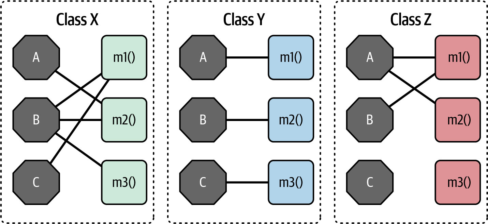
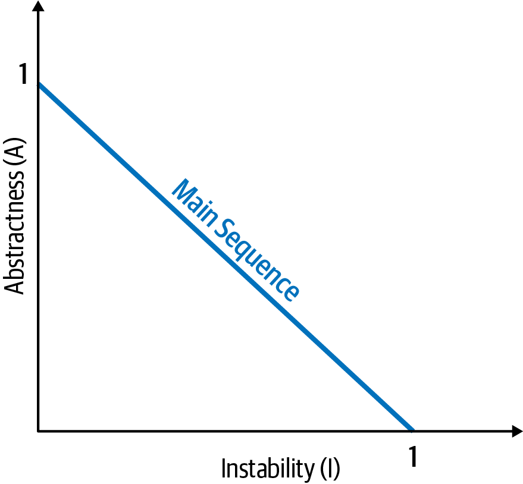
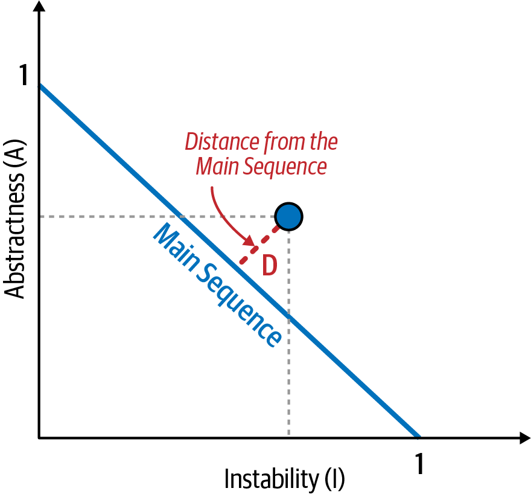
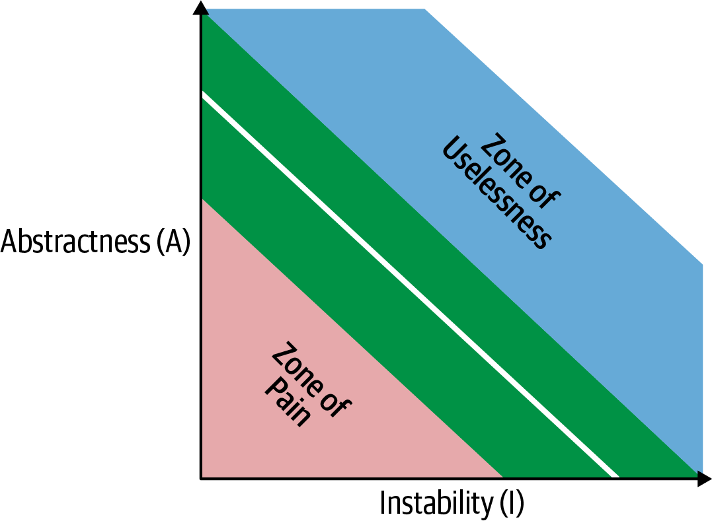
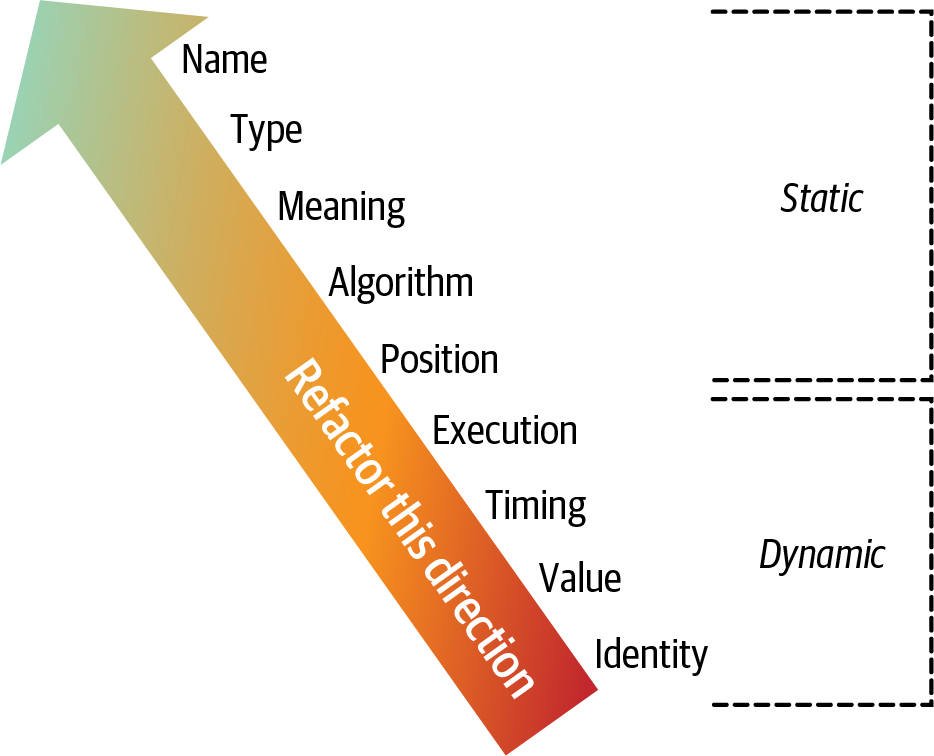

# Chapter 3: Modularity

> **"95% of the words [written about software architecture] are spent extolling the benefits of 'modularity' and little, if anything, is said about how to achieve it."**
> — *Glenford J. Myers (1978)*

Despite being universally praised as a foundational concept in software architecture, **modularity** has historically been difficult to define. At its core, modularity is an organizing principle—it is the mechanism platforms use to group related code together into logical modules. 

Understanding modularity is critical because virtually all architectural analysis tools (metrics, fitness functions, visualizations) rely heavily on how a system's modules wire together. 

### Entropy in Software Architecture
To use a physics analogy: complex systems naturally tend toward **entropy** (disorder). In a physical system, energy must be constantly added to preserve order. Software systems operate the exact same way. Without an architect constantly expending energy to enforce modularity and structural soundness, the codebase will naturally degrade into chaos. 

Because of this, preserving good modularity is considered an **implicit architecture characteristic**. No business stakeholder will ever explicitly ask you to build "good modular distinction," but a sustainable codebase absolutely requires the order and consistency that modularity brings.

---

## Modularity Versus Granularity
Architects and developers frequently use the terms *modularity* and *granularity* interchangeably, but they describe two entirely different concepts.

*   **Modularity** is the *act* of breaking a system apart into smaller pieces (for example, the structural shift of moving from a monolithic layered architecture to a distributed microservices architecture).
*   **Granularity** refers to the *size* of those pieces (for example, deciding exactly how large or small an individual microservice should be).

> **"Embrace modularity, but beware of granularity."** — *Mark Richards*

It is almost always *granularity* that gets architects into trouble. If components are broken down to an incorrect level of granularity, it forces those components to become heavily coupled to one another just to accomplish basic tasks. 

Failing to pay attention to granularity and overall coupling leads directly to notoriously hard-to-maintain architecture antipatterns, such as:
*   Spaghetti Architecture
*   The Distributed Monolith
*   The Big Ball of Distributed Mud

---

## Defining Modularity
In the context of software architecture, **modularity** is defined as the logical grouping of related code. 

For developers, this typically manifests as packages (Java), namespaces (.NET), or modules. For example, a `com.mycompany.customer` package in Java should logically contain everything related to a customer.

Architects must pay close attention to how developers package code because packaging dictates coupling. If developers create a loose logical partition within a physical monolith, the resulting coupling will severely impede future efforts to break that monolith apart or reuse specific components. 

### Modular Reuse Before Classes (A Brief History)
The concept of the "module" actually predates object-oriented programming. 
*   **1968:** Edsger Dijkstra publishes "Go To Statement Considered Harmful," kicking off the era of structured programming languages (C, Pascal) which forced developers to think about how code logically fit together without jumping around non-linearly.
*   **Mid-1980s:** Realizing structured languages lacked a good way to logically group code, the short-lived era of **Modular Programming Languages** (like Ada and Modula) was born. They introduced the "module" construct.
*   **Late-1980s/1990s:** Object-Oriented (OO) languages exploded in popularity, offering new ways to encapsulate code. However, language designers recognized the sheer utility of the "module" and retained it in the form of packages and namespaces.

Because of this history, modern languages like Java contain features to support multiple paradigms simultaneously (modular, object-oriented, and functional).

### The Namespace Hack: Java 1.0
Namespaces are critical for keeping software assets cleanly separated (similar to how IP addresses separate machines on the internet). 

When creating Java 1.0, the designers used a clever hack to completely eliminate naming collisions (e.g., having two different classes named `Order` in the same project). They mandated that **the physical directory structure of the code must exactly match the logical package namespace**. Because an operating system filesystem physically prevents two files with the exact same name from existing in the same directory, naming ambiguity was inherently solved by the OS.

While brilliant in theory, this physical constraint became incredibly cumbersome as projects scaled and organizations tried to distribute reusable libraries. 

To fix this, Java 1.2 introduced the **JAR** (Java ARchive) file, allowing an archive file to act as a directory on the classpath. However, this broke the original namespace hack: now, two different JAR files could contain classes with the exact same name, leading to a decade of notorious "class loader" debugging nightmares for Java developers.

---

## Measuring Modularity
Because modularity is critical to structural soundness, architects need tools to measure and understand it. Researchers have developed three key, language-agnostic concepts to measure modularity: **Cohesion**, **Coupling**, and **Connascence**.

### Cohesion
Cohesion refers to the extent to which the parts of a module should be contained within the same module—in other words, how closely related the parts are to one another. 

An ideally cohesive module contains everything it needs to function. If an architect tries to break a cohesive module into smaller pieces, they will be forced to artificially couple those pieces back together via inter-module calls just to achieve a useful result.

> **"Attempting to divide a cohesive module would only result in increased coupling and decreased readability."** — *Larry Constantine*

#### The Range of Cohesion (From Best to Worst)
Computer scientists measure cohesion on a spectrum from best to worst:

1.  **Functional Cohesion (Best):** Every single part of the module is related to the other, and the module contains absolutely everything it needs to function.
2.  **Sequential Cohesion:** Two modules interact sequentially, where the output data of the first module becomes the required input data for the second.
3.  **Communicational Cohesion:** Two modules form a communication chain where each operates on information to contribute to a final output (e.g., one module saves a record to the database, and the other immediately generates an email based on that record).
4.  **Procedural Cohesion:** Two modules must execute their code in a highly specific, mandated order.
5.  **Temporal Cohesion:** Modules are related *only* by timing dependencies. For example, a system might have a list of totally unrelated tasks that must all be executed at system startup.
6.  **Logical Cohesion:** The data within the modules is related logically, but *not* functionally. A classic example is the ubiquitous `StringUtils` package found in almost every Java project: it is a dumping ground of static methods that all operate on Strings, but have absolutely nothing else to do with one another.
7.  **Coincidental Cohesion (Worst):** The elements in the module have absolutely no relation to one another other than happening to be physically located in the exact same source file.

### The Subjectivity of Cohesion
Despite the scale above, cohesion is a far less precise metric than coupling. Often, determining cohesion requires heavy architectural discretion and trade-off analysis.

Consider a **Customer Maintenance** module that contains the following operations:
*   Add customer
*   Update customer
*   Get customer
*   Notify customer
*   Get customer orders
*   Cancel customer orders

Should the last two operations stay in this module, or should the architect extract them into a separate **Order Maintenance** module? As always, **it depends**:
*   If those are the *only* two order-related operations in the entire system, extracting them might be overkill.
*   If the Customer Maintenance module is rapidly growing out of control, it is a prime candidate for extraction.
*   If the new Order Maintenance module requires massive amounts of customer data just to function, separating them would force extreme coupling between the two modules. In this case, leaving them together preserves cohesion.

### Measuring Cohesion: LCOM
To help architects analyze cohesion structurally, Chidamber and Kemerer developed a metric known as **LCOM** (Lack of Cohesion in Methods) as part of their Object-Oriented Metrics Suite. 

While the mathematical formulas for LCOM (Equation 3-1 and LCOM96b) are notoriously confusing, the concept is straightforward: **LCOM measures the sum of sets of methods that do not share fields.**

For example, imagine a class with two private fields: `a` and `b`. If half of the methods exclusively read/write to `a`, and the other half exclusively read/write to `b`, this class has a high LCOM score (indicating a severe *lack* of cohesion). The class is exhibiting incidental coupling and should probably be split in two.

In Figure 3-1:
*   **Class X** has a low LCOM score (Good). Methods share fields heavily.
*   **Class Y** has a high LCOM score (Bad). Each field/method pair is isolated and could be extracted into its own class without affecting system behavior.
*   **Class Z** shows mixed cohesion. The final field/method pair is isolated and could be refactored out.

#### The Flaw of LCOM
LCOM is highly useful for identifying bloated, incidentally coupled utility classes during architectural migrations. However, like all metrics, it has deficiencies: LCOM can only find *structural* lack of cohesion. It has absolutely no way to determine if those pieces fit together *logically*. 

This reinforces the **Second Law of Software Architecture:** *Why* is more important than *how*.

---

## Coupling
While cohesion is subjective, **coupling** is highly mathematical. Because method calls form a call graph, coupling can be precisely analyzed using graph theory. 

In 1979, the book *Structured Design* (Yourdon and Constantine) established two core metrics for coupling:
1.  **Afferent Coupling:** The number of *incoming* connections to a code artifact.
2.  **Efferent Coupling:** The number of *outgoing* connections to other code artifacts.

*(Note: Why did the authors choose two virtually identical, confusing names instead of just "incoming" and "outgoing"? Because they valued mathematical symmetry over clarity. A helpful mnemonic is that **A**fferent starts with **A** for **A**rriving/incoming, and **E**fferent starts with **E** for **E**xit/outgoing).*

### Derived Metrics (Robert C. Martin)
Raw coupling numbers are useful, but software engineer Robert C. Martin developed several crucial derived metrics that provide deeper insight into object-oriented systems:

#### 1. Abstractness
This metric measures the ratio of abstract artifacts (interfaces, abstract classes) to concrete implementations. 
*   **Formula:** `Abstract Elements / (Concrete Elements + Abstract Elements)`
*   **Low Abstractness (Near 0):** A massive block of concrete code with zero abstraction (like a 5,000-line `main()` method).
*   **High Abstractness (Near 1):** A system with so many layers of abstraction it becomes impossible to decipher (e.g., an `AbstractSingletonProxyFactoryBean`). 

#### 2. Instability
This metric determines the volatility of a codebase. 
*   **Formula:** `Efferent Coupling / (Efferent Coupling + Afferent Coupling)`

A codebase with a high degree of instability is highly susceptible to breaking when changes occur. For example, if a class has massive efferent (outgoing) coupling because it delegates work to 15 different classes, it has a high Instability score because a change to *any* of those 15 dependencies could break the calling class.

#### 3. Distance from the Main Sequence
One of the few holistic metrics available to architects is the **Distance from the Main Sequence**, which is derived directly from the combination of *Abstractness (A)* and *Instability (I)*.
*   **Formula:** `D = | A + I - 1 |`

Because Abstractness and Instability are both fractions between 0 and 1, they can be graphed against each other. The idealized relationship between them forms a straight diagonal line known as the **Main Sequence**.

When an architect evaluates a specific class, they plot it on the graph and measure its distance from the idealized line. 

Classes that fall close to the line exhibit a healthy, balanced mixture of abstraction and instability. However, classes that fall too far away from the line land in one of two dangerous zones:

1.  **The Zone of Uselessness (Upper Right):** Code that is entirely abstract but has zero incoming coupling (nobody depends on it). It is so abstract that it becomes virtually impossible to actually use.
2.  **The Zone of Pain (Lower Left):** Code that is entirely concrete (zero abstraction) but is massively depended upon by other classes. It is rigid, brittle, and incredibly painful to maintain because any change breaks everything else.

---

## The Limitations of Metrics
While code-level metrics are valuable, they are incredibly blunt instruments compared to the analysis tools used in other engineering disciplines (like civil or mechanical engineering). 

**All software metrics require human interpretation.**
For example, *Cyclomatic Complexity* perfectly measures how many execution paths exist in a block of code. However, the metric cannot distinguish between **essential complexity** (the code is complex because the business problem it solves is inherently complex) and **accidental complexity** (the developer just wrote terrible, convoluted code). 

Therefore, architects must establish baselines and use automated fitness functions to track metrics, while relying on their own expertise to interpret the *why* behind the numbers.

Finally, while the metrics defined by Yourdon and Constantine in 1979 are foundational, they were created for structural programming languages (functions) rather than object-oriented languages. Object-oriented architecture introduces new vectors of coupling, requiring a more refined, modern vocabulary to describe them: **Connascence**.

---

## Connascence

> **"Two components are connascent if a change in one would require the other to be modified in order to maintain the overall correctness of the system."**

Page-Jones divided this concept into two categories: **Static** (source-code level) and **Dynamic** (execution-time).

### Static Connascence
Static connascence refers to structural coupling visible at the source-code level. Types include:

1.  **Connascence of Name:** Multiple components must agree on the name of an entity (e.g., method names). This is the most common and *most desirable* type of coupling, because modern IDEs make system-wide name refactoring completely trivial.
2.  **Connascence of Type:** Components must agree on the data type of an entity (common in statically typed languages).
3.  **Connascence of Meaning (Convention):** Components must agree on the meaning of particular values. For example, relying on hardcoded numbers instead of constants (`int TRUE = 1; int FALSE = 0;`). If a developer flipped those values, the system would collapse.
4.  **Connascence of Position:** Components must agree on the order of values. For example, if a method signature is `updateSeat(String name, String location)`, passing the arguments out of order (`updateSeat("14D", "Smith")`) creates a semantic failure, even if the types technically match.
5.  **Connascence of Algorithm:** Components must agree on the exact same algorithm. A classic example is a client and server that must both use the identical security hashing algorithm to authenticate a user.

### Dynamic Connascence
Dynamic connascence analyzes coupling that only becomes visible at runtime. Types include:

1.  **Connascence of Execution:** The *order* of execution matters. For example, instantiating an `Email` object, but calling `email.send()` *before* calling `email.setRecipient()`. The code compiles, but fails at runtime.
2.  **Connascence of Timing:** The *timing* of execution matters. The most common example is a race condition where two threads execute simultaneously and corrupt an outcome.
3.  **Connascence of Values:** Several values are completely dependent on each other and must change *together*. For example, updating a single logical value across a distributed database architecture—either all databases update together, or none of them do.
4.  **Connascence of Identity:** Multiple components must reference the exact same underlying entity (for example, two independent services that must share and update the exact same distributed message queue).

---

## Connascence Properties
Connascence serves as a powerful analysis framework. To use it wisely, architects evaluate coupling against three core properties: **Strength**, **Locality**, and **Degree**.

### 1. Strength
The "strength" of connascence is determined by how easily a developer can refactor the coupling. 

Architects should always prefer *Static* connascence over *Dynamic* connascence because static coupling can be easily identified by source-code analysis and fixed using modern IDE tools. 

A core goal of refactoring is to convert strong forms of connascence into weaker ones. For example, replacing a "magic string" with a named constant is the act of refactoring *Connascence of Meaning* down to the highly desirable *Connascence of Name*.

### 2. Locality
Locality measures how proximal (close) modules are to one another. 

High/strong forms of connascence are acceptable if the components are grouped closely together in the same module. However, that exact same level of connascence becomes an architectural disaster if the components are separated across different modules or entirely different codebases. 

*(Note: This architectural observation—that implementation details and tight coupling should be scoped as narrowly as possible—is the exact same concept that was later popularized by Domain-Driven Design (DDD) under the name **Bounded Contexts**).*

### 3. Degree
Degree refers to the blast radius of a change: does changing a class impact two other classes, or fifty? 

Having a high degree of dynamic connascence isn't catastrophic in a tiny system with very few modules. However, as systems inevitably grow, the degree of impact scales, turning small coupling problems into massive architectural roadblocks.

---

## Guidelines for Using Connascence
By utilizing Strength, Locality, and Degree, architects can vastly improve system modularity. 

Meilir Page-Jones offers three foundational guidelines:
1.  **Minimize overall connascence** by breaking the system into encapsulated elements.
2.  **Minimize any remaining connascence** that crosses encapsulation boundaries.
3.  **Maximize connascence** *within* encapsulation boundaries.

Legendary software innovator Jim Weirich repopularized these concepts with two simple, actionable rules:
> **Rule of Degree:** Convert strong forms of connascence into weaker forms of connascence.
> **Rule of Locality:** As the distance between software elements increases, you must use weaker forms of connascence.

### The Value of the Vocabulary
Architects benefit from the vocabulary of connascence for the exact same reason developers benefit from the vocabulary of Design Patterns: it provides incredibly precise language to describe abstract concepts. 

Instead of writing a long-winded paragraph in a code review explaining why a developer shouldn't use a magic string, an architect can simply state: 
**"You have Connascence of Meaning here; please refactor it down to Connascence of Name."**

---

## From Modules to Components
While "module" is used as a generic term for bundles of related code, most architects refer to these building blocks as **components**. 

The concept of a component—and the struggle to achieve proper logical and physical separation—has existed since the dawn of computer science. We will dive deep into deriving components from problem domains in Chapter 8. But first, we must explore another fundamental aspect of software architecture: **architectural characteristics and their scope**.
