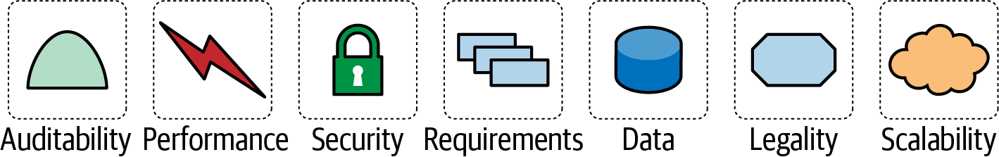
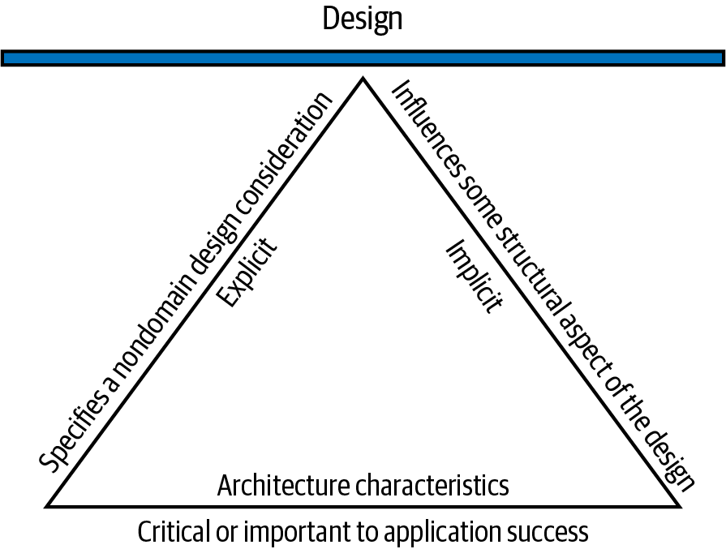

# Chapter 4: Architectural Characteristics Defined

Structural design—one of the primary responsibilities of a software architect—consists of two main activities:
1.  **Architectural characteristics analysis** (The focus of this chapter).
2.  **Logical component design** (Covered in Chapter 8).

These activities can be done in any order, or in parallel, but they ultimately join together to form the foundation of a system.

When a company builds a system to solve a problem, the list of requirements gathered is referred to as the **problem domain** (or just the **domain**). As established in Chapter 1, **architectural characteristics** are the critical capabilities of a system that are completely independent from the domain, but are absolutely essential to the system's success. 

Discovering and defining these characteristics is a core part of what distinguishes software architecture from standard software design and coding.

---

## The Longevity of "Non-Functional Requirements"
Many organizations still use the term **"non-functional requirements"** to describe architectural characteristics. We strongly dislike this term because it is self-denigrating. From a purely semantic standpoint, how do you convince a product team to invest time and money into something explicitly labeled "non-functional"? 

We also dislike the term **"quality attributes,"** because it implies after-the-fact quality assurance testing rather than proactive system design.

We prefer the term **architectural characteristics** because it elevates these concerns to their proper level of importance. Put simply:
*   The **Domain** represents the system's *behavior*.
*   The **Architectural Characteristics** represent the system's *capabilities*.

### Where did the term come from?
The term "non-functional requirements" got stuck in the industry vocabulary in the late 1970s. It originated alongside an estimation technique known as *function point analysis*, where system requirements were broken down into "function points" to estimate effort. 

Analysts quickly realized that a massive amount of development effort was required to build system capabilities outside of the core requirements (like scalability and security). They labeled this effort "non-function points," which eventually morphed into the stubbornly sticky "non-functional requirements" term still in use today.

---

## Architectural Characteristics and System Design
To be considered a true architectural characteristic, a requirement must meet **three specific criteria**:
1.  It specifies a nondomain design consideration.
2.  It influences some structural aspect of the design.
3.  It is critical or important to the application’s success.

These interlocking criteria are illustrated in the triangle below, where each element supports the overall design of the system. The fulcrum represents how these characteristics constantly interact with one another, creating the endless **trade-offs** that architects must navigate.

Let's look more closely at the three criteria:

### 1. Specifies a Nondomain Design Consideration
While domain requirements specify *what* the application should do (its behavior), architectural characteristics specify *how* to implement those requirements and *why* certain choices were made (its capabilities). 

For example, a requirement document will explicitly state what a user can purchase. It will rarely state "the system must prevent technical debt," yet that is a crucial design consideration the architect must enforce.

### 2. Influences a Structural Aspect of the Design
The primary reason architects extract these characteristics is to determine: *Can this be implemented through good design, or does it require a completely different structural approach?*

For example, consider **security** vs. **scalability**. 
*   An architect can accommodate security within a monolithic system by using good design and coding hygiene (e.g., encryption, hashing, and salting).
*   However, no amount of clever design will allow a monolithic architecture to scale beyond a certain point. To achieve extreme **scalability**, the architect *must* change the structure of the system (e.g., migrating to a distributed microservices architecture).

Architects pay exceptionally close attention to operational characteristics because they are the ones most likely to require special structural support.

### 3. Critical to Application Success
Applications *can* support a massive number of architectural characteristics... but they *shouldn't*. 

**Every architectural characteristic added to a system increases its overall complexity.** Therefore, architects must strive to choose the *fewest* possible characteristics, rather than the most. 

When evaluating these characteristics, architects will encounter two types:
*   **Explicit Characteristics:** Clearly defined in the requirements document (e.g., "The system must handle 500 concurrent users").
*   **Implicit Characteristics:** Rarely written down, but absolutely necessary for success. For example, a business stakeholder might not explicitly state that a system needs to be "available," "reliable," or "secure." Similarly, a high-frequency trading firm may not explicitly write down "low latency" in a ticket, because the architects in that problem domain already know it is implicitly required for survival. Architects must use their domain knowledge to uncover these hidden requirements.

---

## Architectural Characteristics (Partially) Listed
Because the software ecosystem evolves so rapidly, there is no true universal standard list of architectural characteristics. New concepts and measures appear constantly. However, architects generally categorize them into broad buckets to help structure their thinking. 

Two of the most prominent categories are **Operational** and **Structural** characteristics.

### Operational Architectural Characteristics
These characteristics overlap heavily with Operations and DevOps concerns. Because they often dictate how the system runs under stress, they frequently require dedicated structural support (as opposed to just good design).

| Term | Definition |
| :--- | :--- |
| **Availability** | Uptime requirements (e.g., 24/7). If highly available, steps must be in place to recover quickly from failure. |
| **Continuity** | The system’s overarching disaster recovery capability. |
| **Performance** | Measured via stress testing, peak analysis, and response times. |
| **Recoverability** | Business continuity: how quickly the system must get back online after a disaster (e.g., backup strategies, duplicate hardware). |
| **Reliability/Safety** | Mission criticality. Is the system fail-safe? Will failure cost lives or massive sums of money? |
| **Robustness** | The system’s ability to handle edge cases, boundary conditions, and environmental errors (e.g., internet or power drops) gracefully. |
| **Scalability** | The system’s ability to maintain performance as the number of users or requests increases. |

### Structural Architectural Characteristics
Architects are directly responsible for the internal structure of the code. This includes ensuring proper modularity, managing coupling, and guaranteeing internal quality so the codebase survives long-term.

| Term | Definition |
| :--- | :--- |
| **Configurability** | How easily end users can alter the software’s configuration through provided interfaces. |
| **Extensibility** | How easily the architecture accommodates changes that extend existing functionality. |
| **Installability** | How easily the system can be installed across all necessary platforms. |
| **Leverageability/Reuse** | The extent to which the system’s common components can be leveraged across multiple distinct products. |
| **Localization** | Support for multiple languages, currencies, and locales in data entry and display. |
| **Maintainability** | How easy it is for developers to apply changes and enhance the system without breaking it. |
| **Portability** | The system’s ability to run on more than one underlying platform (e.g., supporting both Oracle and SAP databases). |
| **Upgradeability** | How easily and quickly newer versions can be deployed to servers and clients. |

### Cloud Characteristics
The software ecosystem constantly evolves, and the ubiquitous rise of cloud computing has introduced an entirely new category of architectural characteristics.

| Term | Definition |
| :--- | :--- |
| **On-demand scalability** | The cloud provider’s ability to dynamically scale up resources based on demand. |
| **On-demand elasticity** | The cloud provider’s flexibility to react to massive, sudden spikes in resource demand. |
| **Zone-based availability** | The cloud provider’s ability to separate resources across physical computing zones to ensure extreme resilience. |
| **Region-based privacy** | The provider’s legal ability to store data from various countries. Many countries have strict laws restricting citizens' data from leaving specific geographical regions. |

### Cross-Cutting Architectural Characteristics
Many architectural characteristics defy neat categorization but still form incredibly important design constraints and considerations that impact the entire system.

| Term | Definition |
| :--- | :--- |
| **Accessibility** | How easily all users can access the system, including accommodations for disabilities like colorblindness or hearing loss. |
| **Archivability** | The system’s constraints around archiving or deleting data after a specified retention period. |
| **Authentication** | Security requirements to prove users are who they claim to be. |
| **Authorization** | Security requirements ensuring authenticated users can only access permitted functions (managed at the subsystem, page, or even field level). |
| **Legal** | The legislative constraints governing the system, such as GDPR (data protection) or Sarbanes-Oxley (financial records). |
| **Privacy** | The system’s ability to encrypt and hide sensitive transactions even from internal company employees (like DBAs and network architects). |
| **Security** | Overarching rules regarding encryption at rest, encryption in transit, and remote access protocols. |
| **Supportability** | The level of technical support the application requires, including the extent of logging facilities needed to debug system errors. |
| **Usability/Achievability** | The level of training required for end users to successfully achieve their goals using the application. |

---

## Ambiguity and the ISO Standards
Any list of architectural characteristics will necessarily be incomplete and heavily nuanced. Many terms are ambiguous and overlap heavily, yet have distinct architectural differences:
*   **Interoperability vs. Compatibility:** *Interoperability* implies ease of integration with other systems (usually via published APIs). *Compatibility* is concerned with adhering to industry or domain standards.
*   **Availability vs. Reliability:** The Internet Protocol (IP) underlying TCP is highly *available* (it routes packets constantly), but it is inherently *unreliable* (packets can drop or arrive out of order).

### The ISO Standard List
The International Organization for Standardization (ISO) publishes an official list of software capabilities. While incomplete, it provides an excellent foundational breakdown of characteristics and their sub-components:

1.  **Performance Efficiency:** Measured via time behavior (response times, throughput), resource utilization, and capacity limits.
2.  **Compatibility:** Contains *coexistence* (sharing a hardware/software environment efficiently without conflict) and *interoperability*.
3.  **Usability:** Contains *appropriateness recognizability* (does the user know this is the right tool?), *learnability*, *user error protection*, and *accessibility*.
4.  **Reliability:** Contains *maturity* (operates normally over time), *availability*, *fault tolerance*, and *recoverability*.
5.  **Security:** Contains *confidentiality*, *integrity* (preventing unauthorized modification), *nonrepudiation* (proving an action took place), *accountability*, and *authenticity*.
6.  **Maintainability:** Contains *modularity*, *reusability*, *analyzability* (can developers gather metrics easily?), *modifiability*, and *testability*.
7.  **Portability:** Contains *adaptability* (can it adapt to evolving hardware?), *installability*, and *replaceability*.

*(Note: The ISO list also includes **Functional Suitability** (functional completeness, correctness, and appropriateness). We fundamentally disagree that this belongs on a list of architectural characteristics. Functional suitability describes the motivational requirements of the problem domain, not the underlying capabilities of the architecture).*

---

## The Many Ambiguities in Software Architecture
A source of consistent, unending frustration among architects is the lack of clear, universally accepted definitions for critical concepts. 

The complete absence of a standard forces companies to invent their own definitions for common terms. This leads to massive industry-wide confusion where architects use opaque terms, or worse, use the exact same term to mean two wildly different things. 

While we cannot force a standard nomenclature onto the entire software development world, we highly recommend following the core advice of Domain-Driven Design (DDD): **Establish and use a ubiquitous language within your organization.** Ensure that every single employee agrees on the exact definition of the architectural terms your company uses.

---

## Trade-Offs and the Least Worst Architecture
Architects should only support the architectural characteristics that are absolutely critical to the system's success. It is impossible to support *all* of them, for four primary reasons:

1.  **Support is rarely free.** Every supported characteristic requires dedicated design effort, development effort, and underlying structural support.
2.  **Characteristics are highly synergistic.** As much as architects would prefer otherwise, each design element interacts with the others. For example, taking steps to drastically improve *Security* will almost certainly degrade *Performance* (due to on-the-fly encryption and indirection overhead). It is like flying a helicopter: pulling one control lever impacts all the others. Changing one characteristic invariably entails changing another.
3.  **Ambiguity.** As discussed, the lack of standard definitions forces organizations to navigate a maze of ambiguity.
4.  **Increasing Complexity.** The number of categories is constantly growing. Decades ago, "Operations" was a black box that architects didn't care about. Today, distributed architectures like Microservices force intense collaboration between architecture and operations.

Because of this intense, synergistic complexity, it is incredibly rare for an architect to be able to maximize every single characteristic. Everything comes down to a trade-off between competing concerns. 

> [!TIP]
> **Never strive for the "best" architecture; aim for the least worst architecture.**

Attempting to support too many architectural characteristics leads to generic "kitchen-sink" solutions that try to solve every conceivable business problem. These designs quickly become unwieldy and almost never actually work.

Instead, strive to design an architecture that is **as iterative as possible**. The easier an architecture is to change, the less stress everyone feels about discovering the exact, perfect structure on the very first attempt. One of the greatest lessons of Agile software development is the supreme value of iteration—and this holds just as true for software architecture.
