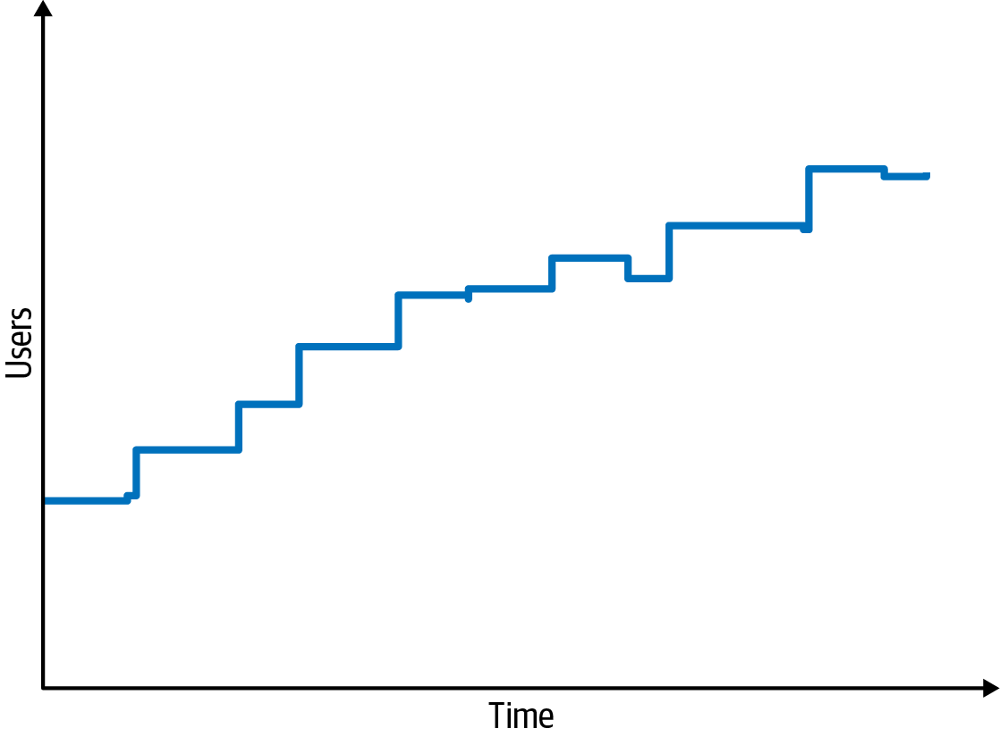
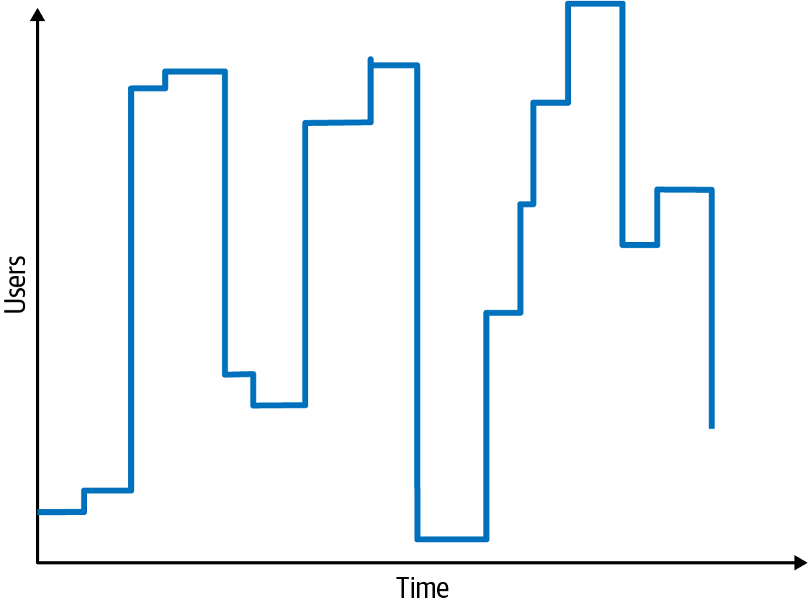
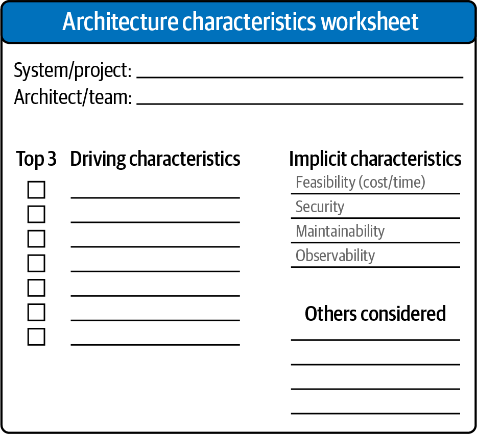

# Chapter 5: Identifying Architectural Characteristics

To create or validate an architecture, architects must uncover and analyze the correct architectural characteristics ("-ilities"). This requires deep collaboration with stakeholders to determine what is truly important from a business perspective.

Architects typically uncover these characteristics from three distinct sources:
1.  **Domain Concerns:** What the business stakeholders care about.
2.  **Project Requirements:** The explicit functional requirements of the system.
3.  **Implicit Domain Knowledge:** Unwritten requirements that experts simply know (for example, an architect working on medical diagnostic software implicitly knows that *data integrity* is required to prevent life-threatening message loss, even if the ticket doesn't explicitly state it).

---

## Extracting Characteristics from Domain Concerns
The primary challenge when extracting characteristics from domain concerns is the **"Lost in Translation"** problem. Architects and business stakeholders speak entirely different languages.

*   **Stakeholders speak in business outcomes:** "We need a faster time to market," "We need to ensure high user satisfaction," or "We are planning aggressive mergers and acquisitions."
*   **Architects speak in technical "-ilities":** "We need scalability, fault tolerance, and interoperability."

An architect cannot design a system to support "user satisfaction," and a stakeholder doesn't care about "interoperability." Therefore, the architect's primary job is to translate these business goals into structural architectural characteristics. 

### Translation Matrix
| Domain Concern | Translated Architectural Characteristics |
| :--- | :--- |
| **Mergers and Acquisitions** | Interoperability, scalability, adaptability, extensibility |
| **Time to Market** | Agility, testability, deployability |
| **User Satisfaction** | Performance, availability, fault tolerance, testability, deployability, agility, security |
| **Competitive Advantage** | Agility, testability, deployability, scalability, availability, fault tolerance |
| **Time and Budget** | Simplicity, feasibility |

---

## Composite Architectural Characteristics
A common pitfall during this translation process is treating a massive, ambiguous domain concern as a single technical characteristic. 

For example, equating "Time to Market" with **Agility**. "Agility" is a **composite architectural characteristic**. It has no single objective definition and cannot be directly measured. Instead, an architect must ask, *"What is agility composed of?"* The answer is a mix of *deployability*, *modularity*, and *testability*—all of which *are* measurable.

### The Antipattern of Narrow Focus
When an architect fails to decompose a business goal, they often fall into the antipattern of focusing too narrowly on just one piece of the puzzle. 

Imagine a stakeholder says:
> *"Due to regulatory requirements, it is absolutely imperative that we complete end-of-day fund pricing on time."*

An ineffective architect will hear "on time" and immediately focus entirely on **Performance**. This approach will inevitably fail for several reasons:
1.  **Availability:** It doesn't matter how fast the system is if it is offline when the pricing run starts.
2.  **Scalability:** As the company grows and creates new funds, the system must scale to handle the increased load within the same time window.
3.  **Reliability:** The system must not crash halfway through the critical calculation.
4.  **Recoverability:** If the system *does* crash at 85% completion, it must be able to gracefully recover and resume where it left off, rather than starting entirely over.
5.  **Auditability:** The system may be blazing fast, but are the financial calculations actually legally correct?

In this scenario, "finish on time" was a composite business goal. The architect had to decompose it into *Performance*, *Availability*, *Scalability*, *Reliability*, *Recoverability*, and *Auditability*. Decomposing business goals into objective, measurable architectural definitions is the fundamental job of the architect.

---

## Extracting Architectural Characteristics
Most architectural characteristics are extracted from explicit statements in requirements documents (e.g., explicit numbers of expected users). However, many critical characteristics come exclusively from the architect's **implicit domain knowledge**.

For example, imagine you are designing a university class registration system for 1,000 students over a 10-hour registration window. 
*   An architect relying solely on explicit requirements might assume an even distribution and build a system scaled to handle 100 students per hour.
*   An architect utilizing implicit domain knowledge (understanding how much college students procrastinate) knows that they must design a system capable of handling all 1,000 students hitting the server simultaneously in the final 10 minutes. 

Details like student procrastination will *never* appear in a requirements document, yet they dictate the structural design of the system.

### The Origin of Architecture Katas
Big architectural projects take a tremendous amount of time. An architect might only design half a dozen systems in their entire career. As software engineer Fred Brooks famously asked: *"How do we get great designers? Great designers design, of course."*

To provide aspiring architects a way to practice, Ted Neward devised **Architecture Katas**. Named after the Japanese martial arts term for an individual training exercise, Katas provide a timeboxed laboratory for architects to practice deriving architectural characteristics from domain-targeted descriptions. 

Each Kata provides a problem broken into four sections:
1.  **Description:** The overall domain problem.
2.  **Users:** Expected scale and user types.
3.  **Requirements:** Domain expectations.
4.  **Additional Context:** Realistic, hidden considerations that heavily influence design.

---

## Example Kata: Silicon Sandwiches
Let's use an Architecture Kata to illustrate how architects derive explicit and implicit characteristics.

*   **Description:** A national sandwich shop wants to enable online ordering in addition to its current call-in service.
*   **Users:** Thousands, perhaps one day, millions.
*   **Requirements:**
    *   Allow users to place an order and select pickup or delivery.
    *   Give pickup customers a time to pick up their order and directions to the shop (which must integrate with several external mapping services that include traffic information).
    *   For delivery service, dispatch the driver with the order to the user.
    *   Provide mobile device accessibility.
    *   Offer national daily promotions and specials.
    *   Offer local daily promotions and specials.
    *   Accept payment online, at the shop, or upon delivery.
*   **Additional Context:**
    *   Sandwich shops are franchised, each with a different owner.
    *   The parent company has near-future plans to expand overseas.
    *   The corporate goal is to hire inexpensive labor to maximize profit.

To solve this Kata, the architect must review each line and translate it into **Explicit** and **Implicit** architectural characteristics.

### Extracting Characteristics from the Kata
Let's analyze the requirements to uncover the necessary architectural characteristics:

#### 1. Users: "Thousands, perhaps one day, millions"
This explicitly points to **Scalability**: the ability to handle a massive volume of concurrent users without serious performance degradation. 

However, we must also apply our implicit domain knowledge of a sandwich shop. Traffic will not be evenly distributed; it will be incredibly quiet at 10:00 AM, and experience massive bursts of traffic at 12:00 PM for the lunch rush. This uncovers an implicit requirement for **Elasticity**: the ability to withstand sudden, massive bursts of traffic.

*(Note: Scalability and Elasticity are different. A hotel reservation system scales predictably but rarely bursts. A concert-ticket site must be extremely elastic to handle bursts when tickets drop. Silicon Sandwiches requires both).*

#### 2. "Integrate with external mapping services"
Relying on a third-party mapping API impacts **Reliability**. However, an architect must avoid over-engineering. If the external traffic API goes down, should the sandwich shop's entire ordering system fail? No, it should gracefully degrade and simply not show traffic data.

#### 3. "Provide mobile device accessibility"
Assuming budget constraints prevent building native iOS and Android apps, this points to a mobile-optimized web application. Because mobile networks are variable, this introduces **Performance** as a critical characteristic (specifically around page load times and payload sizes). 

Crucially, *Performance* and *Scalability* interact. The architect must define the acceptable baseline performance, and define the acceptable performance threshold at peak scale.

#### 4. "Offer national and local daily promotions"
This requirement demands **Customizability**. The core system must support default behaviors, with localized customized behaviors. 
*   An architect could solve this with *design* (using the Template Method design pattern). 
*   Or they could solve it with *structure* (using a Microkernel architectural style, where the local promos are plug-ins). 
This represents a classic architectural trade-off that must be weighed.

#### 5. "Accept payment online"
This implies **Security**. However, unless the client demands something extreme, security can typically be handled via standard coding hygiene and design (encryption, secure tokens), rather than requiring a dedicated structural shift.

#### 6. "Expand overseas"
This implies **Internationalization (i18n)**. This is generally handled via UX design and property files, not deep structural architecture.

#### 7. "Franchised with different owners" and "Hire inexpensive labor"
These points of context provide massive constraints. Franchised owners imply severe **Cost** and **Feasibility** constraints—the architecture must be affordable to run. The inexperienced labor pool implies **Usability** is critical, driving heavy UX design requirements.

---

## Implicit Characteristics and Overspecification
While analyzing explicit requirements is helpful, the architect must also consider implicit characteristics. For Silicon Sandwiches, **Availability** and **Stability** are critical implicit requirements; no user will return to a sandwich shop if the connection drops in the middle of placing an order. 

**Security** is another ubiquitous implicit characteristic—no one sets out to build an insecure app. However, the architect must determine its *priority*. For Silicon Sandwiches, payments are handled by a third party. Therefore, as long as developers follow basic security hygiene (not storing plaintext credit cards), good *design* is sufficient. The architect does not need to mandate a highly complex, structurally isolated security architecture. 

Architects must constantly guard against **overspecifying** architectural characteristics. Overspecifying is just as dangerous as underspecifying, because every added characteristic exponentially overcomplicates the system design. 

> *"There are no wrong answers in architecture, only expensive ones."* 
> — Mark Richards

---

## Design Versus Architecture and Trade-Offs
As seen in the Silicon Sandwiches kata, **Customizability** is a definite requirement. The critical question for the architect then becomes: *Do we solve this with Architecture or Design?*

*   **Architecture Solution:** Mandating a Microkernel architectural style, building explicit structural support for plug-in customizations.
*   **Design Solution:** Choosing a simpler architecture, but requiring developers to implement the *Template Method* design pattern to allow child classes to override workflows. 

How does the architect choose? Through **Trade-off Analysis**. 
Are there performance reasons *not* to use a Microkernel? Which approach is cheaper? Which approach aligns best with the other chosen characteristics (like Scalability)? 

### The Ivory Tower Antipattern
When making these trade-offs, the architect must **never act alone**. Making structural decisions in isolation from the implementation team leads to the dreaded *Ivory Tower Architecture* antipattern. The architect must collaborate closely with tech leads, developers, and operations to ensure the chosen trade-offs are actually feasible. 

### Prioritization: The Elimination Exercise
Because there is no "best" design, only a "least worst" collection of trade-offs, the architect must ruthlessly prioritize to find the simplest possible set of characteristics. 

A highly effective exercise for doing this is **The Elimination Test**: Once the team has identified a list of characteristics, ask, *"If we absolutely had to eliminate one, which would it be?"*

In the case of Silicon Sandwiches, if forced to cull the list, the team could eliminate Customizability (relegating it entirely to application design rather than structural architecture). Or, of the operational characteristics, they could eliminate Performance—not meaning the app will run terribly, but explicitly acknowledging that raw speed is far less important than Availability and Scalability when the lunch rush hits. Attempting to find the least important characteristic is the best way to determine what is truly critical.

---

## Limiting and Prioritizing Architectural Characteristics
When collaborating with stakeholders to define driving characteristics, the architect must work fiercely to keep the final list as short as possible. 

The most common antipattern in this phase is attempting to build a "generic" architecture that supports *all* characteristics. Every single characteristic supported adds complexity. If an architect overspecifies, the system becomes overwhelmingly complex before the developers have written a single line of code to solve the actual business problem. 

### Case Study: The Vasa
The ultimate historical example of overspecification killing a project is the Swedish warship, *The Vasa*. 

Between 1626 and 1628, King Adolphus demanded the most magnificent ship ever created. At the time, ships were either troop transports *or* gunships. The King demanded the Vasa be *both*. While most ships had one deck, the King demanded the Vasa have two, and he demanded the cannons be twice the normal size. The expert shipbuilders knew this was a disaster waiting to happen, but couldn't say no to the King. 

To celebrate its launch, the Vasa sailed into Stockholm harbor and fired a cannon salute. Because it had been overspecified into being massively top-heavy, the recoil caused it to instantly capsize and sink to the bottom of the harbor on its maiden voyage. 

### The Architectural Characteristics Worksheet
If an architect simply hands a list of 20 characteristics to a business stakeholder and asks, *"Which of these do you want?"*, the stakeholder will reply, *"All of them!"* 

To prevent building the Vasa, the authors developed the **Architectural Characteristics Worksheet** to facilitate interactive prioritization sessions.

1.  **The Limit:** The worksheet provides exactly seven slots for desired characteristics. The number isn't perfectly scientific, but it forces a hard limit. 
2.  **Implicit vs. Explicit:** The worksheet lists common implicit characteristics. If an implicit characteristic (like Security) becomes a driving concern, it is "pulled" into one of the seven slots.
3.  **Demotion:** If the seven slots are full and a new, critical characteristic is discovered, the stakeholders are forced to demote an existing characteristic to the "Others Considered" box.

### The "Top Three" Consensus
The final step of the worksheet is to collaboratively choose the **Top Three** highest-priority characteristics. 

Many architects make the mistake of trying to force stakeholders to rank all seven characteristics in exact, sequential order (1 to 7). This is a fool's errand. It wastes massive amounts of time and generates unnecessary arguments, as stakeholders will rarely agree on whether something is Priority #4 or Priority #5. 

Instead, having the domain stakeholders simply select the "Top Three" (in any order) makes gaining consensus radically easier, fosters productive discussion, and gives the architect the exact prioritized list they need to drive trade-off analysis.
