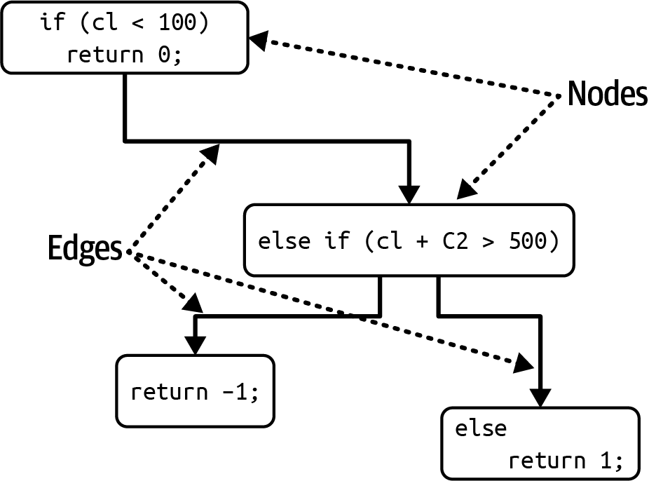
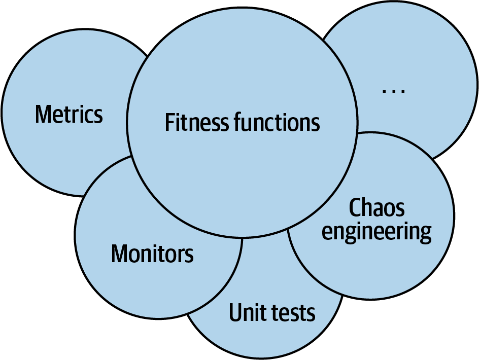
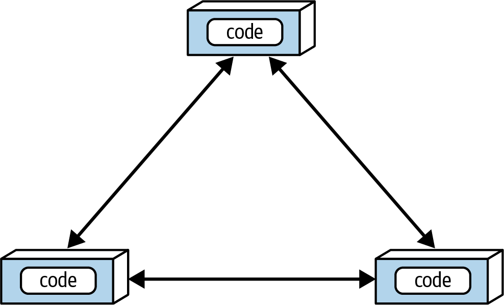

# Chapter 6: Measuring and Governing Architecture Characteristics

Architects must manage an extraordinarily wide variety of architectural characteristics. Operational aspects (like performance, elasticity, and scalability) commingle with structural concerns (like modularity and deployability). 

To prevent themselves from drowning in a sea of ambiguous terms and broad definitions, architects must establish objective ways to **measure** and **govern** these characteristics.

## Measuring Architecture Characteristics
Architects historically struggle to concretely define architectural characteristics for three primary reasons:

### 1. They Aren't Physics
Unlike the laws of physics, architectural characteristics have vague, subjective meanings. How does an architect design for "agility"? What exactly does a stakeholder mean when they ask for "wicked fast performance"? People across the industry have wildly differing perspectives on these terms, sometimes driven by legitimate contextual differences, and sometimes entirely by accident.

### 2. Wildly Varying Definitions
This subjectivity isn't just an industry-wide problem; it is an internal organizational problem. Even within the exact same company, the architecture department, the operations department, and the business stakeholders may completely disagree on the definition of a critical characteristic like *Performance*. Until all departments unify on a common definition, they cannot have a productive, objective conversation.

### 3. Too Composite
As established in Chapter 5, many highly desirable characteristics are completely unmeasurable because they are actually *composite characteristics*—meaning they are just collections of smaller characteristics. "Agility," for example, cannot be directly measured. It must be broken down into measurable constituents: *modularity*, *deployability*, and *testability*.

---### The Solution: Ubiquitous Language and Decomposition
Decomposing these composite characteristics into objective, measurable constituent parts is the only way to solve all three of these problems. 

When an organization agrees to use standard, concrete definitions for these decomposed parts, they create a **Ubiquitous Language** around architecture. This standardization allows teams to measure features objectively, rather than arguing over subjective, ambiguous buzzwords.

---

## Operational Measures
Many operational characteristics, such as performance and scalability, have obvious, direct measurements. However, architects must apply nuance to how these measurements are interpreted.

For example, a team might measure the *average* response time of a web request. However, if a boundary condition causes 1% of requests to take 10 times longer than normal, the sheer volume of traffic will hide those outliers within the average. Therefore, teams must measure both average *and* maximum response times.

High-functioning teams do not rely on arbitrary hard numbers for operational metrics. Instead, they rely on **statistical analysis**. A video streaming service might measure scale over time to build statistical prediction models, and then trigger alerts if real-time metrics deviate from the model. This tells the team one of two things: either the model is wrong, or the system is failing. Both are critical to know.

### The Many Flavors of Performance
Performance metrics evolve constantly alongside new devices and tools. Today, performance encompasses multiple nuanced definitions and "budgets":
*   **First-Page Render / First Contentful Paint:** Measuring the fraction of a second it takes for a user to see the first visible sign of progress on a screen. 
*   **K-Weight Budgets:** Establishing a hard maximum limit on the total bytes of libraries and frameworks allowed to download on a single page. This is driven by the strict physics constraints of mobile devices operating on low-bandwidth networks.

---

## Structural Measures
Unlike operational metrics, objective measures for internal structural characteristics (like modularity) are not nearly as obvious. There is no single, comprehensive metric that can assess the overall "quality" of an architecture. 

However, architects can use specific metrics to analyze narrow dimensions of code structure. The most prominent example is complexity.

### Cyclomatic Complexity (CC)
Designed by Thomas McCabe Sr. in 1976, Cyclomatic Complexity provides an objective measure for the complexity of a function, class, or application. It is calculated by applying graph theory to decision points in the code (e.g., `if/else` statements) that create distinct execution paths.

If a function has no decision statements, its CC is 1. If it has a single conditional, its CC is 2, because there are two possible paths. 

The formula for calculating CC for a single method is:
> `CC = E - N + 2` 
> *(Where N = Nodes/lines of code, and E = Edges/possible decisions)*

If the method includes fan-out calls to other methods (connected components), the general formula expands to:
> `CC = E - N + 2P`
> *(Where P = number of connected components)*



Overly complex code is a universal "code smell." It destroys modularity, testability, and deployability. However, CC is a blunt instrument: it cannot differentiate between **essential complexity** (the business problem is inherently difficult) and **accidental complexity** (the developer, or generative AI, brute-forced a terrible design). 

### What is a Good CC Value?
As with all things in architecture, *it depends*. Algorithmically complex problem domains will naturally yield higher CC scores. Architects must investigate to determine whether a high CC is justified by the domain, or if the code simply needs to be partitioned into smaller, logical chunks.

*   **Industry Standard:** Generally, the industry considers a CC under **10** to be acceptable.
*   **Architect Standard:** We consider 10 to be quite high, and prefer methods to fall under **5**, indicating highly cohesive, well-factored code.
*   **The Danger Zone:** Tools like Crap4J evaluate code by combining CC with test coverage. If a method's CC exceeds **50**, it is considered fundamentally unmaintainable, regardless of how many tests cover it. *(For context, the authors once encountered a 4,000-line C function with a CC over 800, held together by deeply nested GOTO statements).*

> [!TIP]
> Engineering practices like **Test-Driven Development (TDD)** have the fantastic side effect of naturally generating low-CC code. By writing simple tests first, developers are forced to write discrete, highly cohesive methods that stay below the complexity threshold.

---

## Process Measures
Many architectural characteristics intersect directly with the software development process. For example, "Agility" is a highly desirable composite characteristic, which breaks down into process-driven components like **Testability** and **Deployability**.

These components are objectively measurable:
*   **Testability:** Measured via code-coverage tools that report the percentage of code executed by tests. *(Caution: Code coverage cannot replace intent. 100% coverage with poorly written assertions provides zero actual confidence in code correctness).*
*   **Deployability:** Measured via the percentage of successful deployments, the average duration of deployments, and the volume of bugs raised immediately following a deployment.

While these characteristics clearly relate to the *process*, they profoundly impact the *structure*. If ease of deployment and testability are top priorities, the architect is forced to make structural decisions to emphasize deep modularity and isolation at the architectural level. 

---

## Governance and Fitness Functions
Once an architect establishes the prioritized list of characteristics and defines objective measurements for them, a massive new problem arises: 

**How does the architect ensure developers actually respect those priorities and implement the designs correctly when faced with extreme schedule pressure?**

In most software projects, *urgency* dominates *importance*. For example, writing clean, highly modular code is incredibly *important*, but shipping the feature by Friday is *urgent*. In this battle, urgency almost always wins. Therefore, architects need tools to enforce architectural governance.

### Governing Architecture Characteristics
The word "Governance" derives from the Greek word *kubernan* (to steer). It is an architect's core responsibility to *steer* the software development process and prevent disastrous quality problems.

Historically, this was done manually via code reviews. However, the software ecosystem is constantly evolving toward automation:
1.  **Extreme Programming** spawned automated testing.
2.  **Automated Testing** spawned Continuous Integration (CI).
3.  **Continuous Integration** spawned automated Operations (DevOps).
4.  **DevOps** is now spawning automated Architectural Governance.

To solve the governance problem, architects utilize a family of techniques known as **Fitness Functions** *(as popularized in the book Building Evolutionary Architectures by Neal Ford et al.)*. We will spend the remainder of this chapter exploring how fitness functions automate architectural governance.

---

## Architectural Fitness Functions
The word *evolutionary* in software architecture borrows from evolutionary computing, not biology. When a data scientist designs a genetic algorithm, they must guide the algorithm by providing an objective measure of success (e.g., scoring an algorithm trying to solve the traveling salesperson problem based on distance and cost). That guidance mechanism is called a **fitness function**.

> **Architectural Fitness Function:** Any mechanism that provides an objective integrity assessment of some architecture characteristic or combination of architecture characteristics.

Crucially, fitness functions are *not* a new framework or library that an architect must download. Rather, they are a new perspective applied to existing verification tools. A fitness function can be implemented using unit testing libraries, system monitors, metrics tools, or even chaos engineering. 



### Example: Guarding Modularity 
Modularity is a critical implicit characteristic. Unfortunately, modern IDEs actively work to destroy it. 

When coding in Java or .NET, if a developer references a class outside their component, the IDE helpfully pops up an auto-import dialog. Developers swat these dialogs away reflexively to keep coding. This trigger-happy importing creates **Cyclic Dependencies**, a devastating antipattern where components cross-reference each other, making it impossible to reuse or isolate a component without dragging the entire application along with it. This rapidly degrades the architecture into a *Big Ball of Mud*. 



Manual code reviews are useless for governing this. If developers import rampantly for a week, the damage is already deeply embedded before the code review even occurs. 

**The Fitness Function Solution:**
To govern this, an architect can write a simple fitness function using a metrics tool like `JDepend`, and wire it directly into the project's Continuous Integration (CI) build. 

```java
public class CycleTest {
    private JDepend jdepend;

    @BeforeEach
    void init() {
      jdepend = new JDepend();
      jdepend.addDirectory("/path/to/project/persistence/classes");
      jdepend.addDirectory("/path/to/project/web/classes");
      jdepend.addDirectory("/path/to/project/thirdpartyjars");
    }

    @Test
    void testAllPackages() {
      jdepend.analyze();
      assertEquals("Cycles exist", false, jdepend.containsCycles());
    }
}
```

This fitness function completely automates architectural governance. If a developer accidentally introduces a cyclic dependency, the build instantly fails. The architect no longer has to look over developers' shoulders. The fitness function actively guards the *important* practice of modularity against the *urgent* pace of day-to-day coding.

### Example: Distance from the Main Sequence
The "Distance from the Main Sequence" metric (introduced in Chapter 3) can also be easily governed. Using `JDepend`, an architect can write a test that calculates the distance of a package and asserts that it falls within an acceptable tolerance.

> [!IMPORTANT]
> **Avoid the Ivory Tower:** Architects must ensure developers understand the *purpose* of a fitness function before imposing it. If an architect writes highly esoteric functions that developers don't understand, it breeds resentment. The goal is automated governance, not architectural gatekeeping.

### Example: Governing Layers with ArchUnit
Architects carefully define structural layers for good reason (e.g., Controller, Service, Persistence). However, a developer rushing to meet a deadline might adopt a "better to ask forgiveness than permission" attitude and bypass the Service layer to call the database directly from the Controller, eroding the architecture.

Special-purpose tools like **ArchUnit** (Java) and **NetArchTest** (.NET) allow architects to codify layering rules as unit tests.

```java
layeredArchitecture()
    .layer("Controller").definedBy("..controller..")
    .layer("Service").definedBy("..service..")
    .layer("Persistence").definedBy("..persistence..")

    .whereLayer("Controller").mayNotBeAccessedByAnyLayer()
    .whereLayer("Service").mayOnlyBeAccessedByLayers("Controller")
    .whereLayer("Persistence").mayOnlyBeAccessedByLayers("Service")
```
With this fitness function in the CI pipeline, any attempt to bypass the layers will instantly fail the build. 

Furthermore, these tools can prevent developers from **gaming the system**. When faced with code-coverage requirements, rushing developers might write unit tests that execute code but contain no assertions—cheating the metric. Architects can write an ArchUnit rule that fails the build if a test class does not contain at least one assertion.

### Example: Chaos Engineering in Production
Fitness functions are not limited to unit tests; they can operate in live production environments. 

When Netflix moved to AWS, they realized they no longer controlled the underlying operations. To ensure reliability, they spawned the discipline of **Chaos Engineering**. Netflix created the "Simian Army"—a suite of production fitness functions designed to constantly test the system's resilience.

*   **Chaos Monkey:** Simulates instance failures or injects high latency to ensure the system can endure it.
*   **Chaos Kong:** Simulates the failure of an entire Amazon datacenter.
*   **Conformity Monkey:** Ensures all services adhere to strict routing and error-response rules.
*   **Security Monkey:** Actively scans for security defects, such as improperly opened ports.
*   **Janitor Monkey:** Actively scans for orphaned, unrouted services and terminates them to save cloud costs.

Chaos engineering fundamentally shifts the architectural perspective: it is not a question of *if* a system will break, but *when*. Constantly simulating breakages ensures the architecture remains robust.

## The Checklist Manifesto
In his influential book *The Checklist Manifesto*, Atul Gawande describes how highly trained professionals like pilots and surgeons use mandatory checklists. It is not because they don't know how to do their jobs; it is because when humans do highly detailed work over and over, it becomes incredibly easy to miss a small detail. 

This is the correct way to view Fitness Functions. They are not heavyweight bureaucratic gates. They are automated checklists. 

Developers *know* they shouldn't introduce cycles, break layers, or release insecure code. But that knowledge is constantly battling against hundreds of other urgent priorities. Fitness functions act as an automated checklist, allowing architects to permanently embed vital governance checks directly into the substrate of the architecture.
