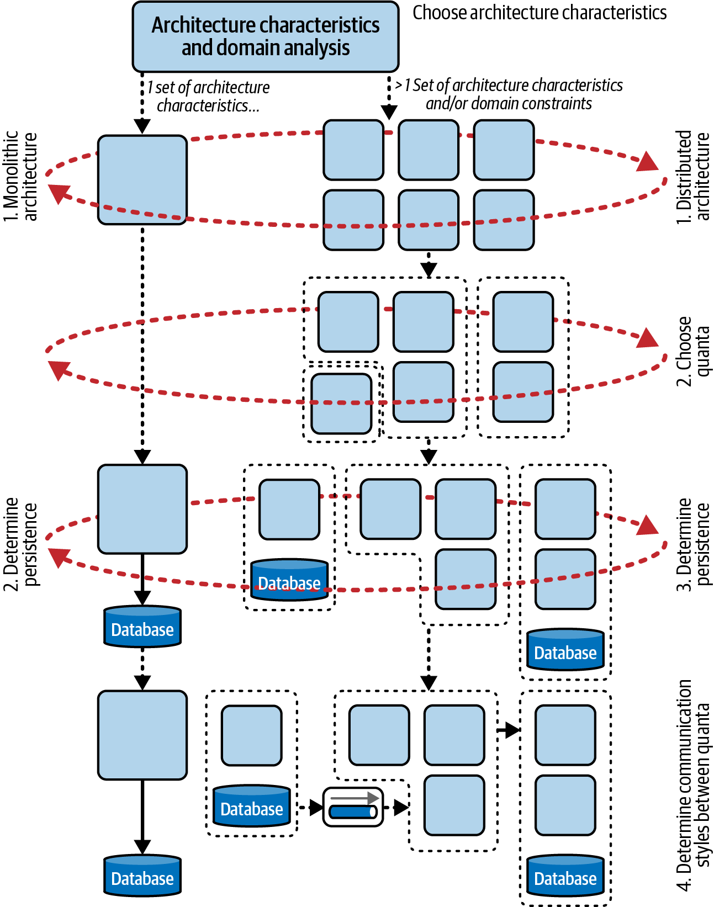
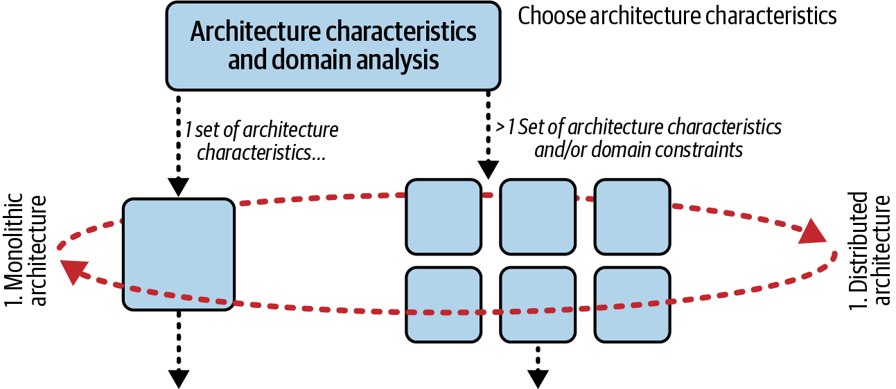
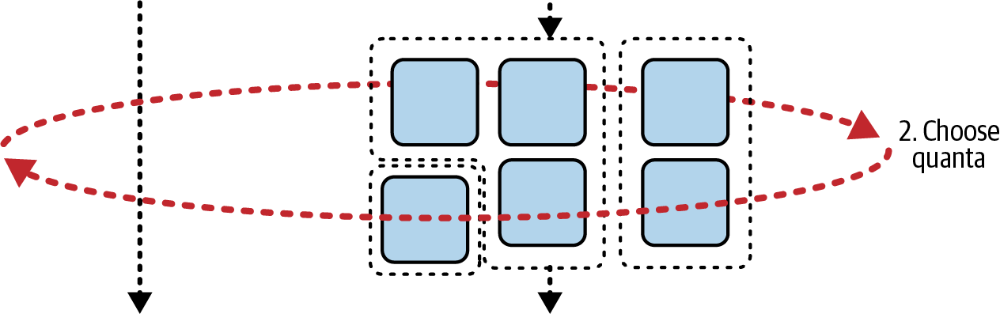
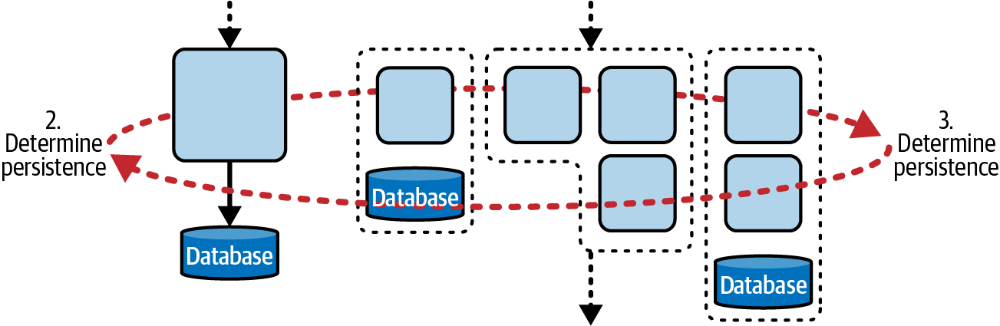
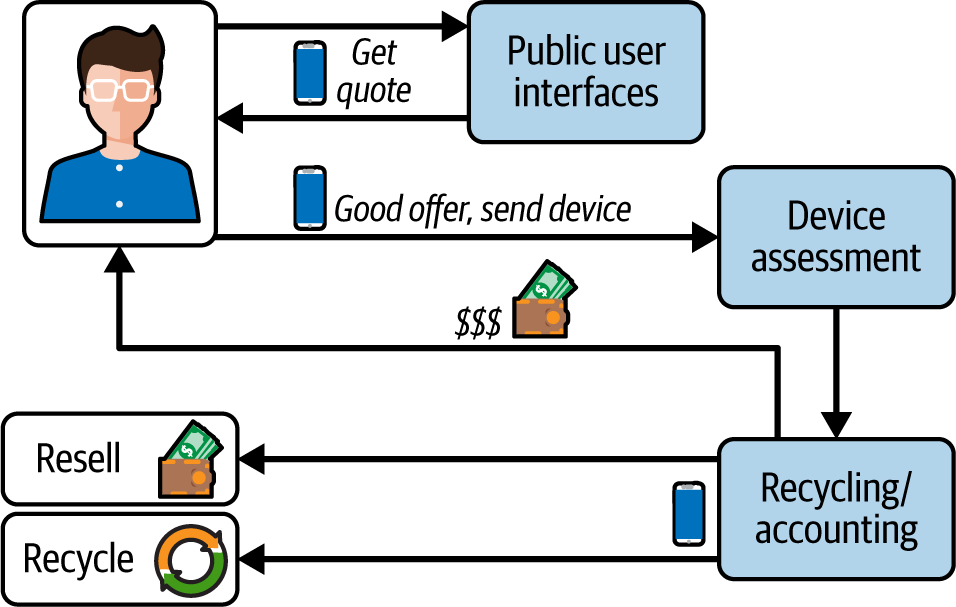
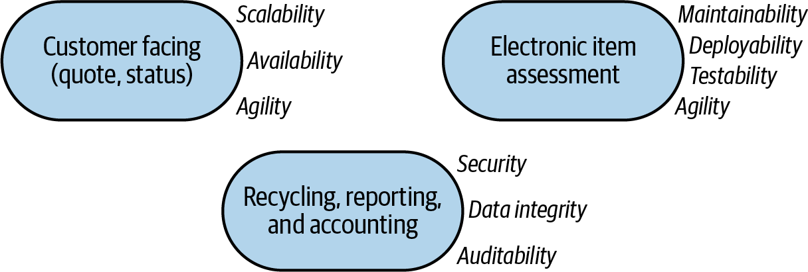
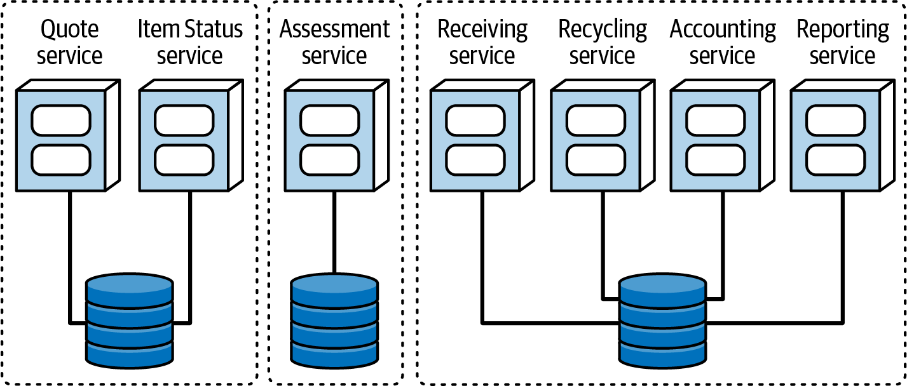

# Chapter 7: The Scope of Architectural Characteristics

Many outdated architectural frameworks share a fatal flaw: they assume there is only *one* set of architectural characteristics for the *entire* system. While this may have been true for legacy monoliths, modern distributed architectures (like Microservices) frequently require completely different characteristics at the individual service level versus the overall system level.

Architects need a way to measure the "scope" of these characteristics to determine the most appropriate architectural style. Standard structural metrics (like Cyclomatic Complexity) fail to do this because they only analyze source code and ignore external dependencies. 

For example, an architect can put immense effort into designing a perfectly elastic and scalable code base, but if that code relies on a single, massive, non-scalable relational database, the effort is entirely wasted. The architecture is bound by its external dependencies. 

To solve this, the authors developed a new measure: the **Architecture Quantum**.

---

## Architectural Quanta and Granularity
The word *quantum* (plural: *quanta*) derives from Latin, meaning "how much." In physics, it refers to the smallest possible amount of energy. In software architecture, we define it informally as: **"The smallest part of the system that runs independently."**

> **Architecture Quantum:** An architecture quantum establishes the scope for a set of architectural characteristics. It features:
> 1. Independent deployment
> 2. High functional cohesion
> 3. Low external implementation static coupling
> 4. Synchronous communication with other quanta

Let's break down the critical parts of this definition:

### 1. Establishes the Scope for Characteristics
The quantum acts as a hard boundary delineating a set of architectural characteristics (particularly operational ones like scalability and performance). Because it is independently deployable and highly cohesive, it provides the ultimate measure of true architectural modularity.

### 2. Independently Deployable
An architecture quantum must include *all* the necessary components required to function entirely independently from other parts of the system. 

Crucially, **this includes the database**. If a system cannot function without a database, that database is part of the quantum. 
*   This means that virtually all legacy systems utilizing a single shared database are, by definition, a **quantum of one**. The entire monolith is a single quantum.
*   In contrast, the Microservices architectural style mandates that each service manage its own isolated database. Because each service includes its own data, it forms its own quantum, meaning a Microservices architecture contains **multiple quanta**, each with its own independent architectural scope.

### 3. High Functional Cohesion
Cohesion refers to how unified a component's code is in its core purpose. A `Customer` component handling only customer entities exhibits *high cohesion*. A `Utility` component full of random, miscellaneous helper methods exhibits *low cohesion*. 

### Domain-Driven Design’s Bounded Context
Eric Evans's 2003 book *Domain-Driven Design* (DDD) deeply influenced how architects define cohesion. Prior to DDD, architects universally sought to reuse code holistically. They would attempt to create a single, massive, enterprise-wide `Customer` class. This invariably caused crippling tight coupling, difficult coordination, and immense complexity.

DDD introduced the **Bounded Context**: a design philosophy stating that everything related to a portion of the domain should be visible internally, but completely opaque externally. Instead of one enterprise `Customer` class, each individual domain boundary creates its own localized `Customer` class, only reconciling the differences at communication endpoints. 

This philosophy directly drives the "high functional cohesion" requirement of an architecture quantum.

---

## Defining Coupling
To understand the final parts of the architecture quantum definition, an architect must understand the four finer distinctions of coupling:

### 1. Semantic Coupling
Semantic coupling is the *natural* coupling of the business problem. For example, an order-processing application inherently requires "inventory," "shopping carts," and "customers." The nature of the business problem defines this coupling. No magical architectural pattern can prevent a change in the core business problem from rippling through the architecture. 

### 2. Implementation Coupling
Implementation coupling is how the architect *chooses* to implement the semantic dependencies. Will all the data reside in a single database, or will it be split apart for better scalability? Will it be a monolith or a distributed architecture? These choices dictate the physical structure of the system.

### 3. Static Coupling
Static coupling is the physical "wiring" of an architecture. 
> **Rule of Thumb:** Two things are statically coupled if changing one might break the other.

Crucially, **if two services share a static dependency, they belong to the same architecture quantum.** For example, if two ostensibly independent microservices both read from the same exact relational database, they are statically coupled. They are not independent quanta; they form a single quantum. 

### 4. Dynamic Coupling
Dynamic coupling describes the forces involved when independent quanta must communicate with each other at runtime to execute a workflow (e.g., synchronous vs asynchronous communication).

---

## 4. Low External Implementation Static Coupling
*(Continuing the definition of an Architecture Quantum)*

Because quanta act as the operational building blocks of an architecture, the level of static implementation coupling *between* quanta must be extremely low. 

An architecture is considered "brittle" when a single implementation change causes massive, unexpected rippling side effects that break ostensibly unrelated systems. This occurs when architects fail to establish low external coupling. For example, renaming a database column from `State` to `StateCode` in one service, only to discover it just crashed five other services because they were all statically coupled to the same shared database. 

> [!TIP]
> **Coupling vs. Scope:** Tight coupling is acceptable (and even desirable) for achieving high cohesion within a very narrow scope (like inside a single service). However, the broader the scope of the system, the looser the coupling must be.

---

## 5. Synchronous Communication
*(Final part of the Architecture Quantum definition)*

Communication refers to **dynamic coupling**—when quanta call each other at runtime. We explicitly call out *synchronous* communication in the definition because it is entirely unforgiving in distributed architectures.

Consider a highly scalable `Auction` service that must send data to a slow, unscalable `Payment` service. 
*   If the communication is **Synchronous**, the services are deeply coupled. When 10,000 auctions end simultaneously, the `Auction` service will overwhelm and crash the `Payment` service, causing both to fail. 
*   If the communication is **Asynchronous**, the services are decoupled. The 10,000 messages sit safely in a message queue acting as a buffer, and the slow `Payment` service processes them at its own pace without crashing the system.

Because synchronous communication binds the operational characteristics of the caller to the receiver, it effectively merges their architectural scope. Thus, an architecture quantum assumes synchronous internal communication, but asynchronous external communication.

---

## The Impact of Scoping
The concept of the architecture quantum fundamentally shifts how architects think. In modern systems, architects no longer define characteristics at the *system* level; they define them at the *quantum* level. 

This scope is the primary tool architects use to determine the correct architectural style for a new problem domain.

### Scoping and Architectural Style Decision Tree
Determining the quantum boundaries dictates whether a monolithic or distributed architecture is required.

1.  **Single vs. Multiple Characteristic Groups:** The architect must first analyze the domain. Does the system require only a single set of characteristics? 
    
    

    *   If **Yes** -> Choose a **Monolithic Architecture**. (A single monolithic database is generally suitable, and the entire system deploys in lockstep).
    *   If **No** -> Choose a **Distributed Architecture**.

2.  **Determine Quantum Boundaries:** If distributed is chosen, the architect must determine the granularity of the service boundaries. 
    
    

3.  **Choose Persistence:** 
    
    

    *   Will the distributed architecture share a single database? (Common in *Event-Driven Architecture*).
    *   Or will the data be partitioned so each service owns its own database? (Required in *Microservices Architecture*).

4.  **Determine Communication:** Will the quanta communicate synchronously or asynchronously? *(Warning: Choosing synchronous communication often inadvertently changes the quantum boundaries established in the previous steps).*

By utilizing the concept of the architecture quantum, architects can systematically navigate the incredibly complex trade-offs required to design modern software systems.

---

## Example Kata: Going Green
To illustrate how the architecture quantum works in practice, let's analyze the "Going Green" Kata. 

**Going Green (GG)** is a business that recycles and resells used electronics. 
*   Users can upload their device's model and condition via a website or public kiosk. 
*   GG bids on the device. If accepted, the user deposits it in the kiosk or mails it in. 
*   Upon receipt, GG assesses the device, pays the user, and estimates the resale or recycle value. 
*   The system must also generate reports and analytics.

During architectural characteristics analysis, the architect notices that the required capabilities naturally form three distinct clusters:

1.  **Public-Facing Cluster:** Needs *Scalability*, *Availability*, and *Agility*.
2.  **Back-Office Cluster:** Needs *Security*, *Data Integrity*, and *Auditability*.
3.  **Assessment Cluster:** Needs *Maintainability*, *Deployability*, and *Testability*. (This is driven by a unique business constraint: new phone models drop constantly, so GG must be able to update their assessment algorithms incredibly fast to maximize profit on new, high-value devices).

Could an architect design a single system that simultaneously meets all of these criteria? Technically yes, but it would be a nightmare. These characteristics constantly counteract each other. Designing for rapid deployability directly fights against the heavy, slow nature of strict auditability. The public UI requires massive scalability, while the back-office requires almost none. 

Instead of trying to build a monolithic "kitchen sink" architecture, the architect uses these clusters to establish the **Architecture Quanta**.

By separating the system into three distinct quanta, each boundary can prioritize its own exact set of characteristics without negatively impacting the others. 

---

## Scoping and the Cloud
Cloud computing complicates architectural scoping because the cloud abstracts away many operational characteristics. When deploying to the cloud, an architect must evaluate two distinct deployment scenarios:

1.  **Hosting Containers:** The team treats the cloud simply as an alternate datacenter to run containers. Here, the architect's scope must consider the constraints introduced by the container orchestration tool (e.g., Kubernetes).
2.  **Native Cloud Components:** The team pieces the application together using proprietary cloud building blocks (serverless functions, managed databases). Here, the architect's scope is entirely dependent on the capabilities advertised by the cloud provider.

Many of the most difficult characteristics of the past—like *elasticity*—were hard-won by the previous generation of architects. Today, elasticity is often a simple configuration toggle in a cloud provider's console. 

However, this doesn't mean the architect's job is done. While elasticity is easier, the modern architect faces entirely new trade-offs, such as vendor lock-in, provider availability, and heightened distributed security concerns. The specific details of software architecture constantly change, but the core job of analyzing trade-offs remains permanent.
