# Chapter 8: Component-Based Thinking

In Chapter 3, we introduced the concept of a "module" as a generic collection of related code. In this chapter, we dive much deeper into this concept by focusing on the architectural aspect of modularity: **Logical Components**.

Logical components are the fundamental building blocks of a software system. The ability to identify and manage these blocks is a core part of architectural thinking (as outlined in Chapter 2). We call this specific activity **Component-Based Thinking**.

Component-based thinking is the ability to see the structure of a system as a set of logical components, all interacting to perform certain business functions. While developers naturally view a system at the *class* or *function* level, an architect must "see" the system at the *component* level. 

---

## Defining Logical Components
To understand logical components, think about the floor plan of a typical house.

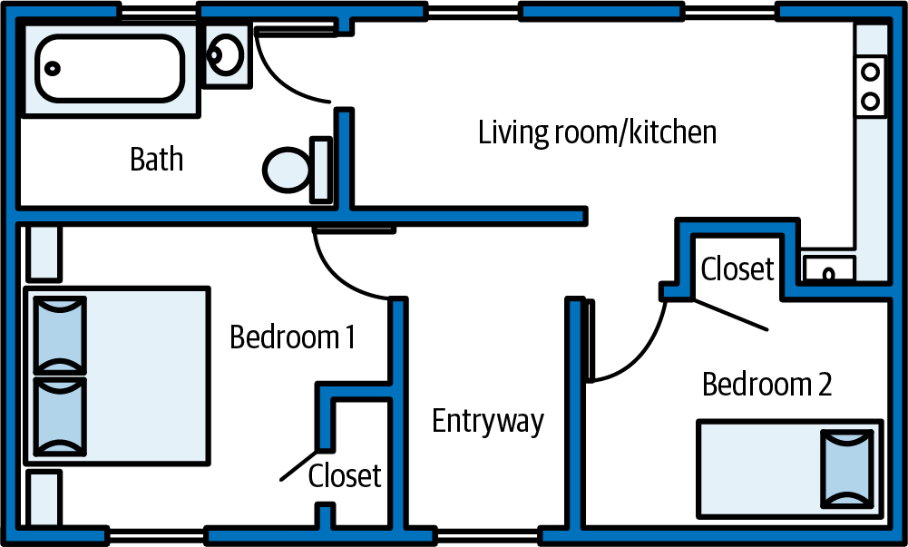

A house floor plan is made up of various rooms (kitchen, bedrooms, bathrooms, living room, etc.), each serving a specific, different purpose. These rooms represent the building blocks—the components—of the house.

Software architecture works the exact same way. The major business functions a system performs represent the components of that system.

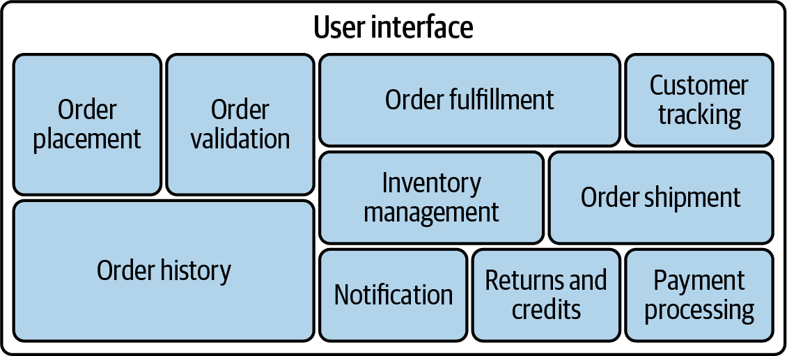

Just like the rooms of a house, each component performs a specific function, such as managing inventory, shipping orders, or processing payments. Together, they make up the system. Physically, each component contains the source code that implements that particular business function.

### Manifesting Components in Code
In software architecture, logical components are usually manifested through a **namespace** or a **directory structure**. 

Typically, the leaf nodes of the directory structure (or namespace) containing the source code represent the logical components themselves. The higher-level directories represent the system's domains and subdomains. 

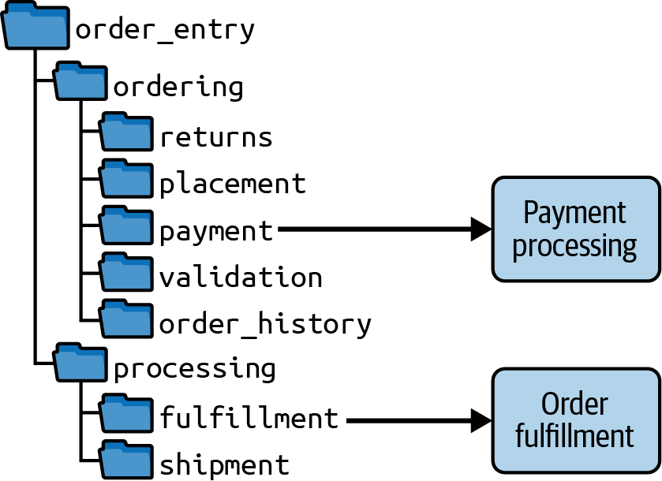

For example, in the directory structure above:
*   The path `order_entry/ordering/payment` represents the **Payment Processing Component**.
*   The path `order_entry/processing/fulfillment` represents the **Order Fulfillment Component**.

Because of this direct mapping, an architect can quickly analyze a software system's directory structure or namespaces to understand its internal structure—in other words, its logical architecture. 

---

## Logical Versus Physical Architecture
A **Logical Architecture** consists of a system’s logical components and how they interact with one another. It focuses entirely on *what* the system does and how functionality is demarcated, independent of physical structure. It does *not* show physical artifacts like User Interfaces, Databases, or Services. 

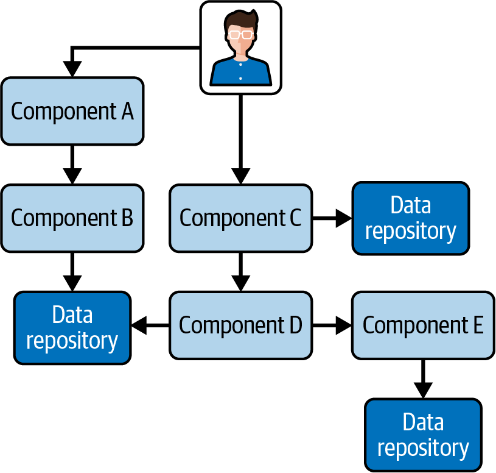

A **Physical Architecture**, on the other hand, explicitly illustrates the physical artifacts (Services, UIs, Databases). It represents the specific architectural style chosen for the system (e.g., Microservices, Event-Driven, Layered Architecture).

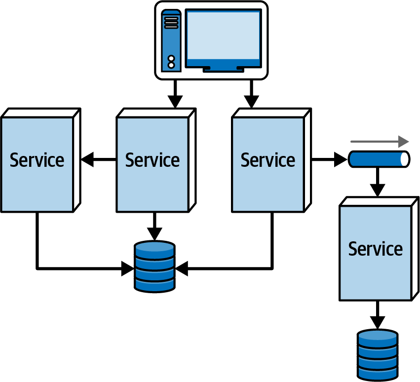

### The Danger of Bypassing Logical Architecture
Many architects attempt to bypass creating a logical architecture and jump straight into designing the physical architecture. **We strongly advise against this.**

Jumping straight to physical architecture is dangerous for two reasons:
1.  **It obscures functionality.** In a physical microservices architecture, "payment processing" functionality might be scattered across five different physical services. Looking at the physical architecture makes it incredibly difficult to understand how that core business function actually operates.
2.  **It provides zero code guidance.** Physical architecture provides developers with no guidance on how to actually organize the underlying source code. This invariably results in a chaotic, unstructured codebase that is impossible to maintain, test, or deploy.

Architects should always start by mapping the logical architecture. When designing a logical architecture, the architect hasn't even decided yet if the system will be a monolith or distributed services—they are purely focused on isolating the business functions into discrete logical components.

---

## Creating a Logical Architecture
Creating a logical architecture is an iterative feedback loop of continuously identifying and restructuring components. 

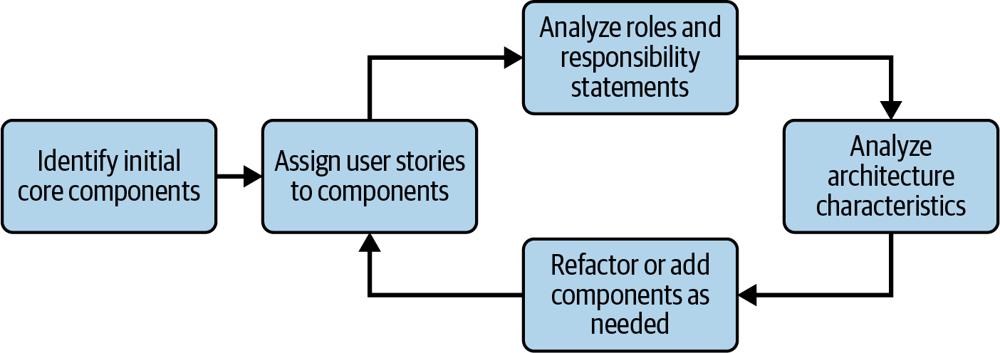

The workflow consists of five steps:
1.  **Identify Initial Components:** Establish the baseline core components based on the domain.
2.  **Assign Requirements:** Assign specific user stories or business requirements to those candidate components.
3.  **Analyze Roles and Responsibilities:** Review the component. Do the assigned requirements actually make sense together? (For example, does it make sense that the `Payment` component is handling email notifications?)
4.  **Analyze Architectural Characteristics:** Review the non-functional requirements. Does a component need to be broken apart? (For example, the `Payment` component handles standard credit cards and high-risk wire transfers. Do the wire transfers require a different level of security or scalability that warrants splitting the component in two?)
5.  **Refactor and Refine:** Restructure the components based on the analysis and repeat the loop. 

This workflow never stops. It is used for greenfield (new) systems, but it is equally important when adding new features to an existing system, as new requirements frequently prompt the creation of new components or the splitting of existing ones.

---

## Identifying Core Components
When starting a logical architecture, the most common mistake architects make is spending too much effort trying to get the initial components *perfect* on the first try. This is an impossible task, because the beginning of a project is when the architect knows the least about the system's specific requirements.

A much better approach is to make a "best guess" based on the system's core functionality and then refine them through the feedback loop discussed above. We like to think of initial components as **empty buckets**. 

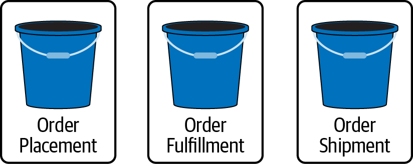

An empty bucket doesn't actually do anything until the architect starts "filling" it with user stories and requirements. It is simply a placeholder—a best guess at a functional building block.

There are three common approaches to identifying these initial core components. The first two are highly recommended; the third is a dangerous antipattern.

### 1. The Workflow Approach (Recommended)
This approach leverages the major "happy-path" workflows a user might take through the system. The architect outlines the general flow and creates components based on those steps. 

For example, in a new order-entry system:
*   User browses the catalog → **Item Browser** component
*   User places an order → **Order Placement** component
*   User pays for the order → **Order Payment** component
*   Send user an email with details → **Customer Notification** component

Not every step yields a new component (for example, another step like "Email customer shipping update" would simply reuse the existing `Customer Notification` component). Don't attempt to map every edge case; focus only on the major workflows.

### 2. The Actor/Action Approach (Recommended)
This approach is particularly useful for systems with multiple distinct users (actors). The architect identifies the major actions each actor can perform. Note: The system itself is *always* an actor.

For example, in the order-entry system:
*   **Customer Actor**
    *   Search for items → **Item Search** component
    *   Place an order → **Order Placement** component
*   **Order Packer Actor**
    *   Select box size & Mark ready for shipment → **Order Fulfillment** component
*   **System Actor**
    *   Adjust inventory → **Inventory Management** component
    *   Apply payment → **Order Payment** component

This approach generally yields more components than the Workflow approach, but both allow the architect to define the logical architecture long before detailed specifications are available.

### 3. The Entity Trap (Antipattern)
It is incredibly tempting for an architect to look at the database entities (`Customer`, `Item`, `Order`) and just derive components from them (`Customer Manager`, `Item Manager`, `Order Manager`). We strongly advise against this.

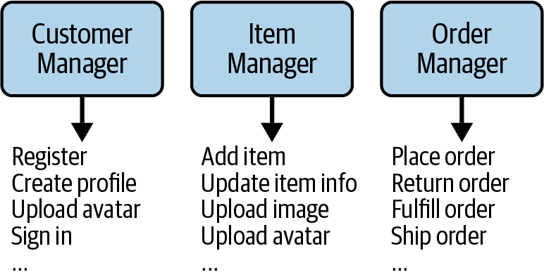

The Entity Trap is disastrous for three reasons:
1.  **Ambiguous Naming:** What does an `Order Manager` actually do? The name implies "everything." If a component name includes suffixes like *Manager, Supervisor, Controller, Handler, or Engine*, the architect has likely fallen into the Entity Trap.
2.  **Dumping Grounds:** Entity components rapidly devolve into "kitchen sink" dumping grounds. Every single bit of order functionality (validation, placement, history, tracking, shipping) gets shoved into the massive `Order Manager`.
3.  **Coarse-Grained Monoliths:** Because they act as dumping grounds, these components become incredibly massive and coarse-grained. A giant, single-purpose component is notoriously difficult to maintain, test, and deploy reliably. 

If a system truly is just executing simple CRUD (Create, Read, Update, Delete) operations against raw entities, it does not need a complex software architecture. It just needs a low-code CRUD framework.

---

## Assigning User Stories to Components
Once the initial core components are identified, the next step in the workflow is to start assigning user stories and requirements to them. This is the process of "filling the buckets."

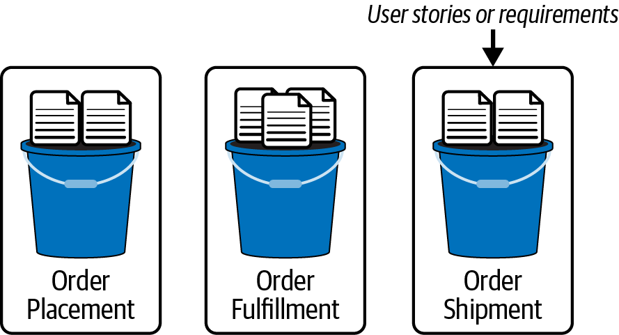

This process inevitably leads to the evolution of the components. Consider the following three user stories:
1.  **Customer:** "I want my order validated."
2.  **Order Packer:** "I want to know what size box to use."
3.  **Customer:** "I want to receive an email every time my order status changes."

Assume the architect currently has `Order Placement`, `Order Fulfillment`, `Order Shipment`, and `Inventory Management` components.

*   *Story 1* clearly goes into the **`Order Placement`** component.
*   *Story 2* clearly goes into the **`Order Fulfillment`** component. 
*   *Story 3* is tricky. An email must be sent when the order is placed, when it is packed, and when it is shipped. Should the email logic go into all three components? 

No. Code replication is a maintenance nightmare. Because this process maps to physical source code, the architect realizes they must define a *new* component to handle the shared logic: **`Customer Notification`**.

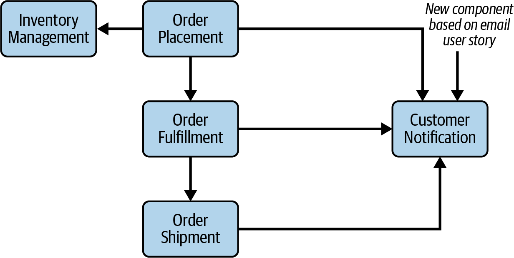

Now, the `Placement`, `Fulfillment`, and `Shipment` components all simply communicate with the new `Customer Notification` component. The logical architecture evolves.

---

## Analyzing Roles and Responsibilities
After filling the buckets, the architect must analyze the roles and responsibilities of each component. This step focuses entirely on **Cohesion**. Is the component doing too much? Are its operations actually related?

To illustrate, imagine the architect has assigned the following tasks to the `Order Placement` component:
*   Validate the order
*   Display the shopping cart
*   Determine shipping address
*   Collect payment information
*   Generate unique order ID
*   **Apply the payment**
*   **Adjust inventory counts**
*   **Email the customer an order summary**

If the architect writes a role statement for this component, it would look like this:
> "This component validates the order **and** displays the cart. It is **also** responsible for collecting payment info, **in addition** to applying the payment, **as well as** adjusting inventory **and** emailing the customer."

> [!TIP]
> **The Cohesion Litmus Test:** If a component's role statement is filled with conjunctive phrases like *"and," "also," "in addition,"* or *"as well as,"* the component is doing too much and lacks cohesion.

Remember that logical components map directly to code directories. If all this functionality stayed in `Order Placement`, the `com.app.order.placement` directory would contain payment processing logic, inventory logic, and email logic. This is terrible physical design.

The architect must **refactor** the component by splitting it into highly cohesive, single-purpose pieces:
1.  **`Order Placement`**: Validates order, displays cart, determines shipping, collects payment info.
2.  **`Payment Processing`**: Applies the payment.
3.  **`Inventory Management`**: Adjusts the inventory.
4.  **`Customer Notification`**: Emails the customer.

By refactoring, the architect ensures every component has a distinct, perfectly cohesive role, making the system significantly easier to test, maintain, and deploy.

### Restructuring Components
Software design requires a massive feedback loop. Architects must continually iterate on component designs in direct collaboration with developers. 

It is virtually impossible to account for all edge cases during the initial design phase. As developers delve deeply into building the application, they gain a highly nuanced understanding of where behaviors actually belong. Architects should expect to restructure components *frequently* throughout the entire lifecycle of a system. 

---

## Component Coupling
When components communicate with each other—or when a change to one component requires a change in another—the components are said to be **coupled**. The more highly coupled a system is, the harder it is to maintain, test, and deploy. 

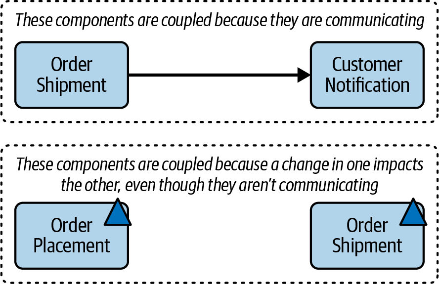

Architects must pay incredibly close attention to coupling. There are two primary categories to govern: **Static Coupling** and **Temporal Coupling**.

### Static Coupling
Static coupling occurs when components communicate synchronously with each other in the codebase. Architects analyze static coupling across two distinct dimensions:

**1. Afferent Coupling (Incoming / Fan-In)**
Afferent coupling (denoted as **CA**) measures the degree to which *other* components depend on the target component. 

For example, the `Customer Notification` component exists to send emails. If both `Order Placement` and `Order Shipment` need to send emails, they must both call `Customer Notification`. Therefore, `Customer Notification` is afferently coupled to two components (CA = 2).

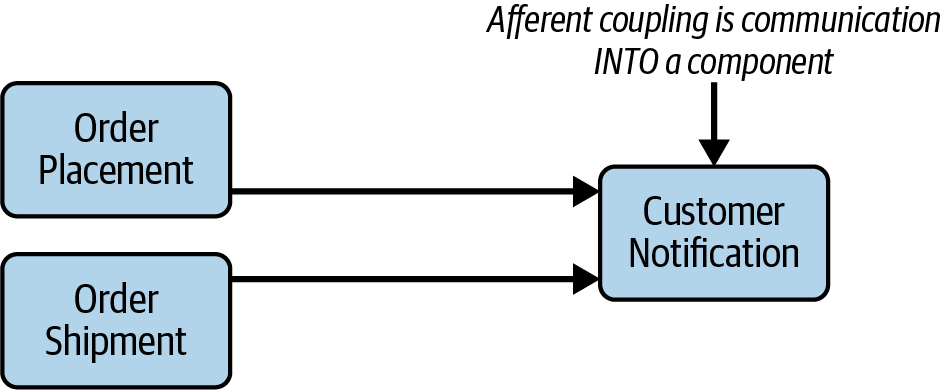

**2. Efferent Coupling (Outgoing / Fan-Out)**
Efferent coupling (denoted as **CE**) measures the degree to which the target component depends on *other* components. 

For example, if the `Order Placement` component needs to invoke the `Order Fulfillment` component to finish its workflow, `Order Placement` is efferently coupled to it (CE = 1).

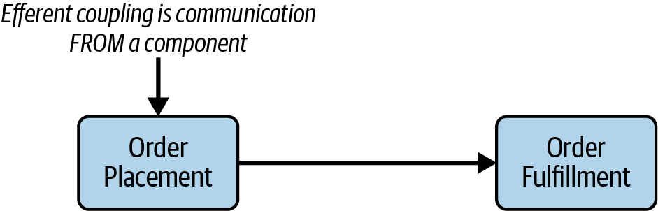

> [!NOTE]
> Metrics tools use these Afferent (CA) and Efferent (CE) coupling values to calculate deep structural metrics like **Abstractness**, **Instability**, and **Distance from the Main Sequence** (as discussed in Chapter 3).

### Temporal Coupling
While static coupling focuses on physical code dependencies, **Temporal Coupling** describes non-static dependencies that are based purely on *timing* or *transactions*.

For example, when a system processes an order, the code within the `Order Placement` component *must* be invoked successfully before the code in the `Order Shipment` component can execute. Even if they don't share a direct static method call, they are temporally coupled by the workflow's required sequence of events.

The major danger of temporal coupling is that it is notoriously difficult to detect using standard static analysis tools. In most architectures, temporal coupling is only discovered by reading architectural design documents or, painfully, by encountering bizarre runtime error conditions.

---

## The Law of Demeter
Every architect is taught to strive for loose coupling. Less coupling makes a system more maintainable, easier to test, less risky to deploy, and more reliable because changes impact fewer components.

One highly effective technique for creating loosely coupled systems is the **Law of Demeter**, also known as the **Principle of Least Knowledge**. In Greek mythology, the goddess Demeter produced all the grain for the entire world, but she had absolutely no idea what people actually did with it. Demeter was completely decoupled from the rest of the world.

> **The Law of Demeter:** A component or service should have limited knowledge of other components or services.

While this sounds simplistic, it is often difficult to apply in practice.

### The "Too Much Knowledge" Antipattern
Consider the following workflow initiated by an `Order Placement` component:
1.  Tell `Inventory Management` to decrement stock.
2.  If stock is low, tell `Supplier Ordering` to order more.
3.  If stock is low, tell `Item Pricing` to adjust prices.
4.  Finally, tell `Email Notification` to email the customer.

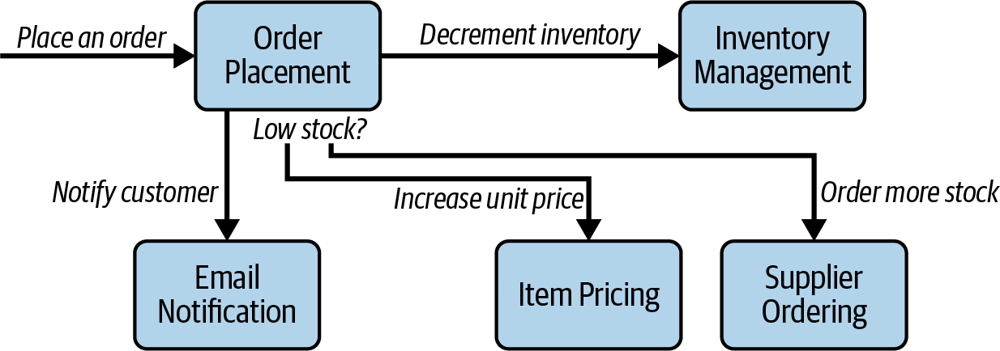

In this scenario, `Order Placement` is heavily efferently coupled. While it isn't actually *doing* the work of ordering supplies or adjusting prices, it possesses the *knowledge* that those actions must occur. **More knowledge means tighter coupling.**

### Applying the Law of Demeter
The idea behind the Law of Demeter is to limit a component's knowledge by distributing that knowledge elsewhere. 

If we apply the law to the previous example, we can dramatically reduce the coupling of the `Order Placement` component:
1.  `Order Placement` tells `Inventory Management` to decrement stock. 
2.  `Inventory Management` (now possessing the knowledge) detects low stock and tells `Supplier Ordering` to order more.
3.  `Inventory Management` tells `Item Pricing` to adjust prices.

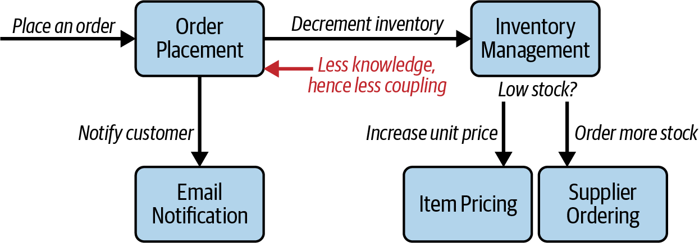

By removing the knowledge that certain downstream functions need to happen, the architect has successfully decoupled the `Order Placement` component from the rest of the system. 

> [!WARNING]
> **Redistribution vs. Reduction:** The astute reader will notice that while applying the Law of Demeter dramatically reduced the coupling of `Order Placement`, it actively increased the coupling of `Inventory Management`. Applying the Law of Demeter rarely reduces the *system-wide* level of coupling; rather, it strategically *redistributes* that coupling to different parts of the system.

---

## Case Study: Going, Going, Gone
Let's apply the iterative workflow and the Actor/Action approach to a case study called **Going, Going, Gone (GGG)**—a live auction system.

### 1. Identify Initial Components
Using the Actor/Action approach, the architect identifies three main actors and their corresponding actions:

*   **Bidder**
    *   View live video stream
    *   View live bid stream
    *   Place a bid
*   **Auctioneer**
    *   Enter live bids
    *   Receive online bids
    *   Mark item as sold
*   **System**
    *   Start auction
    *   Make payment
    *   Track bidder activity

Mapping these actions to functional buckets yields an initial set of components:
1.  **`Video Streamer`**: Streams live auction video.
2.  **`Bid Streamer`**: Streams bids to users as they occur.
3.  **`Bid Capture`**: Captures bids from both bidders and the auctioneer.
4.  **`Bid Tracker`**: Tracks bids and acts as the system of record.
5.  **`Auction Session`**: Starts auctions, triggers payment upon win, notifies bidders of next item.
6.  **`Payment`**: Connects to third-party payment processor.

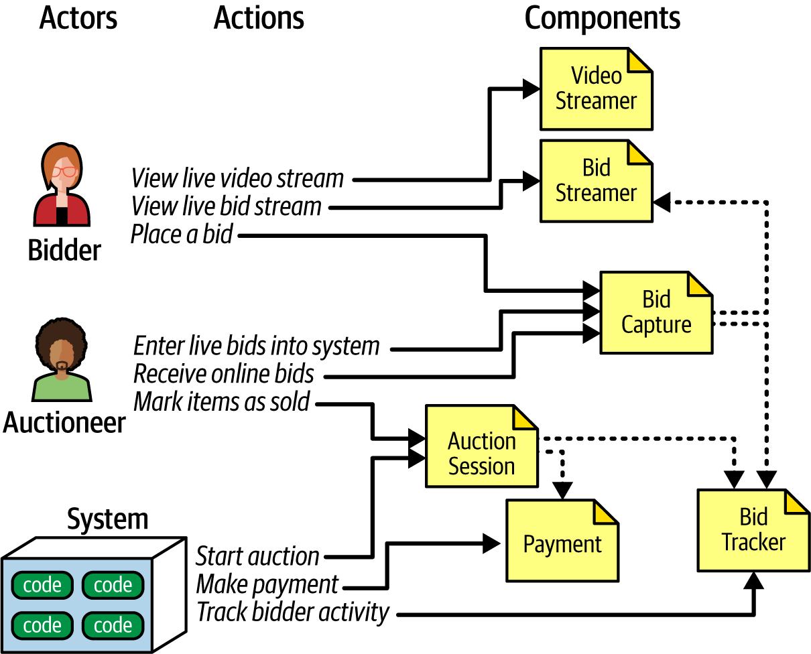

### 2. Analyze Architectural Characteristics
The architect evaluates this initial design against the system's required architectural characteristics. 

The current design features a single `Bid Capture` component handling bids from *both* the bidders and the auctioneer. Functionally, this makes perfect sense—a bid is a bid. 

However, operationally, this is a disaster. 
*   **The Bidders** require massive *Scalability* and *Elasticity* because thousands of people might bid simultaneously.
*   **The Auctioneer** requires almost zero scalability (there is only one auctioneer). However, they require extreme *Reliability* and *Availability*. If a bidder drops connection, it's bad. If the auctioneer drops connection, the entire business halts.

### 3. Refactor and Refine
Because the `Bid Capture` component is trying to satisfy two diametrically opposed sets of architectural characteristics, the architect must split it.

They create an **`Auctioneer Capture`** component explicitly for the auctioneer, and leave the **`Bid Capture`** component exclusively for the online bidders. 

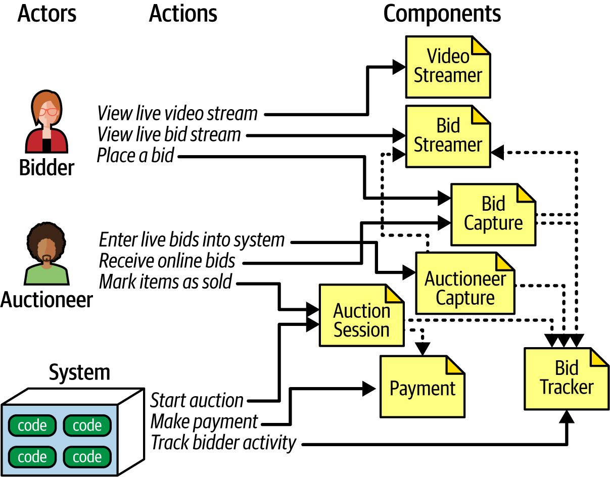

With this new design, the `Bid Tracker` component acts as the unification point, merging the single, highly reliable stream from the `Auctioneer Capture` with the massive, highly scalable streams from the `Bid Capture`.

This design is still not final—new components will inevitably arise as features like account registration are added. But it is a structurally sound starting point. 

> [!TIP]
> **The Least Worst Design:** There is no such thing as the "one true design." Every design introduces a new set of trade-offs. The architect's job is not to find a perfect architecture, but to objectively assess the trade-offs and select the architecture with the "least worst" set.
