# Chapter 9: Foundations

Before diving into the intricate details of specific architecture styles and patterns, it is crucial to establish foundational definitions to set the proper context.

---

## Styles Versus Patterns
One of the most common points of confusion in software architecture is the difference between architectural *styles* and architectural *patterns*.

While a **pattern** captures a contextualized solution to a specific problem (e.g., the Singleton pattern, the Outbox pattern), an **Architectural Style** is far broader. A style describes the fundamental topology of the architecture and dictates its default characteristics (both beneficial and detrimental). 

Specifically, an architectural style defines five distinct aspects of a system:

### 1. Component Topology
An architectural style defines exactly how components and their dependencies are structurally organized.
*   *Example:* A Layered Architecture organizes components horizontally by their technical capabilities (e.g., Presentation layer, Business layer). In contrast, a Modular Monolith organizes components vertically around business domains.

### 2. Physical Architecture
The style explicitly dictates the type of physical architecture.
*   *Example:* A Modular Monolith is fundamentally a monolithic architecture running in a single process. An Event-Driven Architecture is fundamentally a distributed architecture running across multiple nodes.

### 3. Deployment
A system's deployment granularity and deployment frequency are intrinsically tied to its architectural style.
*   *Example:* Teams generally deploy monolithic architectures as a single, massive deployment payload alongside a single relational database on an infrequent cadence. Conversely, highly agile distributed architectures (like Microservices) are deployed in tiny, independent pieces with a rapid, highly automated cadence.

### 4. Communication Style
The architectural style dictates how components physically talk to each other.
*   *Example:* In Monolithic architectures, components communicate via lightning-fast, in-process method calls. In Distributed architectures, components communicate over the network via protocols like REST, gRPC, or message queues.

### 5. Data Topology
Just like component topology, the physical location of the data is dictated by the style.
*   *Example:* Monolithic architectures almost universally rely on a single, monolithic database. Distributed architectures often require data to be separated and partitioned depending on the exact philosophy of the style.

Naming a style (e.g., "Microservices" or "Layered") provides a highly concise way to describe this incredibly complex set of factors. 

---

## Where Do Architectural Styles Come From?
Contrary to popular opinion, there is no official "architectural cabal" that meets in an ivory tower to decree what new architectural styles the industry must use. 

Rather, new styles emerge organically from the constantly evolving software ecosystem. A clever architect notices that a brand-new capability in the ecosystem solves a nagging problem. They combine it with existing tools, creating a novel solution. Other architects see the solution, recognize its utility, and copy it. Once it becomes common enough, the community gives it a name so it can be easily discussed.

### The Origin of Microservices
The **Microservices** architecture style is the perfect example of this phenomenon. No single person "invented" microservices. Rather, it emerged because three distinct capabilities arose in the ecosystem simultaneously:
1.  **DevOps:** The rise of automated provisioning and continuous delivery capabilities.
2.  **Containers/OS:** The rise of reliable, lightweight, open-source containerization (Docker/Linux).
3.  **Domain-Driven Design:** The philosophical shift toward Bounded Contexts.

Combined, these allowed architects to build systems in a completely new way to solve massive scalability problems. 

> The name *microservices* came about as a reaction to the prevailing architecture style of the time (Service-Oriented Architecture), which featured massive, bloated services and extensive centralized orchestration. *Microservices* is just a label—it is **not** a literal commandment for teams to build the smallest services mathematically possible.

---

## Fundamental Patterns
Several fundamental patterns appear repeatedly throughout the history of software architecture because they provide incredibly useful perspectives on organizing code and deployments. For example, the concept of **Layers** (separating concerns based on functionality) is as old as software itself, yet it continues to manifest in modern architectures. 

However, before we discuss specific patterns, we must address the most common *antipattern*—one that stems from the absolute absence of architecture: **The Big Ball of Mud**.

### The Big Ball of Mud (Antipattern)
Architects refer to the absence of any discernible architectural structure as a *Big Ball of Mud* (a term coined by Brian Foote and Joseph Yoder in 1997).

A Big Ball of Mud is a haphazardly structured, sprawling, sloppy, duct-tape-and-baling-wire, spaghetti-code jungle. It shows unmistakable signs of unregulated growth and repeated, expedient repair. In these systems, information is shared promiscuously among distant elements, often to the point where all important information becomes globally duplicated.

These trivial applications often start as simple scripts (e.g., wiring a UI event handler directly to a database call) and become unwieldy as they grow.

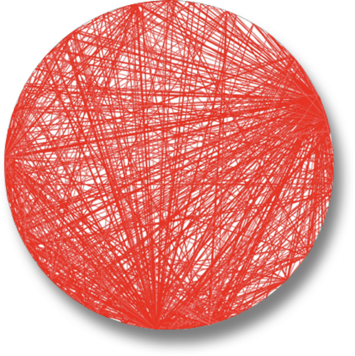

*Figure 9-1: A Big Ball of Mud visualization from a real Java application. Each dot is a class, and each bold line is a tight coupling connection.*

**Why is this so dangerous?**
The core problem isn't just the lack of structure—it's the massive coupling. Because everything is coupled to everything else, a simple change in one class has hard-to-predict rippling side effects across the entire system. Eventually, the system reaches a critical breaking point where developers spend 100% of their time chasing bugs and side effects, and 0% of their time working on new features.

Avoid this "architecture" at all costs. Its lack of structure utterly destroys deployability, testability, scalability, and performance. 

---

## Unitary Architecture
In the beginning, there was only the computer, and the software ran directly on it. The two started as a single entity, then split as they evolved to support more sophisticated capabilities.

Mainframe computers started as singular systems, then gradually separated data into its own kind of system. Similarly, when personal computers (PCs) were first commercialized, the focus was entirely on single machines. As networking became common, distributed systems (like Client/Server architectures) finally appeared.

---

## Client/Server (Two-Tier)
Few pure unitary architectures exist outside of embedded systems. Over time, as software adds functionality, separating concerns becomes necessary to maintain operational characteristics like performance and scale. 

One of the most fundamental styles of separation splits technical functionality between the frontend and the backend. This is called a **Two-Tier** or **Client/Server** architecture. Depending on the era, it comes in several flavors:

1.  **Desktop and Database Server:** Early PC architectures featured rich desktop applications (the client) connecting directly to standalone database servers over the network. Presentation logic sat on the desktop, while computationally intense volume queries ran on robust DB servers.
2.  **Browser and Web Server:** As the internet arrived, the architecture shifted. A "thin client" web browser connected to a web server (which was connected to a database). Many still consider this two-tier, as the UI runs in the browser, while the web and DB servers both run together inside the operations center.
3.  **Single-Page JavaScript Applications (SPAs):** As browser capabilities skyrocketed, the pendulum swung back. SPAs strongly resemble the original "rich desktop" variation, but the heavy presentation logic is executed by JavaScript inside the browser rather than by a local OS desktop application.

As this illustrates, there will *always* be layers to separate different parts of architectures. The specific separation just shifts depending on the needs of the application and the capabilities of the current platform.

---

## Three-Tier
The **Three-Tier** architecture provided even more layers of separation and dominated the late 1990s. As enterprise application servers (in Java and .NET) became prominent, companies split their topologies into three distinct tiers:
1.  **Database Tier:** An industrial-strength database server.
2.  **Application Tier:** An application server managing business logic.
3.  **Frontend Tier:** Generated HTML and JavaScript.

This architecture coincided heavily with complex network-level protocols like CORBA (Common Object Request Broker Architecture) and DCOM (Distributed Component Object Model). Today, architects rarely have to worry about this level of deep network plumbing—those capabilities have evolved into modern tools (like Kafka message queues) or modern architectural patterns (like Event-Driven Architecture).

### Language Design and Long-Term Implications
The explosive popularity of Three-Tier architectures in the 1990s offers a fascinating cautionary tale about architectural assumptions and language design.

When the Java language was being designed, Three-Tier computing was all the rage. At the time, older languages like C++ struggled heavily with moving objects consistently over the network between these distributed tiers. To solve this, Java's designers decided to bake a mechanism called **Serialization** directly into the core of the language. 

The designers assumed Three-Tier architectures would be around forever, so baking it in offered massive convenience. 

Of course, the Three-Tier style eventually faded—but the leftovers haunt Java to this day. Even though virtually no one uses standard Java serialization anymore (favoring JSON or Protobuf), new Java features must constantly support it for backward compatibility, to the great frustration of modern language maintainers. 

> [!TIP]
> Understanding the long-term implications of any design decision is incredibly difficult in software engineering. The perpetual advice to **"favor simple designs"** is actually one of the most effective future-proofing strategies an architect can employ.

---

## Architecture Partitioning
The First Law of Software Architecture states that *everything in software is a trade-off*. This absolutely applies to how an architect partitions components. 

Because components are just a generic containment mechanism, architects can partition them any way they want. However, one specific decision has an outsized impact on the entire system: **Top-Level Partitioning**. 

The way an architect decides to partition the very top-level components dictates the fundamental architecture style. There are two primary categories of top-level partitioning: **Technical** and **Domain**.

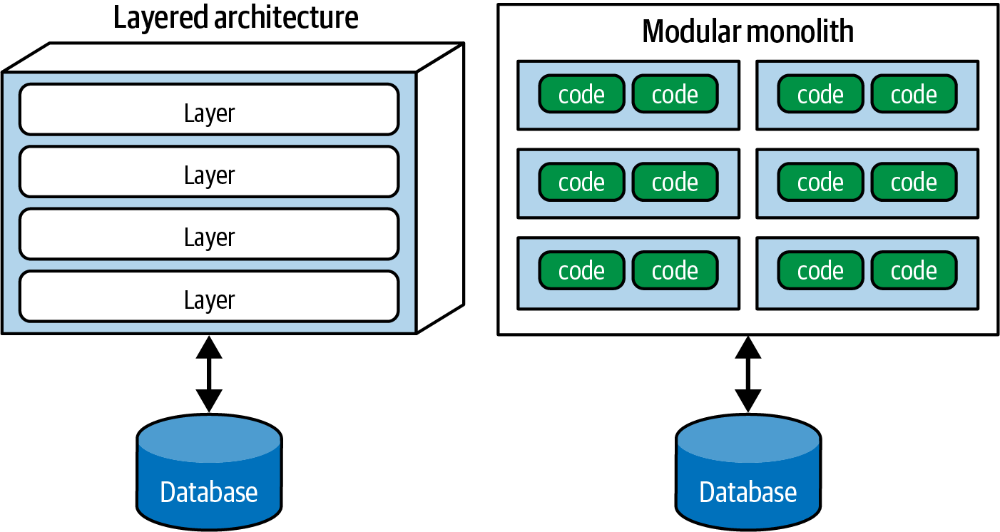

### 1. Technical Partitioning (Layered Architecture)
Technical top-level partitioning organizes the architecture by technical capabilities.

The most common example is the **Layered Architecture**. The architect partitions the system into massive technical buckets: *Presentation*, *Business Rules*, *Services*, and *Persistence*. 

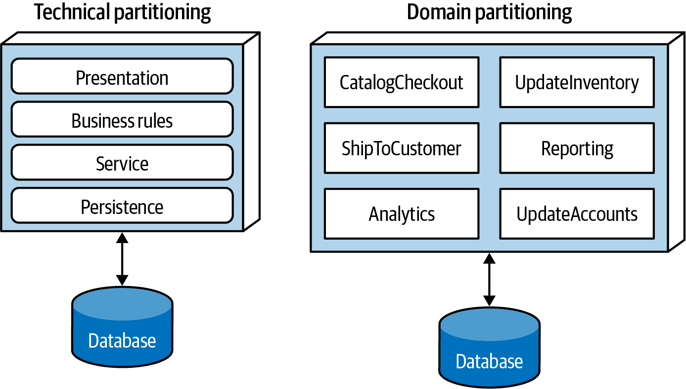

This style has been the default architecture in the industry for decades. It makes intuitive sense to developers, it maps perfectly to the Model-View-Controller (MVC) design pattern, and it makes finding specific types of code incredibly easy (e.g., all database code resides in the Persistence layer). Furthermore, it provides strong technical decoupling—if the database changes, ideally only the Persistence layer is affected.

### 2. Domain Partitioning (Modular Monolith)
Domain partitioning organizes the architecture by business domains or workflows, rather than technical capabilities.

Inspired by Eric Evans’s *Domain-Driven Design* (DDD), this philosophy dictates that the top-level buckets should represent decoupled business concepts (e.g., `CatalogCheckout`, `UserManagement`). 

A **Modular Monolith** is simply a monolithic application that is domain-partitioned at the top level. While each domain component might internally contain its own technical layers (presentation, business, persistence), the *top-level* boundary remains the domain. (The *Microservices* architecture is the fully distributed equivalent of this philosophy).

### The Trade-Off: The Domain Smear
It is completely logical to organize a system using technical partitioning, but it introduces a severe trade-off. 

While it is easy to find categories of code, most realistic software changes revolve around *business workflows*, not technical capabilities. For example, consider the business workflow of `CatalogCheckout`.

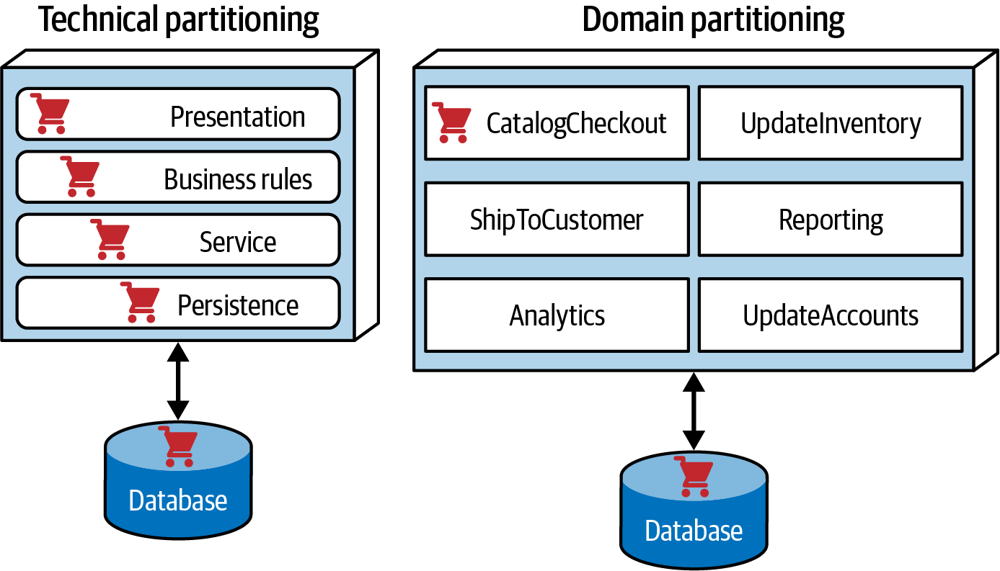

In a technically partitioned architecture, the code required to execute `CatalogCheckout` is smeared across the entire system. It exists in the Presentation layer, the Business Rules layer, and the Persistence layer. To make a simple change to the checkout workflow, a developer must jump across multiple physical directories and layers.

Contrast this with the domain-partitioned architecture. The top-level component is literally `CatalogCheckout`. All the code required for that workflow is heavily localized. This localized structure is why the industry has seen a massive trend toward domain partitioning (both Modular Monoliths and Microservices) over the last few years: it better reflects the kinds of changes that actually occur on modern software projects.

---

## Conway’s Law
In the late 1960s, Melvin Conway made an observation that has shaped the software industry ever since:

> *"Organizations which design systems…are constrained to produce designs which are copies of the communication structures of these organizations."*

Paraphrased, **Conway's Law** states that the structure of a software architecture will inevitably mirror the communication structure of the people who built it. 

If an organization physically seats all the UI developers in one department, the backend developers in another, and the DBAs in a third, the organization is fundamentally constrained to produce a technically partitioned, Layered Architecture. 

### The Inverse Conway Maneuver (Team Topologies)
If Conway's Law is true, then organizations can use it to their advantage. 

Jonny Leroy of Thoughtworks coined the **Inverse Conway Maneuver**: evolving the physical structure of teams and organizations specifically to promote the desired software architecture. Today, this practice is universally known as **Team Topologies**.

If an organization wants to migrate from a legacy Layered Architecture to a modern, domain-partitioned Microservices architecture, they cannot simply rewrite the code. They must first reorganize their people into cross-functional domain teams. If the team topology does not match the desired architecture, the architecture will inevitably fail.

---

## Kata: Silicon Sandwiches — Partitioning
To see these concepts in action, let's analyze the **Silicon Sandwiches** Kata. In this system, there are core sandwich workflows, but there are also intense customizations required (some sandwiches are "Common" globally, while others are highly "Local" to specific franchises).

How should the architect partition this?

### Option 1: Domain Partitioning
In this option, the architect designs exclusively around workflows. They create discrete top-level components for `Purchase`, `Promotion`, `MakeOrder`, `ManageInventory`, `Recipes`, and `Delivery`. 

To handle the customization rules, the architect embeds `Common` and `Local` subcomponents *inside* each of the top-level domain components.

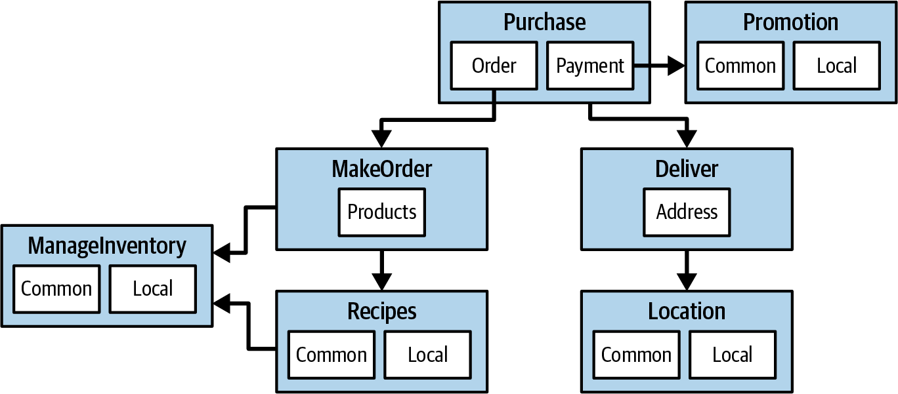

### Option 2: Technical Partitioning
In this alternative, the architect decides the customization rules are the most critical technical concern. Therefore, they isolate `Common` and `Local` as the massive, top-level architectural partitions, placing the workflows inside them.

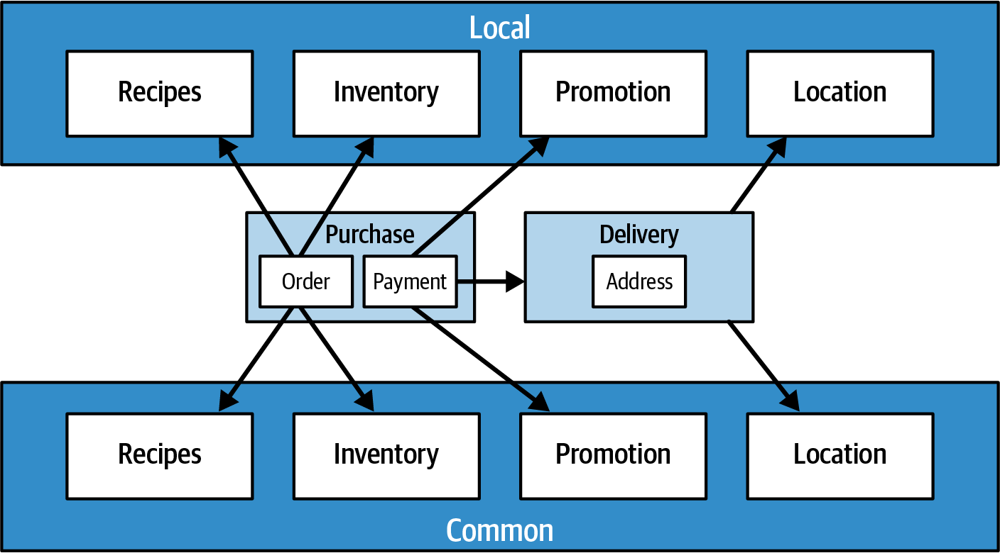

### Which is Better? (Analyzing the Trade-Offs)
As always, it depends! Each partitioning style offers distinct trade-offs.

#### Domain Partitioning Trade-Offs
**Advantages:**
*   **Business Alignment:** The architecture is modeled on how the business actually functions, not on an obscure implementation detail.
*   **Team Topologies:** It is incredibly easy to build cross-functional teams around domains (e.g., the "Delivery" team).
*   **Migration-Ready:** Because both the components *and the data* are typically isolated by domain, migrating this architecture to fully distributed microservices later is extremely easy.

**Disadvantages:**
*   **Duplication:** The customization code (`Common` vs `Local` logic) is physically duplicated across multiple different domain components. 

#### Technical Partitioning Trade-Offs
**Advantages:**
*   **Clean Customization:** The complex customization code (`Common` vs `Local`) is perfectly separated and isolated in one place.

**Disadvantages:**
*   **High Global Coupling:** Changes to the `Common` or `Local` component will likely ripple out and affect every other component in the entire system.
*   **Concept Duplication:** Developers may have to duplicate domain concepts in both the `Common` and `Local` layers.
*   **Data Entanglement:** Technical partitioning almost always relies on a massive, highly-coupled monolithic database. If the architect ever wants to migrate to a distributed system in the future, untangling the massive, shared database will be a nightmare.

---

## Monolithic Versus Distributed Architectures
Architecture styles are generally classified into two main categories: **Monolithic** (a single deployment unit) and **Distributed** (multiple deployment units connected via remote access protocols).

*   **Monolithic Styles:** Layered, Pipeline, Microkernel.
*   **Distributed Styles:** Service-Based, Event-Driven, Space-Based, Service-Oriented (SOA), Microservices.

While distributed architectures are vastly more powerful in terms of scalability and availability, they introduce a terrifying set of trade-offs. These trade-offs were perfectly summarized by L. Peter Deutsch and colleagues at Sun Microsystems in 1994 as the **"8 Fallacies of Distributed Computing."** 

Even today, architects constantly fall victim to these false assumptions.

### Fallacy 1: The Network Is Reliable
Architects love to assume the network is reliable. It is not. 

In a distributed architecture, Service A relies on the network to talk to Service B. Service B might be perfectly healthy, but a network blip causes the request to fail or the response to drop. Because the network is fundamentally unreliable, architects are forced to build complex resilience patterns (timeouts, retries, and circuit breakers). The more a system relies on the network (e.g., Microservices), the more potential it has to fail.

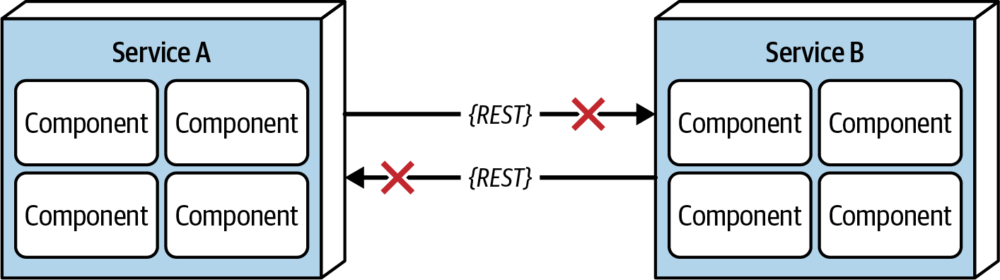

### Fallacy 2: Latency Is Zero
When a monolith makes a local method call, it takes nanoseconds. When a distributed system makes a remote call, it takes milliseconds. Latency is *never* zero.

Architects often ignore this, insisting they have "fast networks." But chaining 10 microservice calls together at 100ms each instantly adds a full second to the request. Furthermore, average latency doesn't matter as much as 95th-percentile "long tail" latency. A system might average 60ms, but if the 95th percentile is 400ms, that long tail will absolutely kill system performance. 

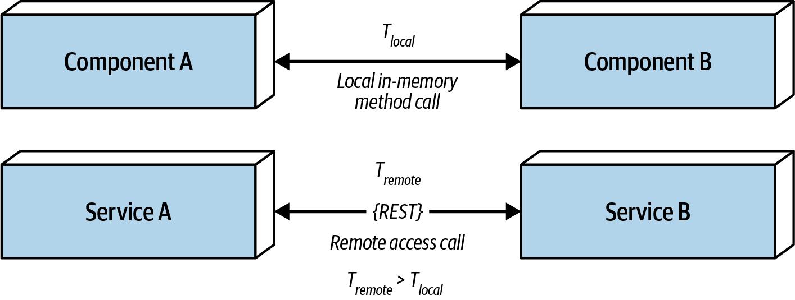

### Fallacy 3: Bandwidth Is Infinite
In a monolith, business requests consume zero network bandwidth. In a distributed architecture, bandwidth consumption is a massive bottleneck.

This is often caused by **Stamp Coupling**—returning far more data than is actually needed. For example, Service A needs a customer's name (200 bytes) and calls Service B. Service B returns the entire Customer Profile (500 KB). If this happens 2,000 times a second, that single inter-service call consumes **1 GBps** of bandwidth! If Service B only returned the 200 bytes, it would consume only 400 Kbps. Architects must use GraphQL, field selectors, or strict contracts to prevent this.

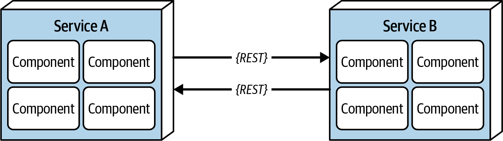

### Fallacy 4: The Network Is Secure
Architects get comfortable behind VPNs and firewalls and forget that the internal network is not secure. 

When moving from a monolith to a distributed architecture, the surface area for attacks increases by orders of magnitude. Every single endpoint—even for internal, inter-service communication—must be secured. This constant security validation is another reason distributed architectures are significantly slower.

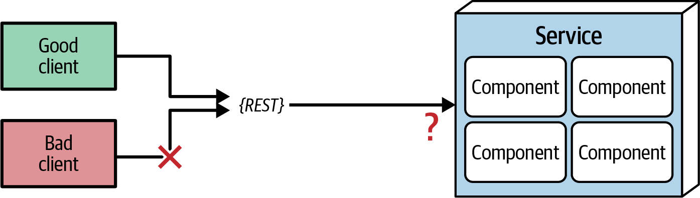

### Fallacy 5: The Topology Never Changes
Architects assume the network topology (routers, hubs, switches, firewalls) is fixed. It changes constantly.

A "minor" network upgrade performed at 2:00 AM on Sunday can unknowingly invalidate all of the system's latency assumptions, triggering massive timeouts and circuit breakers on Monday morning. Architects must be in constant communication with network admins.

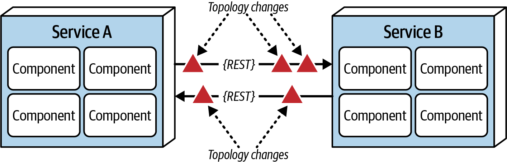

### Fallacy 6: There Is Only One Administrator
When Monday morning hits and the network topology change breaks the system, who does the architect call? 

Architects assume there is only one administrator. In reality, large companies have dozens. A monolithic application doesn't require this level of coordination, but a distributed architecture requires massive organizational collaboration just to keep the lights on.

### Fallacy 7: Transport Cost Is Zero
This does not mean latency (Fallacy #2); this means *actual, literal money*. 

Architects often assume the infrastructure is already in place to support breaking apart a monolith. It almost never is. Distributed architectures cost significantly more money because they require vastly more hardware, gateways, load balancers, proxies, and firewalls.

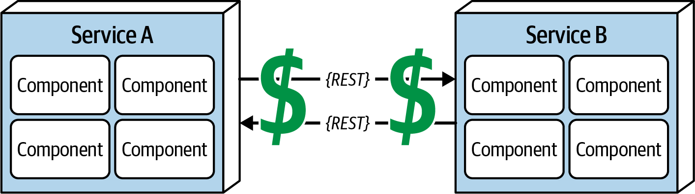

### Fallacy 8: The Network Is Homogeneous
Architects assume the network hardware is all provided by a single vendor. In reality, infrastructures are a heterogeneous mix of Cisco, Juniper, and others. 

Not all of these proprietary hardware implementations play nicely together under heavy load. Packets get dropped. This dropped packet then breaks reliability (Fallacy #1), impacts latency (Fallacy #2), and chokes bandwidth (Fallacy #3)—forming an inescapable, endless loop of frustration.

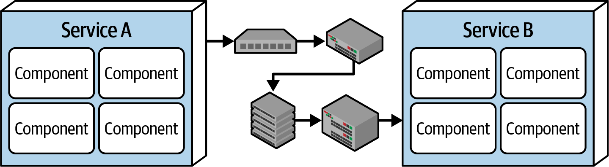

### The "Other" Fallacies
While Deutsch's 8 Fallacies are famous, the authors of this book have learned several near-universal lessons the hard way, and offer them as an extension to the famous list:

#### Fallacy 9: Versioning is Easy
When a service's internal implementation evolves, its contract often must change. The standard answer is simply: *"Just version the contract!"* 

This seemingly simple decision creates a nightmare of trade-offs: Do you version at the individual service level or the system level? How far down the architecture must the versioning reach? Do you support 2 versions or 20? When do you deprecate them? Versioning is a reasonable approach, but it is never easy.

#### Fallacy 10: Compensating Updates Always Work
In distributed architectures, there are no simple database rollbacks. Instead, an Orchestrator service issues a "compensating update" to reverse a transaction if a step fails. 

Architects blithely assume this pattern always works. **But what happens if the compensating update fails?** Architects must always design how to recover if both the initial update *and* the compensating update fail simultaneously. 

#### Fallacy 11: Observability is Optional
In a monolith, logging is a useful luxury. In a distributed architecture, comprehensive observability is a mandatory requirement. Because there are so many invisible communication failure modes, debugging a distributed system without comprehensive interaction logs and distributed tracing is physically impossible.

---

## Team Topologies and Architecture
As established by Conway's Law, architecture and team structure are intrinsically linked. In 2019, Matthew Skelton and Manuel Pais published the highly influential book *Team Topologies*, which defines four distinct team types that architects must understand:

1.  **Stream-Aligned Teams:** Teams scoped to a single, specific business domain or capability (a "stream" of work). Their goal is to move as quickly as possible to deliver discrete value. Every other team type exists to reduce friction for the stream-aligned teams.
2.  **Enabling Teams:** Highly collaborative teams that bridge capability gaps. They perform research, learning, and tooling exploration to supply knowledge to stream-aligned teams.
3.  **Complicated-Subsystem Teams:** Specialists who fully own and understand an incredibly complex subsystem (e.g., a massive proprietary video-encoding engine). Their goal is to completely offload this cognitive load from the stream-aligned teams.
4.  **Platform Teams:** Teams that provide internal, self-service APIs, tools, and infrastructure. They provide the foundational building blocks and necessary governance (security/quality) so that stream-aligned teams can deliver features at a vastly higher pace.

In the upcoming style-focused chapters, we will discuss exactly how each architectural style affects these team topologies.

---

## On to Specific Styles
Before an architect can perform an effective trade-off analysis, they must intimately understand the different architecture styles available to them. 

Every single style supports a wildly different set of architectural characteristics. Each style has a specific "sweet spot" where it absolutely shines, and areas where it completely fails. By learning these styles and their underlying philosophies, an architect can finally determine which architecture represents the "least worst" choice for their specific problem domain.
