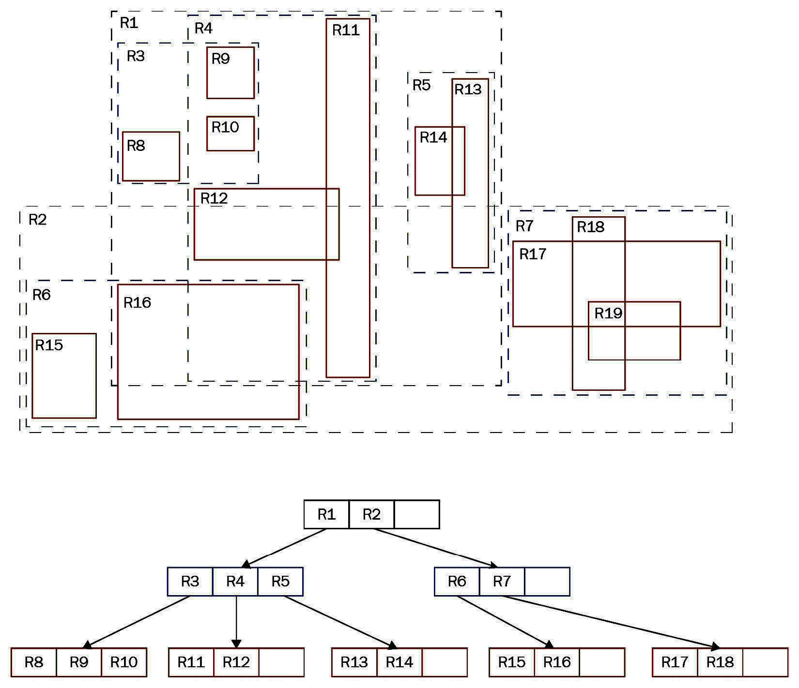

# Chapter 3: Making Use of Indexes

> **Key Rule**: Bad indexing is the main source of bad performance. There is no replacement for a missing index. Adjusting memory parameters is futile if indexes are missing.

## 3.1 Understanding Simple Queries and Cost Model

### The Impact of a Single Slow Query
1 out of 1,001 queries can cause 50% of the load if it is slow.
*   1000 queries x 1 ms = 1 second
*   1 query x 1000 ms = 1 second
*   **Goal**: Find and fix that single slow query using proper indexing.

### EXPLAIN: Analyzing Query Performance
`EXPLAIN` shows the execution plan devised by the optimizer.
*   **Syntax**: `EXPLAIN [ ( option [, ...] ) ] statement`
*   **Useful Options**:
    *   `ANALYZE`: Executes the query and shows actual runtimes/rows.
    *   `BUFFERS`: Shows how many shared buffers (cache 8KB blocks) were hit/read.
    *   `TIMING`: Shows timing per node invocation. Does not measure additional network latency.

**Execution Stages**:
1.  **Parser**: Syntax check.
2.  **Rewrite System**: Handling rules/views.
3.  **Optimizer**: Figures out the most efficient plan (The "Brain").
4.  **Executor**: Runs the plan.

### PostgreSQL Cost Model
Cost is an abstract unit (penalty points), NOT time.

**Example: Sequential Scan (Single CPU)**
```sql
test=# EXPLAIN SELECT * FROM t_test WHERE id = 432332;
QUERY PLAN
----------------------------------------------------------
Seq Scan on t_test (cost=0.00..71622.00 rows=1 width=9)
Filter: (id = 432332)
```
*   **Cost 71622.00**: Calculated based on the table size (pages) and number of rows.

*   **`seq_page_cost`** (Default: 1.0): Cost to read one block sequentially.
*   **`random_page_cost`** (Default: 4.0): Cost for random I/O (seek).
    *   *Tip*: On SSDs/NVMe, lower `random_page_cost` to 1.1 or 1.0.
*   **`cpu_tuple_cost`** (Default: 0.01): CPU cost to process one row.
*   **`cpu_index_tuple_cost`** (Default: 0.005): CPU cost to process one index entry during an index scan. (Do not change usually).
*   **`cpu_operator_cost`** (Default: 0.0025): CPU cost to execute a filter operator (e.g., `=`).

**Formula Example**:
`Total Cost = (Blocks * seq_page_cost) + (Rows * cpu_tuple_cost) + (Rows * cpu_operator_cost)`

**Calculation Example** (for cost `71622.00`):
*   **Table Size**: 21,622 blocks (pages).
*   **Row Count**: 4,000,000 rows.
*   **Calculation**:
    *   I/O: `21622 * 1.0` (seq_page_cost) = 21,622
    *   CPU (Tuples): `4000000 * 0.01` (cpu_tuple_cost) = 40,000
    *   CPU (Filter): `4000000 * 0.0025` (cpu_operator_cost) = 10,000
    *   **Total**: 21,622 + 40,000 + 10,000 = **71,622**

### Parallel Queries
*   **Gather Node**: Combines results from parallel workers.
*   **`max_parallel_workers_per_gather`**: Limits parallelism. Set to 0 to disable parallelism in *session*.
*   **Parallel Cost Parameters**:
    *   `parallel_tuple_cost` (Default: 0.1): Cost of transferring one tuple from a worker to the leader. Accounts for overhead.
    *   `parallel_setup_cost` (Default: 1000.0): One-time cost to start a worker process. Models process management overhead.
*   **Parallel Thresholds**:
    *   `min_parallel_tables_scan_size` (Default: 8 MB): Minimum table size to consider a parallel scan.
        *   *Rule*: The table size must **triple** to accommodate each additional worker.
    *   `min_parallel_index_scan_size` (Default: 512 kB): Minimum index size to consider a parallel index scan.

**Example Parallel Query Plan (Gather Node)**:
```sql
test=# EXPLAIN SELECT * FROM t_test WHERE id = 432332;
QUERY PLAN
------------------------------------------------------------
Gather (cost=1000.00..43455.43 rows=1 width=9)
Workers Planned: 2
-> Parallel Seq Scan on t_test
   (cost=0.00..42455.33 rows=1 width=9)
   Filter: (id = 432332)
```
*   **Interpretation**:
    *   **Gather**: The "Leader" process collecting results.
    *   **Workers Planned: 2**: Two background processes are helping.
    *   **Parallel Seq Scan**: The actual work being split among workers.

---

## 3.2 Deploying Indexes

### B-Tree Indexes (Standard)
*   **Algorithm**: Lehman-Yao high-concurrency B-tree.
*   **Concurrency**: Allows high throughput of simultaneous reads and writes.
*   **Usage**: Equality (`=`), Range (`<`, `>`, `<=`, `>=`), Sorting (`ORDER BY`).

```sql
CREATE INDEX idx_id ON t_test (id);
```

### The Cost of Indexing
Indexes are not free.
1.  **Disk Space**: An index on 4 million rows can take ~86 MB.
    *   Check size with `\di+ index_name`.
2.  **Write Performance**: Every `INSERT`, `UPDATE`, or `DELETE` must update ALL indexes on the table.
    *   *Warning*: A table with 20 indexes will have significantly slower write throughput.

### Parallel Index Creation
Since v11 (B-Tree) and v17 (BRIN), PostgreSQL can build indexes using multiple CPUs.
*   **Result**: Drastically faster index build times.
*   **Parameter**: `max_parallel_maintenance_workers` controls the upper limit of workers for maintenance commands like `CREATE INDEX`.
### Index De-duplication
Since **PostgreSQL 13**, B-Tree indexes automatically de-duplicate entries.
*   **Mechanism**: If an index stores many identical values, they are compressed.
*   **Impact**: Significantly smaller index size -> Higher cache hit rates -> Better performance.
*   **Example**:
    *   `idx_id` (Unique IDs): **86 MB**
    *   `idx_name` (Many duplicate 'hans'/'paul'): **26 MB** (Compressed due to de-duplication)
    ```sql
    test=# \di+
    List of relations
    Schema | Name     | Type  | Owner | Table  | Size
    -------+----------+-------+-------+--------+-------
    public | idx_id   | index | hs    | t_test | 86 MB
    public | idx_name | index | hs    | t_test | 26 MB
    ```

### Sorting and Index Scans
Indexes are sorted. PostgreSQL can use them to avoid specific sorts or find Min/Max instantly.
*   **`ORDER BY id DESC LIMIT 10`**: Uses `Index Scan Backward`. No sorting of the table needed.
    ```sql
    test=# EXPLAIN SELECT * FROM t_test ORDER BY id DESC LIMIT 10;
    QUERY PLAN
    ---------------------------------------------------------
    Limit (cost=0.43..0.74 rows=10 width=9)
    -> Index Scan Backward using idx_id on t_test
       (cost=0.43..125505.43 rows=4000000 width=9)
    ```
    *   **Interpretation**: The index is already sorted. Scanning it backwards gives the top 10 highest IDs immediately (sub-millisecond) without reading the whole table or performing a sort.
*   **`min(id)` / `max(id)`**: Uses `Index Only Scan` (instantly jumps to start or end of the B-Tree).
    ```sql
    test=# EXPLAIN SELECT min(id), max(id) FROM t_test;
    QUERY PLAN
    --------------------------------------------------------
    Result (cost=0.91..0.92 rows=1 width=8)
      InitPlan 1 (Returns min)
        -> Limit (cost=0.43..0.46 rows=1 width=4)
           -> Index Only Scan using idx_id on t_test
      InitPlan 2 (Returns max)
        -> Limit (cost=0.43..0.46 rows=1 width=4)
           -> Index Only Scan Backward using idx_id on t_test
    ```
    *   **InitPlan**: These are pre-steps executed *once* before the main query grid.
        *   **InitPlan 1**: Scans the index normally (forward) to find the first (lowest) value.
        *   **InitPlan 2**: Scans the index backward to find the last (highest) value.
    *   **Note**: The main table (heap) is NEVER touched. The index contains everything needed.

### Index-Only Scans
If **all** columns requested are in the index, PostgreSQL doesn't need to visit the main table (Heap) at all.
*   **Benefit**: Huge I/O saving.
*   **Keywords**: `Index Only Scan`.

**Comparison Example**:
1.  **Index Scan** (Need non-indexed columns `*`):
    ```sql
    test=# EXPLAIN SELECT * FROM t_test WHERE id = 34234;
    QUERY PLAN
    -----------------------------------------------------------
    Index Scan using idx_id on t_test
    (cost=0.43..8.45 rows=1 width=9)
    Index Cond: (id = 34234)
    ```
    *   **Logic**: Finds ID in index -> Goes to Heap to fetch `name`.
2.  **Index Only Scan** (Need only indexed column `id`):
    ```sql
    test=# EXPLAIN SELECT id FROM t_test WHERE id = 34234;
    QUERY PLAN
    -----------------------------------------------------------
    Index Only Scan using idx_id on t_test
    (cost=0.43..8.45 rows=1 width=4)
    Index Cond: (id = 34234)
    ```
    *   **Logic**: Finds ID in index -> Returns it. **Zero** table access.

*   **Covering Index**: Add extra payload columns to an index solely to allow Index-Only Scans.
    ```sql
    CREATE INDEX idx_cov ON t_test (id) INCLUDE (payload_col);
    ```

### Using Multiple Indexes (Bitmap Scans)
PostgreSQL can use **more than one index** for a single query (e.g., for `OR` conditions or complex independent filters).

**Example: `OR` Condition**
```sql
test=# explain SELECT * FROM t_test WHERE id = 30 OR id = 50;
QUERY PLAN
-----------------------------------------------------------
Bitmap Heap Scan on t_test
  Recheck Cond: ((id = 30) OR (id = 50))
  -> BitmapOr
     -> Bitmap Index Scan on idx_id (id = 30)
     -> Bitmap Index Scan on idx_id (id = 50)
```
*   **Mechanism**:
    1.  **Bitmap Index Scan**: Scans Index A, creates a memory bitmap of **blocks** containing matching rows.
    2.  **Bitmap Index Scan**: Scans Index B, creates another bitmap.
    3.  **BitmapOr / BitmapAnd**: Combines the bitmaps (Union or Intersection).
    4.  **Bitmap Heap Scan**: Reads the actual table blocks listed in the final bitmap.
*   **Recheck Cond**: Since bitmaps often track *blocks* (not specific rows) to save memory, the executor must "recheck" each row in the retrieved block to see if it actually matches the condition.
*   **Note**: A **Bitmap Scan** is an execution method, *not* to be confused with "Bitmap Indexes" (a specific index type in Oracle).
*   **Decision**: The optimizer may prefer a simple Index Scan if combining indexes is too expensive (e.g., if one condition matches 90% of the table, intersecting it is pointless).
*   **Performance Tip (OR vs UNION)**: `OR` can sometimes be expensive. If performance is poor, try rewriting the query using `UNION` (or `UNION ALL`). In many cases, this produces a relevant performance boost by allowing independent optimization of each branch.

### Using Bitmap Scans Effectively
When is a Bitmap Scan chosen? Primarily in two cases:
1.  **To avoid fetching the same block repeatedly**:
    *   *Scenario*: Query matches 10% of rows.
    *   *Problem*: A normal index scan might visit the *same* physical block multiple times (jumping back and forth), causing I/O thrashing.
    *   *Solution*: Bitmap Scan collects all matching block IDs first, sorts them, and visits each block **exactly once**.
2.  **To combine relatively weak criteria**:
    *   *Scenario*: `age BETWEEN 20 AND 30` (15% match) AND `shirt_color = 'yellow'` (15% match).
    *   *Logic*: Scanning the table is expensive. Scanning one index leaves too many rows.
    *   *Solution*: Combining both indexes reduces the result set to ~2.25%, making the specific block lookups cheaper than a sequential scan.

**Parallel Bitmap Scans**:
Since PostgreSQL 10.0, the *Heap Scan* part of a Bitmap Scan (reading the table) can be parallelized, significantly speeding up these "expensive" queries.

### Combined Indexes (Multi-column)
The general rule is that if a single (combined) index can answer your question, it’s usually the best choice compared to joining two separate indexes via Bitmap Scan.

**Example**: Index on `(postal_code, last_name, first_name)`.
*   *Analogy*: A telephone book. Ordered by `City` (postal code), then `Last Name`, then `First Name`.

| Query Filter | Index Usable? | Remarks |
| :--- | :--- | :--- |
| `postal_code = 2700` | **Yes** | Ideal use case. Finds the range of 2700 instantly. |
| `postal_code = 2700 AND last_name = 'Schönig' AND first_name = 'Hans'` | **Yes** | Perfect match. |
| `last_name = 'Schönig' AND postal_code = 2700` | **Yes** | PostgreSQL automatically reorders conditions to match the index. |
| `postal_code = 2700 AND last_name = 'Schönig'` | **Yes** | Uses the first two columns of the index efficiently. |
| `first_name = 'Hans'` | *No / Inefficient* | Cannot use the sorted structure (skipping columns). Might do a full index scan if the table is very wide. |

*   **Key takeaway**: You cannot efficiently search the "middle" or "right" side of a B-Tree without filtering the "left" side first.

---

### Using Indexes Intelligently (When NOT to use them)
Indexes are not a magic wand. PostgreSQL will ignore an index if scanning the whole table is cheaper.

**Example: The Impact of Data Distribution**
1.  **Selective Query** (Rare/Missing Value):
    ```sql
    test=# EXPLAIN SELECT * FROM t_test WHERE name = 'hans2';
    QUERY PLAN
    -----------------------------------------------------
    Index Scan using idx_name on t_test
    (cost=0.43..4.45 rows=1 width=9)
    Index Cond: (name = 'hans2'::text)
    ```
    *   **Reason**: Planner expects very few rows (rows=1). Index is efficient.
2.  **Broad Query** (Common Values covering 100% of data):
    ```sql
    test=# EXPLAIN SELECT * FROM t_test WHERE name = 'hans' OR name = 'paul';
    QUERY PLAN
    -----------------------------------------------------------
    Seq Scan on t_test (cost=0.00..81622.00 rows=3000005 width=9)
    Filter: ((name = 'hans'::text) OR (name = 'paul'::text))
    ```
    *   **Reason**: Planner knows 'hans' and 'paul' are the *only* values. Sequential Scan is faster than Index Scan for reading the whole table.
3.  **Low Selectivity**: `WHERE name = 'rare_name'`
    *   **Plan**: `Bitmap Scan`.
    *   **Reason**: Intermediate volume of data.

**Key Lesson**:
> **Execution Plans depend on INPUT VALUES.**
> Plans are **not static**. A query might use an index for ID=5 (rare) but a Sequential Scan for ID=1 (common). This dynamic behavior helps performance but can cause unpredictable runtimes in production.

## 3.3 improving Speed using Clustered Tables (Correlation)
The physical order of data on disk drastically affects performance.
*   **Sequential Data**: If rows with `ID=1, ID=2, ID=3` are next to each other on disk, reading a range requires finding just 1 block.
*   **Random Data**: If rows are shuffled, reading the same range might require visiting 100 different blocks.

**The Correlation Metric (`pg_stats`)**:
This view shows how closely the physical table order matches the logical column order.
*   **1.0**: Perfect correlation (sorted).
*   **0.0**: Random order.
*   **-1.0**: Perfectly reverse sorted.

```sql
test=# SELECT tablename, attname, correlation
FROM pg_stats
WHERE tablename IN ('t_test', 't_random')
ORDER BY 1, 2;
 tablename | attname | correlation  
-----------+---------+--------------
 t_random  | id      | -0.005975342
 t_random  | name    |   0.49059877
 t_test    | id      |            1
 t_test    | name    |            1
(4 rows)
```
*   **Analysis**:
    *   `t_test.id` has correlation **1.0** (Perfectly sequential).
    *   `t_random.id` has correlation **-0.00** (Totally shuffled).
*   **Source**: These statistics are created by the `ANALYZE` command (usually run automatically by the **autovacuum** daemon). They are vital for the planner.

**Detailed Analysis**:
*   `t_test.id` (Correlation 1): Numbers are ascending. `t_test.name` (Correlation 1): All 'hans' are together, then all 'paul'.
*   `t_random.id` (Correlation ~0.0): Data is shuffled.
*   `t_random.name` (Correlation ~0.5): Names switch frequently.
*   **The "Why"**: If relevant data is spread out (low correlation), the database must read **many more physical blocks** to retrieve the same amount of information compared to tightly packed (correlated) data.

**Impact on Performance (Example)**:
1.  **High Correlation (Sorted Table)**:
    ```sql
    test=# EXPLAIN (analyze true, buffers true, timing true)
    SELECT * FROM t_test WHERE id < 10000;
    QUERY PLAN
    ----------------------------------------------------------
    Index Scan using t_test_id_idx on t_test
            (cost=0.43..341.96 rows=9859 width=9)
            (actual time=0.043..3.132 rows=9999 loops=1)
        Index Cond: (id < 10000)
        Buffers: shared hit=85
    Planning:
        Buffers: shared hit=10
    Planning Time: 0.443 ms
    Execution Time: 4.307 ms
        (7 rows)
    ```
    *   **Result**: Fast (4.3 ms). Only 85 blocks touched.
    *   **Interpretation**:
        *   `analyze true`: Executes `SELECT...` query to compare estimates vs reality.
        *   `buffers true`: parameter will tell us how many of the 8k blocks were touched by the query.`shared hit=85` means 85 cached blocks (8KB each) were read from RAM.
        *   `timing true`: Tracks time spent in each node.

2.  **Low Correlation (Random Table)**:
    ```sql
    test=# EXPLAIN (analyze true, buffers true, timing true)
    SELECT * FROM t_random WHERE id < 10000;
    QUERY PLAN
    -----------------------------------------------------------
    Bitmap Heap Scan on t_random
            (cost=175.71..17153.27 rows=9198 width=9)
            (actual time=5.337..27.991 rows=9999 loops=1)
        Recheck Cond: (id < 10000)
        Heap Blocks: exact=8034
        Buffers: shared hit=4677 read=3387 written=975
        I/O Timings: shared/local read=9.640 write=5.664
        -> Bitmap Index Scan on idx_random
                (cost=0.00..173.42 rows=9198 width=0)
                (actual time=3.434..3.434 rows=9999 loops=1)
                    Index Cond: (id < 10000)
                    Buffers: shared hit=3 read=27
                    I/O Timings: shared/local read=0.253
    Planning:
        Buffers: shared hit=10 read=3
        I/O Timings: shared/local read=0.081
    Planning Time: 0.471 ms
    Execution Time: 28.578 ms
    (14 rows)
    ```
    *   **Result**: Slow (28.5 ms). **8034 blocks** touched (vs 85!).
    *   **Why?**: Random distribution means the 10,000 rows were scattered across 80% of the table's total blocks.
    *   **Plan Change**: PostgreSQL switched to a **Bitmap Heap Scan** to minimize the random I/O damage. A normal Index Scan would have been even slower (jumping back and forth between random blocks).

### `CLUSTER`: Determining Physical Order
The `CLUSTER` command rewrites the table to physically match the order of an index.
```sql
test=# CLUSTER t_random USING idx_random;
CLUSTER
```

**Warnings & Considerations**:
1.  **Locking**: `CLUSTER` takes an `ACCESS EXCLUSIVE` lock. **No reads or writes** are possible on the table while it runs.
    *   *Production Impact*: Causes downtime for that table.
2.  **Single Index Rule**: You can only optimize physical order for *one* index (e.g., sort by ID). You cannot simultaneously be sorted by `Name` and `BirthDate`. `CLUSTER` only makes sense if there’s one search criterion that’s used most of the time.
3.  **Maintenance**: **Correlation deteriorates** over time! Subsequent INSERTs/UPDATEs are *not* automatically kept sorted. You must re-run `CLUSTER` (or use `pg_repack`/`pg_squeeze` extensions) periodically.

## 3.4 Functional and Partial Indexes

### Functional Indexes
### Functional Indexes
Standard indexes store the raw column value. But what if you always query a *transformation* of that value (e.g., lowercased email, rounded number)?
A **Functional Index** (or Expression Index) stores the **output** of a function in the B-Tree.

**Requirement: IMMUTABILITY**
*   The function must be `IMMUTABLE`. Its output must depend *solely* on the input arguments and never change.
    *   **Allowed**: `lower(email)`, `cos(id)`.
    *   **Forbidden**: `age(timestamp)` (Changes every day!), `random()`.

**Example: Indexing a Calcuation (`cos`)**
```sql
test=# CREATE INDEX idx_cos ON t_random (cos(id));
CREATE INDEX
test=# ANALYZE;
ANALYZE
```
*   **Query Usage**:
    ```sql
    test=# EXPLAIN SELECT * FROM t_random WHERE cos(id) = 10;
    QUERY PLAN
    -----------------------------------------------------------
    Index Scan using idx_cos on t_random  (cost=0.43..8.45 rows=1 width=9)
    Index Cond: (cos((id)::double precision) = '10'::double precision)
    ```
*   **Note**: The query MUST match the functional expression exactly. `WHERE id = ...` will NOT use `idx_cos`.

*   **Note**: The query MUST match the functional expression exactly. `WHERE id = ...` will NOT use `idx_cos`.

### Reducing Space Consumption (Over-Indexing)
Indexes consume disk space and resources.
*   **The Cost**: A table can easily have indexes larger than the data itself!
    *   *Example*: 4 indexes = 284 MB. Underlying Tables = 338 MB. Indexes account for ~45% of total space.
*   **The Risk**: **Over-indexing**. Creating unused indexes burns disk space and slows down EVERY write (Insert/Update) operation.

### Partial Indexes: The Solution
Ideally, only index the rows you will actually search for.
*   **Concept**: Use a `WHERE` clause in `CREATE INDEX`.
*   **Example**: Indexing only *rare* values (excluding the common 'hans' and 'paul').
    ```sql
    test=# CREATE INDEX idx_name ON t_test (name) WHERE name NOT IN ('hans', 'paul');
    CREATE INDEX
    ```
*   **Result**: The index size drops from **26 MB** to **8 KB** (empty index, basically).
*   **Rule of Thumb**: Only exclude very frequent values (e.g., >25% of table). Candidates: Gender, Nationality, Boolean flags (`is_deleted=false`).

```sql
CREATE INDEX idx_active ON tasks (id) WHERE status = 'active';
```

## 3.5 Adding Indexes in Production (Concurrency)
Standard `CREATE INDEX` locks the table (`SHARE` lock).
*   **Impact**: Blocks all `INSERT`, `UPDATE`, `DELETE` operations while building.
*   **Risk**: For large tables (e.g., 1 TB), this causes unacceptable downtime.

**Solution: `CREATE INDEX CONCURRENTLY`**
*   **Behavior**: Builds the index without locking the table. Writes can proceed normally.
*   **Trade-off**: Takes significantly longer (approx. 2x) and uses more CPU/IO.
*   **Usage**:
    ```sql
    CREATE INDEX CONCURRENTLY idx_name2 ON t_test (name);
    ```
*   **Warning (Invalid Indexes)**:
    *   If the operation fails (deadlock, unique violation, cancelled), the index remains as an **INVALID** index.
    *   It consumes space but is ignored by the planner.
    *   **Fix**: You must `DROP INDEX` and retry. Check status with `\d table_name`.

---

## 3.6 Operator Classes (Custom Sorting Strategy)
**Why do they exist?**
Indexes rely on "Order" to function. For numbers (`1 < 2`) or text (`A < B`), the order is obvious.
However, sometimes data **looks** like text but has **hidden semantic rules**:

**Example: Austrian Social Security Numbers**
*   Format: `1118 09 08 78` (Seq + Day + Month + Year)
*   **The Problem**:
    *   Row A: `1118 09 08 78` (Aug 9, 1978)
    *   Row B: `2345 01 05 77` (May 1, 1977)
    *   *Standard Sort*: Row A < Row B (because '1' < '2'). **WRONG!**
    *   *Correct Sort*: Row B < Row A (1977 comes before 1978).

An **Operator Class** teaches the index specifically *how* to compare two values (`<`, `>`, `=`) to support this custom logic without changing the data type.

**Mechanism**:
1.  **Define Strategy**: Map the 5 B-Tree comparison slots (Less, LessOrEqual, Equal, GreaterOrEqual, Greater) to your custom functions.
2.  **Plugin**: The index uses this "strategy plugin" instead of the default alphanumeric sort.

### Step-by-Step Implementation
**Goal**: Create an index that sorts `1118 09 08 78` based on the date (`78-08-09`) instead of the string.

**Step 1: The Normalization Function**
Helper function to rearrange the string into a sortable format (Year-Month-Day-Seq).
```sql
CREATE OR REPLACE FUNCTION public.normalize_si(text) RETURNS text AS $$
BEGIN
    -- Input: 1118090878 (Seq Day Month Year)
    -- Output: 7808091118 (Year Month Day Seq)
    RETURN substring($1, 9, 2) || substring($1, 7, 2) ||
           substring($1, 5, 2) || substring($1, 1, 4);
END; $$ LANGUAGE 'plpgsql' IMMUTABLE;
```

**Step 2: Comparison Functions**
We need 4 functions for the operators (LT, LE, GE, GT). *Equals (=) can reuse the standard operator.*
*   **Important**: Must be `IMMUTABLE` and written in `plpgsql` (or C), not raw SQL to avoid inlining issues.
```sql
-- Less Than (_lt)
CREATE OR REPLACE FUNCTION public.si_lt(text, text) RETURNS boolean AS $$
BEGIN RETURN normalize_si($1) < normalize_si($2); END; $$ LANGUAGE 'plpgsql' IMMUTABLE;

-- Less or Equal (_le)
CREATE OR REPLACE FUNCTION public.si_le(text, text) RETURNS boolean AS $$
BEGIN RETURN public.normalize_si($1) <= public.normalize_si($2); END; $$ LANGUAGE 'plpgsql' IMMUTABLE;

-- Greater or Equal (_ge)
CREATE OR REPLACE FUNCTION public.si_ge(text, text) RETURNS boolean AS $$
BEGIN RETURN public.normalize_si($1) >= public.normalize_si($2); END; $$ LANGUAGE 'plpgsql' IMMUTABLE;

-- Greater Than (_gt)
CREATE OR REPLACE FUNCTION public.si_gt(text, text) RETURNS boolean AS $$
BEGIN RETURN public.normalize_si($1) > public.normalize_si($2); END; $$ LANGUAGE 'plpgsql' IMMUTABLE;
```

**Step 3: The Support Function**
B-Trees need a "3-way comparison" function (returns -1, 0, 1) for internal speed.
```sql
CREATE OR REPLACE FUNCTION public.si_same(text, text) RETURNS int AS $$
BEGIN
    IF public.normalize_si($1) < public.normalize_si($2) THEN RETURN -1;
    ELSIF public.normalize_si($1) > public.normalize_si($2) THEN RETURN +1;
    ELSE RETURN 0;
    END IF;
END; $$ LANGUAGE 'plpgsql' IMMUTABLE;
```

**Step 4: Create Operators**
Bind the functions to symbols (`<#`, `<=#`, etc.).
```sql
CREATE OPERATOR <# (PROCEDURE=public.si_lt, LEFTARG=text, RIGHTARG=text);
CREATE OPERATOR <=# (PROCEDURE=public.si_le, LEFTARG=text, RIGHTARG=text);
CREATE OPERATOR >=# (PROCEDURE=public.si_ge, LEFTARG=text, RIGHTARG=text);
CREATE OPERATOR ># (PROCEDURE=public.si_gt, LEFTARG=text, RIGHTARG=text);
```

**Step 5: Create the Operator Class**
Finally, bundle everything into a B-Tree strategy.
```sql
CREATE OPERATOR CLASS sva_special_ops FOR TYPE text USING btree AS
    OPERATOR 1 <# ,
    OPERATOR 2 <=# ,
    OPERATOR 3 = ,
    OPERATOR 4 >=# ,
    OPERATOR 5 ># ,
    FUNCTION 1 public.si_same(text, text);
```
*   **Explanation**:
    *   `USING btree`: Explicitly tells PostgreSQL this class is for B-Tree indexes.
    *   `OPERATOR 1 <#`: Tells B-Tree Strategy 1 (Less Than) to use our custom `<#` operator.

**Usage (Creating the Index)**
You must explicitly tell the index to use your new class instead of the default `text_ops`.
```sql
CREATE INDEX idx_special ON t_sva (sva sva_special_ops);
```
*   **Result**: The index is now sorted by "Year-Month-Day" logic, not string logic.
*   *Without this class*: `CREATE INDEX ... (sva)` would default to standard text sorting (which is wrong for this data).

### Testing the Custom Operator Class
**Problem**: With tiny tables (e.g., 2 rows), PostgreSQL always prefers a Sequential Scan (cheaper than opening an index).
**Solution**: Force index usage for testing by disabling sequential scans.

```sql
SET enable_seqscan TO off;

test=# explain SELECT * FROM t_sva WHERE sva = '0000112273';
QUERY PLAN
-----------------------------------------------------------
Index Only Scan using idx_special on t_sva
(cost=0.13..8.14 rows=1 width=32)
Index Cond: (sva = '0000112273'::text)
```
*   **Observation**: PostgreSQL uses `idx_special`. The `Index Cond` confirms it is using our logic.
*   **Result**: The query plan proves the operator class is active and valid for the optimizer.

---

## 3.5 PostgreSQL Index Types Overview

| Index Type | Internal Name | Best Use Case |
| :--- | :--- | :--- |
| **B-Tree** | `btree` | Default. Equality, Range, Sorting. High concurrency. |
| **Hash** | `hash` | **Equality only** (`=`). Crash-safe (since PG 10). Larger than B-Tree typically. |
| **GiST** | `gist` | "Generalized Search Tree". Geometries (PostGIS), Ranges, Fuzzy Search. |
| **GIN** | `gin` | "Generalized Inverted Index". Full Text Search, JSONB, Arrays. |
| **SP-GiST** | `spgist` | "Space-Partitioned GiST". Unbalanced trees (Quadtrees, K-D trees). Phone numbers, IP routing. |
| **BRIN** | `brin` | "Block Range Index". Huge tables, highly correlated data (Time Series). Tiny size. |

### Clarification: Heap & Bitmap Indexes

**What about "Heap" Indexes?**
*   **Misconception**: In PostgreSQL, the `heap` is **NOT an index**. It is the default storage engine for the **Table Data** itself.
*   `pg_am` lists `heap`, but it refers to the Table Access Method (how rows are stored), not an index structure.

**What about "Bitmap" Indexes?**
*   **Fact**: PostgreSQL does **NOT** have persistent Bitmap Indexes on disk (unlike Oracle).
*   **The Alternative**:
    *   **Bitmap Scans**: PostgreSQL builds bitmaps *in memory, on the fly* during query execution (as explained in Section 3.2).
    *   **GIN Indexes**: Can sometimes serve the same purpose for low-cardinality data.
    *   **BRIN Indexes**: Efficient for large datasets, similar to how bitmap indexes are used in data warehousing.

### Hash Indexes
While B-Trees are sorted, **Hash Indexes** are "Buckets" on disk.
*   **Use Case**: **Equality checks only** (`WHERE id = 5`). Cannot handle Ranges (`<`, `>`) or Sorting.
*   **Evolution**:
    *   *Before PostgreSQL 10*: **Unsafe**. Not WAL-logged (could corrupt on crash, didn't replicate).
    *   *PostgreSQL 10+*: **100% Crash-Safe** and fully supported in replication.
*   **Disk Usage**:
    *   *Myth*: "Hash indexes are tiny."
    *   *Reality*: Often **larger** than B-Trees due to bucket overhead.
    *   *Benchmark*: 4 million integer index -> **B-Tree: 90 MB** vs **Hash: 125 MB**.
*   **When to use Hash Indexes?**
    *   Since they are often larger and less flexible (no sorting), B-Trees are usually preferred.
    *   **Niche Use Case**: Extremely long strings (e.g., URLs) where you only need equality checks. A B-Tree would store the long string, leading to bloated pages (and `index row requires 8+ KB` errors). A Hash Index only stores the 4-byte hash value, making it potentially smaller for *very large* keys.

---

## 3.6 GiST and GIN Deep Dive

### GiST (Generalized Search Tree)
GiST is not a single index structure but a **framework** for building hierarchical tree structures (like R-Trees for geometry). It is highly extensible.



**Internal Structure (The R-Tree Concept - Figure 3.1)**
*   **Hierarchy of "Bounding Boxes"**:
    *   **Root Level**: Contains broad bounding boxes (e.g., `R1`, `R2`) that cover slightly overlapping regions of the entire data map.
    *   **Child Level**: `R1` contains smaller boxes (`R3`, `R4`, `R5`).
    *   **Leaf Level**: `R3` contains specific data points/items (`R8`, `R9`, `R10`).
*   **Search Logic**: To find a point, the engine checks: "Does `R1` cover this point?" -> Yes -> "Does `R3` cover it?" -> Yes -> Check contents of `R3`.
*   **Efficiency**: Ideally, it prunes huge branches of the tree instantly (if the point isn't in `R2`, we ignore all children of `R2`).

**Supported Operations**:
Unlike B-Trees ("Less Than", "Equals"), GiST supports complex spatial/logical operators:
*   Overlaps (`&&`)
*   Contains (`@>`) / Contained By (`<@`)
*   Strictly Left of (`<<`) / Right of (`>>`)
*   Distance (Nearest Neighbor `<->`)

**Example Usage (Geometric / Range)**:
Finding all overlapping reservations (using `tsrange`) or geometric boxes.
```sql
-- Find all items that OVERLAP with the box ((0,0), (10,10))
SELECT * FROM locations 
WHERE area && box '((0,0),(10,10))';
-- Uses GiST index to quickly eliminate all "R" boxes not touching this coordinate.
```
*   **Extension**: `btree_gist` allows using GiST for standard scalars (int, text), enabling combination indexes like `(int_col, geometric_col)`.

### GIN (Generalized Inverted Index)
Designed for composite values (Text documents, Arrays, JSONB) where a single row has **many** keys.

**Architecture (Inverted Index)**
*   **The Problem**: In a B-Tree, if a word "database" appears in 1 million documents, the B-Tree would store the key "database" 1 million separate times (once for each row). Huge waste!
*   **The GIN Solution**:
    *   **One Key Entry**: Stores "database" *once* in a B-Tree structure.
    *   **Posting List**: The key points to a compressed list of millions of Document IDs (TIDs) that contain that word.
*   **Result**: Extremely compact for high-frequency keys.
*   **Sorting Limitation**: GIN returns results sorted by **Physical Item Pointer** (CTID order), *NOT* by the value itself or any other criteria. It is unordered regarding the content.

**Pros/Cons**:
*   **Strength**: Unbeatable for Full Text Search and Array contains (`@>`).
*   **Weakness**: **Slow Updates**. Inserting a document with 1,000 unique words requires updating 1,000 separate places in the GIN index. (PostgreSQL uses a "Pending List" buffer to mitigate this).

**Example Usage (Arrays)**:
```sql
CREATE TABLE books (title text, tags text[]);
-- Index the Array column
CREATE INDEX idx_tags ON books USING GIN (tags);

-- Find books tagged with 'database' AND 'sql'
SELECT * FROM books WHERE tags @> ARRAY['database', 'sql'];
```

### SP-GiST (Space-Partitioned GiST)
Designed for **unbalanced**, non-overlapping data structures.
*   **Key Idea**: It splits the value space into non-overlapping partitions (unlike standard GiST where boxes can overlap).
*   **Data Structures**: Quadtrees, K-D Trees, Radix Trees (Tries).
*   **Best Use Cases**:
    *   **Skewed Data**: Unlike B-Trees (which try to stay balanced), SP-GiST works well with data that has "hot spots" (e.g., URLs with common prefixes).
    *   **Partitioning**: IP Addresses (`inet`), Suffix Trees (URLs).
*   **Mechanism**:
    *   Does not simply store data. It partitions space recursively.
    *   Example: Splitting a 2D map into 4 quadrants (Quadtree). If one quadrant has more points, it splits that quadrant further.
*   **In-Memory Optimized**: Heavy pointer usage means it's often designed for structures that fit well in RAM, though it works on disk.


---

## 3.7 BRIN (Block Range Indexes)
**The Problem with B-Trees**: For 10 million rows, a B-Tree stores 10 million pointers. This is huge (e.g., 90 MB).
**The BRIN Solution**:
*   **Concept**: Don't index every row. Instead, index **Chunks** of 1 MB (default 128 blocks).
*   **Storage**: Stores only the **Minimum** and **Maximum** value found in that 1 MB chunk.
*   **Size**: Extremely small.
    *   *Example*: A standard B-Tree for our test table was **90 MB**. A BRIN index is **48 kB**! (2000x smaller).
    ```sql
    test=# CREATE INDEX idx_brin ON t_test USING brin(id);
    CREATE INDEX
    test=# \di+ idx_brin
    List of relations
    Schema | Name     | Type  | Table  | Size
    -------+----------+-------+--------+-------
    public | idx_brin | index | t_test | 48 kB
    ```

**When to use BRIN?**
*   **Requirement**: Data MUST be **physically correlated** (sorted) on disk.
    *   *Good*: `created_at` in a Log table (always increasing).
    *   *Bad*: Random IDs.
*   **Why?**:
    *   **Sorted Data**: BRIN says "Chunk 5 has values 100-200". Query `WHERE id=150` scans only Chunk 5. Efficient!
    *   **Random Data**: BRIN says "Chunk 5 has values 1-1,000,000". Query `WHERE id=150` must scan Chunk 5... and Chunk 6... and Chunk 7... Useless.
*   **Lossy**: BRIN is "lossy" regarding precision. It returns a *candidate* chunk. PostgreSQL must scan the actual chunk rows to filter out false positives.

### Additional Index Extensions (Bloom Filters)
Since PostgreSQL 9.6, custom access methods can be added as extensions (`CREATE ACCESS METHOD`).
**The Bloom Filter Index** (`bloom` extension):
*   **Problem**: You have a table with 80 columns. You don't know which combination users will query (Col A + Col B? or Col C + Col Z?).
    *   *B-Tree*: Efficient only for fixed leftmost prefixes. Can't index all combinations.
*   **Bloom Solution**: A probabilistic index that allows indexing **many columns** (signature based).
    *   **Pros**: Supports filtering on **any subset** of indexed columns (e.g., `x5 = 9 AND x3 = 7`).
    *   **Cons**: "Lossy" (needs recheck), entire bloom signature must be read.

**Example Usage**:
```sql
CREATE EXTENSION bloom;
CREATE TABLE t_bloom (x1 int, x2 int, ... x7 int);

-- Index ALL columns in one bloom filter
CREATE INDEX idx_bloom ON t_bloom USING bloom(x1, x2, x3, x4, x5, x6, x7);

-- Query on random columns (x5 and x3)
-- Plan: Bitmap Heap Scan -> Bitmap Index Scan on idx_bloom
SELECT * FROM t_bloom WHERE x5 = 9 AND x3 = 7;
```

---

## 3.8 Fuzzy Searching (pg_trgm)

### Trigrams (`pg_trgm`)
Modern users expect results even with typos ("Did you mean...?").
**Concept (Trigrams)**
*   It breaks strings into 3-character rolling windows.
*   Example: `show_trgm('abcdef')` -> `{" a"," ab",abc,bcd,cde,def,"ef "}`.
*   **Similarity**: Two strings are similar if they share many trigrams.
*   **Distance Operator `<->`**: Returns a value between 0 (Identical) and 1 (Completely different).

**Example: Finding Austrian Cities (with Typos)**
1.  **Setup**:
    ```sql
    CREATE EXTENSION pg_trgm;
    CREATE TABLE t_location (name text);
    -- Load 2354 Austrian city names
    COPY t_location FROM PROGRAM 'curl https://www.cybertec-postgresql.com/secret/orte.txt';
    ```
2.  **Indexing**:
    *   **GiST**: Good for "Nearest Neighbor" (`ORDER BY <->`).
    *   **GIN**: Better for large datasets and containment checks.
    ```sql
    CREATE INDEX idx_trgm ON t_location USING GiST (name gist_trgm_ops);
    ```
3.  **Fuzzy Query**: Search for 'Kramertneusiedel' (Misspelled 'Gramatneusiedl').
    ```sql
    test=# SELECT * FROM t_location ORDER BY name <-> 'Kramertneusiedel' LIMIT 3;
          name
    ----------------
     Gramatneusiedl
     Klein-Neusiedl
     Potzneusiedl
    ```
    *   **Result**: It correctly found "Gramatneusiedl" despite the wrong first letter (G vs K) and missing vowels. The GiST index optimized the "nearest neighbor" sort.

### Speeding up `LIKE '%text%'`
Standard B-Trees only handle left-anchored searches (`text%`).
*   **Solution**: `GiST` or `GIN` index with `gin_trgm_ops` speeds up `%text%` (middle wildcard) and regex searches.

```sql
CREATE EXTENSION pg_trgm;
CREATE INDEX idx_trgm ON t_location USING gin (name gin_trgm_ops);
SELECT * FROM t_location WHERE name LIKE '%neusi%'; -- Uses Index
```

---

## 3.9 Full-Text Search
Full-Text Search (FTS) is about finding **semantics** (words/meanings), not just substrings. It uses "Contains" searching.

### Understanding `to_tsvector` (Parsing)
The core function is `to_tsvector(config, text)`. It dissects text into **lexemes** (stems):
1.  **Tokenization**: Splits string into words.
2.  **Stop Words**: Removes common noise words (e.g., "a", "the", "I").
3.  **Stemming**: Reduces variations ("cars" -> "car", "running" -> "run").

**Example 1: English Stemming**
```sql
test=# SELECT to_tsvector('english', 'A car, I want a car. I would not even mind having many cars');
                                          to_tsvector
-----------------------------------------------------------------------------------------------
 'car':2,6,14 'even':10 'mani':13 'mind':11 'want':4 'would':8
```
*   **Result**: "cars" became 'car'. "many" became 'mani'. Stop words "a", "I", "not" are gone.

**Example 2: Language Dependency (Dutch)**
If you use the wrong config, results change drastically:
```sql
test=# SELECT to_tsvector('dutch', 'A car, I want a car... many cars');
                                     to_tsvector
-------------------------------------------------------------------------------------
 'a':1,5 'car':2,6,14 'even':10 'having':12 'i':3,7 'many':13 ...
```
*   **Note**: In Dutch, "a" and "i" are NOT stop words, so they are kept unlike in English.
*   **Check configs**: `SELECT cfgname FROM pg_ts_config;`

### Comparing Strings (Querying)
We use the `@@` match operator to check if a `tsvector` (text) matches a `tsquery` (search request).

**Example 1: Matching Stemmed Words**
```sql
test=# SELECT to_tsvector('english', 'A car, I want a car.') @@ to_tsquery('english', 'wanted');
 ?column?
----------
 t
```
*   **Result**: `true`.
*   **Why?**: "want" (in text) and "wanted" (in query) both stem to the same root: **'want'**. This is the power of FTS over `LIKE` comparison.

**Example 2: Logical Operators**
You can combine search terms with logical operators:
*   `&` (AND)
*   `|` (OR)
*   `!` (NOT)
*   `<->` (FOLLOWED BY)

```sql
test=# SELECT to_tsvector('english', 'I want a car') @@ to_tsquery('english', 'wanted & bmw');
 ?column?
----------
 f
```
*   **Result**: `false` because "bmw" is missing.

### Defining GIN Indexes for FTS
To make FTS fast, you must index the `vector`. A B-Tree cannot do this (vectors are not sortable). **GIN** is the standard because it maps Tokens -> Postings (rows).

There are two main strategies:
1.  **Functional Index** (Simpler, Slower CPU):
    *   Index the *result* of the function.
    *   **Pros**: Saves disk space (no extra column in table).
    *   **Cons**: CPU overhead on every insert/update to re-calculate vector.
    ```sql
    CREATE INDEX idx_fts_func ON t_fts USING gin(to_tsvector('english', comment));
    ```

2.  **Materialized Column + Trigger** (Faster Queries, More Storage):
    *   Store the pre-calculated `tsvector` in a real column (`ts`).
    *   Use a **Trigger** to auto-update it on INSERT/UPDATE.
    *   **Pros**: Queries are faster (no need to call `to_tsvector` during scan).
    *   **Cons**: Uses more table storage. complexity.
    ```sql
    -- 1. Add column
    ALTER TABLE t_fts ADD COLUMN ts tsvector;

    -- 2. Create Index on the real column
    CREATE INDEX idx_fts_real ON t_fts USING gin(ts);

    -- 3. Create Trigger to keep it in sync
    CREATE TRIGGER tsvectorupdate
    BEFORE INSERT OR UPDATE ON t_fts
    FOR EACH ROW EXECUTE PROCEDURE
    tsvector_update_trigger(ts, 'pg_catalog.english', comment);
    ```
    *   *Note*: PostgreSQL provides the built-in C function `tsvector_update_trigger` for exactly this purpose. It ensures consistency within the transaction.

### Debugging your search
If search results are unexpected (e.g., "Why didn't this word match?"), use `ts_debug`.
It reveals how the parser processes string input step-by-step.

```sql
test=# SELECT * FROM ts_debug('english', 'Mussipushi is a cat');
   alias   |   description   |   token    |  dictionaries  |  dictionary  | lexemes
-----------+-----------------+------------+----------------+--------------+----------
 asciiword | Word, all ASCII | Mussipushi | {english_stem} | english_stem | {mussipushi}
 blank     | Space symbols   |            | {}             |              |
 asciiword | Word, all ASCII | is         | {english_stem} | english_stem | {}
 blank     | Space symbols   |            | {}             |              |
 asciiword | Word, all ASCII | a          | {english_stem} | english_stem | {}
 blank     | Space symbols   |            | {}             |              |
 asciiword | Word, all ASCII | cat        | {english_stem} | english_stem | {cat}
```
*   **Columns**:
    *   `token`: The raw word found.
    *   `lexemes`: The final stemmed output. (Notice 'is' and 'a' have empty lexemes `{}` because they are stop words).

**Gathering Statistics**:
`ts_stat` allows you to inspect the content of your `tsvector` column (e.g., finding the most frequent words in your documents).
```sql
SELECT * FROM ts_stat('SELECT ts FROM t_fts') ORDER BY nentry DESC LIMIT 3;
```

---

## 3.10 Exclusion Constraints
Indexes generally ensure uniqueness (`UNIQUE`). But what if you need to ensure **Non-Overlapping** data?
GiST indexes support "Overlaps" (`&&`) operators, allowing us to define advanced logical constraints.

**Example: Room Reservations**
Goal:
1.  Allow different rooms to be booked at the same time.
2.  **Prevent** the *same room* from having overlapping time slots.

**Implementation**:
```sql
CREATE EXTENSION btree_gist; -- Needed to index 'int' (room) together with 'tsrange' inside GiST

CREATE TABLE t_reservation (
    room    int,
    from_to tsrange,
    -- The Magic Constraint:
    EXCLUDE USING GiST (room WITH =, from_to WITH &&)
);
```
*   **Translation**: "Reject any new row where `room` is Equal (=) AND `from_to` Overlaps (&&) with an existing row."

**Testing the Constraint**:
1.  **Success**: Different rooms, same time.
    ```sql
    INSERT INTO t_reservation VALUES (10, '["2017-01-01", "2017-03-03"]');
    INSERT INTO t_reservation VALUES (13, '["2017-01-01", "2017-03-03"]');
    ```
2.  **Failure**: Same room (13), overlapping time (Feb 2nd overlaps with Jan-Mar).
    ```sql
    INSERT INTO t_reservation VALUES (13, '["2017-02-02", "2017-08-14"]');
    -- ERROR: conflicting key value violates exclusion constraint...
    ```
    *   **Translation**: "Reject any new row where `room` is Equal (=) AND `from_to` Overlaps (&&) with an existing row."

 **FAQ: Can I use `CHECK` constraints instead?**
*   **No.** A `CHECK` constraint can only validate the *current row* (e.g., `end_date > start_date`). It cannot look at *other rows* in the table.
*   To check against other rows, you'd need a Trigger or an Exclusion Constraint. Exclusion Constraints are faster and handle race conditions automatically via the index.

**FAQ: Can I handle this in Application Logic?**
*   *Scenario*: User A checks if room is free. It is. User A books it.
*   *But*: User B checks *at the exact same millisecond*. It is still free (User A hasn't committed yet). User B also books it.
*   **Result**: Double Booking (Race Condition).
*   **Solution**: Doing it in the Database (Exclusion Constraint) guarantees safety because the Index locks the specific value range during insertion. Application-level locks are often buggy or slow (serializeable isolation is needed).
    period tsrange,
    EXCLUDE USING gist (room_id WITH =, period WITH &&) ;
    -- Prevents inserting a booking if room_id is EQUAL (=) AND period OVERLAPS (&&)

