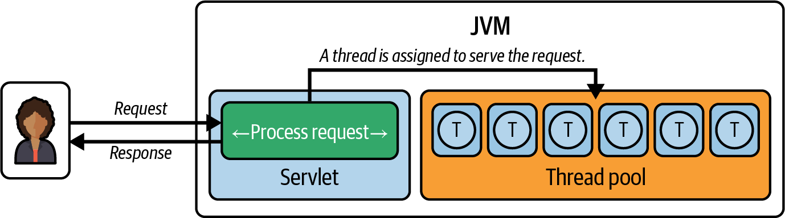
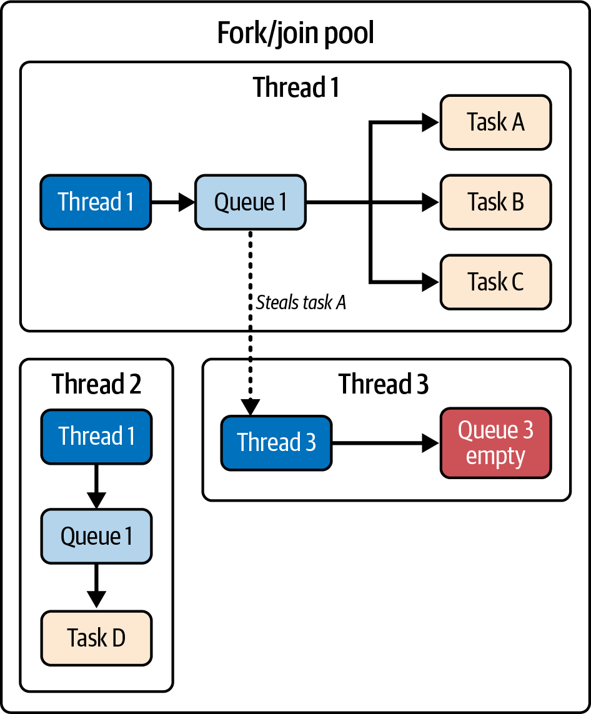

# A Brief History of Threads in Java

Java was designed with concurrency as an explicit goal, removing the need for developers to rely heavily on operating-system-specific features. Over the years, its capabilities have evolved to handle increasing complexity and performance demands.

## Evolution Milestones

- **Java 1.0 (1996)**: Introduced with built-in thread support, differentiating it from other languages at the time. Concurrency relied on basic synchronization and thread management.
- **Java 5**: Introduced the `java.util.concurrent` package, adding the `Executor` framework, locks, and concurrent collections.
- **Java 7**: Introduced the `Fork/Join` framework to leverage multicore processors efficiently.
- **Java 8**: Introduced `CompletableFuture` for composable, asynchronous programming.
- **Project Loom (Modern Java)**: Addressed limitations of traditional thread-based concurrency by introducing virtual threads (lightweight, user-mode threads) and structured concurrency for massive scalability.

## Java Is Made of Threads

In Java, a thread is the smallest unit of execution—an independent path running within a program.

- Threads share the same address space (variables and data structures).
- Each thread maintains its own program counter, stack, and local variables, enabling independent operation.
- Java’s threading model relies on the underlying OS to schedule and execute threads across multiple CPUs to achieve true parallelism.


> **Image Description**: Figure 1-1 illustrates the execution of threads by different CPUs. It shows a central "Operating system" managing multiple CPUs, where each CPU is executing its own queue of "Threads", demonstrating how the OS distributes thread execution across hardware processors to achieve parallelism.

### Parallelism vs. Concurrency
- **Parallelism**: Doing multiple things simultaneously (requires multiple processing units/CPU cores). Example: Multiple workers building a house side-by-side.
- **Concurrency**: Designing programs where portions of operation overlap, not necessarily simultaneously. Example: A single chef juggling multiple dishes.

### The Main Thread
Every Java program uses threads. Even a simple "Hello, World!" program is executed by the JVM in a thread called the `main` thread.

```java
public class HelloWorld {
    public static void main(String[] args) {
        System.out.println("Hello, World!");
        // Displaying the thread that’s executing the main method
        System.out.println("Executed by thread: " 
            + Thread.currentThread().getName());
    }
}
```

## Threads: The Backbone of the Java Platform

Threads are deeply integrated into the JVM and perform crucial roles:
- **Exceptions**: Each thread has its own call stack. When an exception occurs, the thread's stack trace helps diagnose the sequence of method calls that led to the error.
- **Debugging**: Debuggers attach to individual threads, allowing developers to pause execution, inspect state, and step through code independently per thread.
- **Profiling**: Profilers use thread information to pinpoint performance bottlenecks, slowdowns, and timing issues.
- **Background JVM Operations**: Garbage collection, JIT compilation, and signal dispatching are all handled by background threads.

## The Genesis of Java 1.0 Threads

In the early days of Java, threads were created by either extending the `Thread` class or implementing the `Runnable` interface. 

```java
public class ThreadCreationDemo {
    public static void main(String[] args) {
        // Extending Thread class
        Thread t1 = new ThreadByExtension("Worker-1");
        t1.start();
        
        // Implementing Runnable (classic)
        Thread t2 = new Thread(
            new RunnableImplementation(), "Worker-2");
        t2.start();
        
        // Anonymous inner class (Java 1.1)
        Thread t3 = new Thread(new Runnable() {
            @Override
            public void run() {
                System.out.println("Anonymous: " + 
                    Thread.currentThread().getName());
            }
        }, "Worker-3");
        t3.start();
        
        // Lambda expression (Java 8)
        Thread t4 = new Thread(() -> 
            System.out.println("Lambda: " + 
                Thread.currentThread().getName()), 
            "Worker-4");
        t4.start();
    }
}

class ThreadByExtension extends Thread {
    public ThreadByExtension(String name) {
        super(name);
    }
    @Override
    public void run() {
        System.out.println("Extended Thread: " + getName());
    }
}

class RunnableImplementation implements Runnable {
    @Override
    public void run() {
        System.out.println("Runnable: " + 
            Thread.currentThread().getName());
    }
}
```

### Key Design Considerations
- **Thread Extension**: Gives direct access to thread methods but consumes the single inheritance slot in Java.
- **Runnable Implementation**: The preferred approach. It separates task definition from thread management and preserves inheritance flexibility.
- **Anonymous Inner Classes (Java 1.1)**: Reduced boilerplate for one-off tasks.
- **Lambda Expressions (Java 8)**: Made the `Runnable` implementation extremely concise due to it being a functional interface.


## Starting Threads

Creating a thread is initiated by invoking the `start` method on a `Thread` object. The `start` method performs essential setup tasks (like allocating system resources) and subsequently calls the `run` method in a new thread of execution.

> [!WARNING]
> It is crucial **not** to call the `run` method directly. Doing so will execute the method in the current calling thread instead of a new thread.

In modern Java, managing threads manually through constructors is less efficient than using the **Executor framework**. 
- Executors abstract thread management by maintaining a **thread pool** (pre-created threads).
- Tasks are submitted to a queue, and a thread from the pool picks them up.
- This optimizes resource utilization by reusing threads and avoiding creation overhead.

```java
import java.util.concurrent.ExecutorService;
import java.util.concurrent.Executors;

public class ExecutorExample {
    public static void main(String[] args) {
        // Creates a thread pool with 5 threads
        try (ExecutorService executor = Executors.newFixedThreadPool(5)) {
            for (int i = 0; i < 10; i++) {
                final int taskId = i;
                executor.submit(() -> {
                    System.out.println("Executing task " + taskId
                        + " in thread " + Thread.currentThread().getName());
                });
            }
        }
    }
}
```

## Understanding the Hidden Costs of Threads

Most web applications use a **thread-per-request model**, where a servlet container assigns an incoming request to a thread from its pool to manage the entire request/response lifecycle.


> **Image Description**: Figure 1-2 illustrates the thread pool handling servlet requests. Incoming requests arrive at the servlet container, which delegates them to available threads within the Thread pool to process the request and return the response.

This model allows for high concurrency, meaning high throughput. However, creating more threads indefinitely is problematic due to several hidden costs:

1. **Memory Footprint**: Each thread consumes about **2 MiB of memory** (outside the heap). In large-scale applications with thousands of connections, this aggregate memory footprint can exhaust physical RAM, leading to disk paging (which is ~1,000x slower than RAM access).
2. **OS Limits**: Java threads are thin wrappers around native OS threads. Scalability is strictly bottlenecked by the host operating system's upper limit on spawnable threads.
3. **Context Switching**: Thread creation involves CPU overhead. Switching between threads requires storing the current thread's context and loading the new one. Under high load, these CPU cycles used for context switching severely degrade performance.

> [!NOTE]
> **Throughput**: In web applications, throughput is the rate at which requests are processed (RPS or TPS). It is calculated as: `Throughput = Total Request Processed / Total Time`.


## How Many Threads Can You Create?

There is a finite, hardware- and OS-dependent limit to the number of threads you can create before encountering an `OutOfMemoryError`.

To measure this limit in your own environment, you can run a simple test program that creates threads in an infinite loop until the system runs out of resources:

```java
import java.util.concurrent.atomic.AtomicInteger;
import java.util.concurrent.locks.LockSupport;

public class ThreadLimitTest {
    public static void main(String[] args) {
        var threadCount = new AtomicInteger(0);
        try {
            while (true) {
                var thread = new Thread(() -> {
                    threadCount.incrementAndGet();
                    LockSupport.park(); // Pauses the thread indefinitely
                });
                thread.start();
            }
        } catch (OutOfMemoryError error) {
            System.out.println("Reached thread limit: " + threadCount);
            error.printStackTrace();
        }
    }
}
```

When executed, this program will eventually crash, producing output similar to:

```text
Reached thread limit: 16363
java.lang.OutOfMemoryError: unable to create native thread: possibly out of
memory or process/resource limits reached
```

This experiment proves that while threads provide scalability, they are constrained by the underlying OS. Careful consideration of these limits is necessary for optimal application performance.

## Resource Efficiency in High-Scale Applications

In modern cloud environments, resource inefficiency quickly escalates infrastructure costs. Because we have a finite number of threads, we must use them efficiently. However, in practice, threads are often wasted due to **blocking**.

Consider a method that calculates a credit score based on various factors:

```java
public Credit calculateCredit(Long personId) {
    var person = getPerson(personId); // Database call - blocks thread
    var assets = getAssets(person); // API call - blocks thread
    var liabilities = getLiabilities(person); // Database call - blocks thread
    importantWork(); // CPU-intensive work
    return calculateCredits(assets, liabilities);
}
```

If each of these method invocations takes 200 milliseconds, the total execution time is roughly 1 second (200ms × 5). 

### The Inefficiency of I/O Blocking

The primary inefficiency in the example above is that the thread is **blocked during input/output (I/O) operations**. 
- When `getPerson(personId)` makes a database call, the thread waits for the network response.
- During this wait, the thread is tied up and cannot be reassigned to handle other incoming requests.
- Even though the thread appears "busy," it is mostly just waiting on external systems, not performing actual computation.

In high-throughput applications, blocking severely limits scalability because every blocked thread is one less thread available to serve users. 

### The Evolution Towards Efficiency
Minimizing the time threads spend blocked on I/O has been the main driver of Java's concurrency evolution. This led to the adoption of:
- **Asynchronous method invocations** (running independently while I/O completes)
- **Thread pooling** (reusing threads)
- **Modern reactive programming models** (non-blocking, event-driven interactions)


## The Parallel Execution Strategy

If method invocations within a workflow do not have interdependencies, they can be dispatched to run in parallel. Parallel execution reduces the duration the main thread is blocked and diminishes idle time, allowing it to quickly free up for other work once the overarching method finishes.

Using the previous credit score example, methods like `getAssets()`, `getLiabilities()`, and `importantWork()` can execute concurrently since they don't depend on each other's outputs.

### Data Structures
First, we define basic `record` structures for our models:

```java
// Credit calculation models
record Credit(double score) {}
record Person(Long id, String name) {}
record Asset(String type, double value) {}
record Liability(String type, double amount) {}
```

### Implementing Parallel Execution

Here is how the credit calculation looks when refactored to use unbounded parallel threads:

```java
import java.util.List;
import java.util.concurrent.Callable;
import java.util.concurrent.atomic.AtomicReference;

public Credit calculateCreditWithUnboundedThreads(Long personId)
throws InterruptedException {
    var person = getPerson(personId); // Still blocks initially
    
    // Use AtomicReference to safely share object references between threads
    var assetsRef = new AtomicReference<List<Asset>>();
    var t1 = new Thread(() -> {
        var assets = getAssets(person);
        assetsRef.set(assets); // Thread-safe assignment
    });
    
    var liabilitiesRef = new AtomicReference<List<Liability>>();
    Thread t2 = new Thread(() -> {
        var liabilities = getLiabilities(person);
        liabilitiesRef.set(liabilities);
    });
    
    // Independent work that doesn't affect the credit calculation
    var t3 = new Thread(() -> importantWork());
    
    // Start executing all three threads concurrently to reduce overall time
    t1.start();
    t2.start();
    t3.start();
    
    // Wait for the critical data to finish fetching
    t1.join();
    t2.join();
    
    // Calculate using the parallel-fetched results
    var credit = calculateCredits(assetsRef.get(), liabilitiesRef.get());
    
    // Ensure independent work finishes before returning
    t3.join();
    
    return credit;
}
```

### Key Technical Details
- **`AtomicReference`**: Used from the `java.util.concurrent.atomic` package. It is a thread-safe data structure required because the results computed by the background threads must be safely handed back to the main thread.
- **`join()`**: Pauses the main thread until the target thread finishes execution, guaranteeing that the required data (like `assets` and `liabilities`) is fully loaded before continuing.

> [!TIP]
> Use `AtomicReference` for sharing object references safely between threads. If you need to share primitive values, use alternatives like `AtomicInteger`, `AtomicLong`, etc.

### Supporting Methods (Simulation)
To complete the system, supporting methods are implemented to simulate latency (like database/API calls) using `Thread.sleep()`:

```java
// Simulated methods with 200ms delay each
private Person getPerson(Long personId) {
    simulateDelay(200);
    return new Person(personId, "John Doe");
}

private List<Asset> getAssets(Person person) {
    simulateDelay(200);
    return List.of(new Asset("House", 300000), new Asset("Car", 25000));
}

private List<Liability> getLiabilities(Person person) {
    simulateDelay(200);
    return List.of(new Liability("Mortgage", 200000), new Liability("Credit Card", 5000));
}

private void importantWork() {
    simulateDelay(200);
    System.out.println("Important work completed");
}

private Credit calculateCredits(List<Asset> assets, List<Liability> liabilities) {
    simulateDelay(200);
    double totalAssets = assets.stream().mapToDouble(Asset::value).sum();
    double totalLiabilities = liabilities.stream().mapToDouble(Liability::amount).sum();
    double creditScore = (totalAssets - totalLiabilities) / 1000;
    return new Credit(creditScore);
}

private void simulateDelay(int milliseconds) {
    try {
        Thread.sleep(milliseconds);
    } catch (InterruptedException e) {
        Thread.currentThread().interrupt();
        throw new RuntimeException(e);
    }
}
```


## Handling `InterruptedException` Correctly

When dealing with `InterruptedException` in Java, it is crucial to preserve the thread’s interrupted status. The proper pattern for handling this exception is as follows:

```java
catch (InterruptedException e) {
    // Restore the interrupted status
    Thread.currentThread().interrupt();
    // Wrap in an unchecked exception to propagate
    throw new RuntimeException(e);
}
```

### Why is this necessary?
- **The internal flag**: Calling `Thread.interrupt()` on a thread sets an internal flag. This causes blocking methods (like `sleep()`, `wait()`, or blocking I/O) to throw an `InterruptedException`.
- **The flag gets cleared**: Catching the `InterruptedException` automatically **clears** this interrupted flag. This causes issues for any code higher up the call stack that needs to know the thread was interrupted.
- **Restoring the flag**: By explicitly calling `Thread.currentThread().interrupt()` inside the `catch` block, you reset the flag. This ensures that upstream code checking `Thread.interrupted()` or `Thread.currentThread().isInterrupted()` functions correctly.
- **Wrapping the Exception**: Wrapping the checked `InterruptedException` inside an unchecked `RuntimeException` allows the error to propagate up the call stack without forcing every intermediate method to declare `throws InterruptedException`. This is especially useful when implementing interfaces that do not declare checked exceptions in their signatures.


## Introducing the Executor Framework

To avoid the dangers and overhead of creating ad hoc threads manually, modern Java provides structured concurrency frameworks like the **`ExecutorService`**.

Using an `ExecutorService` provides significant benefits:
- **Thread Lifecycle Management**: It abstracts away thread creation and destruction overhead.
- **Efficient Reuse**: It manages a pool of threads that can be efficiently reused for multiple tasks.
- **Resource Control**: It strictly controls the number of concurrent threads running, protecting system resources from exhaustion.

### Refactoring with `ExecutorService`

Here is the previous credit calculation logic refactored to use an `ExecutorService`:

```java
import java.util.concurrent.ExecutionException;
import java.util.concurrent.ExecutorService;
import java.util.concurrent.Executors;

public Credit calculateCreditWithExecutor(Long personId)
throws ExecutionException, InterruptedException {
    
    // Creates a thread pool that automatically shuts down when the try-with-resources block exits
    try (ExecutorService executor = Executors.newFixedThreadPool(5)) {
        var person = getPerson(personId);
        
        // Submits critical tasks we need results from (returns a Future)
        var assetsFuture = executor.submit(() -> getAssets(person));
        var liabilitiesFuture = executor.submit(() -> getLiabilities(person));
        
        // Submits additional work that doesn't need to block the main flow
        executor.submit(() -> importantWork());
        
        // Waits for the critical tasks to finish (.get() blocks) and calculates the result
        return calculateCredits(assetsFuture.get(), liabilitiesFuture.get());
    }
}
```

### Key Takeaways
While the overall execution time might be similar to using manual unbounded threads, `ExecutorService` provides superior organizational facilities. It makes managing concurrent work easier, the code significantly cleaner, and acts as a safer boundary for executing workloads under heavy traffic.


## Remaining Challenges

While the `Executor` framework drastically improves asynchronous execution and resource management, it still presents limitations:

### 1. Blocking on `Future.get()`
The framework introduces `Future` objects to handle asynchrony, but calling `.get()` on a `Future` still strictly blocks the execution of the calling thread. The blocking is merely shifted to a different location in the code; it is not eliminated.

### 2. Cache Coherence Overhead & False Sharing
Tasks submitted to a thread pool may end up being executed on entirely different CPU cores than the main thread.
- **Cache Lines**: Modern CPUs feature tiered L-caches (L1, L2, L3) designed to accelerate data access. These caches store small chunks of data—called *cache lines* (size varies with hardware architecture)—so that subsequent requests for that data can be served rapidly from the cache rather than the significantly slower main memory.
- **False Sharing**: When multiple concurrent tasks run on different CPUs, there is a chance their working variables might sit physically adjacent to each other and get loaded into the very same cache line. If the first CPU modifies its variable, the underlying hardware assumes the entire cache line has been altered. To guarantee correctness across the system, the second CPU is forced to invalidate its local copy of that cache line. It must then incur the performance penalty of completely reloading the cache line from main memory (or the other core's cache) before it can proceed.
- Frequent cache line invalidations and memory reloads negatively impact performance in frameworks where tasks are blindly distributed across CPUs.

> [!NOTE]
> **Cache Coherence Protocols**: Modern CPUs use hardware-level protocols (like MESI or MOESI) to guarantee that all CPU cores maintain a consistent, synchronized view of memory. When one core writes to a cache line, these protocols enforce the invalidation or updating of that line in all other cores' caches, securing data integrity at the direct cost of performance overhead.

### 3. Lack of Composability
The `Executor` framework relies heavily on imperative-style code. As applications grow in complexity, many developers prefer functional and declarative styles for asynchronous tasks, as they are easier to chain, compose, read, and maintain.


## Beyond Basic Thread Pools

To address issues like heavy cache contention and complex task dependencies found in the basic `Executor` framework, Java introduced the **`Fork/Join` Pool**. As a specialized implementation of `ExecutorService`, it delivers sophisticated thread-pooling and intelligent task scheduling for superior performance.

### Cache Affinity and Task Distribution

**Cache affinity** is the practice of executing related tasks on the same CPU core to leverage the locality of the CPU's L-cache.
- When a task runs on a specific core, its data is loaded into that core's cache.
- If subsequent related tasks are routed to the same core, they can access this cached data instantly rather than fetching it from main memory.
- The `Fork/Join` Pool natively encourages cache affinity because worker threads prioritize pulling tasks from their own local queues, significantly minimizing expensive *cache misses*.

### Work-Stealing Algorithm

Instead of relying on a single, shared task queue (which can cause contention), the `Fork/Join` pool provides each thread with its own distinct queue. 

To prevent any thread from sitting idle, it employs a **Work-Stealing Algorithm**:
- When a thread finishes all tasks in its own queue, it actively "steals" tasks from the tail of another busy thread's queue.
- This dynamic redistribution balances the workload, maximizing overall CPU utilization.


> **Image Description**: Figure 1-3 diagrams the work-stealing algorithm in the Fork/Join pool. It shows multiple threads with individual queues. If Thread 3's queue becomes empty, it actively steals tasks from the end of Thread 1's busy queue to ensure no CPU sits idle.

### Example: Using the `Fork/Join` Pool

The pool automatically manages efficient distribution under the hood, heavily simplifying thread management:

```java
ForkJoinPool forkJoinPool = new ForkJoinPool();
forkJoinPool.submit(() -> {
    // your parallelized tasks here
}).join();
```

While the `Fork/Join` Pool is traditionally associated with *divide-and-conquer* algorithms via the `RecursiveAction` and `RecursiveTask` classes (used to break large tasks into smaller fragments), the pool itself is a highly efficient generic executor even when simply submitting raw tasks.


## Bringing Composability into Play with `CompletableFuture`

To solve the cumbersome nature of composing complex asynchronous workflows with standard thread pools, Java 8 introduced `CompletableFuture`. It is designed to streamline asynchronous programming by shifting away from callback-heavy, imperative designs toward a **composable, fluent, declarative, and functional API**.

### Fluent API Example

Here is the credit calculation logic rewritten utilizing `CompletableFuture`:

```java
import java.util.concurrent.CompletableFuture;
import java.util.concurrent.ExecutionException;
import static java.util.concurrent.CompletableFuture.*;

public Credit calculateCreditWithCompletableFuture(Long personId)
throws InterruptedException, ExecutionException {
    return runAsync(() -> importantWork()) // Starts independent work asynchronously
        .thenCompose(aVoid -> supplyAsync(() -> getPerson(personId))) // Fetches person after important work
        .thenCombineAsync(supplyAsync(() -> getAssets(getPerson(personId))), // Fetches assets in parallel
            (person, assets) 
            -> calculateCredits(assets, getLiabilities(person))) // Combines person and assets to calculate score
        .get(); // Blocks and waits for the final result
}
```

### Advantages of `CompletableFuture`
1. **Readable Workflows**: Replaces tangled nested callbacks with clean chains of transformations and intermediate computations.
2. **Fork/Join Backing**: Under the hood, it is built on the `Fork/Join` framework, naturally inheriting its highly scalable work-stealing algorithm.
3. **Explicit Error Handling**: Built-in methods like `exceptionally`, `handle`, and `whenComplete` offer sophisticated and explicit control over error states.
4. **Non-blocking Pipelines**: Aside from the boundary where a blocking `.get()` is required, the vast majority of the execution pipeline remains highly responsive and non-blocking.

### Disadvantages and Limitations

Despite its power, `CompletableFuture` carries significant baggage:

1. **Steep Learning Curve**: Mastering its rich, functional API requires a massive mental shift from standard imperative programming, demanding heavy time investments.
2. **Hidden Blocking Traps**: If the blocking `.get()` method is not used extremely frugally, it can easily undermine the entire purpose of the asynchronous architecture.
3. **Debugging Nightmares**: Because asynchronous code does not execute sequentially line-by-line, the execution flow is inverted and ambiguous. Standard IDE debugging features (like stepping through or setting strict breakpoints) become exceptionally difficult to trace.
4. **Complex Error Propagation**: Managing multi-chain dependencies where errors must be propagated and properly recovered requires flawless design, otherwise leading to severe debugging friction.

> [!CAUTION]
> **Organizational Readiness**
> Asynchronous programming fundamentally changes how applications are designed, debugged, and maintained. The performance gains come at the cost of high cognitive overhead, debugging difficulty, and architectural complexity. Adopting `CompletableFuture` (or similar reactive models) is a strict architectural commitment—always ensure the team has the expertise to maintain clean asynchronous code and effectively debug fragmented call chains before adopting it.


## A Different Paradigm for Asynchronous Programming

While `CompletableFuture` provides powerful tools, reaching higher levels of performance often requires embracing **Reactive Programming**. This paradigm focuses strictly on data streams, asynchronous event processing, and non-blocking operations. Java frameworks like RxJava, Akka, Eclipse Vert.x, and Spring WebFlux implement these concepts with rich toolsets.

### Reactive Example with Spring WebFlux

To illustrate the reactive paradigm, here is the previous credit calculation logic reimagined using Spring WebFlux.

First, the necessary dependency:
```xml
<dependency>
    <groupId>org.springframework</groupId>
    <artifactId>spring-webflux</artifactId>
    <version>6.0.0</version>
</dependency>
```
> [!TIP]
> To test the reactive example in a Maven project, ensure you add the `reactor-core` dependency in your `pom.xml`.

The refactored logic uses reactive `Mono` streams:
```java
public Mono<Credit> calculateCreditReactive(Long personId) {
    // Creates a Mono that executes work asynchronously when subscribed
    Mono<Void> importantWorkMono = Mono.fromRunnable(() -> importantWork());
    
    // Wraps the person lookup in a reactive stream
    Mono<Person> personMono = Mono.fromSupplier(() -> getPerson(personId));
    
    // Transforms the person stream to fetch assets asynchronously
    Mono<List<Asset>> assetsMono = personMono
        .map(person -> getAssets(person));
        
    // Transforms the person stream to fetch liabilities asynchronously
    Mono<List<Liability>> liabilitiesMono = personMono
        .map(person -> getLiabilities(person));
        
    // Waits for important work to complete, then combines the data streams
    return importantWorkMono.then(
        Mono.zip(assetsMono, liabilitiesMono) // Combines streams
        .map(tuple -> {
            List<Asset> assets = tuple.getT1();
            List<Liability> liabilities = tuple.getT2();
            return calculateCredits(assets, liabilities); // Calculates final score
        })
    );
}
```

This approach is conceptually similar to `CompletableFuture` but replaces core concepts with reactive streams terminology (like Publishers, Subscribers, and backpressure) and operators.

### Drawbacks of Using Reactive Frameworks

Despite simplifying sophisticated asynchronous management, the reactive paradigm introduces severe trade-offs:

1. **Steep Learning Curve**: Mastering reactive fundamentals requires a significant mental shift. Concepts like `Observables`, `schedulers`, and `backpressure` demand heavy time investment compared to standard imperative concurrency.
2. **Increased Cognitive Load**: The extreme functional programming style relies heavily on lambdas, higher-order functions, and deep chains of operators. For developers accustomed to imperative or object-oriented code, this drastically increases the difficulty of reading and maintaining the codebase.
3. **Debugging Difficulties**: Traditional debugging tools break down. Errors arising in asynchronous operator chains usually produce fragmented stack traces lacking the context necessary to pinpoint the root cause (e.g., event hopping across threads). Tracking data flow through dozens of operators is notoriously challenging without specialized reactive debugging tools.
4. **Overcomplication Risk**: The composable power of reactive frameworks often tempts inexperienced developers to overengineer simple business requirements, solving problems with unnecessary complexity.
5. **Potential Mismatch**: Reactive programming is best suited for high-throughput, event-driven data flows. Utilizing it in straightforward, request-response systems where minimal asynchronicity exists introduces unnecessary bloat.
6. **Vendor Lock-in**: While core reactive concepts transfer, distinct frameworks (like RxJava vs. WebFlux) have deeply nuanced APIs. Committing to one severely locks down the architecture, limiting future flexibility and making hiring specialized developers harder.


## Revolutionizing Concurrency in Java

To address the severe shortcomings, high cognitive load, and overhead of traditional threading mechanisms and reactive frameworks, Java introduced **Project Loom**. This initiative marks a new era in Java concurrency by introducing a groundbreaking concept: **Virtual Threads**.

### The Promise of Virtual Threads

Virtual threads are extremely lightweight threads created entirely on-demand with near-zero overhead compared to traditional OS threads. Because of this, developers can instantiate them in the *millions*, massively unlocking the potential for scalable applications without running into `OutOfMemoryError` constraints.

### Characteristics of Virtual Threads

#### 1. Seamless Integration with Existing Codebases
A core strength of Project Loom is its flawless compatibility with existing Java code. Migrating an application that already utilizes the `Executor` framework to virtual threads requires changing just a single line.

```java
import java.util.concurrent.ExecutionException;
import java.util.concurrent.Executors;

public Credit calculateCreditWithVirtualThread(Long personId) 
throws ExecutionException, InterruptedException {
    // Simply replacing the traditional executor with the virtual thread executor
    try (var executor = Executors.newVirtualThreadPerTaskExecutor()) {
        var person = getPerson(personId);
        
        var assetsFuture = executor.submit(() -> getAssets(person));
        var liabilitiesFuture = executor.submit(() -> getLiabilities(person));
        
        executor.submit(this::importantWork);
        
        return calculateCredits(assetsFuture.get(), liabilitiesFuture.get());
    }
}
```

By passing `Executors.newVirtualThreadPerTaskExecutor()` into the existing `ExecutorService`, the codebase instantly gains the benefits of virtual threads with no architectural overhaul.

#### 2. Virtual Threads and Platform Threads
Virtual threads do not replace traditional OS threads entirely. Instead, they "ride on top" of classical OS-level **platform threads** (which act as "carrier" threads). 

These platform threads are managed by the JVM using a specialized, hidden **`Fork/Join` pool** acting as the scheduler. Because you can have millions of virtual threads but only a small number of physical platform threads (matching the number of CPU cores), the JVM uses the `Fork/Join` pool to efficiently distribute the virtual threads across the carriers:
- **Work-Stealing:** If one platform thread finishes its assigned virtual threads, it actively steals waiting virtual threads from another busy platform thread's queue, guaranteeing no CPU core sits idle.
- **Cache Affinity:** Because platform threads prioritize pulling from their own local queues first, they maintain high CPU cache optimization and prevent expensive cache misses.

#### 3. Intelligent Handling of Blocking Operations
This is the most critical feature of virtual threads. When a virtual thread encounters a blocking operation (such as a database call, network I/O, or a `sleep()`), it **automatically yields control** back to its underlying platform thread. 
- The platform thread is instantly freed up to execute a completely different virtual thread.
- This ensures maximum CPU utilization without the thread wasting time blocked.
- Once the blocking operation resolves, the virtual thread seamlessly picks up exactly where it left off.

### Benefits of Embracing Virtual Threads

- **Resource Efficiency**: Since they are lightweight, millions of virtual threads can be spawned, allowing absolute maximum scalability.
- **Code Simplicity**: Because blocking operations are no longer heavily penalized, developers can return to writing **straightforward, imperative, line-by-line code**. There is no need for complex `CompletableFuture` chains or reactive paradigms, eliminating the learning curve.
- **Optimal CPU Utilization**: The automatic yielding during blocking operations guarantees that platform threads are never sitting idle waiting for external responses.

By implementing virtual threads, developers can build highly concurrent applications that scale infinitely while maintaining the readable, classical code patterns they are already familiar with.
