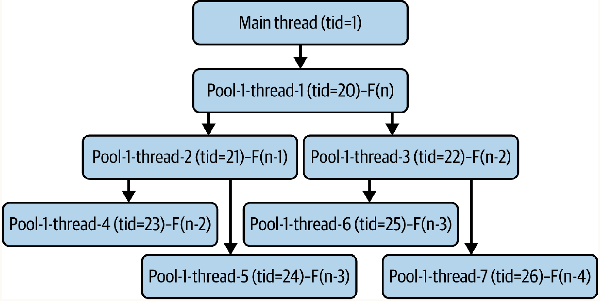
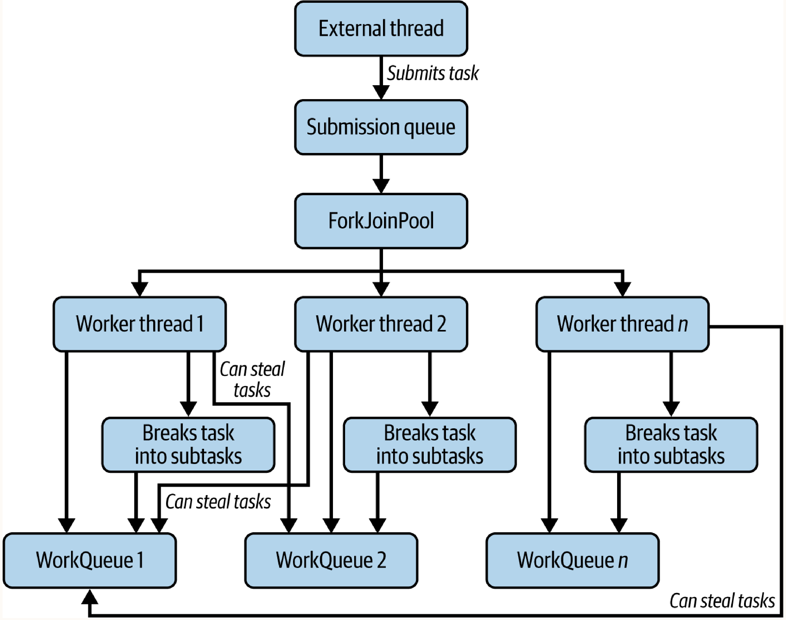
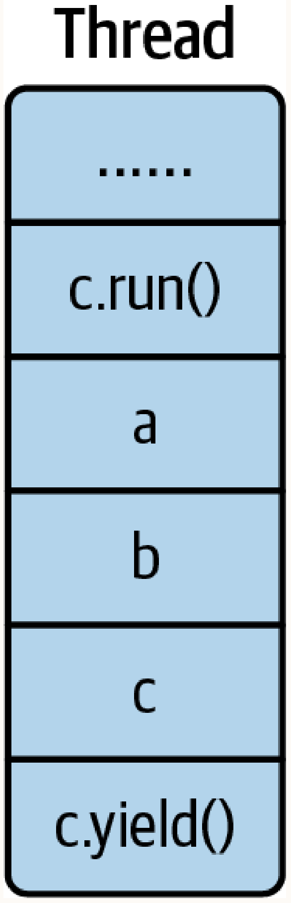
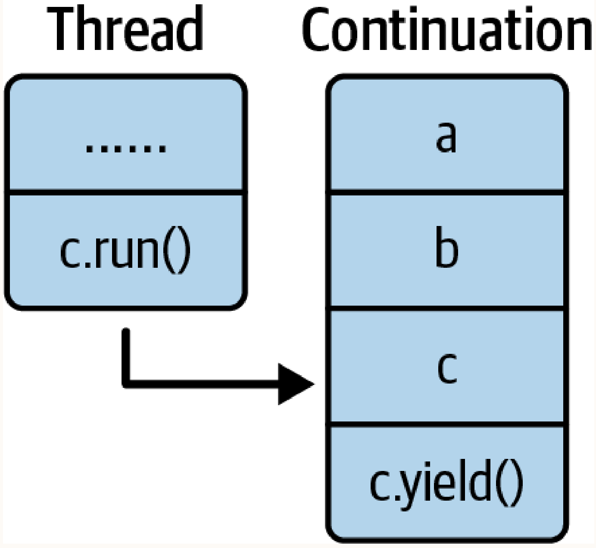
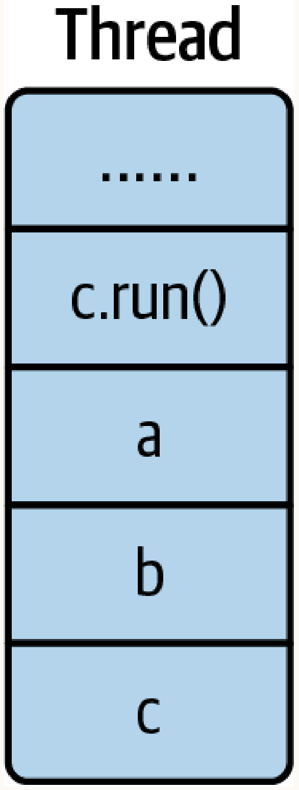
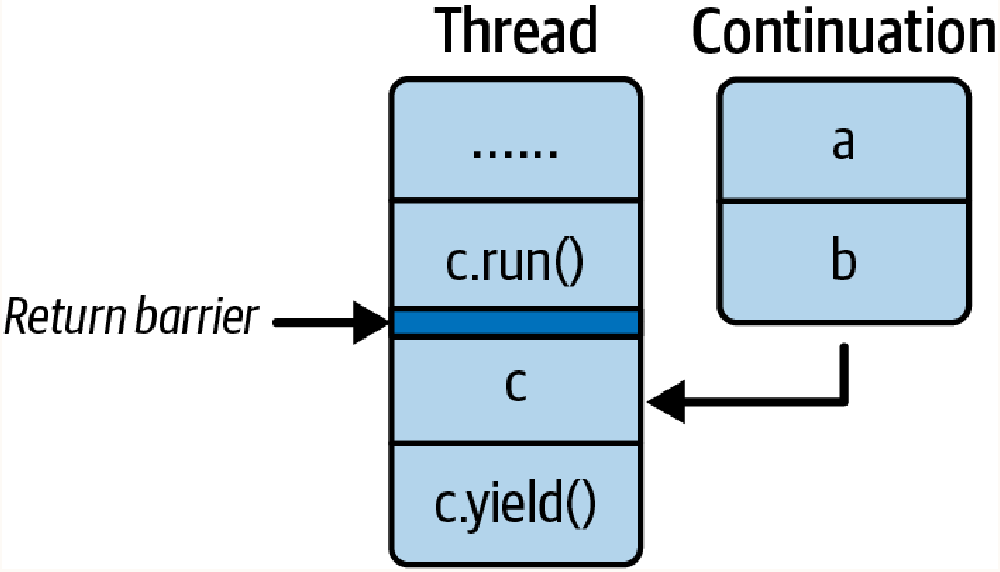
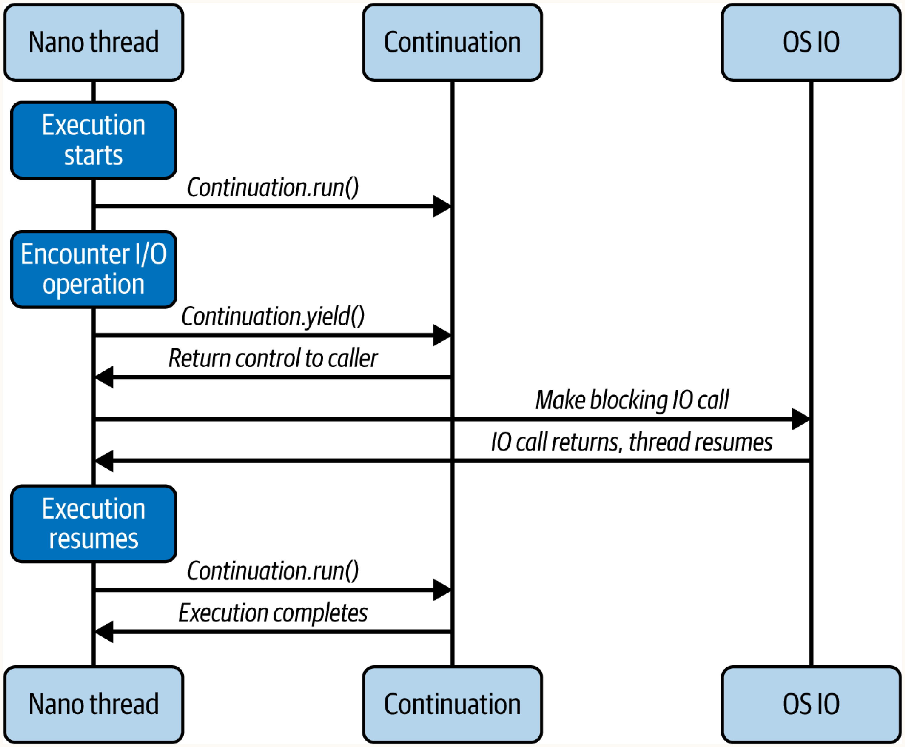

# Chapter 3: The Mechanics of Modern Concurrency in Java

Knowing how to use virtual threads is important, but understanding how they work under the hood is essential for diagnosing issues. We must understand two core concepts:
1. **ForkJoinPool**: The scheduler that physically executes virtual threads.
2. **Continuation**: The low-level mechanism that allows virtual threads to pause their execution and resume later.

Before diving into these concepts, we must first deeply understand traditional thread pools.

## Thread Pools: The Old Way

In the previous chapters, we saw that spinning up an ad-hoc physical platform thread per request was dangerous because we would rapidly hit OS limits and crash the application. 

A **thread pool** solves this by:
1. Creating a fixed number of threads at application startup.
2. Maintaining a queue of submitted tasks.
3. Having the threads constantly pull tasks from the queue and execute them.
4. **Rate Limiting:** Naturally preventing resource exhaustion by acting as a hard upper bound on concurrency.

### Building a Simple Thread Pool from Scratch

To understand the internal mechanics, here is a simplified version of a thread pool:

```java
import java.util.concurrent.BlockingQueue;
import java.util.concurrent.LinkedBlockingDeque;

public class SimpleThreadPool implements AutoCloseable {
    private final BlockingQueue<Runnable> queue;
    private final ThreadGroup threadGroup;
    private volatile boolean running = true;

    public SimpleThreadPool(int poolSize, int queueSize) {
        Worker[] threads = new Worker[poolSize];
        this.queue = new LinkedBlockingDeque<>(queueSize);
        this.threadGroup = new ThreadGroup("SimpleThreadPool");
        
        for (int i = 0; i < poolSize; i++) {
            threads[i] = new Worker(threadGroup, "Worker-" + i);
            threads[i].start(); // Start pulling from the queue immediately
        }
    }

    public void submit(Runnable task) {
        try {
            queue.put(task); // Blocks if the queue is full (natural backpressure)
        } catch (InterruptedException e) {
            Thread.currentThread().interrupt();
        }
    }

    public void shutdown() {
        this.running = false;
        threadGroup.interrupt();
    }

    @Override
    public void close() {
        while (!queue.isEmpty()) {
            try { Thread.sleep(100); } catch (InterruptedException e) {
                Thread.currentThread().interrupt();
                return;
            }
        }
        shutdown();
    }

    class Worker extends Thread {
        public Worker(ThreadGroup threadGroup, String name) {
            super(threadGroup, name);
        }

        @Override
        public void run() {
            while (running) {
                try {
                    Runnable task = queue.take(); // Blocks if queue is empty
                    task.run();
                } catch (InterruptedException e) {
                    Thread.currentThread().interrupt();
                }
            }
        }
    }
}
```

And here is how it is consumed:

```java
package ca.bazlur.modern.concurrency.c03;

public class SimpleThreadPoolDemo {
    public static void main(String[] args) throws InterruptedException {
        try (var threadPool = new SimpleThreadPool(4, 100)) {
            for (int i = 0; i < 100; i++) {
                int finalI = i;
                threadPool.submit(() -> runTask(finalI));
            }
        }
    }

    private static void runTask(int id) {
        System.out.printf("Task %d on %s%n", id, Thread.currentThread().getName());
        try { Thread.sleep(100); } catch (InterruptedException e) {
            Thread.currentThread().interrupt();
        }
    }
}
```

This demonstrates the core of all thread pools: a blocking queue of tasks (`LinkedBlockingDeque`) and a `while(running)` loop inside a `Worker` thread that constantly pulls and executes those tasks. 

### The Executor Framework

In the real world, we do not write thread pools from scratch. We use the `ExecutorService` interface and its robust factory, `Executors`.

For example:
```java
ExecutorService service = Executors.newFixedThreadPool(10);
```

Under the hood, almost all methods in the `Executors` factory simply instantiate and configure the highly customizable `ThreadPoolExecutor` class:

```java
public ThreadPoolExecutor(
    int corePoolSize,
    int maximumPoolSize,
    long keepAliveTime,
    TimeUnit unit,
    BlockingQueue<Runnable> workQueue,
    ThreadFactory threadFactory,
    RejectedExecutionHandler handler) {}
```

By tweaking parameters like `corePoolSize` (the minimum number of idle threads) and `maximumPoolSize` (the absolute max threads to spin up under heavy load), the factory generates everything from fixed pools to highly elastic cached pools.

### Available Thread Pools in the JDK

The `Executors` factory provides several pre-configured thread pools for different use cases:

#### 1. `FixedThreadPool`
Creates a pool with a hard-coded, fixed number of threads. If all threads are busy, new tasks queue up until one becomes available.
```java
try (ExecutorService fixedPool = Executors.newFixedThreadPool(4)) {
    for (int i = 0; i < 10; i++) {
        fixedPool.submit(() -> {
            System.out.println(Thread.currentThread().getName() + " is executing a task");
        });
    }
}
```
**When to use:** Best for server applications where you need to maintain a predictable concurrency level to prevent overwhelming resources (e.g., database connections). If the workload is CPU-bound, the thread count should ideally match the number of available CPU cores.

#### 2. `CachedThreadPool`
Dynamically creates new threads when needed and reuses previously created threads if they are idle. If a thread sits idle for 60 seconds, it is terminated and removed from the cache.
```java
try (ExecutorService cachedPool = Executors.newCachedThreadPool()) {
    for (int i = 0; i < 10; i++) {
        cachedPool.submit(() -> {
            System.out.println(Thread.currentThread().getName() + " is executing a task");
        });
    }
}
```
**When to use:** Ideal when you have a massive number of very short-lived tasks, or when tasks arrive in unpredictable, sudden bursts. Never use this for long-running blocking tasks, as it could spawn an infinite number of threads and crash the system.

#### 3. `SingleThreadExecutor`
Ensures that tasks are executed strictly sequentially using exactly one worker thread.
```java
try (var singleThreadPool = Executors.newSingleThreadExecutor()) {
    for (int i = 0; i < 5; i++) {
        singleThreadPool.submit(() -> {
            System.out.println(Thread.currentThread().getName() + " is executing a task");
        });
    }
}
```
**When to use:** Crucial when tasks must run in a strict sequence, or when dealing with a fragile shared resource that cannot be accessed concurrently (preventing race conditions without explicit locking).

#### 4. `ScheduledThreadPoolExecutor`
Specifically designed to schedule tasks to run after a certain delay or at fixed, recurring intervals.
```java
try (ScheduledExecutorService scheduledPool = Executors.newScheduledThreadPool(2)) {
    scheduledPool.scheduleAtFixedRate(() -> {
        System.out.println(Thread.currentThread().getName() + " is running a scheduled task");
    }, 0, 5, TimeUnit.SECONDS);
}
```
**When to use:** Ideal for background maintenance, periodic health checks, cache invalidation loops, or sending out batched notifications.

#### 5. `WorkStealingPool`
Creates a pool of threads that dynamically balances the workload between threads using a "work-stealing" algorithm. This type of pool optimizes the usage of available processors and is built internally using the `ForkJoinPool`.
```java
try (ExecutorService workStealingPool = Executors.newWorkStealingPool()) {
    for (int i = 0; i < 10; i++) {
        workStealingPool.submit(() -> {
            System.out.println(Thread.currentThread().getName() + " is executing a task");
        });
    }
}
```
**When to use:** Perfect for divide-and-conquer recursive algorithms, or when you have a high number of small, independent tasks and want to completely maximize CPU core utilization.

---

### Callable and Future: Handling Task Results

So far, we have only submitted tasks using the `Runnable` interface. Because its single method (`run()`) is `void`, no result is returned. But what if we need to get a result after a concurrent task is completed? This is where `Callable` and `Future` come in.

#### `Callable`
The `Callable` interface is a functional interface very similar to `Runnable`, except it can return a generic result and throw checked exceptions:

```java
public interface Callable<V> {
    V call() throws Exception;
}
```

Since it is a functional interface, we can submit it to an Executor using a lambda expression:
```java
Future<Long> fibonacciNumber = threadPool.submit(() -> fibonacci(50));
```

#### `Future`
Notice that the thread pool does not return the result directly; it returns the result wrapped inside a `Future` object.

```java
public interface Future<V> {
    boolean cancel(boolean mayInterruptIfRunning);
    boolean isCancelled();
    boolean isDone();
    V get() throws InterruptedException, ExecutionException;
    V get(long timeout, TimeUnit unit) throws InterruptedException, ExecutionException, TimeoutException;
}
```

When you submit a `Callable` task, the thread pool immediately returns a `Future` even if the task hasn't even started yet. You use the `isDone()` method to check if the task is complete, and the `get()` method to retrieve the final result.

> [!WARNING]
> The `get()` method is a **blocking operation**. It will block the calling thread completely until the result is available.

Here is an example executing multiple tasks in parallel and waiting for their results:

```java
public static void main(String[] args) {
    List<Future<Long>> futures = new ArrayList<>();
    List<Integer> fibonacciIndices = List.of(10, 20, 30, 40, 50);

    try (ExecutorService threadPool = Executors.newCachedThreadPool()) {
        // Submit all tasks to be executed in parallel
        for (int index : fibonacciIndices) {
            futures.add(threadPool.submit(() -> fibonacci(index)));
        }

        // Wait for and print the results
        for (Future<Long> future : futures) {
            System.out.println("Fibonacci number: " + future.get()); // Blocks until this specific task finishes
        }
    } catch (ExecutionException | InterruptedException e) {
        throw new RuntimeException(e);
    }
}
```
In this example, all tasks execute simultaneously. While the main thread halts entirely inside the `future.get()` loop waiting for results, the worker threads inside the pool continue to churn through the computations concurrently.

---

### The `ForkJoinPool`

Since Java 7, the JDK has included a highly specialized thread pool: the `ForkJoinPool`. While it implements the same `ExecutorService` interface as a traditional `ThreadPoolExecutor`, its internal architecture is vastly different. It is engineered specifically for divide-and-conquer workloads and serves as the underlying scheduler that powers **Virtual Threads**.

#### The Problem with Traditional Pools on Recursive Tasks
Traditional thread pools do not understand task dependencies. If a thread is executing a task that must wait for a subtask to complete, the thread simply blocks. 

Imagine trying to calculate the 20th Fibonacci number recursively using a traditional `FixedThreadPool` of 100 threads:
```java
// Anti-pattern: Recursive tasks on a traditional ThreadPoolExecutor
private static long getFibonacci(int i, ExecutorService pool) {
    if (i <= 1) return i;
    
    // Submits subtasks and immediately blocks waiting for them to finish
    Future<Long> f1 = pool.submit(() -> getFibonacci(i - 1, pool));
    Future<Long> f2 = pool.submit(() -> getFibonacci(i - 2, pool));
    
    try {
        return f1.get() + f2.get(); // BLOCKS the thread!
    } catch (Exception e) { throw new RuntimeException(e); }
}
```
If you run this, your application will violently **deadlock**. The parent task halts its thread to wait for `f1` and `f2`. Those child tasks spawn their own tasks and halt their own threads. Very quickly, all 100 threads in the pool are blocked waiting for subtasks that are stuck in the queue because there are no available threads left to execute them!



#### The `ForkJoinPool` Solution
The `ForkJoinPool` avoids this by allowing tasks to recursively decompose without holding threads hostage.

```java
static class FibonacciTask extends RecursiveTask<Long> {
    private final int n;
    public FibonacciTask(int n) { this.n = n; }

    @Override
    protected Long compute() {
        if (n <= 1) return (long) n;
        
        FibonacciTask f1 = new FibonacciTask(n - 1);
        f1.fork(); // Asynchronously submits to the pool
        
        FibonacciTask f2 = new FibonacciTask(n - 2);
        
        // compute() executes f2 directly on the CURRENT thread (avoiding thread consumption)
        // join() waits for f1. If f1 isn't complete, the thread steals OTHER work instead of blocking!
        return f2.compute() + f1.join(); 
    }
}

public static void main(String[] args) {
    try (var pool = new ForkJoinPool()) {
        Long result = pool.invoke(new FibonacciTask(20));
        System.out.println("Fibonacci number is: " + result);
    }
}
```
If a `RecursiveTask` must wait on a child task via `join()`, the underlying thread *does not block*. Instead, it suspends the parent task and executes other pending tasks from the queue until the child task completes.

#### The Work-Stealing Algorithm
In a traditional `ThreadPoolExecutor`, all threads compete to pull tasks from a single, centralized queue. Under heavy load, this shared queue becomes a massive point of lock contention.

The `ForkJoinPool` eliminates this contention entirely using a **Work-Stealing Algorithm**:



1. **Local Deques:** Every single worker thread is given its own private, double-ended queue (Deque). When a worker thread spawns a subtask, it places the subtask directly into its *own* queue.
2. **LIFO Processing:** The worker thread processes its own queue in **Last-In, First-Out (LIFO)** order (like a stack). It pops the newest tasks from the top of its queue. This maximizes CPU cache hits because the most recently created data is already hot in the CPU cache.
3. **Work-Stealing (FIFO):** If a worker thread empties its own queue, it does not sit idle. It becomes a "stealer" and looks at the queues of *other* worker threads. To minimize contention with the queue's owner (who is pulling from the top), the stealer thread steals tasks from the **bottom (FIFO)** of the victim's queue using ultra-fast atomic Compare-And-Swap (CAS) operations.

#### Implementing Lock-Free Queues with Compare-and-Set (CAS)
How exactly does the `ForkJoinPool` safely allow stealer threads to pull from another thread's queue without using slow, blocking `synchronized` locks? It uses **Compare-and-Set (CAS)** operations.

A CAS operation atomically compares the current value of a variable to an "expected" value. If they match, it swaps it to the "new" value. If another thread modified the variable in the meantime, the CAS operation simply fails, returning `false`, and the thread retries the loop.

Here is an example of an atomic counter using CAS and Java's ultra-fast `VarHandle` (this is the exact underlying strategy used by the `ForkJoinPool` queues):

```java
import java.lang.invoke.MethodHandles;
import java.lang.invoke.VarHandle;

public class AtomicCounter {
    private volatile int counter = 0;
    private static final VarHandle COUNTER_HANDLE;

    static {
        try {
            COUNTER_HANDLE = MethodHandles.lookup().findVarHandle(
                AtomicCounter.class, "counter", int.class);
        } catch (ReflectiveOperationException e) {
            throw new Error(e);
        }
    }

    public void increment() {
        int current;
        int next;
        do {
            current = counter;
            next = current + 1;
        } while (!COUNTER_HANDLE.compareAndSet(this, current, next)); // Lock-free retry loop!
    }

    public int get() {
        return counter;
    }

    public static void main(String[] args) throws InterruptedException {
        AtomicCounter atomicCounter = new AtomicCounter();
        Thread.ofPlatform().start(() -> {
            for (int i = 0; i < 100; i++) {
                atomicCounter.increment();
            }
        });
        Thread.ofPlatform().start(() -> {
            for (int i = 0; i < 100; i++) {
                atomicCounter.increment();
            }
        });
        
        Thread.sleep(100);
        System.out.println("Final Counter Value: " + atomicCounter.get());
    }
}
```
This entirely non-blocking mechanism reduces overhead and keeps threads productive rather than waiting, which is critical when juggling millions of virtual threads.

#### `asyncMode` (FIFO)
By default, the `ForkJoinPool` processes tasks in a **LIFO** order (stack-based) because it was originally designed for recursive, divide-and-conquer algorithms.

However, the JVM creators realized this highly-efficient, lock-free architecture was perfect for event-style tasks (like handling HTTP requests or virtual threads) which do not require joining results together recursively. 

When you instantiate a `ForkJoinPool` in **async mode**, it flips the queue logic from LIFO to **FIFO**. This ensures tasks are processed in the order they are submitted:

```java
import java.util.concurrent.ForkJoinPool;

public class AsyncModeExample {
    public static void main(String[] args) {
        // The 'true' flag at the end enables asyncMode (FIFO processing)
        try (ForkJoinPool forkJoinPool = new ForkJoinPool(4,
                ForkJoinPool.defaultForkJoinWorkerThreadFactory, null, true)) {
            
            for (int i = 0; i < 10; i++) {
                forkJoinPool.submit(new EventTask("Event " + i));
            }
        }
    }

    record EventTask(String eventName) implements Runnable {
        public void run() {
            System.out.println("Processing " + eventName 
                + " in thread: " + Thread.currentThread().getName());
            
            try {
                Thread.sleep(1000);
            } catch (InterruptedException e) {
                Thread.currentThread().interrupt();
            }
            
            System.out.println("Completed " + eventName 
                + " in thread: " + Thread.currentThread().getName());
        }
    }
}
```

(Note: You can also use the pre-configured `Executors.newWorkStealingPool()`, which defaults to async mode internally).

**The bottom line:** When the JVM mounts and unmounts millions of virtual threads, it is physically doing so by placing them as tasks into an `asyncMode=true` `ForkJoinPool`. This pool acts as the underlying scheduler.

---

### Continuation: Pausing and Resuming Execution

The `ForkJoinPool` explains how virtual threads are *scheduled*, but it does not explain how they physically *pause* during blocking I/O. That is the job of **Continuations**. 

A continuation is the low-level ability of a program to take a snapshot of its current execution state, pause execution in the middle of a method, and resume exactly where it left off later.

As of Java 21, continuations are fully baked into the JVM through an internal API (`jdk.internal.vm.Continuation`). 

> [!WARNING]
> This API is highly internal. Do not use it in production code! It requires the `--add-exports java.base/jdk.internal.vm=ALL-UNNAMED` JVM flag to compile. It is explored here purely to understand how Virtual Threads work.

```java
import jdk.internal.vm.Continuation;
import jdk.internal.vm.ContinuationScope;

public class ContinuationExample {
    public static void main(String[] args) {
        ContinuationScope scope = new ContinuationScope("main");
        
        Continuation continuation = new Continuation(scope, () -> {
            System.out.println("Hello from continuation");
            Continuation.yield(scope); // PAUSE
            
            System.out.println("Hello again from continuation");
            Continuation.yield(scope); // PAUSE
            
            System.out.println("Done from continuation");
        });

        System.out.println("Before starting continuation");
        continuation.run(); // Runs until first yield
        
        System.out.println("After starting continuation");
        continuation.run(); // Resumes from first yield until second yield
        
        System.out.println("After starting continuation again");
        continuation.run(); // Resumes from second yield to finish
    }
}
```

The output of this code demonstrates control flow jumping back and forth flawlessly:
```text
Before starting continuation
Hello from continuation
After starting continuation
Hello again from continuation
After starting continuation again
Done from continuation
```

When a Virtual Thread executes a blocking I/O operation under the hood, the JVM intercepts it and calls `Continuation.yield()`. This immediately pauses the virtual thread and completely unmounts it from the platform carrier thread, allowing the carrier thread to process other virtual threads from the `ForkJoinPool`. Once the I/O returns, the virtual thread is rescheduled, and `continuation.run()` resumes the logic natively.

#### Stack Management and Lazy Copying
When a platform thread runs standard code, its stack grows downwards as methods are invoked.



When `Continuation.yield()` is invoked, the execution halts. However, the thread needs to be freed up for other work. Therefore, the JVM physically unmounts the stack frames and copies them off the platform thread and onto the heap inside the `Continuation` object.



Later, when the virtual thread is scheduled to resume on an available carrier thread, the exact opposite happens. The frames are mounted back onto the platform thread's stack, and execution resumes.



**Return Barriers (Lazy Copying)**
Deeply copying the entire stack to and from the heap on every single I/O pause would be incredibly expensive for deep call stacks. To combat this, the JVM uses an optimization technique called **Lazy Copying**.

Instead of copying the entire stack on every unmount, the JVM injects **Return Barriers**. When a continuation is resumed, it might only copy back the topmost 1-2 frames needed to immediately resume execution, rather than the entire deep stack. When the method attempts to return down the stack, the return barrier intercepts it and pulls the next required frame from the heap just-in-time. 



---

### Building Our Own Virtual Threads from Scratch
To fully cement how the JVM uses `Continuation`s and `ForkJoinPool`s together to run Virtual Threads, we can actually build our own primitive Virtual Thread implementation from scratch using standard Java.

We'll call our abstraction `NanoThread`.

#### 1. The `NanoThread` Class
This class wraps a standard `Runnable` inside a `Continuation`. When `run()` is invoked, it delegates directly to the continuation. If the underlying code yields, the `NanoThread` pauses.

```java
import jdk.internal.vm.Continuation;
import jdk.internal.vm.ContinuationScope;
import java.util.concurrent.atomic.AtomicInteger;

public class NanoThread {
    public static final NanoThreadScheduler NANO_THREAD_SCHEDULER = new NanoThreadScheduler();
    private static final AtomicInteger COUNTER = new AtomicInteger(1);
    public static final ContinuationScope SCOPE = new ContinuationScope("nanoThreadScope");
    
    private final Continuation continuation;
    private final int nid;

    private NanoThread(Runnable runnable) {
        this.nid = COUNTER.getAndIncrement();
        this.continuation = new Continuation(SCOPE, runnable);
    }

    public static void start(Runnable runnable) {
        var nanoThread = new NanoThread(runnable);
        NANO_THREAD_SCHEDULER.schedule(nanoThread);
    }

    public void run() {
        continuation.run();
    }

    public static NanoThread currentVThread() {
        return NanoThreadScheduler.CURRENT_NANO_THREAD.get();
    }

    @Override
    public String toString() {
        return "NanoThread-" + nid + "-" + Thread.currentThread().getName();
    }
}
```

#### 2. The `NanoThreadScheduler`
The scheduler uses a simple two-thread `WorkStealingPool` (which, as we know, is an asyncMode `ForkJoinPool`) as its underlying carrier threads.

```java
import java.util.concurrent.ExecutorService;
import java.util.concurrent.Executors;
import java.util.concurrent.ScheduledExecutorService;

public class NanoThreadScheduler {
    public static final ThreadLocal<NanoThread> CURRENT_NANO_THREAD = new ThreadLocal<>();
    
    // Simulates the OS network poller that unparks threads after I/O
    public static final ScheduledExecutorService IO_EVENT_SCHEDULER = 
        Executors.newSingleThreadScheduledExecutor();
        
    private final ExecutorService workStealingPool = Executors.newWorkStealingPool(2);

    public void schedule(NanoThread nanoThread) {
        workStealingPool.submit(() -> {
            CURRENT_NANO_THREAD.set(nanoThread);
            nanoThread.run();
            CURRENT_NANO_THREAD.remove();
        });
    }
}
```

#### 3. Simulating I/O
When our `NanoThread` hits a blocking I/O operation (like a file transfer), it schedules itself to be resumed later and immediately yields its continuation. 

```java
import java.util.Random;
import java.util.concurrent.TimeUnit;
import jdk.internal.vm.Continuation;

public class FileOperation {
    private final Random random = new Random();

    public void transfer(String filePath) {
        System.out.println("Start transferring file: " + filePath);
        NanoThread nanoThread = NanoThread.currentVThread();
        
        // 1. Tell the simulated OS to wake us up when I/O is done
        NanoThreadScheduler.IO_EVENT_SCHEDULER.schedule(
            () -> NanoThread.NANO_THREAD_SCHEDULER.schedule(nanoThread),
            random.nextInt(1000), TimeUnit.MILLISECONDS
        );
        
        // 2. Clear the current thread mapping
        NanoThreadScheduler.CURRENT_NANO_THREAD.remove();
        
        // 3. YIELD! Unmount from the carrier thread!
        Continuation.yield(NanoThread.SCOPE);
        
        // 4. (We resume here later)
        System.out.println("Transfer completed for file: " + filePath);
    }
}
```

#### 4. The Demo
If we run this concurrently for multiple files, we witness the magic of carrier-thread hopping:

```java
public class NanoThreadDemo {
    public static void main(String[] args) throws Exception {
        FileOperation fileOperation = new FileOperation();
        
        for (int i = 0; i < 4; i++) {
            int finalI = i;
            NanoThread.start(() -> {
                System.out.println("Transfer File_" + finalI + " Running in " + NanoThread.currentVThread());
                fileOperation.transfer("File_" + finalI);
                System.out.println("Transfer File_" + finalI + " Completed in " + NanoThread.currentVThread());
            });
        }
        
        Thread.sleep(Duration.ofMinutes(1)); // Wait for scheduler to finish
    }
}
```

**Output:**
```text
Transfer File_1 Running in NanoThread-2-ForkJoinPool-1-worker-2
Transfer File_0 Running in NanoThread-1-ForkJoinPool-1-worker-1
Start transferring file: File_1
Start transferring file: File_0
Transfer File_2 Running in NanoThread-3-ForkJoinPool-1-worker-2
Start transferring file: File_2
Transfer File_3 Running in NanoThread-4-ForkJoinPool-1-worker-2
Start transferring file: File_3
Transfer completed for file: File_3
Transfer File_3 Completed in NanoThread-4-ForkJoinPool-1-worker-1
Transfer completed for file: File_0
Transfer File_0 Completed in NanoThread-1-ForkJoinPool-1-worker-1
Transfer completed for file: File_1
Transfer File_1 Completed in NanoThread-2-ForkJoinPool-1-worker-1
Transfer completed for file: File_2
Transfer File_2 Completed in NanoThread-3-ForkJoinPool-1-worker-1
```

Look closely at the output for `File_1`. 
- It started execution on carrier thread `worker-2`.
- It encountered blocking I/O and yielded its continuation.
- When the I/O completed, it was scheduled back to the pool, but resumed execution on a completely different carrier thread: `worker-1`! 



---

### Virtual Threads and OS I/O Polling
Our `NanoThread` simulation explicitly used a `ScheduledExecutorService` to simulate the delay of I/O operations and wake the thread back up. But how does the actual JVM know when an I/O operation is complete to unpark the Virtual Thread?

When a Virtual Thread triggers a blocking I/O operation, the native code calls `LockSupport.park()`, which subsequently triggers `VirtualThreads.park()` and `yieldContinuation()`. 

To wake it back up, the JVM relies on the **OS-level Event Poller** (`epoll` on Linux, `kqueue` on macOS, `wepoll` on Windows). 
- When the Virtual Thread hits blocking I/O, the JVM registers the file descriptor (e.g., a network socket) with the OS event poller, mapping it to the specific Virtual Thread. 
- The JVM-wide read/write pollers monitor these sockets asynchronously.
- When the OS notifies the poller that data has finally arrived on the socket, the JVM looks up the Virtual Thread mapped to that socket and unparks it, allowing it to resume execution natively.

This is why nearly all blocking points across the entire JDK standard library had to be rewritten leading up to Java 21 to support Virtual Threads. They must now explicitly decouple OS-level thread blocking from Java-level Virtual Thread yielding!
