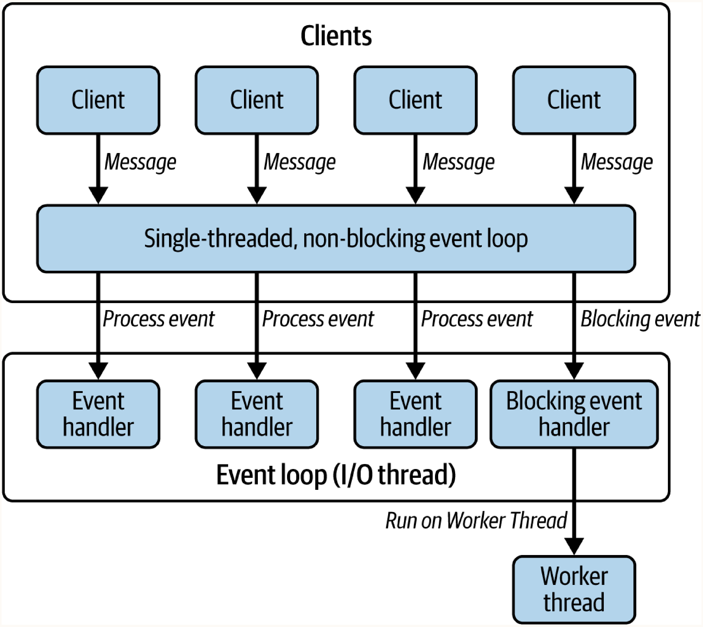
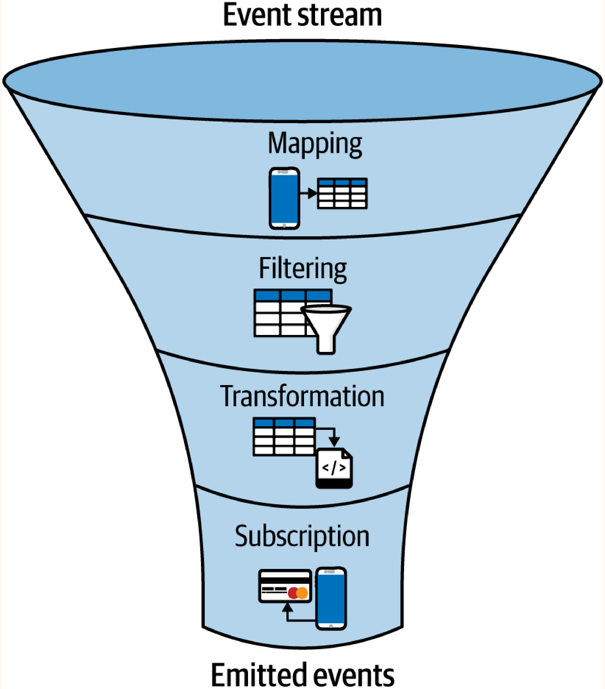

# Chapter 6: The Relevance of Reactive Java in Light of Virtual Threads

*I think Loom is going to kill reactive programming.... Reactive programming was a transitional technology.*
—Brian Goetz

While virtual threads are a great innovation that allows developers to write highly concurrent applications using the familiar imperative programming model, they are not the only solution for handling concurrency and blocking I/O. Before virtual threads, developers turned to **Reactive Programming**—a paradigm that is event-driven, functional, and inherently asynchronous.

## Understanding Reactive Programming in Java

Reactive programming is a declarative paradigm centered on asynchronous data streams and the automatic propagation of change. Instead of focusing on step-by-step instructions (how), developers define the relationships between streams and how they transform data (what).

In the Java ecosystem, reactive programming is usually associated with non-blocking, asynchronous operations and event-driven architectures.

### Reactive Systems at a Glance
In 2013, the *Reactive Manifesto* emerged to standardize the meaning of reactive systems. It identifies four key principles:
1. **Responsive**: Consistently deliver rapid response times.
2. **Resilient**: Maintain responsiveness despite failures through isolation and delegation.
3. **Elastic**: Dynamically adapt to varying workloads by scaling resources up or down.
4. **Message-Driven**: Use asynchronous messaging for loose coupling and isolation.

In technical implementation, this comes down to three aspects: non-blocking, event-driven, and asynchronous.

---

## Blocking Versus Non-blocking I/O

When a **blocking I/O** operation occurs, the caller thread waits (blocks) until the operation completes, remaining idle until it gets the data.
In **non-blocking I/O**, threads are not held up. The operating system handles the I/O, and the application simply provides a callback function that the OS invokes when the data is ready. The thread is free to execute other tasks in the background.

To illustrate, consider an HTTP server that must handle request pipelining (processing multiple requests without waiting for responses) and hundreds of concurrent connections.

### The Blocking HTTP Server
A simple single-threaded blocking server processes requests sequentially:

```java
public class BlockingHttpServer {
    private static final int PORT = 8080;
    
    public static void main(String[] args) throws IOException {
        try (ServerSocket serverSocket = new ServerSocket(PORT)) {
            serverSocket.setReuseAddress(true);
            while (true) {
                // Blocks until a client connects
                Socket clientSocket = serverSocket.accept(); 
                handleConnection(clientSocket);
            }
        }
    }

    private static void handleConnection(Socket socket) {
        try (socket;
             BufferedReader in = new BufferedReader(new InputStreamReader(socket.getInputStream()));
             PrintWriter out = new PrintWriter(socket.getOutputStream(), true)) {
             
            // Blocks until a complete HTTP request arrives
            HttpRequest request = parseRequest(in); 
            
            // Simulating variable processing times
            if (request.path.startsWith("/slow")) {
                Thread.sleep(30000); // A slow request blocks the ENTIRE SERVER for 30 seconds
            } else {
                Thread.sleep(100); 
            }
            sendResponse(out, request);
        } catch (Exception e) { ... }
    }
}
```
**Limitation**: If one client sends a slow request, the single thread is blocked. No other clients can connect or be served during that time.

### The Multithreaded Blocking Server
The classic solution is to spawn a new thread for each connection using a thread pool:

```java
ExecutorService connectionExecutor = Executors.newFixedThreadPool(10);

while (true) {
    Socket clientSocket = serverSocket.accept();
    // Handle each connection in a separate thread
    connectionExecutor.submit(() -> handleConnection(clientSocket));
}
```
**Limitation**: Platform threads are expensive. A thread pool of 10 allows 10 concurrent clients. Increasing this to thousands was unfeasible before Virtual Threads due to high memory overhead.

With virtual threads, this scales instantly:
```java
ExecutorService executor = Executors.newVirtualThreadPerTaskExecutor();
```

However, before virtual threads existed, how did we achieve high concurrency? The answer was Java NIO.

---

## Java I/O versus NIO: A Quick Comparison

Java offers two distinct approaches to handling I/O: the traditional `java.io` package and the more modern `java.nio` (new input/output).

The key difference lies in their approach:
- **`java.io`**: Stream-based and generally blocking. A thread must wait for operations to complete. Data is read byte by byte.
- **`java.nio`**: Buffer-based and non-blocking. Allows greater scalability for handling large data transfers and high-performance applications.

For instance, consider reading a file using Java I/O:
```java
try (BufferedReader reader = new BufferedReader(new FileReader("input.txt"))) {
    String line;
    while ((line = reader.readLine()) != null) {
        System.out.println(line);
    }
} catch (IOException e) {
    e.printStackTrace();
}
```
`BufferedReader` reads text from an input stream, line by line, making it efficient and easy to use for sequential file reading.

Now, contrast that with Java NIO's `FileChannel`:
```java
try (FileChannel channel = FileChannel.open(
        Path.of("input.txt"), 
        StandardOpenOption.READ)) {
        
    ByteBuffer buffer = ByteBuffer.allocate(1024);
    while (channel.read(buffer) > 0) {
        buffer.flip();
        while (buffer.hasRemaining()) {
            System.out.print((char) buffer.get());
        }
        buffer.clear();
    }
} catch (IOException e) {
    e.printStackTrace();
}
```
This version is **buffer-driven**, meaning data is first loaded into a `ByteBuffer`, manipulated in memory, and only then processed. Instead of relying on `InputStream` and `OutputStream`, NIO uses buffers. A buffer acts as a temporary storage area, holding a fixed amount of data before it's sent to its destination. This shift in design provides greater flexibility and efficiency.

> [!TIP]
> **Zero-copy mechanisms and Memory Spaces**: One of the key efficiency boosters in NIO is that `ByteBuffer` can work with **direct buffers** (off-heap memory) and memory-mapped files. To understand why this is faster, we must understand how operating systems manage memory:
> 
> - **Kernel Space**: The protected core of the operating system. It has complete access to all hardware, including network cards and hard drives. When a Java program wants to read a file or send data over a network, it must ask the OS to do it on its behalf. The OS reads the hardware data directly into a buffer residing in Kernel Space.
> - **User Space**: The restricted memory area where your Java application runs (inside the JVM). User space programs cannot directly access hardware.
> 
> **The traditional `java.io` bottleneck**: When you use traditional streams, the OS reads data from the disk into a Kernel Space buffer. Then, the JVM must physically copy that data from the Kernel Space buffer into a Java array (a heap buffer) inside User Space. When writing to a socket, the JVM copies the data *back* into Kernel Space before the OS can send it. All this copying burns CPU cycles and memory bandwidth.
> 
> **The `java.nio` Direct Buffer solution**: A **Direct Buffer** is memory allocated outside the standard Java garbage-collected heap (off-heap memory), physically residing in Kernel Space or mapped directly to it. When using a Direct Buffer, the JVM avoids copying the data into User Space entirely. The OS can read from the disk directly into the Direct Buffer, and then send it straight to the network socket. This elimination of data duplication between Kernel and User space is known as **Zero-copy**, which drastically speeds up large file transfers and network communications.

### The Selector Event Loop

Another critical component in NIO is the `Selector`, which plays a vital role in managing multiple channels (like `ServerSocketChannel` and `SocketChannel`) with a single thread. Think of it as an intelligent traffic controller that listens for various I/O events and directs operations accordingly.

When a channel is registered with a selector, you specify interest in certain events:
- `OP_ACCEPT`: New client connection ready to be accepted.
- `OP_READ`: Data is available to be read from a channel.
- `OP_WRITE`: Channel is ready to accept outgoing data.
- `OP_CONNECT`: Successful connection attempt (client mode).

> [!NOTE]
> The underlying implementation of selectors is system-dependent. On macOS, `KQueueSelectorImpl` leverages the `kqueue` system call. A more general-purpose implementation, `PollSelectorImpl`, is based on the `poll` system call.

### The Non-blocking HTTP Server

Let's examine how these components work together in practice to build a high-concurrency, single-threaded web server:

```java
public class NonBlockingHttpServer {
    private static final int PORT = 8080;
    private static final AtomicInteger requestCounter = new AtomicInteger(0);
    private final ConcurrentLinkedQueue<PendingUpdate> pendingUpdates 
        = new ConcurrentLinkedQueue<>();

    public static void main(String[] args) {
        try {
            new NonBlockingHttpServer().start();
        } catch (IOException e) {
            System.err.println("Server failed to start: " + e.getMessage());
        }
    }

    private void start() throws IOException {
        try (Selector selector = Selector.open();
             ServerSocketChannel serverChannel = ServerSocketChannel.open()) {
             
            serverChannel.bind(new InetSocketAddress(PORT));
            // 1. Configure the server channel as non-blocking
            serverChannel.configureBlocking(false); 
            serverChannel.register(selector, SelectionKey.OP_ACCEPT);
            
            // Single-threaded event loop
            while (true) {
                // 2. Process pending updates from async threads to prevent race conditions
                processPendingUpdates(); 
                
                // 3. Blocks for up to 100ms. Ensures pending updates are processed promptly
                selector.select(100);
                
                Set<SelectionKey> selectedKeys = selector.selectedKeys();
                Iterator<SelectionKey> iterator = selectedKeys.iterator();
                
                while (iterator.hasNext()) {
                    SelectionKey key = iterator.next();
                    iterator.remove(); // Remove key to prevent reprocessing
                    
                    try {
                        if (key.isAcceptable()) {
                            handleAccept(key, selector); // Accept new connection
                        } else if (key.isReadable()) {
                            handleRead(key); // Non-blocking read
                        } else if (key.isWritable()) {
                            handleWrite(key); // Non-blocking write
                        }
                    } catch (IOException e) {
                        key.cancel();
                        if (key.channel() != null) key.channel().close();
                    }
                }
                // Process any pending requests
                processAllPendingRequests(selector);
            }
        }
    }
    
    // ... Handler methods (handleAccept, handleRead, handleWrite) ...
}
```

### Thread Safety and the Selector

A common misconception is that `SelectionKey` operations like `interestOps()` are safe for concurrent modification because the Java documentation states keys are "safe for use by multiple concurrent threads." This only means reading properties won't cause memory corruption; modifying them concurrently causes race conditions, missed I/O events, and `CancelledKeyException`s.

To solve this, modifying a `SelectionKey` from an asynchronous thread must be delegated back to the main event loop thread using a thread-safe queue (`ConcurrentLinkedQueue`):

```java
private void processPendingUpdates() {
    PendingUpdate update;
    while ((update = pendingUpdates.poll()) != null) {
        try {
            if (update.key.isValid()) {
                update.key.interestOps(update.key.interestOps() 
                    | SelectionKey.OP_WRITE);
            }
        } catch (Exception e) { ... }
    }
}
```

### Managing Client State

In a non-blocking server, a single thread jumps between thousands of clients. It must perfectly remember the state of every client. When `handleAccept()` fires, it attaches a `ClientState` object to the `SelectionKey`:

```java
private void handleAccept(SelectionKey key, Selector selector) throws IOException {
    ServerSocketChannel serverChannel = (ServerSocketChannel) key.channel();
    // Non-blocking accept() returns immediately, potentially null
    SocketChannel clientChannel = serverChannel.accept(); 
    
    if (clientChannel != null) {
        clientChannel.configureBlocking(false);
        clientChannel.register(selector, SelectionKey.OP_READ, new ClientState());
    }
}

static class ClientState {
    ByteBuffer readBuffer = ByteBuffer.allocate(8192);
    StringBuilder requestBuilder = new StringBuilder();
    ConcurrentLinkedQueue<String> responseQueue = new ConcurrentLinkedQueue<>();
    Queue<HttpRequest> pendingRequests = new LinkedList<>();
    boolean keepAlive = true;
    boolean isProcessing = false;
}
```

When `OP_READ` fires, `handleRead` pulls data into the `ClientState`'s buffer. Once a complete HTTP request terminator (`\r\n\r\n`) is found, the request is parsed and executed asynchronously. 
When the async task finishes, it drops the response into the `responseQueue` and enqueues a `PendingUpdate` to turn on `OP_WRITE` for that socket. The main event loop picks it up, writes the data to the client channel gracefully, and turns `OP_WRITE` off when the queue empties.

---

## Event-Driven Architecture with Vert.x

Real-world applications require more than just handling raw sockets. Writing and maintaining the raw NIO state-machine code (with `Selector`, `SelectionKey`, `ByteBuffer`, etc.) is notoriously complex and error-prone. Fortunately, frameworks like **Eclipse Vert.x** and Netty have been built on top of the event-driven paradigm to abstract away this complexity.

At its core, Vert.x is built on a **multicore reactor pattern**, leveraging an event-loop concurrency model. 
- It uses a lightweight set of event loop threads that continuously listen for I/O events via non-blocking operations like NIO.
- Whenever an event occurs (such as an incoming HTTP request), a short, non-blocking callback is executed within the event loop, ensuring responsiveness.
- Instead of dealing with raw, non-blocking I/O directly, developers work with intuitive abstractions such as HTTP requests, responses, and Kafka messages.

> [!NOTE]
> **Worker Pools and Event Bus**
> Not all tasks can be handled in an event loop. Some operations are inherently blocking or long-running, such as database queries or file system access. Vert.x intelligently offloads them to a **separate worker thread pool** to prevent these tasks from slowing down the event loop. Furthermore, Vert.x utilizes an **event bus** to allow different components to communicate asynchronously, keeping the system loosely coupled.



Let's completely rewrite our server using Vert.x. The implementation looks like this:

```java
import io.vertx.core.AbstractVerticle;
import io.vertx.core.Promise;
import io.vertx.core.Vertx;
import io.vertx.core.json.JsonObject;
import io.vertx.ext.web.Router;
import io.vertx.ext.web.RoutingContext;
import java.util.concurrent.atomic.AtomicLong;

public class VertxHttpServer extends AbstractVerticle {
    private static final int PORT = 8080;
    // 1. Thread-safe counter, as multiple event loop threads might increment it
    private final AtomicLong requestCounter = new AtomicLong(0); 
    private long startTime;

    @Override
    public void start(Promise<Void> startPromise) {
        startTime = System.currentTimeMillis();
        // 2. Declarative routing mapping routes to handler methods
        Router router = Router.router(vertx); 
        router.get("/fast").handler(this::handleFastRequest);
        router.get("/slow").handler(this::handleSlowRequest);
        router.get("/stats").handler(this::handleStats);
        
        // 3. Server starts asynchronously without blocking the main thread
        vertx.createHttpServer()
            .requestHandler(router)
            .listen(PORT, "localhost"); 
    }

    private void handleFastRequest(RoutingContext ctx) {
        long requestId = requestCounter.incrementAndGet();
        // 4. Completes immediately on the event loop thread
        ctx.response()
            .putHeader("content-type", "text/plain")
            .end("Request #" + requestId + ": Fast request processed"); 
    }

    private void handleSlowRequest(RoutingContext ctx) {
        long requestId = requestCounter.incrementAndGet();
        // 5. The crucial difference: schedules response AFTER 2 seconds WITHOUT blocking
        vertx.setTimer(2000, id -> { 
            ctx.response()
                .putHeader("content-type", "text/plain")
                .end("Request #" + requestId + ": Slow request processed");
        });
    }

    private void handleStats(RoutingContext ctx) {
        long uptimeMillis = System.currentTimeMillis() - startTime;
        // 6. Endpoint to verify requests are truly running on the event loop
        JsonObject stats = new JsonObject()
            .put("totalRequests", requestCounter.get())
            .put("uptimeMillis", uptimeMillis)
            .put("currentThread", Thread.currentThread().getName())
            .put("isEventLoopThread", Vertx.currentContext().isEventLoopContext()); 
            
        ctx.response()
            .putHeader("content-type", "application/json")
            .end(stats.encodePrettily());
    }

    public static void main(String[] args) {
        Vertx vertx = Vertx.vertx();
        // 7. Starts the event-driven server with Vert.x managing event loops automatically
        vertx.deployVerticle(new VertxHttpServer()); 
    }
}
```

### The Golden Rule: Don't Block the Event Loop
The critical piece of event-driven architecture is that **handlers are executed on the event loop thread**. 
If your application code blocks this thread, no other concurrent events can be processed. The result is a complete breakdown in responsiveness and concurrency that would be catastrophic for a system designed to be highly reactive.

Notice how `handleSlowRequest` uses `vertx.setTimer()` instead of `Thread.sleep()`. This is crucial—the timer schedules a callback to run *after* two seconds, instantly freeing the event loop to handle other incoming requests in the meantime.

To use this paradigm safely, **your code must be entirely non-blocking**. This requires a major shift in mindset: instead of waiting for a task to complete sequentially, you must register callbacks, use promises, or leverage reactive streams to orchestrate execution without ever stalling the event loop.

---

## Asynchronous APIs

How do asynchronous APIs work without stalling the event loop? Let's compare synchronous vs asynchronous code.

### 1. Synchronous (Blocking)
```java
public String chat(String message) {
    return "Echo: " + message.toUpperCase(); // Caller must wait for return
}

String result = aiService.chat("What is the meaning of life?");
```

### 2. Callbacks (Asynchronous but Messy)
Instead of waiting for the result, we pass a `Consumer` callback function. The method returns immediately, and the callback is invoked later when the response is ready.

```java
public void chat(String message, Consumer<String> consumer) {
    Thread.startVirtualThread(() -> {
        try {
            String response = "Echo: " + message.toUpperCase();
            consumer.accept(response);
        } catch (Exception e) { ... }
    });
}

// Usage:
aiService.chat("Hello, how are you?", response -> {
    System.out.println("Response 1: " + response);
});
```

However, if we want to chain multiple asynchronous calls, callbacks quickly degrade into unmaintainable "Callback Hell":
```java
aiService.chat("What is the meaning of life?", response -> {
    aiService.chat(response, response2 -> {
        aiService.chat(response2, response3 -> {
            System.out.println(response3);
        });
    });
});
```

### 3. CompletableFuture (Structured Asynchrony)
Java provides `CompletableFuture` to chain asynchronous calls together in a clean, readable way:

```java
public CompletableFuture<String> chat(String message) {
    return CompletableFuture.supplyAsync(() -> "Echo: " + message.toUpperCase());
}

aiService.chat("What is the meaning of life?")
         .thenCompose(aiService::chat)
         .thenCompose(aiService::chat)
         .thenAccept(System.out::println);
```

While `CompletableFuture` brilliantly handles *single* asynchronous results, it does not handle **sequences of results**—a continuous flow of data. That's where Reactive Streams come in.

---

## Understanding Reactive Streams

Reactive programming in Java is a paradigm centered around asynchronous, non-blocking, and event-driven applications. A core concept is the **reactive stream**, a standard defined by the Reactive Streams Specification for managing asynchronous data flows with *backpressure*.

In this paradigm, we organize our code around streams, creating chains of transformations known as **pipelines**. Everything can be viewed as a stream of events flowing from producers to consumers through a series of transformations.

Events can be anything: user clicks, sensor readings, incoming messages, etc. They travel from an upstream source to a downstream Subscriber, passing through operators that transform or filter the data.



Each operator observes its upstream and produces a new stream. However, streams are lazy by default—they don't start processing until there's a Subscriber. We don't know *when* an event will arrive (asynchronous), so we set up "observers" to react when it does.

In reactive programming, we work with four fundamental components:
1. **Publisher**: The source that emits data items asynchronously. Think of it as a data producer that can emit zero or more items over time.
2. **Subscriber**: The consumer that receives and processes emitted items. Subscribers express interest in receiving data and define how it should be handled.
3. **Subscription**: The link between a Publisher and a Subscriber, managing the flow of data and enabling backpressure control.
4. **Processor**: A component that acts as both Subscriber and Publisher, transforming data as it flows through the stream.

A reactive stream can emit three types of signals:
- **Data items**: The actual values flowing through the stream.
- **Error signal**: Indicates that an unrecoverable error occurred, terminating the stream.
- **Completion signal**: Indicates successful stream completion with no more items to emit.

There are several reactive programming libraries in Java. The most notable ones include:
- **Project Reactor**: Provides the core types `Flux<T>` (0 to N items) and `Mono<T>` (0 to 1 items).
- **RxJava**: Provides `Observable<T>`, `Single<T>`, and `Maybe<T>`.

### Reactive Pipeline Examples

Let's explore reactive programming with Project Reactor through a simple pipeline:

```java
public class ReactiveExample {
    public static void main(String[] args) {
        // 1. Create a cold stream emitting integers 1 to 5 (won't emit until subscribed)
        Flux<Integer> numbers = Flux.just(1, 2, 3, 4, 5);
        
        // Process the stream: filter even numbers and convert to strings
        numbers
            .filter(n -> n % 2 == 0) // 2. Creates a new stream with matching elements
            .map(n -> "Value: " + n) // 3. Transforms each element
            .subscribe(              // 4. Triggers execution
                System.out::println,                             // onNext
                error -> System.err.println("Error: " + error),  // onError
                () -> System.out.println("Done!")                // onComplete
            );
    }
}
```

### Building a Crypto Price Monitor

To see the real power of reactive programming, imagine building a system that monitors cryptocurrency prices from multiple exchanges in real-time.

First, let's define our data model:
```java
public record PriceData(String exchange, String symbol, double price, Instant timestamp) {}
public record PriceAlert(String symbol, String message, AlertType type) {}
enum AlertType {THRESHOLD_CROSSED, RAPID_CHANGE, ANOMALY}
```

Here is a simple monitor for a single stream of prices:
```java
import reactor.core.publisher.Flux;
import java.time.Duration;
import java.time.Instant;

public class SimplePriceMonitor {
    public static void main(String[] args) throws InterruptedException {
        // 1. Create a stream of price updates every second
        Flux<PriceData> priceStream = Flux.interval(Duration.ofSeconds(1))
            .map(i -> new PriceData(
                "Binance",
                "BTC/USD",
                50000 + (Math.random() - 0.5) * 1000, // 2. Generate simulated data
                Instant.now()
            ));

        // 3. Begin stream-processing pipeline
        priceStream
            .filter(price -> price.price() > 50200) // 4. Filter prices above $50,200
            .map(price -> String.format("BTC price $%.2f exceeds threshold!", price.price())) // 5. Transform
            .subscribe( // 6. Trigger pipeline
                alert -> System.out.println(alert), 
                error -> System.err.println("Error: " + error),
                () -> System.out.println("Monitoring complete")
            );

        // Keep the daemon thread alive
        Thread.sleep(10000);
    }
}
```

Real-world applications require more sophisticated stream processing. Let's build a comprehensive price monitoring system that handles multiple exchanges and symbols in parallel, calculating moving averages and detecting rapid changes:

```java
public class CryptoPriceMonitor {
    private static final List<String> EXCHANGES = List.of("Binance", "Coinbase", "Kraken");
    private static final List<String> SYMBOLS = List.of("BTC/USD", "ETH/USD", "SOL/USD");
    
    // 1. Sinks provide a bridge for manual emission, allowing multiple Subscribers (Hot stream)
    private static final Sinks.Many<PriceAlert> alertSink = 
        Sinks.many().multicast().onBackpressureBuffer();

    public static void main(String[] args) throws InterruptedException {
        // 2. merge combines multiple streams into a single stream, interleaving items
        Flux<PriceData> priceStream = Flux.merge(
            EXCHANGES.stream()
                     .map(CryptoPriceMonitor::createExchangeFeed)
                     .toList()
        );

        // 3. groupBy partitions the stream into substreams based on a key (symbol)
        priceStream
            .groupBy(PriceData::symbol)
            .subscribe(symbolFlux -> {
                String symbol = symbolFlux.key();
                
                // 4. window creates time-based chunks (sliding windows)
                symbolFlux
                    .window(Duration.ofSeconds(5))
                    .flatMap(window -> calculateMovingAverage(window, symbol))
                    .subscribe(avg -> System.out.printf(" %s Moving Avg: $%.2f%n", symbol, avg));

                // 5. buffer collects items into lists (size 2, stride 1) to compare consecutive points
                symbolFlux
                    .buffer(2, 1)
                    .filter(buffer -> buffer.size() == 2)
                    .map(buffer -> detectRapidChange(buffer.get(0), buffer.get(1)))
                    .filter(Optional::isPresent)
                    .map(Optional::get)
                    .subscribe(alertSink::tryEmitNext); 
            });

        // Subscribe to the hot alert stream
        alertSink.asFlux()
            .subscribe(alert -> System.out.printf(" [%s] %s: %s%n", 
                alert.type(), alert.symbol(), alert.message()));

        Thread.sleep(30000);
    }
    
    // ... Helper methods (createExchangeFeed, calculateMovingAverage, detectRapidChange) ...
}
```

> [!NOTE]
> **Reactive streams are not the same as Java Streams.**
> `java.util.stream.Stream` is used to process collections synchronously and in-memory.
> Reactive streams handle asynchronous, event-driven, and non-blocking data processing with support for backpressure.

---

## Backpressure

In reactive programming, backpressure is an integral mechanism that enables a downstream consumer (Subscriber) to signal an upstream producer (Publisher) when it is unable to process data. Essentially, it allows the consumer to say, "Slow down! I can't process this fast enough."

Reactor provides different strategies for handling backpressure:

1. **`onBackpressureBuffer()`**: Buffers all items until the consumer catches up. Use when no data can be lost, but memory is available.
2. **`onBackpressureBuffer(maxSize)`**: Buffers with a limit, failing if exceeded. Provides safety against memory exhaustion.
3. **`onBackpressureDrop()`**: Silently drops excess items. Use for real-time data where the latest values matter more than completeness.
4. **`onBackpressureLatest()`**: Keeps only the most recent item. Ideal for status updates where intermediate values become obsolete.
5. **`onBackpressureError()`**: Fails fast when backpressure occurs. Use when backpressure indicates a system design flaw.

Here is a practical example using a simulated high-frequency trading feed:

```java
public class BackpressureDemo {
    public static void main(String[] args) throws InterruptedException {
        // Simulate an ultra-high-frequency price feed (10,000 items/second)
        Flux<PriceData> extremeFeed = Flux.interval(Duration.ofNanos(100_000))
            .map(i -> new PriceData("HFT-Exchange", "BTC/USD", 50000 + Math.random(), Instant.now()))
            .share(); // Hot stream shared among subscribers

        // Strategy 1: Sampling - Take periodic snapshots instead of processing everything
        extremeFeed
            .sample(Duration.ofMillis(100))
            .take(10)
            .subscribe(price -> System.out.println("[SAMPLED] Price: " + price.price()));

        // Strategy 2: Drop - Discard when overwhelmed
        extremeFeed
            .onBackpressureDrop(price -> {
                System.out.println("Dropped update for: " + price.symbol());
            })
            .publishOn(Schedulers.boundedElastic()) // Move processing to a different thread pool
            .subscribe(price -> {
                simulateWork(10); // Simulate slow processing
                System.out.println("[PROCESSED] Price: " + price.price());
            });
    }
}
```

By decoupling the production of data from its consumption via explicit backpressure strategies, reactive systems can gracefully handle sudden spikes in load without running out of memory.

---

## Virtual Threads vs. Reactive Programming

Now that we understand reactive systems, how do they compare to Virtual Threads? 

If we implemented the crypto-pricing logic with Virtual Threads, it would involve `BlockingQueue`, `ConcurrentHashMap`, and `Thread.startVirtualThread()` imperative blocks.

Looking at both side-by-side reveals fundamental differences:
- **Reactive Version**: Utilizes a declarative pipeline where data flows through transformations. `window()` creates chunks, `onBackpressureDrop()` handles overflow, and `groupBy()` enables parallel processing. It reads like a description of *what* data transformations should occur.
- **Virtual Threads Version**: Uses imperative code with manual state management. It reads like a sequence of *instructions*, requiring manual synchronization and explicit thread-creation logic. 

### Benefits of Reactive Programming
1. **Performance at Scale**: Non-blocking execution allows handling a massive number of concurrent requests with minimal system resources.
2. **Robust Toolkit**: Provides functional, declarative operators (`merge`, `filter`, `window`) to compose complex data streams and handle asynchronous events elegantly.
3. **Microservice Native**: Seamlessly integrates with cloud-native applications, enabling efficient data flow between distributed components.

### Downsides of Reactive Programming
1. **Steep Learning Curve**: It introduces a fundamentally different programming paradigm. Developers accustomed to imperative programming must shift their mindset.
2. **Debugging Nightmare**: Asynchronous execution combined with event-driven data flows makes tracing errors incredibly difficult. Stack traces are often polluted with internal framework calls (`FluxMapFuseableSubscriber`, etc.) instead of pointing to your business logic. 
3. **Callback Hell / Unpredictability**: Predicting how complex operator chains will behave can lead to unintentional side effects and decreased maintainability.
4. **Not for CPU-Bound Tasks**: Like Virtual Threads, reactive programming excels at I/O-bound workloads but is not ideal for heavy CPU-bound computation.

---

## In Closing

Both traditional concurrency models (Virtual Threads) and Reactive Programming share a common goal: efficiently managing I/O-bound operations.

**Virtual Threads** shine in high-concurrency applications where you want to seamlessly replace traditional OS threads without rewriting code to use non-blocking APIs. They offer massive simplicity and maintain the traditional, readable imperative programming model. However, they lack built-in mechanisms for backpressure.

**Reactive Programming** maintains its relevance particularly in scenarios requiring fine-grained backpressure control, complex stream transformations, and event-driven architectures. 

Looking ahead, these two paradigms will likely coexist and converge. Frameworks like Vert.x are already experimenting with Virtual Threads to combine the efficiency of an event-driven architecture with the simplicity of imperative syntax. Ultimately, Virtual Threads lower the barrier to entry, but Reactive Streams provide the advanced operator toolkits needed for the most complex asynchronous pipelines.
