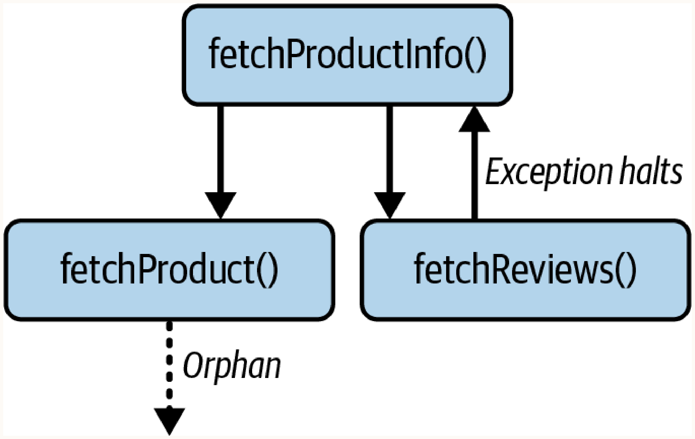
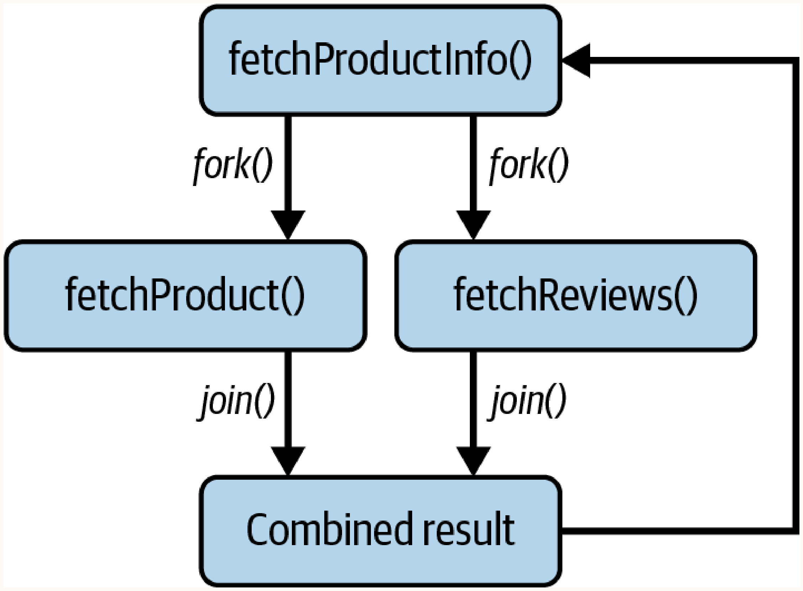
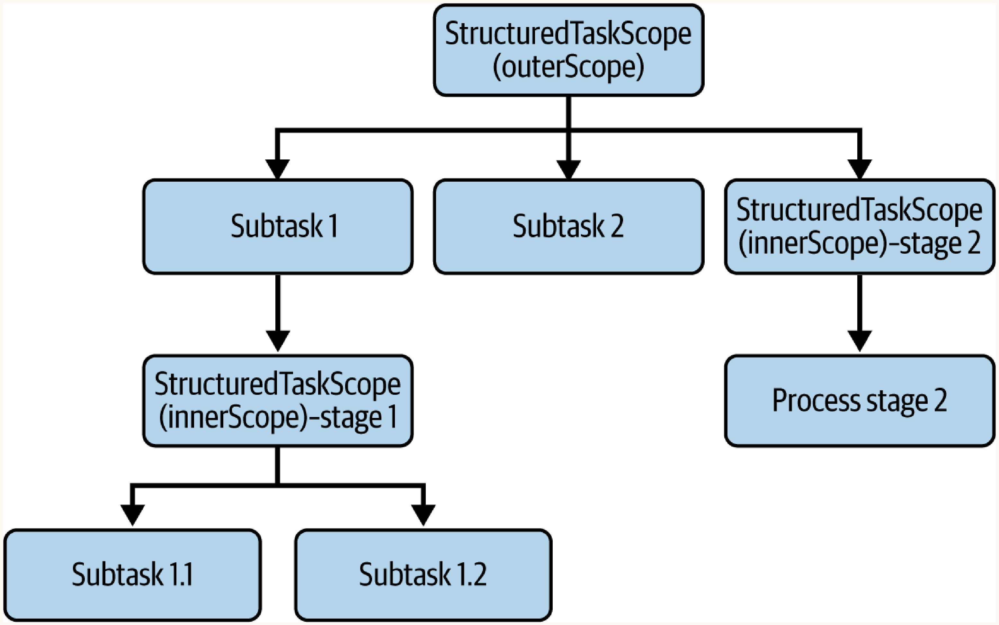

# Chapter 4: Structured Concurrency

## The Challenge of Unstructured Concurrency

Historically in Java, concurrency has been managed using abstractions like `ExecutorService` and `Future`. While these classes provide a means of executing tasks concurrently, they treat tasks as completely independent entities, ignoring their relationships and dependencies.

Consider a common scenario: a web application needs to fetch product details and associated reviews for display. We can use an `ExecutorService` to perform these operations in parallel.

First, let's define our data carriers and custom exception:
```java
record Product(Long id, String name, String description) {}
record Review(Long id, String comment, int rating, Long productId) {}
record ProductInfo(Product product, List<Review> reviews) {}

class ProductServiceException extends RuntimeException {
    public ProductServiceException(String message, Throwable cause) {
        super(message, cause);
    }
    public ProductServiceException(String message) {
        super(message);
    }
}
```

Next, let's implement the fetching logic using a traditional `ExecutorService`:

```java
public class ProductService {
    public ProductInfo fetchProductInfo(Long productId) {
        log("Fetching product & reviews for id: " + productId);
        
        try (var ExecutorService = Executors.newVirtualThreadPerTaskExecutor()) {
            
            Future<Product> productTask =
                ExecutorService.submit(() -> fetchProduct(productId));
                
            Future<List<Review>> reviewsTask =
                ExecutorService.submit(() -> fetchReviews(productId));
                
            Product product = productTask.get();
            log("Product retrieved for id: " + productId);
            
            List<Review> reviews = reviewsTask.get();
            log("Reviews retrieved for id: " + productId);
            log("All info fetched for id: " + productId);
            
            return new ProductInfo(product, reviews);
            
        } catch (ExecutionException | InterruptedException e) {
            Throwable cause = e.getCause() != null ? e.getCause() : e;
            log("Error processing product info for id: " + productId + ": " + cause.getMessage());
            if (e instanceof InterruptedException) {
                Thread.currentThread().interrupt();
            }
            throw new ProductServiceException("Fetch failed for id: " + productId, cause);
        }
    }
}
```

At first glance, this approach seems perfectly reasonable. However, if we carefully consider this, we have a major thread-leak vulnerability.

Imagine a scenario where the product database is temporarily unavailable. The `fetchProduct()` task might throw an exception, which will end up stopping the main request thread. However, oblivious to this failure, the `fetchReviews()` task continues to execute in its own thread. This is a thread leak that can potentially hog resources and add unnecessary load to the server!



Furthermore, if the user decides to abandon the request entirely, the server might halt the parent thread by interrupting it. However, this won't cancel the subtasks; both `fetchProduct()` and `fetchReviews()` will continue running until they naturally finish, completely wasting CPU cycles on a request that is no longer relevant.

Unstructured concurrency is like the `goto` statement back in the old days. The execution jumps to arbitrary points in the code, making it challenging to trace the program's logic. Observability tools such as thread dumps will show each method call as stacks of unrelated threads with no hint of the task-subtask relationship.

## The Promise of Structured Concurrency

Structured Concurrency organizes concurrent tasks to mirror the logical structure of our code. The core principle is that if a task splits into multiple subtasks, they must all return to the same point in the parent task's code.

Benefits:
1. **Unified Error/Cancellation Handling:** If one subtask fails or is canceled, its sibling tasks are automatically terminated, preventing wasted work.
2. **No Thread Leaks:** The parent task guarantees all subtasks are properly cleaned up before it can conclude.
3. **Observability:** Thread dumps inherently represent the clear parent-child dependencies of tasks.
4. **Declarative Style:** It abstracts away thread lifecycle management, letting developers focus on business logic.

Structured concurrency, especially when powered by lightweight Virtual Threads, provides an essential, safe framework for orchestrating massive scale concurrency.

---

## Understanding the API

At the heart of the Structured Concurrency API lies the `StructuredTaskScope` in the `java.util.concurrent` package.

### `StructuredTaskScope`
It is a sealed interface extending `AutoCloseable`, parameterized by `<T, R>`, representing the result type of the tasks and the scope.

```java
public sealed interface StructuredTaskScope<T,R> extends AutoCloseable

static <T> StructuredTaskScope<T,Void> open()
```

Because it extends `AutoCloseable`, we use it within a `try-with-resources` block ensuring automatic closure. 

> [!TIP]
> `StructuredTaskScope` is intended to be used in a strictly structured manner. If `close()` is invoked before all nested task scopes have been closed, it throws a `StructureViolationException`. Always rely on `try-with-resources`.

Now that we understand the API, let's implement the `fetchProductInfo` method using `StructuredTaskScope`. This will gather product details and reviews concurrently:

```java
public ProductInfo fetchProductInfo(Long productId) {
    log("Fetching product & reviews for id: " + productId);
    try (var scope = StructuredTaskScope.open()) {
        StructuredTaskScope.Subtask<Product> productTask =
            scope.fork(() -> fetchProduct(productId));
            
        StructuredTaskScope.Subtask<List<Review>> reviewsTask =
            scope.fork(() -> fetchReviews(productId));
            
        scope.join();
        return new ProductInfo(productTask.get(), reviewsTask.get());
    } catch (InterruptedException e) {
        Thread.currentThread().interrupt();
        throw new ProductServiceException(
            "Fetch failed for id: " + productId);
    }
}
```

Let's trace through what happens:
1. `fetchProductInfo()` initiates a `StructuredTaskScope` within `try-with-resources`.
2. Creates the first subtask to fetch the `Product` and starts it concurrently.
3. Creates the second subtask to retrieve the `List<Review>` alongside the product task.
4. Calls `scope.join()`, blocking until both complete, one fails, or the scope is canceled.
5. If both succeed, it constructs a `ProductInfo` instance from `productTask.get()` and `reviewsTask.get()`.
6. If either fails, `join()` interrupts the other running subtask, waits for it to terminate, and throws a `FailedException` with the original exception.

To see how it handles failures, let's modify `fetchProduct()` to immediately throw an exception:

```java
private Product fetchProduct(Long productId) {
    log("Fetching product id: " + productId);
    if (productId == 1L) {
        throw new ProductServiceException("Product not found");
    }
    sleepForAWhile(Duration.ofSeconds(1));
    return new Product(productId, "Sample Product", "A great product description.");
}
```

When run, the output shows the stack trace revealing that `StructuredTaskScope` immediately canceled the running `fetchReviews()` subtask, and `scope.join()` threw `FailedException` wrapping the original `ProductServiceException`.



This prevents resource waste, incomplete data issues, and eliminates ambiguity.

---

## Scopes and Subtasks: Relationship and Lifecycle

Structured concurrency uses `StructuredTaskScope` as a parent container to manage its child subtasks, handling their lifecycle and execution. Each subtask represents a unit of concurrent work running on virtual threads within the scope. This parent-child relationship ensures a coordinated and predictable execution flow.

### Forking subtasks
To initiate concurrent work, the scope's owner uses the `fork()` method. The API provides two distinct overloads:
- `<U extends T> StructuredTaskScope.Subtask<U> fork(Callable<? extends U> task)`: Used for subtasks designed to return a value. Upon execution in a new virtual thread, its `call()` method is invoked.
- `<U extends T> StructuredTaskScope.Subtask<U> fork(Runnable task)`: Used for subtasks that perform an action but do not return a result. If it completes successfully, `Subtask.get()` simply returns `null`.

### The fork process
Regardless of which `fork()` is called, the process is the same:
1. A `Subtask` object is created to represent the asynchronous task. This acts as a handle.
2. An internal `Joiner` policy object is consulted via its `onFork()` method. If the policy determines the subtask should not run (e.g., if the scope is already canceled), `fork()` returns the handle and no new thread is started.
3. Otherwise, a new virtual thread is started to execute the task.

The `fork()` method immediately returns the `Subtask` handle. The scope's owner can only use this handle to get the result with `Subtask.get()` or the exception with `Subtask.exception()` **after** the scope has been joined via the `join()` method.

### Subtask completion
When a subtask finishes its work, the thread executing it notifies the joiner by invoking its `onComplete()` method, passing the `Subtask` handle, which now contains the final state (`SUCCESS`, `UNAVAILABLE`, or `FAILED`).

The scope owner uses `join()` to wait for the subtask policy to be satisfied. For the default scope created by `StructuredTaskScope.open()`, this means waiting until either all subtasks complete successfully or one subtask fails. If a subtask fails, the scope automatically cancels any other running subtasks. The `join()` method then throws a `FailedException` that wraps the original exception from the subtask that failed.

Finally, when the scope is closed (either explicitly or via a `try-with-resources` block), it guarantees a clean shutdown by waiting for all subtask threads to terminate before allowing the parent thread to proceed. This prevents resource leaks and ensures the structured nature of the concurrent operations.

---

---

## Joining Policies with `Joiner`

A core feature of `StructuredTaskScope` is its ability to define flexible joining policies through a `Joiner` object. A `Joiner` is a powerful mechanism that manages the lifecycle of subtasks by dictating the conditions under which the `join()` method completes and what kind of result, or outcome, it produces.

```java
public interface Joiner<T, R> {
    R result();
    Throwable exception();
    default boolean onFork(Subtask<? extends T> subtask) { ... }
    default boolean onComplete(Subtask<? extends T> subtask) { ... }
}
```
- `result()` and `exception()`: Outcome methods defining the contract for the final outcome of `scope.join()`.
- `onFork()`: Lifecycle hook called every time `fork()` is invoked.
- `onComplete()`: Lifecycle hook called when any subtask finishes, containing the core policy logic.

### Common Joining Policies
The `Joiner` provides several static factory methods for creating common policies:

- `Joiner.awaitAllSuccessfulOrThrow()`: The default policy. It tracks completion count. If a subtask fails, it cancels the scope. It allows `join()` to complete successfully only when all forked subtasks succeed.
- `Joiner.anySuccessfulResultOrThrow()`: "Race to win" policy. `onComplete()` checks if the completing subtask was successful. If so, it immediately cancels the scope and returns the successful result.
- `Joiner.allSuccessfulOrThrow()`: `onComplete()` collects the result of every subtask that completes successfully. Waits for all subtasks to finish and returns a `Stream`.
- `Joiner.awaitAll()`: Waits for all subtasks to complete, whether they succeed or fail. Returns a `Stream<Subtask>` to inspect the state of each subtask.
- `Joiner.allUntil(Predicate<Subtask> isDone)`: Most flexible method. Evaluates a predicate on completion. If it returns true, the scope is canceled.

Let's explore these policies with practical examples.

### 1. Wait for all to succeed or first to fail
When creating a `StructuredTaskScope` using `open()`, it defaults to `Joiner.awaitAllSuccessfulOrThrow()`. This "all-or-nothing" approach means if even one subtask fails, the entire scope shuts down, remaining subtasks are canceled, and the error propagates back.

Here is a demonstration class testing both success and failure scenarios:

```java
public class DefaultPolicyDemo {
    public ProductInfo fetchProductInfo(long productId, boolean shouldFail) throws InterruptedException {
        Instant start = Instant.now();
        // Using open() provides the default "fail-fast" policy
        try (var scope = StructuredTaskScope.open()) {
            StructuredTaskScope.Subtask<Product> productTask = shouldFail
                ? scope.fork(() -> fetchProductThatFails(productId))
                : scope.fork(() -> fetchProduct(productId));
                
            StructuredTaskScope.Subtask<List<Review>> reviewsTask =
                scope.fork(() -> fetchReviews(productId));
                
            // Waits for both to succeed, or throws FailedException on first failure
            log("... Scope joining. Waiting for subtasks...");
            scope.join();
            log("... Scope joined successfully.");
            
            // Only reachable if join() succeeds
            return new ProductInfo(productTask.get(), reviewsTask.get());
        } catch (StructuredTaskScope.FailedException ex) {
            // This block executes only in the failure scenario
            log("... Scope join failed. A subtask threw an exception.");
            throw new RuntimeException("Failed to fetch product info", ex.getCause());
        } finally {
            Instant end = Instant.now();
            log("Total time taken: " + Duration.between(start, end).toMillis() + "ms");
        }
    }
    
    // Subtask that succeeds after 1s
    private Product fetchProduct(long productId) throws InterruptedException {
        Thread.sleep(Duration.ofSeconds(1));
        return new Product(productId, "Sample Product");
    }
    // Subtask that fails instantly
    private Product fetchProductThatFails(long productId) {
        throw new ProductServiceException("Product ID " + productId + " not found");
    }
    // Subtask that succeeds after 2s
    private List<Review> fetchReviews(long productId) throws InterruptedException {
        Thread.sleep(Duration.ofSeconds(2));
        return List.of(new Review("Inaya", 5), new Review("Rushda", 4));
    }
}
```

If we run the success scenario (`shouldFail = false`), the total time taken is ~2000ms. The 1-second `fetchProduct` task completes, and the main thread waits at `join()` for the 2-second `fetchReviews` task to complete before returning both.

If we run the failure scenario (`shouldFail = true`), the `fetchProductThatFails` task throws an exception almost instantly. The scope detects this, cancels the 2-second `fetchReviews` task immediately, and the entire operation concludes in ~7ms. This rapid error propagation is the core advantage of structured concurrency.

### 2. Race for the first successful result
With the `Joiner.anySuccessfulResultOrThrow()` policy, we can orchestrate a "first-past-the-post" race. The moment we have a winner, the `Joiner` cancels all other running subtasks.

```java
public class RacePolicyDemo {
    public Product fetchProduct(long productId) throws InterruptedException {
        Instant start = Instant.now();
        // The Joiner specifies the "race-to-win" policy
        try (var scope = StructuredTaskScope.open(
                StructuredTaskScope.Joiner.<Product>anySuccessfulResultOrThrow())) {
                
            scope.fork(() -> fetchProductFromDatabase(productId)); // takes 2s
            scope.fork(() -> fetchProductFromCache(productId));    // takes 500ms
            scope.fork(() -> fetchProductFromAPI(productId));      // takes 3s
            
            // join() now returns the result of the first successful subtask
            return scope.join(); 
        } catch (InterruptedException | StructuredTaskScope.FailedException e) {
            // FailedException is thrown if ALL subtasks fail
            throw new RuntimeException(e);
        } finally {
            Instant end = Instant.now();
            log("Total time taken: %dms%n".formatted(Duration.between(start, end).toMillis()));
        }
    }
}
```

In this scenario, all three methods are forked in parallel. After ~500ms, the cache task succeeds. At that exact moment, the policy considers its condition met and immediately cancels the database and API tasks. The operation concludes in just over 500ms without wasting time waiting for the slower tasks.

### 3. Gather all results or fail fast
The `Joiner.allSuccessfulOrThrow()` policy behaves identically to the default fail-fast policy in the event of a failure. However, on success, `join()` returns a `Stream<Subtask<T>>` containing the handles to all successfully completed subtasks, in the order they were forked.

This is best used when all subtasks return the same result type and we need all of them to succeed.

```java
public class BatchValidationDemo {
    public List<ValidatedUser> validateAllUsers(List<Long> userIds) throws InterruptedException {
        log("Validating a batch of " + userIds.size() + " users...");
        
        try (var scope = StructuredTaskScope.open(
                StructuredTaskScope.Joiner.<ValidatedUser>allSuccessfulOrThrow())) {
                
            var subtasks = userIds.stream()
                .map(id -> scope.fork(() -> validateUserWithFailure(id)))
                .toList();

            // join() returns a Stream<Subtask<ValidatedUser>> on success
            // or throws FailedException on the first failure
            var resultStream = scope.join();
            
            return resultStream.map(StructuredTaskScope.Subtask::get).toList();
            
        } catch (StructuredTaskScope.FailedException ex) {
            throw new RuntimeException("Batch validation failed", ex.getCause());
        }
    }
    
    private ValidatedUser validateUserWithFailure(long userId) throws InterruptedException {
        if (userId == 3L) {
            throw new IllegalArgumentException("Invalid user ID: " + userId);
        }
        Thread.sleep(100);
        return new ValidatedUser(userId, "VALID");
    }
}
```

In the success scenario, all validation tasks run concurrently and the `Stream` of results is returned. In the failure scenario (if user ID 3 is present), the `Joiner` detects the failure, cancels the entire scope, and `join()` immediately throws a `FailedException` without returning the stream.

### 4. Wait for all
The `Joiner.awaitAll()` policy takes a different approach: it waits for all subtasks to complete, regardless of whether they succeed or fail. It never cancels running subtasks when one fails.

Because it focuses on task completion rather than result collection, `scope.join()` always returns `null`. This is ideal for scenarios where we care about side effects (logging, alerts, metrics) and need to process as much as possible even if some sources fail.

```java
public class AwaitAllDemo {
    public void sendCriticalAlert(String alertMessage) throws InterruptedException {
        log("Sending critical alert: " + alertMessage);
        
        try (var scope = StructuredTaskScope.open(StructuredTaskScope.Joiner.<Void>awaitAll())) {
            
            // Fork notification tasks - each performs side effects
            scope.fork(() -> {
                sendEmailNotification(alertMessage);
                return null; // awaitAll() ignores return values
            });
            scope.fork(() -> {
                sendSmsNotification(alertMessage);
                return null;
            });
            scope.fork(() -> {
                sendPushNotification(alertMessage);
                return null;
            });

            // join() always returns null for awaitAll()
            // All tasks complete regardless of individual failures
            scope.join();
            
            // Process the side effects (collected results)
            logNotificationSummary();
            
        } catch (InterruptedException e) {
            Thread.currentThread().interrupt();
            throw e;
        }
    }
}
```

Even if the SMS notification fails with a `Carrier gateway timeout` error, the email and push notifications continue running and complete successfully. The main thread waits at `join()` until all tasks finish, regardless of their individual outcomes. The policy ensures that temporary issues with one channel don't prevent successful delivery through other available channels.

#### Resilient concurrent server
Another compelling use case for `awaitAll()` is building resilient concurrent servers. In such servers, you want to ensure that every client connection is handled and allowed to complete, even if one specific connection handler encounters an error. The `awaitAll()` policy prevents one failing client from crashing or prematurely stopping the server's ability to handle other active connections.

The key advantage is fault isolation. When individual connection handlers encounter errors, these failures remain isolated and don't propagate to other active connections. This makes `awaitAll()` the ideal choice for server applications where uptime and reliability are paramount.

```java
public class ResilientServer {
    private final AtomicInteger connectionCount = new AtomicInteger(0);
    private final AtomicInteger activeConnections = new AtomicInteger(0);
    
    public void serve(ServerSocket serverSocket) throws IOException, InterruptedException {
        log("Server starting on port: " + serverSocket.getLocalPort());
        
        try (var scope = StructuredTaskScope.open(StructuredTaskScope.Joiner.<Void>awaitAll())) {
            serverSocket.setSoTimeout(1000);
            
            while (!Thread.currentThread().isInterrupted()) {
                try {
                    Socket socket = serverSocket.accept();
                    int connId = connectionCount.incrementAndGet();
                    activeConnections.incrementAndGet();
                    log("Accepted connection #" + connId);
                    
                    // Fork a task to handle this connection
                    scope.fork(() -> {
                        handleConnection(socket, connId);
                        return null;
                    });
                } catch (SocketTimeoutException e) {
                    continue; // Check for interruption
                }
            }
            
            log("Server stopping, waiting for connections to finish...");
            scope.join(); // Wait for all connections to complete
            
        } finally {
            if (!serverSocket.isClosed()) {
                serverSocket.close();
            }
            log("Server shutdown complete. Total connections: " + connectionCount.get());
        }
    }
    
    private void handleConnection(Socket socket, int connectionId) {
        try (socket;
             var reader = new BufferedReader(new InputStreamReader(socket.getInputStream()));
             var writer = new PrintWriter(socket.getOutputStream(), true)) {
             
            log(" [Conn-" + connectionId + "] Started");
            writer.println("Welcome to Echo Server! Type 'quit' to exit.");
            
            String line;
            while ((line = reader.readLine()) != null) {
                log(" [Conn-" + connectionId + "] Received: " + line);
                if ("quit".equalsIgnoreCase(line.trim())) {
                    writer.println("Goodbye!");
                    break;
                }
                writer.println("Echo: " + line);
            }
            log(" [Conn-" + connectionId + "] Completed successfully");
            
        } catch (IOException e) {
            log(" [Conn-" + connectionId + "] Error: " + e.getMessage());
        } finally {
            activeConnections.decrementAndGet();
            log(" [Conn-" + connectionId + "] Finished. Active: " + activeConnections.get());
        }
    }
}
```

Each client connection is handled in its own forked task. When one connection encounters an error (like an `IOException`), it only affects that specific connection—other active connections continue processing normally. `awaitAll()` ensures the scope doesn't fail fast, allowing each connection to complete at its own pace.

### 5. After first success (`Joiner.allUntil`)
The `Joiner.allUntil(Predicate<Subtask> isDone)` method lets you define custom stopping conditions. Let's create a backup service that stops as soon as *any* backup location succeeds.

First, we define our result record and shared state:
```java
public record BackupResult(String location, boolean success) {}
private final AtomicBoolean hasSuccess = new AtomicBoolean(false);
```

Next, we implement the backup methods. Each simulates different reliability and latency:
```java
private BackupResult backupToCloud(String data) throws InterruptedException {
    log(" -> Backing up to cloud...");
    Thread.sleep(Duration.ofMillis(500));
    if (new Random().nextBoolean()) {
        log(" <- Cloud backup successful");
        hasSuccess.set(true);
        return new BackupResult("Cloud", true);
    } else {
        log(" <- Cloud backup failed");
        return new BackupResult("Cloud", false);
    }
}

private BackupResult backupToUSB(String data) throws InterruptedException {
    log(" -> Backing up to USB...");
    Thread.sleep(Duration.ofMillis(300));
    if (new Random().nextBoolean()) {
        log(" <- USB backup successful");
        hasSuccess.set(true);
        return new BackupResult("USB", true);
    } else {
        log(" <- USB backup failed");
        return new BackupResult("USB", false);
    }
}

private BackupResult backupToNetwork(String data) throws InterruptedException {
    log(" -> Backing up to network drive...");
    Thread.sleep(Duration.ofMillis(400));
    if (new Random().nextBoolean()) {
        log(" <- Network backup successful");
        hasSuccess.set(true);
        return new BackupResult("Network", true);
    } else {
        log(" <- Network backup failed");
        return new BackupResult("Network", false);
    }
}
```

Now we orchestrate the backup using `allUntil()`:
```java
public void performBackup(String data) throws InterruptedException {
    log("Starting backup to multiple locations...");
    
    try (var scope = open(Joiner.<BackupResult>allUntil(subtask -> {
        boolean shouldStop = hasSuccess.get();
        if (shouldStop) {
            log("✅ Backup successful! Canceling other attempts...");
        }
        return shouldStop;
    }))) {
        scope.fork(() -> backupToCloud(data));
        scope.fork(() -> backupToUSB(data));
        scope.fork(() -> backupToNetwork(data));
        
        scope.join(); // Waits for first success, or all to fail
        
        if (hasSuccess.get()) {
            log("Backup completed successfully!");
        } else {
            log("All backup attempts failed!");
        }
    }
}
```

The predicate `subtask -> { ... }` runs every time a subtask completes. As soon as any backup successfully sets `hasSuccess` to `true`, the predicate returns `true`, and the `Joiner` immediately cancels the remaining running subtasks. This prevents wasting time and resources once the goal is achieved.

---

## Exception Handling in StructuredTaskScope

Exception handling in structured concurrency adheres to well-defined patterns that depend on the `Joiner` policy in use. A `StructuredTaskScope` is initiated with a `Joiner` that manages subtask completion and produces the outcome for the `join` method. When the outcome is an exception, the `join` method throws `StructuredTaskScope.FailedException` with the original exception as the cause.

Many of the details regarding how exceptions are handled will depend on usage. Let's explore the different exception-handling strategies through practical examples.

### 1. Basic exception handling
The most common pattern is to wrap your structured concurrency code in a `try-catch` block that handles `FailedException`. 

Consider a user data service that needs to fetch information from multiple sources. If any source fails, we want to provide a meaningful error message rather than exposing internal system details:

```java
public class BasicExceptionHandling {
    public String fetchUserData(String userId) {
        try (var scope = open(Joiner.<String>allSuccessfulOrThrow())) {
            var profileTask = scope.fork(() -> fetchUserProfile(userId));
            var preferencesTask = scope.fork(() -> fetchUserPreferences(userId));
            
            var results = scope.join();
            
            // Process successful results
            return results.map(Subtask::get)
                          .collect(Collectors.joining(", "));
        } catch (FailedException e) {
            log("Task failed: " + e.getCause().getMessage());
            return "Error: Unable to fetch user data";
        } catch (InterruptedException e) {
            Thread.currentThread().interrupt();
            throw new RuntimeException("Operation interrupted", e);
        }
    }
    
    private String fetchUserProfile(String userId) throws InterruptedException {
        Thread.sleep(Duration.ofMillis(200));
        if ("invalid".equals(userId)) {
            throw new IllegalArgumentException("Invalid user ID");
        }
        return "Profile for " + userId;
    }
    
    private String fetchUserPreferences(String userId) throws InterruptedException {
        Thread.sleep(Duration.ofMillis(150));
        if (userId.startsWith("blocked")) {
            throw new SecurityException("User access blocked");
        }
        return "Preferences for " + userId;
    }
}
```

- The `allSuccessfulOrThrow()` joiner ensures that if any subtask fails, the entire operation fails with a `FailedException`.
- Use `getCause()` to access the original exception wrapped inside `FailedException`.
- Always restore the interrupted status when handling `InterruptedException`.

### 2. Pattern matching for sophisticated error handling
When you need to handle different types of exceptions with specific recovery strategies, pattern matching provides an elegant solution.

Consider an ecommerce order-processing system. When a customer places an order, several operations must succeed: payment processing, inventory verification, and shipping calculation.

```java
public class OrderProcessingService {
    public record OrderResult(String orderId, String status, String message, boolean successful) {}

    public OrderResult processOrder(String customerId, String productId, double amount) {
        try (var scope = open(Joiner.<String>allSuccessfulOrThrow())) {
            var paymentTask = scope.fork(() -> processPayment(customerId, amount));
            var inventoryTask = scope.fork(() -> checkAndReserveInventory(productId));
            var shippingTask = scope.fork(() -> calculateShipping(customerId, productId));
            
            var results = scope.join().map(Subtask::get).toList();
            String orderId = generateOrderId();
            
            return new OrderResult(orderId, "CONFIRMED", "Order confirmed successfully", true);
        } catch (FailedException e) {
            Throwable cause = e.getCause();
            return handleOrderProcessingError(cause);
        } catch (InterruptedException e) {
            Thread.currentThread().interrupt();
            throw new RuntimeException("Operation interrupted", e);
        }
    }

    private static OrderResult handleOrderProcessingError(Throwable cause) {
        return switch (cause) {
            case PaymentDeclinedException pde -> new OrderResult(null,
                "PAYMENT_FAILED", "Your payment was declined. Please check your card details.", false);
            case InsufficientInventoryException iie -> new OrderResult(null, 
                "OUT_OF_STOCK", "Sorry, this item is currently out of stock.", false);
            case ShippingNotAvailableException snae -> new OrderResult(null, 
                "SHIPPING_UNAVAILABLE", "We can't ship to your address right now.", false);
            case NetworkException ne -> new OrderResult(null,
                "TEMPORARY_ERROR", "We're experiencing technical difficulties. Please try again.", false);
            case SecurityException se -> new OrderResult(null,
                "SECURITY_CHECK_FAILED", "Additional verification required.", false);
            default -> new OrderResult(null, 
                "SYSTEM_ERROR", "Something went wrong on our end. Please try again.", false);
        };
    }
    
    // Stub methods that throw the specific domain exceptions
    private String processPayment(String customerId, double amount) throws Exception { ... }
    private String checkAndReserveInventory(String productId) throws Exception { ... }
    private String calculateShipping(String customerId, String productId) throws Exception { ... }
    private String generateOrderId() { return "ORD-" + System.currentTimeMillis(); }
}
```

The beauty of this approach lies in the `switch` expression that evaluates the cause of the failure. Each case addresses a specific business scenario with appropriate customer communication. 

### 3. Strategic exception propagation
Sometimes, the best strategy is to allow exceptions to propagate to higher levels, where they can be addressed with a broader context.

```java
public class ExceptionPropagationExample {
    // Let exceptions propagate for centralized handling
    public List<String> fetchCriticalData(List<String> sources) 
            throws StructuredTaskScope.FailedException, InterruptedException {
        
        try (var scope = open(StructuredTaskScope.Joiner.<String>allSuccessfulOrThrow())) {
            var tasks = sources.stream()
                .map(source -> scope.fork(() -> fetchFromSource(source)))
                .toList();
                
            // If any source fails, let FailedException propagate
            var results = scope.join();
            return results.map(StructuredTaskScope.Subtask::get).toList();
        }
        // No catch block - let FailedException propagate
    }

    // Higher-level method with centralized exception handling
    public void processDataWithCentralizedHandling() {
        try {
            var sources = List.of("source1", "source2");
            var data = fetchCriticalData(sources);
            log("Successfully fetched data: " + data);
        } catch (StructuredTaskScope.FailedException e) {
            // Centralized logging and error handling
            log("Critical data fetch failed: " + e.getCause().getMessage());
            // Could trigger alerts, fallback procedures, etc.
            handleCriticalSystemFailure(e);
        } catch (InterruptedException e) {
            Thread.currentThread().interrupt();
            log("Operation was interrupted");
        }
    }
    // ... stub methods
}
```
By allowing `FailedException` to propagate from `fetchCriticalData()`, we enable the calling method to implement comprehensive error handling that might include logging, alerting, and triggering fallback systems.

### 4. Handling exceptions within subtasks
For cases where specific exceptions should trigger default results rather than failing the entire operation, it's often better to handle exceptions within the subtask itself. This pattern is particularly useful for optional data sources where partial failure shouldn't prevent the entire operation from succeeding.

```java
public class SubtaskExceptionHandling {
    public record ServiceResponse(String service, String data, boolean successful) {}

    public List<ServiceResponse> gatherOptionalData(List<String> services) throws InterruptedException {
        try (var scope = open(Joiner.<ServiceResponse>allSuccessfulOrThrow())) {
            var tasks = services.stream()
                .map(service -> scope.fork(() -> fetchWithDefaults(service)))
                .toList();
                
            var results = scope.join();
            return results.map(Subtask::get).toList();
        } catch (FailedException e) {
            // This should rarely happen since we handle exceptions in subtasks
            log("Unexpected failure: " + e.getCause().getMessage());
            throw new RuntimeException("System error", e);
        }
    }

    // Handle exceptions within the subtask to provide defaults
    private ServiceResponse fetchWithDefaults(String service) {
        try {
            String data = fetchServiceData(service);
            return new ServiceResponse(service, data, true);
        } catch (IOException e) {
            log("Network error for " + service + ": " + e.getMessage());
            return new ServiceResponse(service, "Default data", false);
        } catch (TimeoutException e) {
            log("Timeout for " + service + ": " + e.getMessage());
            return new ServiceResponse(service, "Cached data", false);
        } catch (Exception e) {
            log("Unexpected error for " + service + ": " + e.getMessage());
            return new ServiceResponse(service, "Error", false);
        }
    }
    // ... stub method
}
```
Exception handling within the subtask converts failures into successful responses with default data, preventing individual service failures from cascading.

### 5. Understanding how different joiners handle exceptions
The choice of joiner has a significant impact on how exceptions are handled. Let's compare `allSuccessfulOrThrow()` and `awaitAll()`.

The `allSuccessfulOrThrow()` joiner implements a fail-fast strategy where any single failure causes the entire operation to fail immediately:

```java
private void demonstrateAllSuccessfulOrThrow() {
    try (var scope = open(StructuredTaskScope.Joiner.<String>allSuccessfulOrThrow())) {
        scope.fork(() -> successfulTask("Task1"));
        scope.fork(() -> failingTask("Task2"));
        scope.fork(() -> successfulTask("Task3"));
        
        var results = scope.join();
        log("All tasks completed successfully");
    } catch (StructuredTaskScope.FailedException e) {
        log("Failed due to: " + e.getCause().getMessage());
        log("Remaining tasks were canceled");
    } catch (InterruptedException e) {
        Thread.currentThread().interrupt();
    }
}
```

The `awaitAll()` joiner takes a different approach, allowing all tasks to complete regardless of individual failures:

```java
private void demonstrateAwaitAll() {
    try (var scope = open(StructuredTaskScope.Joiner.<Void>awaitAll())) {
        scope.fork(() -> successfulTask("Task1"));
        scope.fork(() -> failingTask("Task2"));
        scope.fork(() -> successfulTask("Task3"));
        
        scope.join();
        log("All tasks were allowed to complete");
    } catch (InterruptedException e) {
        Thread.currentThread().interrupt();
    }
}
```
- `Task2` will still throw an exception, but it won't prevent other tasks from completing.
- The `join()` method never throws `FailedException` with `awaitAll()`—it waits for all tasks to finish, even if some fail.

### 6. General exceptions
Unless otherwise specified, passing a `null` argument to a method in this class will cause a `NullPointerException` to be thrown. Beyond null pointer checks, the API throws specific exceptions for different error conditions.

```java
public class ExceptionBehaviorDemo {
    public void demonstrateCommonExceptions() {
        try {
            log("Testing null joiner...");
            try (var scope = open(null)) {
                log("This should not be reached");
            }
        } catch (NullPointerException e) {
            log("NullPointerException caught for null joiner");
        }

        try {
            Callable<? extends String> nullCallable = null;
            try (var scope = open(StructuredTaskScope.Joiner.<String>allSuccessfulOrThrow())) {
                scope.fork(nullCallable); // Throws NPE
            }
        } catch (NullPointerException e) {
            log("NullPointerException caught for null callable");
        }

        try {
            var scope = open(StructuredTaskScope.Joiner.<String>allSuccessfulOrThrow());
            scope.close();
            scope.fork(() -> "This should fail"); // Throws IllegalStateException
        } catch (IllegalStateException e) {
            log("IllegalStateException caught for closed scope operation");
        }
    }
}
```

---

## Configuration

While the default configuration of `StructuredTaskScope` works well, real-world applications often require customizing thread creation, adding monitoring capabilities, and implementing timeout policies.

The Configuration API provides an overloaded `open` method that accepts a configuration function:

```java
static <T, R> StructuredTaskScope<T, R> open(
    Joiner<? super T, ? extends R> joiner,
    Function<Configuration, Configuration> configFunction)
```

The `Configuration` interface is a sealed interface using an immutable builder pattern:
```java
sealed interface Configuration {
    Configuration withThreadFactory(ThreadFactory threadFactory);
    Configuration withName(String name);
    Configuration withTimeout(Duration timeout);
}
```

### 1. Named Threads
Named threads make it significantly easier to identify which threads are doing which work in thread dumps and profiling tools.

```java
public void processUserRequests(List<String> userIds) {
    ThreadFactory factory = Thread.ofVirtual()
        .name("user-processor-", 0)
        .factory();
        
    try (var scope = open(Joiner.<String>allSuccessfulOrThrow(), 
                          cf -> cf.withThreadFactory(factory))) {
        
        var tasks = userIds.stream()
            .map(userId -> scope.fork(() -> processUser(userId)))
            .toList();
            
        var results = scope.join().map(Subtask::get).toList();
        System.out.println("Processed users: " + results);
    } catch (FailedException | InterruptedException e) { ... }
}
```
When run, threads will be named `user-processor-0`, `user-processor-1`, etc.

### 2. Timeout Configuration
Timeouts prevent operations from hanging indefinitely and allow your application to fail fast when services are unresponsive.

```java
public List<String> fetchDataWithTimeout(List<String> sources) 
    throws TimeoutException, FailedException, InterruptedException {
    
    Duration timeout = Duration.ofSeconds(5);
    
    try (var scope = open(Joiner.<String>allSuccessfulOrThrow(),
                          cf -> cf.withTimeout(timeout))) {
                          
        var tasks = sources.stream()
            .map(source -> scope.fork(() -> fetchFromSource(source)))
            .toList();
            
        // If timeout expires before join() completes, 
        // TimeoutException is thrown
        return scope.join().map(Subtask::get).toList();
    }
}
```
> [!NOTE]
> The timeout starts counting from the moment the scope is opened, not when `join()` is called. It covers the entire lifecycle of the scope.

### 3. Combining Configuration Options
You can combine various options to precisely construct the execution environment.

```java
ThreadFactory factory = Thread.ofVirtual()
    .name("api-client-", 0)
    .factory();
    
Duration timeout = Duration.ofSeconds(15);

try (var scope = open(Joiner.<String>allSuccessfulOrThrow(),
                      cf -> cf.withThreadFactory(factory)
                              .withTimeout(timeout)
                              .withName("api-integration-scope"))) {
    
    // Fork API calls...
    scope.join();
}
```

---

## Custom Joiners

While the built-in joiners like `allSuccessfulOrThrow()` and `awaitAll()` offer a solid foundation for task coordination, structured concurrency allows developers to create custom joiners to meet specific application needs. 

Custom joiners are created by implementing the `StructuredTaskScope.Joiner<T, R>` interface, where `T` is the type of values produced by subtasks and `R` is the type of the final result.

The interface defines three key methods:
- `onFork(Subtask<? extends T> subtask)`: Called each time a subtask is forked, before the thread is created.
- `onComplete(Subtask<? extends T> subtask)`: Called each time a subtask completes, allowing you to process the result and decide whether to continue or complete early.
- `result()`: Called when the scope is ready to produce its final result.

Let's explore several practical examples that demonstrate the power and flexibility of custom joiners.

### 1. Collecting all results and exceptions
If we want to gather the results of all subtasks, whether they succeed or fail, and collect any exceptions for batch processing, we can build a `CollectingJoiner`:

```java
public class CollectingJoiner<T> implements StructuredTaskScope.Joiner<T, CollectingJoiner.Result<T>> {
    private final Queue<T> results = new ConcurrentLinkedQueue<>();
    private final Queue<Throwable> exceptions = new ConcurrentLinkedQueue<>();

    public record Result<T>(List<T> successes, List<Throwable> failures) {
        public boolean hasFailures() { return !failures.isEmpty(); }
        public int totalTasks() { return successes.size() + failures.size(); }
    }

    @Override
    public Result<T> result() {
        return new Result<>(results.stream().toList(), exceptions.stream().toList());
    }

    @Override
    public boolean onComplete(StructuredTaskScope.Subtask<? extends T> subtask) {
        switch (subtask.state()) {
            case SUCCESS -> results.add(subtask.get());
            case FAILED -> exceptions.add(subtask.exception());
            case UNAVAILABLE -> exceptions.add(new RuntimeException("Task was canceled"));
        }
        return false; // Returning false allows remaining subtasks to continue running
    }
}
```

We can use this to build a service that fetches headlines from various sources, collecting as many as possible even if some fail:

```java
public class NewsAggregator {
    public CollectingJoiner.Result<String> fetchAllHeadlines() throws InterruptedException {
        var newsSources = List.of("TechCrunch", "InfoWorld", "InfoQ", "FailingSource");
        
        try (var scope = open(new CollectingJoiner<String>())) {
            for (String source : newsSources) {
                scope.fork(() -> fetchHeadlines(source));
            }
            
            var result = scope.join();
            log("Successfully fetched from " + result.successes().size() + " sources");
            log("Failed to fetch from " + result.failures().size() + " sources");
            return result;
        }
    }
    // ... fetchHeadlines stub throws on "FailingSource"
}
```

### 2. Quorum-based completion
A joiner inspired by distributed systems that completes when a quorum of subtasks succeeds, useful when you need a certain number of confirmations:

```java
public class QuorumJoiner<T> implements StructuredTaskScope.Joiner<T, Boolean> {
    private final int requiredSuccesses;
    private final AtomicInteger successCount = new AtomicInteger(0);
    private final AtomicInteger totalCount = new AtomicInteger(0);
    private volatile boolean quorumReached = false;

    public QuorumJoiner(int requiredSuccesses) {
        this.requiredSuccesses = requiredSuccesses;
    }

    @Override
    public Boolean result() { return quorumReached; }

    @Override
    public boolean onFork(StructuredTaskScope.Subtask<? extends T> subtask) {
        totalCount.incrementAndGet();
        return false; // Allow all tasks to proceed
    }

    @Override
    public boolean onComplete(StructuredTaskScope.Subtask<? extends T> subtask) {
        if (subtask.state() == StructuredTaskScope.Subtask.State.SUCCESS) {
            int currentSuccess = successCount.incrementAndGet();
            if (currentSuccess >= requiredSuccesses) {
                quorumReached = true;
                return true; // Cancel remaining tasks and complete scope
            }
        }
        return false;
    }
}
```

Using the quorum joiner for a distributed database write operation:
```java
public class DistributedDatabase {
    private final List<String> nodes = List.of("node-1", "node-2", "node-3", "node-4", "node-5");
    private final int quorumSize = 3; // Need 3 out of 5 nodes

    public boolean writeData(String key, String value) throws InterruptedException {
        try (var scope = open(new QuorumJoiner<Boolean>(quorumSize))) {
            for (String node : nodes) {
                scope.fork(() -> writeToNode(node, key, value));
            }
            
            boolean success = scope.join();
            log("Write operation " + (success ? "succeeded" : "failed"));
            return success;
        }
    }
    // ... writeToNode stub with 20% random failure rate
}
```

### 3. Adaptive completion (Circuit Breaker)
A joiner that adapts to results, completing early if it sees too many failures (e.g., failure rate exceeds a threshold after a minimum sample size):

```java
public class AdaptiveJoiner<T> implements StructuredTaskScope.Joiner<T, CollectingJoiner.Result<T>> {
    private final int minSampleSize;
    private final double maxFailureRate;
    private final Queue<T> successes = new ConcurrentLinkedQueue<>();
    private final Queue<Throwable> failures = new ConcurrentLinkedQueue<>();

    // ... Constructor and result() method ...

    @Override
    public boolean onComplete(StructuredTaskScope.Subtask<? extends T> subtask) {
        switch (subtask.state()) {
            case SUCCESS -> successes.add(subtask.get());
            case FAILED -> failures.add(subtask.exception());
            case UNAVAILABLE -> failures.add(new RuntimeException("Task canceled"));
        }
        
        int total = successes.size() + failures.size();
        if (total >= minSampleSize) {
            double failureRate = (double) failures.size() / total;
            return failureRate > maxFailureRate; // Stop if rate exceeded
        }
        return false;
    }
}
```

### 4. Rate-limited joiner
Controlling the rate at which subtasks are executed using a `Semaphore` in the `onFork` hook:

```java
public class RateLimitedJoiner<T> implements StructuredTaskScope.Joiner<T, List<T>> {
    private final Semaphore semaphore;
    private final Queue<T> results = new ConcurrentLinkedQueue<>();
    // ... failures queue ...

    public RateLimitedJoiner(int maxConcurrentTasks) {
        this.semaphore = new Semaphore(maxConcurrentTasks);
    }

    @Override
    public boolean onFork(StructuredTaskScope.Subtask<? extends T> subtask) {
        try {
            semaphore.acquire(); // Blocks if no permits available
        } catch (InterruptedException e) {
            Thread.currentThread().interrupt();
        }
        return false;
    }

    @Override
    public boolean onComplete(StructuredTaskScope.Subtask<? extends T> subtask) {
        // ... collect results ...
        semaphore.release(); // Free up permit for next waiting task
        return false;
    }
    // ... result() method ...
}
```

### 5. Conditional joiners
A generic joiner that accepts a condition (`Supplier<Boolean>`) for deciding when to stop accepting new tasks:

```java
public class ConditionalJoiner<T> implements StructuredTaskScope.Joiner<T, List<T>> {
    private final Supplier<Boolean> shouldContinue;
    // ... state ...

    public ConditionalJoiner(Supplier<Boolean> shouldContinue) {
        this.shouldContinue = shouldContinue;
    }

    @Override
    public boolean onFork(StructuredTaskScope.Subtask<? extends T> subtask) {
        if (!shouldContinue.get()) {
            System.out.println("Condition failed, stopping new tasks");
            return true; // Cancel scope to prevent new work
        }
        return false; 
    }
    // ... onComplete() and result() ...
}
```

---

## Memory Consistency Effects

`StructuredTaskScope` provides well-defined memory consistency guarantees based on Java's fundamental happens-before relationships. This makes it easier to reason about the visibility of shared data across threads.

> **Rule:** Actions in the owner thread of a `StructuredTaskScope` prior to the forking of a subtask *happen-before* any actions taken by that subtask, which in turn *happen-before* the subtask result is retrieved via `join()`.

Let's see this guarantee in action. First, how the owner thread passes state to subtasks safely:

```java
public class MemoryConsistencyDemo {
    private String configuration = "default";
    private final Map<String, String> cache = new ConcurrentHashMap<>();

    public void demonstrateMemoryConsistency() throws InterruptedException {
        // Owner thread sets up a shared state before forking
        configuration = "production-config";
        cache.put("database-url", "prod.example.com");
        cache.put("api-key", "secret-key-123");
        
        try (var scope = open(StructuredTaskScope.Joiner.<String>allSuccessfulOrThrow())) {
            // Fork subtasks that read owner thread's data
            var configTask = scope.fork(() -> {
                // Guaranteed to see "production-config"
                return "Config: " + configuration; 
            });
            var cacheTask = scope.fork(() -> {
                // Guaranteed to see "prod.example.com"
                return "Connected to: " + cache.get("database-url");
            });
            
            var results = scope.join().map(StructuredTaskScope.Subtask::get).toList();
        }
    }
}
```
1. The owner thread prepares the shared state.
2. The `fork()` operation establishes a happens-before edge, ensuring all preparations become visible to the subtasks.
3. Without any additional synchronization, both subtasks can reliably see the updated configuration and cache.

The happens-before guarantee works in both directions. When subtasks modify shared state, those changes become visible to the owner thread after the `join()` operation completes:

```java
public void demonstrateSubtaskUpdates() throws InterruptedException {
    var results = new ConcurrentHashMap<String, String>();
    var counter = new AtomicInteger(0);
    
    try (var scope = open(StructuredTaskScope.Joiner.<String>allSuccessfulOrThrow())) {
        var worker1 = scope.fork(() -> {
            results.put("task1", "completed");
            counter.incrementAndGet();
            return "Worker1 done";
        });
        var worker2 = scope.fork(() -> {
            results.put("task2", "completed");
            counter.incrementAndGet();
            return "Worker2 done";
        });
        
        scope.join(); // Creates a happens-before edge back to the owner thread
        
        // Owner thread is guaranteed to see all subtask updates
        log("Final count: " + counter.get()); // Will reliably be 2
        log("Final results: " + results);
    }
}
```

This automatic memory consistency is a key advantage of structured concurrency. `fork()` and `join()` act as clear synchronization points where memory barriers are placed. 

However, notice that we still used `ConcurrentHashMap` and `AtomicInteger`. While `fork()` and `join()` synchronize memory between the parent and the children, the child tasks are still running concurrently relative to *each other*. Thus, we still need thread-safe collections and atomic operations when multiple subtasks modify shared state simultaneously.

---

## Nested Scopes

The power of structured concurrency extends beyond a single scope. Just as we can nest code blocks within methods, we can nest `StructuredTaskScope` instances to create sophisticated, multilevel hierarchies of concurrent tasks.

Each nested scope is self-contained, encapsulating its subtasks' lifecycle and error handling. When a subtask creates its own nested `StructuredTaskScope`, a parent-child relationship is established, forming a tree structure. The parent scope becomes responsible for the child scope's lifecycle.

This hierarchical structure propagates errors and cancellations upward. If a subtask in a nested scope fails, the error is first handled by its immediate parent scope, then propagated up the chain until it's handled or reaches the top-level scope.



Let's examine a document processor that gathers content from multiple sources and then performs analysis. It creates a clean two-level hierarchy:

```text
Document Processing (Level 1)
├── Header Fetching (Level 2)
├── Body Fetching (Level 2)
├── Metadata Fetching (Level 2)
└── Content Analysis (Level 2)
    ├── Word Counting (Level 3)
    ├── Sentiment Analysis (Level 3)
    └── Summary Generation (Level 3)
```

Here is the implementation demonstrating nested scopes:

```java
public class DocumentProcessor {
    public DocumentReport processDocument(String documentId) throws InterruptedException {
        // Level 1 Scope: Gathering Content
        try (var gatheringScope = open(Joiner.<String>allSuccessfulOrThrow())) {
            var headerTask = gatheringScope.fork(() -> fetchHeader(documentId));
            var bodyTask = gatheringScope.fork(() -> fetchBody(documentId));
            var metadataTask = gatheringScope.fork(() -> fetchMetadata(documentId));
            
            gatheringScope.join(); // Waits for all content to be gathered
            
            // Proceeds to Level 2 only if gathering succeeds
            return analyzeContent(headerTask.get(), bodyTask.get(), metadataTask.get());
            
        } catch (FailedException e) {
            throw new RuntimeException("Failed to gather document content", e);
        }
    }

    private DocumentReport analyzeContent(String header, String body, String metadata) 
            throws InterruptedException {
        // Level 2 Scope: Analyzing Content
        try (var analysisScope = open(Joiner.allSuccessfulOrThrow())) {
            var wordCountTask = analysisScope.fork(() -> countWords(body));
            var sentimentTask = analysisScope.fork(() -> analyzeSentiment(body));
            var summaryTask = analysisScope.fork(() -> generateSummary(header, body, metadata));
            
            analysisScope.join(); // Waits for all analysis to complete
            
            return new DocumentReport(
                (Integer) wordCountTask.get(),
                (String) sentimentTask.get(),
                (String) summaryTask.get()
            );
        } catch (FailedException e) {
            throw new RuntimeException("Failed to analyze document content", e);
        }
    }
    
    // ... stub methods for fetching and analyzing
}
```

This nested approach demonstrates structured concurrency's elegance. Each scope manages its own lifecycle and resources, creating a clean hierarchy where failures propagate naturally, resources are automatically cleaned up, and cancellation cascades properly from parent to child scopes.

---

## Observability

Structured concurrency not only helps us organize and manage concurrent tasks but also makes observing and diagnosing concurrent applications significantly easier.

One of the most noticeable benefits is the enhanced thread dumps provided by the JVM. Because `StructuredTaskScope` explicitly defines the parent-child relationships between threads, diagnostic tools can present these relationships structurally rather than as a flat, disconnected list of thousands of threads.

When you generate a thread dump (e.g., using `jcmd <pid> Thread.dump_to_file -format=json thread_dump.json`), the hierarchy is clearly visible. Here is a simplified example of how this looks in JSON format:

```json
{
  "threadDump": {
    "processId": "12345",
    "time": "2024-05-20T10:15:30Z",
    "runtimeVersion": "21",
    "threads": [
      {
        "tid": "1",
        "name": "main",
        "stack": [
          "java.base/java.util.concurrent.StructuredTaskScope.join(StructuredTaskScope.java:123)",
          "com.example.DocumentProcessor.processDocument(DocumentProcessor.java:45)"
        ]
      },
      {
        "tid": "24",
        "name": "user-processor-0",
        "parent": "1",
        "stack": [
          "com.example.DocumentProcessor.fetchHeader(DocumentProcessor.java:60)"
        ]
      },
      {
        "tid": "25",
        "name": "user-processor-1",
        "parent": "1",
        "stack": [
          "com.example.DocumentProcessor.fetchBody(DocumentProcessor.java:65)"
        ]
      }
    ]
  }
}
```

Notice the `"parent": "1"` attribute in the subtasks. This metadata allows profiling and monitoring tools to reconstruct the execution tree, making it trivial to see exactly which parent operation spawned which blocked or failing child tasks.


This level of observability is impossible with traditional unstructured `ExecutorService` pools, where worker threads are completely divorced from the operations that submitted them.

While the `jcmd` tool offers a convenient way to generate structured thread dumps, there might be situations where we need more control or want to automate the process. The `HotSpotDiagnosticMXBean` comes in handy here. We can use it to trigger thread dumps programmatically whenever a specific condition arises, such as an exception within a `StructuredTaskScope`.

Here's an example of how we might use it:

```java
public void processWithErrorHandling(String documentId) {
    try (var scope = open(StructuredTaskScope.Joiner.<String>allSuccessfulOrThrow(),
                          cf -> cf.withName("error-prone-scope"))) {
        scope.fork(() -> {
            if (new Random().nextBoolean()) {
                throw new RuntimeException("Simulated failure");
            }
            return fetchHeader(documentId);
        });
        scope.join();
    } catch (StructuredTaskScope.FailedException e) {
        HotSpotDiagnosticMXBean bean = ManagementFactory
            .getPlatformMXBean(HotSpotDiagnosticMXBean.class);
        try {
            Path path = Path.of("./structured-concurrency-error.json");
            bean.dumpThreads(path.toAbsolutePath().toString(),
                HotSpotDiagnosticMXBean.ThreadDumpFormat.JSON);
            System.out.println("Thread dump captured: " + path);
        } catch (IOException ex) {
            throw new RuntimeException("Failed to generate thread dump", ex);
        }
    } catch (InterruptedException e) {
        Thread.currentThread().interrupt();
    }
}
```

---

## Summary

- **A Paradigm Shift**: Structured concurrency introduces a paradigm shift by organizing concurrent tasks hierarchically, much like traditional control flow blocks.
- **The API**: The `StructuredTaskScope` API bounds the lifetime of concurrent tasks to a specific lexical scope, eliminating thread leaks and orphaned tasks.
- **Joiners**: We learned about standard joiners (`allSuccessfulOrThrow()`, `awaitAll()`, `allUntil()`, etc.) and how to build custom joiners for complex use cases like quorums, rate limiters, and circuit breakers.
- **Exception Handling**: Exception handling becomes more intuitive, allowing us to manage errors through fail-fast mechanisms, strategic propagation, pattern matching, and graceful degradation.
- **Memory Consistency**: We explored the inherent memory consistency benefits, discovering how `fork()` and `join()` establish powerful *happens-before* guarantees without manual synchronization.
- **Scale**: Finally, we saw how nested scopes and built-in JVM observability make massive-scale concurrency both manageable and debuggable.
