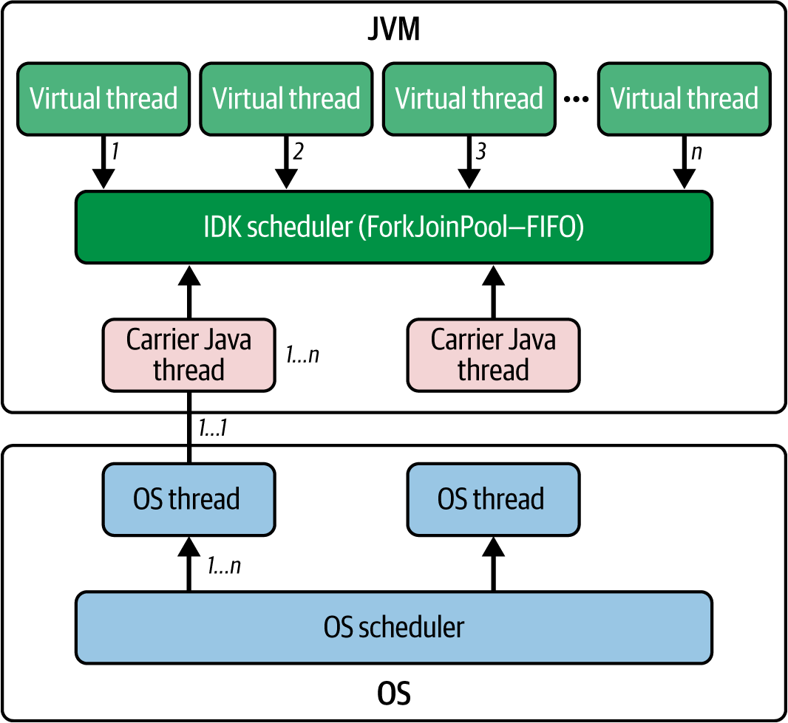
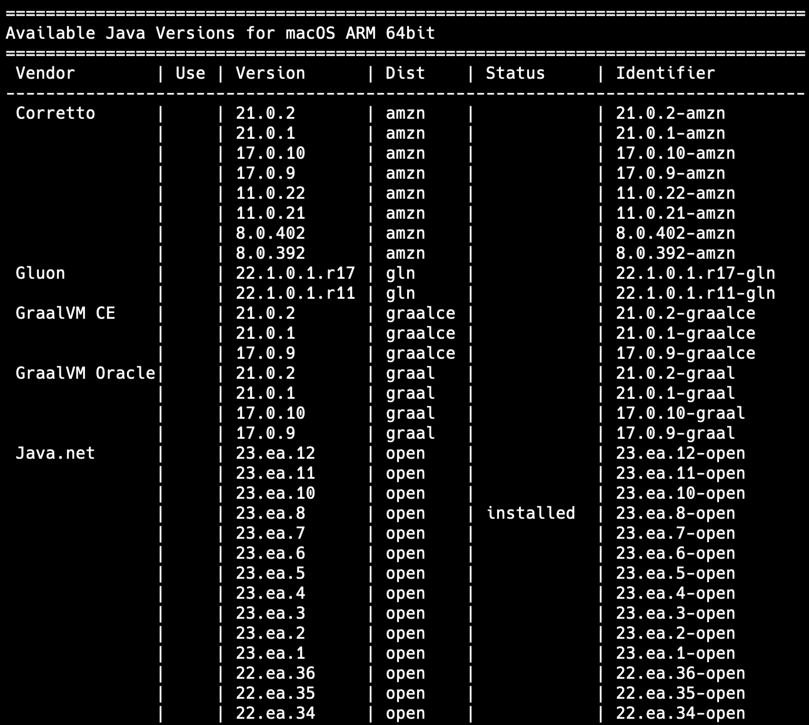
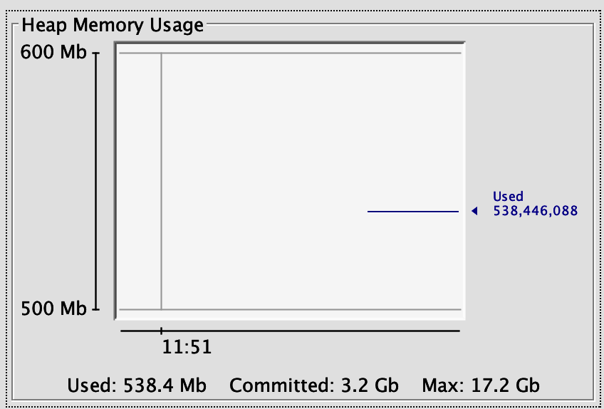
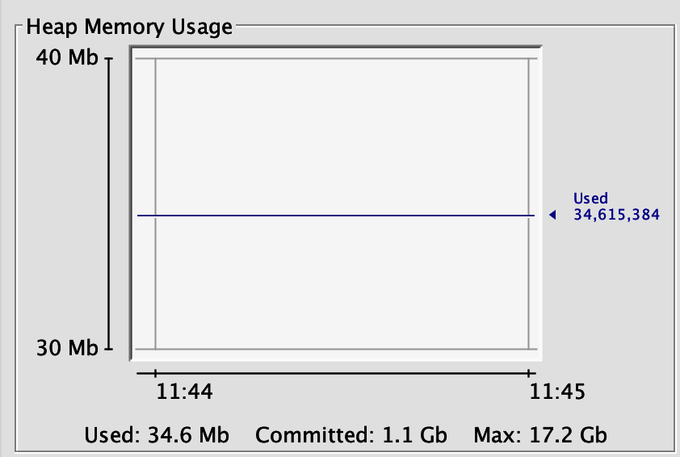
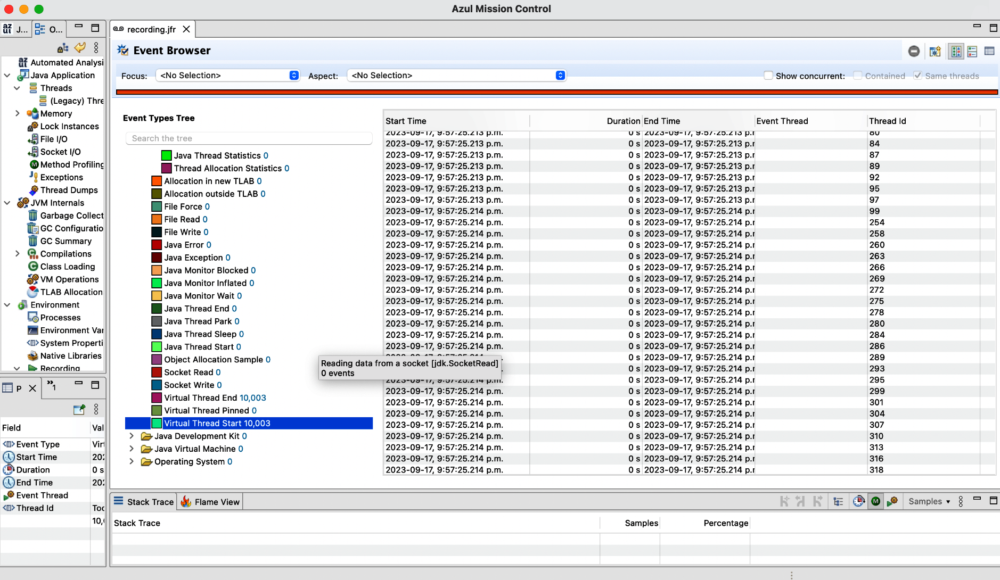

# Chapter 2: Understanding Virtual Threads

Virtual threads fundamentally change how concurrent programs are written, making it practical to use threads as the primary unit of concurrency at a massive scale. Unlike traditional threads managed by the operating system, virtual threads are lightweight and managed entirely by the Java Virtual Machine (JVM).

## What Is a Virtual Thread?

Virtual threads operate highly efficiently because they are managed directly by the JVM. 
- **Carrier Threads**: Virtual threads do not run directly on the CPU. They are executed on top of **carrier threads**, which are essentially underlying platform threads.
- **Fork/Join Backing**: These carrier threads are provided by a specialized, work-stealing `ForkJoinPool` (operating in FIFO mode, unlike parallel streams which use LIFO). This allows virtual threads to inherit highly efficient task distribution algorithms.
- **Configurable Parallelism**: The number of platform threads available to schedule virtual threads can be configured using the `jdk.virtualThreadScheduler.parallelism` system property. By default, it matches the number of available hardware processors.

```bash
# Setting the system property via command line
java -Djdk.virtualThreadScheduler.parallelism=4 -jar yourApp.jar
```

```java
// Setting the system property in code (must be done before application context starts)
System.setProperty("jdk.virtualThreadScheduler.parallelism", "4");
```

## The Two Kinds of Threads in Java

With the introduction of virtual threads, Java now operates with two distinct thread types:

### 1. Platform Threads
- Also known as *traditional*, *classical*, *native*, or *OS threads*.
- **Heavyweight**: Executed through the underlying operating system.
- **1:1 Mapping**: They maintain a strict one-to-one mapping between the Java thread and the kernel thread.
- **Scheduling**: Rely entirely on the OS for scheduling and context-switching.

### 2. Virtual Threads
- Also known as *user-mode* or *lightweight threads*.
- **Lightweight**: Managed entirely by the JVM, allowing millions to be created without exhausting system resources.
- **M:N Mapping**: They are not mapped directly to kernel threads. Instead, the JVM efficiently multiplexes millions of virtual threads onto a much smaller pool of OS carrier threads.

> **Image Description**: Figure 2-1 illustrates the internals of thread scheduling. It shows a large number (1 to n) of "Virtual threads" sitting at the top level. These are mapped downward through the "JDK scheduler (ForkJoinPool—FIFO)" onto a smaller pool of "Carrier Java threads". Finally, these carrier threads maintain a 1:1 mapping downward onto the lowest level, the physical "OS threads" managed by the "OS scheduler".



## Key Differences from Platform Threads

1. **Lightweight**: Use drastically less memory and fewer resources.
2. **Scheduling**: Scheduled by the JVM rather than the OS, bypassing heavy OS context-switching overhead.
3. **Blocking Tolerance**: No performance penalty during blocking operations (like I/O or sleep). When blocked, a virtual thread instantly yields control back to its carrier thread, allowing other virtual threads to continue executing.
4. **Seamless Integration**: Designed to integrate with existing codebases using familiar coding abstractions (like `java.lang.Thread` and `ExecutorService`).


## Setting Up Your Environment

Virtual threads are a stable, production-ready feature as of **JDK 21**. 

To manage multiple JDK versions efficiently, the book recommends using **SDKMAN**:

```bash
# List available Java versions
sdk list java
```

> **Image Description**: Figure 2-2 displays the terminal output of the `sdk list java` command, showing a table of available Java versions for macOS ARM 64bit from various vendors like Corretto, Gluon, GraalVM CE, and Java.net.



```bash
# Install a specific JDK 21 distribution (e.g., OpenJDK)
sdk install java 21.0.2-open
```

> [!NOTE]
> JDK 21 is currently the most widely adopted version for virtual threads in production environments and is the minimum version required to use them safely without preview flags.


## Creating Virtual Threads in Java

There are several ways to instantiate virtual threads depending on your use case, ranging from simple direct methods to integrating them into existing codebases.

### 1. The Direct Approach
For simple fire-and-forget use cases, use the `Thread.startVirtualThread()` method.

```java
public static void main(String[] args) throws InterruptedException {
    Thread vThread = Thread.startVirtualThread(() -> {
        System.out.println("Virtual threads make concurrency effortless!");
    });
    
    // You MUST wait for the virtual thread to finish
    vThread.join(); 
}
```

> [!IMPORTANT]
> **Virtual Threads are Daemon Threads**
> By default, all virtual threads are daemon threads. This means the JVM will shut down the moment the main thread completes, immediately terminating any running virtual threads. You must use `.join()` or a structured executor to ensure the virtual thread completes its task before the program exits.

### 2. The Thread Builder API
For more control over the creation parameters, Java provides a fluent `Thread.ofVirtual()` builder API.

**Starting immediately:**
```java
var startedThread = Thread.ofVirtual()
    .start(() -> System.out.println("Hello world!"));
    
startedThread.join();
```

**Starting later:**
```java
var unstartedThread = Thread.ofVirtual()
    .unstarted(() -> System.out.println("Hello world!"));

// The thread is created but idle. Start it explicitly when needed:
unstartedThread.start();
```

### 3. The Executor API (For Existing Codebases)
If your application already relies on the `ExecutorService` framework, migrating to virtual threads is incredibly smooth.

```java
// Replaces Executors.newFixedThreadPool() or newCachedThreadPool()
try (var virtualExecutor = Executors.newVirtualThreadPerTaskExecutor()) {
    Future<String> future = virtualExecutor.submit(this::callService);
    // Process the future result
}
```
This pattern is especially vital for large projects where immediately refactoring massive codebases away from `ExecutorService` would be completely impractical.


## Adapting to Virtual Threads

The introduction of virtual threads brought changes to Java's Thread API, but it heavily prioritizes developer familiarity. Under the hood, a virtual thread is simply an instance of the standard `java.lang.Thread` class.

### Interruption and Cancellation Semantics
Cancellation works identically for both platform and virtual threads. You interrupt a thread by invoking the `interrupt()` method. The code within the thread must still catch `InterruptedException` or manually check the interrupted flag.

**Platform Thread Interruption Example:**
```java
Thread platformThread = Thread.ofPlatform().start(() -> {
    try {
        for (int i = 0; i < 5; i++) {
            Thread.sleep(1000); // Simulate work
        }
    } catch (InterruptedException e) {
        System.out.println("Platform thread interrupted!");
    }
});

// Main thread interrupts after 2.5 seconds
Thread.sleep(2500); 
platformThread.interrupt();
```

**Virtual Thread Interruption Example:**
```java
Thread virtualThread = Thread.ofVirtual().start(() -> {
    try {
        for (int i = 0; i < 5; i++) {
            Thread.sleep(1000); // Automatically yields to other virtual threads
        }
    } catch (InterruptedException e) {
        System.out.println("Virtual thread interrupted!");
    }
});

// Main thread interrupts after 2.5 seconds
Thread.sleep(2500); 
virtualThread.interrupt();
```

Both examples produce the exact same execution output. The **key difference** is hidden from the developer: when the virtual thread calls `Thread.sleep()`, it automatically yields its underlying carrier thread rather than actually blocking a physical OS thread.

### Immutable Characteristics of Virtual Threads

Because of their lightweight and managed nature, virtual threads enforce several immutable characteristics that simplify their management compared to platform threads:

1. **Thread Groups**: All virtual threads belong to a single, global thread group (`java.lang.ThreadGroup[name=VirtualThreads,maxpri=10]`). You cannot assign them to custom thread groups.
   > **What is a Thread Group?** 
   > Historically, a `ThreadGroup` is a legacy Java data structure designed to bundle multiple threads together so they could be controlled and monitored as a single collective unit (e.g., interrupting them all at once). However, modern Java concurrency heavily discourages their use, preferring structured frameworks like `ExecutorService` for managing thread lifecycles. Because virtual threads represent the modern era of Java, they intentionally restrict and largely bypass this legacy grouping mechanism.
2. **Thread Priority**: Virtual threads always run at `NORM_PRIORITY` (5). Calling `setPriority()` on a virtual thread does absolutely nothing.
3. **Daemon Status**: All virtual threads are daemon threads by default. Attempting to change this by calling `setDaemon(false)` has no effect.

### Thread API Updates and Deprecations

With the modernization of Java concurrency, several Thread API updates occurred:

**New Additions:**
- `Thread::isVirtual`: An instance method used to check if a thread is a virtual thread.
- `join(Duration)` and `sleep(Duration)`: New convenience methods introduced in Java 19 that accept `java.time.Duration` objects.
- `threadId()`: A new `final` method introduced to replace the old `getId()` method.

**Deprecations and Removals:**
- The old `getId()` method is deprecated.
- Since Java 20, unsafe legacy methods like `stop()`, `suspend()`, `resume()`, and `countStackFrames()` will explicitly throw an `UnsupportedOperationException` for both platform and virtual threads.

### Minor Limitations

Virtual threads do have a few minor observability limitations compared to platform threads:
- The static method `Thread::getAllStackTraces()` will **only** return the stack traces of platform threads. It completely ignores virtual threads.
- There is currently no API to programmatically discover which platform carrier thread is executing a specific virtual thread at any given moment.

Overall, the broad similarity to the traditional Thread API makes the transition almost invisible. Developers can continue using familiar patterns while reaping massive performance rewards.


## Demonstrating Virtual Thread Scalability

Virtual threads allow Java applications to scale to millions of concurrent tasks simply because they are not bottlenecked by physical OS threads.

Consider the following example: submitting 10,000 concurrent tasks that simply sleep for one second.

```java
try (var executor = Executors.newVirtualThreadPerTaskExecutor()) {
    IntStream.range(0, 10_000).forEach(i -> {
        executor.submit(() -> {
            Thread.sleep(Duration.ofSeconds(1));
            return i;
        });
    });
}
```

Because virtual threads yield their carrier threads during `sleep()`, the JDK can easily process all 10,000 virtual threads concurrently using an extremely minimal number of OS threads (potentially just 1!).

By contrast, using `Executors.newCachedThreadPool()` (platform threads) would spawn 10,000 physical OS threads, likely causing the application to crash. Using `Executors.newFixedThreadPool(200)` would force the tasks to run sequentially in batches of 200, drastically increasing execution time.

### The True Purpose: Throughput, Not Speed

> [!WARNING]
> Virtual threads do **not** run tasks faster than platform threads. They simply allow you to run *more tasks simultaneously*, exponentially increasing the system's **throughput**.

Virtual threads are highly effective for **I/O-bound** workloads (like web servers waiting on databases or API calls). They are completely useless for **CPU-bound** workloads (like heavy mathematical calculations), where the physical processing speed of the CPU core is the actual bottleneck.

### The Fundamental Principle: Little's Law

The scalability of virtual threads can be explained through **Little's Law**, an elegant formula used in queuing theory:

`λ = N / d`

- **Throughput (λ)**: The rate at which requests are processed.
- **Concurrency (N)**: The number of active, simultaneous requests.
- **Latency/Response Time (d)**: The time it takes to process a single request.

With traditional platform threads, `N` (concurrency) is hard-capped by the OS (e.g., a limit of 1,000 threads). Once you hit that cap, the only mathematical way to increase Throughput (`λ`) is to decrease Latency (`d`), which is often impossible when waiting on a slow external database.

Virtual threads eliminate the hard cap on `N`. Because they are lightweight, you can scale `N` into the millions, immediately multiplying the overall Throughput (`λ`) without needing to change how the tasks are written.

### The Little's Law Benchmark

We can prove this mathematical principle by benchmarking virtual threads against traditional, fixed thread pools.

```java
import java.time.Duration;
import java.time.Instant;
import java.util.concurrent.ExecutorService;
import java.util.concurrent.Executors;
import java.util.concurrent.atomic.AtomicLong;
import java.util.stream.IntStream;

public class LittleLawExample {
    public static void main(String[] args) {
        int numTasks = 10000;
        int avgResponseTimeMillis = 500; // Simulated I/O latency
        
        // Simulates an I/O-bound database query
        Runnable ioBoundTask = () -> {
            try {
                Thread.sleep(Duration.ofMillis(avgResponseTimeMillis));
            } catch (InterruptedException e) {
                Thread.currentThread().interrupt();
            }
        };
            
        benchmark("Virtual Threads", 
            Executors.newVirtualThreadPerTaskExecutor(), ioBoundTask, numTasks);
        benchmark("Fixed ThreadPool (100)", 
            Executors.newFixedThreadPool(100), ioBoundTask, numTasks);
        benchmark("Fixed ThreadPool (1000)", 
            Executors.newFixedThreadPool(1000), ioBoundTask, numTasks);
    }

    static void benchmark(String type, ExecutorService executor, Runnable task, int numTasks) {
        Instant start = Instant.now();
        AtomicLong completedTasks = new AtomicLong();
        
        try (executor) {
            IntStream.range(0, numTasks)
                .forEach(i -> executor.submit(() -> {
                    task.run();
                    completedTasks.incrementAndGet();
                }));
        }
        
        long duration = Duration.between(start, Instant.now()).toMillis();
        double throughput = (double) completedTasks.get() / duration * 1000;
        
        System.out.printf("%-25s - Time: %5dms, Throughput: %8.2f tasks/s%n", 
            type, duration, throughput);
    }
}
```

**Benchmark Output:**
```text
=== Little's Law Throughput Comparison ===
Testing 10000 tasks with 500ms latency each
Virtual Threads           - Time:   552ms, Throughput: 18115.94 tasks/s
Fixed ThreadPool (100)    - Time: 50381ms, Throughput:   198.49 tasks/s
Fixed ThreadPool (1000)   - Time:  5080ms, Throughput:  1968.50 tasks/s
```

The data shows that for heavily I/O-bound tasks, virtual threads perfectly process all 10,000 tasks in nearly the exact 500ms latency window, resulting in a staggering throughput of ~18,115 tasks per second. A platform pool heavily restricted to 1,000 threads takes over 5,000ms to clear the same workload.


### The Practical Implications

The primary implication of virtual threads is that they free developers from constantly tweaking or rethinking their imperative programming models just to achieve high throughput. 

By simply swapping in virtual threads, you mathematically increase `N` (Concurrency) in Little's Law. This is crucial for web applications where latency `d` is tied to unavoidable network/disk I/O limits out of the developer's control.

> [!CAUTION]
> **Not a Silver Bullet**
> Virtual threads will **only** fix throughput bottlenecks caused by threads being blocked waiting for I/O. If your application's actual bottleneck is the amount of raw computational CPU power available (a CPU-bound workload), virtual threads will offer absolutely no benefit.

---

## How Virtual Threads Work Under the Hood

To understand why virtual threads are so scalable, it is necessary to explore their internal memory and execution mechanics.

### 1. Stack Frames and Memory Management
Traditional OS threads allocate massive, monolithic blocks of memory for their stack frames directly from the operating system (typically 1-2MB per thread). This requires you to estimate stack sizes and wastes a massive amount of RAM.

In stark contrast, a virtual thread stores its stack frames in **Java's garbage-collected heap**. 
- Its memory footprint starts at just a few hundred bytes.
- The memory allocation dynamically grows and shrinks exactly as the call stack changes.
- This dynamic, heap-based memory management is what physically allows millions of virtual threads to exist simultaneously.

### 2. Carrier Threads and OS Involvement
The host operating system is completely oblivious to the existence of virtual threads; the OS only schedules physical platform threads.
- When a virtual thread is ready to execute, the JVM **"mounts"** it onto an available platform thread (known as the **carrier thread**).
- These carrier threads are strictly managed by a specialized `ForkJoinPool`.
- Mounting involves temporarily copying the virtual thread's tiny stack frames from the Java heap directly onto the carrier thread's physical stack to execute the code.

### 3. Handling Blocking Operations
The magic of virtual threads lies in their non-blocking nature. 
- When a virtual thread hits a blocking operation (like a network request or `Thread.sleep()`), it is instantly **"unmounted"** from the carrier thread.
- Its modified stack frames are copied off the carrier thread and pushed back into the Java heap for safe storage.
- The carrier thread is immediately freed up to mount and execute an entirely different virtual thread.
- This non-blocking yielding functionality has been deeply retrofitted into almost all blocking APIs across the entire JDK.

### 4. Transparency and Invisibility
The JVM handles this rapid mounting and unmounting completely transparently. 
- You cannot write Java code to peek at or interact with the underlying carrier thread. 
- Even `ThreadLocal` variables belonging to the carrier thread are strictly shielded and invisible to the virtual thread riding it.

This abstraction functions almost identically to how computer **Virtual Memory** works. Just as an OS pages unused RAM out to a hard disk to create the illusion of infinite memory, the JVM "pages out" inactive virtual thread stacks to the heap to create the illusion of infinite threads across a scarce pool of physical carrier threads.


## Simplifying Asynchronous Operations

Because virtual threads gracefully yield the carrier thread when they are blocked, the historic burden of avoiding blocking calls is entirely lifted. 

Developers no longer need complex reactive programming pipelines or heavily nested `CompletableFuture` callbacks. Instead, you can simply call `.get()` on a standard `Future` and comfortably wait for the result without causing performance degradation or exhausting OS resources.

### Simple Task Aggregation
Fetching independent data points from multiple APIs and aggregating them becomes beautifully straightforward:

```java
public String generatePhrase() throws ExecutionException, InterruptedException {
    try (var executor = Executors.newVirtualThreadPerTaskExecutor()) {
        
        // Both network calls execute concurrently on virtual threads
        Future<String> adjectiveFuture = executor.submit(this::fetchAdjective);
        Future<String> nounFuture = executor.submit(this::fetchNoun);
        
        // We can safely block here using .get()
        String adjective = adjectiveFuture.get();
        String noun = nounFuture.get();
        
        return adjective + " " + noun;
    }
}
```

### Advanced Task Aggregation with `invokeAll`
For scenarios where you have a list of similar tasks (e.g., parallel image processing), you can use the standard `invokeAll()` method. This executes a collection of `Callable` tasks concurrently, and you can simply iterate over the returning `Future` objects, confidently blocking to extract each one.

```java
package ca.bazlur.modern.concurrency.c02;

import javax.imageio.ImageIO;
import java.awt.image.BufferedImage;
import java.io.File;
import java.io.IOException;
import java.util.List;
import java.util.concurrent.*;

public class ImageProcessingExample {
    public static void main(String[] args)
    throws InterruptedException, ExecutionException {
        try (var service = Executors.newVirtualThreadPerTaskExecutor()) {
            
            // A list of different image transformation tasks
            List<Callable<BufferedImage>> tasks = List.of(
                () -> resize("https://example.com/img1.jpg", 200, 200),
                () -> grayscale("https://example.com/img2.jpg"),
                () -> rotate("https://example.com/img3.jpg", 90)
            );
            
            // Submits all tasks simultaneously; they execute concurrently on separate virtual threads.
            List<Future<BufferedImage>> results = service.invokeAll(tasks);
            
            // Process and save transformed images
            int i = 1;
            // Iterates through the results in the exact same order as the original task list
            for (Future<BufferedImage> future : results) {
                // Safely blocking to retrieve each result
                BufferedImage image = future.get();
                ImageIO.write(image, "jpg", new File("output_image" + i + ".jpg"));
                i++;
            }
        } catch (IOException e) {
            throw new RuntimeException(e);
        }
    }
    
    static BufferedImage resize(String url, int width, int height) {
        // Logic to download and resize the image goes here
        return null;
    }
    
    static BufferedImage grayscale(String url) {
        // Logic to download and convert the image to grayscale goes here
        return null;
    }
    
    static BufferedImage rotate(String url, double angle) {
        // Logic to download and rotate the image goes here
        return null;
    }
}
```

---

## The Promise of Structured Concurrency

While using `Executors.newVirtualThreadPerTaskExecutor()` is powerful, calling `Future.get()` in this manner lacks robust safety mechanics. For example, if one of the `Future.get()` calls throws an exception or blocks indefinitely without a timeout, the other running tasks are completely orphaned, leading to resource leaks.

To solve this, modern Java introduced **Structured Concurrency** (JEP 505) to cleanly encapsulate asynchronous tasks. 

```java
public static void main(String[] args) {
    // A structured scope encapsulates all the forked subtasks
    try (StructuredTaskScope scope = StructuredTaskScope.open()) {
        
        StructuredTaskScope.Subtask<String> subtask1 = 
            scope.fork(() -> fetchData("https://api1.example.com"));
            
        StructuredTaskScope.Subtask<String> subtask2 =
            scope.fork(() -> fetchData("https://api2.example.com"));
            
        // Wait for all subtasks to finish
        scope.join();
        
        var result = subtask2.get() + subtask1.get();
        System.out.println(result);
        
    } catch (InterruptedException e) {
        throw new RuntimeException(e);
    }
}
```
> [!NOTE]
> The preceding code requires JDK 25 with preview features enabled (`--enable-preview`).

### Benefits of Structured Concurrency
- **Fail-Fast Mechanics**: If any subtask running within the `StructuredTaskScope` fails and throws an exception, all other running tasks inside the scope are automatically canceled immediately.
- **Timeouts**: The scope makes it extremely easy to enforce strict timeouts across the entire block of concurrent tasks. If the timeout elapses, all running tasks are violently canceled, guaranteeing the application never hangs.
- **Declarative Style**: It handles the low-level thread lifecycle management and intricate cancellation logic under the hood, enabling developers to write high-level, declarative concurrent code.


## Managing Resource Constraints with Rate Limiting

Virtual threads practically offer an open door to unlimited concurrency. You could comfortably spin up one million virtual threads to accept one million incoming HTTP requests. 

However, this introduces a massive new problem: **downstream resource exhaustion**. While the JVM can handle a million virtual threads, the underlying legacy database or the third-party HTTP API you are calling absolutely cannot handle one million simultaneous connections. 

In the old paradigm, the thread pool implicitly acted as a rate limiter. If your `ExecutorService` only had 1,000 threads, it was physically impossible to hit the database with more than 1,000 simultaneous queries. Because virtual threads remove this hard cap, you must manually implement **explicit rate-limiting mechanisms**.

### Understanding Semaphores in Java

The primary mechanism for manually throttling concurrency is the `java.util.concurrent.Semaphore`. A semaphore acts as a gatekeeper for a shared resource by managing a strict set of "permits". 

A thread must invoke `.acquire()` to grab a permit before executing critical code. Once finished, it must return the permit via `.release()`. If no permits are available, the `.acquire()` method blocks the thread until another thread releases one.

### Why Use a Semaphore?

In the platform thread era, developers often used the thread pool size itself as a crude rate limiter. If a backend database could only handle 100 concurrent queries, developers would create a dedicated `Executors.newFixedThreadPool(100)` specifically for those database calls.

With virtual threads, this strategy fundamentally breaks. Virtual threads are designed to be spun up instantly per-task without arbitrary pool sizing limits. Because virtual threads decouple concurrency from physical OS threads, you must decouple your rate-limiting logic from thread pool sizes.

This is why `Semaphore` is the perfect tool for the modern era. It explicitly guards the *resource*, entirely independent of how many millions of virtual threads might be waiting in line.

### Rate Limiting with `Semaphore`

Here is a highly robust, production-ready example of how to wrap a fragile resource (like a database connection) with a semaphore to prevent it from being crushed by virtual threads.

```java
import java.util.Optional;
import java.util.Random;
import java.util.concurrent.Semaphore;
import java.util.concurrent.TimeUnit;
import java.util.concurrent.atomic.AtomicInteger;

public class MonitoredResourcePool {
    
    private final Semaphore semaphore;
    // Trackers for monitoring usage (useful for capacity planning)
    private final AtomicInteger activeConnections;
    private final AtomicInteger peakConnections;

    public MonitoredResourcePool(int resourceCount) {
        // By passing 'true', we create a FAIR semaphore (grants permits in FIFO order to prevent thread starvation)
        this.semaphore = new Semaphore(resourceCount, true);
        this.activeConnections = new AtomicInteger(0);
        this.peakConnections = new AtomicInteger(0);
    }

    public Optional<String> useResource(String query) {
        boolean acquired = false;
        try {
            // tryAcquire prevents indefinite blocking. If it can't get a permit within 5 seconds, it bails out.
            acquired = semaphore.tryAcquire(5, TimeUnit.SECONDS);
            
            if (!acquired) {
                return Optional.empty(); // Graceful degradation instead of hanging indefinitely
            }
            
            // Thread-safe statistics collection
            int current = activeConnections.incrementAndGet();
            peakConnections.updateAndGet(peak -> Math.max(peak, current));
            
            // Execute the heavily restricted database call
            return queryDatabase(query);
            
        } catch (InterruptedException e) {
            // Proper thread interruption handling
            Thread.currentThread().interrupt();
            return Optional.empty();
        } finally {
            // ALWAYS release in a finally block to prevent permanent resource leaks
            if (acquired) {
                activeConnections.decrementAndGet();
                semaphore.release();
            }
        }
    }

    public int getCurrentActiveConnections() {
        return activeConnections.get();
    }

    public int getPeakConnections() {
        return peakConnections.get();
    }

    private Optional<String> queryDatabase(String query) {
        try {
            Thread.sleep(new Random().nextInt(500) + 500); // Simulate DB delay
        } catch (InterruptedException e) {
            Thread.currentThread().interrupt();
            return Optional.empty();
        }
        return Optional.of("Result for: " + query);
    }
}
```

### Proving the Throttle

We can test the protective nature of our semaphore by purposely attempting to bombard the pool with 50 concurrent virtual threads when the pool only allows 5 concurrent connections.

```java
package ca.bazlur.modern.concurrency.c02;

import java.util.ArrayList;
import java.util.List;
import java.util.Optional;
import java.util.concurrent.*;

public class ResourcePoolTest {
    public static void main(String[] args) throws Exception {
        int maxConcurrentThreads = 5;
        int totalRequests = 50;
        var pool = new MonitoredResourcePool(maxConcurrentThreads);
        var futures = new ArrayList<Future<Optional<String>>>();
        
        try (var executor = Executors.newVirtualThreadPerTaskExecutor()) {
            
            // Bombard the pool with 50 concurrent requests
            for (int i = 0; i < totalRequests; i++) {
                final int taskId = i;
                futures.add(executor.submit(() -> pool.useResource("Query " + taskId)));
            }
            
            int successCount = 0;
            int timeoutCount = 0;
            
            for (Future<Optional<String>> future : futures) {
                Optional<String> result = future.get();
                if (result.isPresent()) {
                    successCount++;
                } else {
                    timeoutCount++;
                }
            }
            
            System.out.printf("""
                requests : %d
                successful: %d
                timed-out : %d
                peak usage: %d%n""",
                totalRequests, successCount, timeoutCount, pool.getPeakConnections());
            
            assert pool.getPeakConnections() <= maxConcurrentThreads 
                : "Peak connections exceeded limit!";
        }
    }
}
```

**Output:**
```text
requests : 50
successful: 32
timed-out : 18
peak usage: 5
```

Because virtual thread blocking is virtually free on the JVM, using `.acquire()` essentially acts as a highly efficient parking brake. The 50 virtual threads are instantly halted and unmounted from the carrier threads until the semaphore allows them to proceed. 

### Critical Limitations of Semaphores

> [!CAUTION]
> **Permit Accounting Bugs**
> Semaphores have a highly dangerous quirk: **they do not track which specific thread acquired which permit.** Any thread can release a permit, even one it never originally acquired.

Here is how easily things can be broken:

```java
// Start with 2 permits
Semaphore semaphore = new Semaphore(2);

// Thread 1: Acquires but forgets to release (Leaks a permit)
Thread.ofVirtual().start(() -> {
    semaphore.acquire();
    // Oops! No release
});

// Thread 2: Releases without ever acquiring (Creates phantom permits)
Thread.ofVirtual().start(() -> {
    semaphore.release(); // BUG!
    semaphore.release(); // Double BUG!
});

// Result: We now have 3+ permits instead of 2! The rate limit is broken.
```

If a rate limit is accidentally expanded in production due to an unwarranted `.release()`, your downstream database connections will be immediately exceeded and potentially crushed.

**The Bulletproof Pattern**
Always strictly enforce the acquisition and release of the semaphore in a unified `try-finally` block:

```java
public <T> T useResource(Callable<T> task) throws Exception {
    semaphore.acquire(); // Acquire BEFORE the try block
    try {
        return task.call();
    } finally {
        semaphore.release(); // ALWAYS releases
    }
}
```


## Limitations of Virtual Threads

Despite their revolutionary potential, virtual threads have a few critical limitations that must be deeply understood to prevent performance catastrophes in production.

### 1. Pinning

The core magic of virtual threads is that they **"unmount"** from the physical carrier thread whenever they hit a blocking operation. However, there are two specific scenarios where the JVM physically cannot unmount the virtual thread. 

When a virtual thread is blocked but cannot unmount, it is considered **"pinned"** to its carrier thread. This means the underlying physical OS thread is completely frozen and blocked alongside it. If too many virtual threads get pinned, you will completely exhaust the `ForkJoinPool` carrier threads, halting your entire application.

Pinning occurs exclusively in two scenarios:
1. When a virtual thread is executing a `synchronized` block or method.
2. When a virtual thread is executing a native method or a foreign function (JNI).

#### Diagnosing and Fixing Pinning

The JDK provides robust tools to diagnose pinning:
- **JFR Events**: The JDK Flight Recorder emits a `jdk.VirtualThreadPinned` event whenever a virtual thread is pinned.
- **Trace Flag**: Starting the JVM with `-Djdk.tracePinnedThreads=full` will force the JVM to print a stack trace to the console every time a thread gets pinned during a blocking operation.

**The Fix:** 
If you find a `synchronized` block that contains a long-running blocking operation (like an I/O call), you must completely replace the `synchronized` keyword with a `java.util.concurrent.locks.ReentrantLock`. 

`ReentrantLock` provides the exact same mutual exclusion guarantees as `synchronized`, but it is fully compatible with virtual threads and allows them to safely unmount.

> [!NOTE]
> You do not need to replace every single `synchronized` block in your entire codebase—only the blocks that actually perform long-running blocking operations inside of them. (The Java team is also actively working to rewrite the JVM's internals in a future JDK release so that `synchronized` blocks will eventually stop pinning virtual threads).

Here is a complete example demonstrating a pinned thread and how to run it with the trace flag enabled:

```java
package ca.bazlur.modern.concurrency.c02;

import java.time.Duration;

public class ThreadPinnedExample {

    public static void main(String[] args) throws InterruptedException {
        // We start a virtual thread and execute a synchronized block
        var vThread = Thread.ofVirtual().start(() -> {
            synchronized (ThreadPinnedExample.class) {
                try {
                    // This blocking operation causes the virtual thread to pin its carrier thread!
                    Thread.sleep(Duration.ofSeconds(1));
                } catch (InterruptedException e) {
                    throw new RuntimeException(e);
                }
            }
        });
        
        vThread.join();
    }
}
```

To see the pinning in action, compile and run the class with the trace flag:

```bash
javac ca/bazlur/modern/concurrency/c02/ThreadPinnedExample.java
java -Djdk.tracePinnedThreads=full ca.bazlur.modern.concurrency.c02.ThreadPinnedExample
```

You will see output similar to this, showing the exact line where the virtual thread parked while pinned:
```text
Thread[#21,ForkJoinPool-1-worker-1,5,CarrierThreads]
    java.base/java.lang.VirtualThread$VThreadContinuation.onPinned(VirtualThread.java:183)
    java.base/jdk.internal.vm.Continuation.yield(Continuation.java:393)
    java.base/java.lang.VirtualThread.yieldContinuation(VirtualThread.java:370)
    java.base/java.lang.VirtualThread.park(VirtualThread.java:582)
    ...
    ca.bazlur.modern.concurrency.c02.ThreadPinnedExample.lambda$main$0(ThreadPinnedExample.java:13) <== monitors:1
```

#### Addressing the Pinning Problem with `ReentrantLock`

To fix the pinning issue demonstrated above, we simply replace the rigid `synchronized` block with a `java.util.concurrent.locks.ReentrantLock`. Unlike `synchronized`, `ReentrantLock` is fully aware of virtual threads and correctly allows them to unmount from the carrier thread when blocked.

Here is the corrected version of the code:

```java
package ca.bazlur.modern.concurrency.c02;

import java.time.Duration;
import java.util.concurrent.locks.ReentrantLock;

public class ThreadUnpinnedExample {

    // Create a shared lock instance
    private static final ReentrantLock lock = new ReentrantLock();

    public static void main(String[] args) throws InterruptedException {
        var vThread = Thread.ofVirtual().start(() -> {
            lock.lock(); // Acquire the lock
            try {
                // The virtual thread can now safely unmount during this sleep!
                Thread.sleep(Duration.ofSeconds(1));
            } catch (InterruptedException e) {
                throw new RuntimeException(e);
            } finally {
                lock.unlock(); // Always release in a finally block
            }
        });
        
        vThread.join();
    }
}
```

If you compile and run this updated class with `-Djdk.tracePinnedThreads=full`, the JVM will print absolutely nothing. The virtual thread successfully unmounts during the `sleep()` and the carrier thread is completely freed up to run other tasks.

#### The Park/Unpark Mechanism

The reason `ReentrantLock` solves the pinning issue is because it relies on the `LockSupport.park()` and `unpark()` primitives.

This mechanism is a low-level thread coordination primitive that forms the foundation for many higher-level concurrency utilities. When a virtual thread calls `LockSupport.park()`, the JVM is smart enough to detect it. The runtime can gracefully:
1. Save the virtual thread's state.
2. Unmount it from the carrier thread.
3. Completely free up that carrier thread for other tasks.
4. Later, remount the virtual thread on any available carrier when `LockSupport.unpark()` is finally called.

This differs significantly from object monitors (used natively by `synchronized`), which strictly require the virtual thread to remain rigidly mounted to its carrier.

#### Nuances of Synchronized Blocks

While `synchronized` absolutely causes pinning, its real-world impact varies entirely on *what* is inside the block:

**Example 1: Minimal Risk (Acceptable)**
```java
synchronized (this) {
    return this.a + this.b;
}
```
Because the operation is just returning basic in-memory math, the virtual thread will be unpinned almost instantly. There is no I/O blocking, minimizing any negative impact.

**Example 2: High Risk (Catastrophic)**
```java
synchronized (this) {
    var response = httpClient.sendBlockingRequest(request);
    return response;
}
```
Here, the `synchronized` block wraps a massive, long-running network request. The virtual thread will remain heavily pinned for the entire duration of the HTTP wait, destroying your concurrency gains and starving the `ForkJoinPool`. This is the exact scenario where you **must** refactor to `ReentrantLock`.

> [!TIP]
> **JEP 491: Synchronize Virtual Threads Without Pinning (JDK 24)**
> Delivered in JDK 24, this feature takes a significant step forward by reworking the `synchronized` keyword to be virtual-thread-friendly. It allows virtual threads to acquire, hold, and release monitors independently of their carrier threads, effectively eliminating the pinning problem for `synchronized` blocks. The JVM scheduler now allows blocked virtual threads to unmount from platform threads.
> 
> *However, there is a catch:* To take advantage of these improvements, you need to migrate to JDK 24+. Since JDK 21 is still the long-term support (LTS) version that most applications rely on, you must remain aware of pinning issues and design applications accordingly using `ReentrantLock` when necessary.
> 
> Also note that pinning isn't *completely* eliminated even in JDK 24. Some edge cases such as blocking inside class initializers, waiting on class initialization by another thread, or resolving symbolic references during class loading or native code calls will still result in pinning. If you run the aforementioned `ThreadPinnedNativeMethodExample` under JDK 25, you will notice the thread *does* successfully unmount and switch carrier workers!

#### Native Method Invocation and Pinning

While `synchronized` is being addressed by the JDK team, the second cause of pinning remains: **Native Methods** (and the Foreign Function & Memory API).

When a virtual thread executes a native C/C++ method, the JVM completely loses its ability to inspect or control execution.
- Native code stack frames cannot be magically saved and restored to the Java heap like standard Java code.
- Native code often holds thread-local state or interacts directly with OS-level thread primitives that cannot be seamlessly migrated between carrier threads.

Because of these profound structural limitations, the JVM is forced to rigidly pin the virtual thread to its carrier thread for the entire duration of the native method call.

To see this in action, imagine compiling the following simple native C function into a shared library (`.so`, `.dylib`, or `.dll`):

```c
#include <unistd.h>
// Function definition
int addNumbers(int number1, int number2) {
    // Pause execution for 200,000 microseconds (200 milliseconds)
    usleep(200000);
    return number1 + number2;
}
```

If we invoke this compiled library via Java's modern Foreign Function & Memory API (FFM), we can explicitly prove that the virtual thread is completely pinned:

```java
import java.lang.foreign.*;
import java.lang.invoke.MethodHandle;
import java.nio.file.Path;
import java.util.List;
import java.util.stream.IntStream;

public class ThreadPinnedNativeMethodExample {
    public static void main(String[] args) {
        List<Thread> threadList = IntStream.range(0, 10)
            .mapToObj(i -> Thread.ofVirtual().unstarted(() -> {
                if (i == 0) {
                    // Check the carrier thread ID BEFORE the native call
                    System.out.println(Thread.currentThread());
                }
                
                // This is where the native method invocation occurs. 
                // During this call, the virtual thread becomes violently pinned to its carrier thread.
                int sum = invokeNativeAddNumbers(56, 11);
                
                if (i == 0) {
                    // Check the carrier thread ID AFTER the native call completes
                    System.out.println(Thread.currentThread());
                }
            })).toList();
            
        threadList.forEach(Thread::start);
        threadList.forEach(t -> {
            try { t.join(); } catch (InterruptedException e) { }
        });
    }
    
    static int invokeNativeAddNumbers(int a, int b) {
        // Assume FFM boilerplate to load and call the native "addNumbers" function
        return 0;
    }
}
```

**Output (JDK 21 - Pinning occurs):**
```text
VirtualThread[#20]/runnable@ForkJoinPool-1-worker-1
VirtualThread[#20]/runnable@ForkJoinPool-1-worker-1
```
The output proves that the exact same underlying `ForkJoinPool-1-worker-1` platform thread was trapped servicing the `VirtualThread[#20]` for the entire 200ms duration of the `usleep()` call in the native C code. The virtual thread was entirely unable to unmount.

**Output (JDK 25 - Pinning resolved via JEP 491):**
If you run the exact same code using JDK 25+, you will not see the pinning issue anymore:
```text
VirtualThread[#26]/runnable@ForkJoinPool-1-worker-1
VirtualThread[#26]/runnable@ForkJoinPool-1-worker-6
```
The output proves that the virtual thread successfully unmounted from `worker-1` before the native call, and when the native call finished, it resumed execution on a completely different carrier thread (`worker-6`).

**The Fix:**
If your application relies heavily on native calls, you may not see the full scalability benefits of virtual threads. You should consider:
- Batching native operations to reduce the frequency of crossing the boundary.
- Utilizing asynchronous native APIs where available.
- Re-implementing critical native logic in pure Java.

### 2. The Conundrum of ThreadLocal Variables in Virtual Threads

Historically, developers have heavily relied on `ThreadLocal` variables to confine data to a specific thread without needing explicit synchronization.
Classic use cases include:
1. **Resource Isolation:** Storing non-thread-safe resources like `SimpleDateFormat`.
2. **Implicit Context:** Passing hidden context (like User IDs, Database Connections, or Transaction IDs) down the call stack without having to pass them explicitly as method arguments.

#### Challenges with Virtual Threads

Virtual threads are designed to be spun up in the millions. This massive scale completely shatters the fundamental assumptions behind `ThreadLocal` usage:

1. **Memory Consumption:** If every single one of 1,000,000 virtual threads blindly creates its own copy of a massive `ThreadLocal` object (like a bloated user session object), your application will suffer a catastrophic Out Of Memory (OOM) crash almost instantly.
2. **Overhead:** Initializing and cleaning up `ThreadLocal` variables has a non-zero performance cost. Multiplying that overhead by a million concurrent tasks creates a severe bottleneck.
3. **Inheritance:** Virtual threads inherit `ThreadLocal` values from their parent threads. At massive scale, unintended inheritance can introduce subtle, incredibly difficult-to-trace bugs.

#### The Memory Exhaustion Example

Let's examine the real-world danger of blindly porting legacy `ThreadLocal` logic to virtual threads:

```java
import java.time.Duration;
import java.util.stream.IntStream;

public class ThreadLocalExample {
    public static void main(String[] args) {
        ThreadLocal<LargeObject> threadLocal = ThreadLocal.withInitial(LargeObject::new);
        
        var threadList = IntStream.range(0, 1000)
            .mapToObj(i -> Thread.ofVirtual().unstarted(() -> {
                LargeObject largeObject = threadLocal.get(); // Creates a 500 KB object per thread!
                useIt(largeObject);
                sleep();
            })).toList();
            
        threadList.forEach(Thread::start);
        threadList.forEach(thread -> {
            try { thread.join(); } catch (InterruptedException e) { Thread.currentThread().interrupt(); }
        });
    }

    private static void useIt(LargeObject largeObject) {
        System.out.println(largeObject.data.length);
    }

    private static void sleep() {
        try {
            Thread.sleep(Duration.ofMinutes(5));
        } catch (InterruptedException e) {
            throw new RuntimeException(e);
        }
    }

    static class LargeObject {
        private byte[] data = new byte[1024 * 500]; // 500 KB allocation
    }
}
```

In this example, 1,000 virtual threads are started, and each lazily initializes a 500 KB `LargeObject` inside a `ThreadLocal`. 
Because the `ThreadLocal` physically binds the object to the thread instance, 1,000 copies of the 500 KB array are aggressively allocated onto the heap. By opening JConsole after executing the program, we can directly observe this massive memory accumulation:



However, if we execute the exact same program *without* using `ThreadLocal`, the heap memory usage drops immediately and remains virtually flat, despite the involvement of the exact same 1,000 virtual threads:



**The Fix:**
Before migrating legacy enterprise codebases to virtual threads, you must ruthlessly audit their use of `ThreadLocal` variables. Moving forward, you must embrace two strategies:
1. **Rethinking Sharing:** Restructure your application to minimize the need for hidden `ThreadLocal` contexts entirely.
2. **Scoped Values:** In the future, Java plans to finalize **Scoped Values** (JEP 464) as a lightweight, immutable, memory-safe alternative specifically designed to solve this exact problem for virtual threads (covered later in Chapter 5).

---

### Conclusion

Virtual threads represent the biggest leap forward in Java's concurrency model in a decade. By eliminating the historical hard caps on thread creation, they allow applications to scale throughput to astronomical levels while letting developers keep their familiar, easy-to-read imperative programming style.

However, they are not a silver bullet. You must carefully audit for CPU-bound bottlenecks, resource exhaustion (using Semaphores), Pinning inside `synchronized` blocks, and `ThreadLocal` memory bombs to truly capitalize on their potential.


## Monitoring and Diagnostics

Migrating legacy applications to virtual threads requires a keen eye for compatibility issues like Pinning and `ThreadLocal` overuse. Fortunately, the JDK provides a robust suite of diagnostic tools.

### 1. Monitoring ThreadLocals

To discover exactly where your application is interacting with `ThreadLocal` variables inside a virtual thread, you can start the JVM with the `-Djdk.traceVirtualThreadLocals` flag.

```bash
java -Djdk.traceVirtualThreadLocals ThreadLocalExample.java
```

This flag will force the JVM to print a stack trace every time a `ThreadLocal` variable is accessed or initialized:
```text
VirtualThread[#25]/runnable@ForkJoinPool-1-worker-6
java.base/java.lang.ThreadLocal.setInitialValue(ThreadLocal.java:236)
java.base/java.lang.ThreadLocal.get(ThreadLocal.java:194)
com.example.myapp.ThreadLocalExample.lambda$main$0(ThreadLocalExample.java:13)
```

This output provides the exact class and line number (`ThreadLocalExample.java:13`) where the access occurred, allowing you to easily find and refactor problematic `ThreadLocal` usage.

### 2. Monitoring Pinning

We have multiple tools at our disposal to detect thread pinning, ranging from JVM flags to Java Flight Recorder (JFR) and `jcmd`.

#### Using the JVM Flag
As discussed earlier, running the JVM with `-Djdk.tracePinnedThreads=full` (or `short`) will print stack traces when a thread encounters a blocking operation while pinned. This is the fastest way to detect pinning during local development.

#### Using Java Flight Recorder (JFR)
Java Flight Recorder is an invaluable, low-overhead tool for monitoring virtual thread behavior in production. 

The JVM emits several highly useful JFR events for virtual threads:
- `jdk.VirtualThreadStart` / `jdk.VirtualThreadEnd`: Tracks the lifecycle of virtual threads (disabled by default).
- `jdk.VirtualThreadPinned`: **Crucial event** (enabled by default) that fires when a virtual thread is pinned for longer than 20ms.
- `jdk.VirtualThreadSubmitFailed`: Signals failures to start or unpark a virtual thread (e.g. resource exhaustion).

You can create a custom `.jfc` configuration file to explicitly enable and track these events:

```xml
<?xml version="1.0" encoding="UTF-8"?>
<configuration version="2.0" label="Virtual Thread Events" description="JFR config">
    <event name="jdk.VirtualThreadStart"><setting name="enabled">true</setting></event>
    <event name="jdk.VirtualThreadEnd"><setting name="enabled">true</setting></event>
    <event name="jdk.VirtualThreadPinned"><setting name="enabled">true</setting></event>
    <event name="jdk.VirtualThreadSubmitFailed"><setting name="enabled">true</setting></event>
</configuration>
```

To understand how to monitor virtual threads effectively, let's look at a code example designed to trigger these specific lifecycle events. We will start three virtual threads: one that finishes instantly, one that blocks in a `synchronized` block, and one that blocks using `ReentrantLock`.

```java
import java.time.Duration;
import java.util.concurrent.locks.Lock;
import java.util.concurrent.locks.ReentrantLock;

public class JFRVirtualThreadDemo {
    private static final Object syncLock = new Object();
    private static final Lock reentrantLock = new ReentrantLock();

    public static void main(String[] args) {
        // Triggering standard lifecycle events for a short-lived virtual thread
        Thread vThreadStartEnd = Thread.ofVirtual().unstarted(() -> {
            System.out.println("Virtual thread started and will end soon.");
        });
        vThreadStartEnd.start();
        joinThread(vThreadStartEnd);

        // Pinning with a legacy synchronized block
        Thread vThreadPinnedSync = Thread.ofVirtual().unstarted(() -> {
            synchronized (syncLock) {
                sleepUninterruptibly(Duration.ofMillis(500));
            }
        });
        vThreadPinnedSync.start();
        joinThread(vThreadPinnedSync);

        // No pinning using modern ReentrantLock
        Thread vThreadWithLock = Thread.ofVirtual().unstarted(() -> {
            reentrantLock.lock();
            try {
                sleepUninterruptibly(Duration.ofMillis(500));
            } finally {
                reentrantLock.unlock();
            }
        });
        vThreadWithLock.start();
        joinThread(vThreadWithLock);
    }

    private static void joinThread(Thread thread) {
        try {
            thread.join();
        } catch (InterruptedException e) {
            Thread.currentThread().interrupt();
        }
    }

    private static void sleepUninterruptibly(Duration duration) {
        boolean interrupted = false;
        try {
            long remainingNanos = duration.toNanos();
            long end = System.nanoTime() + remainingNanos;
            while (true) {
                try {
                    Thread.sleep(remainingNanos / 1_000_000, (int) (remainingNanos % 1_000_000));
                    return;
                } catch (InterruptedException e) {
                    interrupted = true;
                    remainingNanos = end - System.nanoTime();
                }
            }
        } finally {
            if (interrupted) {
                Thread.currentThread().interrupt();
            }
        }
    }
}
```

Let's examine what this demonstrates:
1. **Lifecycle Events:** JFR will record both `VirtualThreadStart` and `VirtualThreadEnd` events for the first thread, showing how quickly virtual threads complete short tasks.
2. **Synchronized Pinning:** When the second virtual thread sleeps inside the `synchronized` block, it remains pinned to its carrier thread for the entire 500ms duration. Because this exceeds the 20ms threshold, JFR will violently flag a `VirtualThreadPinned` event.
3. **ReentrantLock Safety:** The third thread also sleeps for 500ms, but because it uses a `ReentrantLock`, it successfully unmounts. JFR will *not* record a pinning event.

You can start your application with the custom `.jfc` configuration:
```bash
java -XX:StartFlightRecording=filename=recording.jfr,settings=VThreadEvents.jfc MyApp.java
```

And then print the results to the console (or view them in Azul Mission Control / JDK Mission Control):
```bash
jfr print --events jdk.VirtualThreadStart,jdk.VirtualThreadPinned recording.jfr
```



#### Generating Thread Dumps with `jcmd`
Sometimes a quick thread dump is all you need. You can use the `jcmd` utility to dump the threads of a running Java process (including all millions of virtual threads) into plain text or JSON. Note that virtual thread dumps will purposefully omit legacy details like Object addresses, Locks, JNI statistics, and Heap statistics to focus strictly on execution state.

```bash
# Plain Text
jcmd <PID> Thread.dump_to_file -format=text thread_dump.txt

# JSON
jcmd <PID> Thread.dump_to_file -format=json thread_dump.json
```

**Programmatic Thread Dumps in Java**
In addition to the command-line utility, you can trigger these JSON thread dumps programmatically from within your application using `ProcessBuilder` and `ProcessHandle.current().pid()`.

```java
import java.io.IOException;
import java.lang.ProcessHandle;
import java.time.Duration;
import java.util.List;
import java.util.concurrent.Executors;
import java.util.concurrent.TimeUnit;
import java.util.stream.IntStream;

public class ThreadDumpDemo {
    private static final int THREAD_COUNT = 1_000;
    private static final Duration WORK_DURATION = Duration.ofSeconds(5);
    private static final Duration DELAY_BEFORE_DUMP = Duration.ofSeconds(2);

    public static void main(String[] args) {
        long pid = ProcessHandle.current().pid();
        String outputFile = "dump.json";

        try (var executor = Executors.newVirtualThreadPerTaskExecutor()) {
            // Spin up 1000 virtual threads sleeping for 5 seconds
            IntStream.range(0, THREAD_COUNT).forEach(i ->
                executor.submit(() -> sleep(WORK_DURATION))
            );

            // Trigger the dump after 2 seconds while the threads are still sleeping
            executor.submit(() -> {
                sleep(DELAY_BEFORE_DUMP);
                runJcmdDump(pid, outputFile);
            });
        }
    }

    private static void sleep(Duration d) {
        try {
            TimeUnit.NANOSECONDS.sleep(d.toNanos());
        } catch (InterruptedException e) {
            Thread.currentThread().interrupt();
        }
    }

    private static void runJcmdDump(long pid, String file) {
        ProcessBuilder pb = new ProcessBuilder(List.of(
            "/bin/sh", "-c",
            String.format("jcmd %d Thread.dump_to_file -format=json %s", pid, file)
        ));
        
        try {
            Process p = pb.start();
            int exit = p.waitFor();
            if (exit != 0) {
                System.err.printf("jcmd exited %d%n", exit);
                p.getInputStream().transferTo(System.err);
                p.getErrorStream().transferTo(System.err);
            }
        } catch (IOException | InterruptedException e) {
            Thread.currentThread().interrupt();
            System.err.println("Failed to run jcmd: " + e.getMessage());
        }
    }
}
```

This will produce a `dump.json` file containing rich, machine-readable structured data representing the exact state of your virtual threads.

#### Generating Thread Dumps with `HotSpotDiagnosticsMXBean`
An alternative to shelling out to `jcmd` is to use Java Management Extensions (JMX). The `HotSpotDiagnosticMXBean` within the `com.sun.management` package has been enhanced to let you programmatically specify the desired format of your thread dumps (e.g. JSON).

```java
import com.sun.management.HotSpotDiagnosticMXBean;
import java.lang.management.ManagementFactory;
import java.io.File;
import java.io.IOException;

public class MXBeanThreadDump {

    public static void takeThreadDump(String outputFile) {
        var hotSpotDiagnosticMXBean = 
            ManagementFactory.getPlatformMXBean(HotSpotDiagnosticMXBean.class);
            
        try {
            // Ensure that the output file path is absolute
            if (!new File(outputFile).isAbsolute()) {
                throw new IllegalArgumentException("Output path must be absolute.");
            }
            
            hotSpotDiagnosticMXBean.dumpThreads(outputFile,
                HotSpotDiagnosticMXBean.ThreadDumpFormat.JSON);
                
        } catch (IOException e) {
            throw new RuntimeException("An error occurred while taking thread dump", e);
        }
    }
}
```

The `dumpThreads` method takes a `ThreadDumpFormat` enum, allowing you to elegantly choose between `TEXT_PLAIN` or `JSON` entirely within Java. This method can also be used over JMX for remote diagnostics.

---

## Practical Tips for Migrating to Virtual Threads

Now that we have deeply explored the mechanics, advantages, limitations, and debugging tooling for virtual threads, here is a comprehensive checklist of practical tips for actually migrating legacy applications:

1. **Library Updates Are Key:** 
   The absolute best way to avoid pinning issues is to proactively update your dependencies. Library maintainers across the Java ecosystem have been rapidly updating their internal synchronization logic to use modern tools (like `ReentrantLock`) that avoid tying up carrier threads.
2. **When Updates Aren't Available:** 
   If you have stubborn, legacy dependencies that heavily rely on `synchronized` I/O blocks (and you cannot update them), explicitly isolate them. Execute those specific legacy calls on traditional thread pools (`Executors.newFixedThreadPool()`) to keep the blocking code contained and away from your virtual threads.
3. **The Semaphore's Dilemma:** 
   While semaphores are the proper way to rate-limit virtual threads from crushing fragile backend resources, use them carefully. Setting the permit limit too low will arbitrarily choke off your application's concurrency, negating the primary architectural benefit of virtual threads.
4. **Monitor Resource Trade-offs:** 
   Virtual threads brilliantly eliminate the *thread creation* bottleneck, allowing you to run vastly more concurrent tasks. However, this often shifts the bottleneck elsewhere (e.g., database connection pools, network bandwidth, or CPU). Always establish a baseline and monitor your other resources.
5. **Watch the Garbage Collector:** 
   Virtual threads drastically alter memory allocation patterns. You may need to tune your heap sizes or GC algorithms (like G1GC or ZGC) to accommodate the different lifecycle patterns of millions of concurrent tasks.
6. **Know Your Framework:** 
   Deeply research how your specific web framework (Spring Boot, Quarkus, Helidon, etc.) handles virtual threads under the hood. There may be specific reactive patterns or legacy filters to avoid.
7. **Gradual Rollout:** 
   Never flip a switch across the entire application. Gradually ramp up virtual thread usage for specific, high-I/O endpoints first while closely monitoring CPU, memory, and JFR pinning events.
