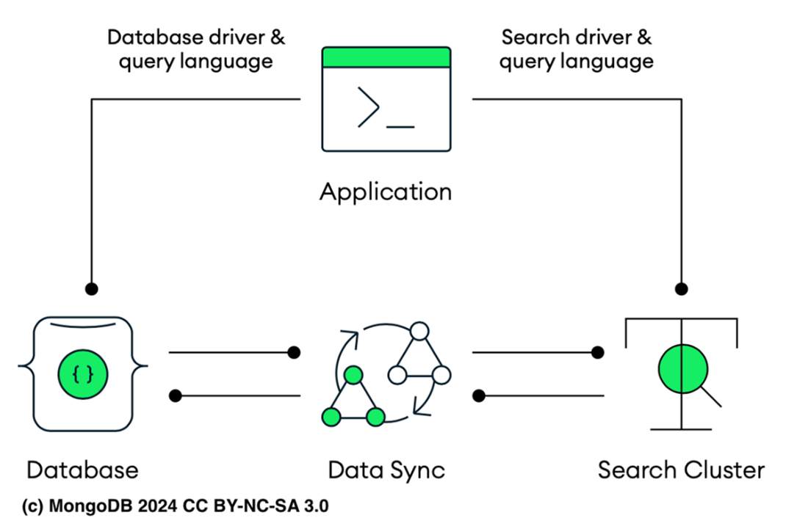
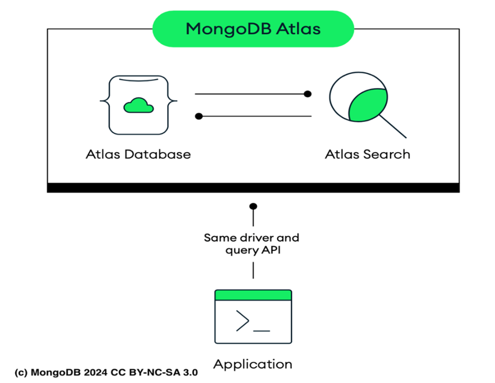
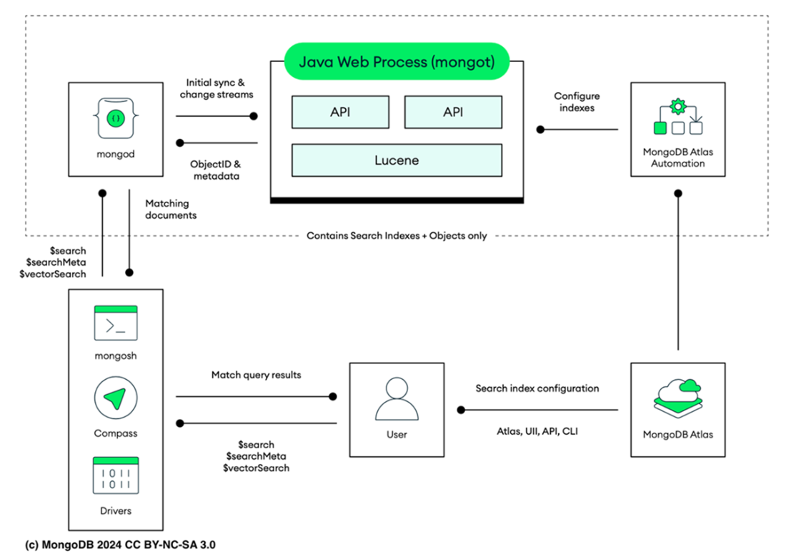

### Chapter 11: Carrying out full-text search using Atlas Search

Full-text search surpasses traditional exact-word matching by analyzing document content for relevance, specific phrases, and text attributes. It supports Boolean, fuzzy, wildcard, phrase, proximity, range, and faceted searches.

---

### 11.1 Implementing full-text search
MongoDB's native `$text` index offers basic support but struggles with complex, nested field queries. Often, data is replicated to dedicated search engines:
*   **Algolia:** Robust but expensive at scale.
*   **Elasticsearch:** Distributed, RESTful, based on Lucene.
*   **Solr:** Reliable, scalable, based on Lucene.

**Challenges of Separate Systems along primary database:**
1.  **Integration Complexity:** specialized setup and maintenance (e.g., using tools like Monstache).
2.  **Data Synchronization:** keeping DB and Search Engine in sync is hard (see Figure 11.1).
3.  **Query Challenge:** different query languages for DB and Search.
4.  **Operational Overhead:** managing/monitoring two distinct systems.
5.  **Cost:** infrastructure and licensing for two systems.




---

### 11.2 Understanding Apache Lucene
Atlas Search is built on **Apache Lucene**, an open-source Java library.
*   **Core Mechanism:** **Inverted Index**. Maps terms, keywords to document locations (like a book glossary).

**Document 1:
```javascript
{ _id: ObjectId('56d61033a378eccde8a8355f'),
id: '10423-2015-CMPL',
certificate_number: 9304139,
business_name: 'LISANDRO CABRERA',
date: 'Jul 17 2015',
result: 'No Violation Issued',
sector: 'Mobile Food Vendor - 881',
address: { city: 'BRONX', zip: 10475,
street: 'PALMER AVE', number: 2234 } }
```
Document 2:
```javascript
{ _id: ObjectId('56d61033a378eccde8a83560'),
id: '1044-2016-ENFO',
certificate_number: 9318079,
business_name: 'AZMY KIROLES',
date: 'Dec 23 2015',
result: 'No Violation Issued',
sector: 'Mobile Food Vendor - 881',
address: { city: 'JERSEY CITY', zip: 7306,
street: 'VROOM ST', number: 160 } }
```


**Table 11.1: Simplified Inverted Index Example**
| Token | Doc 1 | Doc 2 |
| :--- | :---: | :---: |
| LISANDRO CABRERA | + | |
| AZMY KIROLES | | + |
| BRONX | + | |
| NO VIOLATION ISSUED | + | + |

Lucene processes documents through tokenization. Additionally, Lucene can handle multi-word terms by utilizing extra dictionaries, which expands its capability to index phrases and specific terminology. 

**Key Concepts:**
*   **Tokenization:** Breaking text into tokens (words) using **Analyzers**.
*   **Normalization:** Lowercasing, removing punctuation.
*   **Scoring:** Lucene assigns a **Relevance Score** to rank results. 
    *   **Mechanism:** Boosts scores if the term appears frequently in the document. Reduces scores if the term is common across the entire collection (IDF).
    *   **Customization:** Supports **boosting** or **decaying** scores to tailor results.

**Scoring Examples:**
1.  **Query:** `"No Violation Issued Mobile Food Vendor - 881"`
    *   **Tokens:** `No Violation Issued`, `Mobile Food Vendor - 881`.
    *   **Result:** Returns **Document 1** and **Document 2** (both contain these tokens).
    *   **Score:** Likely similar for both (unless token frequency differs).

2.  **Query:** `"No Violation Issued BRONX"`
    *   **Tokens:** `No Violation Issued`, `BRONX`.
    *   **Result:** Returns **Document 1** only (Document 2 lacks "BRONX").
    *   **Score:** Higher for Doc 1 due to complete matching.

3.  **Query:** `"Mobile Food Vendor - 881 PALMER AVE"`
    *   **Tokens:** `Mobile Food Vendor - 881`, `PALMER AVE`.
    *   **Result:** Returns **Document 1** only.
    *   **Score:** High score due to precise match of specific tokens.
*   **Query Types:**
    *   **Term:** Specific word.
    *   **Phrase:** Exact sequence.
    *   **Wildcard:** `*` (multiple chars) or `?` (single char).
    *   **Fuzzy:** Matches similar words (useful for catching typos) using Levenshtein distance.
    *   **Proximity:** Identifies terms that occur near each other within a specified distance in a document
    *   **Autocomplete:** Enhances user interaction by providing real-time suggestions as the user types their query. This feature is implemented using techniques such as edge N-Gram indexing, where Lucene generates edge n-grams from the start of words to suggest completions, or prefix queries that match terms starting with the user’s input
    *   **Range:** Matches values within a specified range (e.g., numbers, dates).

---

### 11.3 Getting to know Atlas Search



Atlas Search integrates Lucene directly into Atlas.
*   **Unified API:** Use MongoDB drivers/aggregations for both DB and Search.
*   **Auto-Sync:** `mongot` process syncs data via Change Streams automatically.

#### 11.3.1 Architecture
*   **`mongot` process:** Runs alongside `mongod` on each node.
    1.  Builds/Manages Atlas Search indexes according to the specified rules in the index definitions for each collection.
    2.  Watches Change Streams to sync updates.
    3.  Executes Search Queries.

#### 11.3.2 Atlas Search Nodes

Atlas Search Nodes are specialized nodes within MongoDB Atlas that are dedicated solely to handling the search functionality by running the `mongot` process. 

For example, deploying two Search Nodes for a cluster with three shards means that Atlas will deploy a total of six Search Nodes, with two dedicated to each shard.

Dedicated nodes solely for the `mongot` process (Workload Isolation).
*   **Benefit:** Search load doesn't impact operational DB performance.
*   **Deployment:** Can deploy independently (e.g., 2 search nodes per shard).
*   **Storage:** Local SSDs need **20% overhead** for index ops.



To query data in your Atlas cluster with Atlas Search, first you must configure an Atlas Search index. You can create Search index on either a single field or multiple fields. It is recommended to index fields, frequently used for sorting or filtering to quickly retrieve relevant documents during queries.

#### 11.3.3 Atlas Search Indexes
*   **Dynamic Mappings:** Automatically indexes all supported fields. Convenient but consumes more disk/performance.
*   **Static Mappings:** (**Recommended**) Selectively index specific fields. Better performance. For fields containing polymorphic data, Atlas Search only indexes documents that match the index definition, ignoring those with mismatched data types.

**Listing 11.1: Index Syntax**
```javascript
{
  "analyzer": "<analyzer-for-index>",
  "searchAnalyzer": "<analyzer-for-query>",
  "mappings": {
  "dynamic": <boolean>,
    "fields": { <field-definition> }
  },
  "analyzers": [ <custom-analyzer> ],
  "storedSource": <boolean> | {
  <stored-source-definition>
  },
  "synonyms": [
    {
      "name": "<synonym-mapping-name>",
      "source": {
        "collection": "<source-collection-name>"
      },
      "analyzer": "<synonym-mapping-analyzer>"
    }
  ]
}
```


**Handling Data Using Analyzers:**
To get your data ready for indexing, it must be processed through **tokenization**. This process involves dividing a stream of text into smaller elements such as words, phrases, and symbols, known as **tokens**. This task is performed by components called **analyzers**, which are integral to the search engine's functionality.
*   **Function:** Generate tokens and apply parsing/language rules to ensure text is searchable.
*   **Control:** You can specify which analyzer to use during index creation or query execution.
*   **Components:**
    1.  **Tokenizer:** Segments text into tokens.
    2.  **Filters:** Adjusts tokens (punctuation, capitalization, stop words).

> **Note:** If you don't specify an analyzer, MongoDB Atlas uses the **default standard analyzer**.

**Table 11.3: Built-in Analyzers**
| Analyzer | Description |
| :--- | :--- |
| **Standard** | **Default**. Grammar-based tokenization. Lowers-cases terms, removes punctuation. |
| **Simple** | Divides text into searchable terms wherever it finds a non-letter character. |
| **Whitespace** | Divides text into searchable terms wherever it finds a whitespace character. |
| **Language** | Provides a set of language-specific text analyzers. |
| **Keyword** | Indexes text fields as **single terms** (exact match). |

The standard analyzer is the default for all Atlas Search indexes and queries. It splits text into terms using word boundaries, making it suitable for various languages. It converts all terms to lowercase and eliminates punctuation. This analyzer supports grammar-based tokenization, recognizing elements like email addresses, acronyms, Chinese-Japanese-Korean characters, alphanumerics, and more.

**Reindexing in Atlas Search:**
Reindexing is required when modifying the mapping of an existing index.
*   **Process:** Initiates construction of a **new index** based on the updated mapping. Reads all relevant data and reorganizes it.
*   **Availability:** Occurs in **background**. Old index handles queries until the new one is ready (zero downtime).
*   **Consistency:** `mongot` monitors change streams to ensuring indexes are eventually consistent. Latest data might not be immediately available during heavy writes.

> **Tip:** Ensure you have free disk space equal to **125%** of your current index's size for a successful update.

**Automatic Rebuild Triggers:**
If you use separate Search Nodes, Atlas rebuilds indexes during:
1.  **Adding/Scaling Search Nodes**.
2.  **Internal `mongot` changes** requiring resync (e.g., feature updates).
3.  **Hardware corruption** or breaking version changes.
*During rebuilds, Atlas deploys additional nodes to keep the old index available.*

> **Tip:** When using `$out` to alter a collection with a search index, you must delete and recreate the index. Use **`$merge`** instead if feasible.

---

### 11.4 Building Atlas Search index

While Atlas Search doesn't create an exact copy of the data from your MongoDB cluster collections, it builds search indexes directly on your data, which require some disk space and memory.

When you perform a search query, the search index is used to quickly identify relevant document IDs. The actual documents are then fetched directly from your original MongoDB collection based on the information from the search index.


**Table 11.2: Template Options for Configuring Atlas Search Index**
| Field | Type | Necessity | Description |
| :--- | :--- | :--- | :--- |
| `analyzer` | string | Optional | Analyzer for string fields during **indexing**. |
| `analyzers` | array | Optional | List of **Custom Analyzers** to use. |
| `mappings` | document | **Required** | Defines how fields are indexed. |
| `mappings.dynamic` | boolean | Optional | `true`: Indexes all supported fields. `false` (**Default**): You must specify fields manually. |
| `mappings.fields` | document | Conditional | **Required if dynamic is false**. Specifies fields to index. |
| `searchAnalyzer` | string | Optional | Analyzer for query text **before searching**. Defaults to `analyzer` setting or Standard. |
| `storedSource` | boolean/obj | Optional | Fields to store for query-time lookups (slows indexing, enables retrieval without DB fetch). |
| `synonyms` | array | Optional | Synonym mappings (one per index). |

**Example: Creating Index via CLI**
```bash
atlas clusters search indexes create \
  --clusterName MongoDB-in-Action \
  --file index-definition.json
```

**Listing 11.2: Static Mapping Example**
```json
{
  "name": "MongoDB-in-Action",
  "database": "sample_training",
  "collectionName": "inspections",
  "mappings": {
    "dynamic": false,
    "fields": {
      "business_name": {
        "type": "string",
        "analyzer": "lucene.standard"
      },
      "date": {
        "type": "date"
      },
      "result": {
        "type": "string",
        "analyzer": "lucene.standard"
      },
      "sector": {
        "type": "string",
        "analyzer": "lucene.standard"
      },
      "address": {
        "type": "document",
        "fields": {
          "city": {
            "type": "string",
            "analyzer": "lucene.standard"
          },
          "zip": {
            "type": "string",
            "analyzer": "lucene.standard"
          },
          "street": {
            "type": "string",
              "analyzer": "lucene.standard"
          },
          "number": {
            "type": "string",
            "analyzer": "lucene.standard"
          }
        }
      }
    }
  }
}
```
*   **Constraints (M0 Cluster):** Max 3 indexes.
*   **Limits:** Index definition < 3KB. Max 300 fields.

---

### 11.5 Running Atlas Search queries

**11.5.1 Using `$search` aggregation pipeline stage**
The `$search` stage conducts full-text searches by querying the Atlas Search index (Lucene). The fields involved must be indexed. The indexing process organizes data to optimize search speed and precision.

**Listing 11.4: The `$search` prototype form**
```javascript
{
  $search: {
    "index": "<index-name>",
    "<operator-name>"|"<collector-name>": {
      <operator-specification>|<collector-specification>
    },
    "highlight": {
      <highlight-options>
    },
    "concurrent": true | false,
    "count": {
      <count-options>
    },
    "searchAfter"|"searchBefore": "<encoded-token>",
    "scoreDetails": true| false,
    "sort": {
      <fields-to-sort>: 1 | -1
    },
    "returnStoredSource": true | false,
    "tracking": {
      <tracking-option>
    }
  }
}
```

**Available Options:**
*   **Index:** Name of the Atlas Search index (defaults to `default` if omitted).
*   **Operator/Collector:** Defines search behavior.
    *   **Operator:** Specifies how data should be queried (e.g., `text`, `autocomplete`).
    *   **Collector:** Aggregates and processes data (e.g., `facet`).
*   **Highlight:** Highlights search terms in results for better visibility.
*   **Concurrent:** (`boolean`) Parallelizes search across segments on dedicated nodes for performance.
*   **Count:** Returns a count of results (useful for understanding scope).
*   **SearchAfter / SearchBefore:** Facilitates pagination using encoded reference tokens.
*   **ScoreDetails:** (`boolean`) Returns detailed breakdown of scoring (useful for debugging).
*   **Sort:** Specifies sort order (`1` ascending, `-1` descending).
*   **ReturnStoredSource:** Determines whether to fetch full docs from DB or only fields stored in the index.
*   **Tracking:** Enables tracking of search operations for analytics/insights.

**Table 11.4: The aggregation pipeline $search stage supported operators**
| Operator | Description | Supported Atlas Search Types |
| :--- | :--- | :--- |
| `autocomplete` | Performs a **search-as-you-type** query from an incomplete input string. | `autocomplete` |
| `compound` | **Combines** other operators into a single query. | Field types supported by operators used. |
| `embeddedDocument` | Queries fields in **embedded documents** (array elements). | `embeddedDocuments` and field types supported by operators used. |
| `equals` | Checks whether the field contains the **specified value**. | `boolean`, `date`, `objectId`, `number`, `token`, `uuid` |
| `exists` | Tests for the **presence** of a specified field. | *Field type isn't used* |
| `geoShape` | Queries for values with specified **geo shapes**. | `geo` |
| `geoWithin` | Queries for points **within** specified geographic shapes. | `geo` |
| `in` | Queries both **single value and array** of values. | `boolean`, `date`, `objectId`, `number`, `token`, `uuid` |
| `moreLikeThis` | Queries for **similar documents**. | `string` |
| `near` | Queries for values **near** a specified number, date, or geo point. | `date`, `geo point`, `number` |
| `phrase` | Searches for terms in an **order similar** to the query. | `string` |
| `queryString` | Supports querying a **combination** of indexed fields and values. | `string` |
| `range` | Queries for values within a specific **numeric or date range**. | `date`, `number` |
| `regex` | Interprets the query field as a **regular expression**. | `string` |
| `text` | Performs **textual analyzed search**. | `string` |
| `wildcard` | Supports **special characters** (`*`, `?`) matching any character. | `string` |

**Query Collectors:**
Atlas Search provides **collectors** (e.g., `facet`) for use in `$search` and `$searchMeta`.
*   **Purpose:** Return metadata results (aggregation over matching results).
*   **Facet Operator:** Groups query results by values or ranges in specific faceted fields and returns the count. Supports `dateFacet`, `numberFacet`, `stringFacet`.

#### Example 1: `compound` + `text` + `score`
```javascript
db.inspections.aggregate([
  {
    $search: {
      index: "MongoDB-in-Action",
      compound: {
        must: [
          {
            text: {
              query: "food",
              path: "business_name",
            },
          },
          {
            text: {
              query: "PASS",
              path: "result",
            },
          },
          {
            text: {
              query: "127",
              path: "sector",
            },
          },
        ],
      }
    }
  },
  { $addFields: { score: { $meta: "searchScore" } } } // Adds score field
])
```

Sample output:
```javascript
[
  {
  "_id": {
    "$oid": "56d61034a378eccde8a910f4"
  },
  "id": "20958-2015-ENFO",
  "certificate_number": 9284194,
  "business_name": "MARTES FOOD CENTER CORP",
  "date": "Apr 16 2015",
  "result": "Pass",
  "sector": "Cigarette Retail Dealer - 127",
  "address": {
    "city": "BRONX",
    "zip": 10452,
    "street": "WALTON AVE",
    "number": 1055
  },
  "score": 2.944375991821289
}
]
```

#### Example 2: `fuzzy` (Typo Tolerance)

The `fuzzy` property allows for searches that can match similar terms, accounting for possible typographical errors or variations in spelling.

```javascript
db.instepctions.aggregate([
  {
    $search: {
      index: "MongoDB-in-Action",
      text: {
        query: "BUILNG TO SERV INC", // Intentionally introduced errors: "BUILDING" missing an "I", "SERVE" missing an "E"
        path: "business_name",
        fuzzy: {
          maxEdits: 2, // Allows for up to two typographical errors
          prefixLength: 1 // The first letter must be exactly the same
        }
      }
    }
  },
  {
    $limit: 2 // Limits the number of results to 2 for easier verification
  },
  {
    $set: {
      // Dynamically copies the fields to be retained in the output
      business_name: "$business_name",
      date: "$date",
      result: "$result",
      sector: "$sector",
      address: "$address",
      score: { $meta: "searchScore" } // Adds the search score to the output
    }
  },
  {
    $unset: ["_id"] // Removes the '_id' field from the output documents
  }
])
```

Sample output:
```javascript
[
  {
  "id": "1044-2015-CMPL",
  "certificate_number": 5382334,
  "business_name": "BUILDING TO SERVE INC.",
  "date": "Jul 22 2015",
  "result": "Violation Issued",
  "sector": "Home Improvement Contractor - 100",
  "address": {
    "city": "JAMAICA",
    "zip": 11432,
    "street": "HILLSIDE AVE",
    "number": 17939
  },
  "score": 7.316098690032959
  },
  {
  "id": "4290-2016-ENFO",
  "certificate_number": 9324927,
  "business_name": "SEND TO PRINT LLC",
  "date": "Jan 12 2016",
  "result": "Out of Business",
  "sector": "Misc Non-Food Retail - 817",
  "address": {
    "city": "JACKSON HEIGHTS",
    "zip": 11372,
    "street": "37TH AVE",
    "number": 8821
  },
  "score": 3.824653387069702
 }
```
#### Example 3: Proximity Search

```javascript
db.inspections.aggregate([
  {
    $search: {
      phrase: {
        index: "MongoDB-in-Action",
        query: ["food", "license"], // Words to search for
        path: "business_name", // Field to search in
        slop: 3 // Allows up to 3 intervening words between "food" and "license"
      }
    }
  },
  {
    $limit: 1 // Limits the number of results to 1
  },
  {
    $set: {
      // Adds necessary fields to the output documents
      business_name: "$business_name",
      result: "$result",
      sector: "$sector"
    }
  },
  {
    $unset: ["_id", "address", "date"] // Removes the '_id', 'address', and 'date' fields from the output documents
  }
])
```

Proximity Search is useful in scenarios where the exact order of words is not known, but their relative positioning is important. The `slop` property in such queries specifies how many words can appear between the searched terms, allowing flexibility in how closely the terms need to be positioned to each other.

In academic research, it locates references or quotes where specific terms are used near each other, which is useful for literature reviews and research papers. Additionally, it improves user search experience on websites by accommodating queries that may not have the exact keyword order, allowing for a more natural input of search terms while still delivering relevant results


Sample output:
```javascript
[
  {
  "id": "9118-2015-CMPL",
  "certificate_number": 9305560,
  "business_name": "FOOD CART VENDOR LICENSE# C4029",
  "result": "Unable to Locate",
  "sector": "Mobile Food Vendor - 881"
}
]
```

#### Example 4: Wildcard search

```javascript
db.inspections.aggregate([
  {
    $search: {
      wildcard: {
        path: "business_name",
        query: "*L?CE*", // Searches for phrases containing  "L?CE", where "?" represents any single character and "*" represents zero or more characters
        allowAnalyzedField: true // Allows searching on an analyzed field
      }
    }
  },
  {
    $set: {
      score: { $meta: "searchScore" } // Adds the search score to each document
    }
  },
  {
    $sort: {
      score: -1 // Sorts by search score in descending order
    }
  },
  {
    $limit: 2 // Limits the number of results to 2
  },
  {
    $unset: ["_id", "address", "date"] // Removes the '_id', 'address', and 'date' fields from the output documents
  }
]
)
```

Sample output:
```javascript
[
  {
  "id": "2735-2015-ENFO",
  "certificate_number": 9256374,
  "business_name": "UNITED TELECELL INC",
  "result": "No Violation Issued",
  "sector": "Electronic Store - 001",
  "score": 1
},
{
  "id": "4511-2015-ENFO",
  "certificate_number": 3016871,
  "business_name": "B&G MARKET PLACE INC.",
  "result": "Pass",
  "sector": "Grocery-Retail - 808",
  "score": 1
}
]
```

#### Example 5: `facet` (Categorization)

Faceted search allows you to categorize search results into multiple groups (facets) based on specified fields, such as price ranges, categories, or tags. This enables you to filter and refine search results by selecting specific facets, improving the search experience by making it easier to navigate large sets of results.

Following the search, the data is processed through three facets: `ResultsByStatus` groups inspection outcomes, `ResultsByYear` organizes the data by the year of inspection, and `SectorSummary` categorizes businesses by their sector, providing a count for each.

This kind of query is good analyzing distributions.

```javascript
db.inspections.aggregate([
  [
  {
    $search: {
      text: {
        index: "MongoDB-in-Action",
        query: "HOT DOG",
        path: "business_name",
        fuzzy: {
          maxEdits: 1, // Allows for one typo
          prefixLength: 3 // The first 3 letters must be exactly the same
        }
      }
    }
  },
  {
    $facet: {
      ResultsByStatus: [
        {
          $group: {
            _id: "$result",
            count: { $sum: 1 }
          }
        }
      ],
      ResultsByYear: [
        {
          $group: {
            _id: {
              $year: {
                $dateFromString: {
                  dateString: "$date"
                }
              }
            },
            count: { $sum: 1 }
          }
        }
      ],
      SectorSummary: [{ $sortByCount: "$sector" }]
    }
  },
  { $limit: 1 } // This is only for illustration; typically, limit wouldn't be used after a facet.
]
])
```

Sample output:
```javascript
{
  "ResultsByStatus": [
    {
      "_id": "No Evidence of Activity",
      "count": 5
    },
    {
      "_id": "No Violation Issued",
      "count": 30
    },
    {
      "_id": "Unable to Locate",
      "count": 3
    },
    {
      "_id": "Posting Order Served",
      "count": 1
    },
    {
      "_id": "Out of Business",
      "count": 5
    },
    {
      "_id": "Pass",
      "count": 19
    },
    {
      "_id": "Violation Issued",
      "count": 19
    }
  ],
  "ResultsByYear": [
    {
      "_id": 2016,
      "count": 8
    },
    {
      "_id": 2015,
      "count": 74
    }
  ],
  "SectorSummary": [
    {
      "_id": "Cigarette Retail Dealer - 127",
      "count": 32
    },
    {
      "_id": "Grocery-Retail - 808",
      "count": 20
    },
    {
      "_id": "Misc Non-Food Retail - 817",
      "count": 12
    },
    {
      "_id": "Mobile Food Vendor - 881",
      "count": 6
    },
    {
      "_id": "Wearing Apparel - 450",
      "count": 5
    },
    {
      "_id": "Salons And Barbershop - 841",
      "count": 3
    },
    {
      "_id": "Tow Truck Company - 124",
      "count": 2
    },
    {
      "_id": "Tax Preparers - 891",
      "count": 1
    },
    {
      "_id": "Restaurant - 818",
      "count": 1
    }
  ]
}
```

#### USING FACET WITH `$$SEARCH` META
The `$$SEARCH_META` variable is useful when you need to analyze additional information about the search operation itself, such as search scores or other diagnostics that help in understanding the relevance and performance of your search results. This can be useful for optimizing your search queries based on per- formance metrics or for debugging purposes to ensure that the search results align accurately with the expected criteria.

```javascript
db.inspections.aggregate([
  {
    $search: {
      text: {
        query: "smok skop", // Intentionally misspelled, likely meant to be "smoke shop"
        path: "business_name",
        fuzzy: {
          maxEdits: 1, // Allows for one typo in the search query
          prefixLength: 3 // The first 3 letters must match exactly
        }
      }
    }
  },
  {
    $facet: {
      docs: [
        { $limit: 5 }, // Limits the number of documents to 5
        {
          $set: {
            // Dynamically retains the necessary fields  in the output documents
            business_name: "$business_name",
            date: "$date",
            result: "$result",
            sector: "$sector",
            address: "$address"
          }
        },
        { $unset: ["_id"] } // Removes the '_id' field from the output documents
      ],
      resultFacets: [
        {
          $bucketAuto: {
            groupBy: "$result", // Groups documents by the 'result' field
            buckets: 5 // Automatically determines range and creates 5 buckets based on result distribution
          }
        }
      ],
      meta: [
        { $replaceWith: "$$SEARCH_META" }, // Replaces the document with search metadata
        { $limit: 1 } // Limits the metadata results to 1
      ]
    }
  }
])
```

Sample output:
```javascript
{
  "docs": [
    {
      "id": "70695-2015-ENFO",
      "certificate_number": 50065977,
      "business_name": "SMOKE SHOP",
      "date": "Dec 31 2015",
      "result": "No Evidence of Activity",
      "sector": "Cigarette Retail Dealer - 127",
      "address": {
        "city": "NEW YORK",
        "zip": 10075,
        "street": "YORK AVE",
        "number": 1485
      }
    },
    {
      "id": "13076-2015-ENFO",
      "certificate_number": 50057527,
      "business_name": "SMOKE SHOPE",
      "date": "Mar 28 2015",
      "result": "No Evidence of Activity",
      "sector": "Cigarette Retail Dealer - 127",
      "address": {
        "city": "OZONE PARK",
        "zip": 11416,
        "street": "101ST AVE",
        "number": 10506
      }
    },
    {
      "id": "43869-2015-ENFO",
      "certificate_number": 50061178,
      "business_name": "DELI SMOKE SHOP",
      "date": "Aug 12 2015",
      "result": "Out of Business",
      "sector": "Cigarette Retail Dealer - 127",
      "address": {
        "city": "BROOKLYN",
        "zip": 11207,
        "street": "FULTON ST",
        "number": 2859
      }
    },
    {
      "id": "65250-2015-ENFO",
      "certificate_number": 50061878,
      "business_name": "SMOKE ZONE INC",
      "date": "Nov 19 2015",
      "result": "No Violation Issued",
      "sector": "Cigarette Retail Dealer - 127",
      "address": {
        "city": "NEW YORK",
        "zip": 10022,
        "street": "2ND AVE",
        "number": 1059
      }
    },
    {
      "id": "47747-2015-ENFO",
      "certificate_number": 80017878,
      "business_name": "LOVELY SMOKE INC",
      "date": "Aug 17 2015",
      "result": "Violation Issued",
      "sector": "Tobacco Prod'T Sales - 890",
      "address": {
        "city": "BRONX",
        "zip": 10457,
        "street": "E 180TH ST",
        "number": 495
      }
    }
  ],
  "resultFacets": [
    {
      "_id": {
        "min": "Closed",
        "max": "Out of Business"
      },
      "count": 145
    },
    {
      "_id": {
        "min": "Out of Business",
        "max": "Violation Issued"
      },
      "count": 118
    }
  ],
  "meta": [
    {
      "count": {
        "lowerBound": {
          "$numberLong": "263"
        }
      }
    }
  ]
}
```

#### Executing $searchMeta aggregation pipeline stage

The `$searchMeta` aggregation pipeline stage accesses metadata about the search operation itself. This stage allows you to retrieve and use search-related metadata such as the total number of hits or pagination data, which can be critical for understanding the context and scale of the search results.

```javascript
{
$searchMeta: {
  "index": "<index-name>",
  "<collector-name>"|"<operator-name>": {
    <collector-specification>|<operator-specification>
  },
  "count": {
    <count-options>
  }
  }
}
```

Let's now take a closer look at the available options:
* `<collector-name>` (Conditional): Selects a collector for the query, like "facet" for grouping results. You must specify either this or `<operator-name>`.
* `count` (Optional): Provides options for counting the number of search results, useful for understanding the scale of results without retrieving all data.
* `Index`: Specifies the name of the Atlas Search index to be used for the query. If omitted, the system defaults to an index named "default."
* `<operator-name>` (Conditional): Determines the search operator to use. If `<collector-name>` is not
used, this must be specified and will only return default count metadata.

Sample 
```javascript
db.inspections.aggregate([
  {
    $searchMeta: {
      text: {
        query: "Deli", // Searches for the term "Deli"  within the business names.
        path: "business_name" // Specifies that the search should be conducted on the 'business_name' field.
      }
    }
  }
])
```

Sample output:
```javascript


[ { count: { lowerBound: Long('2447') } } ]
```

Another sample:
```javascript
db.inspections.aggregate([
  {
    $search: {
      compound: {
        // Requires matching both business name and inspection result,  prefers matching the sector,  and filters by city.
        must: [
          {
            text: {
              // Must match 'Hot Dog' in the business name.
              query: "Hot Dog",
              path: "business_name"
            }
          },
          {
            text: {
              // Must match 'No Violation Issued'  in the inspection results.
              query: "No Violation Issued",
              path: "result"
            }
          }
        ],
        should: [
          {
            text: {
              // Prefers businesses in the  'Grocery-Retail' sector but it's  not mandatory.
              query: "Grocery-Retail",
              path: "sector"
            }
          }
        ],
        filter: [
          {
            text: {
              // Strictly includes only businesses  located in Brooklyn.
              query: "BROOKLYN",
              path: "address.city"
            }
          }
        ]
      }
    }
  },
  {
    $addFields: {
      score: { $meta: "searchScore" } // Adds a search relevance  score to each matched document.
    }
  },
  {
    $facet: {
      // Summarizes the total documents and score statistics.
      totalDocuments: [{ $count: "totalCount" }], // Counts  total matching documents.
      scoreStats: [
        {
          $group: {
            // Aggregates maximum, minimum, and average scores.
            _id: null,
            maxScore: { $max: "$score" },
            minScore: { $min: "$score" },
            averageScore: { $avg: "$score" }
          }
        }
      ]
    }
  }
])
```
Output for another sample:
```javascript
{
  "totalDocuments": [
    {
      "totalCount": 13
    }
  ],
  "scoreStats": [
    {
      "_id": null,
      "maxScore": 7.446932792663574,
      "minScore": 3.273611068725586,
      "averageScore": 4.741124574954693
    }
  ]
}
```


---

### 11.6 Learning Atlas Search commands
(Run on Atlas M10+)
1.  `db.collection.createSearchIndex("name", { mappings: ... })`
2.  `db.collection.updateSearchIndex("name", { ... })`
3.  `db.collection.dropSearchIndex("name")`
4.  `db.collection.getSearchIndex("name")`

---

### 11.7 Using Atlas Search Playground
Interactive UI to test indexes/queries without writing code.
*   **Environments:** Basic, Catalog Search (Airbnb), Customer Lookup.
*   **Limitations:**
    *   No Vector Search.
    *   Single collection only (no lookup).
    *   Not persistent (Snapshots last 30 days).
    *   Data Limit: 500 docs / 100KB file / 300KB total env size.

---
