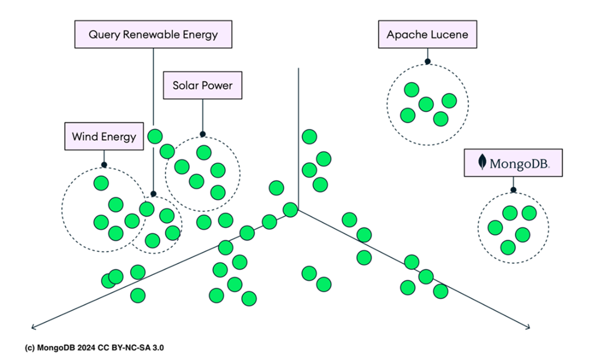
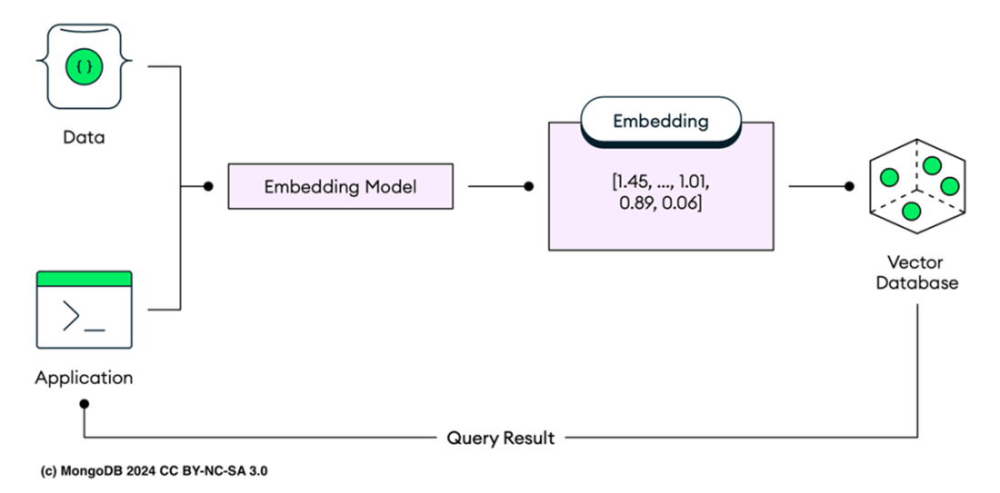

# Chapter 12: Learning semantic techniques and Atlas Vector Search

This chapter covers working with embeddings, creating Atlas Vector Search indexes, exploring the `$vectorSearch` pipeline stage, and using Atlas Triggers for automated generation.

**Atlas Vector Search** extends MongoDB's capabilities by enabling vector-based search, built on Apache Lucene. Unlike full-text search (exact text matching), vector search identifies vectors close to your query in a multi-dimensional space, capturing **semantic similarity**.

*   **Example:** Searching for "renewable energy" retrieves "solar power" or "wind energy" even if the exact phrase isn't present.
*   **Use Cases:** Image/Video/Audio search, Semantic text search, Chatbots (RAG).

**RAG (Retriever-Augmented Generation):**
A model where vector search retrieves relevant data from large datasets based on user input, which is then fed to an LLM (Large Language Model) to generate accurate, context-aware responses, reducing AI hallucinations.

---

## 12.1 Starting with embeddings

**Vector Embeddings** convert data (text, voice, images) into numerical values (vectors) reflecting meaning and relationships.
*   **Representation:** Points in a multidimensional space. Similar data points are clustered together.


**Figure 12.1** *(Visual representation)*: Clusters like 'Renewable Energy', 'Wind', 'Solar' are grouped, while distinct concepts like 'MongoDB' are separate.

### Common Types of Embeddings
| Type | Description | Use Cases |
| :--- | :--- | :--- |
| **Text** | Transforms strings into vectors capturing semantic relationships. | Search, clustering, classification. |
| **Sentence** | Encapsulates overall meaning of sentences. | Contextual analysis. |
| **Document** | Represents entire documents (articles, books). | Semantic depth analysis. |
| **Image** | Translates visual content (using CNNs). | Image classification, similarity. |
| **Audio** | Captures pitch, tone, rhythm. | Speech recognition, music classification. |
| **User** | Represents user preferences/behaviors. | Recommendation systems, personalization. |
| **Product** | Encodes product attributes. | E-commerce recommendations. |

> **Note:** **Vector** = Array of numbers. **Embedding** = Method of representing data as vectors to encapsulate meaning.

### 12.1.1 Converting text into embeddings
MongoDB Atlas does **not** create embeddings natively; use external services.

1.  **OpenAI Embeddings API:** High-quality, context-aware (e.g., `text-embedding-3-small`, `text-embedding-3-large`).
2.  **Google Universal Sentence Encoder / BERT:** Via TensorFlow Hub.
3.  **Hugging Face:** Wide range of pre-trained models.
4.  **LLaMA (Meta):** Open-source, runnable locally.

**Listing 12.1: Creating text embeddings with OpenAI Embeddings API (curl)**
```bash
export OPENAI_API_KEY=your-api-key
curl https://api.openai.com/v1/embeddings \
  -H "Content-Type: application/json" \
  -H "Authorization: Bearer $OPENAI_API_KEY" \
  -d '{
    "input": "MongoDB in Action 8.0",
    "model": "text-embedding-3-small"
  }'
```
*   **Response:** JSON with an `embedding` array (e.g., 1536 dimensions for `text-embedding-3-small`). Higher dimensions = more detail but more compute.

More dimensions provide a more detailed text representation, improving model performance.

Sample response:
```javascript
{
    "object": "list",
    "data": [
    {
    "object": "embedding", // Embedding object
    "index": 0, // Index of the embedding
    "embedding": [
    // Example embedding values
    0.0022989365, -0.06971052, 0.012823246, 0.05579968,
    -0.013507065, -0.049443416, 0.005815723, 0.010315907, ...
    ]
    }
    ]
}
```

### 12.1.2 Understanding vector databases
A **vector embedding** is generally depicted as a series of numerical values. Each value in this sequence correlates to a distinct feature or dimension, collectively forming the data point's representation. The individual numbers in the vector do not hold intrinsic meaning by themselves; instead, it is the comparative values and their interrelationships that encapsulate the semantic information, enabling algorithms to efficiently process and analyze the data.

A **vector database**, also known as a vector search database or vector similarity search engine, manages the storage, retrieval, and search of these vectors. Unlike traditional relational databases that store data in rows and columns, vector databases organize data as points within a multidimensional space, each point represented by vectors like `[0.3, 0.8, -0.8, 0.6, 0.4, 0.1, -0.5, 0.2, ...]`. This method of organization is particularly advantageous for applications that require fast and accurate data matching based on similarity, rather than exact matches, making them ideal for tasks like semantic searches and recommendation systems.


**Figure 12.2** provides an overview of the workflow within a vector database. Content is initially processed through an embedding model. These models generate embeddings by transforming text or other data types into numerical vectors.

**Figure 12.2 (Description):** Vector database operations illustrate the process of vector database operations. Data is processed by an embedding model, transforming it into vector embeddings such as `[1.45, ..., 1.01, 0.89, 0.06]`. These embeddings are stored in a vector database. Queries from the application are also transformed into embeddings before searching the database. The most relevant results based on these query embeddings are then retrieved and returned as query results.

Once the data is converted into vectors, it is stored in the vector database. The database organizes these vectors within a high-dimensional space, where each vector represents a point. When a query is made, it is also transformed into a vector using the same or similar embedding model. The vector database then performs a **similarity search** to find vectors that are closest to the query vector. This search is typically done using algorithms like **cosine similarity**, which measures the cosine of the angle between two vectors, or **Euclidean distance**, which calculates the straight-line distance between vectors in the space.

These algorithms help determine the degree of similarity between the query vector and the stored vectors. The closest vectors are retrieved and returned as the query results. This process ensures that the data retrieved is semantically similar to the query, enabling applications to provide relevant and precise results. The efficiency and accuracy of vector databases make them essential for various applications, including semantic searches, recommendation systems, and more.

---

## 12.2 Using embeddings with Atlas Vector Search

Atlas uses `mongot` (Lucene wrapper) to utilize **HNSW (Hierarchical Navigable Small Worlds)** graphs for search.

### Algorithms
Atlas Vector Search supports both **Approximate Nearest Neighbor (ANN)** search and **Exact Nearest Neighbor (ENN)** search.

1.  **HNSW (Approximated Nearest Neighbor - ANN):**
    *   **Pros:** Fast, scalable, efficient for large datasets.
    *   **Cons:** Approximate results (small chance of missing exact match).
    *   **Mechanism:** Uses a hierarchical graph structure. Upper layers = fast/broad entry; Lower layers = fine/precise.
    *   **Search Process:** Begins at an entry point in the uppermost layer, performing a **greedy search** by navigating to nearest neighbor nodes based on the distance metric. The search moves down to lower layers, progressively refining results until it reaches the bottom layer.
    *   **Benefit:** This layered approach significantly reduces search time compared to brute-force methods, making it suitable for large-scale, real-time applications.
    *   **Trade-off:** Avoids scanning every vector but may return approximate results (small chance of missing the absolute closest match).

2.  **ENN (Exact Nearest Neighbor):**
    *   **Mechanism:** Exhaustively examines **all** indexed vector embeddings to find the most similar vectors.
    *   **Pros:** 100% precision.
    *   **Cons:** Computationally expensive and slower on large datasets compared to ANN.

### 12.2.1 Building Atlas Vector Search index
Separate from standard MongoDB indexes. Supports up to **4096 dimensions**.

Recommended dimensions typically depend on the specific use case and the complexity of the data. Commonly used dimensions are 128, 256, 512, or 1024, as they balance performance and accuracy. Higher dimensions, like 4096, may provide more detailed representations but can be computationally expensive.

### 12.2.2 Selecting Vector Search source
Example uses `sample_mflix.embedded_movies`.
**Listing 12.2: Document structure with embedding**
```javascript
{
  _id: ObjectId('...'),
  title: 'The Perils of Pauline',
  plot: 'Young Pauline is left...',
  plot_embedding: [0.00072, -0.0268, ...], // Dense vector
  ...
}
```

### 12.2.3 Defining your Vector Search index
**Similarity** refers to the metric used to measure how close two vectors are. It determines how the system calculates similarity between different document embeddings.

**Common Similarity Metrics:**
1.  **Cosine Similarity:**
    *   **Mechanism:** Calculates the cosine of the angle between two vectors, indicating how "aligned" they are.
    *   **Use Cases:** Ideal for **text analysis** and **NLP** (e.g., finding similar sentences or documents) where orientation matters more than magnitude.
2.  **Euclidean Distance:**
    *   **Mechanism:** Measures the **straight-line distance** between two points in vector space.
    *   **Use Cases:** Commonly used in **image recognition** and **clustering** where spatial distance is significant.
3.  **Dot Product:**
    *   **Mechanism:** Calculates the sum of the products of corresponding elements.
    *   **Use Cases:** Often used in **recommendation systems** to find items with high similarity based on user behavior or preferences.

**Vector Index Definition (`vector-definition.json`):**
```json
{
  "name": "MongoDB-in-Action-VectorSearchIndex",
  "type": "vectorSearch",
  "collectionName": "embedded_movies",
  "database": "sample_mflix",
  "fields": [
    {
      "type": "vector",
      "path": "plot_embedding",
      "numDimensions": 1536,
      "similarity": "cosine"
    },
    { "type": "filter", "path": "genres" },
    { "type": "filter", "path": "languages" },
    { "type": "filter", "path": "year" }
  ]
}
```

Additionally, the index definition includes several filter fields:
* genres: Filters the results based on movie genres.
* languages: Filters the results based on the languages of the movies.
* year: Filters the results based on the release year of the movies.

### 12.2.4 Creating Atlas Vector Search index (CLI)
```bash
atlas cluster search index create \
  --clusterName MongoDB-in-Action \
  --file vector-definition.json
```
*   **Verify:** `atlas clusters search indexes list ...` or via Atlas UI (**Search & Vector Search** tab).

---

## 12.3 Running Atlas Vector Search queries

Uses the `$vectorSearch` aggregation stage.

**Listing 12.3: `$vectorSearch` aggregation pipeline stage prototype**
```javascript
{
  "$vectorSearch": {
    "exact": true | false,
    "filter": { <filter-specification> },
    "index": "<index-name>",
    "limit": <number-of-results>,
    "numCandidates": <number-of-candidates>,
    "path": "<field-to-search>",
    "queryVector": [<array-of-numbers>]
  }
}
```

**Key Parameters:**
*   **exact:** (`boolean`) Specifies whether to perform **ENN** (`true`) or **ANN** (`false`) search.
    *   *Default:* `false` (ANN).
    *   *Trade-off:* Exact is more precise but slower; Approximate is faster but less precise.
*   **filter:** (`optional`) Restricts search to documents matching criteria. Useful for narrowing down to a relevant subset.
*   **index:** Name of the vector search index (must be created beforehand).
*   **limit:** Maximum number of results to return. Controls retrieval size/pagination.
*   **numCandidates:** Number of candidate vectors to consider.
    *   *Impact:* Higher numbers increase precision but also processing time.
*   **path:** Field containing the vector embeddings to search on.
*   **queryVector:** Array of numbers representing the query. Used to find similar documents based on the index's similarity metric.

### 12.3.1 Querying with embeddings
> **Critical:** You must embed your query text using the **same model** used for the data (e.g., OpenAI `text-embedding-3-small`).

**Listing 12.4: Atlas Vector Search `$vectorSearch` stage with embedding**
```javascript
db.embedded_movies.aggregate([
  {
    "$vectorSearch": {
      "index": "MongoDB-in-Action-VectorSearchIndex",
      "path": "plot_embedding",
      "queryVector": [-0.0016261312, -0.028070757, ...],
      "numCandidates": 150,
      "exact": false,
      "limit": 5
    }
  },
  {
    "$project": {
      "_id": 0,
      "plot": 1,
      "title": 1,
      "score": { $meta: "vectorSearchScore" }
    }
  }
])
```

Sample output
```javascript
[
{
plot: 'A young woman moves to a small village
➥ and discovers the simple joys and hidden
➥ secrets of rural life.',
title: 'Village Secrets',
score: 0.9523144960403442
},
{
plot: 'A documentary exploring the daily lives
➥ and traditions of villagers in a remote
➥ mountain community.',
title: 'Mountain Village',
score: 0.9487524032592773
},
{
plot: 'An architect travels to a rural village
➥ to design a community center and finds
➥ himself enchanted by the local way of life.',
title: 'Building Dreams',
score: 0.9468201398849487
},
{
plot: 'A retired couple moves to the countryside
➥ and becomes involved in village affairs,
➥rediscovering their passion for life.',
title: 'New Beginnings',
score: 0.9453170895576477
},
{
plot: 'A city boy spends a summer with his
➥ grandparents in their village, learning valuable
➥ lessons about family and nature.',
title: 'Summer in the Village',
score: 0.9438151121139526
}
]
```

**Score:** 1 (high similarity) to 0 (low). Use `vectorSearchScore` metadata.

### 12.3.2 Using pre-filtering
significantly reduces search space. Requires fields to be defined as `filter` type in index.

**Listing 12.5: Pre-filter data with `$vectorSearch` pipeline stage**
```javascript
db.embedded_movies.aggregate([
  {
    "$vectorSearch": {
      "index": "MongoDB-in-Action-VectorSearchIndex",
      "path": "plot_embedding",
      "queryVector": [-0.0016261312, -0.028070757, ...],
      "filter": { 
        "$or": [
          { genres: "Action" },
          { runtime: { "$lt": 120 } }
        ]
      },
      "numCandidates": 150,
      "exact": false,
      "limit": 5
    }
  },
  {
    "$project": {
      "_id": 0,
      "plot": 1,
      "title": 1,
      "score": { $meta: "vectorSearchScore" }
    }
  }
])
```
*   **Supported Filters:** `$eq`, `$ne`, `$gt`, `$lt`, `$gte`, `$lte`, `$in`, `$nin`, `$and`, `$or`, `$nor`. (Note: limitations exist for `objectId` and certain operators inside `$vectorSearch`).

---

## 12.4 Executing vector search with programming languages

### 12.4.1 Using vector search with JavaScript
**Listing: Node.js Example**
```javascript
const { MongoClient } = require('mongodb');

async function vectorSearch() {
  // MongoDB connection string
  const uri = 'your_mongodb_connection_string';
  
  // Create a new MongoClient
  const client = new MongoClient(uri, { useNewUrlParser: true, useUnifiedTopology: true });

  try {
    // Connect to the MongoDB server
    await client.connect();
    
    // Select the database and collection
    const database = client.db('your_database_name');
    const collection = database.collection('your_collection_name');

    // Define the vector search query
    const query = {
      $vectorSearch: {
        queryVector: [/* your query vector here */],
        numResults: 10,
        path: 'your_vector_field_name'
      }
    };

    try {
      // Execute the vector search query and convert the results to an array
      const results = await collection.find(query).toArray();
      // Log the results to the console
      console.log(results);
    } catch (queryError) {
      console.error('Error executing vector search query:', queryError);
    }
  } catch (connectionError) {
    console.error('Error connecting to MongoDB:', connectionError);
  } finally {
    try {
      await client.close();
    } catch (closeError) {
      console.error('Error closing MongoDB connection:', closeError);
    }
  }
}

// Call the vectorSearch function and handle any unhandled errors
vectorSearch().catch(console.error);
```


## 12.5 Using Atlas Triggers for automated embeddings creation

Use **Atlas Triggers** (Server-side logic) to auto-generate embeddings when documents are inserted/updated.

**Setup Steps (Atlas UI):**
1.  **Services > Triggers > Get Started**.
2.  **Type:** Database Trigger.
3.  **Operation:** Insert, Update, Replace. Check "Full Document".
4.  **Function:** Paste logic to call OpenAI API.

**Listing 12.6: Atlas Trigger function for automated embeddings generation**
```javascript
exports = async function(changeEvent) {
  console.log("Change Event: ", JSON.stringify(changeEvent));
  
  // Check if documentKey is available
  if (!changeEvent.documentKey || !changeEvent.documentKey._id) {
    console.log("documentKey or _id is not available.");
    return;
  }
  
  // Access the _id of the changed document:
  const docId = changeEvent.documentKey._id;
  
  // Get the MongoDB service you want to use
  const serviceName = "MongoDB-in-Action";
  const database = "sample_mflix";
  const collection = context.services.get(serviceName).db(database).collection(changeEvent.ns.coll);
  
  try {
    // For insert, update, or replace events, process the document
    const fullDocument = changeEvent.fullDocument;
    if (!fullDocument) {
      console.log("Full document is not available.");
      return;
    }
    
    // Check if the document has the 'plot' field
    if (!fullDocument.plot) {
      console.log("Document does not contain 'plot' field.");
      return;
    }
    
    const url = 'https://api.openai.com/v1/embeddings';
    // Add your OpenAI API key here
    const openai_key = "<Your OpenAI API key>";
    
    // HTTP call to OpenAI API to get embedding for the plot
    let response = await context.http.post({
      url: url,
      headers: {
        'Authorization': [`Bearer ${openai_key}`],
        'Content-Type': ['application/json']
      },
      body: JSON.stringify({
        input: fullDocument.plot,
        model: "text-embedding-3-small"
      })
    });
    
    // Parse the JSON response from the API
    let responseData = EJSON.parse(response.body.text());
    
    if (response.statusCode === 200) {
      console.log("Successfully received embedding.");
      const responseEmbedding = responseData.data[0].embedding;
      
      // Update the document in MongoDB with the new embedding
      const result = await collection.updateOne(
        { _id: docId },
        { $set: { plot_embedding: responseEmbedding }}
      );
      
      if (result.modifiedCount === 1) {
        console.log("Document successfully updated.");
      } else {
        console.log("Failed to modify document.");
      }
    } else {
      console.log(`Failed embedding with code: ${response.statusCode}, response: ${response.body.text()}`);
    }
  } catch (err) {
    console.log("Error performing MongoDB write or API call: ", err.message);
  }
};
```

---

## 12.6 Workload isolation with Vector Search dedicated nodes
*   **Dedicated Nodes:** Separate `mongot` processing from operational DB nodes.
*   **Benefit:** Intra-query parallelism (faster response for complex queries) and no impact on transactional workloads.
*   **Requirement:** M10+ clusters.

## 12.7 Improving Atlas Vector Search performance
1.  **Reduce Dimensions:** Smaller vectors = faster compute.
2.  **Avoid Indexing During Queries:** Re-indexing consumes a lot of resources. If you need to update the embedding model, create a new index for the new vectors instead of updating the existing index.
3.  **Exclude Vector Fields:** Do not return the massive embedding array in results (`$project` it out).
4.  **Sufficient Memory:** Ensure RAM covers vector index + working set.
5.  **Warm Up the Filesystem Cache:** Run targeted queries to load HNSW graph into memory to avoid initial disk latency. To warm up the filesystem cache, perform a full index scan or run targeted queries that load frequently accessed data into memory.

