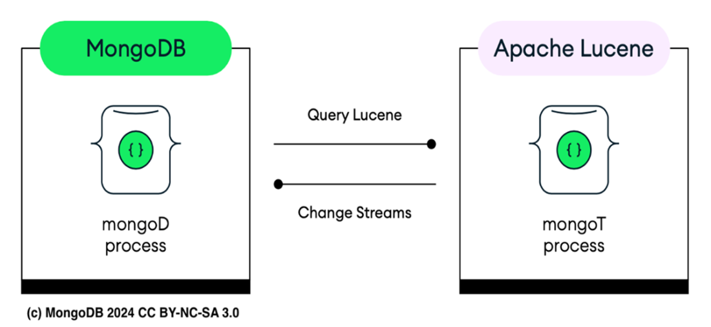

# Chapter 13: Developing AI applications locally with Atlas CLI

This chapter covers using the **Atlas CLI** to develop locally with MongoDB Atlas deployments. It enables creating full-text search or AI-powered applications (Vector Search) in your local environment, managing the entire lifecycle from development to production.

## 13.1 Introducing local Atlas cluster



To create a local Atlas deployment, use the `atlas deployments` command.

**Listing 13.1: Atlas CLI local deployment option**
```bash
atlas deployments --help
# Manage cloud and local deployments.
# Usage: atlas deployments [command]
# Commands:
#   setup     Create a local deployment
#   delete    Delete a deployment
#   list      Return all deployments
#   connect   Connect to a deployment (local or Atlas)
#   start     Start a deployment
#   pause     Pause a deployment
#   logs      Get deployment logs
#   search    Manage search for cloud and local deployments
```

### Architecture
A local Atlas cluster mimics the cloud-based Atlas environment using **Docker**.
*   **Core:** Runs `mongod`, a single-node replica set on port `27017`.
*   **Search:** Runs `mongot`, a separate process alongside `mongod` (see Figure 13.1).
    *   **Role:** Handles indexing and search operations (Full-text & Vector).
    *   **Technology:** Java wrapper for **Apache Lucene**.
    *   **Sync:** Uses **Change Streams** to monitor MongoDB collections and update Lucene indexes in real-time.

**Figure 13.1 (Description):** The `mongot` process runs alongside `mongod` within a Docker container. `mongod` handles data storage, while `mongot` manages Lucene indexes, syncing via change streams.

---

## 13.2 Creating an Atlas cluster locally with Atlas CLI
> **Note:** Local deployments are for testing/development only.

### Prerequisites (Docker)
You must have **Docker** installed (`mongod` and `mongot` run in containers).
*   **MacOS:** Docker Desktop v4.31+
*   **Linux:** Docker Engine v27.0+ (Podman supported on RHEL)
*   **Windows:** Docker Desktop v4.31+
*   **Resources:** Minimum **2 CPU cores** and **2 GB free RAM**.

**Verify Docker installation:**
```bash
docker info
# Output should show Server Version, Running Containers, etc.
```

### 13.2.1 Building your first local Atlas Cluster
1.  **Run Setup Command:**
    ```bash
    atlas deployments setup --type local
    ```
2.  **Configuration flow:**
    *   **Default Settings:** Name (`localXXXX`), Version (`8.0`), Port (`27017`).
    *   **Prompt:** `? How do you want to set up your local Atlas deployment?` -> Select **default**.
    *   **Process:** Starts local environment -> Downloads MongoDB image -> Creates deployment.
    *   **Success:** Returns a connection string (e.g., `mongodb://localhost:27017/?directConnection=true`).

3.  **Connect:**
    *   **Prompt:** `? How would you like to connect...?` -> Select **mongosh**.

4.  **Verify:**
    ```javascript
    test> show dbs
    // admin, config, local
    ```
    ```bash
    docker ps
    // Shows container running image: mongodb/mongodb-atlas-local:8.0
    ```

---

## 13.3 Managing your local Atlas Cluster
Use `atlas deployments` to manage the lifecycle and monitor your cluster.

### 13.3.1 Management Commands
| Action | Command | Description |
| :--- | :--- | :--- |
| **List** | `atlas deployments list --type LOCAL` | Shows status (e.g., `IDLE`, `STOPPED`). |
| **Pause** | `atlas deployments pause <name> --type LOCAL` | Temporarily stops the cluster. |
| **Start** | `atlas deployments start <name> --type LOCAL` | Restarts a paused cluster. |
| **Connect** | `atlas deployments connect --type LOCAL` | Connects via `mongosh` or Compass. |
| **Logs** | `atlas deployments logs --deploymentName <name> --type LOCAL` | View real-time logs for diagnosis. |
| **Delete** | `atlas deployments delete <name> --type LOCAL` | Permanently removes the cluster. |

### 13.3.2 Loading sample data set
The Atlas CLI **cannot** load sample data into local clusters automatically. You must use `mongorestore`.

**Steps:**
1.  **Download Sample Data:**
    ```bash
    curl https://atlas-education.s3.amazonaws.com/sampledata.archive -o sampledata.archive
    ```
2.  **Install Database Tools:** Ensure `mongorestore` is installed (MongoDB Database Tools).
3.  **Get Connection String:**
    ```bash
    atlas deployments connect --connectWith connectionString <name>
    # Example output: mongodb://localhost:32769/?directConnection=true
    ```
4.  **Restore Data:**
    ```bash
    mongorestore --archive=sampledata.archive \
      --uri mongodb://localhost:32769/?directConnection=true
    ```
    *   *Result:* Restores databases like `sample_mflix`, `sample_airbnb`, etc.

---

## 13.4 Diving into local Atlas Cluster
Investigate the underlying Docker container to understand how `mongod` and `mongot` coexist.

### 13.4.1 Inspecting the Image
Use `docker inspect` to view image configuration.
```bash
docker inspect mongodb/mongodb-atlas-local:8.0
```
**Key Details:**
*   **Env:** `PATH` includes `/opt/mongot` (search process path).
*   **Cmd:** Runs `/usr/local/bin/runner server` (startup script).
*   **Healthcheck:** Runs `runner healthcheck` every 30s.
*   **Volumes:** Stores data in `/data/db` and config in `/data/configdb`.
*   **Architecture:** e.g., `arm64` (on Apple Silicon).

### 13.4.2 Displaying processes (`docker top`)
Run `docker top <container_name>` to see running processes inside the container.

**Process Breakdown:**
1.  **Runner (`/usr/local/bin/runner server`):** Main process, UID 997.
2.  **MongoDB (`mongod`):**
    *   Parameters: `--replSet rs-localdev`, `--setParameter mongotHost=localhost:27027`.
    *   *Note:* Configured to communicate with `mongot` on port 27027.
3.  **Search (`java ... MongotCli`):**
    *   The `mongot` process (Java application).
    *   Parameters: `--mongodHostAndPort localhost:27017`.
    *   *Note:* Connects back to `mongod` to sync data.

### 13.4.3 Executing into the container
Access the container shell to explore the file system.
```bash
docker exec -it <container_id> /bin/bash
cd /opt/mongot/
```

**Inside `/opt/mongot/`:**
*   **Files:** `mongot` binary, `lib` (libraries), `exampleIndexDefinition.json`.
*   **README.md:** Explains that `mongot` is in **Private Preview** for local dev.
    *   **Keyfile:** Mutual authentication between `mongod` and `mongot` uses a keyfile (`/data/keyfile`).
    *   **Configuration:** `mongod` uses `setParameter` to find `mongot`.

---

## 13.5 Creating search indexes
The `mongosh` method `db.collection.createSearchIndex()` wraps the database command to manage indexes locally.

### 13.5.1 Executing full text search locally
**Steps:**
1.  **Create Index (Dynamic Mapping):**
    ```javascript
    use sample_training
    db.inspections.createSearchIndex(
      "LocalSearchIndex",
      { mappings: { dynamic: true } }
    )
    ```
2.  **Verify:**
    ```javascript
    db.inspections.getSearchIndexes()
    // Output should show status: 'READY'
    ```

**Listing 13.2: Executing full text search locally (Fuzzy Search)**
```javascript
db.inspections.aggregate([
  {
    $search: {
      index: 'LocalSearchIndex',
      text: {
        query: 'No Violation Issued',
        path: ['result', 'business_name'],
        fuzzy: { maxEdits: 2 } // Allows up to 2 typos
      }
    }
  },
  {
    $match: { // Additional Mock Filters
      sector: 'Cigarette Retail Dealer - 127',
      'address.city': 'RIDGEWOOD'
    }
  },
  { $addFields: { score: { $meta: "searchScore" } } },
  { $sort: { score: -1 } },
  { $limit: 3 },
  {
    $project: {
      _id: 0,
      business_name: 1,
      result: 1,
      score: 1
    }
  }
])
```
*   **Result:** Returns documents matching "No Violation Issued" (or similar) within the specified sector/city, sorted by relevance.

**Drop Index:**
```javascript
db.inspections.dropSearchIndex("LocalSearchIndex")
```

### 13.5.2 Executing vector search locally
Create a vector index on the `sample_mflix.embedded_movies` collection.

**Create Vector Index:**
```javascript
use sample_mflix
db.embedded_movies.createSearchIndex({
  "name": "vectorSearchIndex",
  "mappings": {
    "dynamic": true,
    "fields": {
      "plot_embedding": {
        "type": "knnVector",
        "dimensions": 1536,
        "similarity": "euclidean"
      }
    }
  }
})
```
*   **knnVector:** Field used for k-nearest neighbors search.
*   **dimensions (1536):** Size of the embedding vector.
*   **similarity (euclidean):** Measures straight-line distance in vector space.

---

## 13.6 Summary
*   **Atlas CLI:** Enables local development for Atlas Search and Vector Search, managing the full lifecycle.
*   **Docker Integration:** Required for local deployment. Runs `mongod` and `mongot` in isolated containers to ensure consistency.
    *   **mongot:** Runs alongside `mongod` to handle Lucene-based search operations.
*   **Setup:** Use `atlas deployments setup --type local` to initialize a cluster.
*   **Management:** Use `atlas deployments` to list, pause, start, and delete clusters.
*   **Data Loading:** Use `mongorestore` with the `directConnection=true` URI to load sample data.
*   **Indexes:** Use `createSearchIndex()` locally to build Full-text and Vector indexes, mirroring cloud capabilities.


