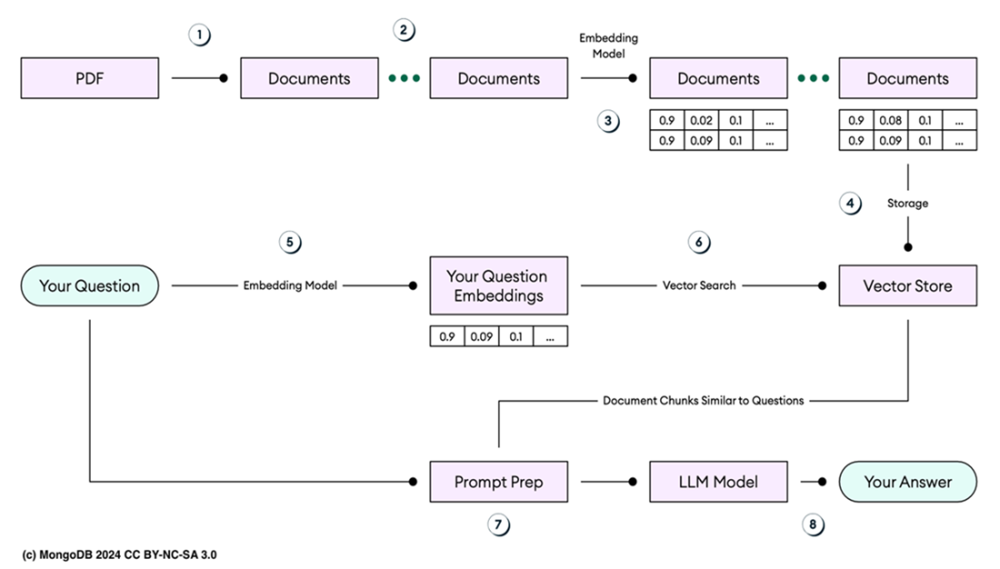
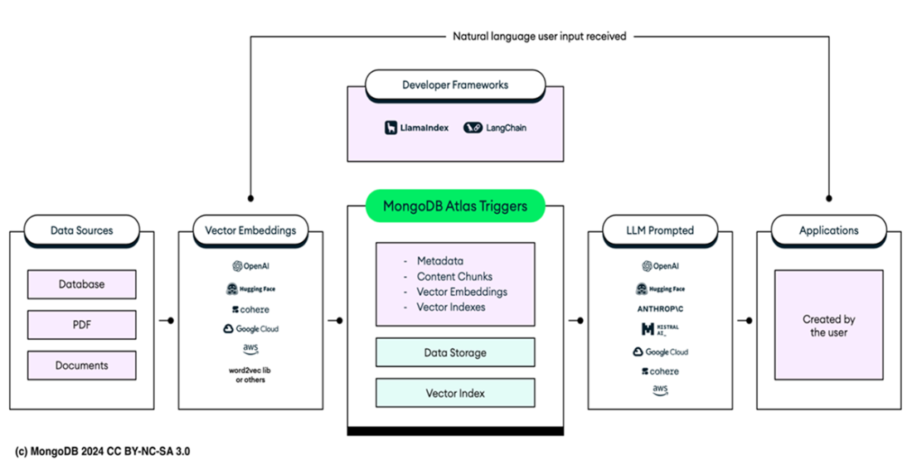

# Chapter 14: Building retrieval-augmented generation AI chatbots

This chapter covers building AI chatbots using **Retrieval-Augmented Generation (RAG)** to mitigate **hallucinations** in Large Language Models (LLMs) like GPT-4.

## 14.0 Introduction
*   **Hallucinations:** occur when LLMs generate incorrect or fabricated information because they rely on learned patterns rather than real-time facts.
*   **Solution (RAG):** Combines text generation with information retrieval. It uses a **vector database** (like Atlas Vector Search) to fetch relevant, up-to-date data (the "source of truth") and provides it as context to the LLM.

---

## 14.1 Gaining insight into retrieval-augmented generation
RAG ensures responses are grounded in verified data. Use cases include Chatbots, Customer Support, and Technical Assistance.


**Figure 14.1 (Description):** The RAG workflow involves converting documents into vectors, storing them, and retrieving relevant chunks to augment the LLM prompt.

**The 8-Step RAG Workflow:**
1.  **Source Documents:** Start with PDFs, Word docs, etc. (the "source of truth").
2.  **Chunking:** Parse and split documents into manageable chunks (e.g., paragraphs).
3.  **Embedding (Ingest):** Convert chunks into high-dimensional vectors using an embedding model.
4.  **Storage:** Store vectors in a **Vector Database** (Atlas Vector Search).
5.  **Query Embedding:** Convert the user's query into a vector using the *same* model.
6.  **Vector Search:** Find the most semantically similar document chunks in the DB.
7.  **Prompt Assembly:** Combine the user query + retrieved chunks into a context-rich prompt.
8.  **Generation:** The LLM generates an accurate response based on the augmented prompt.

---

## 14.2 Embedding LangChain into the RAG ecosystem
Building RAG apps manually is complex (managing embeddings, DB connections, context windows). **LangChain** orchestrates this process.

*   **Role:** Connects LLMs with external data sources (PDFs, DBs) and computational tools.
*   **Atlas Integration:** derived via `langchain-mongodb` package.
*   **Mongo-RAG Template:** A collaboration between MongoDB and LangChain to provide a reference architecture using OpenAI and Atlas Vector Search.


**Figure 14.2 (Description):** LangChain acts as the bridge. Data (PDFs/JSON) -> Embeddings (OpenAI) -> Stored in Atlas. User Query -> Retrieval -> LLM Prompt -> Response.

---

## 14.3 Getting started with AI chatbots
We will build a chatbot to answer questions about **MongoDB Atlas best practices** using a specific PDF as reliability context.

### 14.3.1 LangChain Framework Components
*   **`langchain-core`:** Base abstractions.
*   **`langchain-community`:** Third-party integrations.
*   **`langchain`:** Chains, agents, retrieval strategies.
*   **`LangGraph`:** For stateful, multi-actor applications (graph-based).
*   **`LangServe`:** Deploys chains as REST APIs (FastAPI based).
*   **`LangSmith`:** Platform for debugging, testing, and monitoring.

### 14.3.2 Starting with LangChain CLI
The CLI manages projects and templates.

**Installation:**
```bash
pip3 install -U langchain-cli
```

**Launch UI/Help:**
```bash

---

## 14.4 Creating AI powered MongoDB chatbot
We will use the **rag-mongo** template to bootstrap the project.

### 14.4.1 Setting up a new application
1.  **Create Project:**
    ```bash
    langchain app new mongodb-in-action --package rag-mongo
    # Installs template and creates directory structure
    ```
2.  **Directory Structure (Listing 14.1):**
    *   `app/server.py`: Server-side logic (FastAPI).
    *   `packages/rag-mongo/ingest.py`: Script for data ingestion.
    *   `packages/rag-mongo/rag_mongo/chain.py`: The RAG chain logic.

3.  **Modify `app/server.py`:**
    Add the route for the `rag_mongo` chain.
    ```python
    from fastapi import FastAPI
    from langserve import add_routes
    from rag_mongo import chain as rag_mongo_chain

    app = FastAPI()

    # Add the mongo-rag chain route
    add_routes(app, rag_mongo_chain, path="/rag-mongo")

    if __name__ == "__main__":
        import uvicorn
        uvicorn.run(app, host="0.0.0.0", port=8000)
    ```

### 14.4.2 Inserting embeddings to MongoDB Atlas
We need to ingest the "Source of Truth" (MongoDB Atlas Best Practices PDF) into the vector database.

**Configuration:**
*   **Database:** `langchain`
*   **Collection:** `mongodb`
*   **Index:** `default`
*   **Source URL:** `https://images.g2crowd.com/uploads/attachment/file/83340/atlas-best-practices.pdf`

**Listing: Data Ingestion Script (`packages/rag-mongo/ingest.py`)**
```python
import os
from langchain_community.document_loaders import PyPDFLoader
from langchain_openai import OpenAIEmbeddings
from langchain.text_splitter import RecursiveCharacterTextSplitter
from langchain_community.vectorstores import MongoDBAtlasVectorSearch
from pymongo import MongoClient

# Environment & Constants
MONGO_URI = os.environ["MONGO_URI"]
DB_NAME = "langchain"
COLLECTION_NAME = "mongodb"
ATLAS_VECTOR_SEARCH_INDEX_NAME = "default"

client = MongoClient(MONGO_URI)
db = client[DB_NAME]
MONGODB_COLLECTION = db[COLLECTION_NAME]

if __name__ == "__main__":
    # 1. Load PDF Document
    loader = PyPDFLoader("https://images.g2crowd.com/uploads/attachment/file/83340/atlas-best-practices.pdf")
    data = loader.load()

    # 2. Split Text into Chunks (500 chars)
    text_splitter = RecursiveCharacterTextSplitter(chunk_size=500, chunk_overlap=0)
    docs = text_splitter.split_documents(data)

    # 3. Create Embeddings & Insert into Atlas
    _ = MongoDBAtlasVectorSearch.from_documents(
        documents=docs,
        embedding=OpenAIEmbeddings(disallowed_special=()),
        collection=MONGODB_COLLECTION,
        index_name=ATLAS_VECTOR_SEARCH_INDEX_NAME,
    )
```

**Key Components:**
*   **`PyPDFLoader`**: Downloads and parses the PDF.
*   **`RecursiveCharacterTextSplitter`**: Breaks text into 500-character chunks for optimal embedding.
*   **`OpenAIEmbeddings`**: Converts chunks into vector representations.
*   **`MongoDBAtlasVectorSearch`**: Stores the vectors and metadata in the defined collection.

**Execution:**
1.  Export Keys:
    ```bash
    export OPENAI_API_KEY="sk-..."
    export MONGO_URI="mongodb://localhost:27017/?directConnection=true"
    ```
2.  Run Script:
    ```bash
    python3 ingest.py
    ```
3.  Verify:
    ```javascript
    use langchain
    db.mongodb.countDocuments() // Should be ~158
    db.mongodb.findOne() // Check for 'embedding' field
    ```

### 14.4.3 The RAG Chain Logic
The core logic resides in `packages/rag-mongo/rag_mongo/chain.py`.

**Listing: RAG Chain Implementation (`chain.py`)**
```python
import os
from langchain_openai import ChatOpenAI
from langchain_community.vectorstores import MongoDBAtlasVectorSearch
from langchain_core.output_parsers import StrOutputParser
from langchain_core.prompts import ChatPromptTemplate
from langchain_core.runnables import RunnableParallel, RunnablePassthrough
from pymongo import MongoClient
from langchain_openai import OpenAIEmbeddings

# Configuration
MONGO_URI = os.environ["MONGO_URI"]
DB_NAME = "langchain"
COLLECTION_NAME = "mongodb"
ATLAS_VECTOR_SEARCH_INDEX_NAME = "default"

# 1. Connect to Vector Store
vectorstore = MongoDBAtlasVectorSearch.from_connection_string(
    MONGO_URI,
    DB_NAME + "." + COLLECTION_NAME,
    OpenAIEmbeddings(disallowed_special=()),
    index_name=ATLAS_VECTOR_SEARCH_INDEX_NAME,
)
retriever = vectorstore.as_retriever(search_kwargs={"k": 1})

# 2. Define RAG Prompt
template = """Answer the question based only on the following context:
{context}
Question: {question}
"""
prompt = ChatPromptTemplate.from_template(template)

# 3. Model
model = ChatOpenAI()

# 4. The Chain
chain = (
    RunnableParallel({"context": retriever, "question": RunnablePassthrough()})
    | prompt
    | model
    | StrOutputParser()
)
```
*   **`RunnableParallel`**: Fetches context (retriever) AND passes question (passthrough) simultaneously.
*   **`vectorstore.as_retriever(k=1)`**: configuration to return top 1 most similar document to limit context size.

### 14.4.4 Creating Atlas Vector Search index
Define the index to match the `embedding` field (1536 dims, cosine similarity).

1.  **Definition (`vector-search.json`):**
    ```json
    {
      "name": "default",
      "type": "vectorSearch",
      "collectionName": "mongodb",
      "database": "langchain",
      "fields": [{
        "type": "vector",
        "path": "embedding",
        "numDimensions": 1536,
        "similarity": "cosine"
      }]
    }
    ```
2.  **Create via CLI:**
    ```bash
    atlas deployments search indexes create --file vector-search.json --type LOCAL
    ```
3.  **Verify:** `db.mongodb.getSearchIndexes()` -> Status: `READY`.

### 14.4.5 Testing chatbot with LangServe
**Start Server:**
```bash
langchain serve
```
*   **Access:** `http://127.0.0.1:8000/rag-mongo/playground/`

**Intermediate Steps (The "Black Box" revealed):**
1.  **RunnableParallel**: Splits input. Configures retrieval.
2.  **Retriever**: Queries Atlas Vector Search using embeddings. Returns relevant documents (Context).
3.  **RunnablePassthrough**: Forwards the question.
4.  **ChatPromptTemplate**: Combines Context + Question into the final prompt string.
5.  **ChatOpenAI**: Sends prompt to GPT-4. Generates response.
6.  **StrOutputParser**: Extracts the text string from the AI response object.

### 14.4.6 Communicating programmatically
Use `curl` to invoke the chain without the UI:
```bash
curl -X POST "http://127.0.0.1:8000/rag-mongo/invoke" \
  -H "Content-Type: application/json" \
  -d '{"input": "Explain how MongoDB Atlas uses encryption."}'
```
*   **Response:** JSON containing the answer generated by RAG.

---

## 14.5 Summary
*   **Hallucinations vs RAG:** LMMs hallucinate; RAG fixes this by retrieving facts from a Vector DB.
*   **LangChain:** The orchestrator. Connects LLMs (OpenAI) + Vectors (Atlas).
*   **Workflow:**
    1.  **Ingest:** PDF -> Chunks -> Embeddings -> Atlas.
    2.  **Search Index:** `vectorSearch` index on embedding field.
    3.  **Chain:** Retrieve -> Augmented Prompt -> Generate -> Parse.
*   **LangServe:** Deploys chains as APIs with built-in Playgrounds for transparent testing.


